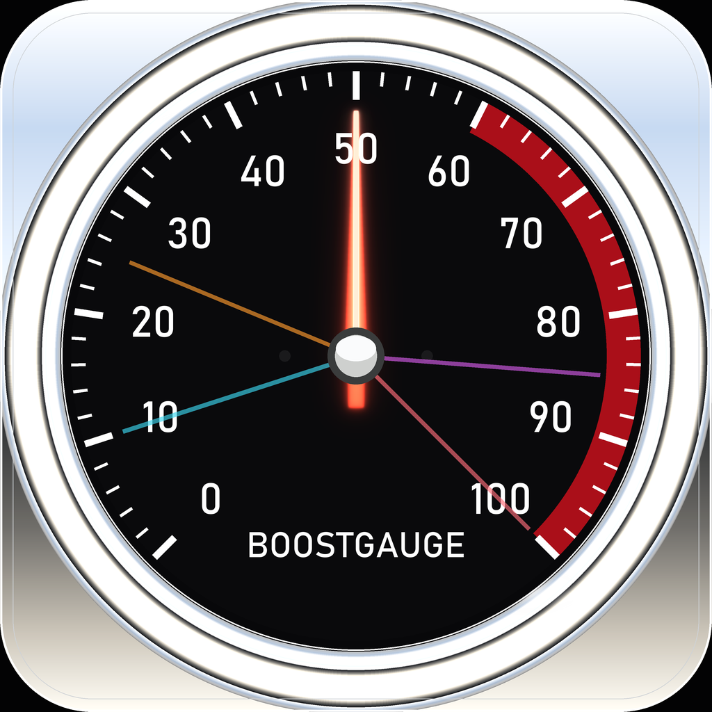

# boostgauge

> A racing tachometer for your machine — with peak-hold needles that show where you've been, not just where you are.



BoostGauge is a small always-on-top gauge for developers who run several AI coding sessions at once. It watches the resources those sessions quietly consume — console hosts (ConPTY), memory, processes, handles — folds them into one 0–100 reading, and holds the peaks on four **telltale** needles: the last minute, ten minutes, hour, and all-time. Glance at it after a burst of activity and the telltales still show how hot things got.

## Install and run

```
pip install boostgauge
boostgauge
```

Windows 11. Python 3.10 or later. The face uses the Bahnschrift font that ships with Windows (see #403 for bundling).

```
boostgauge [--theme dark|light|neon|classic] [--size PIXELS] [--poll SECONDS]
           [--opacity 0.0-1.0] [--no-topmost] [--config PATH] [--reset-config]
```

Command-line values govern the session and are never written to the config file.

## Using it

- **Drag** the gauge anywhere by its face. **Scroll** to resize. Both persist across restarts.
- **Hover** for the telltale key — which colour is which window. The gauge goes fully opaque while you hover.
- **Right-click** to reset any telltale (or all of them), toggle always-on-top, minimize to the tray, or quit.
- **Tray icon**: a dot that is green under 60, yellow from 60, red from 80. Click it to bring the gauge back.

The main needle shows the hottest of the four metrics, each normalized against its own yellow/red band: 60 on the dial is a metric at its yellow threshold, 100 is red. Any single resource can drive the reading to red; averaging would hide it, so the gauge takes the maximum.

| Needle | Window | Colour |
|---|---|---|
| main | now | candy-apple red, luminescent |
| telltale | 1 minute | cyan |
| telltale | 10 minutes | orange |
| telltale | 1 hour | magenta |
| telltale | all-time | coral red |

## Configuration

`%APPDATA%\boostgauge\config.json` (created on first run):

```json
{
  "polling_interval_seconds": 2,
  "theme": "dark",
  "size": 300,
  "opacity": 0.9,
  "always_on_top": true,
  "position": {"x": 100, "y": 100},
  "thresholds": {
    "conpty": {"yellow": 30, "red": 60},
    "memory_percent": {"yellow": 60, "red": 80},
    "process_count": {"yellow": 300, "red": 500},
    "handle_count": {"yellow": 30000, "red": 50000}
  },
  "telltale_windows": {"short": 60, "medium": 600, "long": 3600},
  "show_driver_label": true,
  "show_digital_readout": true,
  "show_session_count": true
}
```

The app writes this file at exactly three moments: first run, `--reset-config`, and quit — and at quit it writes only what you changed by hand (position, size), so edits you make to the file while it runs survive. Threshold edits take effect within five seconds without a restart; everything else applies at the next launch. A wrong value is refused with a message that names the key, what was expected, and what it found.

## How it measures

One system call per tick. `NtQuerySystemInformation` returns the name, pid and handle count of every process in about two milliseconds; console hosts are counted from that list, handles are summed from it, and command lines are read only for the handful of Python processes it identifies. The design is [ADR 0001](docs/adrs/0001-single-sweep-collection.md), amended after the psutil route it originally prescribed measured at 21 % of a core. A benchmark test holds the tick under 20 ms.

## Development

```
poetry install
poetry run pytest
```

The renderer produces a `PIL.Image`; tests assert pixels and never open a window. The operator-approved render is pinned under `tests/visual/baselines/` and the suite reproduces it byte for byte. Baselines change only under an explicit `pytest tests/visual/ --generate-baselines`, inspected and committed in the same PR ([test strategy](docs/design/0001-test-strategy.md)). The face is bound by a [numeric render contract](docs/design/0002-aesthetic-v1-stingray.md).

Render the face yourself:

```
poetry run python -m boostgauge.skins.stingray --size 1024 --value 75 --peaks 10,25,85,100 --out face.png
```

This project follows [AssemblyZero](https://github.com/martymcenroe/AssemblyZero) conventions — worktree isolation, pre-merge gates, session logging — and its issues carry the decision tables the code was built to.

## License

MIT — see LICENSE.
