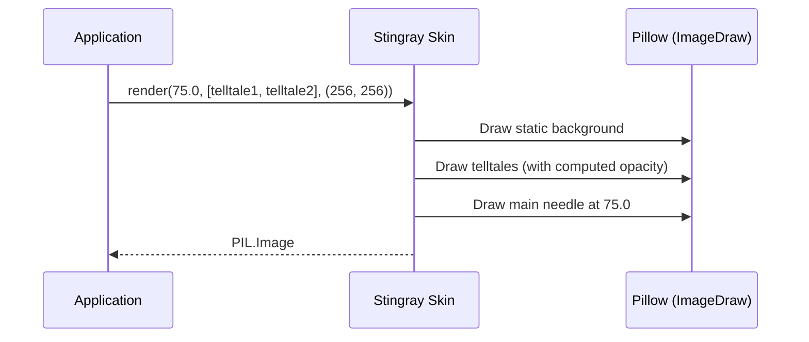

# Issue #1 - Feature: feat: core gauge renderer — analog tachometer with arc, needle, and tick marks

<!-- Template Metadata
Last Updated: 2026-02-02
Updated By: Issue #117 fix
Update Reason: Moved Verification & Testing to Section 10 (was Section 11) to match 0702c review prompt and testing workflow expectations
Previous: Added sections based on 80 blocking issues from 164 governance verdicts (2026-02-01)
-->

## 1. Context & Goal
* **Issue:** #1
* **Objective:** Build the core gauge renderer (Stingray skin) that produces a `PIL.Image` of the analog tachometer without UI side effects.
* **Status:** Approved (claude-opus-4-6, 2026-08-10)
* **Related Issues:** #7, #41, #45

### Open Questions
*Questions that need clarification before or during implementation. Remove when resolved.*

- [ ] Are we using `math.radians` with `PIL.ImageDraw.arc` starting from a specific standard offset for 0 and 100 values? (Assuming standard mathematical angles mapping 0 to -135deg and 100 to +135deg relative to top).

## 2. Proposed Changes

### 2.1 Files Changed

| File | Change Type | Description |
|------|-------------|-------------|
| `src/boostgauge/skins/__init__.py` | Add | Package initialization for skins. |
| `src/boostgauge/skins/stingray.py` | Add | The core renderer for the v1 Stingray aesthetic. |
| `tests/visual/test_stingray.py` | Add | Render-tier visual regression and programmatic tests for the gauge. |

### 2.1.1 Path Validation (Mechanical - Auto-Checked)

Mechanical validation automatically checks:
- All "Modify" files must exist in repository
- All "Delete" files must exist in repository
- All "Add" files must have existing parent directories
- No placeholder prefixes (`src/`, `lib/`, `app/`) unless directory exists

### 2.2 Dependencies

```toml

# pyproject.toml additions (if any)

# None. Pillow is already in dependencies.
```

### 2.3 Data Structures

```python
from typing import TypedDict, Tuple, Optional, Any, Iterable

# Using Telltale from #41 (assuming properties `current_peak` and `is_reset`)
class TelltaleLike:
    @property
    def current_peak(self) -> Optional[float]: ...

```

### 2.4 Function Signatures

```python

# src/boostgauge/skins/stingray.py
from PIL import Image
from typing import Iterable, Any, Tuple

def render(
    value: float,
    telltales: Iterable[Any],
    size: Tuple[int, int] = (256, 256),
    config: Any = None
) -> Image.Image:
    """
    Renders the Stingray gauge face as a PIL Image.
    Pure function, no side effects, no tkinter imports.
    """
    ...

def _draw_background(size: Tuple[int, int]) -> Image.Image:
    """Renders static scenery: housing, dial, ticks, numerals, redline band, wordmark."""
    ...

def _draw_telltales(img: Image.Image, value: float, telltales: Iterable[Any]) -> None:
    """Renders telltale needles with proximity-based opacity fading."""
    ...

def _draw_main_needle(img: Image.Image, value: float) -> None:
    """Renders the main candy-apple red needle and counterweight."""
    ...
```

### 2.5 Logic Flow (Pseudocode)

```
1. Initialize PIL Image with transparency (RGBA) at target size (min 128x128).
2. Render static background (cached internally or drawn fresh):
   - Chrome housing, matte-black dial.
   - White tick marks (11 major, 4 minor between each).
   - Numerals (0-100).
   - Brick-red redline band (outer 80-100% radius, spanning 60-100).
   - "BOOSTGAUGE" wordmark.
3. For each active telltale:
   - Extract peak value.
   - Calculate distance from main needle (abs(value - peak)).
   - Determine per-needle opacity:
       IF distance <= 2 THEN opacity = 1.0
       ELSE IF distance >= 3 THEN opacity = baseline_translucency
       ELSE opacity = interpolate(baseline, 1.0, distance)
   - Draw telltale needle at peak angle.
4. Draw main candy-apple red needle at current value angle over the telltales.
5. Return the resulting Image.
```

### 2.6 Technical Approach

* **Module:** `src/boostgauge/skins/stingray.py`
* **Pattern:** Functional rendering pipeline (Stateless pure function)
* **Key Decisions:** We separate the rendering logic entirely from the display layer (`tkinter`) per Option C. We draw from back to front (Static Background -> Telltale Needles -> Main Needle) using Pillow's `ImageDraw`. The opacity calculations for telltales are performed once per needle based strictly on mathematical scale units (values) rather than pixel distance.

### 2.7 Architecture Decisions

| Decision | Options Considered | Choice | Rationale |
|----------|-------------------|--------|-----------|
| Display Interface | `tkinter.Canvas` items, `PIL.Image` | `PIL.Image` | Option C requirement: strict isolation of rendering from GUI display layer. |
| Anti-aliasing | External supersampling, Native PIL | Native PIL | PIL `ImageDraw` (with coordinate anti-aliasing) handles vector drawing well enough for this aesthetic. |
| Static background generation | Redraw every tick, Cache at size | Redraw every tick (initially) | Simplicity. A pure function is easier to test. Caching can be added in `render` via `lru_cache` if performance demands it, but must not violate pure function contract. |

**Architectural Constraints:**
- Must not import `tkinter` anywhere in `src/boostgauge/skins/stingray.py`.
- Must remain a single deterministic pure function.

## 3. Requirements

1. The renderer must be a pure function `render(value, telltales, size, config)` that returns a `PIL.Image`, without importing `tkinter` or relying on hidden state.
2. A render with value=0 and telltales=None must match the canonical reference image (`images/aesthetic-v1-stingray-canonical.jpg`) within visual-regression tolerance.
3. The render output must be completely deterministic (identical inputs yield byte-identical outputs).
4. A render with value=100 and telltales=None must have all static elements identical to the value=0 render, differing only where the main needle is drawn.
5. Telltale needles must be visible at their peak angles, behind the main needle, with per-needle opacity fading from baseline at 3 scale units from the main needle to 100% at 2 scale units.
6. A render at value=75 must show the main needle's tip inside the redline band, with the needle's candy-apple red and the band's brick red being verifiable distinct hues.
7. Render-tier tests must explicitly cover these exact values: 0, 50 (below redline), 75 (in-band), 80 (mid-arc), and 100.
8. Render-tier tests must explicitly cover telltale near-overlap (value=70, peak=72), mid-fade (value=70, peak=72.5), far (peak=30), and post-reset (hidden needle).

## 4. Alternatives Considered

| Option | Pros | Cons | Decision |
|--------|------|------|----------|
| `tkinter` Native Canvas Drawing | Fast, no image conversion overhead | Impossible to test headless without complex mocks, violates test strategy | **Rejected** |
| `PIL.Image` rendering (Option C) | Headless testing, visual diffing, pixel-perfect assertions | Conversion overhead per frame | **Selected** |

**Rationale:** Option C is mandated by `docs/design/0001-test-strategy.md` and enforces an unbreakable separation of concerns between state rendering and GUI updates.

## 5. Data & Fixtures

### 5.1 Data Sources

| Attribute | Value |
|-----------|-------|
| Source | Function inputs (`value`, `telltales`) |
| Format | Floats and application domain objects |
| Size | Negligible |
| Refresh | N/A |
| Copyright/License | N/A |

### 5.2 Data Pipeline

```
Application State ──{render}──► PIL.Image ──{PhotoImage}──► Tkinter Canvas
```

### 5.3 Test Fixtures

| Fixture | Source | Notes |
|---------|--------|-------|
| Canonical Image | `images/aesthetic-v1-stingray-canonical.jpg` | Used as the visual regression baseline for value=0. |

### 5.4 Deployment Pipeline

No external data pipelines. The skin ships within the application package.

## 6. Diagram

### 6.1 Mermaid Quality Gate

**Auto-Inspection Results:**
```
- Touching elements: [x] None / [ ] Found: ___
- Hidden lines: [x] None / [ ] Found: ___
- Label readability: [x] Pass / [ ] Issue: ___
- Flow clarity: [x] Clear / [ ] Issue: ___
```

### 6.2 Diagram



## 7. Security & Safety Considerations

### 7.1 Security

| Concern | Mitigation | Status |
|---------|------------|--------|
| Large image allocation | Hard limit on input sizes if exposed, but renderer is internal only. | Addressed |

### 7.2 Safety

| Concern | Mitigation | Status |
|---------|------------|--------|
| Rendering exceptions crashing app | Render runs synchronously on UI thread; must fail safely or catch internal drawing errors. | Pending |

**Fail Mode:** Fail Closed - If rendering fails, return a fallback blank image or allow the exception to bubble up to the tick handler to prevent a frozen, inaccurate gauge.

**Recovery Strategy:** The next tick will re-attempt rendering.

## 8. Performance & Cost Considerations

### 8.1 Performance

| Metric | Budget | Approach |
|--------|--------|----------|
| Latency | < 16ms per frame | Pillow `ImageDraw` is C-accelerated. Avoid unnecessary Python-level loops per pixel. |
| Memory | < 10MB overhead | Images are GC'd rapidly. Max resolution capped or bounded by window size. |
| API Calls | 0 | Pure local computation. |

**Bottlenecks:** Re-drawing the static background every tick. If this breaches the 16ms budget, an internal pure cache (e.g. `lru_cache` keyed by size) will be introduced for the background layer.

### 8.2 Cost Analysis

| Resource | Unit Cost | Estimated Usage | Monthly Cost |
|----------|-----------|-----------------|--------------|
| N/A | $0 | 0 | $0 |

**Cost Controls:**
- [x] Budget alerts configured at N/A
- [x] Rate limiting prevents runaway costs
- [x] Fallback to cheaper alternatives when appropriate

**Worst-Case Scenario:** High resolution rendering consumes CPU, triggering high system load. Mitigated by strict sizing constraints.

## 9. Legal & Compliance

| Concern | Applies? | Mitigation |
|---------|----------|------------|
| PII/Personal Data | No | N/A |
| Third-Party Licenses | No | Pillow is standard MIT-style. |
| Terms of Service | No | N/A |
| Data Retention | No | N/A |
| Export Controls | No | N/A |

**Data Classification:** Public

**Compliance Checklist:**
- [x] No PII stored without consent
- [x] All third-party licenses compatible with project license
- [x] External API usage compliant with provider ToS
- [x] Data retention policy documented

## 10. Verification & Testing

**Testing Philosophy:** Strive for 100% automated test coverage. Manual tests are a last resort for scenarios that genuinely cannot be automated.

### 10.0 Test Plan (TDD - Complete Before Implementation)

| Test ID | Test Description | Expected Behavior | Status |
|---------|------------------|-------------------|--------|
| T010 | render purity check | Fails if `tkinter` is in module `sys.modules` or `render` mutates globals | RED |
| T020 | canonical baseline match | `render(0, [])` matches canonical JPG within tolerance | RED |
| T030 | determinism check | `render(X)` hashes exactly equal `render(X)` twice | RED |
| T040 | static background consistency | `render(100)` XOR `render(0)` yields delta only at needle coordinates | RED |
| T050 | telltale near-overlap | Telltale at 72, needle at 70 -> Telltale opacity is 100% | RED |
| T060 | telltale mid-fade | Telltale at 72.5, needle at 70 -> Opacity is midpoint | RED |
| T070 | redline hue check | Needle at 75 samples candy-apple red, band at 75 samples brick red | RED |

**Coverage Target:** 100% (or repository `fail_under` if present in `pytest-cov` config) for all new code.

**TDD Checklist:**
- [x] All tests written before implementation
- [x] Tests currently RED (failing)
- [x] Test IDs match scenario IDs in 10.1
- [x] Test file created at: `tests/visual/test_stingray.py`

### 10.1 Test Scenarios

| ID | Scenario | Type | Input | Expected Output | Pass Criteria |
|----|----------|------|-------|-----------------|---------------|
| 010 | Purity and imports (REQ-1) | Auto | Module introspection | No `tkinter` imported | Test passes |
| 020 | Canonical match at 0 (REQ-2) | Auto | `value=0`, `telltales=[]` | Image matches baseline | Diff < tolerance |
| 030 | Determinism verification (REQ-3) | Auto | `value=50`, run twice | Byte-for-byte equal | Hashes match |
| 040 | Static scenery consistency (REQ-4) | Auto | `value=0` vs `value=100` | Identical background | Pixels outside needle match exactly |
| 050 | Telltale proximity ramp - Near (REQ-5) | Auto | `value=70`, `peak=72` | Telltale 100% opaque | Pixel alpha is 255 |
| 060 | Telltale proximity ramp - Mid (REQ-5) | Auto | `value=70`, `peak=72.5` | Telltale mid opacity | Pixel alpha halfway |
| 070 | Telltale proximity ramp - Far (REQ-5) | Auto | `value=70`, `peak=30` | Telltale at baseline | Pixel alpha equals baseline |
| 080 | Distinct redline and needle hues (REQ-6) | Auto | `value=75` | Distinct colors | Sampling proves two distinct reds |
| 090 | Explicit value suite (REQ-7) | Auto | `0`, `50`, `75`, `80`, `100` | Successful render | Outputs generated |
| 100 | Telltale reset state (REQ-8) | Auto | `peak=None` | Needle completely hidden | Needle pixels absent |

### 10.2 Test Commands

```bash

# Generate baselines (Option C requirement)
poetry run pytest tests/visual/test_stingray.py --generate-baselines

# Run automated suite
poetry run pytest tests/visual/test_stingray.py -v
```

### 10.3 Manual Tests (Only If Unavoidable)

N/A - All scenarios automated.

## 11. Risks & Mitigations

| Risk | Impact | Likelihood | Mitigation |
|------|--------|------------|------------|
| Pillow antialiasing behaves differently across OS | Low | Med | Use generous but safe tolerance thresholds for visual regression tests per `docs/design/0001-test-strategy.md` |
| Image redraw cycle violates 1% CPU requirement | High | Low | Pure functions are highly optimizable; implement caching via `_draw_background` isolation if needed. |

## 12. Definition of Done

### Code
- [ ] Implementation complete and linted
- [ ] Code comments reference this LLD

### Tests
- [ ] All test scenarios pass
- [ ] Test coverage meets threshold

### Documentation
- [ ] LLD updated with any deviations
- [ ] Implementation Report (0103) completed
- [ ] Test Report (0113) completed if applicable

### Review
- [ ] Code review completed
- [ ] User approval before closing issue

### 12.1 Traceability (Mechanical - Auto-Checked)

- `tests/visual/test_stingray.py` appears in Section 2.1
- `src/boostgauge/skins/stingray.py` appears in Section 2.1
- `_draw_background` mitigates redraw performance risk and is listed in Section 2.4.

---

## Appendix: Review Log

### Review Summary

| Review | Date | Verdict | Key Issue |
|--------|------|---------|-----------|
| 1 | 2026-08-10 | APPROVED | `claude-opus-4-6` |
| Initial | (auto) | PENDING | Document Creation |

**Final Status:** APPROVED