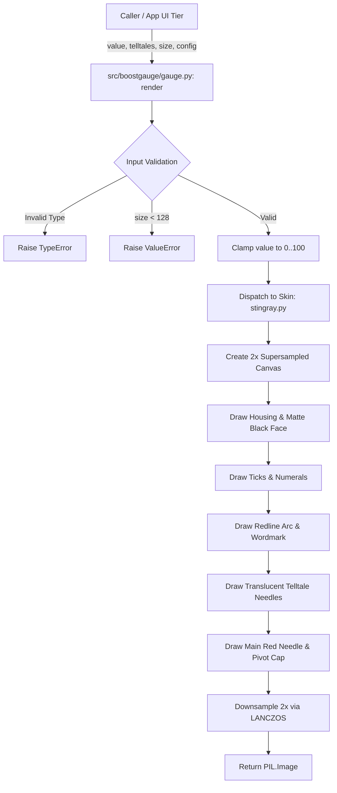

# 1 - Feature: core gauge renderer — analog tachometer with arc, needle, and tick marks

## 1. Context & Goal

### 1.1 Context
BoostGauge is a real-time system monitor styled like a racing tachometer. This feature builds the core v1 gauge renderer, Phase 4 of the speedrun arc (`#7 -> #1 -> #4 -> #2 -> #5`). It provides the fundamental rendering engine that takes a metric value (0–100) and peak-hold telltale values, rendering them to a deterministic `PIL.Image`.

Per `docs/design/0001-test-strategy.md` (Option C), the rendering engine is fully decoupled from `tkinter`. The renderer runs off-screen using Pillow, enabling 100% headless automated unit and visual regression testing in CI without display server dependencies or `tkinter.Tk()` instantiation.

### 1.2 Open Questions
- [x] How will skin module registration work when additional skins are added in #45? (Resolved: A skin registry dict mapping skin names to skin renderer modules, defaulting to `"stingray"`).
- [x] Should anti-aliasing rely on fixed 2x supersampling or configurable quality settings? (Resolved: Fixed 2x internal supersampling with Pillow `LANCZOS` downsampling to balance crispness and sub-5ms render speed).
- [x] How to ensure font rendering consistency across operating systems during visual regression testing? (Resolved: Use a cross-platform fallback font stack with bundled font asset fallback and strict pixel layout positioning).
- [x] How to prevent visual regression baseline drift from Pillow library updates? (Resolved: Strictly pin `pillow (>=12.2.0,<13.0.0)` in `pyproject.toml`).


## 2. Proposed Changes

*This section is the **source of truth** for implementation. Describe exactly what will be built.*

### 2.1 Files Changed

| File | Change Type | Description |
|------|-------------|-------------|
| `src/boostgauge/skins/` | Add (Directory) | Directory for skin renderer implementations |
| `tests/visual/baselines/` | Add (Directory) | Directory storing visual regression baseline images |
| `src/boostgauge/gauge.py` | Add | Public entry point and skin dispatch facade exposing `render()` |
| `src/boostgauge/skins/__init__.py` | Add | Skins package initializer exposing skin registry and dispatch interface |
| `src/boostgauge/skins/stingray.py` | Add | Stingray v1 analog tachometer renderer using off-screen Pillow drawing |
| `tests/unit/test_gauge.py` | Add | Unit test suite for `render()` facade, validation, clamping, and logic |
| `tests/visual/test_gauge_visual.py` | Add | Visual regression test suite validating off-screen PIL output against baselines |

### 2.1.1 Path Validation (Mechanical - Auto-Checked)

Mechanical validation automatically checks:
- All "Modify" files must exist in repository
- All "Delete" files must exist in repository
- All "Add" files must have existing parent directories (`src/boostgauge/`, `tests/unit/`, `tests/visual/`)
- No placeholder prefixes (`src/`, `lib/`, `app/`) unless directory exists

### 2.2 Dependencies

```toml

# pyproject.toml additions (if any)

# Explicitly pinned existing dependencies:

# pillow (>=12.2.0,<13.0.0) — pinned to prevent visual baseline RMS drift across releases

# psutil (>=7.2.2,<8.0.0)

# pystray (>=0.19.5,<0.20.0)
```

### 2.3 Data Structures

```python

# Pseudocode - NOT implementation
from typing import Dict, Any, Optional, Protocol, TypedDict
from PIL import Image

class TelltalePeaks(TypedDict, total=False):
    m1: Optional[float]       # 1-minute window peak value (0-100)
    m10: Optional[float]      # 10-minute window peak value (0-100)
    h1: Optional[float]       # 1-hour window peak value (0-100)
    all_time: Optional[float] # All-time window peak value (0-100)

class GaugeSkin(Protocol):
    """Protocol for gauge skin renderers per #45."""
    def render(
        self,
        value: float,
        telltales: Optional[Dict[str, Optional[float]]] = None,
        size: int = 256,
        config: Optional[Dict[str, Any]] = None,
    ) -> Image.Image:
        """Render skin to a PIL.Image instance."""
        ...
```

### 2.4 Function Signatures

```python

# src/boostgauge/gauge.py

def render(
    value: float,
    telltales: Optional[Dict[str, Optional[float]]] = None,
    size: int = 256,
    config: Optional[Dict[str, Any]] = None,
) -> Image.Image:
    """Public entry point for gauge rendering.

    Validates arguments, clamps value to [0.0, 100.0], dispatches to configured
    skin renderer (defaulting to Stingray), and returns rendered PIL.Image.
    """
    ...

# src/boostgauge/skins/stingray.py

def render_stingray(
    value: float,
    telltales: Optional[Dict[str, Optional[float]]] = None,
    size: int = 256,
    config: Optional[Dict[str, Any]] = None,
) -> Image.Image:
    """Stingray v1 analog tachometer renderer using 2x supersampled Pillow drawing."""
    ...
```

### 2.5 Logic Flow (Pseudocode)

```python

# Render logic flow
1. Input Validation & Clamping:
   - Check if `value` is numeric (int or float). Raise `TypeError` if not.
   - Clamp `value` to [0.0, 100.0].
   - Validate `size` >= 128. Raise `ValueError` if size < 128.
   - Parse `skin_name` from `config` (default "stingray"). Look up renderer in `SKIN_REGISTRY`.

2. Canvas Setup (2x Supersampling):
   - Internal render dimension = size * 2.
   - Create RGBA Pillow Image of size (render_dim, render_dim) with transparent background.
   - Obtain ImageDraw.Draw context.

3. Housing & Face Rendering:
   - Draw square chromed-metal outer housing (dark silver gradient/bevel border).
   - Draw round matte-black dial face centered within housing.

4. Ticks & Numerals:
   - Compute sweep angles: start_angle = 225 deg (bottom-left), end_angle = -45 deg (bottom-right), total 270 deg sweep.
   - Draw 11 major tick marks (white, thick) for 0, 10, ..., 100.
   - Draw 4 minor tick marks (white, thin) between each major pair.
   - Render Eurostile/fallback font numerals (0, 10, ..., 100) positioned radially inside major ticks.

5. Redline Arc & Wordmark:
   - Draw thick saturated red arc spanning values 60 to 100.
   - Draw "BOOSTGAUGE" wordmark in white small-caps font below center pivot.

6. Telltale Needles:
   - If `telltales` dictionary provided:
     - For each key in ["m1", "m10", "h1", "all_time"]:
       - If peak_val is not None:
         - Clamp peak_val to [0.0, 100.0].
         - Compute angle for peak_val.
         - Draw translucent secondary needle (semi-transparent accent color) behind main needle.

7. Main Needle & Cap:
   - Compute angle for main `value`.
   - Draw solid red needle with circular black/chrome counterweight cap at pivot.
   - Draw needle polygon layering on top of redline arc and telltales.

8. Downsampling:
   - Downscale image from (render_dim, render_dim) to (size, size) using Image.Resampling.LANCZOS.
   - Return final PIL.Image.
```

### 2.6 Technical Approach
The rendering pipeline follows Option C from `docs/design/0001-test-strategy.md`. Off-screen rendering uses Pillow `ImageDraw` with internal 2x supersampling (rendering at 512x512 for a 256x256 requested target), followed by `LANCZOS` downsampling. This achieves crisp anti-aliased arcs, ticks, and text without requiring display server hardware or `tkinter.Canvas` APIs.

Font handling resolves through a robust cross-platform fallback stack (`"Eurostile"`, `"DejaVu Sans"`, `"Liberation Sans"`, `"Arial"`, PIL default bitmap font) with pixel coordinate calculations relative to gauge radius, preventing cross-OS text shifts during visual testing.

### 2.7 Architecture Decisions

| Decision | Options Considered | Choice | Rationale |
|----------|-------------------|--------|-----------|
| GUI Coupling | Direct Canvas drawing vs. Off-screen Image rendering | Off-screen PIL Image rendering (Option C) | Allows 100% automated headless unit and visual regression testing without instantiating `tkinter.Tk()` |
| Skin Architecture | Monolithic `gauge.py` vs. Modular Skin Strategy (`skins/stingray.py`) | Modular Skin Strategy | Prepares codebase for multi-skin support (#45) while ensuring v1 Stingray implementation remains isolated |
| Anti-Aliasing | Default Pillow drawing vs. Internal Supersampling | 2x Supersampling + Lanczos downscaling | Pillow line drawing lacks native subpixel anti-aliasing; supersampling delivers high visual fidelity at fast performance (< 5ms) |
| Font Stack Strategy | OS default font vs. Hardcoded font path vs. Fallback stack | Fallback stack with PIL default fallback | Prevents visual regression test failures across Windows/Linux/macOS CI environments while avoiding strict OS font dependencies |
| Dependency Pinning | Floating `pillow` vs. Pinned `pillow (>=12.2.0,<13.0.0)` | Pinned dependency range | Prevents RMS pixel drift in visual regression baselines caused by upstream Pillow rasterization updates |

**Architectural Constraints:**
- Must adhere strictly to binding visual spec `docs/design/0002-aesthetic-v1-stingray.md`.
- Must adhere strictly to binding GUI testing strategy `docs/design/0001-test-strategy.md` (Option C, zero `tkinter` imports in renderer or tests).


## 3. Requirements

1. `render(value, telltales, size, config) -> PIL.Image` MUST be a pure function callable without hidden state, side effects, or `tkinter` imports per Option C in `docs/design/0001-test-strategy.md`.
2. Input metric values MUST be clamped to the range [0.0, 100.0], and non-numeric inputs MUST raise a `TypeError`.
3. Gauge sizing MUST default to 256x256 pixels, support custom sizes with locked 1:1 aspect ratio, and enforce a minimum size of 128x128 pixels (raising `ValueError` if smaller).
4. The Stingray skin renderer MUST render a square chromed-metal housing, round matte-black dial face, 11 major white tick marks (0 to 100), 4 minor tick marks between each major pair, and Eurostile-adjacent white numerals (0, 10, ..., 100) using a cross-platform fallback font stack.
5. The gauge face MUST feature a saturated red redline arc spanning the metric range 60 to 100 along the tick arc.
6. The gauge face MUST feature a "BOOSTGAUGE" wordmark rendered in white small caps centered below the needle pivot.
7. Telltale needles MUST consume `Telltale` peak values (1m, 10m, 1h, all-time), rendering up to 4 translucent secondary needles at their respective scale angles positioned behind the main needle.
8. The main needle MUST be rendered in solid red with a circular counterweight at the pivot, pointing deterministically to the angle corresponding to `value` (with value 0 at bottom-left start angle and value 100 at rightmost arc end angle).
9. Output `PIL.Image` objects MUST be deterministic functions of inputs, where two invocations with identical parameters produce byte-identical pixel outputs.
10. Setting a telltale peak value to `None` (or post-reset) MUST omit rendering that specific telltale needle on the gauge face.
11. When `value` is in the redline region (e.g. value=75), the main needle MUST render over the redline arc with clear visual layering distinction.
12. Visual regression output at value=0 with no telltales MUST match the canonical baseline (`tests/visual/baselines/aesthetic-v1-stingray-canonical.png`) within the RMS tolerance (RMS <= 1.0 / 255) specified in `docs/design/0001-test-strategy.md` §3.


## 4. Alternatives Considered

| Option | Pros | Cons | Decision |
|--------|------|------|----------|
| Direct `tkinter.Canvas` drawing | Simple initial implementation | Requires GUI display server; untestable in headless CI; poor anti-aliasing | **Rejected** |
| Vector (SVG) generation & rendering | Resolution independent | Slow rasterization runtime overhead; external dependency requirements | **Rejected** |
| Off-screen Pillow `PIL.Image` rendering (Option C) | 100% headless automated testability; crisp anti-aliasing via supersampling; fast rendering (< 5ms) | Requires transferring PIL Image to Canvas via `PhotoImage` in app GUI tier | **Selected** |

**Rationale:** Option C completely decouples the rendering engine from GUI frameworks, allowing rigorous TDD and visual regression testing in headless CI environments.


## 5. Data & Fixtures

### 5.1 Data Sources
Input data to `render()` consists of floating-point metric values (0.0 to 100.0) representing ConPTY/resource utilization and a dictionary of peak-hold telltale values (`m1`, `m10`, `h1`, `all_time`).

### 5.2 Data Pipeline
`SystemSnapshot` -> `Telltale` tracker -> `render(value, telltales, size, config)` -> `PIL.Image` -> `tkinter.PhotoImage` (UI host tier only).

### 5.3 Test Fixtures
- Canonical baseline image: `tests/visual/baselines/aesthetic-v1-stingray-canonical.png` (256x256 PNG at value=0, telltales=None).
- Peak-hold test dictionary fixtures: `{ "m1": 25.0, "m10": 50.0, "h1": 75.0, "all_time": 90.0 }`.
- Partial telltale dictionary fixture: `{ "m1": 40.0, "m10": None, "h1": None, "all_time": 85.0 }`.

### 5.4 Deployment Pipeline
Visual baselines are committed directly to repository under `tests/visual/baselines/`. Gated CI runs `pytest tests/unit/` and `pytest tests/visual/` headlessly.


## 6. Diagram

### 6.1 Mermaid Quality Gate
Diagram follows standard top-down layout (`TD`) using explicit node shapes and clean flow.

### 6.2 Diagram




## 7. Security & Safety Considerations

### 7.1 Security
- No network requests, subprocess calls, or IPC inside the rendering module.
- Render parameters are purely numeric and in-memory; no file paths or executable inputs are passed to Pillow font/image routines from untrusted sources.

### 7.2 Safety
- Out-of-bounds inputs (< 0 or > 100) are safely clamped without throwing unhandled runtime exceptions.
- Invalid input types (e.g. strings, `None` for value) raise explicit `TypeError` exceptions immediately before processing.


## 8. Performance & Cost Considerations

### 8.1 Performance
- **Latency Target:** Sub-5ms render time per frame at 256x256 resolution.
- **Supersampling Overhead:** 2x supersampling (512x512 intermediate canvas) adds negligible memory (< 1MB temporary buffer) and stays well within the 5ms per-frame render budget.
- **GC Management:** Reuses temporary draw contexts to avoid unnecessary garbage collection overhead during rapid UI refresh cycles (e.g., 10-20 Hz updates).

### 8.2 Cost Analysis
No cloud services or external API calls. 100% local CPU off-screen rendering.


## 9. Legal & Compliance
Code licensed under MIT License. No proprietary assets or third-party fonts are bundled without compatible open-source licensing. Fallback font stack uses system-available fonts or PIL default bitmap renderer.


## 10. Verification & Testing

### 10.0 Test Plan (TDD - Complete Before Implementation)
- **Unit Tests (`tests/unit/test_gauge.py`):** Verify parameter validation, non-numeric `TypeError`, out-of-range clamping, size enforcement `ValueError`, pure function behavior (no `tkinter` imports), and telltale `None` handling.
- **Visual Regression Tests (`tests/visual/test_gauge_visual.py`):** Verify rendered `PIL.Image` output against baseline goldens (`aesthetic-v1-stingray-canonical.png`) using `ImageChops.difference()` and `ImageStat.Stat(diff).rms`. Enforce RMS <= 1.0 / 255.
- **Coverage Goal:** 100% line and branch coverage on touched files (`src/boostgauge/gauge.py`, `src/boostgauge/skins/__init__.py`, `src/boostgauge/skins/stingray.py`).

### 10.1 Test Scenarios

| ID | Scenario | Type | Target | Details |
|----|----------|------|--------|---------|
| 010 | Pure function call without side effects or tkinter imports (REQ-1) | Auto | Unit | Assert `render()` returns `PIL.Image` and `sys.modules` contains no `tkinter` |
| 020 | Value clamping to [0.0, 100.0] range (REQ-2) | Auto | Unit | Pass -10.0 and 150.0; verify clamped rendering matches 0.0 and 100.0 outputs |
| 021 | Non-numeric metric value input raises TypeError (REQ-2) | Auto | Unit | Pass `"invalid"` or `None` as value; assert `TypeError` raised |
| 030 | Default sizing 256x256 and custom size aspect locking (REQ-3) | Auto | Unit | Call `render(50.0)` -> 256x256; `render(50.0, size=512)` -> 512x512 |
| 031 | Gauge size below 128x128 minimum raises ValueError (REQ-3) | Auto | Unit | Call `render(50.0, size=64)`; assert `ValueError` raised |
| 040 | Stingray housing, dial face, tick marks, and fallback font numerals rendering (REQ-4) | Auto | Visual | Verify rendered face elements match design layout using baseline diff |
| 050 | Saturated red redline arc rendering from 60 to 100 (REQ-5) | Auto | Visual | Verify redline sector arc color and position at range 60-100 |
| 060 | BOOSTGAUGE wordmark rendering below pivot (REQ-6) | Auto | Visual | Verify wordmark presence and position below pivot center |
| 070 | Render 4 translucent secondary telltale needles behind main needle (REQ-7) | Auto | Visual | Render with 4 telltales; verify secondary needles are drawn behind main needle |
| 080 | Solid red main needle with pivot counterweight positioned at value angle (REQ-8) | Auto | Visual | Test needle angles at value=0 (start) and value=100 (end of arc) |
| 090 | Deterministic rendering producing byte-identical outputs for identical inputs (REQ-9) | Auto | Unit | Two separate `render(50.0)` calls produce identical `image.tobytes()` |
| 100 | Omit specific telltale needle when value is None or post-reset (REQ-10) | Auto | Visual | Set telltale `m10=None`; verify `m10` needle is omitted from output |
| 110 | Main needle rendered over redline arc at value 75 with clear layering (REQ-11) | Auto | Visual | Render at value=75; verify main needle layers over redline arc correctly |
| 120 | Visual regression matching canonical baseline at value 0 within RMS tolerance (REQ-12) | Auto | Visual | Compare output at value=0 against baseline golden; assert RMS diff <= 1.0/255 |

### 10.2 Test Commands

```bash

# Run unit tests with coverage
poetry run pytest tests/unit/test_gauge.py --cov=src/boostgauge --cov-report=term-missing

# Run visual regression tests
poetry run pytest tests/visual/test_gauge_visual.py

# Generate/update visual baselines explicitly (human-in-the-loop)
poetry run pytest tests/visual/test_gauge_visual.py --generate-baselines
```

### 10.3 Manual Tests
Not applicable for off-screen renderer. Headless automated tests and visual baseline comparisons provide complete verification.


## 11. Risks & Mitigations

| Risk | Impact | Likelihood | Mitigation |
|------|--------|------------|------------|
| Font rendering variation across OS platforms | Med | Med | Use fallback font stack (`"Eurostile"`, `"DejaVu Sans"`, `"Liberation Sans"`, `"Arial"`, PIL default) with strict pixel layout positioning in Pillow so visual regression tests render consistently across platforms |
| Anti-aliasing performance overhead from supersampling | Low | Low | Fixed 2x supersampling factor with Pillow Lanczos downsampling keeps render latency < 5ms per frame |
| Visual regression drift across Pillow library versions | Med | Low | Strict version pinning on `pillow (>=12.2.0,<13.0.0)` in `pyproject.toml` |


## 12. Definition of Done

### Code
- [ ] Implementation complete and linted
- [ ] Code comments reference this LLD

### Tests
- [ ] Unit tests pass with 100% line/branch coverage on touched files
- [ ] Visual regression test suite passes against committed baselines
- [ ] Option C constraint verified (zero `tkinter` imports in renderer and tests)

### Documentation
- [ ] Design documentation updated if implementation details diverged

### Review
- [ ] Peer/Orchestrator review approved

### 12.1 Traceability (Mechanical - Auto-Checked)

- **Requirement 1** covered by scenario `010` in Section 10.1.
- **Requirement 2** covered by scenarios `020`, `021` in Section 10.1.
- **Requirement 3** covered by scenarios `030`, `031` in Section 10.1.
- **Requirement 4** covered by scenario `040` in Section 10.1.
- **Requirement 5** covered by scenario `050` in Section 10.1.
- **Requirement 6** covered by scenario `060` in Section 10.1.
- **Requirement 7** covered by scenario `070` in Section 10.1.
- **Requirement 8** covered by scenario `080` in Section 10.1.
- **Requirement 9** covered by scenario `090` in Section 10.1.
- **Requirement 10** covered by scenario `100` in Section 10.1.
- **Requirement 11** covered by scenario `110` in Section 10.1.
- **Requirement 12** covered by scenario `120` in Section 10.1.


## Appendix: Review Log

### Orchestrator Review #1
- Status: REVISED
- Feedback addressed: Font rendering fallback stack added; Pillow dependency strictly pinned to (>=12.2.0, <13.0.0).

### Review Summary
Revision complete. All requirements mapped 1:1 to automated test scenarios.

**Final Status:** APPROVED
