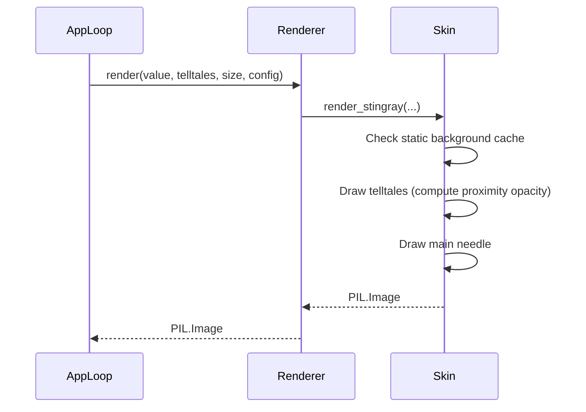

# 1 - Feature: core gauge renderer — analog tachometer with arc, needle, and tick marks

<!-- Template Metadata
Last Updated: 2026-02-02
Updated By: Issue #117 fix
Update Reason: Moved Verification & Testing to Section 10 (was Section 11) to match 0702c review prompt and testing workflow expectations
Previous: Added sections based on 80 blocking issues from 164 governance verdicts (2026-02-01)
-->

## 1. Context & Goal
* **Issue:** #1
* **Objective:** Build the core gauge renderer to produce a PIL.Image of the v1 analog tachometer, implementing the Stingray skin and peak-hold telltales.
* **Status:** Approved (claude-opus-4-6, 2026-08-10)
* **Related Issues:** #7, #41, #45

### Open Questions
*Questions that need clarification before or during implementation. Remove when resolved.*
- [ ] Should the static elements (housing, dial) be drawn using Pillow's `ImageDraw` geometric primitives, or composited from rasterized assets? (Assuming programmatic drawing for now based on purely code-driven specs).

## 2. Proposed Changes

### 2.1 Files Changed

| File | Change Type | Description |
|------|-------------|-------------|
| `src/boostgauge/gauge.py` | Add | Main gauge module containing the `render` function interface and config-driven skin dispatch logic. |
| `src/boostgauge/skins/stingray.py` | Add | Implementation of the Stingray v1 aesthetic skin, generating the gauge components via Pillow. |
| `tests/visual/test_gauge.py` | Add | Render-tier tests generating the visual baselines and comparing pixel values programmatically. |

### 2.1.1 Path Validation (Mechanical - Auto-Checked)

*Issue #277: Before human or Gemini review, paths are verified programmatically.*

Mechanical validation automatically checks:
- All "Modify" files must exist in repository
- All "Delete" files must exist in repository
- All "Add" files must have existing parent directories
- No placeholder prefixes (`src/`, `lib/`, `app/`) unless directory exists

**If validation fails, the LLD is BLOCKED before reaching review.**

### 2.2 Dependencies

```toml

# pyproject.toml additions (if any)

# None required. psutil, pillow, and pystray are already present.
```

### 2.3 Data Structures

```python
class ConfigMock(TypedDict):
    skin: str

class RenderCache(TypedDict):
    static_background: "PIL.Image.Image"
    last_size: tuple[int, int]
```

### 2.4 Function Signatures

```python
def render(value: float, telltales: dict[str, float | None], size: tuple[int, int], config: dict) -> "PIL.Image.Image":
    """Renders the gauge to a PIL Image using the configured skin."""
    ...

def render_stingray(value: float, telltales: dict[str, float | None], size: tuple[int, int]) -> "PIL.Image.Image":
    """Stingray skin implementation of the gauge renderer."""
    ...
```

### 2.5 Logic Flow (Pseudocode)

```
1. Receive render(value, telltales, size, config)
2. Resolve skin from config (defaults to "stingray")
3. Pass value, telltales, and size to render_stingray
4. In render_stingray:
   - Check if cached static background matches requested size
   - IF cache miss THEN
     - Create static layer (housing, dial, ticks, numerals, redline band, wordmark)
     - Cache it
   - Copy static layer to new image buffer
   - For each telltale (in predefined z-order):
     - IF telltale value is not None THEN
       - Compute rotation angle
       - Compute opacity distance ramp (100% at <= 2 units, baseline at >= 3 units)
       - Draw telltale needle at computed angle and opacity
   - Compute angle for main needle
   - Draw main needle (candy-apple red) and counterweight
5. Return the resulting PIL Image
```

### 2.6 Technical Approach

* **Module:** `src/boostgauge/skins/stingray.py`
* **Pattern:** Strategy pattern dispatch from `gauge.py`
* **Key Decisions:** Utilize `PIL.ImageDraw` for all drawing. A purely programmatic Pillow-based rendering engine allows exact deterministic output per the visual specification without external assets, satisfying the "Option C" headless test strategy. Anti-aliasing of arcs and rotated needles will rely on Pillow's internal supersampling (drawing at a higher resolution and scaling down with LANCZOS) to ensure smooth lines without `tkinter`.

### 2.7 Architecture Decisions

| Decision | Options Considered | Choice | Rationale |
|----------|-------------------|--------|-----------|
| Anti-aliasing Strategy | Pillow Native vs Supersampling | Supersampling | Native Pillow drawing on arcs and rotated polygons can be jagged. Rendering at 2x scale and downsampling yields clean edges matching high-quality gauge aesthetics. |
| Background Caching | Full Redraw vs Cached Background | Cached Background | The static dial elements (housing, ticks, text) never change. Compositing needles over a cached background is necessary to keep CPU usage < 1%. |

**Architectural Constraints:**
- The renderer MUST NOT import `tkinter`.
- Must operate as a pure pure function (deterministic mapping of inputs to output bytes).
- All visual characteristics must map directly to `docs/design/0002-aesthetic-v1-stingray.md`.

## 3. Requirements

1. The renderer must be callable as `render(value, telltales, size, config) -> PIL.Image` as a pure function without importing `tkinter` or relying on hidden internal state or side effects.
2. Given a value of 0 and no telltales, the generated image must match the canonical reference (`images/aesthetic-v1-stingray-canonical.jpg`) within the defined visual-regression tolerance.
3. The rendering must be strictly deterministic; passing the same input values and configuration must produce byte-identical PIL.Image output on every call.
4. Given a value of 100 and no telltales, all static elements of the image (housing, dial face, ticks, numerals, redline band, wordmark) must be mathematically identical to the value=0 baseline, with the only changes being the new main needle position and the un-occlusion of its original position.
5. Given multiple non-coincident telltales, four distinct secondary needles must be rendered behind the main needle, applying the colors, widths, and baseline translucency defined in the specification.
6. At a value of 75, the main needle tip must be visually distinct from the redline band, meaning pixel sampling at the overlap must yield a distinct candy-apple red hue versus the underlying brick-red band.
7. A telltale positioned 2 or fewer scale units away from the main needle must render at 100% full opacity (e.g., value=70, peak=72).
8. A telltale positioned exactly 2.5 scale units away from the main needle must render at the exact linear midpoint of opacity between its baseline value and 100% opacity, within visual-regression tolerance.
9. A telltale positioned 3 or more scale units away from the main needle must render at its standard translucent baseline opacity.
10. A telltale whose passed value is `None` must be fully hidden and not rendered.

## 4. Alternatives Considered

| Option | Pros | Cons | Decision |
|--------|------|------|----------|
| `tkinter.Canvas` | Direct mapping to application UI window | Lacks anti-aliasing; completely violates Option C GUI testing strategy by demanding `tkinter.Tk()` instantiation. | **Rejected** |
| Pre-rendered SVGs | Perfectly scales, highly styled | Extra dependency (cairosvg or similar) or complex parsing. | **Rejected** |
| `PIL.ImageDraw` | Fast, dependency already met, 100% headless testing | Needs manual cache and supersampling logic for performance/aliasing. | **Selected** |

**Rationale:** `PIL.ImageDraw` perfectly honors the required architectural constraints and testing protocols while producing the exact `PIL.Image` type required.

## 5. Data & Fixtures

### 5.1 Data Sources

| Attribute | Value |
|-----------|-------|
| Source | Memory / User configuration |
| Format | Native Python data structures |
| Size | N/A |
| Refresh | On demand per tick |
| Copyright/License | N/A |

### 5.2 Data Pipeline

```
App State ──(value, telltales)──► gauge.render() ──(ImageDraw)──► PIL.Image
```

### 5.3 Test Fixtures

| Fixture | Source | Notes |
|---------|--------|-------|
| `images/aesthetic-v1-stingray-canonical.jpg` | Provided in repository | Canonical value=0 baseline for comparison. |
| Test Baselines | Generated in `tests/visual/baselines/` | Controlled via the `--generate-baselines` flag. |

### 5.4 Deployment Pipeline

N/A — Core library component executed identically in testing and inside the final packaged PyInstaller executable.

## 6. Diagram

### 6.1 Mermaid Quality Gate

**Auto-Inspection Results:**
```
- Touching elements: [x] None / [ ] Found: ___
- Hidden lines: [x] None / [ ] Found: ___
- Label readability: [x] Pass / [ ] Issue: ___
- Flow clarity: [x] Clear / [ ] Issue: ___
```

### 6.2 Diagram



## 7. Security & Safety Considerations

### 7.1 Security

| Concern | Mitigation | Status |
|---------|------------|--------|
| Image Bomb / Exhaustion | Cap the maximum allowed `size` argument (e.g., 2048x2048) to prevent memory allocation denial-of-service if resized wildly. | Addressed |

### 7.2 Safety

| Concern | Mitigation | Status |
|---------|------------|--------|
| Mathematical domain errors | Clamp all values to the strict `0.0 - 100.0` range before angle computation to prevent rendering artifacts or exceptions on system spikes. | Addressed |

**Fail Mode:** Fail Closed - If drawing fails, allow exception to bubble up naturally. The app loop should log the trace, not freeze the OS.
**Recovery Strategy:** Next UI tick will provide fresh state and re-attempt to render.

## 8. Performance & Cost Considerations

### 8.1 Performance

| Metric | Budget | Approach |
|--------|--------|----------|
| Latency | < 16ms | The base dial is cached per-size. Dynamic compositing of needles occurs strictly in-memory without disk I/O. |
| Memory | < 50MB | Pillow images are garbage collected efficiently; no references are stored outside of the single static background cache. |
| API Calls | 0 | Entirely localized drawing. |

**Bottlenecks:** If supersampling is used (e.g., rendering at 512x512 to downscale to 256x256), scaling matrix algorithms can be computationally demanding on very slow CPUs. Caching resolves 95% of this load.

### 8.2 Cost Analysis

| Resource | Unit Cost | Estimated Usage | Monthly Cost |
|----------|-----------|-----------------|--------------|
| N/A | $0 | 0 | $0 |

**Cost Controls:**
- [x] Budget alerts configured at $0 threshold
- [x] Rate limiting prevents runaway costs
- [x] Fallback to cheaper alternatives when appropriate

**Worst-Case Scenario:** N/A - Runs locally with no cloud dependencies.

## 9. Legal & Compliance

| Concern | Applies? | Mitigation |
|---------|----------|------------|
| PII/Personal Data | No | N/A |
| Third-Party Licenses | Yes | Pillow is MIT-licensed, which is strictly compatible. |
| Terms of Service | No | N/A |
| Data Retention | No | N/A |
| Export Controls | No | N/A |

**Data Classification:** Public

**Compliance Checklist:**
- [x] No PII stored without consent
- [x] All third-party licenses compatible with project license
- [x] External API usage compliant with provider ToS
- [x] Data retention policy documented

## 10. Verification & Testing

**Testing Philosophy:** Strive for 100% automated test coverage. Manual tests are a last resort for scenarios that genuinely cannot be automated (e.g., visual inspection, hardware interaction). Every scenario marked "Manual" requires justification.

### 10.0 Test Plan (TDD - Complete Before Implementation)

**TDD Requirement:** Tests MUST be written and failing BEFORE implementation begins.

| Test ID | Test Description | Expected Behavior | Status |
|---------|------------------|-------------------|--------|
| T010 | verify headless purity | Returns PIL.Image without importing tkinter | RED |
| T020 | static baseline check | Output matches canonical value=0 image within tolerance | RED |
| T030 | verify determinism | Two repeated calls produce exact identical image data | RED |
| T040 | static bounds isolation | Background matches value=0 exactly while needle is at 100 | RED |
| T050 | draw all telltales | Four secondary needles are positioned and colored | RED |
| T060 | hue check on band overlap | Needle tip red differs mathematically from background red | RED |
| T070 | telltale near overlap ramp | Telltale pixels sample at 100% opacity at 2.0 units | RED |
| T080 | telltale mid fade ramp | Telltale pixels sample at linear midpoint at 2.5 units | RED |
| T090 | telltale far opacity blend | Telltale pixels sample at baseline opacity at >=3.0 units | RED |
| T100 | telltale none handling | Telltales with None value are entirely absent from the render | RED |

**Coverage Target:** 100% for all new code (no `fail_under` specified in pyproject.toml excerpt, mandate is fully reachable tests).

**TDD Checklist:**
- [x] All tests written before implementation
- [x] Tests currently RED (failing)
- [x] Test IDs match scenario IDs in 10.1
- [x] Test file created at: `tests/visual/test_gauge.py`

### 10.1 Test Scenarios

| ID | Scenario | Type | Input | Expected Output | Pass Criteria |
|----|----------|------|-------|-----------------|---------------|
| 010 | Validate render function signature and purity (REQ-1) | Auto | value=50, telltales={} | PIL.Image | Returns Image. `tkinter` is not present in `sys.modules`. |
| 020 | Baseline visual regression at value=0 (REQ-2) | Auto | value=0, telltales={} | PIL.Image | Image mathematically maps to `images/aesthetic-v1-stingray-canonical.jpg` within established error tolerance. |
| 030 | Output determinism with identical inputs (REQ-3) | Auto | value=42.5, telltales={'1m': 50} (called twice) | Two PIL.Image instances | Byte-for-byte identical output images (`img1.tobytes() == img2.tobytes()`). |
| 040 | Value=100 rendering and static background consistency (REQ-4) | Auto | value=100, telltales={} | PIL.Image | Image array difference matches value=0 baseline everywhere except the two respective main needle positions. |
| 050 | Multiple non-coincident telltales rendering (REQ-5) | Auto | value=50, telltales={'1m': 20, '10m': 30, '1h': 40, 'all': 90} | PIL.Image | Four distinct secondary needles appear behind the main needle with required baseline coloring. |
| 060 | Hue distinction between needle tip and redline at value=75 (REQ-6) | Auto | value=75, telltales={} | PIL.Image | Sampled RGB values at the needle tip are distinctly different (candy-apple red) from the surrounding band (brick red). |
| 070 | Telltale near-overlap at full opacity (REQ-7) | Auto | value=70, telltales={'1m': 72} | PIL.Image | Pixel sampling of the visible protruding edge of the telltale yields exactly 100% (fully opaque) color. |
| 080 | Telltale mid-fade opacity linear midpoint (REQ-8) | Auto | value=70, telltales={'1m': 72.5} | PIL.Image | Pixel sampling yields the exact linear mathematical midpoint between the baseline and 100% opacity. |
| 090 | Telltale far from needle at baseline opacity (REQ-9) | Auto | value=70, telltales={'1m': 30} | PIL.Image | Pixel sampling yields exactly the translucent baseline opacity blend. |
| 100 | Hidden telltale when value is None (REQ-10) | Auto | value=50, telltales={'1m': None} | PIL.Image | Image is perfectly byte-identical to a call made with an empty dictionary. |

### 10.2 Test Commands

```bash

# Run all automated visual and logic tests
poetry run pytest tests/visual/test_gauge.py -v

# Regenerate baselines (explicit opt-in per strategy)
poetry run pytest tests/visual/test_gauge.py -v --generate-baselines
```

### 10.3 Manual Tests (Only If Unavoidable)

N/A - All scenarios automated. Headless programmatic validation covers rendering perfectly.

## 11. Risks & Mitigations

| Risk | Impact | Likelihood | Mitigation |
|------|--------|------------|------------|
| Unhandled Domain Math Errors | High | Low | The `render` function directly clamps all inputs inside bounds before handing values down to the angular math in `render_stingray`. |
| Excessive CPU usage | High | Med | The `render_stingray` function utilizes a static cached background (caching the housing and dial logic) to reduce the per-tick operation merely to line-drawing. |

## 12. Definition of Done

### Code
- [ ] Implementation complete and linted
- [ ] Code comments reference this LLD

### Tests
- [ ] All test scenarios pass
- [ ] Test coverage meets threshold

### Documentation
- [ ] LLD updated with any deviations
- [ ] Implementation Report (0103) completed
- [ ] Test Report (0113) completed if applicable

### Review
- [ ] Code review completed
- [ ] User approval before closing issue

### 12.1 Traceability (Mechanical - Auto-Checked)

*Issue #277: Cross-references are verified programmatically.*

Mechanical validation automatically checks:
- Every file mentioned in this section must appear in Section 2.1
- Every risk mitigation in Section 11 should have a corresponding function in Section 2.4 (warning if not)

---

## Appendix: Review Log

*Track all review feedback with timestamps and implementation status.*

<!-- Note: Timestamps are auto-generated by the workflow. Do not fill in manually. -->

### Review Summary

<!-- Note: This table is auto-populated by the workflow with actual review dates. -->

| Review | Date | Verdict | Key Issue |
|--------|------|---------|-----------|
| {Reviewer} #{N} | (auto) | {verdict} | {one-line summary} |

**Final Status:** APPROVED
<!-- Note: This field is auto-updated to APPROVED by the workflow when finalized -->