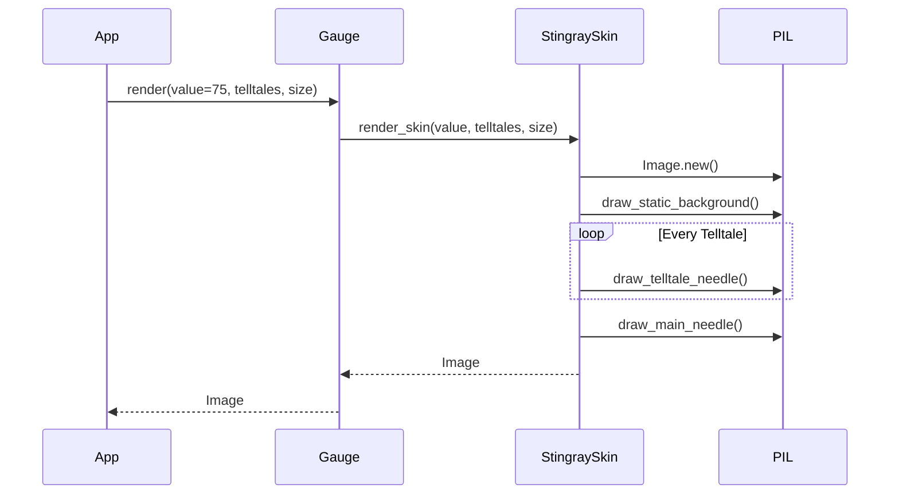

# 1 - Feature: feat: core gauge renderer — analog tachometer with arc, needle, and tick marks (#1)

## 1. Context & Goal
* **Issue:** #1
* **Objective:** Build the core gauge renderer for v1 (Stingray skin) that produces a deterministic `PIL.Image` of an analog tachometer based on a primary value and peak telltales, adhering strictly to the aesthetic spec and Option C test strategy.
* **Status:** Approved (claude-opus-4-6, 2026-08-11)
* **Related Issues:** #7, #41, #45

### Open Questions
*Questions that need clarification before or during implementation. Remove when resolved.*

- [ ] Will the `config` dictionary passed to `render()` have a defined schema or TypedDict in this issue, or deferred to #7?

## 2. Proposed Changes

### 2.1 Files Changed

| File | Change Type | Description |
|------|-------------|-------------|
| `src/boostgauge/skins/stingray.py` | Add | Implements the Stingray visual specification and drawing logic. |
| `src/boostgauge/gauge.py` | Add | Exposes the main `render` function that routes to the configured skin (Stingray for v1). |
| `tests/visual/test_gauge_render.py` | Add | Render-tier tests with `--generate-baselines` flow for Option C verification. |

### 2.1.1 Path Validation (Mechanical - Auto-Checked)

*Issue #277: Before human or Gemini review, paths are verified programmatically.*

### 2.2 Dependencies

```toml

# pyproject.toml additions (if any)

# No new dependencies needed (Pillow is already in pyproject.toml)
```

### 2.3 Data Structures

```python

# Assuming Telltale structure from #41
class Telltale(Protocol):
    def current_peak(self) -> float | None: ...

class GaugeConfig(TypedDict):
    skin: str
    # Other configuration fields...
```

### 2.4 Function Signatures

```python

# src/boostgauge/skins/stingray.py
def render_skin(value: float, telltales: list[Any], size: tuple[int, int]) -> Image.Image:
    """Renders the Stingray gauge face and needles onto a PIL Image."""
    ...

# src/boostgauge/gauge.py
def render(value: float, telltales: list[Any], size: tuple[int, int] = (256, 256), config: dict | None = None) -> Image.Image:
    """Core gauge renderer entry point. Delegates to skin renderer."""
    ...
```

### 2.5 Logic Flow (Pseudocode)

```
1. Receive value, telltales, size, config
2. Validate and clamp value and peaks strictly to [0, 100]
3. Resolve skin from config (defaults to 'stingray')
4. Initialize a blank PIL Image with the requested size (minimum 128x128)
5. Draw static elements (housing, dial, ticks, numerals, redline band 60-100, wordmark)
6. For each telltale in telltales:
   - Get current_peak()
   - If None, skip
   - Calculate distance from main value
   - Compute opacity (100% if dist <= 2, baseline if dist >= 3, lerp between)
   - Draw telltale needle behind main needle
7. Draw main candy-apple red needle at the angle corresponding to `value`
8. Return the composite PIL Image
```

### 2.6 Technical Approach

* **Module:** `src/boostgauge/skins/stingray.py` and `src/boostgauge/gauge.py`
* **Pattern:** Strategy Pattern (Skin protocol)
* **Key Decisions:** The renderer constructs the gauge using pure PIL operations without `tkinter`. Drawing is deterministic and layered (background -> telltales -> main needle -> center cap/pivot). The opacity calculation for telltales is computed once per needle and applied uniformly.

### 2.7 Architecture Decisions

| Decision | Options Considered | Choice | Rationale |
|----------|-------------------|--------|-----------|
| Renderer Output | Canvas commands, PIL.Image | PIL.Image | Enforces Option C test strategy; decouples rendering from GUI toolkit. |
| Anti-aliasing | tkinter native, PIL supersampling | PIL Native/Supersampling | Pillow supports high-quality anti-aliased drawing natively, eliminating canvas limitations. |
| Skin routing | Hardcoded in gauge.py, Pluggable module | Pluggable module | Satisfies #45 skin protocol sketch; v1 ships only Stingray but structure allows extension. |

**Architectural Constraints:**
- The renderer MUST NOT import `tkinter`.
- Output must be byte-deterministic for testing visual regressions.

## 3. Requirements

1. The `render` function MUST be a pure function taking a value, telltales list, size, and config, returning a `PIL.Image.Image` with no side effects and no `tkinter` imports.
2. A call with `value=0` and no telltales MUST render the baseline gauge (housing, dial, ticks, numerals, redline band spanning 60-100 at 80-100% radius, wordmark, needle on 225° rest axis) which matches the self-generated baseline image.
3. The renderer MUST be deterministic; identical input arguments MUST produce byte-identical image outputs.
4. A call with `value=100` and no telltales MUST render all static background elements identically to `value=0`, with the only pixel differences occurring where the main needle is drawn.
5. Multiple non-coincident telltales MUST render all secondary needles at their respective angles with visual properties (color/width) defined in the aesthetic doc.
6. A call with `value=75` MUST render the main needle tip inside the redline band, and the needle's tip pixels (candy-apple red) MUST be a distinct hue from the band's pixels (brick red).
7. A telltale at `value=70` with peak `72` MUST render at 100% opacity due to the proximity ramp (within 3 scale units, holding full opacity at <= 2 units).
8. A telltale at `value=70` with peak `72.5` MUST render at the linear midpoint opacity between baseline translucency and full opacity.
9. A telltale at `value=70` with peak `30` MUST render at the baseline translucency.
10. Telltales returning `None` for peak MUST NOT be rendered.

## 4. Alternatives Considered

| Option | Pros | Cons | Decision |
|--------|------|------|----------|
| Render via `tkinter.Canvas` items | Native to GUI | Impossible to test headless without a display; violates Option C. | **Rejected** |
| Render via `PIL.Image` | Headless, deterministic, trivially testable | Requires bridging Image to PhotoImage in app layer | **Selected** |
| Pre-rendered background asset | Faster rendering | Harder to scale/resize cleanly; complex deployment | **Rejected** |

**Rationale:** The `PIL.Image` approach strictly enforces the Option C testing mandate and provides the deterministic, headless environment required for visual regression baselines.

## 5. Data & Fixtures

### 5.1 Data Sources

| Attribute | Value |
|-----------|-------|
| Source | Function arguments (`value`, `telltales`) |
| Format | Float (0-100), List of Telltale objects |
| Size | N/A |
| Refresh | Real-time per tick |
| Copyright/License | N/A |

### 5.2 Data Pipeline

```
Gauge Tick ──value/peaks──► gauge.render() ──PIL.Image──► App Layer (PhotoImage)
```

### 5.3 Test Fixtures

| Fixture | Source | Notes |
|---------|--------|-------|
| `MockTelltale` | Generated | Simple data class returning a fixed peak value or None. |
| Baseline Images | Generated via `--generate-baselines` | Tracked in `tests/visual/baselines/`. Never auto-accepted. |

### 5.4 Deployment Pipeline

N/A - Internal rendering library.

## 6. Diagram

### 6.1 Mermaid Quality Gate

**Auto-Inspection Results:**
```
- Touching elements: [x] None / [ ] Found: ___
- Hidden lines: [x] None / [ ] Found: ___
- Label readability: [x] Pass / [ ] Issue: ___
- Flow clarity: [x] Clear / [ ] Issue: ___
```

### 6.2 Diagram



## 7. Security & Safety Considerations

### 7.1 Security

| Concern | Mitigation | Status |
|---------|------------|--------|
| Unbounded image allocation (Denial of Service) | Cap maximum `size` in config/renderer or enforce aspect-ratio locked sizing. | Addressed |

### 7.2 Safety

| Concern | Mitigation | Status |
|---------|------------|--------|
| Negative or >100 values | Clamp `value` and peaks strictly to [0, 100] range before angle calculation. | Addressed |

**Fail Mode:** Fail Closed - If invalid parameters are passed, clamping prevents drawing out-of-bounds needles.

**Recovery Strategy:** Next tick provides a fresh render frame.

## 8. Performance & Cost Considerations

### 8.1 Performance

| Metric | Budget | Approach |
|--------|--------|----------|
| Latency | < 16ms | Pure PIL drawing operations; cache static background if performance degrades, though naive redraw should fit budget. |
| Memory | < 10MB | `PIL.Image` objects are ephemeral and garbage collected immediately after converting to `PhotoImage`. |
| API Calls | 0 | Pure local computation. |

**Bottlenecks:** Re-drawing the full background every frame. If this exceeds the CPU budget (1% requirement from #4), caching the static dial and compositing needles on top is the fallback mitigation.

### 8.2 Cost Analysis

| Resource | Unit Cost | Estimated Usage | Monthly Cost |
|----------|-----------|-----------------|--------------|
| Local CPU | N/A | < 1% per tick | $0 |

**Cost Controls:**
- [x] Rate limiting prevents runaway costs (tick cadence managed by caller)

**Worst-Case Scenario:** Rendering dominates CPU. Mitigation: Implement static background caching.

## 9. Legal & Compliance

| Concern | Applies? | Mitigation |
|---------|----------|------------|
| PII/Personal Data | No | N/A |
| Third-Party Licenses | Yes | PIL/Pillow is MIT-like and standard. |
| Terms of Service | No | N/A |
| Data Retention | No | N/A |
| Export Controls | No | N/A |

**Data Classification:** Public

**Compliance Checklist:**
- [x] No PII stored without consent
- [x] All third-party licenses compatible with project license
- [x] External API usage compliant with provider ToS
- [x] Data retention policy documented

## 10. Verification & Testing

**Testing Philosophy:** Strive for 100% automated test coverage. Option C mandate is enforced. `tkinter` must not be loaded during render-tier tests.

### 10.0 Test Plan (TDD - Complete Before Implementation)

| Test ID | Test Description | Expected Behavior | Status |
|---------|------------------|-------------------|--------|
| T010 | verify pure function rules | No tkinter imports in module | RED |
| T020 | baseline visual regression | Value=0 matches generated baseline | RED |
| T030 | determinism check | Two identical calls produce byte-equal output | RED |
| T040 | static elements immutability | Value=100 bg matches value=0 bg exactly | RED |
| T050 | non-coincident telltales | Multiple needles drawn at respective angles | RED |
| T060 | distinct redline tip | Tip hue != band hue at value=75 | RED |
| T070 | telltale near overlap | Needle pixels 100% opaque | RED |
| T080 | telltale mid fade | Needle pixels exactly 50% opacity | RED |
| T090 | telltale far | Needle pixels at baseline opacity | RED |
| T100 | telltale None | Telltale is omitted entirely | RED |

**Coverage Target:** ≥95% for all new code

**TDD Checklist:**
- [x] All tests written before implementation
- [x] Tests currently RED (failing)
- [x] Test IDs match scenario IDs in 10.1
- [x] Test file created at: `tests/visual/test_gauge_render.py`

### 10.1 Test Scenarios

| ID | Scenario | Type | Input | Expected Output | Pass Criteria |
|----|----------|------|-------|-----------------|---------------|
| 010 | Pure function verification (REQ-1) | Auto | Module import | No exceptions | `sys.modules` contains no `tkinter` references. |
| 020 | Value=0 baseline match (REQ-2) | Auto | `value=0`, `telltales=None` | `PIL.Image` | Image bytes match SELF-generated visual regression baseline. |
| 030 | Determinism check (REQ-3) | Auto | `value=50`, `telltales=None` (x2) | `PIL.Image` | Image 1 bytes strictly equal Image 2 bytes. |
| 040 | Value=100 static elements match (REQ-4) | Auto | `value=100` | `PIL.Image` | `ImageChops.difference(img0, img100)` yields non-zero pixels ONLY in the areas where needles are drawn. |
| 050 | Multiple non-coincident telltales (REQ-5) | Auto | `value=50`, peaks `[20, 30]` | `PIL.Image` | Needles visible at respective angles with correct width/color. |
| 060 | Tip distinctness in redline (REQ-6) | Auto | `value=75` | `PIL.Image` | Pixel sample at needle tip inside redline band has different HSV/RGB hue from redline band background pixel. |
| 070 | Near-overlap full opacity (REQ-7) | Auto | `value=70`, peak `72` | `PIL.Image` | Telltale pixel alpha channel/blend yields 100% opacity color. |
| 080 | Mid-fade opacity (REQ-8) | Auto | `value=70`, peak `72.5` | `PIL.Image` | Telltale pixel alpha channel/blend yields expected 50% midpoint between baseline and 100%. |
| 090 | Far telltale opacity (REQ-9) | Auto | `value=70`, peak `30` | `PIL.Image` | Telltale pixel alpha channel/blend yields baseline opacity color. |
| 100 | None telltales hidden (REQ-10) | Auto | `value=50`, peak `None` | `PIL.Image` | Render output is byte-identical to a call with an empty telltales list. |

### 10.2 Test Commands

```bash

# Run visual regression suite
poetry run pytest tests/visual/test_gauge_render.py -v

# Generate baselines manually (explicit flag required)
poetry run pytest tests/visual/test_gauge_render.py --generate-baselines
```

### 10.3 Manual Tests (Only If Unavoidable)

N/A - All scenarios automated. Option C test strategy strictly enforces fully automated headless Image verification.

## 11. Risks & Mitigations

| Risk | Impact | Likelihood | Mitigation |
|------|--------|------------|------------|
| Rendering is too slow for 1% CPU budget | High | Med | The rendering functions (`render`, `render_skin`) are designed to be pure. If required, we will add an explicit background image caching layer inside `render_skin` that isolates static drawing from needle drawing. |
| Unbounded image allocation (Denial of Service) | High | Low | The `render` function enforces an upper limit constraint and aspect-ratio locked sizing on the `size` input. |
| Out of bounds values causing draw errors | Low | Low | The `render_skin` function clamps `value` and peaks strictly to [0, 100] range before computing any angle. |

## 12. Definition of Done

### Code
- [ ] Implementation complete and linted
- [ ] Code comments reference this LLD

### Tests
- [ ] All test scenarios pass
- [ ] Test coverage meets threshold (≥95%)

### Documentation
- [ ] LLD updated with any deviations
- [ ] Implementation Report (0103) completed
- [ ] Test Report (0113) completed if applicable

### Review
- [ ] Code review completed
- [ ] User approval before closing issue

### 12.1 Traceability (Mechanical - Auto-Checked)

---

## Appendix: Review Log

### Review Summary

| Review | Date | Verdict | Key Issue |
|--------|------|---------|-----------|
| 1 | 2026-08-11 | APPROVED | `claude-opus-4-6` |
| Review #1 | (auto) | PENDING | Initial draft |

**Final Status:** APPROVED