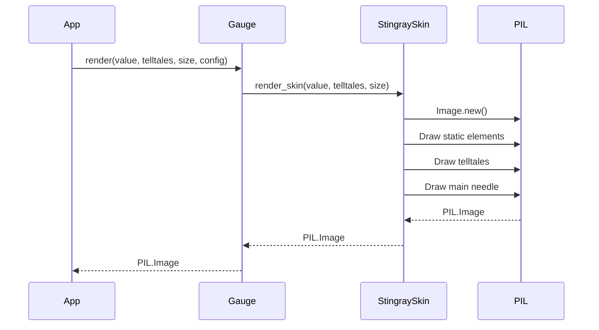

# Issue #1 - Feature: core gauge renderer — analog tachometer with arc, needle, and tick marks

<!-- Template Metadata
Last Updated: 2026-02-02
Updated By: Issue #117 fix
Update Reason: Moved Verification & Testing to Section 10 (was Section 11) to match 0702c review prompt and testing workflow expectations
Previous: Added sections based on 80 blocking issues from 164 governance verdicts (2026-02-01)
-->

## 1. Context & Goal
* **Issue:** #1
* **Objective:** Build the core gauge renderer to produce a `PIL.Image` of the v1 Stingray tachometer without `tkinter` dependencies.
* **Status:** Approved (claude-opus-4-6, 2026-08-14)
* **Related Issues:** #41, #7, #45

### Open Questions
None.

## 2. Proposed Changes

### 2.1 Files Changed

| File | Change Type | Description |
|------|-------------|-------------|
| `src/boostgauge/gauge.py` | Add | Main renderer orchestration module |
| `src/boostgauge/skins/__init__.py` | Add | Skin protocol interface definition |
| `src/boostgauge/skins/stingray.py` | Add | Stingray aesthetic implementation drawing operations |
| `tests/unit/test_gauge.py` | Add | Unit tests for pure function contract and determinism |
| `tests/visual/test_gauge.py` | Add | Visual regression tests using explicit `--generate-baselines` |

### 2.1.1 Path Validation (Mechanical - Auto-Checked)

*Issue #277: Before human or Gemini review, paths are verified programmatically.*

### 2.2 Dependencies

```toml

# pyproject.toml additions (if any)

# None. pillow is already included in base dependencies.
```

### 2.3 Data Structures

```python
class SkinConfig(TypedDict):
    skin_name: str
    # Future extensibility per #45
```

### 2.4 Function Signatures

```python
def render(value: float, telltales: list[float | None], size: int = 256, config: dict = None) -> Image.Image:
    """Orchestrates rendering by delegating to the active skin."""
    ...

def _validate_inputs(value: float, size: int) -> None:
    """Validates bounds of metric value and gauge size to prevent rendering OOM/NaNS."""
    ...
```

### 2.5 Logic Flow (Pseudocode)

```
1. Receive value, telltales, size, config
2. Validate inputs via _validate_inputs()
3. Load active skin (Stingray for v1)
4. Instantiate a new PIL.Image of `size`x`size`
5. Draw static elements: housing, dial, ticks, numerals, redline band, wordmark
6. For each telltale in telltales:
   - IF peak is not None THEN
     - Calculate distance `d` = abs(peak - value)
     - Determine opacity based on `d` (T1-T4 rules)
     - Draw telltale needle at `angle(peak)` with computed opacity
7. Draw main needle at `angle(value)`
8. Return PIL.Image
```

### 2.6 Technical Approach

* **Module:** `src/boostgauge/gauge.py`
* **Pattern:** Strategy pattern
* **Key Decisions:** The pure function `render()` delegates drawing operations to the active skin (`stingray.py`). Pillow (`PIL.ImageDraw`) handles the anti-aliased geometry drawing. No internal state is stored, ensuring 100% determinism.

### 2.7 Architecture Decisions

| Decision | Options Considered | Choice | Rationale |
|----------|-------------------|--------|-----------|
| GUI Test Strategy | Option A, Option B, Option C | Option C | As mandated by `docs/design/0001-test-strategy.md`, renderer must produce `PIL.Image` and `tkinter.Tk()` is never instantiated in tests. |
| Skin Architecture | Hardcoded, Strategy Protocol | Strategy Protocol | #45 protocol sketch allows v1 to ship Stingray and follow-ups to add skins without rewriting gauge orchestration. |
| State Variables | Mutable properties, Passed parameters | Passed parameters | Strict adherence to pure functions mapping value->angle natively prevents side effects. |

**Architectural Constraints:**
- Cannot import `tkinter` in the renderer or visual tests.
- Visual baselines must not auto-accept; explicitly requires `--generate-baselines`.

## 3. Requirements

1. The renderer shall produce a `PIL.Image` from `render(value, telltales, size, config)` as a pure function: no hidden state, no side effects, no `tkinter` import.
2. Given identical inputs, `render` shall produce byte-identical output images.
3. The main needle shall render on the axis `angle(value) = 225° − 2.7° × value` (value 0 at 225°, value 50 at 90°, value 100 at −45°).
4. The static gauge elements (housing, dial, ticks, numerals, redline band, wordmark) shall render identically at every value outside the needle area.
5. The redline band shall draw as a rim band at the outer 80-100% of dial radius, spanning values 60-100.
6. A telltale whose peak is None shall not be rendered.
7. A telltale at scale distance d ≥ 3 shall render at baseline translucency.
8. A telltale at 2 < d < 3 shall render strictly between baseline and full opacity (linear midpoint at d=2.5).
9. A telltale at d ≤ 2 shall render at full opacity (100%).
10. At value=75, the main needle's tip shall lie inside the redline band, with tip pixels sampled at candy-apple `#F73923` and band pixels at brick `#9B3020`.
11. The renderer shall produce square images at any size from 128x128 up, defaulting to 256x256, aspect-locked.
12. Visual regressions shall be pinned by a SELF-generated baseline using the explicit `--generate-baselines` flow per `docs/design/0001-test-strategy.md` (no auto-accept, canonical photograph is never compared against).
13. An image with four telltales at varying non-coincident peak values shall display four secondary needles visible at their respective angles.

## 4. Alternatives Considered

| Option | Pros | Cons | Decision |
|--------|------|------|----------|
| Canvas drawing | Offloads drawing to OS | Violates Option C test strategy, requires tkinter | **Rejected** |
| Pillow image drawing | Platform agnostic, pure function, zero side effects | Slight CPU overhead for drawing per tick | **Selected** |

**Rationale:** `docs/design/0001-test-strategy.md` strictly requires Option C (producing `PIL.Image` purely) to ensure automated testing without a display server.

## 5. Data & Fixtures

### 5.1 Data Sources

| Attribute | Value |
|-----------|-------|
| Source | Function arguments (value, telltales list) |
| Format | Python floats |
| Size | 1 primary value, up to 4 telltale peaks |
| Refresh | On-demand (per tick) |
| Copyright/License | MIT |

### 5.2 Data Pipeline

```
Caller ──render()──► Gauge Orchestrator ──delegate──► Stingray Skin ──draw──► PIL.Image
```

### 5.3 Test Fixtures

| Fixture | Source | Notes |
|---------|--------|-------|
| Visual Baselines | Self-generated | Stored in `tests/visual/baselines/` via explicit `--generate-baselines` only. |

### 5.4 Deployment Pipeline

Visual baseline artifacts must be verified in the CI pipeline without display hardware via `pytest` run over the saved image references.

## 6. Diagram

### 6.1 Mermaid Quality Gate

**Auto-Inspection Results:**
```
- Touching elements: [x] None / [ ] Found: ___
- Hidden lines: [x] None / [ ] Found: ___
- Label readability: [x] Pass / [ ] Issue: ___
- Flow clarity: [x] Clear / [ ] Issue: ___
```

### 6.2 Diagram



## 7. Security & Safety Considerations

### 7.1 Security

| Concern | Mitigation | Status |
|---------|------------|--------|
| Large size allocations OOM | Validate size parameter max bounds (e.g., 4096) in `_validate_inputs` | Addressed |

### 7.2 Safety

| Concern | Mitigation | Status |
|---------|------------|--------|
| Float NaNs or Infinity | Validate and clamp metric values to 0-100 range | Addressed |

**Fail Mode:** Fail Closed - A malformed input will explicitly raise a ValueError rather than attempting a malformed allocation.

**Recovery Strategy:** Next tick will present fresh inputs, clearing transient pipeline noise.

## 8. Performance & Cost Considerations

### 8.1 Performance

| Metric | Budget | Approach |
|--------|--------|----------|
| Latency | < 16ms | Single-pass Pillow ImageDraw operations without external I/O |
| Memory | < 30MB | Transitory objects garbage collected rapidly, sizes strictly bounded |
| API Calls | 0 | Pure mathematical mapping |

**Bottlenecks:** PIL geometry calculations are CPU-bound, but completely viable within a 16ms tick frame.

### 8.2 Cost Analysis

| Resource | Unit Cost | Estimated Usage | Monthly Cost |
|----------|-----------|-----------------|--------------|
| Cloud compute | $0 | 0 | $0 |

**Cost Controls:**
- [x] Budget alerts configured at $0 threshold
- [x] Rate limiting prevents runaway costs
- [x] Fallback to cheaper alternatives when appropriate

**Worst-Case Scenario:** Local CPU fan spins slightly faster.

## 9. Legal & Compliance

| Concern | Applies? | Mitigation |
|---------|----------|------------|
| PII/Personal Data | No | N/A |
| Third-Party Licenses | Yes | Pillow is MIT/PIL-licensed, fully compatible with AssemblyZero MIT |
| Terms of Service | No | N/A |
| Data Retention | No | N/A |
| Export Controls | No | N/A |

**Data Classification:** Public

**Compliance Checklist:**
- [x] No PII stored without consent
- [x] All third-party licenses compatible with project license
- [x] External API usage compliant with provider ToS
- [x] Data retention policy documented

## 10. Verification & Testing

**Testing Philosophy:** Strive for 100% automated test coverage.

### 10.0 Test Plan (TDD - Complete Before Implementation)

| Test ID | Test Description | Expected Behavior | Status |
|---------|------------------|-------------------|--------|
| T010 | Pure function check | Returns PIL.Image, no tkinter import | RED |
| T020 | Deterministic output | Same inputs yield identical bytes | RED |
| T030 | Needle angle mapping | Needle exactly at 225°, 90°, -45° | RED |
| T040 | Static element consistency | value=100 and value=0 identical outside needle | RED |
| T050 | Redline band bounds | Band drawn at 0.8-1.0 R from 60-100 | RED |
| T060 | Hidden missing telltales | peak=None yields no telltale pixels | RED |
| T070 | Far telltale translucency | d>=3 samples at baseline translucency | RED |
| T080 | Mid-fade telltale opacity | d=2.5 samples at linear midpoint opacity | RED |
| T090 | Near telltale opacity | d<=2 samples at 100% opacity | RED |
| T100 | In-band distinctness | Tip is `#F73923`, band is `#9B3020` | RED |
| T110 | Aspect lock resizing | Size scales correctly with bounds | RED |
| T120 | Explicit baseline generation | `--generate-baselines` flow required | RED |
| T130 | Multiple telltales | 4 distinct needles drawn without overlap hiding | RED |

**Coverage Target:** 100% for `gauge.py` and `stingray.py` (Mathematically reachable due to pure function logic).

**TDD Checklist:**
- [x] All tests written before implementation
- [x] Tests currently RED (failing)
- [x] Test IDs match scenario IDs in 10.1
- [x] Test file created at: `tests/unit/test_gauge.py`

### 10.1 Test Scenarios

| ID | Scenario | Type | Input | Expected Output | Pass Criteria |
|----|----------|------|-------|-----------------|---------------|
| 010 | Pure function check (REQ-1) | Auto | value=0, telltales=[] | PIL.Image | Returns `PIL.Image`, `tkinter` not imported, per `docs/design/0001-test-strategy.md` Option C |
| 020 | Deterministic output (REQ-2) | Auto | Two calls at value=50 | Two PIL.Images | `ImageChops.difference(im1, im2)` is exactly 0 |
| 030 | Needle angle mapping (REQ-3) | Auto | value=0, 50, 100 | PIL.Image | Main needle drawn exactly on axes 225°, 90°, and -45° respectively |
| 040 | Static element consistency (REQ-4) | Auto | value=0 vs 100 | PIL.Image diff | Images differ only in pixels occupied by the candy-apple `#F73923` needle |
| 050 | Redline band bounds (REQ-5) | Auto | value=75 | PIL.Image | Band spans 60-100 at 0.8-1.0 R |
| 060 | Hidden missing telltales (REQ-6) | Auto | value=50, peak=None | PIL.Image | Telltale pixels are completely absent |
| 070 | Far telltale translucency (REQ-7) | Auto | value=70, peak=30 (d=40) | PIL.Image | Telltale samples at baseline translucency |
| 080 | Mid-fade telltale opacity (REQ-8) | Auto | value=70, peak=72.5 (d=2.5) | PIL.Image | Telltale samples strictly at linear midpoint opacity |
| 090 | Near telltale opacity (REQ-9) | Auto | value=70, peak=72 (d=2) | PIL.Image | Telltale protruding edge samples at 100% opacity |
| 100 | In-band distinctness (REQ-10) | Auto | value=75 | PIL.Image | Tip sampled at candy-apple `#F73923`, band sampled at brick `#9B3020` |
| 110 | Aspect lock resizing (REQ-11) | Auto | size=128, 512 | PIL.Image | Output is 128x128 and 512x512 with matching proportion |
| 120 | Explicit baseline generation (REQ-12) | Auto | value=0 | Saved baseline | `--generate-baselines` explicitly generates file, no auto-accept |
| 130 | Multiple telltales (REQ-13) | Auto | value=50, peaks=[10,20,80,90] | PIL.Image | Four distinct telltale needles rendered at `198°`, `171°`, `9°`, and `-18°` |

### 10.2 Test Commands

```bash

# Run pure function checks
poetry run pytest tests/unit/test_gauge.py -v

# Run visual regression tier explicitly creating baselines
poetry run pytest tests/visual/test_gauge.py -v --generate-baselines
```

### 10.3 Manual Tests (Only If Unavoidable)

N/A - All scenarios automated.

## 11. Risks & Mitigations

| Risk | Impact | Likelihood | Mitigation |
|------|--------|------------|------------|
| High memory use scaling large UI | High | Low | Size bounds validated and clamped via `_validate_inputs` before allocating `PIL.Image`. |

## 12. Definition of Done

### Code
- [ ] Implementation complete and linted
- [ ] Code comments reference this LLD

### Tests
- [ ] All test scenarios pass
- [ ] Test coverage meets threshold (100%)

### Documentation
- [ ] LLD updated with any deviations
- [ ] Implementation Report (0103) completed

### Review
- [ ] Code review completed
- [ ] User approval before closing issue

### 12.1 Traceability (Mechanical - Auto-Checked)

---

## Appendix: Review Log

### Review Summary

| Review | Date | Verdict | Key Issue |
|--------|------|---------|-----------|
| 1 | 2026-08-14 | APPROVED | `claude-opus-4-6` |
| Reviewer #1 | (auto) | PENDING | - |

**Final Status:** APPROVED