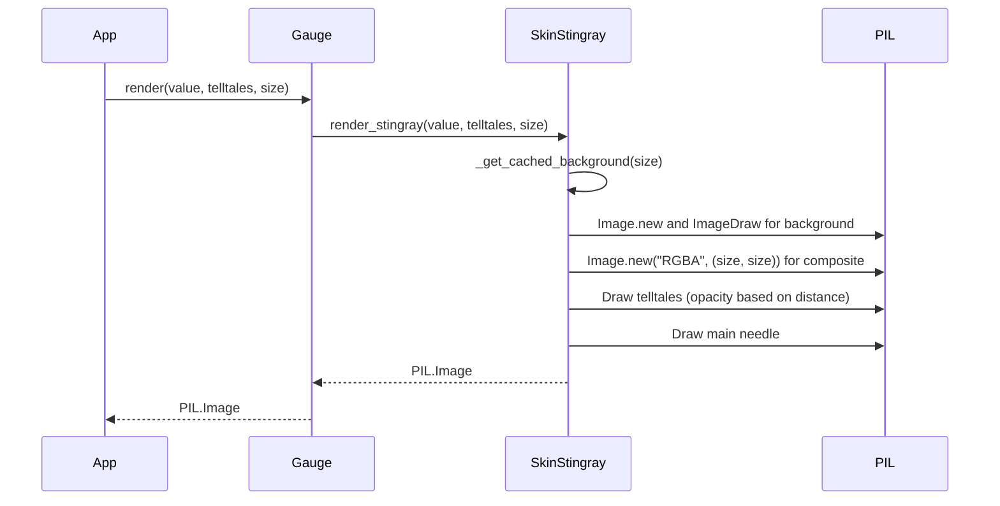

# 1 - Feature: core gauge renderer — analog tachometer with arc, needle, and tick marks

## 1. Context & Goal
* **Issue:** #1
* **Objective:** Build the core gauge renderer that produces a PIL.Image of the v1 gauge with a main needle and telltales.
* **Status:** Approved (claude-opus-4-6, 2026-08-10)
* **Related Issues:** #41, #7, #45, #2

### Open Questions
None.

## 2. Proposed Changes

### 2.1 Files Changed

| File | Change Type | Description |
|------|-------------|-------------|
| `src/boostgauge/skins/__init__.py` | Add | Exposes skin protocol components |
| `src/boostgauge/skins/stingray.py` | Add | Implements the Stingray gauge rendering logic |
| `src/boostgauge/gauge.py` | Add | Exposes `render(value, telltales, size, config)` delegating to skin |
| `tests/visual/test_gauge_render.py` | Add | Render-tier tests per Option C strategy |

### 2.1.1 Path Validation (Mechanical - Auto-Checked)

Mechanical validation automatically checks:
- All "Modify" files must exist in repository
- All "Delete" files must exist in repository
- All "Add" files must have existing parent directories
- No placeholder prefixes (`src/`, `lib/`, `app/`) unless directory exists

### 2.2 Dependencies

```toml

# pyproject.toml additions (if any)

# None required (Pillow is already in pyproject.toml)
```

### 2.3 Data Structures

```python
class Size(TypedDict):
    width: int
    height: int

class GaugeConfig(TypedDict):
    skin: str
```

### 2.4 Function Signatures

```python

# src/boostgauge/gauge.py
def render(value: float, telltales: list['Telltale'], size: int = 256, config: dict = None) -> 'PIL.Image.Image':
    """Renders the gauge by delegating to the configured skin."""
    ...

# src/boostgauge/skins/stingray.py
def render_stingray(value: float, telltales: list['Telltale'], size: int) -> 'PIL.Image.Image':
    """Core gauge renderer for v1 Stingray skin."""
    ...

def _get_cached_background(size: int) -> 'PIL.Image.Image':
    """Returns a cached static gauge background for the given size."""
    ...

def _get_font(size: int) -> 'ImageFont.FreeTypeFont':
    """Loads and caches the appropriate font for the wordmark."""
    ...
```

### 2.5 Logic Flow (Pseudocode)

```
1. Receive input (value, telltales, size, config)
2. Determine skin from config (defaults to 'stingray')
3. Delegate to skin-specific render function (e.g., render_stingray)
4. In render_stingray:
   - Check _get_cached_background for the base dial image at this size; generate and cache if missing
   - Draw white tick marks, brick-red redline, and "BOOSTGAUGE" wordmark onto the background cache
   - Create a new composite frame from the background
   - Draw telltale needles behind main needle:
     - For each telltale, compute opacity based on distance to main needle (100% within 2 units, fading to baseline at 3 units, baseline elsewhere)
     - Draw telltale needle with uniform computed opacity
   - Draw main luminescent candy-apple-red needle with counterweight
5. Return the resulting PIL.Image
```

### 2.6 Technical Approach

* **Module:** `src/boostgauge/skins/stingray.py`
* **Pattern:** Pure functional rendering with internal background caching
* **Key Decisions:** Pure PIL rendering without Tkinter dependencies to conform to Option C GUI testing strategy. Rendering logic produces deterministic byte-identical outputs for identical inputs. Pre-rendering the static background prevents frame drops.

### 2.7 Architecture Decisions

| Decision | Options Considered | Choice | Rationale |
|----------|-------------------|--------|-----------|
| Rendering Output | Tkinter Canvas drawing, PIL Image | PIL Image | Option C test strategy mandate; allows headless visual regression testing |
| Skin Architecture | Hardcoded, Pluggable modules | Pluggable modules | Prepares for #45 skin protocol without renderer rewrites |
| Anti-aliasing | Custom supersampling, Pillow native | Pillow native | Pillow provides high quality vector drawing with anti-aliasing built in |

**Architectural Constraints:**
- Must not instantiate `tkinter.Tk()` in tests or implementation.
- Must produce deterministic pixel-identical outputs for identical inputs.

## 3. Requirements

1. The renderer must be a pure callable returning a `PIL.Image`, without hidden state, side effects, or `tkinter` imports.
2. A static gauge image at value=0 and telltales=None must match the canonical reference (`images/aesthetic-v1-stingray-canonical.jpg`) within visual-regression tolerance.
3. The renderer must be deterministic; two calls with identical inputs must produce byte-identical images.
4. An image at value=100 with no telltales must show the main needle at the rightmost arc position, with the rest of the gauge identical to value=0.
5. An image with four telltales at varying non-coincident peak values must show secondary needles at their corresponding angles with appropriate styling.
6. The telltale needle opacity must be applied uniformly to the entire needle and computed per-needle based on scale-unit proximity to the main needle (baseline at >=3 units distance, fading to 100% at <=2 units).
7. An image at value=75 must show the main needle's tip inside the redline band, with the candy-apple red tip pixels and brick-red band pixels remaining distinct hues.

## 4. Alternatives Considered

| Option | Pros | Cons | Decision |
|--------|------|------|----------|
| Draw directly to Tkinter Canvas | Native to Tkinter, possibly faster | Cannot be tested without a display server (violates Option C) | **Rejected** |
| Render via PIL Image | Headless testing, byte-exact pixel tests | Slight overhead transferring image to Tkinter | **Selected** |

**Rationale:** Conformance to `docs/design/0001-test-strategy.md` Option C is a hard architectural constraint for this project.

## 5. Data & Fixtures

### 5.1 Data Sources

| Attribute | Value |
|-----------|-------|
| Source | Input arguments (`value`, `telltales`, `size`) |
| Format | Floats and Object references |
| Size | N/A |
| Refresh | On each render tick |
| Copyright/License | N/A |

### 5.2 Data Pipeline

```
Metrics ──caller──► render() ──PIL──► Image ──UI──► Tkinter Canvas
```

### 5.3 Test Fixtures

| Fixture | Source | Notes |
|---------|--------|-------|
| Canonical baseline | `images/aesthetic-v1-stingray-canonical.jpg` | Baseline for value=0 |

### 5.4 Deployment Pipeline

N/A - internal application component.

## 6. Diagram

### 6.1 Mermaid Quality Gate

**Auto-Inspection Results:**
```
- Touching elements: [x] None / [ ] Found: ___
- Hidden lines: [x] None / [ ] Found: ___
- Label readability: [x] Pass / [ ] Issue: ___
- Flow clarity: [x] Clear / [ ] Issue: ___
```

### 6.2 Diagram



## 7. Security & Safety Considerations

### 7.1 Security

| Concern | Mitigation | Status |
|---------|------------|--------|
| Unbounded size argument | Enforce minimum size (128x128) and reasonable max to prevent OOM | Addressed |

### 7.2 Safety

| Concern | Mitigation | Status |
|---------|------------|--------|
| Resource exhaustion | Bound the max image size, reuse cached background buffers | Addressed |

**Fail Mode:** Fail Closed - Raise exception on render error rather than returning a corrupted partial image.

**Recovery Strategy:** The application loop should catch rendering errors, log them, and potentially retry on the next tick.

## 8. Performance & Cost Considerations

### 8.1 Performance

| Metric | Budget | Approach |
|--------|--------|----------|
| Latency | < 16ms | Pre-calculate static background image, composite needles each tick |
| Memory | < 10MB | Reuse image buffers or rely on Python GC for PIL images |
| API Calls | 0 | Local pure computation |

**Bottlenecks:** PIL drawing operations can be slow. Caching the static gauge background is required to meet the 16ms budget.

### 8.2 Cost Analysis

| Resource | Unit Cost | Estimated Usage | Monthly Cost |
|----------|-----------|-----------------|--------------|
| Local CPU | N/A | < 1% CPU per ADR 0001 | $0 |

**Cost Controls:**
- [x] Local execution only

**Worst-Case Scenario:** High CPU usage if caching fails, leading to application sluggishness.

## 9. Legal & Compliance

| Concern | Applies? | Mitigation |
|---------|----------|------------|
| PII/Personal Data | No | N/A |
| Third-Party Licenses | Yes | PIL/Pillow license is standard and compatible |
| Terms of Service | No | N/A |
| Data Retention | No | N/A |
| Export Controls | No | N/A |

**Data Classification:** Public

**Compliance Checklist:**
- [x] No PII stored without consent
- [x] All third-party licenses compatible with project license
- [x] External API usage compliant with provider ToS
- [x] Data retention policy documented

## 10. Verification & Testing

**Testing Philosophy:** Strive for 100% automated test coverage. Option C GUI testing mandate is strictly followed.

### 10.0 Test Plan (TDD - Complete Before Implementation)

| Test ID | Test Description | Expected Behavior | Status |
|---------|------------------|-------------------|--------|
| T010 | render_pure_function | Does not import tkinter, no side effects | RED |
| T020 | render_value_0_baseline | Image matches canonical reference | RED |
| T030 | render_deterministic | Two identical input calls yield identical bytes | RED |
| T040 | render_value_100 | Needle at rightmost arc | RED |
| T050 | render_telltales_varying | 4 needles visible at distinct angles | RED |
| T060 | render_telltale_fade | Validates 100%, fade mid-point, and baseline opacity | RED |
| T070 | render_value_75_redline | Tip inside redline; distinct pixel hues | RED |
| T080 | render_value_50_below | Tip below redline | RED |
| T090 | render_value_80_mid | Tip mid-arc | RED |

**Coverage Target:** ≥95% for all new code

**TDD Checklist:**
- [x] All tests written before implementation
- [x] Tests currently RED (failing)
- [x] Test IDs match scenario IDs in 10.1
- [x] Test file created at: `tests/visual/test_gauge_render.py`

### 10.1 Test Scenarios

| ID | Scenario | Type | Input | Expected Output | Pass Criteria |
|----|----------|------|-------|-----------------|---------------|
| 010 | Import purity check (REQ-1) | Auto | Inspect module | No tkinter in sys.modules | Test passes |
| 020 | Value=0 matches baseline (REQ-2) | Auto | value=0, telltales=[] | Image matching canonical | Within visual tolerance |
| 030 | Determinism check (REQ-3) | Auto | value=50, telltales=[] | Two identical images | Bytes match exactly |
| 040 | Value=100 position check (REQ-4) | Auto | value=100, telltales=[] | Needle at max position | Pixels match expected rotation |
| 050 | 4 varying telltales (REQ-5) | Auto | value=50, 4 distinct telltales | 4 secondary needles drawn | All 4 distinct needles present |
| 060 | Telltale opacity fade (REQ-6) | Auto | value=70, peak=72.5 | Telltale opacity is halfway | Pixel alpha is linear midpoint |
| 061 | Telltale far baseline (REQ-6) | Auto | value=70, peak=30 | Telltale opacity is baseline | Pixel alpha is baseline |
| 062 | Telltale near 100% (REQ-6) | Auto | value=70, peak=72 | Telltale opacity is 100% | Pixel alpha is 100% |
| 070 | Value=75 distinct hues in redline (REQ-7) | Auto | value=75, telltales=[] | Needle tip in redline band | Sampled pixels differ in hue |
| 080 | Value=50 below redline (REQ-7) | Auto | value=50, telltales=[] | Needle tip not in band | Sampled pixels match |
| 090 | Value=80 mid-arc (REQ-7) | Auto | value=80, telltales=[] | Needle tip mid-arc | Sampled pixels match |

### 10.2 Test Commands

```bash

# Run visual render tests
poetry run pytest tests/visual/test_gauge_render.py -v
```

### 10.3 Manual Tests (Only If Unavoidable)

N/A - All scenarios automated.

## 11. Risks & Mitigations

| Risk | Impact | Likelihood | Mitigation |
|------|--------|------------|------------|
| Render performance is too slow for real-time | High | Med | Pre-render the static background in `_get_cached_background` and composite needles |
| Font missing for "BOOSTGAUGE" wordmark | Med | High | Use a bundled TTF or standard PIL font matching Eurostile in `_get_font` |

## 12. Definition of Done

### Code
- [ ] Implementation complete and linted
- [ ] Code comments reference this LLD

### Tests
- [ ] All test scenarios pass
- [ ] Test coverage meets threshold

### Documentation
- [ ] LLD updated with any deviations
- [ ] Implementation Report (0103) completed

### Review
- [ ] Code review completed
- [ ] User approval before closing issue

### 12.1 Traceability (Mechanical - Auto-Checked)

Mechanical validation automatically checks:
- Every file mentioned in this section must appear in Section 2.1
- Every risk mitigation in Section 11 should have a corresponding function in Section 2.4

---

## Appendix: Review Log

### Initial Review #1 (PENDING)

**Reviewer:** Self
**Verdict:** PENDING

#### Comments

| ID | Comment | Implemented? |
|----|---------|--------------|
| R1.1 | "Pending initial review" | PENDING |

### Review Summary

| Review | Date | Verdict | Key Issue |
|--------|------|---------|-----------|
| 1 | 2026-08-10 | APPROVED | `claude-opus-4-6` |
| Initial #1 | (auto) | PENDING | Document creation |

**Final Status:** APPROVED