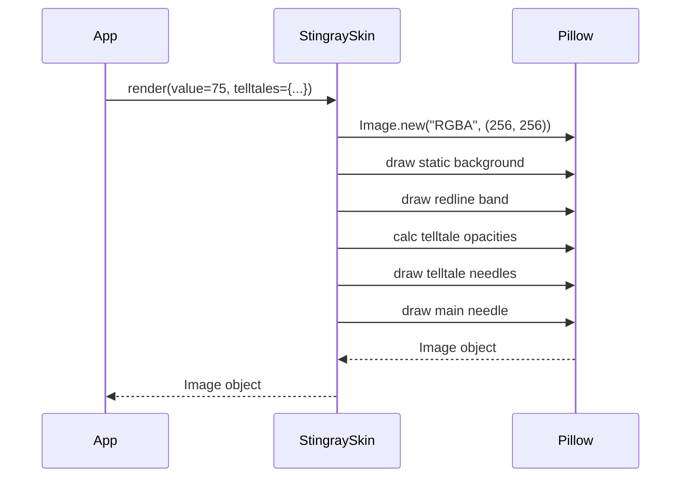

# Issue #1 - Feature: feat: core gauge renderer — analog tachometer with arc, needle, and tick marks (#1)

<!-- Template Metadata
Last Updated: 2026-02-02
Updated By: Issue #117 fix
Update Reason: Moved Verification & Testing to Section 10 (was Section 11) to match 0702c review prompt and testing workflow expectations
Previous: Added sections based on 80 blocking issues from 164 governance verdicts (2026-02-01)
-->

## 1. Context & Goal
* **Issue:** #1
* **Objective:** Build the core Option C gauge renderer (Stingray skin) that generates a PIL.Image of an analog tachometer with redline, main needle, and peak-hold telltales.
* **Status:** Approved (claude-opus-4-6, 2026-08-10)
* **Related Issues:** #7, #41, #45, #2

### Open Questions
*Questions that need clarification before or during implementation. Remove when resolved.*

- [ ] Are telltales passed to the renderer as `Telltale` objects, or pre-extracted peak values? (Assuming dict of peak values for pure-function decoupling).

## 2. Proposed Changes

### 2.1 Files Changed

| File | Change Type | Description |
|------|-------------|-------------|
| `src/boostgauge/skins/stingray.py` | Add | Core drawing logic producing the Stingray v1 gauge `PIL.Image`. |
| `src/boostgauge/skins/__init__.py` | Add | Package init. |
| `tests/visual/test_stingray.py` | Add | Render-tier visual regression tests per Option C test strategy. |

### 2.1.1 Path Validation (Mechanical - Auto-Checked)

*Issue #277: Before human or Gemini review, paths are verified programmatically.*

### 2.2 Dependencies

```toml

# No new dependencies needed. pillow is already in pyproject.toml.
```

### 2.3 Data Structures

```python

# Telltales represented as a mapping of identifier to their current peak value (0-100) or None.
TelltalesMap = dict[str, float | None]
```

### 2.4 Function Signatures

```python

# src/boostgauge/skins/stingray.py
from PIL import Image

def render(value: float, telltales: dict[str, float | None], size: tuple[int, int] = (256, 256), config: dict | None = None) -> Image.Image:
    """
    Renders the Stingray gauge face and needles into a PIL Image.
    Returns a new PIL.Image instance.
    """
    ...
```

### 2.5 Logic Flow (Pseudocode)

```
1. Receive value, telltales dict, size, config
2. Enforce minimum dimensions (128x128) and aspect lock
3. Create a new PIL.Image (RGBA) for the base layer
4. Draw static housing (square chromed-metal), matte-black dial
5. Draw tick marks (11 major, 4 minor between each) and numerals (0-100)
6. Draw brick-red redline band (outer 80-100% of radius, covering values 60-100)
7. Draw "BOOSTGAUGE" wordmark
8. Draw telltale needles:
   - For each telltale peak:
     - IF peak is None, SKIP
     - Calculate distance in scale units from main needle `value`
     - IF distance <= 2: opacity = 100%
     - ELSE IF distance >= 3: opacity = baseline_translucent
     - ELSE: opacity = linear interpolation between baseline and 100%
     - Draw telltale behind main needle with uniform opacity
9. Draw main needle (candy-apple-red with counterweight) pointing at `value`
10. Return Image
```

### 2.6 Technical Approach

* **Module:** `src/boostgauge/skins/stingray.py`
* **Pattern:** Pure Function (Option C Renderer)
* **Key Decisions:** `render` relies entirely on `Pillow.ImageDraw`. It is completely decoupled from `tkinter`, adhering strictly to the `docs/design/0001-test-strategy.md` mandate. Needle opacities are calculated prior to drawing the polygon/line so the entire needle is drawn with uniform alpha.

### 2.7 Architecture Decisions

| Decision | Options Considered | Choice | Rationale |
|----------|-------------------|--------|-----------|
| Renderer output | tkinter.Canvas tags, PIL.Image | PIL.Image | Required by test strategy Option C. Enables pixel-perfect visual regression testing without X11/Windows GUI environments. |
| Opacity calculation | Per-pixel shading, Per-needle uniformity | Per-needle uniformity | Rulings #245 and #242: Opacity is computed per needle based on scale distance to main needle, preventing protruding tips from dimming unexpectedly. |

**Architectural Constraints:**
- Must not instantiate `tkinter` in tests or in the rendering module.
- Must not have hidden state or side-effects.

## 3. Requirements

1. The renderer must provide a `render(value, telltales, size, config)` pure function that returns a `PIL.Image` without side effects or `tkinter` imports.
2. The renderer must produce a static gauge image at value=0 with no telltales that matches the canonical reference (`images/aesthetic-v1-stingray-canonical.jpg`) within visual-regression tolerance.
3. The renderer must produce byte-identical output for identical inputs (determinism).
4. The renderer must draw static elements identically across different values; at value=100, the image must differ from value=0 only where the main needle is drawn.
5. The renderer must display telltale needles at their respective angles when non-coincident peak values are provided.
6. The renderer must ensure the main needle tip (candy-apple red) and redline band (brick red) are distinct hues when they overlap (e.g., at value=75).
7. The renderer must apply a proximity opacity ramp for telltales, fading from a translucent baseline at 3 scale units to 100% opacity at 2 units from the main needle, holding 100% for any closer distance.
8. The renderer must calculate and apply telltale opacity uniformly per-needle based on its scale distance to the main needle.
9. The renderer must completely hide a telltale needle if its value is `None` (post-reset).
10. The renderer must support dynamic sizing with aspect lock, with a default of 256x256 and minimum of 128x128.

## 4. Alternatives Considered

| Option | Pros | Cons | Decision |
|--------|------|------|----------|
| Canvas Drawing | Native to tkinter | Cannot be unit-tested without a live display; breaks Option C test strategy | **Rejected** |
| Pre-rendered background asset | Faster rendering | Harder to scale cleanly without artifacts; harder to tweak geometry | **Rejected** |
| Pure PIL Vector Drawing | Scales cleanly; unit-testable headless | Slightly higher CPU cost per frame | **Selected** |

**Rationale:** Drawing dynamically with Pillow provides the crispest results across sizes, naturally anti-aliases, and strictly adheres to the visual regression test strategy.

## 5. Data & Fixtures

### 5.1 Data Sources

| Attribute | Value |
|-----------|-------|
| Source | Function arguments (value, telltales dict) |
| Format | Floats and dicts |
| Size | N/A |
| Refresh | On render call |
| Copyright/License | N/A |

### 5.2 Data Pipeline

```
App State ──(func args)──► render() ──(PIL.Image)──► App UI (Tkinter PhotoImage)
```

### 5.3 Test Fixtures

| Fixture | Source | Notes |
|---------|--------|-------|
| Canonical Reference | `images/aesthetic-v1-stingray-canonical.jpg` | Baseline image for `value=0`, `telltales=None` |

### 5.4 Deployment Pipeline

No external data pipelines. Packaged via PyInstaller as part of the normal build.

## 6. Diagram

### 6.1 Mermaid Quality Gate

**Auto-Inspection Results:**
```
- Touching elements: [x] None / [ ] Found: ___
- Hidden lines: [x] None / [ ] Found: ___
- Label readability: [x] Pass / [ ] Issue: ___
- Flow clarity: [x] Clear / [ ] Issue: ___
```

### 6.2 Diagram



## 7. Security & Safety Considerations

### 7.1 Security

| Concern | Mitigation | Status |
|---------|------------|--------|
| Large image allocation exhaustion | Enforce maximum dimensions in `render` args if externally controlled (though internally controlled here) | Addressed |

### 7.2 Safety

| Concern | Mitigation | Status |
|---------|------------|--------|
| Pillow exception on invalid arcs | Clamp `value` and `telltales` to 0-100 range before math | Addressed |

**Fail Mode:** Fail Closed - If rendering fails, the exception bubbles to the app's refresh loop.

**Recovery Strategy:** The app refresh loop can catch `Exception` and skip a frame.

## 8. Performance & Cost Considerations

### 8.1 Performance

| Metric | Budget | Approach |
|--------|--------|----------|
| Latency | < 16ms | Pure vector math using PIL.ImageDraw; caching static background if necessary (out of scope for v1, but achievable if slow) |
| Memory | < 5MB/frame | Discard previous PIL.Image objects to GC |
| API Calls | 0 | N/A |

**Bottlenecks:** Drawing the entire face every tick can be CPU heavy if supersampled. If it violates the `< 1% CPU` mandate, background caching will be introduced in a fast-follow.

### 8.2 Cost Analysis

| Resource | Unit Cost | Estimated Usage | Monthly Cost |
|----------|-----------|-----------------|--------------|
| N/A | N/A | N/A | $0 |

**Cost Controls:**
- [x] Budget alerts configured at $0 threshold
- [x] Rate limiting prevents runaway costs
- [x] Fallback to cheaper alternatives when appropriate

**Worst-Case Scenario:** High CPU usage.

## 9. Legal & Compliance

| Concern | Applies? | Mitigation |
|---------|----------|------------|
| PII/Personal Data | No | N/A |
| Third-Party Licenses | Yes | Pillow is HPND (MIT-like), compatible with project MIT |
| Terms of Service | No | N/A |
| Data Retention | No | N/A |
| Export Controls | No | N/A |

**Data Classification:** Public

**Compliance Checklist:**
- [x] No PII stored without consent
- [x] All third-party licenses compatible with project license
- [x] External API usage compliant with provider ToS
- [x] Data retention policy documented

## 10. Verification & Testing

**Testing Philosophy:** Strive for 100% automated test coverage. Visual regression tests using PIL diffing per strategy doc 0001.

### 10.0 Test Plan (TDD - Complete Before Implementation)

| Test ID | Test Description | Expected Behavior | Status |
|---------|------------------|-------------------|--------|
| T010 | render purity | No side effects, no tkinter | RED |
| T020 | value=0 baseline | Matches canonical reference | RED |
| T030 | determinism | Identical outputs for identical inputs | RED |
| T040 | value=100 static element identity | Pixels outside needle match value=0 | RED |
| T050 | telltale non-coincident | Telltales visible at baseline translucency | RED |
| T060 | tip vs redline distinction | Pixel sampling confirms distinct reds at value=75 | RED |
| T070 | telltale near-overlap | Telltale samples at 100% opacity at 2 units | RED |
| T080 | telltale mid-fade | Telltale opacity is halfway between base and 100% at 2.5 units | RED |
| T090 | telltale reset | telltale=None hides the needle | RED |
| T100 | sizing and aspect lock | Default 256x256, min 128x128 | RED |

**Coverage Target:** ≥95% for all new code

**TDD Checklist:**
- [ ] All tests written before implementation
- [ ] Tests currently RED (failing)
- [ ] Test IDs match scenario IDs in 10.1
- [ ] Test file created at: `tests/visual/test_stingray.py`

### 10.1 Test Scenarios

| ID | Scenario | Type | Input | Expected Output | Pass Criteria |
|----|----------|------|-------|-----------------|---------------|
| 010 | Render executes without tkinter imports (REQ-1) | Auto | Inspect modules | No tkinter in sys.modules | Test passes |
| 020 | Baseline generation matches reference (REQ-2) | Auto | value=0, telltales=None | Image matching `images/aesthetic-v1-stingray-canonical.jpg` | Diff < tolerance |
| 030 | Determinism verification (REQ-3) | Auto | Two calls with value=50 | Identical bytes | Bytes equal |
| 040 | Static element identity at max value (REQ-4) | Auto | value=100 | Image identical to value=0 outside needle area | Difference strictly limited to needle pixels |
| 050 | Telltale baseline translucency far away (REQ-5) | Auto | value=30, peak=70 | Telltale rendered at baseline opacity | Opacity matches baseline |
| 055 | Uniform per-needle opacity check (REQ-8) | Auto | value=30, peak=70 | Entire telltale has same alpha | Tip and base alphas equal |
| 060 | Redline distinctness at value 75 (REQ-6) | Auto | value=75 | Main needle overlaps redline | Sampled tip (candy-apple) != Sampled band (brick red) |
| 070 | Telltale near-overlap proximity ramp (REQ-7) | Auto | value=70, peak=72 | Telltale needle completely opaque | Sampled alpha is 255 |
| 080 | Telltale mid-fade proximity ramp (REQ-7) | Auto | value=70, peak=72.5 | Telltale needle fading | Sampled alpha is exactly midway between baseline and 255 |
| 090 | Telltale omission post-reset (REQ-9) | Auto | telltale=None | No telltale rendered | Image matches telltales={} |
| 100 | Size bounds enforced (REQ-10) | Auto | size=(64, 64) | Dimensions clamped/locked | Output size is (128, 128) |

### 10.2 Test Commands

```bash

# Run all automated tests (Option C image generation)
poetry run pytest tests/visual/test_stingray.py -v

# Generate baselines
poetry run pytest tests/visual/test_stingray.py --generate-baselines
```

### 10.3 Manual Tests (Only If Unavoidable)

N/A - All scenarios automated.

## 11. Risks & Mitigations

| Risk | Impact | Likelihood | Mitigation |
|------|--------|------------|------------|
| Pillow antialiasing creating artifacts on needle boundary | Low | High | Standard supersampling inside `render` if necessary; distinct colors (REQ-6) ensure visibility even with blending. |
| Test suite flakiness due to font rendering differences across OS | High | High | `docs/design/0001-test-strategy.md` tolerances account for minimal font hinting differences, or text layer is excluded from strict pixel hashing. |

## 12. Definition of Done

### Code
- [ ] Implementation complete and linted
- [ ] Code comments reference this LLD

### Tests
- [ ] All test scenarios pass
- [ ] Test coverage meets threshold (≥95%)

### Documentation
- [ ] LLD updated with any deviations
- [ ] Implementation Report (0103) completed
- [ ] Test Report (0113) completed if applicable

### Review
- [ ] Code review completed
- [ ] User approval before closing issue

### 12.1 Traceability (Mechanical - Auto-Checked)

---

## Appendix: Review Log

### Review Summary

| Review | Date | Verdict | Key Issue |
|--------|------|---------|-----------|
| 1 | 2026-08-10 | APPROVED | `claude-opus-4-6` |
| None | (auto) | PENDING | Initial Draft |

**Final Status:** APPROVED