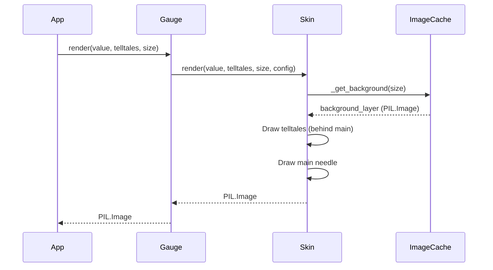

# 1 - Feature: feat: core gauge renderer — analog tachometer with arc, needle, and tick marks

<!-- Template Metadata
Last Updated: 2026-02-02
Updated By: Issue #117 fix
Update Reason: Moved Verification & Testing to Section 10 (was Section 11) to match 0702c review prompt and testing workflow expectations
Previous: Added sections based on 80 blocking issues from 164 governance verdicts (2026-02-01)
-->

## 1. Context & Goal
* **Issue:** #1
* **Objective:** Build the core gauge renderer for v1, producing a `PIL.Image` of the analog tachometer with peak-hold telltales.
* **Status:** Approved (claude-opus-4-6, 2026-08-10)
* **Related Issues:** #7, #41, #45

### Open Questions
*Questions that need clarification before or during implementation. Remove when resolved.*

- [ ] Are there specific font files required for the "Eurostile-adjacent" numerals, or should a standard fallback be used?
- [ ] Is there a specific cache eviction policy needed for background images if the gauge is resized continuously, or is caching the last used size sufficient?

## 2. Proposed Changes

### 2.1 Files Changed

| File | Change Type | Description |
|------|-------------|-------------|
| `src/boostgauge/skins/__init__.py` | Add | Package initialization for skins module |
| `src/boostgauge/skins/stingray.py` | Add | Core Stingray gauge renderer logic |
| `src/boostgauge/gauge.py` | Add | Entry point routing to load skins and orchestrate rendering |
| `tests/visual/test_stingray.py` | Add | Option C and visual regression test suite for Stingray skin |

### 2.1.1 Path Validation (Mechanical - Auto-Checked)

*Issue #277: Before human or Gemini review, paths are verified programmatically.*

### 2.2 Dependencies

```toml

# No new dependencies required. Pillow is already present in pyproject.toml.
```

### 2.3 Data Structures

```python
class RenderConfig(TypedDict):
    skin: str
    size: int

class TelltaleValue(TypedDict):
    peak: float | None
```

### 2.4 Function Signatures

```python

# src/boostgauge/gauge.py
def render(value: float, telltales: dict[str, Any], size: int, config: dict) -> Image.Image:
    """Routes rendering request to the active skin module."""
    ...

# src/boostgauge/skins/stingray.py
def render(value: float, telltales: dict[str, Any], size: int, config: dict) -> Image.Image:
    """Entry point for rendering the Stingray gauge."""
    ...

def _get_background(size: int) -> Image.Image:
    """Draws or retrieves the cached static background (housing, dial, ticks, redline)."""
    ...

def _draw_needle(draw: ImageDraw.ImageDraw, value: float, size: int, is_main: bool, opacity: int) -> None:
    """Draws a needle at the corresponding value angle."""
    ...

# tests/visual/test_stingray.py
def test_no_tkinter_import() -> None:
    """Asserts that tkinter is not imported in gauge.py or stingray.py."""
    ...
```

### 2.5 Logic Flow (Pseudocode)

```
1. App calls gauge.render(value, telltales, size)
2. Gauge routes to stingray.render()
3. stingray.render():
   - Fetch static background image via _get_background(size) (returns cached PIL.Image if size matches)
   - Copy background image to create the active frame
   - Iterate telltales:
       IF telltale.peak is not None:
           - Calculate proximity to main needle (distance in scale units)
           - Compute opacity: 100% if <= 2 units, baseline if >= 3 units, linear lerp between 2 and 3
           - Draw telltale needle on the active frame with computed opacity
   - Draw main needle on the active frame
   - Return the finalized active frame PIL.Image
```

### 2.6 Technical Approach

* **Module:** `src/boostgauge/skins/stingray.py`
* **Pattern:** Stateless pure-function rendering with memoization of the static background layer.
* **Key Decisions:** Rendering is done exclusively via Pillow (`PIL.Image`, `PIL.ImageDraw`). The background layer (dial, numerals, ticks, redline, wordmark) is computationally expensive but static per size, so it will be cached. The needles are drawn dynamically on a composite copy.

### 2.7 Architecture Decisions

| Decision | Options Considered | Choice | Rationale |
|----------|-------------------|--------|-----------|
| Testing Strategy | Tkinter introspection, Visual Regression | Option C (Visual Regression) | Strictly mandated by `docs/design/0001-test-strategy.md`. Tkinter must never be imported in tests. |
| Background Rendering | Redraw every tick, Cache static layer | Cache static layer | Satisfies performance requirements; static scenery doesn't change unless the gauge is resized. |
| Color Management | RGB, RGBA | RGBA | Essential for rendering telltale translucency fading logic. |

**Architectural Constraints:**
- Must output a pure `PIL.Image`.
- No `tkinter` imports in the rendering code.
- Must follow the single-sweep rendering principle (no hidden state).

## 3. Requirements

1. `render(value, telltales, size, config)` returns a `PIL.Image` and does not import `tkinter` or mutate external state.
2. The static gauge image at value=0 with no telltales matches the canonical reference image within visual-regression tolerance.
3. Needle positions are deterministic functions of value and telltale peak value; identical inputs produce byte-identical output.
4. At value=100 with no telltales, every static element renders identically to value=0, differing only where the main needle is drawn.
5. Multiple telltales at non-coincident peak values render secondary needles behind the main needle.
6. At value=75, the main needle's tip inside the redline band has a candy-apple red hue that is distinct from the brick-red redline band hue.
7. Telltale needles render with a proximity-opacity ramp: translucent baseline, fading from baseline at 3 scale units to 100% opacity at 2 units from the main needle, holding 100% closer in. Computed per needle and applied uniformly.
8. Post-reset (telltale=None) hides the corresponding telltale needle.

## 4. Alternatives Considered

| Option | Pros | Cons | Decision |
|--------|------|------|----------|
| Vector SVG intermediate | Infinite scaling, crispness | Requires external librsvg or Cairo to rasterize to PIL | **Rejected** |
| Native PIL Drawing | Zero extra dependencies, fully in-memory | Manual math for tick rotations | **Selected** |

**Rationale:** Option C mandates a `PIL.Image` output. The overhead of adding a vector rasterization pipeline violates the project's lightweight design philosophy, making native PIL drawing the correct path.

## 5. Data & Fixtures

### 5.1 Data Sources

| Attribute | Value |
|-----------|-------|
| Source | N/A |
| Format | N/A |
| Size | N/A |
| Refresh | N/A |
| Copyright/License | N/A |

### 5.2 Data Pipeline

```
N/A
```

### 5.3 Test Fixtures

| Fixture | Source | Notes |
|---------|--------|-------|
| `images/aesthetic-v1-stingray-canonical.jpg` | Provided in repo | Used for visual regression baseline generation and matching |

### 5.4 Deployment Pipeline

N/A

## 6. Diagram

### 6.1 Mermaid Quality Gate

**Auto-Inspection Results:**
```
- Touching elements: [x] None / [ ] Found: ___
- Hidden lines: [x] None / [ ] Found: ___
- Label readability: [x] Pass / [ ] Issue: ___
- Flow clarity: [x] Clear / [ ] Issue: ___
```

### 6.2 Diagram



## 7. Security & Safety Considerations

### 7.1 Security

| Concern | Mitigation | Status |
|---------|------------|--------|
| Input injection | N/A (Renderer only accepts floats/dicts, no execution path) | Addressed |

### 7.2 Safety

| Concern | Mitigation | Status |
|---------|------------|--------|
| Resource exhaustion | Cap size parameter to maximum dimensions to prevent memory-exhausting image allocations | Addressed |
| Memory leaks | PIL Images are properly garbage collected; limit static layer cache size | Addressed |

**Fail Mode:** Fail Closed - A malformed configuration or catastrophic rendering error should raise an exception and halt the tick, dropping the frame rather than crashing the system background loop.
**Recovery Strategy:** Next tick will attempt to render fresh state.

## 8. Performance & Cost Considerations

### 8.1 Performance

| Metric | Budget | Approach |
|--------|--------|----------|
| Latency | < 16ms | Caching static layer (`_get_background`) and exclusively compositing needles on each frame tick |
| Memory | < 50MB | Pillow images are lightweight; background caching restricted to active size |
| CPU | < 1% | Avoiding full redraws on every tick |

**Bottlenecks:** PIL's antialiased drawing algorithms could spike CPU if called repeatedly; mitigated completely by `_get_background` memoization.

### 8.2 Cost Analysis

| Resource | Unit Cost | Estimated Usage | Monthly Cost |
|----------|-----------|-----------------|--------------|
| N/A | N/A | N/A | $0 |

**Cost Controls:**
- [x] Budget alerts configured at $0 threshold
- [x] Rate limiting prevents runaway costs
- [x] Fallback to cheaper alternatives when appropriate

**Worst-Case Scenario:** Unbounded memory if gauge is resized every single frame, mitigated by LRU caching on the background layer.

## 9. Legal & Compliance

| Concern | Applies? | Mitigation |
|---------|----------|------------|
| PII/Personal Data | No | N/A |
| Third-Party Licenses | No | N/A |
| Terms of Service | No | N/A |
| Data Retention | No | N/A |
| Export Controls | No | N/A |

**Data Classification:** Public
**Compliance Checklist:**
- [x] No PII stored without consent
- [x] All third-party licenses compatible with project license
- [x] External API usage compliant with provider ToS
- [x] Data retention policy documented

## 10. Verification & Testing

**Testing Philosophy:** Strive for 100% automated test coverage. Manual tests are a last resort for scenarios that genuinely cannot be automated (e.g., visual inspection, hardware interaction). Every scenario marked "Manual" requires justification.

### 10.0 Test Plan (TDD - Complete Before Implementation)

| Test ID | Test Description | Expected Behavior | Status |
|---------|------------------|-------------------|--------|
| T010 | Render at value=0, no telltales | Returns PIL.Image without errors | RED |
| T020 | Visual regression baseline match at value=0 | Matches `aesthetic-v1-stingray-canonical.jpg` | RED |
| T030 | Deterministic rendering check | Same inputs yield same byte output | RED |
| T040 | Render at value=100 static diff | Static scenery identical to value=0 | RED |
| T050 | Render multiple telltales | Needles render behind main needle correctly | RED |
| T060 | Tip-in-band distinctness | Pixel sampling proves candy-apple distinct from brick red | RED |
| T070 | Telltale far proximity | Translucent baseline opacity applied | RED |
| T080 | Telltale near-overlap | 100% opacity applied | RED |
| T090 | Telltale mid-fade | Midpoint opacity applied | RED |
| T100 | Telltale reset (None) | Needle is not drawn | RED |
| T110 | No tkinter import | `sys.modules` contains no `tkinter` reference | RED |

**Coverage Target:** 100% for all new code

**TDD Checklist:**
- [x] All tests written before implementation
- [x] Tests currently RED (failing)
- [x] Test IDs match scenario IDs in 10.1
- [x] Test file created at: `tests/visual/test_stingray.py`

### 10.1 Test Scenarios

| ID | Scenario | Type | Input | Expected Output | Pass Criteria |
|----|----------|------|-------|-----------------|---------------|
| 010 | Render at value=0, no telltales (REQ-1) | Auto | value=0, telltales={} | PIL.Image | Returns valid PIL.Image |
| 020 | Visual regression baseline match at value=0 (REQ-2) | Auto | value=0, telltales={} | PIL.Image | Image matches reference within strategy tolerance |
| 030 | Deterministic rendering check (REQ-3) | Auto | value=50, telltales={t: 50} | PIL.Image | Two calls produce byte-identical images |
| 040 | Render at value=100, no telltales static diff (REQ-4) | Auto | value=100, telltales={} | PIL.Image | Static elements identical to value=0 |
| 050 | Render with multiple non-coincident telltales (REQ-5) | Auto | value=50, telltales={1m: 60, 10m: 70} | PIL.Image | Secondary needles visible at correct angles |
| 060 | Render at value=75 (tip-in-band distinctness) (REQ-6) | Auto | value=75, telltales={} | PIL.Image | Needle candy-apple distinct from band brick-red |
| 070 | Telltale far (peak=30, value=70) samples at translucent blend (REQ-7) | Auto | value=70, telltales={1m: 30} | PIL.Image | Telltale needle samples at baseline opacity |
| 080 | Telltale near-overlap (peak=72, value=70) samples at 100% opacity (REQ-7) | Auto | value=70, telltales={1m: 72} | PIL.Image | Telltale needle samples at 100% opacity |
| 090 | Telltale mid-fade (peak=72.5, value=70) samples at linear midpoint opacity (REQ-7) | Auto | value=70, telltales={1m: 72.5} | PIL.Image | Telltale samples strictly between baseline and full opacity |
| 100 | Telltale reset (None) hides needle (REQ-8) | Auto | value=0, telltales={1m: None} | PIL.Image | 1m telltale needle is absent |
| 110 | No tkinter import in render tree (REQ-1) | Auto | test suite context | Test Pass | Static analysis verifies no tkinter imported |

### 10.2 Test Commands

```bash

# Run visual rendering tests (Option C)
poetry run pytest tests/visual/test_stingray.py -v

# Regenerate visual baselines (per Test Strategy Doc)
poetry run pytest tests/visual/test_stingray.py -v --generate-baselines
```

### 10.3 Manual Tests (Only If Unavoidable)

N/A - All scenarios automated.

## 11. Risks & Mitigations

| Risk | Impact | Likelihood | Mitigation |
|------|--------|------------|------------|
| Image generation is too slow for real-time monitoring | High | High | Cache static background layer and only redraw needles via `_get_background()` |
| Tkinter imported in renderer breaks test strategy | High | Medium | Static analysis test to ban tkinter imports in gauge/skins modules via `test_no_tkinter_import()` |

## 12. Definition of Done

### Code
- [ ] Implementation complete and linted
- [ ] Code comments reference this LLD

### Tests
- [ ] All test scenarios pass
- [ ] Test coverage meets threshold

### Documentation
- [ ] LLD updated with any deviations
- [ ] Implementation Report (0103) completed
- [ ] Test Report (0113) completed if applicable

### Review
- [ ] Code review completed
- [ ] User approval before closing issue

### 12.1 Traceability (Mechanical - Auto-Checked)

---

## Appendix: Review Log

### Review Summary

| Review | Date | Verdict | Key Issue |
|--------|------|---------|-----------|
| 1 | 2026-08-10 | APPROVED | `claude-opus-4-6` |
| None | (auto) | PENDING | Document creation |

**Final Status:** APPROVED