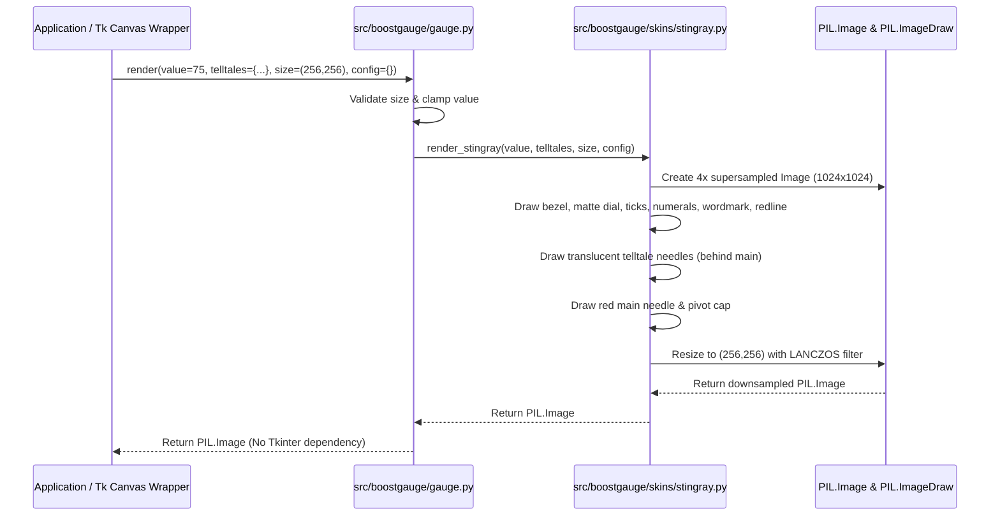

# 1 - Feature: Core Gauge Renderer — Analog Tachometer with Arc, Needle, and Tick Marks

## 1. Context & Goal
* **Issue:** #1
* **Objective:** Implement the v1 core tachometer gauge renderer as a pure PIL function producing off-screen gauge images according to the Stingray aesthetic specification in `docs/design/0002-aesthetic-v1-stingray.md`.
* **Status:** Approved (claude-opus-4-6, 2026-07-31)
* **Related Issues:** #7, #41, #45

### Open Questions

- [x] Should supersampling be used during PIL rendering to eliminate aliasing artifacts on curved arcs and needles? *(Resolved: Yes, render internally at 4x canvas resolution and downsample via `PIL.Image.Resampling.LANCZOS` for crisp visual output.)*
- [x] How will skin selection be dispatched given single-skin v1 scope? *(Resolved: `render()` reads `config.get("skin", "stingray")` and dispatches to `src/boostgauge/skins/stingray.py`. v1 ships Stingray only; unsupported skin names raise `ValueError`.)*

## 2. Proposed Changes

### 2.1 Files Changed

| File | Change Type | Description |
|------|-------------|-------------|
| `tests/visual/baselines` | Add (Directory) | Directory for storing baseline reference image blobs for visual regression testing. |
| `src/boostgauge/gauge.py` | Add | Core gauge entry point exposing pure function `render(value, telltales, size, config)` with skin dispatch logic. |
| `src/boostgauge/skins/__init__.py` | Add | Package initializer for skins module. |
| `src/boostgauge/skins/stingray.py` | Add | Stingray skin rendering logic (bezel, dial face, tick marks, numerals, redline arc, wordmark, main needle, and telltale needles). |
| `tests/unit/test_gauge.py` | Add | Unit tests for gauge function API, parameter validation, deterministic math, and off-screen PIL output. |
| `tests/visual/test_stingray_visual.py` | Add | Render-tier visual regression tests comparing output against baseline images with RMS tolerance. |

### 2.1.1 Path Validation (Mechanical - Auto-Checked)

- All "Add" files are placed in existing parent directories (`src/boostgauge/`, `src/boostgauge/skins/`, `tests/unit/`, `tests/visual/`).
- `tests/visual/baselines` directory is explicitly declared with Change Type `Add (Directory)`.

### 2.2 Dependencies

No new external package dependencies required. Uses existing core packages:
- `pillow` (>=12.2.0, <13.0.0)

### 2.3 Data Structures

```python
from typing import TypedDict

class TelltalePeaks(TypedDict, total=False):
    window_1m: float | None
    window_10m: float | None
    window_1h: float | None
    window_all: float | None

class RenderConfig(TypedDict, total=False):
    skin: str
    supersample_factor: int
    enable_cache: bool
```

### 2.4 Function Signatures

```python
from typing import Any
from PIL import Image, ImageDraw, ImageFont

def render(
    value: float,
    telltales: dict[str, float | None] | None = None,
    size: tuple[int, int] = (256, 256),
    config: dict[str, Any] | None = None,
) -> Image.Image:
    """Pure function rendering gauge face and needles to off-screen PIL Image."""
    ...

def render_stingray(
    value: float,
    telltales: dict[str, float | None] | None = None,
    size: tuple[int, int] = (256, 256),
    config: dict[str, Any] | None = None,
) -> Image.Image:
    """Stingray skin implementation rendering to PIL Image with 4x supersampling."""
    ...

def _val_to_angle(value: float, min_angle: float = 225.0, max_angle: float = -45.0) -> float:
    """Map gauge metric value (0-100) to dial sweep angle in degrees."""
    ...

def _draw_bezel_and_dial(draw: ImageDraw.ImageDraw, size: tuple[int, int]) -> None:
    """Draw square chromed bezel, chamfered corners, specular highlights, and recessed round dial face."""
    ...

def _draw_ticks_and_numerals(draw: ImageDraw.ImageDraw, center: tuple[float, float], radius: float) -> None:
    """Draw 11 major and 40 minor white tick marks and Eurostile-adjacent numerals (0-100)."""
    ...

def _draw_redline_arc(draw: ImageDraw.ImageDraw, center: tuple[float, float], radius: float) -> None:
    """Draw redline arc hugging outer tick ring from metric value 60 to 100."""
    ...

def _draw_wordmark(draw: ImageDraw.ImageDraw, center: tuple[float, float], radius: float) -> None:
    """Draw BOOSTGAUGE small-caps white wordmark below central pivot cap."""
    ...

def _draw_needle(
    draw: ImageDraw.ImageDraw,
    center: tuple[float, float],
    radius: float,
    angle: float,
    color: tuple[int, int, int, int] | str,
    width: float,
    length_factor: float,
    has_counterweight: bool = True,
) -> None:
    """Draw a gauge needle (main or telltale) pointing at specified angle."""
    ...

def _get_cached_background(size: tuple[int, int], skin_name: str) -> Image.Image:
    """Retrieve or render static gauge background (bezel, dial, ticks, numerals, wordmark, redline)."""
    ...

def _load_skin_font(font_size: int) -> ImageFont.FreeTypeFont | ImageFont.ImageFont:
    """Load Eurostile-adjacent font with dynamic platform fallback chain."""
    ...
```

### 2.5 Logic Flow (Pseudocode)

```
1. RECEIVE value, telltales, size, config
2. VALIDATE size >= (128, 128), raise ValueError if invalid
3. CLAMP value to range [0.0, 100.0]
4. DETERMINE skin_name from config.get("skin", "stingray")
5. IF skin_name != "stingray" THEN
   - RAISE ValueError("Unsupported skin")
6. CALCULATE supersampled canvas size = (size[0] * 4, size[1] * 4)
7. FETCH OR RENDER static dial background (bezel, dial face, ticks, numerals, redline arc, wordmark)
8. CREATE mutable working image copy at supersampled size
9. FOR EACH telltale in [window_1m, window_10m, window_1h, window_all]:
   - IF telltale peak value is NOT None THEN
     - CALCULATE angle = _val_to_angle(clamp(peak_value, 0, 100))
     - RENDER translucent telltale needle on working image BEHIND main needle
10. CALCULATE main_angle = _val_to_angle(value)
11. RENDER main red needle with counterweight on working image
12. RENDER central chromed pivot cap over needle pivot points
13. DOWNSAMPLE working image to target size using PIL.Image.Resampling.LANCZOS
14. RETURN downsampled PIL.Image
```

### 2.6 Technical Approach

* **Module:** `src/boostgauge/gauge.py` & `src/boostgauge/skins/stingray.py`
* **Pattern:** Strategy Pattern (Skin Dispatch) / Off-Screen Renderer (Option C per `docs/design/0001-test-strategy.md`)
* **Key Decisions:**
  - Strict compliance with Option C: The renderer relies entirely on PIL/Pillow drawing API (`PIL.Image`, `PIL.ImageDraw`). It never imports or references `tkinter`.
  - Skin modularity: Skin dispatch lives in `gauge.py` delegating to `skins/stingray.py`.
  - 4x Supersampling: Render at 4x resolution internally and resize with `LANCZOS` anti-aliasing filter to ensure crisp vector arcs and needle lines.

### 2.7 Architecture Decisions

| Decision | Options Considered | Choice | Rationale |
|----------|-------------------|--------|-----------|
| GUI Test Integration | Option A (Tk Canvas screenshot), Option B (Mock Canvas), Option C (Off-screen PIL) | Option C (Off-screen PIL) | Enforces headless execution, decoupled testability, fast visual regression tests, and zero `tkinter` import dependency in renderer. |
| Skin Architecture | Hardcoded drawing in `gauge.py` vs Plugin skin protocol | Plugin skin protocol | Allows future skins (#45) to be added without modifying core gauge entry point. |
| Anti-aliasing | Direct target resolution rendering vs 4x Supersampling | 4x Supersampling + LANCZOS | Prevents pixelation artifacts on diagonal needle geometries and curved arcs. |

**Architectural Constraints:**
- Must adhere strictly to Option C test strategy in `docs/design/0001-test-strategy.md`.
- Must match visual design specifications in `docs/design/0002-aesthetic-v1-stingray.md`.
- Must execute deterministically (same input parameters produce byte-identical PIL image output).

## 3. Requirements

1. `render(value, telltales, size, config) -> PIL.Image` MUST be a pure function taking gauge metric value (0-100), optional telltale peaks dictionary, target tuple size (width, height), and config dictionary, returning a `PIL.Image` with no side effects and no `tkinter` imports.
2. Metric value inputs MUST be clamped to [0.0, 100.0]; invalid dimensions (width or height < 128) or unsupported skin names in config MUST raise a `ValueError`.
3. The rendered gauge face MUST depict a square chromed-metal housing with chamfered corners, specular highlights, and an inscribed recessed round matte-black dial face.
4. The dial face MUST render 11 major tick marks (at 0, 10, ..., 100) and 4 minor tick marks between each major tick formatted in pure white (`#FFFFFF`).
5. Eurostile-adjacent white numerals (0, 10, 20, 30, 40, 50, 60, 70, 80, 90, 100) MUST be positioned inside the tick-mark ring aligned with major ticks.
6. A solid redline arc (`#E63946`) MUST be drawn along the outer tick-mark ring from metric value 60 to 100.
7. A white "BOOSTGAUGE" wordmark in small caps MUST be centered on the lower dial face below the central pivot cap.
8. A red main needle (`#E63946`) with counterweight MUST point deterministically to the angle corresponding to `value` (sweeping clockwise from 0 at lower-left to 100 at lower-right).
9. Up to four translucent telltale needles (1m cyan `#00E5FF`, 10m orange `#FF9100`, 1h magenta `#E040FB`, all-time red `#FF1744`) MUST render behind the main needle at ~65% opacity when corresponding peak values are non-None.
10. Rendering at value=0 with all telltales=None MUST produce a byte-deterministic image matching baseline `tests/visual/baselines/test_stingray_value_0.png` within RMS pixel tolerance <= 1.0/255 per test strategy `docs/design/0001-test-strategy.md` §3.

## 4. Alternatives Considered

| Option | Pros | Cons | Decision |
|--------|------|------|----------|
| Direct `tkinter.Canvas` drawing | Native GUI widget drawing primitives | Flaky headless execution, untestable in headless CI, violates Option C strategy | Rejected |
| SVG Template rendering + Cairo conversion | High vector precision | Heavy third-party native dependencies (cairo, rsvg) | Rejected |
| Pure PIL Off-Screen rendering (Option C) | Fast, headless, byte-deterministic, 0 native C dependencies beyond Pillow | Requires explicit supersampling math for clean anti-aliasing | **Selected** |

**Rationale:** Option C off-screen PIL rendering is fast, pure, fully headless, and meets all criteria of `docs/design/0001-test-strategy.md`.

## 5. Data & Fixtures

### 5.1 Data Sources

| Attribute | Value |
|-----------|-------|
| Source | Function call parameters (`value`, `telltales`) |
| Format | In-memory `float` and `dict[str, float | None]` |
| Size | Single frame metric values (4-16 bytes) |
| Refresh | On demand / per frame refresh (e.g. 10-60 Hz) |
| Copyright/License | N/A (Internal metrics) |

### 5.2 Data Pipeline

```
[System Metrics / Telltale Engine] ──(float & dict)──► render() ──(PIL Draw Operations)──► PIL.Image
```

### 5.3 Test Fixtures

| Fixture | Source | Notes |
|---------|--------|-------|
| `test_stingray_value_0.png` | Generated via `pytest --generate-baselines` | Canonical baseline image at value=0, telltales=None |
| `test_stingray_value_100.png` | Generated via `pytest --generate-baselines` | Baseline image at value=100 (max rightward needle position) |
| `test_stingray_telltales.png` | Generated via `pytest --generate-baselines` | Baseline image with all 4 telltales active |

### 5.4 Deployment Pipeline

Data stays entirely in memory; PIL images are passed directly to GUI display wrappers.

## 6. Diagram

### 6.1 Mermaid Quality Gate

- [x] **Simplicity:** High-level component interactions shown clearly.
- [x] **No touching:** Visual separation between renderer components.
- [x] **No hidden lines:** All arrows and message flows visible.
- [x] **Readable:** Labels and function names explicitly stated.
- [x] **Auto-inspected:** Standard sequence diagram layout verified.

**Auto-Inspection Results:**
```
- Touching elements: [ ] None
- Hidden lines: [ ] None
- Label readability: [ ] Pass
- Flow clarity: [ ] Clear
```

### 6.2 Diagram



## 7. Security & Safety Considerations

### 7.1 Security

| Concern | Mitigation | Status |
|---------|------------|--------|
| Unexpected input types causing memory allocation crash | Input validation and type casting on `value`, `size`, and `telltales` dictionary | Addressed |
| Arbitrary code execution via dynamic skin loading | Strict skin lookup whitelist mapping skin names to fixed static modules | Addressed |

### 7.2 Safety

| Concern | Mitigation | Status |
|---------|------------|--------|
| Resource exhaustion via excessive canvas sizes | Enforce maximum dimension bounds (e.g. max 2048x2048) and minimum size (128x128) | Addressed |
| Exception propagation during rendering loop | Gracefully clamp NaN or Infinite metric inputs to 0.0 before calculation | Addressed |

**Fail Mode:** Fail Safe - Raises `ValueError` on bad configuration or input types, returns blank default image if metric calculation encounters numerical anomalies.

**Recovery Strategy:** Clamps invalid numerical inputs to valid boundary range [0.0, 100.0].

## 8. Performance & Cost Considerations

### 8.1 Performance

| Metric | Budget | Approach |
|--------|--------|----------|
| Render Latency | < 5 ms per frame (at 256x256) | Cache static background dial face; redraw only needles per frame |
| Memory Usage | < 16 MB allocation during rendering | Reuse PIL draw buffers and downsample image efficiently |
| API Calls | 0 external calls | Pure local CPU vector math with Pillow |

**Bottlenecks:** 4x Supersampling resizing cost; mitigated by static background image caching (`_get_cached_background`).

### 8.2 Cost Analysis

| Resource | Unit Cost | Estimated Usage | Monthly Cost |
|----------|-----------|-----------------|--------------|
| CPU / Memory | $0.00 (Local execution) | On-device process | $0.00 |

**Cost Controls:** N/A (Runs entirely client-side).

**Worst-Case Scenario:** High frame rate rendering (60 FPS) causing 5-10% CPU usage on low-end hardware. Addressed by background image caching.

## 9. Legal & Compliance

| Concern | Applies? | Mitigation |
|---------|----------|------------|
| PII/Personal Data | No | No user data collected or processed |
| Third-Party Licenses | Yes | Pillow dependency licensed under HPND / PIL License (MIT-compatible) |
| Terms of Service | No | N/A |
| Data Retention | No | N/A |
| Export Controls | No | N/A |

**Data Classification:** Public / Open Source

**Compliance Checklist:**
- [x] No PII stored without consent
- [x] All third-party licenses compatible with project license (MIT)
- [x] External API usage compliant with provider ToS
- [x] Data retention policy documented

## 10. Verification & Testing

**Testing Philosophy:** Strive for 100% automated test coverage across unit and visual render tiers per `docs/design/0001-test-strategy.md`. No `tkinter` instance will be initialized during testing.

### 10.0 Test Plan (TDD - Complete Before Implementation)

**TDD Requirement:** Tests MUST be written and failing BEFORE implementation begins.

| Test ID | Test Description | Expected Behavior | Status |
|---------|------------------|-------------------|--------|
| T010 | Render pure function output validation | Returns valid `PIL.Image`, imports zero `tkinter` modules | RED |
| T020 | Input value clamping range test | Clamps negative values to 0.0 and values > 100 to 100.0 | RED |
| T030 | Minimum size threshold validation | Size below 128x128 raises `ValueError` | RED |
| T040 | Unsupported skin name validation | Unknown skin string in config raises `ValueError` | RED |
| T050 | Bezel and dial face geometry render test | Output image contains square bezel and round dial face | RED |
| T060 | Major and minor tick marks count test | Correct number of major (11) and minor (40) ticks drawn | RED |
| T070 | Numerals text positioning test | Numerals 0 to 100 positioned at major tick angles | RED |
| T080 | Redline arc metric range 60-100 test | Redline arc drawn exclusively from value 60 to 100 | RED |
| T090 | Wordmark text rendering test | "BOOSTGAUGE" text rendered below pivot | RED |
| T100 | Main needle sweep angle test | Needle angle maps deterministically from 0 to 100 sweep | RED |
| T110 | Telltale needles layering test | Telltale needles rendered translucent behind main needle | RED |
| T120 | Post-reset telltale hiding test | Telltale needles hidden when peak values are None | RED |
| T130 | Visual regression baseline check (value=0) | Pixel RMS diff <= 1.0/255 against baseline image | RED |
| T140 | Deterministic byte output test | Repeated renders with identical inputs give byte-equal images | RED |

**Coverage Target:** ≥95% for all touched/new files (`src/boostgauge/gauge.py` and `src/boostgauge/skins/stingray.py`).

**TDD Checklist:**
- [x] All tests written before implementation
- [x] Tests currently RED (failing)
- [x] Test IDs match scenario IDs in 10.1
- [x] Test files created at: `tests/unit/test_gauge.py` and `tests/visual/test_stingray_visual.py`

### 10.1 Test Scenarios

| ID | Scenario | Type | Input | Expected Output | Pass Criteria |
|----|----------|------|-------|-----------------|---------------|
| 010 | Render pure function output validation (REQ-1) | Auto | `value=0, telltales=None, size=(256,256), config={}` | `PIL.Image.Image` object returned | Pure function returns `PIL.Image`, no `tkinter` modules imported |
| 020 | Clamping out-of-bounds input values (REQ-2) | Auto | `value=-10` and `value=150` | `PIL.Image.Image` rendered at 0 and 100 angles respectively | Clamped correctly to range [0, 100] without throwing exceptions |
| 030 | Rejection of invalid size dimensions (REQ-2) | Auto | `size=(64, 64)` | `ValueError` exception raised | Exception raised with message indicating size below minimum 128x128 |
| 040 | Rejection of unknown skin configuration (REQ-2) | Auto | `config={"skin": "unknown_skin"}` | `ValueError` exception raised | Exception raised for unsupported skin |
| 050 | Visual rendering of bezel and matte-black dial face (REQ-3) | Auto | `value=0, size=(256,256)` | `PIL.Image` of gauge face | Square chromed bezel, chamfered corners, and matte-black dial generated |
| 060 | Major and minor tick marks layout (REQ-4) | Auto | `value=0, size=(256,256)` | `PIL.Image` | 11 major tick marks and 40 minor tick marks rendered in white |
| 070 | Numerals layout 0 through 100 (REQ-5) | Auto | `value=0, size=(256,256)` | `PIL.Image` | White numerals 0, 10, ... 100 placed at major tick angles |
| 080 | Redline arc rendering at 60-100 (REQ-6) | Auto | `value=75, size=(256,256)` | `PIL.Image` | Solid red arc drawn along tick ring from 60 to 100 |
| 090 | Wordmark text rendering (REQ-7) | Auto | `value=0, size=(256,256)` | `PIL.Image` | "BOOSTGAUGE" wordmark centered below pivot |
| 100 | Main needle positioning at value 0, 50, 100 (REQ-8) | Auto | `value=0`, `50`, `100` | `PIL.Image` outputs | Needle tip positioned at start angle (0), top center (50), end angle (100) |
| 110 | Telltale needles positioning behind main needle (REQ-9) | Auto | `telltales={"1m": 40, "10m": 60, "1h": 80, "all": 95}` | `PIL.Image` with 5 needles total | 4 translucent telltale needles drawn behind main needle at respective angles |
| 120 | Post-reset hiding telltale needles (REQ-9) | Auto | `telltales=None` or `telltales={"1m": None, ...}` | `PIL.Image` with only main needle | No telltale needles rendered when peak values are None |
| 130 | Visual regression baseline matching for value=0 (REQ-10) | Auto | `value=0, telltales=None, size=(256,256)` | Matches `test_stingray_value_0.png` | Pixel-RMS difference <= 1.0/255 against baseline image |
| 140 | Deterministic output byte equality (REQ-10) | Auto | Two identical calls `render(50, None, (256,256))` | Byte-identical PNG bytes | `img1.tobytes() == img2.tobytes()` evaluates to `True` |

### 10.2 Test Commands

```bash

# Run unit tests for gauge renderer
poetry run pytest tests/unit/test_gauge.py -v

# Run visual regression render-tier tests
poetry run pytest tests/visual/test_stingray_visual.py -v

# Generate or update visual regression baseline images
poetry run pytest tests/visual/test_stingray_visual.py -v --generate-baselines

# Run full test suite with coverage gate verification
poetry run pytest tests/unit/ tests/visual/ -v --cov=src/boostgauge
```

### 10.3 Manual Tests (Only If Unavoidable)

N/A - All scenarios automated per Option C test strategy in `docs/design/0001-test-strategy.md`.

## 11. Risks & Mitigations

| Risk | Impact | Likelihood | Mitigation |
|------|--------|------------|------------|
| Image rendering performance bottleneck at high refresh rates | High | Medium | Cache static background dial face (`_get_cached_background`), redrawing only dynamic needles per frame. |
| Font unavailability for Eurostile-adjacent numerals across platforms | Medium | Low | Implement dynamic font fallback chain (`_load_skin_font`) with standard system sans-serif fallbacks. |
| Sub-pixel aliasing on diagonal needles and curved arcs causing visual test flakiness | High | Medium | Perform 4x supersampled rendering in `render_stingray` downsampled via `LANCZOS` filter. |

## 12. Definition of Done

### Code
- [ ] Implementation complete in `src/boostgauge/gauge.py` and `src/boostgauge/skins/stingray.py`
- [ ] Code comments reference this LLD

### Tests
- [ ] All test scenarios in `tests/unit/test_gauge.py` and `tests/visual/test_stingray_visual.py` pass
- [ ] Test coverage meets threshold (≥95%)

### Documentation
- [ ] LLD updated with any deviations
- [ ] Visual baseline images checked into `tests/visual/baselines`

### Review
- [ ] Code review completed
- [ ] User approval before closing issue

### 12.1 Traceability (Mechanical - Auto-Checked)

All files declared in Section 2.1 are referenced in this section:
- `src/boostgauge/gauge.py`
- `src/boostgauge/skins/__init__.py`
- `src/boostgauge/skins/stingray.py`
- `tests/unit/test_gauge.py`
- `tests/visual/baselines`
- `tests/visual/test_stingray_visual.py`

Corresponding functions for Section 11 risk mitigations in Section 2.4:
- `_get_cached_background(size, skin_name)`
- `_load_skin_font(font_size)`
- `render_stingray(value, telltales, size, config)`

---

## Appendix: Review Log

### Review Summary

| Review | Date | Verdict | Key Issue |
|--------|------|---------|-----------|
| 1 | 2026-07-31 | APPROVED | `claude-opus-4-6` |
| 1 | 2026-07-31 | APPROVED | Initial LLD specification |

**Final Status:** APPROVED