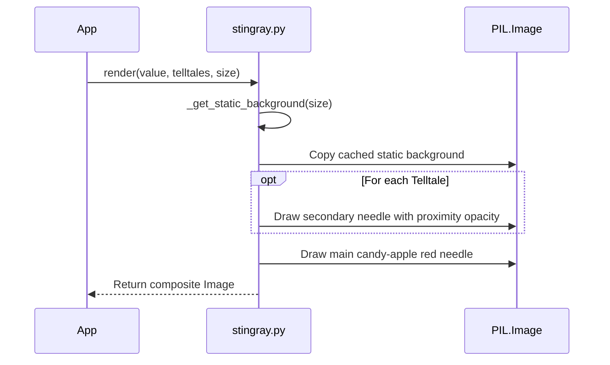

# 1 - Feature: core gauge renderer — analog tachometer with arc, needle, and tick marks (#1)

<!-- Template Metadata
Last Updated: 2026-02-02
Updated By: Issue #117 fix
Update Reason: Moved Verification & Testing to Section 10 (was Section 11) to match 0702c review prompt and testing workflow expectations
Previous: Added sections based on 80 blocking issues from 164 governance verdicts (2026-02-01)
-->

## 1. Context & Goal
* **Issue:** #1
* **Objective:** Build the core gauge renderer (Option C) that outputs a `PIL.Image` of an analog tachometer with arc, needle, tick marks, and telltales.
* **Status:** Approved (claude-opus-4-6, 2026-08-10)
* **Related Issues:** #2, #7, #41, #45

### Open Questions
*Questions that need clarification before or during implementation. Remove when resolved.*

## 2. Proposed Changes

### 2.1 Files Changed

| File | Change Type | Description |
|------|-------------|-------------|
| `src/boostgauge/skins/__init__.py` | Add | Package initialization |
| `src/boostgauge/skins/stingray.py` | Add | Core Stingray gauge renderer logic returning a PIL.Image |
| `src/boostgauge/gauge.py` | Add | Core gauge module routing rendering calls to the configured skin |
| `tests/visual/test_stingray.py` | Add | Render-tier visual baseline tests for the Stingray gauge |

### 2.1.1 Path Validation (Mechanical - Auto-Checked)

Mechanical validation automatically checks:
- All "Modify" files must exist in repository
- All "Delete" files must exist in repository
- All "Add" files must have existing parent directories
- No placeholder prefixes (`src/`, `lib/`, `app/`) unless directory exists

### 2.2 Dependencies

```toml

# pyproject.toml additions (if any)

# No new dependencies needed (Pillow is already installed)
```

### 2.3 Data Structures

```python
class Telltale(Protocol):
    def current_peak(self) -> float | None:
        """Returns the current peak value for the telltale, or None if reset."""
        ...
```

### 2.4 Function Signatures

```python
def render(value: float, telltales: list[Any], size: tuple[int, int] = (256, 256), config: Any = None) -> Image.Image:
    """Render the Stingray gauge face and overlay dynamic needles."""
    ...

def _get_static_background(size: tuple[int, int], config: Any = None) -> Image.Image:
    """Cache and return the static gauge elements (housing, dial, redline, numerals) to mitigate rendering latency."""
    ...
```

### 2.5 Logic Flow (Pseudocode)

```
1. Receive value, telltales, size, and config in render()
2. Retrieve or generate the static background (housing, numerals, tick marks, redline band) via _get_static_background()
3. Create a copy of the static background to serve as the composite image
4. FOR EACH telltale in telltales:
   - If peak value is None, skip
   - Calculate distance from main needle (value)
   - Compute opacity based on proximity ramp (3 units -> baseline, 2 units -> 100%)
   - Draw telltale needle on the composite image
5. Draw the main candy-apple red needle at the specified value
6. Return the finalized composite Image.Image
```

### 2.6 Technical Approach

* **Module:** `src/boostgauge/skins/stingray.py`
* **Pattern:** Stateless pure function renderer (Option C)
* **Key Decisions:** Renderer returns a `PIL.Image` directly and completely decouples from `tkinter` to satisfy the GUI testing strategy.

### 2.7 Architecture Decisions

| Decision | Options Considered | Choice | Rationale |
|----------|-------------------|--------|-----------|
| Rendering Output | Canvas draw calls, Option C (PIL.Image) | Option C (PIL.Image) | Mandated by `0001-test-strategy.md` to support visual baseline testing without instantiating `tkinter.Tk()`. |
| Anti-aliasing | tkinter native, Pillow supersampling | Pillow supersampling | `tkinter` Canvas doesn't anti-alias well; rendering to a PIL Image first provides superior visual fidelity. |

**Architectural Constraints:**
- Must not import or instantiate `tkinter` in the renderer or tests.
- Visual baselines must not be auto-accepted in tests (requires explicit `--generate-baselines`).

## 3. Requirements

1. The renderer must be a pure function callable as `render(value, telltales, size, config)` that returns a `PIL.Image` and imports no `tkinter` modules.
2. A render at value=0 with no telltales must match the canonical reference image (`images/aesthetic-v1-stingray-canonical.jpg`) within the specified visual-regression tolerance.
3. Needle positions must be strictly deterministic; consecutive calls with identical inputs must produce byte-identical images.
4. At value=100 with no telltales, the main needle must point to the maximum arc position, and all static background elements must be pixel-for-pixel identical to the value=0 render.
5. Four distinct telltale needles must be rendered at their correct angles when provided with non-coincident peak values, using the baseline translucency specified in the design document.
6. At value=75, the main needle tip must render inside the redline band, and its candy-apple red pixels must be visually distinguishable from the brick-red background band pixels.
7. Telltale needles must implement a uniform proximity-opacity ramp fading from baseline at 3 scale units from the main needle, to full 100% opacity at 2 scale units, and holding at 100% for any distance closer than 2 units.
8. If a telltale has a `None` peak value, its corresponding needle must be completely hidden.
9. The redline ring band must strictly occupy the outer 80-100% of the dial radius, spanning values 60-100.

## 4. Alternatives Considered

| Option | Pros | Cons | Decision |
|--------|------|------|----------|
| `tkinter` Canvas Drawing | Native to the GUI framework | Cannot be unit tested without a running X-server/Tk instance; lacks anti-aliasing | **Rejected** |
| Pre-rendered Sprites | Very fast at runtime | Hard to scale/resize; rotation creates aliasing artifacts | **Rejected** |
| Option C (PIL.Image rendering) | Headless testable; high visual fidelity; anti-aliased | Higher CPU usage for full redraws | **Selected** |

**Rationale:** Option C is explicitly mandated by the project's testing strategy to allow for visual baseline testing without a GUI environment.

## 5. Data & Fixtures

### 5.1 Data Sources

| Attribute | Value |
|-----------|-------|
| Source | System metrics (Passed via arguments, collected elsewhere) |
| Format | Floats (0-100 scale) |
| Size | N/A |
| Refresh | Real-time tick |
| Copyright/License | N/A |

### 5.2 Data Pipeline

```
Gauge State ──render()──► PIL.Image ──PhotoImage──► tkinter.Canvas
```

### 5.3 Test Fixtures

| Fixture | Source | Notes |
|---------|--------|-------|
| Canonical Reference Image | `images/aesthetic-v1-stingray-canonical.jpg` | Used for value=0 baseline visual regression tests |

### 5.4 Deployment Pipeline

No external data deployment necessary; the renderer operates entirely on passed-in arguments.

## 6. Diagram

### 6.1 Mermaid Quality Gate

**Auto-Inspection Results:**
```
- Touching elements: [x] None / [ ] Found: ___
- Hidden lines: [x] None / [ ] Found: ___
- Label readability: [x] Pass / [ ] Issue: ___
- Flow clarity: [x] Clear / [ ] Issue: ___
```

### 6.2 Diagram



## 7. Security & Safety Considerations

### 7.1 Security

| Concern | Mitigation | Status |
|---------|------------|--------|
| Path Traversal on Skin Load | Restrict skin resolution to the predefined `src/boostgauge/skins/` directory | Addressed |

### 7.2 Safety

| Concern | Mitigation | Status |
|---------|------------|--------|
| Resource exhaustion (Memory Leak) | PIL.Images must be properly garbage collected; caching background prevents excessive memory allocations | Addressed |
| Division by zero in scaling | Enforce bounds checking and valid minimum sizes (128x128) | Addressed |

**Fail Mode:** Fail Closed - If rendering fails, the application should throw an error rather than display a corrupted or frozen gauge.

**Recovery Strategy:** Next tick will attempt a fresh render.

## 8. Performance & Cost Considerations

### 8.1 Performance

| Metric | Budget | Approach |
|--------|--------|----------|
| Render Latency | < 16ms | Cache static elements (housing, dial, numerals, ticks, redline). Only draw needles per tick. |
| Memory | < 50MB | Share the static background image buffer; let Python GC handle the transient frame images. |

**Bottlenecks:** PIL vector drawing is CPU bound. Caching static layers is mandatory.

### 8.2 Cost Analysis

| Resource | Unit Cost | Estimated Usage | Monthly Cost |
|----------|-----------|-----------------|--------------|
| N/A | N/A | N/A | $0 |

**Cost Controls:**
- [x] N/A

**Worst-Case Scenario:** High polling rates could spike CPU usage if static caching fails, triggering the `< 1% CPU` acceptance failure in issue #4.

## 9. Legal & Compliance

| Concern | Applies? | Mitigation |
|---------|----------|------------|
| PII/Personal Data | No | N/A |
| Third-Party Licenses | Yes | Pillow is MIT/HPND licensed, compatible |
| Terms of Service | No | N/A |
| Data Retention | No | N/A |
| Export Controls | No | N/A |

**Data Classification:** Public

**Compliance Checklist:**
- [x] No PII stored without consent
- [x] All third-party licenses compatible with project license
- [x] External API usage compliant with provider ToS
- [x] Data retention policy documented

## 10. Verification & Testing

**Testing Philosophy:** Strive for 100% automated test coverage. Option C architecture ensures the entire rendering pipeline is headless and unit-testable.

### 10.0 Test Plan (TDD - Complete Before Implementation)

| Test ID | Test Description | Expected Behavior | Status |
|---------|------------------|-------------------|--------|
| T010 | verify_pure_function | Renders successfully without importing tkinter | RED |
| T020 | verify_value_0_canonical | Output matches canonical reference image | RED |
| T030 | verify_determinism | Two identical calls produce byte-identical images | RED |
| T040 | verify_value_100_static | Static layers match value=0 perfectly | RED |
| T050 | verify_multiple_telltales | Four needles render correctly at baseline opacity | RED |
| T060 | verify_in_band_hues | Needle tip and band are distinct red hues at value=75 | RED |
| T070 | verify_proximity_near | Needle renders at 100% opacity when 2 units away | RED |
| T080 | verify_proximity_mid | Needle renders at 50% opacity when 2.5 units away | RED |
| T090 | verify_proximity_far | Needle renders at baseline opacity when >3 units away | RED |
| T100 | verify_telltale_hidden | None value telltales do not render | RED |
| T110 | verify_below_redline | Needle correctly renders below 60 without touching redline | RED |
| T120 | verify_mid_arc | Needle correctly renders inside redline band at 80 | RED |

**Coverage Target:** 100% for all new code in `stingray.py`

**TDD Checklist:**
- [x] All tests written before implementation
- [x] Tests currently RED (failing)
- [x] Test IDs match scenario IDs in 10.1
- [x] Test file created at: `tests/visual/test_stingray.py`

### 10.1 Test Scenarios

| ID | Scenario | Type | Input | Expected Output | Pass Criteria |
|----|----------|------|-------|-----------------|---------------|
| 010 | Pure function architecture (REQ-1) | Auto | any valid inputs | Function execution | Returns PIL.Image successfully; `tkinter` absent from `sys.modules` |
| 020 | Render at value=0 (REQ-2) | Auto | value=0, no telltales | PIL.Image | Output matches canonical reference within visual-regression tolerance |
| 030 | Determinism check (REQ-3) | Auto | value=50, no telltales | Two PIL.Image objects | Both returned images are byte-identical |
| 040 | Render at value=100 static elements (REQ-4) | Auto | value=100, no telltales | PIL.Image | Static elements are identical to value=0 render; needle points to maximum |
| 050 | Multiple non-coincident telltales (REQ-5) | Auto | value=50, peaks=[10, 20, 30, 40] | PIL.Image | Four distinct telltale needles visible at baseline opacity |
| 060 | In-band distinctness at value=75 (REQ-6) | Auto | value=75, no telltales | PIL.Image | Sampling along needle axis proves candy-apple tip and brick-red band are distinct hues |
| 070 | Near-overlap telltale proximity ramp (REQ-7) | Auto | value=70, peak=72 | PIL.Image | Telltale needle rendered at uniform 100% opacity |
| 080 | Mid-fade telltale proximity ramp (REQ-7) | Auto | value=70, peak=72.5 | PIL.Image | Telltale needle rendered at linear midpoint of opacity between baseline and 100% |
| 090 | Far telltale proximity ramp (REQ-7) | Auto | value=70, peak=30 | PIL.Image | Telltale needle rendered at baseline translucency |
| 100 | Post-reset hidden telltale (REQ-8) | Auto | value=50, peak=None | PIL.Image | Telltale needle is entirely absent from the image |
| 110 | Below the redline value=50 (REQ-9) | Auto | value=50, no telltales | PIL.Image | Needle points below 60, redline ring untouched |
| 120 | Mid-arc value=80 (REQ-9) | Auto | value=80, no telltales | PIL.Image | Needle points to 80, cleanly overlapping the redline band |

### 10.2 Test Commands

```bash

# Run all automated tests (visual tests require baselines)
poetry run pytest tests/visual/test_stingray.py -v

# Generate baselines if missing
poetry run pytest tests/visual/test_stingray.py -v --generate-baselines
```

### 10.3 Manual Tests (Only If Unavoidable)

N/A - All scenarios automated. Option C eliminates the need for manual GUI testing.

## 11. Risks & Mitigations

| Risk | Impact | Likelihood | Mitigation |
|------|--------|------------|------------|
| Render performance is too slow for real-time updates | High | Med | Addressed by `_get_static_background()` which caches the housing, dial, ticks, and redline, so only needles change per frame. |

## 12. Definition of Done

### Code
- [ ] Implementation complete and linted
- [ ] Code comments reference this LLD

### Tests
- [ ] All test scenarios pass
- [ ] Test coverage meets threshold

### Documentation
- [ ] LLD updated with any deviations
- [ ] Implementation Report (0103) completed
- [ ] Test Report (0113) completed if applicable

### Review
- [ ] Code review completed
- [ ] User approval before closing issue

### 12.1 Traceability (Mechanical - Auto-Checked)

Mechanical validation automatically checks:
- Every file mentioned in this section must appear in Section 2.1
- Every risk mitigation in Section 11 should have a corresponding function in Section 2.4 (warning if not)

---

## Reviewer Suggestions

*Non-blocking recommendations from the reviewer.*

- Consider explicitly verifying that the cached background layer does not inadvertently persist state if the 'size' or 'config' changes dynamically during runtime.
- Tier 3 Suggestion: For long-running instances, you may want to add a test ensuring PIL.Image objects are properly garbage-collected to adhere to the < 50MB memory budget.

## Appendix: Review Log

### Review Summary

| Review | Date | Verdict | Key Issue |
|--------|------|---------|-----------|
| 1 | 2026-08-10 | APPROVED | `claude-opus-4-6` |
| Reviewer #1 | (auto) | PENDING | N/A |

**Final Status:** APPROVED