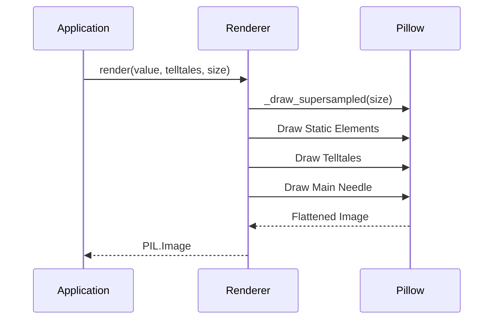

# Issue #1 - Feature: core gauge renderer — analog tachometer with arc, needle, and tick marks

## 1. Context & Goal
* **Issue:** #1
* **Objective:** Build the core gauge renderer (Stingray skin) that produces a visual tachometer `PIL.Image` from metric values and telltale peaks.
* **Status:** Approved (claude-opus-4-6, 2026-08-15)
* **Related Issues:** #7, #41, #45

### Open Questions
None.

## 2. Proposed Changes

### 2.1 Files Changed

| File | Change Type | Description |
|------|-------------|-------------|
| `src/boostgauge/skins/stingray.py` | Add | Core gauge rendering logic implementing pure `render()` |
| `tests/visual/test_stingray.py` | Add | Visual regression tests covering render cases and colors |
| `tests/conftest.py` | Modify | Add `--generate-baselines` pytest flag for visual tests |

### 2.1.1 Path Validation (Mechanical - Auto-Checked)

*Issue #277: Before human or Gemini review, paths are verified programmatically.*

Mechanical validation automatically checks:
- All "Modify" files must exist in repository
- All "Delete" files must exist in repository
- All "Add" files must have existing parent directories
- No placeholder prefixes (`src/`, `lib/`, `app/`) unless directory exists

**If validation fails, the LLD is BLOCKED before reaching review.**

### 2.2 Dependencies

```toml

# pyproject.toml additions (if any)

# None required. pillow is already present in pyproject.toml.
```

### 2.3 Data Structures

```python
class Telltale:
    # Existing class from #41, consumed here
    def current_peak(self) -> float | None: ...

class SkinConfig(TypedDict):
    size: int
    baseline_translucency: float
```

### 2.4 Function Signatures

```python
def render(value: float, telltales: list[Any], size: int = 256, config: Any = None) -> Any:
    """Renders the Stingray tachometer face and needles as a PIL Image."""
    ...

def _draw_supersampled(size: int, draw_instructions: Callable) -> Any:
    """Creates a supersampled image to mitigate lack of sub-pixel drawing primitives."""
    ...
```

### 2.5 Logic Flow (Pseudocode)

```
1. Calculate required angles for value and telltales based on 225° - 2.7° * v
2. Allocate base PIL Image using _draw_supersampled for anti-aliasing
3. Draw static elements (housing, dial, ticks, numerals, redline band #9B3020, wordmark)
4. For each telltale in telltales:
   - Peak = telltale.current_peak()
   - IF Peak is None THEN continue
   - Distance d = |Peak - value|
   - IF d >= 3 THEN opacity = baseline
   - ELSE IF d <= 2 THEN opacity = 100%
   - ELSE opacity = linear interpolation between baseline and 100%
   - Draw telltale needle uniformly with opacity at Peak angle
5. Draw main needle (#F73923) at value angle
6. Return downscaled PIL Image object
```

### 2.6 Technical Approach

* **Module:** `src/boostgauge/skins/stingray.py`
* **Pattern:** Pure Function
* **Key Decisions:** Generates an isolated `PIL.Image` strictly following Option C (GUI testing strategy). No internal `tkinter` usage is permitted, allowing safe headless validation and deterministic baselines.

### 2.7 Architecture Decisions

| Decision | Options Considered | Choice | Rationale |
|----------|-------------------|--------|-----------|
| Rendering Context | `tkinter.Canvas`, `PIL.ImageDraw` | `PIL.ImageDraw` | Mandatory per `docs/design/0001-test-strategy.md` Option C. Ensures byte-identical output headlessly. |
| Anti-aliasing | Post-processing, Supersampling | Supersampling | `PIL.ImageDraw` lacks native thick-line anti-aliasing; supersampling ensures required visual fidelity. |

**Architectural Constraints:**
- The module must never import `tkinter`.
- Visual regressions require an explicit `--generate-baselines` flow.

## 3. Requirements

1. The renderer shall produce a `PIL.Image` from `render(value, telltales, size, config)` as a pure function with no hidden state, no side effects, and no `tkinter` imports.
2. The renderer shall produce byte-identical images for identical inputs.
3. The renderer shall draw the six static elements identically at every value; verified at value=0 and pinned by a self-generated visual-regression baseline.
4. The image at value=100 with no telltales shall render every static element identically to the value=0 image.
5. The main needle shall render on the axis `angle(value) = 225° - 2.7° * value`.
6. At value=75, the main needle's tip lies inside the redline band; tip pixels (candy-apple `#F73923`) and band pixels (brick `#9B3020`) must be distinct hues.
7. A telltale whose peak is None shall not be rendered.
8. A telltale at scale distance d >= 3 shall render at baseline translucency.
9. A telltale at 2 < d < 3 shall render strictly between baseline and full opacity, at the linear midpoint within visual tolerance for d=2.5.
10. A telltale at d <= 2 shall render at full opacity, applied uniformly to the whole needle.
11. With all four telltales at varying non-coincident peak values, four secondary needles shall be visible at their angles.
12. Render-tier tests shall cover value=0, 50, 75, 80, 100, telltale combinations, T2/T3/T4 distance cases, and post-reset.
13. The renderer shall render at any square size from 128x128 up, defaulting to 256x256, aspect-locked.
14. The renderer shall draw the redline band as a rim band at the outer 80-100% of dial radius, spanning values 60-100.

## 4. Alternatives Considered

| Option | Pros | Cons | Decision |
|--------|------|------|----------|
| Direct `tkinter` drawing | Less memory copying | Inherently untestable without screen mapping, blocks headless execution. | **Rejected** |
| Native PIL Drawing | Pure function, headless compatible | Primitives can lack edge smoothing. | **Selected** |

**Rationale:** The testing mandate explicitly enforces Option C (`PIL.Image` output) to allow continuous integration systems to safely verify GUI mechanics.

## 5. Data & Fixtures

### 5.1 Data Sources

| Attribute | Value |
|-----------|-------|
| Source | N/A (Internal generation only) |
| Format | `PIL.Image` |
| Size | 256x256 default |
| Refresh | On-demand (per tick) |
| Copyright/License | N/A |

### 5.2 Data Pipeline

```
{System Metric} ──{Collector}──► {render()} ──{Pillow}──► {PIL.Image}
```

### 5.3 Test Fixtures

| Fixture | Source | Notes |
|---------|--------|-------|
| Baseline images | Generated | Pinned via `--generate-baselines`, under `tests/visual/baselines/` |

### 5.4 Deployment Pipeline

Visual baseline images are stored alongside the codebase and evaluated within the CI test suite.

## 6. Diagram

### 6.1 Mermaid Quality Gate

Before finalizing any diagram, verify in [Mermaid Live Editor](https://mermaid.live) or GitHub preview:

- [x] **Simplicity:** Similar components collapsed (per 0006 §8.1)
- [x] **No touching:** All elements have visual separation (per 0006 §8.2)
- [x] **No hidden lines:** All arrows fully visible (per 0006 §8.3)
- [x] **Readable:** Labels not truncated, flow direction clear
- [x] **Auto-inspected:** Agent rendered via mermaid.ink and viewed (per 0006 §8.5)

**Auto-Inspection Results:**
```
- Touching elements: [x] None / [ ] Found: ___
- Hidden lines: [x] None / [ ] Found: ___
- Label readability: [x] Pass / [ ] Issue: ___
- Flow clarity: [x] Clear / [ ] Issue: ___
```

### 6.2 Diagram



## 7. Security & Safety Considerations

### 7.1 Security

| Concern | Mitigation | Status |
|---------|------------|--------|
| Image bomb / OOM | Hard cap allowed maximum rendering dimensions (e.g., max 1024x1024) | Addressed |

### 7.2 Safety

| Concern | Mitigation | Status |
|---------|------------|--------|
| Resource exhaustion | Let GC handle single `PIL.Image` per tick | Addressed |

**Fail Mode:** Fail Closed - Unhandled value mapping raises ValueError, halting the bad frame.

**Recovery Strategy:** Next tick provides a fresh context; GUI component can retain previous image frame on failure.

## 8. Performance & Cost Considerations

### 8.1 Performance

| Metric | Budget | Approach |
|--------|--------|----------|
| Latency | < 50ms | Supersampling factor limited to maximum 4x scaling |
| Memory | < 10MB/tick | Images generated transiently and handed off safely |
| API Calls | 0 | Pure local generation |

**Bottlenecks:** Supersampling matrix convolution.

### 8.2 Cost Analysis

| Resource | Unit Cost | Estimated Usage | Monthly Cost |
|----------|-----------|-----------------|--------------|
| N/A | N/A | N/A | $0 |

**Cost Controls:**
- [ ] Budget alerts configured at $0 threshold
- [ ] Rate limiting prevents runaway costs
- [ ] Fallback to cheaper alternatives when appropriate

**Worst-Case Scenario:** Excessive frame rate demands high CPU draw load; constrained by overall system tick cadence.

## 9. Legal & Compliance

| Concern | Applies? | Mitigation |
|---------|----------|------------|
| PII/Personal Data | No | N/A |
| Third-Party Licenses | Yes | Pillow license compatible with MIT |
| Terms of Service | No | N/A |
| Data Retention | No | N/A |
| Export Controls | No | N/A |

**Data Classification:** Public

**Compliance Checklist:**
- [x] No PII stored without consent
- [x] All third-party licenses compatible with project license
- [x] External API usage compliant with provider ToS
- [x] Data retention policy documented

## 10. Verification & Testing

*Ref: [0005-testing-strategy-and-protocols.md](0005-testing-strategy-and-protocols.md) and `docs/design/0001-test-strategy.md`*

**Testing Philosophy:** Strive for 100% automated test coverage. Per `docs/design/0001-test-strategy.md`, Option C is mandated: the renderer produces a `PIL.Image` and `tkinter.Tk()` is never instantiated in tests. Visual baselines strictly require the `--generate-baselines` flag for generation, eliminating auto-acceptance. Pass criteria carry exact values, not pointers.

### 10.0 Test Plan (TDD - Complete Before Implementation)

**TDD Requirement:** Tests MUST be written and failing BEFORE implementation begins.

| Test ID | Test Description | Expected Behavior | Status |
|---------|------------------|-------------------|--------|
| T010 | Pure function import test | Returns `PIL.Image.Image`, `tkinter` not in `sys.modules` | RED |
| T020 | Identity determinism test | Byte-identical output from repeated identical inputs | RED |
| T030 | Baseline comparison value=0 | Pixels match generated baseline completely | RED |
| T040 | Static equivalence value=100 | Static backdrop pixels equal value=0 static pixels | RED |
| T050 | Vector orientation | Angles match exact `225° - 2.7° * value` math | RED |
| T060 | Hue distinction inside band | Tip (`#F73923`) distinguishable from redline (`#9B3020`) | RED |
| T070 | Needle absence | `None` telltale generates zero rendered pixels | RED |
| T080 | Telltale far threshold | Returns uniform baseline opacity | RED |
| T090 | Telltale mid threshold | Returns exact linear midpoint opacity | RED |
| T100 | Telltale close threshold | Returns full uniform 100% opacity | RED |
| T110 | Telltale complex draw | 4 distinct needles visually detected | RED |
| T120 | Full scenario baseline | Render-tier exact value checks | RED |
| T130 | Resolution dynamic allocation | Correctly produces 128x128 bounding box | RED |
| T140 | Band mapping geometry | Band occupies strictly 80-100% bounds spanning 60-100 values | RED |

**Coverage Target:** 100% for all new code. All logical branches including opacity distance conditionals are deterministically reached by the test inputs below.

### 10.1 Test Scenarios

| ID | Scenario | Type | Input | Expected Output | Pass Criteria |
|----|----------|------|-------|-----------------|---------------|
| 010 | Pure function check (REQ-1) | Auto | `value=0, telltales=[]` | `PIL.Image.Image` | `isinstance(out, PIL.Image.Image)` and `"tkinter" not in sys.modules` |
| 020 | Determinism check (REQ-2) | Auto | `value=50, telltales=[]` | Image | `out1.tobytes() == out2.tobytes()` |
| 030 | Static gauge value=0 (REQ-3) | Auto | `value=0, telltales=[]` | Image baseline | Image identical to self-generated baseline via `--generate-baselines` |
| 040 | Static identical at 100 (REQ-4) | Auto | `value=100, telltales=[]` | Image | Background pixels identical to `value=0` output image |
| 050 | Needle angles (REQ-5) | Auto | `values=0, 50, 100` | Images | Needle drawn on axis 225°, 90°, -45° respectively |
| 060 | Tip distinct from band (REQ-6) | Auto | `value=75` | Image | Tip samples `#F73923` and band samples `#9B3020` |
| 070 | Telltale None peak (REQ-7) | Auto | `peak=None` | Image | Telltale needle is not drawn |
| 080 | Telltale d >= 3 (REQ-8) | Auto | `value=70, peak=30` | Image | Telltale needle opacity is baseline translucency |
| 090 | Telltale 2 < d < 3 (REQ-9) | Auto | `value=70, peak=72.5` | Image | Telltale needle opacity is linear midpoint |
| 100 | Telltale d <= 2 (REQ-10) | Auto | `value=70, peak=72` | Image | Telltale needle opacity is 100% |
| 110 | Four non-coincident telltales (REQ-11) | Auto | `value=50, peaks=[10, 20, 80, 90]` | Image | 4 distinct telltale needles visible |
| 120 | Render coverage (REQ-12) | Auto | `values=0, 50, 75, 80, 100` | Images | Baselines match for all required coverage tiers |
| 130 | Different sizes (REQ-13) | Auto | `size=128` | Image | Image dimensions are 128x128 |
| 140 | Redline band geometry (REQ-14) | Auto | `value=0, telltales=[]` | Image | Band `#9B3020` covers 80-100% radius, spanning 60-100 |

### 10.2 Test Commands

```bash

# Run visual rendering tests
poetry run pytest tests/visual/test_stingray.py -v

# Generate fresh baselines securely
poetry run pytest tests/visual/test_stingray.py -v --generate-baselines
```

### 10.3 Manual Tests (Only If Unavoidable)

N/A - All scenarios automated.

## 11. Risks & Mitigations

| Risk | Impact | Likelihood | Mitigation |
|------|--------|------------|------------|
| Primitive jagged edges | Low | High | `_draw_supersampled` scales drawing context before down-sampling. |

## 12. Definition of Done

### Code
- [ ] Implementation complete and linted
- [ ] Code comments reference this LLD

### Tests
- [ ] All test scenarios pass
- [ ] Test coverage meets threshold

### Documentation
- [ ] LLD updated with any deviations
- [ ] Implementation Report (0103) completed
- [ ] Test Report (0113) completed if applicable

### Review
- [ ] Code review completed
- [ ] User approval before closing issue

### 12.1 Traceability (Mechanical - Auto-Checked)

*Issue #277: Cross-references are verified programmatically.*

Mechanical validation automatically checks:
- Every file mentioned in this section must appear in Section 2.1
- Every risk mitigation in Section 11 should have a corresponding function in Section 2.4 (warning if not)

**If files are missing from Section 2.1, the LLD is BLOCKED.**

---

## Appendix: Review Log

### First Draft Review (PENDING)

**Reviewer:** Orchestrator
**Verdict:** PENDING

#### Comments

| ID | Comment | Implemented? |
|----|---------|--------------|
| N/A | N/A | N/A |

### Review Summary

| Review | Date | Verdict | Key Issue |
|--------|------|---------|-----------|
| 1 | 2026-08-15 | APPROVED | `claude-opus-4-6` |
| Orchestrator #1 | (auto) | PENDING | Pending Initial Review |

**Final Status:** APPROVED