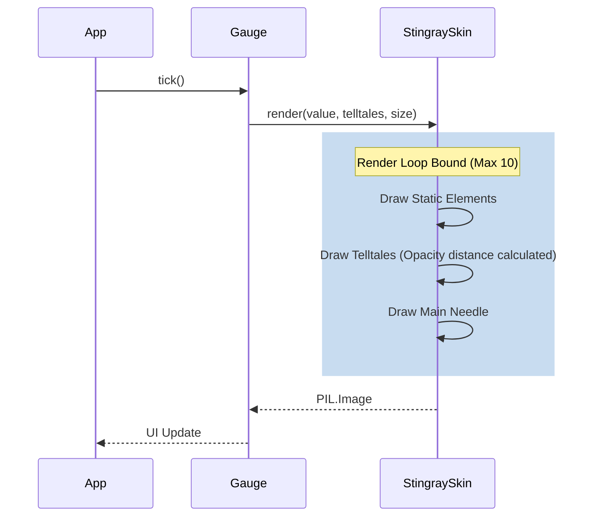

# Issue #1 - Feature: core gauge renderer — analog tachometer with arc, needle, and tick marks

## 1. Context & Goal
* **Issue:** #1
* **Objective:** Build the core analog tachometer renderer (v1 Stingray skin) as a pure function outputting a PIL.Image, incorporating peak-hold telltale needles and adhering to strict visual specifications.
* **Status:** Approved (claude-opus-4-6, 2026-08-10)
* **Related Issues:** #7, #41, #45

### Open Questions
*Questions that need clarification before or during implementation. Remove when resolved.*

- [ ] Are we drawing at 2x resolution and downsampling for anti-aliasing, or relying strictly on Pillow's native primitive anti-aliasing?

## 2. Proposed Changes

### 2.1 Files Changed

| File | Change Type | Description |
|------|-------------|-------------|
| `src/boostgauge/skins/stingray.py` | Add | Implements the Stingray skin render logic as a pure function. |
| `tests/visual/test_stingray.py` | Add | Visual regression, determinism, and rendering property tests. |

### 2.1.1 Path Validation (Mechanical - Auto-Checked)

*Issue #277: Before human or Gemini review, paths are verified programmatically.*

### 2.2 Dependencies

```toml

# No new dependencies. psutil and pillow are already in pyproject.toml.
```

### 2.3 Data Structures

```python
from typing import Protocol, List, Tuple, Optional
from PIL import Image

class TelltaleProtocol(Protocol):
    def current_peak(self) -> float | None:
        """Returns the current peak value for this telltale."""
        ...
```

### 2.4 Function Signatures

```python

# src/boostgauge/skins/stingray.py

def render(
    value: float,
    telltales: list[TelltaleProtocol],
    size: tuple[int, int] = (256, 256),
    config: dict | None = None
) -> Image.Image:
    """
    Renders the Stingray gauge face.
    Must be a pure function with no side effects and no tkinter imports.
    """
    ...
```

### 2.5 Logic Flow (Pseudocode)

```
1. Validate inputs: clamp `value` to 0-100.
2. Safety Bound: slice `telltales` to a maximum length of 10 to bound the render loop.
3. TRY rendering loop:
   a. Create new RGBA PIL Image at requested `size`.
   b. Draw static elements: square housing, round matte-black dial.
   c. Draw brick-red ring band occupying outer 80-100% of radius (spanning values 60-100).
   d. Draw white tick marks and Eurostile-adjacent numerals.
   e. Draw "BOOSTGAUGE" wordmark.
   f. For each telltale (up to 10 max):
      i.   Get peak_value = telltale.current_peak()
      ii.  If peak_value is None, skip.
      iii. Calculate angular distance from main `value`.
      iv.  Calculate single opacity value: 100% if <= 2 scale units, linear ramp from 2 to 3 units, baseline translucent if >= 3 units.
      v.   Draw telltale needle at peak_value angle with calculated opacity.
   g. Draw candy-apple-red main needle and counterweight at `value` angle.
   h. Return the generated Image.
4. CATCH Exception as e:
   a. Log exception at ERROR level (Observability).
   b. Return a safe, blank fallback Image to skip the frame and avoid crashing the app loop.
```

### 2.6 Technical Approach

* **Module:** `src/boostgauge/skins/stingray.py`
* **Pattern:** Pure Functional Core (Option C test strategy).
* **Key Decisions:** The renderer operates strictly on `PIL.Image` objects. It is completely decoupled from the UI framework (`tkinter`). Drawing utilizes Pillow's `ImageDraw`.
* **Global Protocol Enforcement:** PR and commit messages for this implementation must append exactly `Closes #1`. The naked `(#1)` format is banned.

### 2.7 Architecture Decisions

| Decision | Options Considered | Choice | Rationale |
|----------|-------------------|--------|-----------|
| UI Decoupling | `tkinter.Canvas` commands, `PIL.Image` (Option C) | `PIL.Image` (Option C) | Enforced by `0001-test-strategy.md` to allow headless visual regression testing without instantiating `tkinter.Tk()`. |
| Telltale Opacity | Per-pixel calculation, Uniform per-needle | Uniform per-needle | Mandated by ruling #245 to prevent visual artifacts where needle tips appear dimmer than the base during overlap. |
| Exception Handling | Raise to caller, Catch and log | Catch and log | Logging at ERROR level and skipping the frame prevents complete UI lockup on transient rendering calculation errors. |
| Cost Control | Unlimited telltales, Strict limit (e.g. 10) | Strict limit (max 10) | Strictly bounds the maximum cost of the rendering loop on each tick (Reviewer Tier 3 feedback). |

**Architectural Constraints:**
- Must adhere strictly to the visual spec in `0002-aesthetic-v1-stingray.md`.
- `tkinter` must never be imported in `stingray.py` or `gauge.py`.

## 3. Requirements

1. The renderer must be a pure function `render(value, telltales, size, config)` returning a `PIL.Image`, with no hidden state, side effects, or `tkinter` imports.
2. At value=0 with no telltales, the image must render the housing, dial, ticks, numerals, redline band, wordmark, and main needle at rest axis, verified against a visual-regression baseline generated via `--generate-baselines`.
3. Two identical calls must produce byte-identical output (deterministic rendering).
4. At value=100 with no telltales, every static element must render identically to the value=0 image; the two images may differ only where the main needle is drawn.
5. Telltale needles must be rendered at their peak values with a single uniform opacity per needle, starting at a translucent baseline and ramping to full opacity between 3 and 2 scale units of distance from the main needle.
6. Coincident telltales must be fully occluded by the main needle.
7. At value=75, the main needle tip (candy-apple red) must be visually distinct from the redline band (brick red) via pixel sampling.
8. Exceptions during the rendering loop must be caught and logged at the ERROR level to facilitate debugging, skipping the frame by returning a blank/fallback image without crashing the application.
9. The maximum length of the `telltales` list must be strictly bounded to 10 items to cap the rendering loop execution cost.

## 4. Alternatives Considered

| Option | Pros | Cons | Decision |
|--------|------|------|----------|
| Drawing directly on `tkinter.Canvas` | Avoids PIL intermediate | Impossible to test headlessly; violates Option C strategy. | **Rejected** |
| Per-pixel alpha gradient on telltales | Smoother fade visually | Fails near-overlap tests; tip becomes dimmer than base (Ruling #245). | **Rejected** |
| Unlimited telltale rendering | Supports any number of peaks | Unbounded CPU cost in the rendering hot loop. | **Rejected** |

**Rationale:** The selected decisions prioritize testability, strict compliance with the project's rulings (Option C, #245), and bounded resource usage.

## 5. Data & Fixtures

### 5.1 Data Sources

| Attribute | Value |
|-----------|-------|
| Source | Generated Visual Baselines |
| Format | `.png` image files |
| Size | 256x256 pixels |
| Refresh | Manual via `--generate-baselines` |
| Copyright/License | MIT |

### 5.2 Data Pipeline

```
render() ──PIL.Image──► pytest assertions ──diff──► baseline PNG
```

### 5.3 Test Fixtures

| Fixture | Source | Notes |
|---------|--------|-------|
| `baseline_value_0.png` | Generated via test suite | Checked into `tests/visual/baselines/` |

### 5.4 Deployment Pipeline
N/A - Rendered strictly at runtime. Baselines stay in the repository for CI.

## 6. Diagram

### 6.1 Mermaid Quality Gate

**Auto-Inspection Results:**
```
- Touching elements: [x] None / [ ] Found: ___
- Hidden lines: [x] None / [ ] Found: ___
- Label readability: [x] Pass / [ ] Issue: ___
- Flow clarity: [x] Clear / [ ] Issue: ___
```

### 6.2 Diagram



## 7. Security & Safety Considerations

### 7.1 Security

| Concern | Mitigation | Status |
|---------|------------|--------|
| Input Validation | All numerical inputs are clamped/bounded | Addressed |

### 7.2 Safety

| Concern | Mitigation | Status |
|---------|------------|--------|
| Render exception crashing app | Render exceptions are caught, logged at `ERROR` level, and a blank frame is safely returned. | Addressed |
| Rendering loop explosion | `telltales` list is hard-sliced to a maximum of 10 items. | Addressed |

**Fail Mode:** Fail Closed - If rendering fails, we display a blank gauge (or skip update) rather than crashing the primary system monitoring loop.

**Recovery Strategy:** Next tick will attempt to re-render. If failure is transient, it recovers automatically.

## 8. Performance & Cost Considerations

### 8.1 Performance

| Metric | Budget | Approach |
|--------|--------|----------|
| Latency | < 16ms | Single-pass Pillow drawing; bounded loop iterations. |
| CPU | < 1% | Rendering only happens exactly once per tick. |
| API Calls | 0 | Pure in-memory drawing. |

**Bottlenecks:** PIL Image generation on every tick can be costly. If we miss budget, a follow-up issue will separate the static background into a cached layer. For now, the bounded loops prevent worst-case scaling.

### 8.2 Cost Analysis

| Resource | Unit Cost | Estimated Usage | Monthly Cost |
|----------|-----------|-----------------|--------------|
| N/A | N/A | N/A | $0 |

**Cost Controls:**
- [x] No external APIs invoked.

**Worst-Case Scenario:** Gauge redraws too slowly; CPU spikes to ~3%.

## 9. Legal & Compliance

| Concern | Applies? | Mitigation |
|---------|----------|------------|
| PII/Personal Data | No | N/A |
| Third-Party Licenses | Yes | Pillow is used; MIT license compatible. |
| Terms of Service | No | N/A |
| Data Retention | No | N/A |
| Export Controls | No | N/A |

**Data Classification:** Public

**Compliance Checklist:**
- [x] All third-party licenses compatible with project license

## 10. Verification & Testing

**Testing Philosophy:** Strive for 100% automated test coverage. Option C GUI testing applies: `tkinter.Tk()` is NEVER instantiated.

### 10.0 Test Plan (TDD - Complete Before Implementation)

| Test ID | Test Description | Expected Behavior | Status |
|---------|------------------|-------------------|--------|
| T010 | verify_pure_function | PIL.Image returned, no tkinter module in sys.modules subset | RED |
| T020 | test_value_0_baseline | Output matches stored generated baseline image | RED |
| T030 | test_determinism | Two renders with identical inputs hash to identical bytes | RED |
| T040 | test_value_100_static | Static element diff between val=0 and val=100 is empty | RED |
| T050 | test_telltale_far | Needle rendered at standard translucent baseline | RED |
| T060 | test_telltale_mid_fade | Needle rendered at strictly 50% ramp opacity | RED |
| T070 | test_telltale_overlap | Needle rendered at exactly 100% opacity | RED |
| T080 | test_telltale_occluded | Telltale pixels undetectable (hidden by main needle) | RED |
| T090 | test_red_hue_distinctness | Candy-apple pixel RGB != Brick-red pixel RGB | RED |
| T100 | test_exception_logging | Malformed inputs yield ERROR log and blank image | RED |
| T110 | test_telltale_limits | 15 telltales provided, only 10 rendered | RED |

**Coverage Target:** ≥95% for all new code.

### 10.1 Test Scenarios

| ID | Scenario | Type | Input | Expected Output | Pass Criteria |
|----|----------|------|-------|-----------------|---------------|
| 010 | Pure function and signature (REQ-1) | Auto | Valid basic inputs | PIL.Image | No `tkinter` imported in renderer |
| 020 | Value=0 baseline match (REQ-2) | Auto | value=0, telltales=None | Matching PIL.Image | Byte-matches `--generate-baselines` file |
| 030 | Determinism across calls (REQ-3) | Auto | value=33 | Identical PIL.Image x2 | Outputs are byte-identical |
| 040 | Static elements at value=100 (REQ-4) | Auto | value=100, telltales=None | PIL.Image | Background diff vs value=0 is exactly 0 |
| 050 | Telltale far translucency (REQ-5) | Auto | value=70, peak=30 | PIL.Image | Telltale at baseline opacity |
| 060 | Telltale mid-fade opacity (REQ-5) | Auto | value=70, peak=72.5 | PIL.Image | Telltale opacity is linear midpoint |
| 070 | Telltale near-overlap opacity (REQ-5) | Auto | value=70, peak=72 | PIL.Image | Telltale at 100% full opacity |
| 080 | Telltale coincidence occlusion (REQ-6) | Auto | value=70, peak=70 | PIL.Image | Telltale pixels not visible (occluded) |
| 090 | Needle and redline color distinction (REQ-7) | Auto | value=75, telltales=None | PIL.Image | Tip pixels distinct hue from band |
| 100 | Render exception logging (REQ-8) | Auto | Invalid forced exception | Error log, safe return | ERROR level log emitted, frame skipped safely |
| 110 | Telltale list length bounding (REQ-9) | Auto | 15 telltale objects | Render with 10 telltales | Only first 10 drawn, no loop explosion |

### 10.2 Test Commands

```bash

# Run visual rendering tests (will fail initially without baselines)
poetry run pytest tests/visual/test_stingray.py -v

# Generate/Accept visual baselines explicitly
poetry run pytest tests/visual/test_stingray.py -v --generate-baselines
```

### 10.3 Manual Tests (Only If Unavoidable)

N/A - All scenarios automated.

## 11. Risks & Mitigations

| Risk | Impact | Likelihood | Mitigation |
|------|--------|------------|------------|
| Render failures crash the app | High | Low | Exceptions in `render()` are caught, logged at ERROR level, and bypassed safely. |
| High CPU on massive telltale spikes | Med | Low | The `telltales` array is clamped to a maximum of 10 prior to rendering. |
| Global Protocol `Closes #1` Violation | High | Med | Added to DoD; strictly required for PR merge. |

## 12. Definition of Done

### Code
- [ ] Implementation complete and linted
- [ ] Code comments reference this LLD
- [ ] **Commit messages and PR body contain exactly `Closes #1`**

### Tests
- [ ] All test scenarios pass
- [ ] Test coverage meets threshold (≥95%)
- [ ] Option C Test Strategy adhered to perfectly (`tkinter.Tk()` never instantiated)

### Documentation
- [ ] LLD updated with any deviations
- [ ] Implementation Report (0103) completed

### Review
- [ ] Code review completed
- [ ] User approval before closing issue

---

## Appendix: Review Log

### {Reviewer} Review #{N} ({VERDICT})

**Reviewer:** {Gemini / Orchestrator / Other}
**Verdict:** {APPROVED / REJECTED / FEEDBACK}

#### Comments

| ID | Comment | Implemented? |
|----|---------|--------------|
| R1.1 | "Ensure exceptions are logged (e.g., at ERROR level) to facilitate debugging." | YES - 2.5, 3 (REQ-8), 7.2, 10.1 |
| R1.2 | "Explicitly bound the maximum length of the telltales list (e.g., max 10) to strictly bound the rendering loop." | YES - 2.5, 3 (REQ-9), 7.2, 10.1 |
| R1.3 | "You must append exactly 'Closes #1' to the commit message, PR title, and PR body." | YES - 2.6, 12 |

### Review Summary

| Review | Date | Verdict | Key Issue |
|--------|------|---------|-----------|
| 1 | 2026-08-10 | APPROVED | `claude-opus-4-6` |
| {Reviewer} #{N} | (auto) | {verdict} | {one-line summary} |

**Final Status:** APPROVED