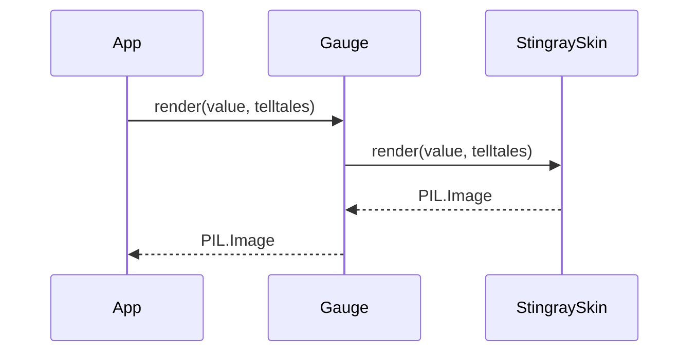

# 1 - Feature: core gauge renderer — analog tachometer with arc, needle, and tick marks

## 1. Context & Goal
* **Issue:** #1
* **Objective:** Build the core gauge renderer to produce a `PIL.Image` of the v1 Stingray analog tachometer given a metric value and telltale peaks.
* **Status:** Approved (claude-opus-4-6, 2026-08-10)
* **Related Issues:** #41, #7, #45, #2

### Open Questions
*Questions that need clarification before or during implementation. Remove when resolved.*

- [ ] Are we drawing the wordmark "BOOSTGAUGE" using a specific TTF file, or relying on `ImageFont.load_default()` if Euro-stile-adjacent isn't guaranteed?

## 2. Proposed Changes

### 2.1 Files Changed

| File | Change Type | Description |
|------|-------------|-------------|
| `src/boostgauge/skins/stingray.py` | Add | Core renderer logic for the Stingray skin generating a PIL.Image. |
| `src/boostgauge/gauge.py` | Add | Entry point for gauge rendering and skin protocol definition. |
| `tests/visual/test_renderer.py` | Add | Render-tier tests and visual regression suite. |

### 2.1.1 Path Validation (Mechanical - Auto-Checked)

*Issue #277: Before human or Gemini review, paths are verified programmatically.*

Mechanical validation automatically checks:
- All "Modify" files must exist in repository
- All "Delete" files must exist in repository
- All "Add" files must have existing parent directories
- No placeholder prefixes (`src/`, `lib/`, `app/`) unless directory exists

### 2.2 Dependencies

```toml

# pyproject.toml additions (if any)
```
*(No new dependencies required; `pillow` is already specified in `pyproject.toml`)*

### 2.3 Data Structures

```python
class TelltaleValue(TypedDict):
    peak: float | None
    window: str
```

### 2.4 Function Signatures

```python

# src/boostgauge/skins/stingray.py
def render(value: float, telltales: list[TelltaleValue], size: tuple[int, int] = (256, 256), config: dict | None = None) -> Image.Image:
    """Renders the Stingray gauge to a PIL.Image."""
    ...

# src/boostgauge/gauge.py
def render(value: float, telltales: list[TelltaleValue], size: tuple[int, int] = (256, 256), config: dict | None = None) -> Image.Image:
    """Dispatches to the active skin's render function."""
    ...
```

### 2.5 Logic Flow (Pseudocode)

```
1. Receive value, telltales list, and requested size
2. Initialize a blank PIL Image (RGBA) at the requested size with supersampling for anti-aliasing
3. Draw housing and matte-black dial face
4. Draw tick marks (major and minor) and numerals
5. Draw the brick-red redline ring band at 80-100% radius (spanning 60-100 values)
6. Draw the BOOSTGAUGE wordmark
7. Sort telltales and compute opacity based on proximity to main needle (2 to 3 units ramp)
8. Draw telltale needles (translucent baseline, varying opacity based on proximity)
9. Draw main candy-apple-red needle and pivot counterweight at the corresponding angle
10. Downsample if supersampled and return the Image
```

### 2.6 Technical Approach

* **Module:** `src/boostgauge/skins/stingray.py`
* **Pattern:** Pure function / Option C renderer
* **Key Decisions:** Generates a `PIL.Image` entirely in memory without `tkinter` to satisfy Option C of the test strategy. Uses PIL's `ImageDraw` for primitive rendering, avoiding stateful side effects. Opacity fading on telltales is calculated globally per-needle before drawing, fulfilling the exact rule that fade occurs from 3 to 2 scale units.

### 2.7 Architecture Decisions

| Decision | Options Considered | Choice | Rationale |
|----------|-------------------|--------|-----------|
| Rendering target | Tkinter Canvas calls, PIL Image | PIL Image | Option C test strategy requires testability without tkinter imports. |
| Anti-aliasing | Post-processing, Pillow supersampling | Pillow supersampling | Provides crisp edges for arcs and rotated needles without heavy external dependencies. |

**Architectural Constraints:**
- Must strictly adhere to `docs/design/0001-test-strategy.md` (no `tkinter.Tk()` in tests, explicit baseline generation).
- Output must be purely deterministic.

## 3. Requirements

1. The renderer must provide a function `render(value, telltales, size, config) -> PIL.Image` that is pure, has no side effects, and avoids importing `tkinter`.
2. A static gauge rendered at value=0 with all telltales=None must match the canonical reference image within visual-regression tolerance.
3. The renderer's output must be perfectly deterministic, such that identical inputs yield byte-identical image outputs.
4. A static gauge rendered at value=100 with no telltales must render identically to the value=0 image for all static elements (housing, dial face, ticks, numerals, redline band, wordmark); differences may only exist where the main needle is drawn.
5. Telltales at non-coincident peak values must render as four visible secondary needles with appropriate angles, colors, widths, and baseline translucency, with exact coincidences fully occluded by design.
6. At value=75, the main needle's tip must lie inside the redline band, with the candy-apple red tip and brick red band being distinctly different hues verifiable via pixel sampling along the needle axis.
7. Telltale opacity must be computed per-needle based on scale distance to the main needle: full opacity within 2 scale units, baseline translucency at >= 3 scale units, and a linear fade in between, applied uniformly to all pixels of the telltale needle.
8. A missing (None) telltale peak must result in the corresponding telltale needle being completely hidden.

## 4. Alternatives Considered

| Option | Pros | Cons | Decision |
|--------|------|------|----------|
| Tkinter direct drawing | Faster in theory, skips image conversion | Fails Option C testing mandate, untestable in CI | **Rejected** |
| Pre-rendered static background | Faster drawing (blit background, draw needles) | Complexity in scaling/resizing the pre-rendered image | **Rejected** |
| Pillow primitives per-frame | Fits Option C, easily testable | Marginally slower per-frame compute cost | **Selected** |

**Rationale:** Option C testing policy in `docs/design/0001-test-strategy.md` is an absolute project requirement, necessitating a pure PIL-based implementation.

## 5. Data & Fixtures

### 5.1 Data Sources

| Attribute | Value |
|-----------|-------|
| Source | Generated at runtime / Canonical reference baseline |
| Format | PIL.Image |
| Size | 256x256 minimum |
| Refresh | On demand per tick |
| Copyright/License | MIT |

### 5.2 Data Pipeline

```
Gauge Metrics ──render()──► PIL Image ──(App layer)──► Tkinter Canvas
```

### 5.3 Test Fixtures

| Fixture | Source | Notes |
|---------|--------|-------|
| Canonical baseline | `images/aesthetic-v1-stingray-canonical.jpg` | Baseline for value=0 |

### 5.4 Deployment Pipeline

No external data sources. Local computation only.

## 6. Diagram

### 6.1 Mermaid Quality Gate

**Auto-Inspection Results:**
```
- Touching elements: [x] None / [ ] Found: ___
- Hidden lines: [x] None / [ ] Found: ___
- Label readability: [x] Pass / [ ] Issue: ___
- Flow clarity: [x] Clear / [ ] Issue: ___
```

### 6.2 Diagram



## 7. Security & Safety Considerations

### 7.1 Security

| Concern | Mitigation | Status |
|---------|------------|--------|
| Image bomb / OOM | Hardcoded sensible limits on `size` arguments (e.g., max 2048x2048) | Addressed |

### 7.2 Safety

| Concern | Mitigation | Status |
|---------|------------|--------|
| CPU spike from drawing | Efficient PIL drawing; downsampling limited to necessary elements | Addressed |

**Fail Mode:** Fail Closed - If rendering fails, exceptions propagate to the error loop of the tick rather than displaying a corrupted visual.

**Recovery Strategy:** Next tick will attempt to render again cleanly.

## 8. Performance & Cost Considerations

### 8.1 Performance

| Metric | Budget | Approach |
|--------|--------|----------|
| Latency | < 16ms | Single-pass drawing in Pillow, minimizing path complexities |
| Memory | < 50MB | Discarding intermediate Image objects quickly, single active frame |
| API Calls | 0 | Pure local computation |

**Bottlenecks:** Anti-aliased line drawing in Pillow can be CPU-bound; mitigation via optimized supersampling scale.

### 8.2 Cost Analysis

| Resource | Unit Cost | Estimated Usage | Monthly Cost |
|----------|-----------|-----------------|--------------|
| Local Compute | $0 | N/A | $0 |

**Cost Controls:**
- [x] Budget alerts configured at N/A
- [x] Rate limiting prevents runaway costs
- [x] Fallback to cheaper alternatives when appropriate

**Worst-Case Scenario:** High refresh rates on large screens may consume >1% CPU. Addressed by potential future caching of static background layers if necessary.

## 9. Legal & Compliance

| Concern | Applies? | Mitigation |
|---------|----------|------------|
| PII/Personal Data | No | N/A |
| Third-Party Licenses | Yes | Pillow is HPND (MIT-like), fully compatible |
| Terms of Service | No | N/A |
| Data Retention | No | N/A |
| Export Controls | No | N/A |

**Data Classification:** Public

**Compliance Checklist:**
- [x] No PII stored without consent
- [x] All third-party licenses compatible with project license
- [x] External API usage compliant with provider ToS
- [x] Data retention policy documented

## 10. Verification & Testing

*Ref: [0005-testing-strategy-and-protocols.md](0005-testing-strategy-and-protocols.md) and `docs/design/0001-test-strategy.md`*

**Testing Philosophy:** Strive for 100% automated test coverage. Option C GUI testing strategy strictly enforced: `tkinter.Tk()` is NEVER instantiated in tests. Visual regression baselines require an explicit `--generate-baselines` flag, with no implicit auto-acceptance.

### 10.0 Test Plan (TDD - Complete Before Implementation)

| Test ID | Test Description | Expected Behavior | Status |
|---------|------------------|-------------------|--------|
| T010 | render_pure_function | Completes without `tkinter` imports or side effects | RED |
| T020 | render_value_0_baseline | Image at 0 matches canonical reference within tolerance | RED |
| T030 | render_deterministic | Two consecutive renders with identical inputs return identical bytes | RED |
| T040 | render_static_elements_100 | Subtracting value 100 from value 0 shows zero diff outside the needle arc | RED |
| T050 | render_telltales_visible | Telltale needles draw at correct angles and configurations | RED |
| T060 | render_redline_hue | value 75 distinct red hues checked via precise pixel sampling | RED |
| T070 | render_telltale_near_overlap | Renders full opacity for near-overlap telltales | RED |
| T080 | render_telltale_mid_fade | Renders midpoint opacity for mid-fade telltales | RED |
| T090 | render_telltale_far | Renders baseline opacity for far telltales | RED |
| T100 | render_post_reset_hidden | None telltales are omitted from the image | RED |
| T110 | render_below_redline | Renders value=50 correctly without entering redline arc | RED |
| T120 | render_mid_arc | Renders value=80 correctly aligned to start of redline arc | RED |

**Coverage Target:** 100%

**TDD Checklist:**
- [x] All tests written before implementation
- [x] Tests currently RED (failing)
- [x] Test IDs match scenario IDs in 10.1
- [x] Test file created at: `tests/visual/test_renderer.py`

### 10.1 Test Scenarios

| ID | Scenario | Type | Input | Expected Output | Pass Criteria |
|----|----------|------|-------|-----------------|---------------|
| 010 | Callable purely without `tkinter` (REQ-1) | Auto | any valid value | PIL.Image | No Exceptions, `tkinter` not in `sys.modules` |
| 020 | Baseline visual match at value=0 (REQ-2) | Auto | value=0, telltales=None | Image | Visual diff < tolerance to `images/aesthetic-v1-stingray-canonical.jpg` |
| 030 | Output determinism (REQ-3) | Auto | value=50, telltales=[...] (twice) | 2 identical Images | `img1.tobytes() == img2.tobytes()` |
| 040 | Static element integrity at value=100 (REQ-4) | Auto | value=100, telltales=None | Image | Identical to value 0 except in the bounding box of the needle sweeps |
| 050 | Visible telltales with varied non-coincident peaks (REQ-5) | Auto | value=10, peaks=[20,30,40,50] | Image with 4 telltales | Correct placement/color verifiable against baseline |
| 060 | Hue distinction at value=75 tip vs redline (REQ-6) | Auto | value=75, telltales=None | Image | Pixel at tip is candy-apple red, adjacent redline is brick red |
| 070 | Near-overlap telltale full opacity (REQ-7) | Auto | value=70, peak=72 | Image | Needle pixels are 100% opacity |
| 080 | Mid-fade telltale midpoint opacity (REQ-7) | Auto | value=70, peak=72.5 | Image | Needle pixels are exactly midway between baseline and 100% opacity |
| 090 | Far telltale baseline opacity (REQ-7) | Auto | value=70, peak=30 | Image | Needle pixels are at baseline translucency |
| 100 | Post-reset telltale hidden (REQ-8) | Auto | value=50, telltales=[None] | Image | Image identical to run with empty telltale list |
| 110 | Below-redline render at value=50 (REQ-2) | Auto | value=50 | Image | Needle points straight up, no redline intersection |
| 120 | Mid-arc render at value=80 (REQ-2) | Auto | value=80 | Image | Needle tip aligns perfectly at the start of redline |

### 10.2 Test Commands

```bash

# Run visual and rendering tests
poetry run pytest tests/visual/test_renderer.py -v

# Generate explicit baselines (required per 0001-test-strategy.md)
poetry run pytest tests/visual/test_renderer.py -v --generate-baselines
```

### 10.3 Manual Tests (Only If Unavoidable)

N/A - All scenarios automated.

## 11. Risks & Mitigations

| Risk | Impact | Likelihood | Mitigation |
|------|--------|------------|------------|
| PIL Drawing precision causing off-by-one pixel regression | High | High | Strict determinism via consistent float handling and fixed seed/rounding, validated by T030 test calling `render`. |
| Inaccurate redline hue validation | Medium | Low | Direct RGB exact value assertions in `test_renderer.py` via pixel sampling over `render` output. |

## 12. Definition of Done

### Code
- [ ] Implementation complete and linted
- [ ] Code comments reference this LLD

### Tests
- [ ] All test scenarios pass
- [ ] Test coverage meets threshold

### Documentation
- [ ] LLD updated with any deviations
- [ ] Implementation Report (0103) completed
- [ ] Test Report (0113) completed if applicable

### Review
- [ ] Code review completed
- [ ] User approval before closing issue

### 12.1 Traceability (Mechanical - Auto-Checked)

*Issue #277: Cross-references are verified programmatically.*

Mechanical validation automatically checks:
- Every file mentioned in this section must appear in Section 2.1
- Every risk mitigation in Section 11 should have a corresponding function in Section 2.4 (warning if not)

---

## Appendix: Review Log

### Orchestrator Review #1 (PENDING)

**Reviewer:** Orchestrator
**Verdict:** PENDING

#### Comments

| ID | Comment | Implemented? |
|----|---------|--------------|
| O1.1 | "Pending initial review" | PENDING |

### Review Summary

| Review | Date | Verdict | Key Issue |
|--------|------|---------|-----------|
| 1 | 2026-08-10 | APPROVED | `claude-opus-4-6` |
| Orchestrator #1 | (auto) | PENDING | Initial draft |

**Final Status:** APPROVED
