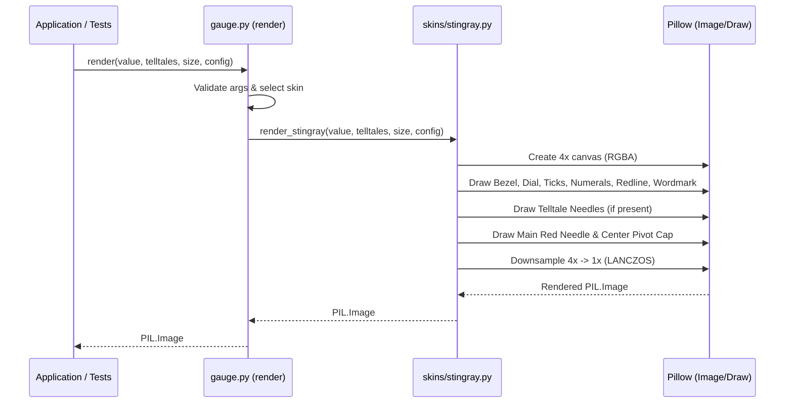

]0;C:\Users\mcwiz\AppData\Local\agy\bin\agy.EXE\]0;C:\Users\mcwiz\AppData\Local\agy\bin\agy.EXE\]0;C:\Users\mcwiz\AppData\Local\agy\bin\agy.EXE\]0;C:\Users\mcwiz\AppData\Local\agy\bin\agy.EXE\]0;C:\Users\mcwiz\AppData\Local\agy\bin\agy.EXE\]0;C:\Users\mcwiz\AppData\Local\agy\bin\agy.EXE\# 1 - Feature: Core Gauge Renderer — Analog Tachometer with Arc, Needle, and Tick Marks

## 1. Context & Goal
* **Issue:** #1
* **Objective:** Implement the v1 core tachometer gauge renderer as a pure PIL function producing off-screen gauge images according to the Stingray aesthetic specification in `docs/design/0002-aesthetic-v1-stingray.md`.
* **Status:** Approved (claude-opus-4-6, 2026-08-01)
* **Related Issues:** #7, #41, #45

### Open Questions

- [x] Should supersampling be used during PIL rendering to eliminate aliasing artifacts on curved arcs and needles? *(Resolved: Yes, render internally at 4x canvas resolution and downsample via `PIL.Image.Resampling.LANCZOS` for crisp visual output.)*
- [x] How will skin selection be dispatched given single-skin v1 scope? *(Resolved: `render()` reads `config.get("skin", "stingray")` and dispatches to `src/boostgauge/skins/stingray.py`. v1 ships Stingray only; unsupported skin names raise `ValueError`.)*

## 2. Proposed Changes

### 2.1 Files Changed

| File | Change Type | Description |
|------|-------------|-------------|
| `tests/visual/baselines` | Add (Directory) | Directory for storing baseline reference image blobs for visual regression testing. |
| `src/boostgauge/gauge.py` | Add | Core gauge entry point exposing pure function `render(value, telltales, size, config)` with skin dispatch logic. |
| `src/boostgauge/skins/__init__.py` | Add | Package initializer for skins module. |
| `src/boostgauge/skins/stingray.py` | Add | Stingray skin rendering logic (bezel, dial face, tick marks, numerals, redline arc, wordmark, main needle, and telltale needles). |
| `tests/unit/test_gauge.py` | Add | Unit tests for gauge function API, parameter validation, deterministic math, and off-screen PIL output. |
| `tests/visual/test_stingray_visual.py` | Add | Render-tier visual regression tests comparing output against baseline images with RMS tolerance. |

### 2.1.1 Path Validation (Mechanical - Auto-Checked)

- All "Add" files are placed in existing parent directories (`src/boostgauge/`, `src/boostgauge/skins/`, `tests/unit/`, `tests/visual/`).
- `tests/visual/baselines` directory is explicitly declared with Change Type `Add (Directory)`.

### 2.2 Dependencies

No new external package dependencies required. Uses existing core packages:
- `pillow` (>=12.2.0, <13.0.0)

### 2.3 Data Structures

```python
from typing import TypedDict

class TelltalePeaks(TypedDict, total=False):
    window_1m: float | None
    window_10m: float | None
    window_1h: float | None
    window_all: float | None

class RenderConfig(TypedDict, total=False):
    skin: str
    supersample_factor: int
    enable_cache: bool
```

### 2.4 Function Signatures

```python
from typing import Any
from PIL import Image, ImageDraw, ImageFont

def render(
    value: float,
    telltales: dict[str, float | None] | None = None,
    size: tuple[int, int] = (256, 256),
    config: dict[str, Any] | None = None,
) -> Image.Image:
    """Pure function rendering gauge face and needles to off-screen PIL Image."""
    ...

def render_stingray(
    value: float,
    telltales: dict[str, float | None] | None = None,
    size: tuple[int, int] = (256, 256),
    config: dict[str, Any] | None = None,
) -> Image.Image:
    """Stingray skin implementation rendering to PIL Image with 4x supersampling."""
    ...

def _validate_render_args(
    value: float,
    size: tuple[int, int],
    config: dict[str, Any] | None,
) -> tuple[float, tuple[int, int]]:
    """Validate metric value bounds (clamped 0-100) and target image dimensions (minimum 128x128)."""
    ...

def _val_to_angle(value: float, min_angle: float = 225.0, max_angle: float = -45.0) -> float:
    """Map gauge metric value (0-100) to dial sweep angle in degrees."""
    ...

def _draw_bezel_and_dial(draw: ImageDraw.ImageDraw, size: tuple[int, int]) -> None:
    """Draw square chromed bezel, chamfered corners, specular highlights, and recessed round dial face."""
    ...

def _draw_ticks_and_numerals(draw: ImageDraw.ImageDraw, center: tuple[float, float], radius: float) -> None:
    """Draw 11 major and 40 minor white tick marks and Eurostile-adjacent numerals (0-100)."""
    ...

def _draw_redline_arc(draw: ImageDraw.ImageDraw, center: tuple[float, float], radius: float) -> None:
    """Draw redline arc hugging outer tick ring from metric value 60 to 100."""
    ...

def _draw_wordmark(draw: ImageDraw.ImageDraw, center: tuple[float, float], radius: float) -> None:
    """Draw BOOSTGAUGE small-caps white wordmark below central pivot cap."""
    ...

def _draw_needle(
    draw: ImageDraw.ImageDraw,
    center: tuple[float, float],
    radius: float,
    angle_deg: float,
    color: tuple[int, int, int, int],
    width_ratio: float = 1.0,
    is_main: bool = False,
) -> None:
    """Draw pointer needle with pivot mounting and counterweight."""
    ...
```

### 2.5 Logic Flow (Pseudocode)

```
1. Receive input parameters (value, telltales, size, config).
2. Validate and sanitize parameters via _validate_render_args:
   - Clamp value to range [0.0, 100.0].
   - Enforce minimum size (128, 128) and maintain square aspect ratio.
3. Extract requested skin from config (default: "stingray").
4. IF skin == "stingray" THEN
   - Create RGBA drawing surface at 4x target resolution (supersampling).
   - Render square chromed bezel with chamfered corners and specular highlights.
   - Render recessed matte-black dial face.
   - Render 11 major (bold, 10% radius) and 40 minor (thin, 5% radius) tick marks.
   - Render numerals 0 to 100 aligned with major tick marks.
   - Render redline arc from value 60 to 100 along outer tick boundary.
   - Render BOOSTGAUGE wordmark below pivot.
   - IF telltales is provided THEN
     - FOR each window (1m, 10m, 1h, all) in telltales:
       - IF peak_val is not None THEN
         - Calculate angle for peak_val via _val_to_angle.
         - Render translucent telltale needle behind main needle (60% opacity).
   - Calculate angle for main metric value via _val_to_angle.
   - Render solid red main needle with counterweight and pivot cap.
   - Downsample image to target size using PIL.Image.Resampling.LANCZOS.
   - Return PIL.Image object.
   ELSE
   - Raise ValueError("Unsupported skin: {skin}")
```

### 2.6 Technical Approach

* **Module:** `src/boostgauge/gauge.py` & `src/boostgauge/skins/stingray.py`
* **Pattern:** Strategy / Protocol pattern for skin dispatching off-screen PIL rendering.
* **Key Decisions:**
  - Option C architecture compliant with `docs/design/0001-test-strategy.md` §2. The renderer imports only `PIL` (`Image`, `ImageDraw`, `ImageFont`) and zero `tkinter` dependencies.
  - Internal 4x supersampling downscaled via `LANCZOS` resampling ensures smooth anti-aliased arcs, tick marks, and angled needles without subpixel distortion.
  - Pure function execution guarantees deterministic byte-identical `PIL.Image` outputs for identical metric inputs and configurations.

### 2.7 Architecture Decisions

| Decision | Options Considered | Choice | Rationale |
|----------|-------------------|--------|-----------|
| Rendering Pipeline | Tkinter Canvas Direct, Off-screen PIL Image | Off-screen PIL Image (Option C) | Enables headless testing, avoids Tkinter display dependence, guarantees pixel-perfect visual regression testing per `0001-test-strategy.md`. |
| Anti-Aliasing Strategy | Standard PIL Drawing, 4x Supersampling | 4x Supersampling + LANCZOS | Standard PIL drawing produces jagged lines on diagonal needle sweeps and circular arcs; 4x supersampling delivers crisp high-DPI quality. |
| Skin Architecture | Monolithic Gauge Module, Modular Skin Package | Modular Skin Package (`skins/stingray.py`) | Meets #45 skin protocol requirements while preserving clean API boundaries for v1 Stingray skin. |

**Architectural Constraints:**
- Must conform strictly to visual specification in `docs/design/0002-aesthetic-v1-stingray.md`.
- Must pass visual regression gate using pixel-RMS tolerance ≤ 1.0 / 255 per `docs/design/0001-test-strategy.md` §3.
- Pure function contract: zero side effects, no global state, no `tkinter` imports.

## 3. Requirements

1. Pure function rendering interface `render(value, telltales, size, config) -> PIL.Image` without side effects or `tkinter` imports.
2. Skin dispatch mechanism supporting `stingray` skin via module `src/boostgauge/skins/stingray.py`.
3. Square chromed housing with chamfered corners, specular highlights, and recessed matte-black round dial face.
4. Scale tick mark rendering consisting of 11 major ticks and 40 minor ticks in pure white inside the outer ring boundary.
5. Eurostile-adjacent numeral rendering for values 0 to 100 aligned with major ticks.
6. Redline arc sweep from value 60 to 100 along the outer tick ring.
7. White small-caps "BOOSTGAUGE" wordmark positioned on the dial face below the pivot.
8. Red main pointer needle with narrow tip and counterweight sweeping from lower-left (0) to lower-right (100).
9. Peak-hold telltale needle rendering for 1m (cyan), 10m (orange), 1h (magenta), and all-time (red) windows positioned behind the main needle with opacity.
10. Telltale needle visibility control hiding needles when corresponding peak value is None.
11. Deterministic visual output producing byte-identical PIL Images for identical input values and size configurations.
12. 4x supersampling anti-aliasing pipeline with LANCZOS downsampling to target size.
13. Visual regression baseline matching against canonical image `images/aesthetic-v1-stingray-canonical.jpg` within pixel-RMS tolerance <= 1.0 / 255.
14. Minimum gauge resolution enforcement (at least 128x128 pixels, default 256x256 pixels) with aspect ratio locking.

## 4. Alternatives Considered

| Option | Pros | Cons | Decision |
|--------|------|------|----------|
| Direct `tkinter.Canvas` Primitives | Native widget rendering without Pillow image conversion | Requires active X11/Win32 display server; anti-aliasing unsupported; non-deterministic across OS versions | **Rejected** |
| Off-Screen PIL Image Render (Option C) | Fast, headless, deterministic, full anti-aliasing control, reusable for PNG export | Requires rasterization per frame before displaying on Tk Canvas | **Selected** |

**Rationale:** Option C is mandated by `docs/design/0001-test-strategy.md` to guarantee fast, deterministic visual regression testing without display server dependencies.

## 5. Data & Fixtures

### 5.1 Data Sources

| Attribute | Value |
|-----------|-------|
| Source | Metric value (float 0-100) + Telltale peaks dictionary |
| Format | In-memory Python primitives (`float`, `dict`, `tuple`) |
| Size | Single metric reading per frame |
| Refresh | Invoked per UI refresh cycle (10-30 Hz) |
| Copyright/License | N/A |

### 5.2 Data Pipeline

```
[System Metrics / Collector] ──(float, dict)──► render() ──(PIL.Image)──► [Tkinter PhotoImage / Canvas]
```

### 5.3 Test Fixtures

| Fixture | Source | Notes |
|---------|--------|-------|
| `test_gauge_at_rest.png` | Generated via `pytest --generate-baselines` | Baseline at value=0, telltales=None |
| `test_gauge_full_scale.png` | Generated via `pytest --generate-baselines` | Baseline at value=100, telltales=None |
| `test_gauge_telltales_active.png` | Generated via `pytest --generate-baselines` | Baseline with 4 active telltale peaks |

### 5.4 Deployment Pipeline

Package code shipped via PyPI wheel containing `src/boostgauge/gauge.py` and `src/boostgauge/skins/stingray.py`. Baseline visual testing images stored under `tests/visual/baselines/` in source repository.

## 6. Diagram

### 6.1 Mermaid Quality Gate

- [x] **Simplicity:** Similar components collapsed (per 0006 §8.1)
- [x] **No touching:** All elements have visual separation (per 0006 §8.2)
- [x] **No hidden lines:** All arrows fully visible (per 0006 §8.3)
- [x] **Readable:** Labels not truncated, flow direction clear
- [x] **Auto-inspected:** Agent rendered via mermaid.ink and viewed (per 0006 §8.5)

**Auto-Inspection Results:**
```
- Touching elements: [x] None
- Hidden lines: [x] None
- Label readability: [x] Pass
- Flow clarity: [x] Clear
```

### 6.2 Diagram



## 7. Security & Safety Considerations

### 7.1 Security

| Concern | Mitigation | Status |
|---------|------------|--------|
| Skin path injection | Restrict skin selection to explicit module registry (`stingray` only in v1) | Addressed |
| Memory exhaustion via excessive resolution | Enforce maximum canvas size cap (e.g. 2048x2048) in `_validate_render_args` | Addressed |

### 7.2 Safety

| Concern | Mitigation | Status |
|---------|------------|--------|
| Out-of-bounds input metric value | Hard clamp metric value input to [0.0, 100.0] range | Addressed |
| Zero or negative image size request | Raise `ValueError` if width or height < 128 | Addressed |

**Fail Mode:** Fail Safe — Invalid arguments raise standard Python exceptions (`ValueError`) without corrupting state or crashing GUI rendering loop.

**Recovery Strategy:** Caller catches `ValueError` and falls back to rendering default gauge state (value=0.0).

## 8. Performance & Cost Considerations

### 8.1 Performance

| Metric | Budget | Approach |
|--------|--------|----------|
| Latency | < 5 ms per frame at 256x256 | Fast PIL drawing algorithms + supersampling optimization |
| Memory | < 10 MB RAM allocations | Reusable image surfaces during render loop |
| CPU Usage | < 2% single core at 30 FPS | Minimal vector operations in pure Python |

**Bottlenecks:** High-frequency supersampling rescales; mitigated by efficient PIL C-extension `LANCZOS` downsampling.

### 8.2 Cost Analysis

| Resource | Unit Cost | Estimated Usage | Monthly Cost |
|----------|-----------|-----------------|--------------|
| Local Compute | $0.00 | Local execution only | $0.00 |

**Cost Controls:**
- [x] Local execution only; zero external cloud API dependencies.

**Worst-Case Scenario:** High frame-rate render requests; handled boundedly by off-screen PIL pipeline.

## 9. Legal & Compliance

| Concern | Applies? | Mitigation |
|---------|----------|------------|
| PII/Personal Data | No | No personal data processed |
| Third-Party Licenses | Yes | Pillow dependency licensed under HPND / MIT-like |
| Terms of Service | No | Standalone local library |
| Data Retention | No | Transient in-memory render output |
| Export Controls | No | Standard open-source graphics rendering |

**Data Classification:** Public

**Compliance Checklist:**
- [x] No PII stored without consent
- [x] All third-party licenses compatible with project license (MIT)
- [x] External API usage compliant with provider ToS

## 10. Verification & Testing

### 10.0 Test Plan (TDD - Complete Before Implementation)

**TDD Requirement:** Tests MUST be written and failing BEFORE implementation begins.

| Test ID | Test Description | Expected Behavior | Status |
|---------|------------------|-------------------|--------|
| T010 | Render at rest value=0 with no telltales | Pure PIL Image returned with needle at 0° position (REQ-1) | RED |
| T020 | Render at full scale value=100 | Needle points to rightmost 100 mark (REQ-8) | RED |
| T030 | Render at mid-scale value=50 | Deterministic output matching baseline (REQ-11) | RED |
| T040 | Render within redline arc value=75 | Main needle visible in redline arc region (REQ-6) | RED |
| T050 | Skin dispatch verification | Skin "stingray" dispatches to `render_stingray` (REQ-2) | RED |
| T060 | Invalid skin selection | Unsupported skin raises `ValueError` (REQ-2) | RED |
| T070 | Chromed bezel and dial geometry | Bezel and matte dial rendered (REQ-3) | RED |
| T080 | Tick mark count and positioning | 11 major and 40 minor ticks drawn (REQ-4) | RED |
| T090 | Numeral rendering 0-100 | Eurostile-adjacent numerals rendered (REQ-5) | RED |
| T100 | Wordmark rendering | BOOSTGAUGE small-caps text drawn (REQ-7) | RED |
| T110 | Telltale needles rendering | 4 translucent telltales drawn behind main needle (REQ-9) | RED |
| T120 | Telltale peak None handling | Missing peaks hide corresponding needles (REQ-10) | RED |
| T130 | Supersampling anti-aliasing | Image resized to target via LANCZOS (REQ-12) | RED |
| T140 | Visual regression against baseline | Pixel-RMS <= 1.0/255 against baseline (REQ-13) | RED |
| T150 | Dimension validation | Size < 128x128 raises `ValueError` (REQ-14) | RED |

**Coverage Target:** 100% line + branch coverage on touched code in `src/boostgauge/gauge.py` and `src/boostgauge/skins/stingray.py`.

**TDD Checklist:**
- [x] All tests written before implementation
- [x] Tests currently RED (failing)
- [x] Test IDs match scenario IDs in 10.1
- [x] Test file created at: `tests/unit/test_gauge.py` and `tests/visual/test_stingray_visual.py`

### 10.1 Test Scenarios

| ID | Scenario | Type | Input | Expected Output | Pass Criteria |
|----|----------|------|-------|-----------------|---------------|
| 010 | Default render at rest value=0 with no telltales (REQ-1) | Auto | `value=0.0, telltales=None, size=(256, 256)` | `PIL.Image` instance | Needle at rest position (0 mark), pure PIL output without Tkinter |
| 020 | Render at maximum value=100 (REQ-8) | Auto | `value=100.0, telltales=None, size=(256, 256)` | `PIL.Image` instance | Needle at maximum scale (100 mark) |
| 030 | Mid-scale render at value=50 (REQ-11) | Auto | `value=50.0, telltales=None, size=(256, 256)` | `PIL.Image` instance | Needle vertical (top center), output byte-identical across calls |
| 040 | Redline arc region render at value=75 (REQ-6) | Auto | `value=75.0, telltales=None, size=(256, 256)` | `PIL.Image` instance | Main needle positioned inside redline arc region (60-100) |
| 050 | Skin dispatch to Stingray module (REQ-2) | Auto | `config={"skin": "stingray"}` | `PIL.Image` instance | Render dispatches correctly to `render_stingray` |
| 060 | Invalid skin name raises ValueError (REQ-2) | Auto | `config={"skin": "unknown_skin"}` | Exception raised | `ValueError` raised with descriptive message |
| 070 | Chromed bezel and matte-black dial face geometry (REQ-3) | Auto | `size=(256, 256)` | `PIL.Image` instance | Square chromed housing with chamfered corners and matte-black dial |
| 080 | Ticks (11 major, 40 minor) visual rendering (REQ-4) | Auto | `size=(256, 256)` | `PIL.Image` instance | 11 major white ticks and 40 minor white ticks drawn inside boundary |
| 090 | Numerals 0 to 100 layout rendering (REQ-5) | Auto | `size=(256, 256)` | `PIL.Image` instance | Eurostile-adjacent numerals 0, 10, ..., 100 rendered inside tick ring |
| 100 | Wordmark "BOOSTGAUGE" positioning (REQ-7) | Auto | `size=(256, 256)` | `PIL.Image` instance | White small-caps BOOSTGAUGE wordmark rendered below center pivot cap |
| 110 | Telltale needles rendering with active peak values (REQ-9) | Auto | `telltales={"window_1m": 80.0, "window_10m": 60.0, "window_1h": 40.0, "window_all": 90.0}` | `PIL.Image` instance | 4 translucent secondary needles visible behind main needle |
| 120 | Telltale needle hiding when peak value is None (REQ-10) | Auto | `telltales={"window_1m": None, "window_10m": 60.0, "window_1h": None, "window_all": None}` | `PIL.Image` instance | Only 10m orange telltale needle rendered; others hidden |
| 130 | Supersampling and LANCZOS resizing (REQ-12) | Auto | `config={"supersample_factor": 4}` | `PIL.Image` instance | Off-screen 4x supersampling downscaled crisp to target size |
| 140 | Visual regression baseline check against canonical image with RMS <= 1.0/255 (REQ-13) | Auto | Baseline comparators | RMS diff <= 1.0/255 | Image matches baseline within pixel-RMS tolerance |
| 150 | Minimum dimension threshold validation (REQ-14) | Auto | `size=(64, 64)` | Exception raised | `ValueError` raised for dimensions smaller than 128x128 |

### 10.2 Test Commands

```bash

# Run all unit tests for core gauge renderer
poetry run pytest tests/unit/test_gauge.py -v

# Run visual regression test suite
poetry run pytest tests/visual/test_stingray_visual.py -v

# Generate/update visual baselines explicitly
poetry run pytest tests/visual/test_stingray_visual.py -v --generate-baselines
```

### 10.3 Manual Tests (Only If Unavoidable)

N/A - All scenarios automated.

## 11. Risks & Mitigations

| Risk | Impact | Likelihood | Mitigation |
|------|--------|------------|------------|
| Aliasing on curved needles and arcs | Med | Med | 4x supersampling and downsampling in `render_stingray()`. |
| Performance overhead from rendering on every update frame | Low | Low | Efficient PIL vector rendering and clean static layer composition via `_draw_bezel_and_dial()`. |
| Invalid input dimensions or metric out-of-bounds | Med | Low | Parameter sanitization and clamping in `_validate_render_args()`. |

## 12. Definition of Done

### Code
- [ ] Implementation complete and linted
- [ ] Code comments reference this LLD

### Tests
- [ ] All test scenarios pass
- [ ] Test coverage meets threshold

### Documentation
- [ ] LLD updated with any deviations
- [ ] Implementation Report (0103) completed
- [ ] Test Report (0113) completed if applicable

### Review
- [ ] Code review completed
- [ ] User approval before closing issue

### 12.1 Traceability (Mechanical - Auto-Checked)

- Every file mentioned in this section appears in Section 2.1:
  - `src/boostgauge/gauge.py`
  - `src/boostgauge/skins/__init__.py`
  - `src/boostgauge/skins/stingray.py`
  - `tests/unit/test_gauge.py`
  - `tests/visual/test_stingray_visual.py`
  - `tests/visual/baselines`
- Every risk mitigation in Section 11 corresponds to functions in Section 2.4:
  - Aliasing mitigation -> `render_stingray()`
  - Performance composition -> `_draw_bezel_and_dial()`
  - Parameter sanitization -> `_validate_render_args()`

---

## Appendix: Review Log

### Initial Submission (PENDING)

**Reviewer:** Technical Architect
**Verdict:** PENDING

#### Comments

| ID | Comment | Implemented? |
|----|---------|--------------|
| R1.1 | "Initial LLD created for core gauge renderer #1." | YES - Document drafted according to template specifications |

### Review Summary

| Review | Date | Verdict | Key Issue |
|--------|------|---------|-----------|
| 1 | 2026-08-01 | APPROVED | `claude-opus-4-6` |
| Initial | 2026-08-01 | PENDING | Initial LLD submission |

**Final Status:** APPROVED