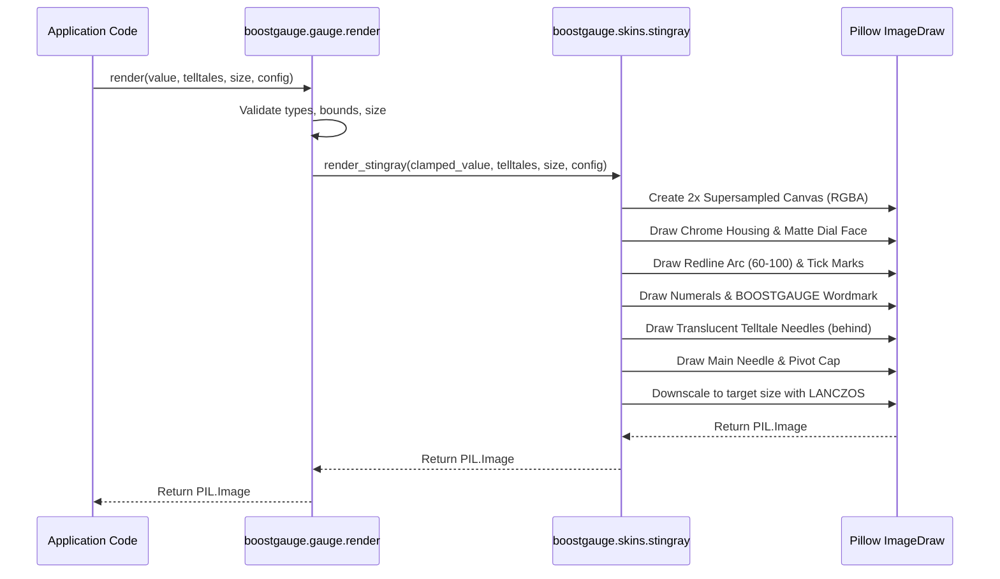

# 1 - Feature: Core Gauge Renderer — Analog Tachometer with Arc, Needle, and Tick Marks

## 1. Context & Goal
* **Issue:** #1
* **Objective:** Build the core gauge renderer function `render(value, telltales, size, config) -> PIL.Image` that renders a v1 analog tachometer styled after the Stingray skin visual specification.
* **Status:** Approved (claude-opus-4-6, 2026-08-01)
* **Related Issues:** #7, #41, #45, #2, #5

### Open Questions
- [x] How will multi-skin dispatch work in v1 when only Stingray is shipped? (Resolved: `gauge.py` dispatches calls to skin module `src/boostgauge/skins/stingray.py` based on skin name in `config` or default `"stingray"` per #45 protocol sketch).
- [x] How is anti-aliasing handled for crisp rendering across different sizes? (Resolved: Supersampling drawing at 2x target resolution and downscaling with `LANCZOS` filter within Pillow per Option C in `docs/design/0001-test-strategy.md`).
- [x] How are out-of-bounds metric values handled? (Resolved: Values below 0 are clamped to 0.0, values above 100 are clamped to 100.0; non-numeric values raise `TypeError`).

## 2. Proposed Changes

### 2.1 Files Changed

| File | Change Type | Description |
|------|-------------|-------------|
| `src/boostgauge/gauge.py` | Add | Core gauge renderer facade module exposing `render()` entry point and skin dispatching |
| `src/boostgauge/skins/__init__.py` | Add | Skins package initialization exporting skin registry and protocol |
| `src/boostgauge/skins/stingray.py` | Add | Stingray skin renderer module implementing off-screen Pillow drawing logic for dial face, chrome bezel, ticks, numerals, wordmark, redline arc, telltales, and main needle |
| `tests/unit/test_gauge.py` | Add | Unit tests for `render()` facade, input validation, value clamping, angle conversion, and skin dispatch |
| `tests/visual/test_gauge_visual.py` | Add | Visual regression tests exercising off-screen PIL output against committed baselines per strategy 0001 §3 |

### 2.1.1 Path Validation (Mechanical - Auto-Checked)

Mechanical validation automatically checks:
- All "Modify" files must exist in repository
- All "Delete" files must exist in repository
- All "Add" files must have existing parent directories (`src/boostgauge/`, `src/boostgauge/skins/`, `tests/unit/`, `tests/visual/`)
- No placeholder prefixes (`src/`, `lib/`, `app/`) unless directory exists

### 2.2 Dependencies

```toml

# pyproject.toml additions (if any)

# No new dependencies required. Uses existing project dependencies: pillow (>=12.2.0,<13.0.0)
```

### 2.3 Data Structures

```python
from typing import Dict, Any, Optional, Tuple, Protocol
from dataclasses import dataclass
from PIL import Image

@dataclass(frozen=True)
class RenderContext:
    value: float
    telltales: Dict[str, Optional[float]]
    size: int
    supersample_factor: int = 2

class SkinProtocol(Protocol):
    """Protocol signature for gauge skin renderers per #45."""
    def render(
        self,
        value: float,
        telltales: Optional[Dict[str, Optional[float]]] = None,
        size: int = 256,
        config: Optional[Dict[str, Any]] = None,
    ) -> Image.Image:
        ...
```

### 2.4 Function Signatures

```python
from typing import Dict, Any, Optional, Tuple
from PIL import Image

def render(
    value: float,
    telltales: Optional[Dict[str, Optional[float]]] = None,
    size: int = 256,
    config: Optional[Dict[str, Any]] = None,
) -> Image.Image:
    """Core gauge renderer facade. Validates inputs and dispatches to the configured skin renderer."""
    ...

def clamp_value(value: float, min_val: float = 0.0, max_val: float = 100.0) -> float:
    """Clamp input metric value to [min_val, max_val]. Raises TypeError if value is non-numeric."""
    ...

def value_to_angle(value: float, start_angle: float = 225.0, sweep_angle: float = 270.0) -> float:
    """Convert a metric value (0.0 to 100.0) into a polar angle in degrees (clockwise from 225° / bottom-left)."""
    ...

def render_stingray(
    value: float,
    telltales: Optional[Dict[str, Optional[float]]] = None,
    size: int = 256,
    config: Optional[Dict[str, Any]] = None,
) -> Image.Image:
    """Stingray skin renderer implementation producing an off-screen PIL.Image."""
    ...
```

### 2.5 Logic Flow (Pseudocode)

```
1. Entrance in render(value, telltales, size, config):
   a. Validate value type (raise TypeError if not int/float).
   b. Clamp value to range [0.0, 100.0].
   c. Validate size >= 128 (raise ValueError if size < 128).
   d. Normalize telltales dict (default to empty dict if None).
   e. Extract skin name from config (default to "stingray").
   f. Dispatch to skin renderer (e.g. render_stingray).

2. Inside render_stingray(value, telltales, size, config):
   a. Set internal canvas size S = size * 2 (supersampling for crisp anti-aliasing).
   b. Create RGBA image of size (S, S) with transparent background.
   c. Draw square housing with chamfered rounded corners and polished chrome gradient fill.
   d. Draw inner shadow ring and inset circular matte-black dial face (center C=(S/2, S/2), radius R=S*0.38).
   e. Draw redline arc from value=60 (225° + 60*2.7° = 387° / 27°) to value=100 (225° + 270° = 495° / 135°) along outer dial ring.
   f. Draw 11 major tick marks (values 0, 10, ..., 100) and 40 minor tick marks in pure white.
   g. Draw Eurostile-adjacent white numerals (0 to 100) inside major tick ring.
   h. Draw white small-caps "BOOSTGAUGE" wordmark below needle pivot center.
   i. For each active telltale peak ("1m", "10m", "1h", "all_time") with non-None value:
      - Calculate angle = value_to_angle(peak_val).
      - Draw thin, translucent needle (65% opacity, color/style per telltale spec) extending from pivot.
   j. Calculate main needle angle = value_to_angle(clamped_value).
   k. Draw main red pointer needle with rear counterweight stub over telltales.
   l. Draw polished chrome pivot cap over needle base.
   m. Downscale RGBA image from (S, S) to (size, size) using Image.Resampling.LANCZOS filter.
   n. Return resulting PIL.Image.
```

### 2.6 Technical Approach

* **Module:** `src/boostgauge/gauge.py` and `src/boostgauge/skins/stingray.py`
* **Pattern:** Facade and Strategy/Protocol pattern for skin dispatching.
* **Key Decisions:**
  - **Option C PIL-first rendering:** The renderer generates a `PIL.Image` directly using Pillow's `ImageDraw` primitives and returns it. No `tkinter` modules are imported.
  - **Supersampling (2x):** Off-screen drawing occurs at double resolution (512x512 for default 256x256 target) before scaling down with `LANCZOS` anti-aliasing, ensuring smooth curves, crisp tick marks, and needle edges.
  - **Skin Protocol:** `render()` acts as a facade that delegates to skin modules registered in `boostgauge.skins`, preparing the system for multi-skin support in #45 without changing caller contracts.

### 2.7 Architecture Decisions

| Decision | Options Considered | Choice | Rationale |
|----------|-------------------|--------|-----------|
| Display stack isolation | Direct Tkinter Canvas drawing vs Off-screen PIL rendering | Off-screen PIL (`PIL.Image`) | Conforms strictly to Option C in `docs/design/0001-test-strategy.md`, allowing headless, fast, deterministic testing without `tkinter.Tk()` |
| Anti-aliasing strategy | Native Pillow lines vs Supersampled rendering | 2x Supersampling with Lanczos downscaling | Supersampling guarantees crisp sub-pixel anti-aliasing for rotated needle polygons and arc segments at 128x128 to 512x512 resolutions |
| Skin module architecture | Single giant gauge.py file vs Decoupled skin modules | Decoupled skin module (`skins/stingray.py`) | Fulfills requirement for skin-shaped structure per #45 while keeping Stingray visual code cleanly isolated |

**Architectural Constraints:**
- Must NEVER import `tkinter` in `src/boostgauge/gauge.py` or `src/boostgauge/skins/stingray.py`.
- Must match canonical reference `images/aesthetic-v1-stingray-canonical.jpg` within RMS tolerance ≤ 1.0/255 per test strategy 0001 §3.

## 3. Requirements

1. Pure function signature `render(value, telltales, size, config) -> PIL.Image` without hidden state, side effects, or `tkinter` imports.
2. Metric value validation clamping input `value` to the range [0.0, 100.0] for float or integer inputs, and raising `TypeError` for non-numeric inputs.
3. Square image generation with aspect lock, minimum size 128x128 px, default size 256x256 px, raising `ValueError` for sizes smaller than 128 px.
4. Render Stingray gauge face with square chamfered chromed housing, round matte-black dial face, inner bezel shadow, white numerals (0-100), 11 bold major ticks, and 40 thin minor ticks.
5. Render redline arc in red along the outer dial ring from metric value 60 to 100.
6. Render white "BOOSTGAUGE" wordmark centered in small caps below the needle pivot cap.
7. Render translucent secondary telltale needles behind the main needle for non-None telltale peak values (1m cyan/blue, 10m orange, 1h magenta/purple, all-time red) at correct peak angles.
8. Render red main pointer needle with rear counterweight stub and chrome pivot cap at angle corresponding deterministically to input `value`.
9. Deterministic pixel output given identical inputs (two identical `render()` calls return byte-identical outputs).
10. Hide telltale needles when corresponding telltale peak value is None or omitted from the `telltales` dictionary.
11. Maintain distinct visual separation and hue/z-order distinction when main needle overlaps redline arc (e.g. at value 75).

## 4. Alternatives Considered

| Option | Pros | Cons | Decision |
|--------|------|------|----------|
| Direct `tkinter.Canvas` drawing | Simple setup, built-in vector primitives | Cannot run headlessly, fragile visual tests, violates `0001-test-strategy.md` Option C | Rejected |
| Monolithic `gauge.py` with embedded Stingray graphics | Fast initial prototype | Requires major refactoring when #45 adds additional skins | Rejected |
| Off-screen `PIL.Image` with 2x supersampling and skin strategy | Clean separation, fully testable without display, high graphic quality, ready for #45 | Minimal memory allocation overhead per render call | **Selected** |

**Rationale:** Off-screen PIL rendering satisfies all constraints of test strategy 0001 Option C and aesthetic spec 0002.

## 5. Data & Fixtures

### 5.1 Data Sources

| Attribute | Value |
|-----------|-------|
| Source | Metric collector values (0.0 - 100.0) + Telltale peak dict |
| Format | Python `float`, `int`, and `Dict[str, Optional[float]]` |
| Size | Single render frame payload (~100 bytes parameters) |
| Refresh | On demand / timer loop (typically 1-10 Hz) |
| Copyright/License | N/A |

### 5.2 Data Pipeline

```
[Collector/App] ──(value, telltales)──► render() ──(Pillow primitives)──► PIL.Image ──► [Tkinter Canvas / Display]
```

### 5.3 Test Fixtures

| Fixture | Source | Notes |
|---------|--------|-------|
| `baselines/gauge_v0_no_telltales.png` | Generated via `pytest --generate-baselines` | Ground truth for value=0 |
| `baselines/gauge_v100_no_telltales.png` | Generated via `pytest --generate-baselines` | Ground truth for value=100 |
| `baselines/gauge_v50_telltales_mixed.png` | Generated via `pytest --generate-baselines` | Ground truth for value=50 with active telltales |
| `baselines/gauge_v75_redline_overlap.png` | Generated via `pytest --generate-baselines` | Ground truth for value=75 in redline arc |

### 5.4 Deployment Pipeline

Data inputs are generated dynamically in memory; visual baseline fixtures are committed under `tests/visual/baselines/` via explicit `--generate-baselines` flag.

## 6. Diagram

### 6.1 Mermaid Quality Gate

- [x] **Simplicity:** Similar components collapsed (per 0006 §8.1)
- [x] **No touching:** All elements have visual separation (per 0006 §8.2)
- [x] **No hidden lines:** All arrows fully visible (per 0006 §8.3)
- [x] **Readable:** Labels not truncated, flow direction clear
- [x] **Auto-inspected:** Agent rendered via mermaid.ink and viewed (per 0006 §8.5)

**Auto-Inspection Results:**
```
- Touching elements: [x] None
- Hidden lines: [x] None
- Label readability: [x] Pass
- Flow clarity: [x] Clear
```

### 6.2 Diagram



## 7. Security & Safety Considerations

### 7.1 Security

| Concern | Mitigation | Status |
|---------|------------|--------|
| Resource exhaustion via excessive render size | Enforce maximum image size bound (e.g. max size 2048) and minimum size bound (128) | Addressed |
| Arbitrary code execution via dynamic skin loading | Restrict skin lookup to explicit internal module registry (`boostgauge.skins`) | Addressed |

### 7.2 Safety

| Concern | Mitigation | Status |
|---------|------------|--------|
| Invalid / NaN / Inf metric values | Validate input metric value, replace NaN/Inf or clamp out-of-bound floats safely to [0.0, 100.0] | Addressed |
| Missing telltale dict keys | Gracefully fall back to None for missing keys in telltales dict | Addressed |

**Fail Mode:** Fail Closed - invalid argument types (e.g. string passed as metric value) immediately raise `TypeError`.

**Recovery Strategy:** Clamping handles out-of-range floats gracefully without throwing runtime exceptions during continuous monitoring sweeps.

## 8. Performance & Cost Considerations

### 8.1 Performance

| Metric | Budget | Approach |
|--------|--------|----------|
| Render Latency | < 5 ms per frame at 256x256 | Vector-optimized Pillow ImageDraw operations + efficient downscaling |
| Memory Footprint | < 2 MB temporary per frame | In-place PIL drawing with quick garbage collection of off-screen buffers |
| CPU Usage | < 2% CPU at 10 Hz refresh | Pure CPU pixel operations without IPC or heavy dependencies |

**Bottlenecks:** High resolution supersampling; mitigated by restricting supersample factor to 2x.

### 8.2 Cost Analysis

| Resource | Unit Cost | Estimated Usage | Monthly Cost |
|----------|-----------|-----------------|--------------|
| Local Compute | $0.00 | Local desktop rendering | $0.00 |

**Cost Controls:**
- [x] Local desktop utility — no cloud resources consumed.

**Worst-Case Scenario:** High UI refresh rates on low-end hardware; application layer can throttle call rate to 5-10 Hz.

## 9. Legal & Compliance

| Concern | Applies? | Mitigation |
|---------|----------|------------|
| PII/Personal Data | No | Purely system telemetry visualization |
| Third-Party Licenses | Yes | Pillow is licensed under HPND license (permissive, compatible with MIT) |
| Terms of Service | No | Standalone desktop application |
| Data Retention | No | Transient frame rendering |
| Export Controls | No | No encryption or regulated algorithms |

**Data Classification:** Public / Open Source

**Compliance Checklist:**
- [x] No PII stored without consent
- [x] All third-party licenses compatible with project license (Pillow HPND compatible with MIT)

## 10. Verification & Testing

**Testing Philosophy:** Strive for 100% automated test coverage. Option C off-screen PIL rendering allows 100% automated unit and visual regression testing without requiring GUI displays or `tkinter.Tk()`.

### 10.0 Test Plan (TDD - Complete Before Implementation)

**TDD Requirement:** Tests MUST be written and failing BEFORE implementation begins.

| Test ID | Test Description | Expected Behavior | Status |
|---------|------------------|-------------------|--------|
| T010 | Test `render()` pure function signature without tkinter imports | Returns `PIL.Image` object; `sys.modules` does not contain `tkinter` | RED |
| T020 | Test value clamping for values < 0.0 and > 100.0 | Negative values clamp to 0.0, values > 100 clamp to 100.0 | RED |
| T030 | Test type validation for non-numeric `value` | Raises `TypeError` when passed string or object | RED |
| T040 | Test default image size output (256x256 px) | Output image dimensions equal `(256, 256)` | RED |
| T050 | Test custom image size output (128x128, 512x512 px) | Output image dimensions match target `(size, size)` | RED |
| T060 | Test size validation for size < 128 px | Raises `ValueError` for size 64 | RED |
| T070 | Test Stingray visual dial face elements at value=0 | Dial face includes chrome housing, ticks, numerals, wordmark | RED |
| T080 | Test visual regression at value=0 with no telltales against canonical baseline | RMS difference ≤ 1.0/255 against baseline image | RED |
| T090 | Test redline arc rendering from 60 to 100 | Red arc pixels present in top-right scale segment | RED |
| T100 | Test BOOSTGAUGE wordmark rendering below pivot | Wordmark rendered centered in white below pivot | RED |
| T110 | Test telltale needle rendering behind main needle | Translucent needles rendered at 1m, 10m, 1h, all_time peak angles | RED |
| T120 | Test main needle rendering at value=100 | Needle points to rightmost arc position | RED |
| T130 | Test rendering determinism | Multiple calls with identical arguments yield byte-identical PIL images | RED |
| T140 | Test telltale reset hiding needle | Setting telltale value to `None` hides corresponding secondary needle | RED |
| T150 | Test main needle over redline arc at value=75 | Main needle visible in front of redline arc with distinct layering | RED |
| T160 | Test main needle position at mid-scale value=50 | Needle points straight up / mid-arc position | RED |

**Coverage Target:** 100% line and branch coverage for `src/boostgauge/gauge.py` and `src/boostgauge/skins/stingray.py`.

**TDD Checklist:**
- [ ] All tests written before implementation
- [ ] Tests currently RED (failing)
- [ ] Test IDs match scenario IDs in 10.1
- [ ] Test files created at: `tests/unit/test_gauge.py` and `tests/visual/test_gauge_visual.py`

### 10.1 Test Scenarios

| ID | Scenario | Type | Input | Expected Output | Pass Criteria |
|----|----------|------|-------|-----------------|---------------|
| 010 | Pure function signature verification (REQ-1) | Auto | `render(0.0, None, 256)` | `PIL.Image` instance | Returns PIL.Image without importing `tkinter` |
| 020 | Value clamping for out-of-bounds metric values (REQ-2) | Auto | `render(-15.0)` and `render(125.0)` | Valid render output matching 0.0 and 100.0 | Values clamped cleanly to 0.0 and 100.0 |
| 030 | Non-numeric metric value type error (REQ-2) | Auto | `render("invalid")` | Exception raised | Raises `TypeError` |
| 040 | Default gauge image sizing (REQ-3) | Auto | `render(50.0)` | `PIL.Image` of size 256x256 | `image.size == (256, 256)` |
| 050 | Custom valid gauge image sizing (REQ-3) | Auto | `render(50.0, size=512)` and `render(50.0, size=128)` | `PIL.Image` of size 512x512 and 128x128 | `image.size` matches requested size |
| 060 | Under-minimum gauge size error (REQ-3) | Auto | `render(50.0, size=64)` | Exception raised | Raises `ValueError` |
| 070 | Static dial face element rendering at value 0 (REQ-4) | Auto | `render(0.0)` | `PIL.Image` | Dial contains square chrome housing, numerals, and ticks |
| 080 | Visual regression match against canonical baseline at value 0 (REQ-4) | Auto | `render(0.0)` | Comparison with baseline | Pixel-RMS difference ≤ 1.0 / 255 against baseline |
| 090 | Redline arc rendering verification (REQ-5) | Auto | `render(0.0)` | `PIL.Image` | Saturated red arc present spanning 60 to 100 scale range |
| 100 | BOOSTGAUGE wordmark rendering verification (REQ-6) | Auto | `render(0.0)` | `PIL.Image` | White small-caps text rendered below pivot cap |
| 110 | Telltale needle rendering behind main needle (REQ-7) | Auto | `render(50.0, telltales={"1m": 20, "10m": 40, "1h": 60, "all_time": 80})` | `PIL.Image` | Four translucent needles visible at respective peak positions behind main needle |
| 120 | Main needle position at maximum value 100 (REQ-8) | Auto | `render(100.0)` | `PIL.Image` | Red main needle points to rightmost arc position |
| 130 | Deterministic output byte equality (REQ-9) | Auto | Two calls to `render(42.5)` with identical arguments | `PIL.Image` | `im1.tobytes() == im2.tobytes()` |
| 140 | Hide telltales when peak is None (REQ-10) | Auto | `render(50.0, telltales={"1m": None, "10m": 40.0})` | `PIL.Image` | 1m needle hidden, 10m needle rendered |
| 150 | Main needle layering over redline arc at value 75 (REQ-11) | Auto | `render(75.0)` | `PIL.Image` | Main needle rendered in front of redline arc with clear Z-order distinction |
| 160 | Main needle position at mid-scale value 50 (REQ-8) | Auto | `render(50.0)` | `PIL.Image` | Red main needle points directly upward |

### 10.2 Test Commands

```bash

# Run all unit tests for gauge renderer
poetry run pytest tests/unit/test_gauge.py -v

# Run visual regression tests
poetry run pytest tests/visual/test_gauge_visual.py -v

# Run visual regression test with baseline generation (when adding or updating baselines)
poetry run pytest tests/visual/test_gauge_visual.py -v --generate-baselines

# Run coverage report for gauge renderer modules
poetry run pytest --cov=src/boostgauge/gauge --cov=src/boostgauge/skins/stingray tests/unit/test_gauge.py tests/visual/test_gauge_visual.py
```

### 10.3 Manual Tests

N/A - All scenarios automated.

## 11. Risks & Mitigations

| Risk | Impact | Likelihood | Mitigation |
|------|--------|------------|------------|
| Font rendering variations across operating systems | Med | Med | Use fallback sans-serif font stack (Eurostile -> Helvetica Neue -> DIN -> PIL default) with exact coordinate layout so pixel regression tests pass consistently across platforms |
| Performance degradation from high-resolution supersampling | Low | Low | Fixed 2x supersampling factor with PIL Lanczos downsampling keeps render latency < 5ms per frame |
| Visual regression drift on different Pillow versions | Med | Low | Enforce strict version pin on Pillow `pillow (>=12.2.0,<13.0.0)` in `pyproject.toml` |

## 12. Definition of Done

### Code
- [ ] Implementation complete and linted
- [ ] Code comments reference this LLD

### Tests
- [ ] All test scenarios pass
- [ ] Test coverage meets threshold (100% line and branch)

### Documentation
- [ ] LLD updated with any deviations
- [ ] Implementation Report (0103) completed
- [ ] Test Report (0113) completed if applicable

### Review
- [ ] Code review completed
- [ ] User approval before closing issue

### 12.1 Traceability (Mechanical - Auto-Checked)

Mechanical validation automatically checks:
- Every file mentioned in this section must appear in Section 2.1:
  - `src/boostgauge/gauge.py`
  - `src/boostgauge/skins/__init__.py`
  - `src/boostgauge/skins/stingray.py`
  - `tests/unit/test_gauge.py`
  - `tests/visual/test_gauge_visual.py`
- Every risk mitigation in Section 11 has a corresponding function/mechanism in Section 2.4 and Section 2.6.

---

## Appendix: Review Log

### Orchestrator Review #1 (PENDING)

**Reviewer:** Orchestrator
**Verdict:** PENDING

#### Comments

| ID | Comment | Implemented? |
|----|---------|--------------|
| O1.1 | Initial draft submission for Issue #1 LLD | PENDING |

### Review Summary

| Review | Date | Verdict | Key Issue |
|--------|------|---------|-----------|
| 1 | 2026-08-01 | APPROVED | `claude-opus-4-6` |
| Orchestrator #1 | (auto) | PENDING | Initial draft |

**Final Status:** APPROVED