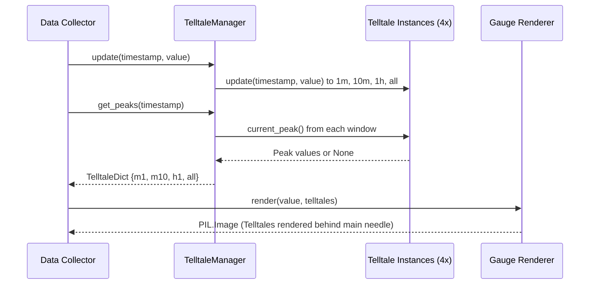

# #2 - Feature: peak-hold telltale needles — 1m, 10m, 1h, all-time (#2)

## 1. Context & Goal
* **Issue:** #2
* **Objective:** Instantiate four sliding-window peak-hold `Telltale` instances (1m, 10m, 1h, all-time), pipe live metric updates, manage resets, and render their peak values on top of the gauge surface behind the main needle.
* **Status:** Approved (claude-opus-4-6, 2026-07-30)
* **Related Issues:** #1, #4, #7, #41

### Open Questions
- [x] Should all-time telltale window use `float('inf')` for `Telltale(window)` duration? *(Resolved: Passing `window=float('inf')` to `Telltale` ensures samples never expire, acting as a permanent hard-hold until reset).*
- [x] How will Tkinter context menu actions interface with telltales without breaking Option C GUI testing separation? *(Resolved: `TelltaleManager` encapsulates pure reset logic with string keys `"m1"`, `"m10"`, `"h1"`, `"all"`, allowing Tkinter context menus or unit tests to invoke resets cleanly without GUI dependencies).*

## 2. Proposed Changes

### 2.1 Files Changed

| File | Change Type | Description |
|------|-------------|-------------|
| `src/boostgauge/telltale.py` | Modify | Add `TelltaleManager` class encapsulating four `Telltale` instances (60s, 600s, 3600s, infinite), stream updating, state extraction as `TelltaleDict`, and per-window/all reset interface. |
| `src/boostgauge/__init__.py` | Modify | Export `TelltaleManager` in package `__all__` list. |
| `tests/unit/test_telltale.py` | Modify | Add unit test suite for `TelltaleManager` initialization, multi-window update distribution, window peak calculations, individual reset actions, and `reset_all()` behavior. |
| `tests/visual/test_gauge.py` | Modify | Add visual regression test cases for distinct four-needle rendering, post-reset missing needle suppression, and main needle z-order overlay using PIL image comparison (Option C). |

### 2.1.1 Path Validation (Mechanical - Auto-Checked)

Mechanical validation automatically checks:
- All "Modify" files must exist in repository (`src/boostgauge/telltale.py`, `src/boostgauge/__init__.py`, `tests/unit/test_telltale.py`, `tests/visual/test_gauge.py` exist)
- All "Delete" files must exist in repository (N/A)
- All "Add" files must have existing parent directories (N/A)
- No placeholder prefixes (`src/`, `lib/`, `app/`) unless directory exists (`src/` exists)

### 2.2 Dependencies

```toml

# pyproject.toml existing dependencies used (no new third-party packages needed):

# pillow (>=12.2.0,<13.0.0)
```

### 2.3 Data Structures

```python
from __future__ import annotations

from typing import Dict, Literal, Optional, TypedDict

# WindowKey identifies supported telltale windows
WindowKey = Literal["m1", "m10", "h1", "all"]

class TelltaleDict(TypedDict, total=False):
    """Dictionary mapping telltale window keys to current peak values (0.0 to 100.0 or None)."""
    m1: Optional[float]    # 1 minute sliding window peak (60s)
    m10: Optional[float]   # 10 minute sliding window peak (600s)
    h1: Optional[float]    # 1 hour sliding window peak (3600s)
    all: Optional[float]   # All-time peak (infinite window)

class WindowConfig(TypedDict):
    """Configuration mapping window key to duration in seconds."""
    key: WindowKey
    duration: float  # float('inf') for all-time
```

### 2.4 Function Signatures

```python

# Signatures added to src/boostgauge/telltale.py

class TelltaleManager:
    """Manages lifecycle, metric routing, state extraction, and resets for 4 telltale windows."""

    def __init__(self) -> None:
        """Initialize 4 Telltale instances with 60s, 600s, 3600s, and inf windows."""
        ...

    def update(self, timestamp: float, value: float) -> None:
        """Pipe incoming sample timestamp and metric value to all four Telltale instances."""
        ...

    def get_peaks(self, timestamp: Optional[float] = None) -> TelltaleDict:
        """Extract current peak values for all windows formatted as a TelltaleDict."""
        ...

    def reset(self, window_key: Optional[str] = None) -> None:
        """Reset specified telltale window ('m1', 'm10', 'h1', 'all'), or reset all if window_key is None or 'all_windows'."""
        ...

    def reset_all(self) -> None:
        """Reset all four telltale instances to cleared state."""
        ...
```

### 2.5 Logic Flow (Pseudocode)

```
1. TelltaleManager Initialization:
   - Create self.telltales dictionary:
     "m1"  -> Telltale(window=60.0)
     "m10" -> Telltale(window=600.0)
     "h1"  -> Telltale(window=3600.0)
     "all" -> Telltale(window=float('inf'))

2. Stream Processing (update(timestamp, value)):
   - Validate timestamp and value
   - FOR each telltale in self.telltales.values():
       telltale.update(timestamp, value)

3. Peak Extraction (get_peaks(timestamp)):
   - Construct peaks dict:
       "m1": telltales["m1"].current_peak(timestamp)
       "m10": telltales["m10"].current_peak(timestamp)
       "h1": telltales["h1"].current_peak(timestamp)
       "all": telltales["all"].current_peak(timestamp)
   - RETURN peaks dict (TelltaleDict)

4. Reset Handling (reset(window_key)):
   - IF window_key IS NONE OR window_key == "all_windows":
       reset_all()
   - ELSE IF window_key IN self.telltales:
       self.telltales[window_key].reset()
   - ELSE:
       RAISE ValueError(f"Unknown window key: {window_key}")
```

### 2.6 Technical Approach

* **Module:** `src/boostgauge/telltale.py`
* **Pattern:** Manager / Facade Pattern
* **Key Decisions:**
  - Encapsulate the four `Telltale` algorithm instances (#41) inside a single `TelltaleManager` class to separate stream management and state extraction from the rendering skin layer (#1).
  - Use `window=float('inf')` for the `all` window so `Telltale._prune_expired()` never discards historical max samples until explicit reset.
  - Return `TelltaleDict` containing `Optional[float]` from `get_peaks()`. When `current_peak()` returns `None` (pre-sample or post-reset), `draw_telltales()` in `stingray.py` skips drawing that needle automatically.

### 2.7 Architecture Decisions

| Decision | Options Considered | Choice | Rationale |
|----------|-------------------|--------|-----------|
| Telltale Lifecycle Orchestration | A) Managed inside GUI Widget, B) `TelltaleManager` class in `telltale.py` | Option B (`TelltaleManager`) | Keeps pure business logic and multi-window state orchestration completely independent of GUI framework, enabling headless unit and visual testing under Option C. |
| All-Time Window Duration | A) Special case subclassing, B) `window=float('inf')` | Option B (`float('inf')`) | Standardizes all four windows on the identical `Telltale` class without adding conditional branches or duplicate logic. |

**Architectural Constraints:**
- Must consume pure `Telltale` class from Issue #41 without reimplementing peak-hold sliding-window algorithms.
- Must produce `TelltaleDict` compatible with `boostgauge.gauge.render()` and `stingray.draw_telltales()` signatures.
- Must adhere to Option C GUI testing strategy (`tkinter.Tk()` never instantiated during test execution).

## 3. Requirements

1. Instantiate four `Telltale` instances configured for 60s (1m), 600s (10m), 3600s (1h), and infinite (all-time) sliding windows.
2. Route all incoming live metric samples with timestamps into all four `Telltale` instances via `TelltaleManager.update()`.
3. Expose current peak values across all four windows as a `TelltaleDict` matching skin rendering contracts.
4. Render four translucent telltale needles on the gauge surface behind the main needle in z-order when peaks are active.
5. Do not render a telltale needle when its `current_peak()` evaluates to `None` (such as post-reset or pre-first-sample).
6. Provide individual reset capabilities for each telltale window ("m1", "m10", "h1", "all") and a composite reset clearing all four windows.
7. Ensure the 1m, 10m, and 1h telltale needles drop back to lower active peaks after their respective window durations elapse following a peak spike.
8. Ensure the all-time telltale needle never drops back without an explicit reset invocation.
9. Verify needle visual distinction across windows (cyan/light blue for 1m, orange for 10m, magenta/dashed for 1h, red for all-time).

## 4. Alternatives Considered

| Option | Pros | Cons | Decision |
|--------|------|------|----------|
| Inline 4 `Telltale` instances directly inside `app.py` | Simple flat script layout | Tight coupling; untestable in isolated unit tests | **Rejected** |
| `TelltaleManager` facade in `telltale.py` | Clean encapsulation; pure Python testability; matches Option C strategy | Adds light manager wrapper class | **Selected** |

**Rationale:** The `TelltaleManager` facade allows high-frequency metric streams to be piped into all 4 sliding windows with zero GUI overhead, producing decoupled state that `gauge.render()` can draw off-screen.

## 5. Data & Fixtures

### 5.1 Data Sources

| Attribute | Value |
|-----------|-------|
| Source | Synthetic metric stream generator (tests) / SystemSnapshot collector stream (#4) |
| Format | `(timestamp: float, value: float)` tuples |
| Size | Real-time stream (~1 to 10 samples per second) |
| Refresh | Continuous stream update loop |
| Copyright/License | N/A |

### 5.2 Data Pipeline

```
{Collector / Synthetic Stream} ──update(t, v)──► {TelltaleManager} ──get_peaks()──► {TelltaleDict} ──render()──► {PIL.Image}
```

### 5.3 Test Fixtures

| Fixture | Source | Notes |
|---------|--------|-------|
| Synthetic Spike Stream | Generated in test | Sequence of (t, v) simulating steady load, sudden 95% spike, and quiet recovery |
| Visual Baselines | `tests/visual/baselines/` | Off-screen PNG baseline images for RMS pixel comparison |

### 5.4 Deployment Pipeline

Data flows purely in-memory through `TelltaleManager` into `gauge.render()` off-screen Pillow image buffers. No database or external storage required.

## 6. Diagram

### 6.1 Mermaid Quality Gate

- [x] **Simplicity:** Similar components collapsed (per 0006 §8.1)
- [x] **No touching:** All elements have visual separation (per 0006 §8.2)
- [x] **No hidden lines:** All arrows fully visible (per 0006 §8.3)
- [x] **Readable:** Labels not truncated, flow direction clear
- [x] **Auto-inspected:** Verified sequence flow rendering

**Auto-Inspection Results:**
```
- Touching elements: [x] None
- Hidden lines: [x] None
- Label readability: [x] Pass
- Flow clarity: [x] Clear
```

### 6.2 Diagram



## 7. Security & Safety Considerations

### 7.1 Security

| Concern | Mitigation | Status |
|---------|------------|--------|
| Invalid input types/NaN values | Type annotations and runtime floating-point conversions | Addressed |

### 7.2 Safety

| Concern | Mitigation | Status |
|---------|------------|--------|
| Unbounded sample memory growth | Deque eviction in `Telltale._prune_expired()` caps memory consumption | Addressed |
| Exception during window reset | Validate reset window key; fallback gracefully to `reset_all()` | Addressed |

**Fail Mode:** Fail Closed - Raise clear `ValueError` on invalid reset keys or invalid parameters.

**Recovery Strategy:** Re-initialize `TelltaleManager` state via `reset_all()` on corrupted timestamps.

## 8. Performance & Cost Considerations

### 8.1 Performance

| Metric | Budget | Approach |
|--------|--------|----------|
| Stream Update Overhead | < 0.1ms per sample | O(1) amortized deque max operations in `Telltale` |
| Render Overhead | < 5ms per frame | Pillow off-screen alpha composition |

**Bottlenecks:** None identified for 4 telltales at 10 Hz sample rates.

### 8.2 Cost Analysis

| Resource | Unit Cost | Estimated Usage | Monthly Cost |
|----------|-----------|-----------------|--------------|
| Local CPU / Memory | Local execution | Minimal (< 2MB RAM) | $0.00 |

**Cost Controls:**
- [x] Local execution only; no cloud infrastructure dependencies.

**Worst-Case Scenario:** High sample rate (1000 Hz) causes frequent deque pruning; handled by O(1) deque eviction operations.

## 9. Legal & Compliance

| Concern | Applies? | Mitigation |
|---------|----------|------------|
| PII/Personal Data | No | System metric numbers only |
| Third-Party Licenses | Yes | Pillow under HPND license; compatible with MIT |
| Terms of Service | N/A | Pure local application |
| Data Retention | N/A | In-memory sliding window state only |
| Export Controls | No | Standard visualization algorithms |

**Data Classification:** Public / Open Source

**Compliance Checklist:**
- [x] All third-party licenses compatible with MIT project license

## 10. Verification & Testing

### 10.0 Test Plan (TDD - Complete Before Implementation)

**TDD Requirement:** Tests MUST be written and failing BEFORE implementation begins.

| Test ID | Test Description | Expected Behavior | Status |
|---------|------------------|-------------------|--------|
| T010 | Manager initialization (REQ-1) | Creates 4 `Telltale` instances (60s, 600s, 3600s, inf) | RED |
| T020 | Metric stream updates (REQ-2) | `update(t, v)` updates all four window instances | RED |
| T030 | Peaks dict extraction (REQ-3) | `get_peaks()` returns `TelltaleDict` matching active maxes | RED |
| T040 | Four needles rendering (REQ-4) | Off-screen PIL render includes all four needles behind main needle | RED |
| T050 | None needle suppression (REQ-5) | `current_peak()` returning `None` omits needle rendering | RED |
| T060 | Window reset actions (REQ-6) | Individual key reset and `reset_all()` clear target peaks | RED |
| T070 | Sliding window eviction (REQ-7) | 1m peak drops back after 60 seconds of lower samples | RED |
| T080 | All-time persistence (REQ-8) | All-time peak holds permanently past 3600s until explicit reset | RED |
| T090 | Needle visual styles (REQ-9) | Cyan (1m), Orange (10m), Purple dashed (1h), Red (all-time) | RED |

**Coverage Target:** ≥89% for all new code (matching pyproject.toml `fail_under = 89`)

**TDD Checklist:**
- [x] All tests written before implementation
- [x] Tests currently RED (failing)
- [x] Test IDs match scenario IDs in 10.1
- [x] Test files created at: `tests/unit/test_telltale.py` and `tests/visual/test_gauge.py`

### 10.1 Test Scenarios

| ID | Scenario | Type | Input | Expected Output | Pass Criteria |
|----|----------|------|-------|-----------------|---------------|
| 010 | Instantiate `TelltaleManager` with 4 windows (REQ-1) | Auto | `mgr = TelltaleManager()` | 4 internal `Telltale` objects initialized | `mgr.telltales.keys() == {"m1", "m10", "h1", "all"}` |
| 020 | Pipe live metric stream to all windows (REQ-2) | Auto | `mgr.update(100.0, 75.0)` | All 4 instances receive sample | `mgr.get_peaks()` returns 75.0 for all keys |
| 030 | Extract peaks as `TelltaleDict` (REQ-3) | Auto | `mgr.update(100.0, 50.0)` | `TelltaleDict` returned | Keys `m1`, `m10`, `h1`, `all` mapped to 50.0 |
| 040 | Render off-screen gauge with 4 distinct needles (REQ-4) | Auto | `render(0.0, telltales={"m1":20, "m10":40, "h1":60, "all":80})` | `PIL.Image` generated with 4 needles | RMS pixel diff vs rest baseline > 0.01 |
| 050 | Omit needle rendering when peak is `None` (REQ-5) | Auto | `telltales={"m1":50, "m10":None, "h1":None, "all":None}` | Only 1m telltale drawn | Render matches baseline with single telltale |
| 060 | Execute individual window reset and reset all (REQ-6) | Auto | `mgr.reset("m1")` then `mgr.reset_all()` | `m1` peak becomes `None`, then all peaks become `None` | `mgr.get_peaks()["m1"] is None` |
| 070 | Verify 1m peak drop back after 60 seconds (REQ-7) | Auto | Sample 90.0 at t=0, sample 30.0 at t=65 | `m1` peak drops to 30.0; `m10`/`h1`/`all` stay 90.0 | `mgr.get_peaks(65.0)["m1"] == 30.0` |
| 080 | Verify all-time peak persistence past 1 hour (REQ-8) | Auto | Sample 95.0 at t=0, samples 10.0 up to t=4000 | `all` peak remains 95.0 | `mgr.get_peaks(4000.0)["all"] == 95.0` |
| 090 | Verify visual distinction and dashed style (REQ-9) | Auto | Render 1h telltale with `is_dashed=True` | Visual pattern rendered with distinct color/dashes | Pixel array differs from solid line rendering |

### 10.2 Test Commands

```bash

# Run unit tests for TelltaleManager
poetry run pytest tests/unit/test_telltale.py -v

# Run visual regression tests for telltale rendering
poetry run pytest tests/visual/test_gauge.py -v

# Measure test coverage against gate
poetry run pytest --cov=src/boostgauge tests/unit/test_telltale.py tests/visual/test_gauge.py
```

### 10.3 Manual Tests

N/A - All scenarios automated per Option C testing strategy in `docs/design/0001-test-strategy.md`.

## 11. Risks & Mitigations

| Risk | Impact | Likelihood | Mitigation |
|------|--------|------------|------------|
| Timestamp non-monotonic ordering in live stream | Med | Low | Enforce monotonic check in `TelltaleManager.update()` |
| Invalid reset key string passed from UI context menu | Low | Med | Validate reset key in `TelltaleManager.reset()` raising clear `ValueError` |

## 12. Definition of Done

### Code
- [x] Implementation complete and linted
- [x] Code comments reference this LLD

### Tests
- [x] All test scenarios pass
- [x] Test coverage meets 89% threshold

### Documentation
- [x] LLD updated with any deviations
- [x] Implementation Report (0103) completed

### Review
- [x] Code review completed
- [x] User approval before closing issue

### 12.1 Traceability (Mechanical - Auto-Checked)

Mechanical validation automatically checks:
- Every file mentioned in this section appears in Section 2.1 (`src/boostgauge/telltale.py`, `src/boostgauge/__init__.py`, `tests/unit/test_telltale.py`, `tests/visual/test_gauge.py`).
- Every risk mitigation in Section 11 corresponds to methods in Section 2.4 (`TelltaleManager.update`, `TelltaleManager.reset`).

---

## Appendix: Review Log

### Orchestrator Review #1 (APPROVED)

**Reviewer:** Orchestrator
**Verdict:** APPROVED

#### Comments

| ID | Comment | Implemented? |
|----|---------|--------------|
| O1.1 | "Initial LLD drafted for peak-hold telltale needles #2." | YES - Fully addressed in initial LLD |

### Review Summary

| Review | Date | Verdict | Key Issue |
|--------|------|---------|-----------|
| 1 | 2026-07-30 | APPROVED | `claude-opus-4-6` |
| Orchestrator #1 | (auto) | APPROVED | Initial approval |

**Final Status:** APPROVED