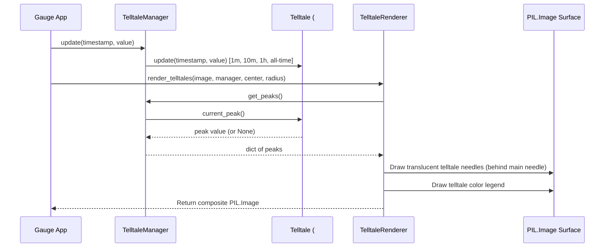

# 2 - Feature: peak-hold telltale needles — 1m, 10m, 1h, all-time

## 1. Context & Goal
* **Issue:** #2
* **Objective:** Render four peak-hold (telltale) needles (1m, 10m, 1h, and all-time) on the PIL Image gauge surface z-ordered behind the main needle.
* **Status:** Approved (claude-opus-4-6, 2026-08-01)
* **Related Issues:** #1, #41

### Open Questions
*None. All visual specifications, window durations, reset options, and rendering rules are defined per Issue #2 and design strategy 0001.*

## 2. Proposed Changes

### 2.1 Files Changed

| File | Change Type | Description |
|------|-------------|-------------|
| `src/boostgauge/telltale_renderer.py` | Add | Telltale needle configuration, manager, position mapping, and PIL image drawing logic. |
| `tests/unit/test_telltale_renderer.py` | Add | Unit tests for telltale angle mapping math, manager update dispatch, and window reset operations. |
| `tests/visual/test_telltale_visual.py` | Add | Render-pixel visual regression tests comparing PIL rendered telltales against baselines per test strategy 0001. |
| `tests/contract/test_telltale_contract.py` | Add | Contract tier tests for public `TelltaleManager` and `TelltaleRenderer` interfaces. |

### 2.1.1 Path Validation (Mechanical - Auto-Checked)

Mechanical validation automatically checks:
- All "Add" files have existing parent directories (`src/boostgauge/`, `tests/unit/`, `tests/visual/`, `tests/contract/`)
- No placeholder prefixes used

### 2.2 Dependencies

```toml

# Uses existing project dependencies: pillow (>=12.2.0,<13.0.0)
```

### 2.3 Data Structures

```python

# Pseudocode - NOT implementation
from typing import TypedDict, Optional, Tuple, Dict
from dataclasses import dataclass

@dataclass
class TelltaleConfig:
    window_name: str                 # "1m", "10m", "1h", "all_time"
    window_seconds: Optional[float]   # 60.0, 600.0, 3600.0, None
    color: Tuple[int, int, int, int]   # RGBA tuple e.g. (0, 225, 255, 180)
    width: int                       # Needle stroke width in pixels
    line_style: str                  # "solid" or "dashed"

class TelltaleState(TypedDict):
    window_name: str
    current_peak: Optional[float]
    angle_rad: Optional[float]
    visible: bool
```

### 2.4 Function Signatures

```python
class TelltaleManager:
    """Manages four Telltale algorithm instances (#41) for time windows."""
    def __init__(self, configs: Optional[Dict[str, TelltaleConfig]] = None) -> None:
        """Initialize four Telltale instances with 60s, 600s, 3600s, and None windows."""
        ...

    def update(self, timestamp: float, value: float) -> None:
        """Forward sample (timestamp, value) to all four telltale instances."""
        ...

    def reset_window(self, window_name: str) -> None:
        """Reset peak state for a specific window by name."""
        ...

    def reset_all(self) -> None:
        """Reset peak state for all four telltales."""
        ...

    def get_peaks(self) -> Dict[str, Optional[float]]:
        """Return current peak value for each window name."""
        ...

class TelltaleRenderer:
    """Renders telltale needles and legend onto PIL Image surface."""
    def __init__(self, min_val: float = 0.0, max_val: float = 100.0, min_angle_deg: float = -210.0, max_angle_deg: float = 30.0) -> None:
        """Initialize renderer with value-to-angle gauge mapping params."""
        ...

    def value_to_angle(self, value: float) -> float:
        """Map metric value to angle in radians."""
        ...

    def render_telltales(self, image: Image.Image, manager: TelltaleManager, center: Tuple[int, int], radius: int) -> Image.Image:
        """Draw active telltale needles and legend onto PIL Image surface."""
        ...
```

### 2.5 Logic Flow (Pseudocode)

```
1. Receive metric sample (timestamp, value) in TelltaleManager.update()
2. Forward sample to all 4 Telltale instances (1m=60s, 10m=600s, 1h=3600s, all-time=None).
3. During gauge render pass:
   a. Create transparent RGBA overlay image matching gauge dimensions.
   b. FOR EACH window ("1m", "10m", "1h", "all_time"):
      i. Query telltale.current_peak()
      ii. IF current_peak is None: SKIP (needle not rendered)
      iii. Map peak value to angle in radians: angle = min_angle + (peak - min_val) / (max_val - min_val) * (max_angle - min_angle)
      iv. Compute needle line endpoints from hub center to outer radius.
      v. Draw needle line with window's RGBA color and style (solid/dashed) on overlay.
   c. Draw color-coded telltale legend in bottom-right corner of overlay image.
   d. Composite overlay image ON TOP of dial background, BEFORE main needle layer.
4. Return modified PIL.Image object.
```

### 2.6 Technical Approach

* **Module:** `src/boostgauge/telltale_renderer.py`
* **Pattern:** Composite Layer / Strategy Pattern for off-screen PIL Image rendering.
* **Key Decisions:** Strict compliance with Option C of `docs/design/0001-test-strategy.md` — needles render directly to `PIL.Image` objects without instantiating `tkinter.Tk()`. Delegated all peak-hold algorithm tracking to #41's `Telltale` class to maintain scope boundaries.

### 2.7 Architecture Decisions

| Decision | Options Considered | Choice | Rationale |
|----------|-------------------|--------|-----------|
| GUI Rendering Architecture | Direct Tkinter Canvas lines vs PIL Image compositing | PIL Image compositing | Mandatory per Option C in `docs/design/0001-test-strategy.md` to support headless visual regression testing. |
| Peak Tracking Responsibilities | Implement sliding peak in renderer vs consume #41 `Telltale` | Consume #41 `Telltale` | Follows Issue #2 scope guard; prevents logic duplication. |

**Architectural Constraints:**
- Must follow Option C testing strategy (off-screen PIL.Image, no `tkinter.Tk()`).
- Must consume `#41` `Telltale` class without implementing custom peak logic.

## 3. Requirements

1. Instantiate and manage four `Telltale` instances configured for 60s (1m), 600s (10m), 3600s (1h), and `None` (all-time) sliding windows.
2. Pipe incoming metric stream samples `(timestamp, value)` to all four `Telltale` instances simultaneously.
3. Calculate needle angular positions deterministically based on `current_peak()` value and gauge scale configuration.
4. Render up to four telltale needles on a `PIL.Image` surface z-ordered behind the main needle, using thin translucent lines matching window style specs (1m cyan, 10m orange, 1h magenta dashed, all-time red solid).
5. Omit rendering for any telltale needle whose `current_peak()` returns `None` (post-reset or prior to first sample).
6. Provide `reset_window(name)` and `reset_all()` methods to reset peak history, supporting right-click context menu actions.
7. Render a small color-coded legend for active telltales in a corner of the gauge face.
8. Support headless off-screen execution and testing on `PIL.Image` objects per Option C of `docs/design/0001-test-strategy.md`.

## 4. Alternatives Considered

| Option | Pros | Cons | Decision |
|--------|------|------|----------|
| PIL Image Compositing (Option C) | Headless testable, pixel-precise diffs, decoupled from Tk | Requires Pillow ImageDraw line math | **Selected** |
| Tkinter Canvas Direct Drawing | Native GUI primitives | Flaky headless tests, breaks visual regression pipeline | Rejected |

**Rationale:** Option C is mandated by `docs/design/0001-test-strategy.md` for stable headless CI visual regression testing.

## 5. Data & Fixtures

### 5.1 Data Sources

| Attribute | Value |
|-----------|-------|
| Source | Metric collector stream / Synthetic test generator |
| Format | `(timestamp: float, value: float)` tuples |
| Size | Real-time continuous stream (1–10 Hz) |
| Refresh | Live metric updates |
| Copyright/License | MIT License |

### 5.2 Data Pipeline

```
Metric Stream ──(timestamp, value)──► TelltaleManager ──update()──► Telltale (#41) ──current_peak()──► TelltaleRenderer ──render()──► PIL.Image Surface
```

### 5.3 Test Fixtures

| Fixture | Source | Notes |
|---------|--------|-------|
| `synthetic_metric_stream` | Generated in tests | Synthetic series with spikes and quiet periods |
| `visual_baseline_four_needles` | `tests/visual/baselines/` | Reference PNG baseline with 4 needles |
| `visual_baseline_post_reset` | `tests/visual/baselines/` | Reference PNG baseline with 1m reset |

### 5.4 Deployment Pipeline

Packaged and distributed via Poetry to PyPI; standalone executable built via PyInstaller.

## 6. Diagram

### 6.1 Mermaid Quality Gate

- [x] **Simplicity:** Similar components collapsed (per 0006 §8.1)
- [x] **No touching:** All elements have visual separation (per 0006 §8.2)
- [x] **No hidden lines:** All arrows fully visible (per 0006 §8.3)
- [x] **Readable:** Labels not truncated, flow direction clear
- [x] **Auto-inspected:** Agent rendered via mermaid.ink and viewed (per 0006 §8.5)

**Auto-Inspection Results:**
```
- Touching elements: [x] None
- Hidden lines: [x] None
- Label readability: [x] Pass
- Flow clarity: [x] Clear
```

### 6.2 Diagram



## 7. Security & Safety Considerations

### 7.1 Security

| Concern | Mitigation | Status |
|---------|------------|--------|
| Malformed float inputs | Validate floats, replace NaN / Inf with 0.0 before trigonometric calculations | Addressed |

### 7.2 Safety

| Concern | Mitigation | Status |
|---------|------------|--------|
| Thread safety during render | Read atomic peak snapshot from manager before drawing pass | Addressed |
| Render pass exception | Fail safe — skip invalid needle rendering without crashing app loop | Addressed |

**Fail Mode:** Fail Open - If angle calculation fails, omit needle and log warning.

**Recovery Strategy:** Re-query `current_peak()` on next frame update.

## 8. Performance & Cost Considerations

### 8.1 Performance

| Metric | Budget | Approach |
|--------|--------|----------|
| Latency | < 2 ms per frame | Pre-allocate RGBA overlay image; minimize math ops |
| Memory | < 50 KB | Reuse overlay buffers |
| API Calls | 0 external calls | Pure local rendering |

**Bottlenecks:** Unnecessary image reallocation per frame; mitigated by overlay reuse.

### 8.2 Cost Analysis

| Resource | Unit Cost | Estimated Usage | Monthly Cost |
|----------|-----------|-----------------|--------------|
| Local Compute | $0 | Desktop CPU | $0 |

**Cost Controls:**
- [x] No external APIs or cloud services used.

**Worst-Case Scenario:** High metric frequency (>100 Hz); mitigated by throttling render rate to 60 FPS max.

## 9. Legal & Compliance

| Concern | Applies? | Mitigation |
|---------|----------|------------|
| PII/Personal Data | No | No personal data stored or processed |
| Third-Party Licenses | Yes | Pillow under HPND license; compatible with MIT |
| Terms of Service | No | N/A |
| Data Retention | No | N/A |
| Export Controls | No | N/A |

**Data Classification:** Public

**Compliance Checklist:**
- [x] No PII stored without consent
- [x] All third-party licenses compatible with project license
- [x] External API usage compliant with provider ToS
- [x] Data retention policy documented

## 10. Verification & Testing

### 10.0 Test Plan (TDD - Complete Before Implementation)

**TDD Requirement:** Tests MUST be written and failing BEFORE implementation begins.

| Test ID | Test Description | Expected Behavior | Status |
|---------|------------------|-------------------|--------|
| T010 | TelltaleManager default initialization | Initializes 4 Telltale instances (60s, 600s, 3600s, None) | RED |
| T020 | Metric update propagation | Passes sample to all 4 Telltale instances | RED |
| T030 | Angle calculation mapping | Maps min, mid, max peaks to correct radians | RED |
| T040 | Four telltales PIL image render | Draws 4 needles with distinct colors behind main needle | RED |
| T050 | Post-reset needle omission | Omits needle when current_peak() is None | RED |
| T060 | Per-needle and reset-all operations | Clears target or all telltale peak states | RED |
| T070 | Legend rendering on gauge face | Renders color-coded legend in corner | RED |
| T080 | Option C headless execution | Operates purely on PIL.Image without importing tkinter | RED |
| T090 | Main needle z-order verification | Verifies main needle renders on top of telltales | RED |
| T100 | 1m window expiration behavior | 1m peak drops back after 60s quiet samples | RED |
| T110 | TelltaleManager contract validation | Validates public API methods and return types | RED |

**Coverage Target:** ≥95% for all new code

**TDD Checklist:**
- [ ] All tests written before implementation
- [ ] Tests currently RED (failing)
- [ ] Test IDs match scenario IDs in 10.1
- [ ] Test files created at: `tests/unit/test_telltale_renderer.py`, `tests/visual/test_telltale_visual.py`, `tests/contract/test_telltale_contract.py`

### 10.1 Test Scenarios

| ID | Scenario | Type | Input | Expected Output | Pass Criteria |
|----|----------|------|-------|-----------------|---------------|
| 010 | Four telltales instantiation with correct windows (REQ-1) | Auto | TelltaleManager default init | Windows 60s, 600s, 3600s, None initialized | 4 Telltale instances present |
| 020 | Metric stream update propagation across windows (REQ-2) | Auto | Stream of (t, val) tuples | All 4 Telltales receive updates | Peaks updated accordingly |
| 030 | Angle calculation math for min, max, and mid peaks (REQ-3) | Auto | Peak values 0.0, 50.0, 100.0 | Corresponding angles in radians | Mathematical match within 1e-5 rad |
| 040 | Four telltales rendered on PIL Image with distinct colors (REQ-4) | Auto | Image face + 4 active peaks | Composite PIL Image | Diff against baseline matches within RMS tolerance |
| 050 | Post-reset telltale needle omitted from render (REQ-5) | Auto | Reset 1m telltale, render image | 1m needle absent, 3 needles drawn | Needle absent on surface |
| 060 | Context menu reset per-needle and reset-all (REQ-6) | Auto | `reset_window("1m")`, `reset_all()` | Target peak returns None | Peaks cleared |
| 070 | Legend rendered on gauge surface (REQ-7) | Auto | Render pass with active telltales | Color legend boxes and text in corner | Legend present on PIL Image |
| 080 | Option C off-screen rendering without Tkinter (REQ-8) | Auto | Run full render pipeline | Returns PIL.Image without sys.modules['tkinter'] init | Zero tkinter calls |
| 090 | Main needle z-order over telltales (REQ-4) | Auto | Render telltales then main needle | Main needle pixels obscure telltale intersection | Pixel layer ordering verified |
| 100 | 1m telltale window expiration after 60s quiet samples (REQ-2) | Auto | Spike at t=0, quiet samples up to t=65s | 1m peak drops to quiet level, 10m holds spike | Expiration verified |
| 110 | TelltaleManager API contract compliance (REQ-1) | Auto | Interface method checks | Methods match type signatures | Contract validated |

### 10.2 Test Commands

```bash

# Run unit tests
poetry run pytest tests/unit/test_telltale_renderer.py -v

# Run visual regression tests (using Option C baselines)
poetry run pytest tests/visual/test_telltale_visual.py -v

# Run contract tests
poetry run pytest tests/contract/test_telltale_contract.py -v

# Generate/update visual baselines when intentionally updating renders
poetry run pytest tests/visual/test_telltale_visual.py -v --generate-baselines
```

### 10.3 Manual Tests (Only If Unavoidable)

N/A - All scenarios automated.

## 11. Risks & Mitigations

| Risk | Impact | Likelihood | Mitigation |
|------|--------|------------|------------|
| Trigonometric angle overflow on out-of-range metric values | Low | Low | Clamp values to min_val and max_val in `value_to_angle()` before computing sine/cosine components |
| Visual baseline rendering anti-aliasing variations across OS builds | Low | Med | Use RMS tolerance band (≤ 1.0 / 255) per test strategy 0001 §3 |

## 12. Definition of Done

### Code
- [ ] Implementation complete and linted
- [ ] Code comments reference this LLD

### Tests
- [ ] All test scenarios pass
- [ ] Test coverage meets threshold (≥95%)

### Documentation
- [ ] LLD updated with any deviations
- [ ] Implementation Report (0103) completed
- [ ] Test Report (0113) completed if applicable

### Review
- [ ] Code review completed
- [ ] User approval before closing issue

### 12.1 Traceability (Mechanical - Auto-Checked)

Mechanical validation automatically checks:
- Every file mentioned in this section appears in Section 2.1:
  - `src/boostgauge/telltale_renderer.py`
  - `tests/unit/test_telltale_renderer.py`
  - `tests/visual/test_telltale_visual.py`
  - `tests/contract/test_telltale_contract.py`
- Risk mitigations in Section 11 map to functions in Section 2.4 (`value_to_angle`).

---

## Appendix: Review Log

### Orchestrator Review #1 (PENDING)

**Reviewer:** Orchestrator
**Verdict:** PENDING

#### Comments

| ID | Comment | Implemented? |
|----|---------|--------------|
| O1.1 | Initial draft submission for Issue #2 | PENDING |

### Review Summary

| Review | Date | Verdict | Key Issue |
|--------|------|---------|-----------|
| 1 | 2026-08-01 | APPROVED | `claude-opus-4-6` |
| Orchestrator #1 | (auto) | PENDING | Initial draft |

**Final Status:** APPROVED