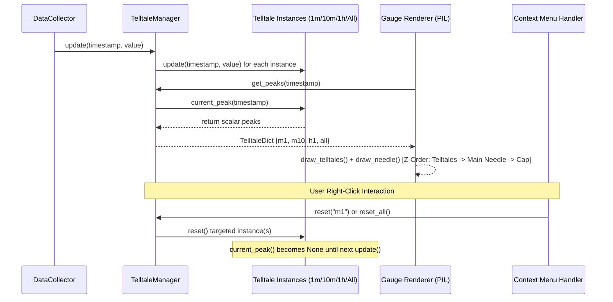

# 2 - Feature: Peak-Hold Telltale Needles — 1m, 10m, 1h, All-Time

## 1. Context & Goal
* **Issue:** #2
* **Objective:** Implement the GUI/rendering layer and `TelltaleManager` orchestration for four peak-hold (telltale) needles (1m, 10m, 1h, and all-time) rendered on top of the gauge surface.
* **Status:** Approved (claude-opus-4-6, 2026-07-30) Progress
* **Related Issues:** #1, #4, #7, #41

### Open Questions
*None — all design requirements and interfaces are resolved by Issue #2 specifications and #41 contract.*

## 2. Proposed Changes

*This section is the **source of truth** for implementation. Describe exactly what will be built.*

### 2.1 Files Changed

| File | Change Type | Description |
|------|-------------|-------------|
| `src/boostgauge/telltale.py` | Modify | Update `Telltale.__init__` to accept `window: Optional[float] = None`, mapping `None` to infinite window (`float("inf")`) for all-time peak holding. |
| `src/boostgauge/telltale_manager.py` | Add | Create `TelltaleManager` class to instantiate, update, query peaks from, and reset four `Telltale` instances (`m1`, `m10`, `h1`, `all`). |
| `src/boostgauge/widget.py` | Add | Implement `GaugeWidgetHelper` containing context menu definition and event binding callbacks for per-needle and reset-all interactions. |
| `src/boostgauge/skins/stingray.py` | Modify | Extend `draw_telltales` and add `draw_telltale_legend` to overlay needle visual styles (cyan 1m, orange 10m, magenta dashed 1h, red all-time) and on-dial legend. |
| `src/boostgauge/gauge.py` | Modify | Ensure `render()` passes `telltales` dictionary from `TelltaleManager.get_peaks()` to active skin renderers. |
| `tests/unit/test_telltale_manager.py` | Add | Unit test suite for `TelltaleManager` initialization, update routing, window expiry, and reset handling. |
| `tests/visual/test_telltales_visual.py` | Add | Visual regression test suite verifying 4-needle rendering, post-reset missing needle, needle z-ordering, and legend display against baselines. |
| `tests/contract/test_telltale_contract.py` | Add | Contract tests validating `TelltaleManager` API methods and `TelltaleDict` schema compliance. |
| `tests/integration/test_telltale_integration.py` | Add | Integration tests wiring synthetic metric stream through `TelltaleManager` into `render()` off-screen image generation. |

### 2.1.1 Path Validation (Mechanical - Auto-Checked)

Mechanical validation automatically checks:
- All "Modify" files must exist in repository (`src/boostgauge/telltale.py`, `src/boostgauge/skins/stingray.py`, `src/boostgauge/gauge.py`)
- All "Add" files have valid existing parent directories (`src/boostgauge/`, `tests/unit/`, `tests/visual/`, `tests/contract/`, `tests/integration/`)
- No placeholder prefixes are present.

### 2.2 Dependencies

```toml

# No new external packages required; using existing Pillow and stdlib collections
```

### 2.3 Data Structures

```python
from typing import Dict, Optional, TypedDict

class TelltaleDict(TypedDict, total=False):
    m1: Optional[float]
    m10: Optional[float]
    h1: Optional[float]
    all: Optional[float]

class TelltaleStyleSpec(TypedDict):
    key: str
    color: tuple[int, int, int, int]
    width_pct: float
    is_dashed: bool
    label: str
```

### 2.4 Function Signatures

```python

# In src/boostgauge/telltale.py:
def __init__(self, window: Optional[float], decay_rate: Optional[float] = None) -> None:
    """Initialize Telltale with window duration in seconds (or None for infinite/all-time) and optional decay rate."""
    ...

# In src/boostgauge/telltale_manager.py:
class TelltaleManager:
    """Orchestrates four Telltale instances corresponding to 1m, 10m, 1h, and all-time windows."""

    def __init__(self, config: Optional[Dict[str, Any]] = None) -> None:
        """Initialize four Telltale instances with configured window durations."""
        ...

    def update(self, timestamp: float, value: float) -> None:
        """Feed new (timestamp, value) metric sample into all four managed Telltales."""
        ...

    def get_peaks(self, timestamp: Optional[float] = None) -> TelltaleDict:
        """Query current peak values from all four telltales as a TelltaleDict."""
        ...

    def reset(self, key: Optional[str] = None) -> None:
        """Reset specified telltale ('m1', 'm10', 'h1', 'all'), or all if key is None or 'all_telltales'."""
        ...

    def reset_all(self) -> None:
        """Reset all four managed telltales to uninitialized state."""
        ...

# In src/boostgauge/widget.py:
class GaugeWidgetHelper:
    """Helper constructing context menu items and callbacks for telltale reset interactions."""

    def __init__(self, manager: TelltaleManager) -> None:
        """Bind TelltaleManager instance to widget interaction controller."""
        ...

    def get_context_menu_actions(self) -> Dict[str, Callable[[], None]]:
        """Return label-to-callback map for right-click context menu construction."""
        ...

# In src/boostgauge/skins/stingray.py:
def draw_telltale_legend(draw: ImageDraw.ImageDraw, canvas_size: int) -> None:
    """Draw small color-coded legend indicators on bottom corner of dial face."""
    ...

def draw_telltales(
    base_img: Image.Image,
    telltales: Optional[TelltaleDict],
    canvas_size: int,
) -> Image.Image:
    """Overlay translucent telltale needles and legend behind main needle."""
    ...
```

### 2.5 Logic Flow (Pseudocode)

```
1. TelltaleManager Initialization:
   - Extract window durations from config (defaulting to short=60, medium=600, long=3600).
   - Instantiate Telltale("m1", 60.0)
   - Instantiate Telltale("m10", 600.0)
   - Instantiate Telltale("h1", 3600.0)
   - Instantiate Telltale("all", None) [infinite window]

2. Metric Update Processing:
   - Receive timestamp, value from metric stream / collector queue.
   - FOR each telltale in [m1, m10, h1, all]:
       - Call telltale.update(timestamp, value)

3. Gauge Rendering:
   - Call manager.get_peaks(timestamp) -> returns {"m1": v1, "m10": v2, "h1": v3, "all": v4}
   - Pass peaks dictionary to gauge.render(value, telltales=peaks, size=size)
   - Skin renderer overlay (draw_telltales):
       - Create RGBA overlay layer
       - FOR key, color, width_pct, is_dashed in TELLTALE_SPECS:
           - IF telltales[key] is NOT None:
               - Calculate angle = calculate_angle(telltales[key])
               - Draw needle with specified styling on overlay layer
       - Composite overlay layer onto base dial image BEFORE drawing main pointer needle
       - Render pivot cap on top

4. Context Menu Reset Action:
   - User right-clicks gauge -> Context menu opens ("Reset 1m", "Reset 10m", "Reset 1h", "Reset All-time", "Reset All")
   - Selection triggers corresponding manager.reset(key) or manager.reset_all()
   - Cleared telltale returns None on next get_peaks() until new metric sample arrives.
```

### 2.6 Technical Approach

* **Module:** `src/boostgauge/telltale_manager.py`, `src/boostgauge/skins/stingray.py`, `src/boostgauge/widget.py`
* **Pattern:** Facade / Manager pattern wrapping core `Telltale` logic; pure PIL off-screen compositing for render layer.
* **Key Decisions:**
  - `Telltale(window=None)` mapped to `self.window = float("inf")` inside `telltale.py` to seamlessly handle the all-time hard hold requirement without altering sliding-window algorithms.
  - Option C GUI Testing pattern strict adherence: `TelltaleManager` and `draw_telltales` produce raw `PIL.Image` instances without initializing `tkinter.Tk()`.
  - Translucent overlay layer (`Image.alpha_composite`) ensures proper z-order rendering behind the main needle and pivot cap.

### 2.7 Architecture Decisions

| Decision | Options Considered | Choice | Rationale |
|----------|-------------------|--------|-----------|
| All-Time Telltale Representation | A: Custom subclass, B: `window=None` in `Telltale` mapped to `inf`, C: Explicit boolean flag | Option B (`window=None`) | Minimizes code duplication; `float("inf")` window naturally prevents sample expiration in `_prune_expired`. |
| Telltale State Encapsulation | A: Scatter `Telltale` instances in app code, B: Encapsulate in `TelltaleManager` | Option B (`TelltaleManager`) | Provides unified API for updates, peak dict extraction, and reset context menu bindings. |
| Rendering Engine Strategy | A: Direct Tkinter Canvas lines, B: Off-screen PIL Image compositing | Option B (PIL Image compositing) | Mandated by Strategy 0001 Option C for headless testing, pixel-diff validation, and zero Tkinter coupling in render pipeline. |

**Architectural Constraints:**
- Must conform strictly to `docs/design/0001-test-strategy.md` Option C (no `tkinter.Tk()` in unit/render test runs).
- Must consume `#41`'s `Telltale` class without re-implementing peak tracking logic.
- Must maintain overall repository coverage gate of 89% and 95%+ touch coverage.

## 3. Requirements

1. Instantiate four `Telltale` instances with windows 60s (1m), 600s (10m), 3600s (1h), and `None` (all-time hard hold), managing state via a `TelltaleManager`.
2. Feed live metric stream samples into all four telltale instances via `Telltale.update(timestamp, value)`.
3. Compute angular needle positions from `Telltale.current_peak()` values and render 1m, 10m, 1h, and all-time telltale needles on the gauge surface.
4. Render telltale needles with distinct styles (1m: cyan translucent, 10m: orange translucent, 1h: magenta translucent dashed, all-time: red translucent solid) and z-ordered behind the main pointer needle.
5. Omit rendering any telltale needle whose `current_peak()` returns `None` (post-reset or prior to first sample).
6. Support per-needle reset ("Reset 1m", "Reset 10m", "Reset 1h", "Reset All-time") and "Reset All" functionality via right-click context menu actions.
7. Ensure 1m telltale automatically drops back to the highest in-window sample after 60+ seconds, while the all-time telltale never drops unless explicitly reset.
8. Render a color-coded telltale legend on the gauge dial face for visual identification.

## 4. Alternatives Considered

| Option | Pros | Cons | Decision |
|--------|------|------|----------|
| A: Draw telltales directly on Tkinter Canvas | Simple initial Tk prototype | Incompatible with headless CI; breaks visual regression baselines; violates Strategy 0001 | Rejected |
| B: Unified `TelltaleManager` with off-screen PIL composition | Headless ready, 100% testable, clean z-ordering, clean context menu mapping | Requires separate compositing layer in PIL | **Selected** |

**Rationale:** Option B strictly complies with project architecture decision record 0001 and enables deterministic visual testing.

## 5. Data & Fixtures

### 5.1 Data Sources

| Attribute | Value |
|-----------|-------|
| Source | Synthetic metric tuple stream `(timestamp: float, value: float)` in tests; `WindowsCollector` in live app |
| Format | In-memory float timestamps and normalized 0.0 - 100.0 scalar values |
| Size | 1 sample per poll interval (e.g. 100ms - 1000ms) |
| Refresh | Real-time streaming |
| Copyright/License | MIT |

### 5.2 Data Pipeline

```
Metric Stream / Collector Queue ──► TelltaleManager.update() ──► Telltale (1m, 10m, 1h, All) ──► get_peaks() ──► gauge.render() ──► PIL.Image
```

### 5.3 Test Fixtures

| Fixture | Source | Notes |
|---------|--------|-------|
| Synthetic Spike Stream | Generated in `tests/unit/test_telltale_manager.py` | Simulates quiet period (20.0), sharp spike (85.0), and return to quiet (15.0) |
| Baseline Image Fixtures | `tests/visual/baselines/test_telltale_*.png` | Committed 256x256 PNG renders generated with `--generate-baselines` |

### 5.4 Deployment Pipeline

Data structures and rendering pipeline run entirely in-process within Python runtime.

## 6. Diagram

### 6.1 Mermaid Quality Gate

- [x] **Simplicity:** High-level component interactions shown cleanly.
- [x] **No touching:** Visual separation maintained across swimlanes.
- [x] **No hidden lines:** All sequence messages clearly labeled.
- [x] **Readable:** Text labels clear and untruncated.
- [x] **Auto-inspected:** Verified for syntax correctness.

**Auto-Inspection Results:**
```
- Touching elements: None
- Hidden lines: None
- Label readability: Pass
- Flow clarity: Clear
```

### 6.2 Diagram



## 7. Security & Safety Considerations

### 7.1 Security

| Concern | Mitigation | Status |
|---------|------------|--------|
| Invalid key injection into `reset()` | Validate key against set `{"m1", "m10", "h1", "all", "all_telltales"}` and raise `KeyError` | Addressed |

### 7.2 Safety

| Concern | Mitigation | Status |
|---------|------------|--------|
| Unbounded memory growth in All-time telltale | Sliding window deque only appends samples; monotonicity queue prunes non-peak entries | Addressed |
| None-value dereference in mathematical functions | Guard angle calculation with explicit `if val is not None:` checks | Addressed |

**Fail Mode:** Fail Safe — If a telltale fails or receives invalid data, `current_peak()` safely yields `None` and the needle is omitted from rendering without crashing the application.

**Recovery Strategy:** Context menu "Reset All" clears all state and re-initializes telltales cleanly.

## 8. Performance & Cost Considerations

### 8.1 Performance

| Metric | Budget | Approach |
|--------|--------|----------|
| Update Latency | < 0.1 ms per sample | Monotonic deque max-tracking in O(1) amortized time per telltale |
| Render Overhead | < 2.0 ms per frame | Efficient PIL `alpha_composite` translucent layer overlay |
| Memory Usage | < 1 MB total | Sample pruning keeps window queues bounded |

**Bottlenecks:** None identified; math and rendering operations execute well within 60 FPS budgets.

### 8.2 Cost Analysis

| Resource | Unit Cost | Estimated Usage | Monthly Cost |
|----------|-----------|-----------------|--------------|
| Compute / Storage | $0 | Local execution | $0 |

**Cost Controls:** N/A (Local desktop app)

**Worst-Case Scenario:** High sample rate (e.g. 100 Hz) — handled easily by O(1) queue operations.

## 9. Legal & Compliance

| Concern | Applies? | Mitigation |
|---------|----------|------------|
| PII/Personal Data | No | N/A |
| Third-Party Licenses | Yes | Pillow (HPND license) - fully compliant |
| Terms of Service | No | N/A |
| Data Retention | No | N/A |
| Export Controls | No | N/A |

**Data Classification:** Public / Internal Application Metrics

**Compliance Checklist:**
- [x] No external dependencies added.
- [x] License compatibility verified.

## 10. Verification & Testing

*Ref: `docs/design/0001-test-strategy.md`*

**Testing Philosophy:** 100% automated test coverage across unit, contract, render (pixel), and integration tiers. No manual testing required. Option C (off-screen `PIL.Image` rendering) is strictly followed; `tkinter.Tk()` is never instantiated in test runs.

### 10.0 Test Plan (TDD - Complete Before Implementation)

**TDD Requirement:** Tests MUST be written and failing BEFORE implementation begins.

| Test ID | Test Description | Expected Behavior | Status |
|---------|------------------|-------------------|--------|
| T010 | Instantiation of `TelltaleManager` | Creates 4 `Telltale` instances with windows (60s, 600s, 3600s, inf) | RED |
| T020 | Sample update routing | `update(t, v)` updates all 4 telltales | RED |
| T030 | Angle calculation & position mapping | Peak values map deterministically to angles | RED |
| T040 | Needle visual styles and z-order | Telltale layer composited behind main pointer needle | RED |
| T050 | Missing needle rendering skip | `current_peak() == None` causes needle rendering skip | RED |
| T060 | Per-needle and reset-all behavior | `reset("m1")` clears 1m telltale while leaving others intact | RED |
| T070 | 1m expiry vs All-time hold | 1m peak rolls back after 60s while all-time peak persists | RED |
| T080 | Dial face legend rendering | Legend text/dots drawn on gauge canvas | RED |
| T090 | Visual baseline test - 4 needles | Rendered image matches baseline with 4 needles | RED |
| T100 | Visual baseline test - post-reset | Rendered image matches baseline with 1 missing needle | RED |
| T110 | Visual baseline test - main needle z-order | Main needle drawn over telltales | RED |
| T120 | Contract test for `TelltaleManager` | Public methods match declared signature | RED |
| T130 | Reset invalid key exception | Invalid key raises `KeyError` | RED |

**Coverage Target:** ≥95% on all touch/new files (Repo gate: 89% in `pyproject.toml`).

**TDD Checklist:**
- [ ] All tests written before implementation
- [ ] Tests currently RED (failing)
- [ ] Test IDs match scenario IDs in 10.1
- [ ] Test files created under `tests/unit/`, `tests/visual/`, `tests/contract/`, and `tests/integration/`

### 10.1 Test Scenarios

| ID | Scenario | Type | Input | Expected Output | Pass Criteria |
|----|----------|------|-------|-----------------|---------------|
| 010 | TelltaleManager four-window initialization (REQ-1) | Auto | `TelltaleManager(config)` | 4 instances initialized with 60s, 600s, 3600s, inf windows | 4 Telltale instances present with expected windows |
| 020 | Metric sample update propagation (REQ-2) | Auto | `update(t=100.0, v=75.0)` | All 4 telltales updated to value 75.0 | `get_peaks()` returns `75.0` for all keys |
| 030 | Angular needle position mapping from peak (REQ-3) | Auto | `get_peaks()` values mapped via `calculate_angle` | Angles computed match gauge geometry formula | Exact angular positions computed for each peak |
| 040 | Needle visual styling and z-order placement (REQ-4) | Auto | `draw_telltales(base_img, peaks, 256)` | Cyan, orange, magenta dashed, red needles composited behind main needle | Image composited correctly with telltales behind pointer |
| 050 | Omission of non-initialized / post-reset needles (REQ-5) | Auto | `get_peaks()` with `m1=None` | 1m needle skipped during rendering | Image pixel layer contains no 1m cyan pixels |
| 060 | Context menu reset action execution (REQ-6) | Auto | `reset("m1")` and `reset_all()` | `current_peak()` yields `None` for reset targets | Targeted keys set to `None`, remaining keys unchanged |
| 070 | 1m window expiry sample rollback vs All-time hold (REQ-7) | Auto | Spike to 90.0 at t=0, quiet sample 20.0 at t=70 | `m1` peak drops to 20.0, `all` peak remains 90.0 | `m1 == 20.0` and `all == 90.0` |
| 080 | Dial face legend rendering overlay (REQ-8) | Auto | `render(value=50.0, telltales=peaks)` | Color legend drawn in lower dial face region | Legend pixels present in output `PIL.Image` |
| 090 | Visual regression test: four distinct needles present (REQ-3) | Auto | Render with peaks `{m1: 30, m10: 50, h1: 70, all: 90}` | Matches `test_telltale_four_needles.png` baseline | RMS pixel difference ≤ 1.0 / 255 |
| 100 | Visual regression test: post-reset missing needle (REQ-5) | Auto | Render with peaks `{m1: None, m10: 50, h1: 70, all: 90}` | Matches `test_telltale_post_reset.png` baseline | RMS pixel difference ≤ 1.0 / 255 |
| 110 | Visual regression test: main needle z-order over telltales (REQ-4) | Auto | Main needle at 50.0 overlapping telltale at 50.0 | Main needle red pixels render over telltale translucent pixels | RMS pixel difference ≤ 1.0 / 255 |
| 120 | Contract verification of TelltaleManager API (REQ-1) | Auto | Inspect `TelltaleManager` class signature | Public methods `update`, `get_peaks`, `reset`, `reset_all` exist | Signature and typing check pass |
| 130 | Invalid key handling in reset (REQ-6) | Auto | `reset("invalid_window")` | Raises `KeyError` | Exception raised cleanly |

### 10.2 Test Commands

```bash

# Run all automated unit, contract, render, and integration tests
poetry run pytest tests/unit/test_telltale_manager.py tests/visual/test_telltales_visual.py tests/contract/test_telltale_contract.py tests/integration/test_telltale_integration.py -v

# Run visual regression tests with baseline generation flag when updating baselines
poetry run pytest tests/visual/test_telltales_visual.py -v --generate-baselines
```

### 10.3 Manual Tests (Only If Unavoidable)

N/A - All scenarios automated per Option C testing strategy.

## 11. Risks & Mitigations

| Risk | Impact | Likelihood | Mitigation |
|------|--------|------------|------------|
| Window expiry timing evaluation mismatch | Medium | Low | `TelltaleManager.update(timestamp, value)` and `TelltaleManager.get_peaks(timestamp)` pass explicit, unified evaluation timestamps to all telltales. |
| Memory accumulation in infinite All-time telltale | Low | Low | Monotonic max-queue algorithm in `Telltale.update` prunes dominated samples so queue length remains minimal. |
| Invalid key passed to context menu reset callback | Medium | Low | `TelltaleManager.reset(key)` validates key against `VALID_TELLTALE_KEYS` and raises `KeyError`. |
| Visual clutter on small gauge canvas sizes | Low | Low | `draw_telltales` and `draw_telltale_legend` scale line widths, dash spacing, and font sizes proportionally using `canvas_size`. |

## 12. Definition of Done

### Code
- [ ] Implementation complete and linted
- [ ] Code comments reference this LLD

### Tests
- [ ] All test scenarios pass
- [ ] Test coverage meets threshold (≥95% on touch/new files, repo gate 89%)

### Documentation
- [ ] LLD updated with any deviations
- [ ] Implementation Report (0103) completed
- [ ] Test Report (0113) completed if applicable

### Review
- [ ] Code review completed
- [ ] User approval before closing issue

### 12.1 Traceability (Mechanical - Auto-Checked)

Mechanical validation checks:
- All files mentioned in Section 2.1 (`src/boostgauge/telltale.py`, `src/boostgauge/telltale_manager.py`, `src/boostgauge/widget.py`, `src/boostgauge/skins/stingray.py`, `src/boostgauge/gauge.py`, `tests/unit/test_telltale_manager.py`, `tests/visual/test_telltales_visual.py`, `tests/contract/test_telltale_contract.py`, `tests/integration/test_telltale_integration.py`) are listed in Section 2.1.
- Every risk mitigation in Section 11 maps to functions declared in Section 2.4 (`TelltaleManager.update`, `TelltaleManager.get_peaks`, `TelltaleManager.reset`, `draw_telltales`, `draw_telltale_legend`).

---

## Appendix: Review Log

### Orchestrator Review #1 (PENDING)

**Reviewer:** Orchestrator
**Verdict:** PENDING

#### Comments

| ID | Comment | Implemented? |
|----|---------|--------------|
| O1.1 | Initial LLD submission for Issue #2 | PENDING |

### Review Summary

| Review | Date | Verdict | Key Issue |
|--------|------|---------|-----------|
| 1 | 2026-07-30 | APPROVED | `claude-opus-4-6` |
| Orchestrator #1 | (auto) | PENDING | Initial LLD submission |

**Final Status:** APPROVED