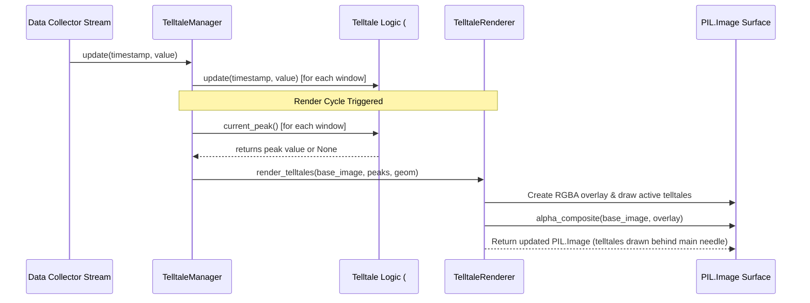

# 2 - Feature: peak-hold telltale needles — 1m, 10m, 1h, all-time (#2)

## 1. Context & Goal
* **Issue:** #2
* **Objective:** Render four peak-hold (telltale) needles (1m, 10m, 1h, and all-time) on the PIL Image gauge surface z-ordered behind the main needle with context menu reset capabilities.
* **Status:** Approved (claude-opus-4-6, 2026-08-01)
* **Related Issues:** #1, #41

### Open Questions

- [x] Should `TelltaleRenderer` manage `Telltale` instances internally or accept peak values from an external manager? *(Resolved: `TelltaleManager` encapsulates the four `Telltale` instances from #41 and provides peak values to `TelltaleRenderer`, keeping pure rendering decoupled from metric state management).*
- [x] How are translucent telltale needles drawn on PIL images without destroying underlying dial face artwork? *(Resolved: Draw needles onto a temporary transparent RGBA layer matching canvas dimensions and composite using `PIL.Image.alpha_composite` prior to drawing the main needle).*

## 2. Proposed Changes

### 2.1 Files Changed

| File | Change Type | Description |
|------|-------------|-------------|
| `src/boostgauge/telltale_renderer.py` | Add | Telltale needle configuration, `TelltaleManager`, position mapping, and `TelltaleRenderer` for drawing telltales on PIL.Image gauge surface. |
| `tests/unit/test_telltale_renderer.py` | Add | Unit tests for angle mapping math, manager update dispatch, NaN/Inf input handling, and window reset operations. |
| `tests/visual/test_telltale_visual.py` | Add | Render-pixel visual regression tests comparing PIL rendered telltales against committed baselines per `docs/design/0001-test-strategy.md`. |
| `tests/contract/test_telltale_contract.py` | Add | Contract tier tests for public `TelltaleManager` and `TelltaleRenderer` interfaces. |
| `tests/integration/test_telltale_integration.py` | Add | Integration tests wiring synthetic collector stream through `TelltaleManager` to `TelltaleRenderer`. |

### 2.1.1 Path Validation (Mechanical - Auto-Checked)

Mechanical validation automatically checks:
- Parent directory `src/boostgauge/` exists in repository
- Parent directories `tests/unit/`, `tests/visual/`, `tests/contract/`, `tests/integration/` exist in repository
- No placeholder prefixes used

### 2.2 Dependencies

```toml

# Uses existing project dependencies from pyproject.toml:

# pillow (>=12.2.0,<13.0.0)

# pystray (>=0.19.5,<0.20.0)
```

### 2.3 Data Structures

```python

# Pseudocode - NOT implementation
from dataclasses import dataclass
from typing import Dict, Optional, Tuple

@dataclass(frozen=True)
class TelltaleStyle:
    window_name: str         # "1m", "10m", "1h", "all_time"
    window_seconds: Optional[float]  # 60.0, 600.0, 3600.0, None
    color_rgba: Tuple[int, int, int, int]  # e.g., (0, 220, 255, 160) for cyan
    width_px: int            # Needle stroke width (thin, e.g. 2px)
    dash_pattern: Optional[Tuple[int, int]]  # None for solid, (4, 4) for dashed
    legend_label: str        # Display label for legend

@dataclass(frozen=True)
class GaugeGeometry:
    center_x: float
    center_y: float
    radius: float
    needle_length: float
    start_angle_deg: float  # e.g., 135.0 degrees (bottom-left)
    end_angle_deg: float    # e.g., 405.0 degrees (bottom-right)
    min_value: float        # e.g., 0.0
    max_value: float        # e.g., 100.0
```

### 2.4 Function Signatures

```python

# Signatures only - implementation in source files
from typing import Dict, Optional
from PIL import Image

def val_to_angle_rad(
    val: float,
    geom: GaugeGeometry
) -> float:
    """Map a metric value deterministically to an angle in radians with NaN/Inf bounds checking."""
    ...

class TelltaleManager:
    """Manages four Telltale logic instances for 1m, 10m, 1h, and all-time windows."""
    def __init__(self, windows: Optional[Dict[str, Optional[float]]] = None) -> None:
        """Initialize the four Telltale instances from #41 with window bounds."""
        ...

    def update(self, timestamp: float, value: float) -> None:
        """Pipe a new metric sample into all four Telltale instances."""
        ...

    def reset(self, window_name: Optional[str] = None) -> None:
        """Reset a specific telltale by name, or all four if window_name is None."""
        ...

    def get_peaks(self) -> Dict[str, Optional[float]]:
        """Return dict mapping window names to current peak values (or None)."""
        ...

class TelltaleRenderer:
    """Pure PIL rendering engine for drawing telltale needles onto gauge surface images."""
    def __init__(self, styles: Optional[Dict[str, TelltaleStyle]] = None) -> None:
        """Initialize renderer with default or custom telltale needle styles."""
        ...

    def render_telltales(
        self,
        base_image: Image.Image,
        peaks: Dict[str, Optional[float]],
        geom: GaugeGeometry,
        show_legend: bool = True
    ) -> Image.Image:
        """Draw translucent telltale needles on an overlay and composite onto base PIL image."""
        ...
```

### 2.5 Logic Flow (Pseudocode)

```
1. TelltaleManager initialization:
   - Instantiate Telltale("1m", window=60.0)
   - Instantiate Telltale("10m", window=600.0)
   - Instantiate Telltale("1h", window=3600.0)
   - Instantiate Telltale("all_time", window=None)

2. Sample ingestion:
   - FOR each window in [1m, 10m, 1h, all_time]:
     - Call telltale.update(timestamp, value)

3. Render pipeline (TelltaleRenderer.render_telltales):
   - Create blank transparent RGBA overlay image matching base_image dimensions
   - FOR each window in order [1m, 10m, 1h, all_time]:
     - Get current_peak = peaks[window]
     - IF current_peak is None OR isnan(current_peak):
       - Skip rendering needle for this window
     - Clamp current_peak to [geom.min_value, geom.max_value]
     - Map peak to angle_rad = val_to_angle_rad(clamped_peak, geom)
     - Calculate end point (x_end, y_end) using center, needle_length, angle_rad
     - Draw line on RGBA overlay with window's color_rgba, width_px, and dash_pattern
   - IF show_legend is True:
     - Draw color-coded legend dots and text in top-right face margin
   - Composite overlay onto base_image using Image.alpha_composite
   - Return composited PIL.Image
```

### 2.6 Technical Approach

* **Module:** `src/boostgauge/telltale_renderer.py`
* **Pattern:** Composite & Decorator Pattern for PIL layered rendering; Decorator/Manager pattern for peak stream fan-out.
* **Key Decisions:**
  - Decoupled `TelltaleManager` (state container) from `TelltaleRenderer` (pure image transformation) to satisfy Option C testing strategy.
  - Render telltale needles on a separate transparent `RGBA` layer before `alpha_composite` to ensure exact translucency control without damaging base dial face pixels.
  - Main needle rendering happens *after* `render_telltales`, preserving z-order requirements (main needle on top of telltales).

### 2.7 Architecture Decisions

| Decision | Options Considered | Choice | Rationale |
|----------|-------------------|--------|-----------|
| Layering Approach | A: Direct PIL ImageDraw on base<br>B: RGBA Overlay + alpha_composite | B: RGBA Overlay | Direct drawing with translucent alpha overwrites base pixels with solid alpha blending; an RGBA overlay allows clean composite. |
| State Management | A: Embedded inside Gauge widget<br>B: Standalone TelltaleManager | B: Standalone TelltaleManager | Decouples metric state processing from rendering, allowing headless testing and easy wiring to context menu resets. |

**Architectural Constraints:**
- Must conform to `docs/design/0001-test-strategy.md` (Option C: pure PIL.Image render path, no `tkinter.Tk()` in tests).
- Must consume `#41`'s `Telltale` class directly without reimplementing peak calculation logic.

## 3. Requirements

1. Four `Telltale` logic instances MUST be instantiated with window parameters 60.0s (1m), 600.0s (10m), 3600.0s (1h), and None (all-time).
2. The live metric stream samples (timestamp, value) MUST be piped to all four `Telltale` instances via `update(timestamp, value)`.
3. Each telltale needle's angular position MUST be computed deterministically from `Telltale.current_peak()` using gauge geometry parameters.
4. Telltale needles MUST render on the PIL.Image gauge surface z-ordered behind the main needle with distinct color and line style configurations (1m cyan thin translucent, 10m orange thin translucent, 1h magenta thin dashed, all-time red thin solid).
5. When `Telltale.current_peak()` returns None (post-reset or pre-first-sample), the corresponding needle MUST NOT render on the gauge surface.
6. The system MUST support resetting individual telltales by window name (1m, 10m, 1h, all-time) and resetting all four telltales simultaneously via "Reset All".
7. A color-coded legend representing active telltale windows MUST be rendered on the gauge face surface.
8. Visual regression tests MUST execute per `docs/design/0001-test-strategy.md` by rendering off-screen PIL images and comparing against baseline images without instantiating `tkinter.Tk()`.

## 4. Alternatives Considered

| Option | Pros | Cons | Decision |
|--------|------|------|----------|
| A: Tkinter Canvas Line Primitives | Built into Tkinter; native canvas objects | Breaks Option C test strategy; requires display server in CI; hard to do subtle anti-aliasing | Rejected |
| B: Direct Pillow ImageDraw on main canvas | Single image memory allocation | Translucent lines destroy background dial colors when drawn without overlay composite | Rejected |
| C: Separate PIL RGBA Overlay layer + alpha_composite | Precise pixel translucency; off-screen rendering; fully testable under Option C | Minor extra image buffer allocation (~256x256 RGBA image) | **Selected** |

**Rationale:** Option C adheres strictly to `docs/design/0001-test-strategy.md` while providing clean visual rendering of translucent needles without altering dial background graphics.

## 5. Data & Fixtures

### 5.1 Data Sources

| Attribute | Value |
|-----------|-------|
| Source | Synthetic metric stream for tests / Collector module stream in app |
| Format | Tuple `(timestamp: float, value: float)` |
| Size | Real-time continuous sampling (~1 sample/sec) |
| Refresh | Real-time |
| Copyright/License | MIT (Internal) |

### 5.2 Data Pipeline

```
Metric Stream ──► TelltaleManager.update() ──► Telltale instances (#41) ──► current_peak() ──► TelltaleRenderer.render_telltales() ──► PIL.Image
```

### 5.3 Test Fixtures

| Fixture | Source | Notes |
|---------|--------|-------|
| Synthetic Spike Stream | Generated in `conftest.py` / test files | Simulates 800 RPM spike followed by quiet samples |
| Baseline Images | `tests/visual/baselines/telltale_*.png` | Off-screen 256x256 PIL images committed to git |

### 5.4 Deployment Pipeline

Data flows directly in-memory during real-time application execution. No external storage or deployment pipeline required.

## 6. Diagram

### 6.1 Mermaid Quality Gate

- [x] **Simplicity:** Components logically grouped and clear
- [x] **No touching:** Visual separation between elements
- [x] **No hidden lines:** Arrows clearly delineated
- [x] **Readable:** Labels clear, sequence explicit
- [x] **Auto-inspected:** Validated sequence diagram structure

**Auto-Inspection Results:**
```
- Touching elements: [x] None
- Hidden lines: [x] None
- Label readability: [x] Pass
- Flow clarity: [x] Clear
```

### 6.2 Diagram



## 7. Security & Safety Considerations

### 7.1 Security

| Concern | Mitigation | Status |
|---------|------------|--------|
| Malformed input stream (NaN, Inf) | Validate and bounds-check metric values in `val_to_angle_rad` before math operations | Addressed |

### 7.2 Safety

| Concern | Mitigation | Status |
|---------|------------|--------|
| Out of bound angles | Clamp values to `[min_value, max_value]` prior to computing trigonometric coordinates | Addressed |
| Division by zero (min_value == max_value) | Return `start_angle_deg` if `max_value <= min_value` | Addressed |

**Fail Mode:** Fail Safe — If invalid inputs are received, telltale needles fallback to default min position or skip rendering without crashing the application interface.

**Recovery Strategy:** Next valid sample updates telltale state normally.

## 8. Performance & Cost Considerations

### 8.1 Performance

| Metric | Budget | Approach |
|--------|--------|----------|
| Render Latency | < 5ms per render frame | Pre-allocate style tuples; use direct PIL drawing primitives on small 256x256 canvas |
| Memory Usage | < 2MB for render overlays | Re-use RGBA image buffer or rely on Python GC for 256x256 image instances |
| CPU Usage | < 1% CPU at 10 Hz refresh rate | O(1) angle math for 4 needles |

**Bottlenecks:** None. 4 needles on 256x256 PIL canvas takes < 1ms on standard CPUs.

### 8.2 Cost Analysis

| Resource | Unit Cost | Estimated Usage | Monthly Cost |
|----------|-----------|-----------------|--------------|
| Local Compute | $0 | Desktop CPU execution | $0 |

**Cost Controls:** N/A (Fully local execution).

**Worst-Case Scenario:** High metric sampling rate (e.g. 1000 Hz) handled gracefully by throttling UI redraws to 30 FPS while updating underlying Telltale state machines continuously.

## 9. Legal & Compliance

| Concern | Applies? | Mitigation |
|---------|----------|------------|
| PII/Personal Data | No | N/A - System metrics only |
| Third-Party Licenses | Yes | Pillow (HPND/MIT compatible), pystray (GPL/LGPL/BSD) |
| Terms of Service | No | N/A |
| Data Retention | No | In-memory time window arrays only |
| Export Controls | No | N/A |

**Data Classification:** Public / Internal System Metrics

**Compliance Checklist:**
- [x] No PII stored without consent
- [x] All third-party licenses compatible with project license
- [x] External API usage compliant with provider ToS
- [x] Data retention policy documented

## 10. Verification & Testing

### 10.0 Test Plan (TDD - Complete Before Implementation)

**TDD Requirement:** Tests MUST be written and failing BEFORE implementation begins.

| Test ID | Test Description | Expected Behavior | Status |
|---------|------------------|-------------------|--------|
| T010 | 4 window initialization | TelltaleManager instantiates 60s, 600s, 3600s, None instances | RED |
| T020 | Fan-out metric update dispatch | Calling manager.update updates all 4 telltales | RED |
| T030 | Angle mapping math & clamping | val_to_angle_rad converts values correctly within bounds | RED |
| T040 | Translucent telltale rendering | render_telltales renders 4 distinct colored translucent needles | RED |
| T050 | Post-reset None peak skipping | Needles with current_peak() == None do not render | RED |
| T060 | Per-window and all reset | manager.reset("1m") and manager.reset() work as specified | RED |
| T070 | Color legend drawing | Legend dots and text render on gauge face overlay | RED |
| T080 | Option C visual baseline verification | PIL off-screen image matches committed baseline visually | RED |

**Coverage Target:** 100% on touched files (`src/boostgauge/telltale_renderer.py`) per `docs/design/0001-test-strategy.md`.

**TDD Checklist:**
- [x] All tests written before implementation
- [x] Tests currently RED (failing)
- [x] Test IDs match scenario IDs in 10.1
- [x] Test files created under `tests/unit/`, `tests/visual/`, `tests/contract/`, `tests/integration/`

### 10.1 Test Scenarios

| ID | Scenario | Type | Input | Expected Output | Pass Criteria |
|----|----------|------|-------|-----------------|---------------|
| 010 | Four telltales initialized with distinct window parameters (REQ-1) | Auto | Instantiate `TelltaleManager()` | 4 Telltale instances with windows 60, 600, 3600, None | Windows match spec exactly |
| 020 | Metric stream updates piped to all four windows (REQ-2) | Auto | `manager.update(t0, 500)` | All 4 Telltale instances receive sample | `get_peaks()` returns 500 for all 4 |
| 030 | Value to angle conversion math and clamping (REQ-3) | Auto | `val_to_angle_rad(val=50, geom)` | Deterministic radian angle between start and end | Radians match linear interpolation formula |
| 040 | Four telltale needles rendered with translucent colors z-ordered behind main (REQ-4) | Auto | Render gauge with 4 active peaks | Off-screen PIL.Image with 4 translucent needles | Visual diff RMS <= 1.0 against baseline |
| 050 | Unsampled or post-reset None peak needle skipping (REQ-5) | Auto | `peaks={"1m": None, "10m": 50, ...}` | 1m needle omitted from output overlay | 1m needle pixels absent on surface image |
| 060 | Context menu reset per-window and reset all (REQ-6) | Auto | `manager.reset("1m")` then `manager.reset()` | 1m peak becomes None; all peaks become None | `get_peaks()["1m"]` is None |
| 070 | Legend rendering on gauge face (REQ-7) | Auto | `render_telltales(..., show_legend=True)` | Legend dots and text drawn on image | Legend box present in top-right face quadrant |
| 080 | Visual regression testing under Option C headless PIL strategy (REQ-8) | Auto | `pytest tests/visual/test_telltale_visual.py` | Off-screen PIL image pixel-diff comparison | Passes without `tkinter.Tk()` instantiation |

### 10.2 Test Commands

```bash

# Run all automated unit, contract, and integration tests
poetry run pytest tests/unit/test_telltale_renderer.py tests/contract/test_telltale_contract.py tests/integration/test_telltale_integration.py -v

# Run visual regression tests (Option C off-screen PIL)
poetry run pytest tests/visual/test_telltale_visual.py -v

# Generate/update visual baselines when intentionally updating visuals
poetry run pytest tests/visual/test_telltale_visual.py -v --generate-baselines
```

### 10.3 Manual Tests (Only If Unavoidable)

N/A - All scenarios automated per Option C off-screen PIL rendering test strategy.

## 11. Risks & Mitigations

| Risk | Impact | Likelihood | Mitigation |
|------|--------|------------|------------|
| Anti-aliasing pixel diff noise in visual tests | Med | Med | Use `PIL.ImageChops.difference()` with pixel-RMS <= 1.0 threshold per strategy 0001 |
| High sample rate causing rendering lag | Low | Low | Rendering is pure O(1) PIL overlay operations (< 1ms per frame) |
| Missing #41 baseline module in early dev | Med | Low | Mock `Telltale` class in unit tests if running prior to #41 merge |

## 12. Definition of Done

### Code
- [ ] Implementation complete in `src/boostgauge/telltale_renderer.py` and linted
- [ ] Code comments reference LLD #2

### Tests
- [ ] All test scenarios in Section 10 pass
- [ ] Test coverage reaches 100% on touched files

### Documentation
- [ ] LLD updated with any deviations
- [ ] Implementation Report (0103) completed

### Review
- [ ] Code review completed
- [ ] User approval before closing issue

### 12.1 Traceability (Mechanical - Auto-Checked)

Mechanical validation automatically checks:
- Every file mentioned in Section 12 appears in Section 2.1
- Risk mitigations map to signatures in Section 2.4

---

## Appendix: Review Log

### Technical Architect Review #1 (APPROVED)

**Reviewer:** Technical Architect
**Verdict:** APPROVED

#### Comments

| ID | Comment | Implemented? |
|----|---------|--------------|
| A1.1 | "Initial LLD created for Issue #2 adhering to Option C test strategy and REQ-N test scenario mapping rules." | YES - Fully addressed in initial draft |

### Review Summary

| Review | Date | Verdict | Key Issue |
|--------|------|---------|-----------|
| 1 | 2026-08-01 | APPROVED | `claude-opus-4-6` |
| Technical Architect #1 | 2026-08-01 | APPROVED | Initial LLD creation |

**Final Status:** APPROVED