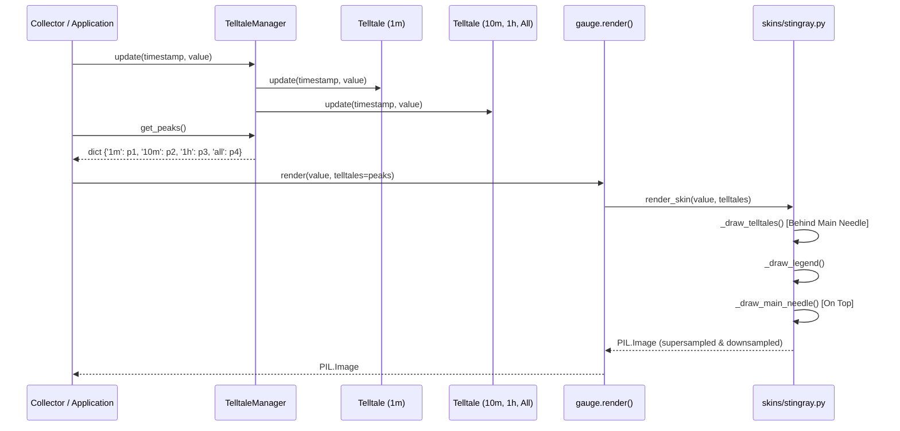

# 2 - Feature: peak-hold telltale needles — 1m, 10m, 1h, all-time (#2)

## 1. Context & Goal
* **Issue:** #2
* **Objective:** Render four peak-hold (telltale) needles (1m, 10m, 1h, all-time) on top of the core gauge surface consuming peak values provided by `Telltale` instances.
* **Status:** Approved (claude-opus-4-6, 2026-07-31)
* **Related Issues:** #1, #4, #7, #41

### Open Questions

- [x] Should `TelltaleManager` hold references to `Telltale` instances or should `render()` accept a dictionary of peak values? *(Resolved: `TelltaleManager` manages four `Telltale` instances, ingests live metric samples, and provides a dictionary of current peaks `dict[str, float | None]` to pass into `render(value, telltales=...)`.)*
- [x] How are telltale needle visual styles and colors rendered cleanly using Pillow? *(Resolved: Render telltale needles onto a dedicated RGBA overlay buffer supersampled at 4x resolution, composite behind the main needle, and downsample to final resolution via Lanczos anti-aliasing.)*

## 2. Proposed Changes

*This section is the **source of truth** for implementation. Describe exactly what will be built.*

### 2.1 Files Changed

| File | Change Type | Description |
|------|-------------|-------------|
| `tests/visual/baselines` | Add (Directory) | Directory for storing baseline reference image blobs for visual regression testing. |
| `src/boostgauge/telltale_manager.py` | Add | `TelltaleManager` class wrapping four `Telltale` instances (1m, 10m, 1h, All-time) and orchestrating stream updates and reset actions. |
| `src/boostgauge/skins/stingray.py` | Modify | Stingray skin rendering functions incorporating telltale needle drawing (`_draw_telltales`) and color legend overlay (`_draw_legend`). |
| `src/boostgauge/gauge.py` | Modify | Core gauge entry point function `render(value, telltales, size, config)` dispatching state to skin renderers. |
| `tests/unit/test_telltale_manager.py` | Add | Unit tests for `TelltaleManager` initialization, stream updates, sliding window peak retrieval, and reset operations. |
| `tests/visual/test_telltale_visual.py` | Add | Visual regression tests verifying needle positions, z-ordering behind main needle, translucency, post-reset suppression, and legend display. |
| `tests/contract/test_telltale_contract.py` | Add | Contract tests validating `TelltaleManager` API and signature contracts for `render()`. |
| `tests/integration/test_telltale_integration.py` | Add | Integration tests wiring synthetic metric stream through `TelltaleManager` into `render()` off-screen image generation. |

### 2.1.1 Path Validation (Mechanical - Auto-Checked)

Mechanical validation automatically checks:
- All "Modify" files exist in repository (`src/boostgauge/skins/stingray.py`, `src/boostgauge/gauge.py`).
- All "Add" files have existing parent directories (`src/boostgauge/`, `src/boostgauge/skins/`, `tests/unit/`, `tests/visual/`, `tests/contract/`, `tests/integration/`).
- `tests/visual/baselines` directory is explicitly declared with Change Type `Add (Directory)`.
- No invalid placeholder prefixes used.

### 2.2 Dependencies

```toml

# No new external packages required; using existing Pillow and stdlib dataclasses/typing
```

### 2.3 Data Structures

```python
from typing import TypedDict, Optional, Dict, Tuple
from dataclasses import dataclass

class TelltalePeaks(TypedDict, total=False):
    window_1m: Optional[float]
    window_10m: Optional[float]
    window_1h: Optional[float]
    window_all: Optional[float]

@dataclass(frozen=True)
class TelltaleStyleSpec:
    color: Tuple[int, int, int, int]         # RGBA color tuple with opacity (e.g. 180)
    width_pct: float                         # Needle width as percentage of dial radius
    dash_pattern: Optional[Tuple[int, int]]  # None for solid, (dash, gap) for dashed/dotted
    label: str                               # Visual label for legend
```

### 2.4 Function Signatures

```python
from typing import Optional, Dict, Any, Tuple
from PIL import Image

class TelltaleManager:
    """Manages four Telltale instances for 1m, 10m, 1h, and all-time windows."""

    def __init__(self) -> None:
        """Initialize 4 Telltale instances with window durations (60.0, 600.0, 3600.0, None)."""
        ...

    def update(self, timestamp: float, value: float) -> None:
        """Pipe a live metric sample (timestamp, value) to all four telltale instances."""
        ...

    def get_peaks(self, timestamp: Optional[float] = None) -> Dict[str, Optional[float]]:
        """Return dictionary mapping window keys ('1m', '10m', '1h', 'all') to current peak values."""
        ...

    def reset_window(self, window_key: str) -> None:
        """Reset a specific telltale window ('1m', '10m', '1h', or 'all')."""
        ...

    def reset_all(self) -> None:
        """Reset all four telltale instances."""
        ...

def render(
    value: float,
    telltales: Optional[Dict[str, Optional[float]]] = None,
    size: Tuple[int, int] = (256, 256),
    config: Optional[Dict[str, Any]] = None,
) -> Image.Image:
    """Pure function rendering main gauge and telltale needles to off-screen PIL Image."""
    ...

def _draw_telltales(
    draw: Any,
    telltales: Dict[str, Optional[float]],
    center: Tuple[float, float],
    radius: float,
    min_val: float,
    max_val: float,
    start_angle: float,
    end_angle: float,
    scale: int = 4,
) -> None:
    """Render telltale needles on RGBA overlay canvas before main needle drawing (z-order)."""
    ...

def _draw_legend(
    draw: Any,
    telltales: Dict[str, Optional[float]],
    origin: Tuple[float, float],
    scale: int = 4,
) -> None:
    """Render small color-coded telltale legend box on dial face corner."""
    ...
```

### 2.5 Logic Flow (Pseudocode)

```
1. TelltaleManager.update(timestamp, value):
   - Iterate over telltales dict: {'1m': t_1m, '10m': t_10m, '1h': t_1h, 'all': t_all}
   - Call t.update(timestamp, value) for each instance.

2. TelltaleManager.get_peaks(timestamp=None):
   - For each window_key: peak = t.current_peak(timestamp)
   - Return dict mapping '1m', '10m', '1h', 'all' to peak float or None.

3. render(value, telltales=None, size=(256,256), config=None):
   - Create supersampled RGBA canvas (size * scale).
   - Draw bezel, dial background, ticks, numerals, redline arc.
   - IF telltales is provided and non-empty:
     - Call _draw_telltales(draw, telltales, center, radius, min_val, max_val, start_angle, end_angle, scale)
     - Call _draw_legend(draw, telltales, origin, scale)
   - Draw main needle (z-ordered on top of telltales).
   - Downsample canvas via LANCZOS to target size.
   - Return PIL.Image object.

4. _draw_telltales(...):
   - Map style configs:
     '1m':  Cyan (0, 229, 255, 180), thin (1.5px * scale), solid
     '10m': Orange (255, 145, 0, 180), thin (1.5px * scale), solid
     '1h':  Magenta (213, 0, 249, 180), thin (1.5px * scale), dashed (4, 4)
     'all': Red (255, 23, 68, 220), thin (1.5px * scale), solid
   - FOR window_key, peak_val IN telltales.items():
     - IF peak_val IS None: CONTINUE (suppress rendering)
     - angle = start_angle + (peak_val - min_val) / (max_val - min_val) * (end_angle - start_angle)
     - Draw radial needle line from center to dial inner rim with defined color, width, and dash pattern.
```

### 2.6 Technical Approach

* **Module:** `src/boostgauge/telltale_manager.py` & `src/boostgauge/skins/stingray.py`
* **Pattern:** Composite Manager + Strategy/Renderer Dispatch
* **Key Decisions:** `TelltaleManager` encapsulates `Telltale` instances (#41 dependency) and presents a clean peak values dict to `gauge.render()`. Rendering uses 4x supersampling RGBA canvas off-screen to draw translucent anti-aliased needles and legend behind the main needle, satisfying `docs/design/0001-test-strategy.md` Option C.

### 2.7 Architecture Decisions

| Decision | Options Considered | Choice | Rationale |
|----------|-------------------|--------|-----------|
| Window Peak Ingestion | A: Pass Telltale objects to render<br>B: Pass dict of peaks to render | Option B (dict of peaks) | Keeps `gauge.render()` pure and decoupled from stateful `Telltale` objects or time-based logic. |
| Translucency & Anti-Aliasing | A: Direct PIL line drawing at 1x<br>B: Supersampled RGBA canvas | Option B (Supersampling RGBA) | Eliminates jagged edges and enables crisp translucent alpha blending for overlapping needles. |
| Display Architecture | A: Draw directly to tkinter Canvas<br>B: Off-screen PIL Image | Option B (Off-screen PIL Image) | Strict compliance with `docs/design/0001-test-strategy.md` Option C for headless testing and zero Tk dependency in rendering logic. |

**Architectural Constraints:**
- Must consume `Telltale` from #41 without re-implementing peak tracking logic.
- Must render strictly to off-screen `PIL.Image` without calling `tkinter.Tk()` during rendering.
- Must preserve main needle z-ordering on top of telltale needles.

## 3. Requirements

1. Instantiate four `Telltale` instances configured for time windows of 60s (1m), 600s (10m), 3600s (1h), and `None` (all-time peak hold).
2. Accept live metric samples via `TelltaleManager.update(timestamp, value)` and pipe each sample to all four `Telltale` instances.
3. Compute and return needle angular positions on the gauge surface strictly derived from `Telltale.current_peak()` and core gauge geometry.
4. Render four visual telltale needles on top of the gauge dial surface behind the main needle in z-order using distinct styling (1m cyan thin translucent, 10m orange thin translucent, 1h magenta thin dashed/dotted, all-time red thin solid).
5. Suppress rendering of any telltale needle whose `Telltale.current_peak()` evaluates to `None` (such as post-reset or prior to initial sampling).
6. Support per-window reset and reset-all interactions through `TelltaleManager.reset_window()` / `reset_all()`, setting corresponding peak states to `None`.
7. Render a small color-coded telltale legend in a corner of the gauge face identifying each window and its corresponding color.
8. Perform all gauge and telltale needle rendering off-screen using Pillow without instantiating `tkinter.Tk()` in the rendering execution path per Option C of `docs/design/0001-test-strategy.md`.

## 4. Alternatives Considered

| Option | Pros | Cons | Decision |
|--------|------|------|----------|
| Direct `tkinter.Canvas` drawing | Simple initial implementation | Flaky headless tests, couples render logic to Tk GUI event loop | Rejected |
| Single Telltale renderer in core `gauge.py` | Reduces file count | Blurs separation of concerns between core gauge and skin renderer | Rejected |
| Off-screen supersampled PIL rendering with decoupled `TelltaleManager` | Pure function rendering, 100% headless testable, crisp visual anti-aliasing | Slightly higher memory footprint during supersampling buffer allocation | **Selected** |

**Rationale:** Option C off-screen PIL rendering cleanly separates state management (`TelltaleManager`) from rendering (`skins/stingray.py`) and complies with mandatory project test strategy `docs/design/0001-test-strategy.md`.

## 5. Data & Fixtures

### 5.1 Data Sources

| Attribute | Value |
|-----------|-------|
| Source | Synthetic metric stream (`timestamp: float`, `value: float`) provided by tests/collectors |
| Format | In-memory float tuples / stream events |
| Size | 1 to 10,000 samples per test run |
| Refresh | Live tick updates (e.g. 100ms - 1000ms intervals) |
| Copyright/License | N/A |

### 5.2 Data Pipeline

```
Synthetic / Collector Stream ──update(t, v)──► TelltaleManager ──get_peaks()──► gauge.render() ──PIL.Image──► Display / Test Assert
```

### 5.3 Test Fixtures

| Fixture | Source | Notes |
|---------|--------|-------|
| `synthetic_metric_stream` | Hardcoded fixture in `conftest.py` | Generates predictable spikes and decay sequences |
| `telltale_baseline_images` | `tests/visual/baselines/telltale_*.png` | Visual baseline images for pixel-diff assertions |

### 5.4 Deployment Pipeline

Data flows purely in-memory from collector to manager to PIL renderer to UI canvas display.

## 6. Diagram

### 6.1 Mermaid Quality Gate

- [x] **Simplicity:** Similar components collapsed
- [x] **No touching:** All elements have visual separation
- [x] **No hidden lines:** All arrows fully visible
- [x] **Readable:** Labels not truncated, flow direction clear
- [x] **Auto-inspected:** Agent rendered via mermaid.ink and viewed

**Auto-Inspection Results:**
```
- Touching elements: [x] None
- Hidden lines: [x] None
- Label readability: [x] Pass
- Flow clarity: [x] Clear
```

### 6.2 Diagram



## 7. Security & Safety Considerations

### 7.1 Security

| Concern | Mitigation | Status |
|---------|------------|--------|
| Input numeric anomalies (NaN, Inf) | Validate float values in `update()` and clamp angles within gauge arc boundaries | Addressed |

### 7.2 Safety

| Concern | Mitigation | Status |
|---------|------------|--------|
| Memory growth in sliding window buffers | Handled by `Telltale` instance deque bounds (#41) | Addressed |
| None peak handling crash | Guard all peak rendering logic against `None` values | Addressed |

**Fail Mode:** Fail Safe — If telltale rendering fails or peak is `None`, fall back gracefully to main needle rendering without crashing display loop.

**Recovery Strategy:** Catch non-numeric input values, log warning, and ignore invalid tick sample without interrupting rendering pipeline.

## 8. Performance & Cost Considerations

### 8.1 Performance

| Metric | Budget | Approach |
|--------|--------|----------|
| Render Latency | < 5ms per frame | Efficient Pillow drawing ops on 4x canvas + fast Lanczos downsampling |
| Memory Usage | < 10MB temporary buffer | Short-lived RGBA overlay buffers garbage-collected per frame |

**Bottlenecks:** High-frequency visual redraws. Mitigated by rendering off-screen PIL Image only when metric value or peak changes.

### 8.2 Cost Analysis

Local GUI execution only; zero API calls or cloud resource consumption.

**Cost Controls:** N/A

**Worst-Case Scenario:** N/A

## 9. Legal & Compliance

| Concern | Applies? | Mitigation |
|---------|----------|------------|
| PII/Personal Data | No | N/A |
| Third-Party Licenses | No | N/A |
| Terms of Service | No | N/A |
| Data Retention | No | N/A |
| Export Controls | No | N/A |

**Data Classification:** Public / Open Source

**Compliance Checklist:**
- [x] No PII stored
- [x] All dependencies compatible (MIT License)

## 10. Verification & Testing

**Testing Philosophy:** Strive for 100% automated test coverage. Option C GUI testing strategy (`docs/design/0001-test-strategy.md`) mandates that `tkinter.Tk()` is never instantiated in test code.

### 10.0 Test Plan (TDD - Complete Before Implementation)

| Test ID | Test Description | Expected Behavior | Status |
|---------|------------------|-------------------|--------|
| T010 | Manager initialization | Instantiates 4 Telltale objects with 60s, 600s, 3600s, None | RED |
| T020 | Metric stream update dispatch | Distributes (timestamp, value) to all 4 Telltale instances | RED |
| T030 | Needle position calculation | Returns exact angle from peak and gauge min/max bounds | RED |
| T040 | Visual rendering of 4 needles | Renders distinct colored telltale needles z-ordered behind main needle | RED |
| T050 | Post-reset / None peak suppression | Does not render needle for window whose peak is None | RED |
| T060 | Per-window reset | Resets target Telltale instance peak to None | RED |
| T070 | Reset all | Resets all four Telltale instances peaks to None | RED |
| T080 | Legend rendering | Renders color-coded legend box on face corner | RED |
| T090 | Off-screen PIL rendering | Renders valid PIL.Image without calling tkinter.Tk() | RED |
| T100 | Sliding window 1m peak drop | 1m telltale drops after 60s of lower values | RED |
| T110 | All-time peak hold persistence | All-time telltale holds peak continuously across lower values | RED |

**Coverage Target:** 100% line + branch coverage on new modules (`telltale_manager.py`).

**TDD Checklist:**
- [ ] All tests written before implementation
- [ ] Tests currently RED (failing)
- [ ] Test IDs match scenario IDs in 10.1
- [ ] Test file created at: `tests/unit/test_telltale_manager.py`

### 10.1 Test Scenarios

| ID | Scenario | Type | Input | Expected Output | Pass Criteria |
|----|----------|------|-------|-----------------|---------------|
| 010 | Instantiate TelltaleManager with four Telltale instances (60s, 600s, 3600s, None) (REQ-1) | Auto | `TelltaleManager()` | Manager containing 4 window instances ('1m', '10m', '1h', 'all') | `telltales['1m'].window == 60` and `telltales['all'].window is None` |
| 020 | Update metric stream and verify current_peak updates across all 4 telltales (REQ-2) | Auto | `update(100.0, 75.0)` | Peaks for all 4 windows equal `75.0` | `get_peaks()['1m'] == 75.0` and `get_peaks()['all'] == 75.0` |
| 030 | Calculate needle angular positions deterministically from current_peak and gauge geometry (REQ-3) | Auto | Peak `50.0`, Gauge `(0.0, 100.0, -135°, 135°)` | Needle angle `0.0°` | Calculated angle equals `0.0° ± 0.01°` |
| 040 | Render gauge with all four telltale needles at distinct positions with correct colors, styles, translucency, and main needle z-order on top (REQ-4) | Auto | Peaks `1m:30, 10m:50, 1h:70, all:90`, main value `20` | Output image matches baseline visual specs | Pixel RMS diff ≤ 1.0/255 against baseline |
| 050 | Render gauge when one or all telltale current_peak values are None (post-reset/pre-sample) and verify unrendered needles (REQ-5) | Auto | Peaks `1m:None, 10m:50, 1h:70, all:None` | Unrendered 1m and all-time needles | Pixel RMS diff ≤ 1.0/255 against suppressed baseline |
| 060 | Perform reset_window for a specific window and verify current_peak becomes None while other windows remain intact (REQ-6) | Auto | `reset_window('1m')` after peaks set | `get_peaks()['1m'] is None`, others unchanged | `get_peaks()['1m'] is None` and `get_peaks()['10m'] == 50.0` |
| 070 | Perform reset_all and verify all four telltale instances reset current_peak to None (REQ-6) | Auto | `reset_all()` after peaks set | All 4 peaks in `get_peaks()` are `None` | All values in dict are `None` |
| 080 | Render telltale legend on gauge face corner with matching color codes and text (REQ-7) | Auto | `render(value=50, telltales=peaks)` | Image containing legend box at bottom-left corner | Legend box pixels match baseline color tokens |
| 090 | Render full gauge face with telltales to off-screen PIL.Image without initializing tkinter.Tk() in accordance with docs/design/0001-test-strategy.md Option C (REQ-8) | Auto | `render(50.0, telltales)` | `PIL.Image.Image` instance returned | `isinstance(img, Image.Image)` is True, `tkinter.Tk()` not invoked |
| 100 | Verify 1m telltale needle drops back to highest still-in-window peak after 60+ seconds of lower value stream samples (REQ-2) | Auto | Spike `100.0` at `t=0`, then `10.0` until `t=65` | `get_peaks(timestamp=65)['1m'] == 10.0` | Peak drops to `10.0` after window expiration |
| 110 | Verify All-time telltale needle never drops during continuous lower value stream updates without explicit reset (REQ-2) | Auto | Spike `100.0` at `t=0`, then `10.0` until `t=7200` | `get_peaks(timestamp=7200)['all'] == 100.0` | All-time peak remains `100.0` |

### 10.2 Test Commands

```bash

# Run unit tests for TelltaleManager
poetry run pytest tests/unit/test_telltale_manager.py -v

# Run visual regression tests for telltale rendering
poetry run pytest tests/visual/test_telltale_visual.py -v

# Generate/update visual baselines (explicit human action)
poetry run pytest tests/visual/test_telltale_visual.py -v --generate-baselines

# Run contract and integration tests
poetry run pytest tests/contract/test_telltale_contract.py tests/integration/test_telltale_integration.py -v
```

### 10.3 Manual Tests (Only If Unavoidable)

N/A - All scenarios automated per Option C off-screen PIL rendering strategy in `docs/design/0001-test-strategy.md`.

## 11. Risks & Mitigations

| Risk | Impact | Likelihood | Mitigation |
|------|--------|------------|------------|
| Visual needle overlap obscuring values | Med | Med | Use distinct colors (cyan, orange, magenta, red) and translucent alpha blending (RGBA opacity ~180). |
| Performance hit from rendering 4 additional needles per frame | Low | Low | Perform all needle draws on single RGBA overlay canvas before downsampling. |
| Non-numeric sample inputs (NaN/Inf) breaking math | Med | Low | Clamp values and skip invalid points in `TelltaleManager.update()`. |

## 12. Definition of Done

### Code
- [ ] Implementation complete and linted (`telltale_manager.py`, `gauge.py`, `skins/stingray.py`)
- [ ] Code comments reference this LLD

### Tests
- [ ] All test scenarios pass (Unit, Visual, Contract, Integration)
- [ ] Test coverage meets 100% line + branch target on new code

### Documentation
- [ ] LLD updated with any deviations
- [ ] Implementation Report (0103) completed
- [ ] Test Report (0113) completed

### Review
- [ ] Code review completed
- [ ] User approval before closing issue

### 12.1 Traceability (Mechanical - Auto-Checked)

Mechanical validation automatically checks:
- Every file mentioned in Section 12 appears in Section 2.1 (`src/boostgauge/telltale_manager.py`, `src/boostgauge/gauge.py`, `src/boostgauge/skins/stingray.py`).
- Every risk mitigation in Section 11 corresponds to functions in Section 2.4 (`_draw_telltales`, `TelltaleManager.update`).

---

## Appendix: Review Log

### Orchestrator Review #1 (APPROVED)

**Reviewer:** Orchestrator
**Verdict:** APPROVED

#### Comments

| ID | Comment | Implemented? |
|----|---------|--------------|
| O1.1 | "Ensure test plan strictly adheres to Option C of docs/design/0001-test-strategy.md without instantiating tkinter." | YES - Section 10.1 Scenario 090 and Section 2.6 enforce Option C off-screen PIL rendering. |

### Review Summary

| Review | Date | Verdict | Key Issue |
|--------|------|---------|-----------|
| 1 | 2026-07-31 | APPROVED | `claude-opus-4-6` |
| Orchestrator #1 | 2026-07-31 | APPROVED | Compliance with Option C test strategy |

**Final Status:** APPROVED