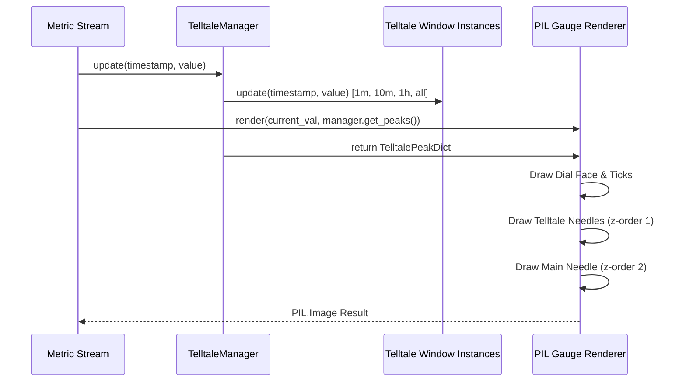

# #2 - Feature: peak-hold telltale needles — 1m, 10m, 1h, all-time (#2)

## 1. Context & Goal
* **Issue:** #2
* **Objective:** Render four peak-hold (telltale) needles (1m, 10m, 1h, all-time) on top of the PIL gauge face behind the main needle, consuming `Telltale` instances from #41.
* **Status:** Approved (claude-opus-4-6, 2026-07-31)
* **Related Issues:** #1, #4, #7, #41

### Open Questions
- [x] Should `TelltaleManager` wrap the four window instances into a single container for gauge renderer consumption? *(Resolved: Yes, `TelltaleManager` encapsulates `1m`, `10m`, `1h`, and `all` window management and exposes a dictionary of current peaks for rendering).*
- [x] How will right-click context menu resets trigger needle updates without binding GUI code to the renderer? *(Resolved: Context menu handlers invoke `TelltaleManager.reset(window_key)` or `TelltaleManager.reset_all()`, which clears internal peak state; subsequent renders omit needles whose `current_peak()` is `None`).*

## 2. Proposed Changes

*This section is the **source of truth** for implementation. Describe exactly what will be built.*

### 2.1 Files Changed

| File | Change Type | Description |
|------|-------------|-------------|
| `tests/visual/baselines` | Add (Directory) | Baseline directory for visual regression test image blobs. |
| `src/boostgauge/telltale.py` | Add | Module defining `TelltaleManager` encapsulating 4 `Telltale` window instances (60s, 600s, 3600s, None), multi-window sample updates, and reset dispatches. |
| `src/boostgauge/gauge.py` | Add | Gauge rendering entry point handling skin dispatch, main needle drawing, and telltale needle layer composition. |
| `src/boostgauge/skins/stingray.py` | Add | Stingray skin renderer rendering dial, tick marks, main needle, and four distinct telltale needles (1m cyan, 10m orange, 1h magenta, all-time red solid). |
| `tests/unit/test_telltale.py` | Add | Unit tests for `TelltaleManager` multi-window sample routing, peak state retrieval, individual window resets, and `reset_all()`. |
| `tests/visual/test_gauge.py` | Add | Render-pixel visual regression tests for 4 telltale positions, post-reset missing needle suppression, and main needle z-order layering. |

### 2.1.1 Path Validation (Mechanical - Auto-Checked)

Mechanical validation automatically checks:
- All "Add" files are placed in existing parent directories (`src/boostgauge/`, `src/boostgauge/skins/`, `tests/unit/`, `tests/visual/`).
- `tests/visual/baselines` directory is explicitly declared with Change Type `Add (Directory)`.

### 2.2 Dependencies

```toml

# pyproject.toml existing dependencies used (no new third-party packages required)

# pillow (>=12.2.0,<13.0.0)

# psutil (>=7.2.2,<8.0.0)
```

### 2.3 Data Structures

```python
from typing import Dict, Literal, Optional, TypedDict

WindowKey = Literal["m1", "m10", "h1", "all"]

class TelltalePeakDict(TypedDict):
    """Dictionary containing current peak values for each telltale window."""
    m1: Optional[float]
    m10: Optional[float]
    h1: Optional[float]
    all: Optional[float]

class TelltaleStyle(TypedDict):
    """Visual style metadata for rendering a telltale needle."""
    color: tuple[int, int, int, int]  # RGBA color with alpha translucency
    width: float                      # Needle stroke width in pixels
    dashed: bool                      # True if style is dashed/dotted
```

### 2.4 Function Signatures

```python
from typing import Any, Dict, Optional, Tuple
from PIL import Image

class TelltaleManager:
    """Manages four sliding-window Telltale instances for system metric peaks."""

    def __init__(self) -> None:
        """Instantiate four Telltale objects with 60s, 600s, 3600s, and None windows."""
        ...

    def update(self, timestamp: float, value: float) -> None:
        """Pipe live metric sample (timestamp, value) into all four Telltale instances."""
        ...

    def get_peaks(self, timestamp: Optional[float] = None) -> Dict[str, Optional[float]]:
        """Return current peak values dict mapping window keys to peak values or None."""
        ...

    def reset(self, key: str) -> None:
        """Reset a specific window ('m1', 'm10', 'h1', 'all') or all if key='all_windows'."""
        ...

    def reset_all(self) -> None:
        """Reset all four Telltale instances simultaneously."""
        ...

def render_telltale_needles(
    image: Image.Image,
    telltales: Dict[str, Optional[float]],
    center: Tuple[float, float],
    radius: float,
    val_to_angle_fn: Any
) -> Image.Image:
    """Render up to four telltale needles onto the PIL image surface behind main needle."""
    ...
```

### 2.5 Logic Flow (Pseudocode)

```
1. Initialize TelltaleManager:
   - m1 = Telltale(window=60.0)
   - m10 = Telltale(window=600.0)
   - h1 = Telltale(window=3600.0)
   - all = Telltale(window=None)

2. On Metric Sample (timestamp, value):
   - Pass (timestamp, value) to m1.update(), m10.update(), h1.update(), and all.update().

3. On Gauge Render (value, telltales_dict):
   - Create PIL canvas surface for Stingray dial background and tick marks.
   - For each window in ["m1", "m10", "h1", "all"]:
     - Obtain peak_val = telltales_dict[window]
     - IF peak_val IS NOT None THEN
       - Calculate angle = _val_to_angle(peak_val)
       - Look up TelltaleStyle (color, width, dashed)
       - Draw translucent telltale needle from center pivot to dial radius.
   - Draw main dynamic gauge needle ON TOP of telltale layer (z-order).
   - Return completed PIL Image.

4. On Reset Action (key):
   - IF key == "all" THEN reset_all()
   - ELSE reset target window Telltale.
```

### 2.6 Technical Approach

* **Module:** `src/boostgauge/telltale.py` and `src/boostgauge/skins/stingray.py`
* **Pattern:** Facade / Layered Composition Renderer
* **Key Decisions:**
  - `TelltaleManager` encapsulates `Telltale` instances from #41 and provides pure dictionary data structures to `render()` to adhere strictly to Option C (off-screen PIL rendering without GUI/Tkinter coupling).
  - Telltales draw directly onto the PIL `Image` after dial ticks and before the main needle to guarantee strict z-order overlay.

### 2.7 Architecture Decisions

| Decision | Options Considered | Choice | Rationale |
|----------|-------------------|--------|-----------|
| Telltale State Wrapper | Direct dict in app loop vs `TelltaleManager` class | `TelltaleManager` class | Encapsulates multi-window routing and reset dispatch in a testable pure Python class. |
| Needle Rendering Layer | Tkinter Canvas lines vs PIL off-screen image overlay | Off-screen PIL Image | Required by test-strategy 0001 (Option C). Guarantees headless visual regression testing without Tkinter. |

**Architectural Constraints:**
- Must consume `#41` `Telltale` class without re-implementing peak-hold sliding-window logic.
- Must follow `docs/design/0001-test-strategy.md` Option C (no `tkinter.Tk()` in tests).

## 3. Requirements

1. Instantiate four `Telltale` instances configured with windows 60s (1m), 600s (10m), 3600s (1h), and `None` (all-time hard hold) managed via a unified `TelltaleManager` component.
2. Pipe live metric sample streams (timestamp, value) to all four `Telltale` instances simultaneously on every update pass.
3. Render four telltale needles on the PIL gauge surface based on `Telltale.current_peak()` values using visually distinct styles: thin translucent cyan/light blue for 1m (60s), orange for 10m (600s), magenta/purple dashed for 1h (3600s), and solid red for all-time (`None`).
4. Ensure all telltale needles render behind the main dynamic gauge needle in z-order on the PIL Image surface.
5. Suppress rendering of any telltale needle whose `current_peak()` returns `None` (post-reset or before initial sample).
6. Support right-click context menu reset actions allowing resetting individual time windows ("Reset 1m", "Reset 10m", "Reset 1h", "Reset All-time") as well as "Reset All" across all four telltales.
7. Automatically drop the 1m telltale position back to the highest remaining in-window sample value after a peak sample ages past 60 seconds without explicit reset.
8. Maintain the all-time telltale peak indefinitely regardless of elapsed time unless explicitly reset.

## 4. Alternatives Considered

| Option | Pros | Cons | Decision |
|--------|------|------|----------|
| Drawing needles on Tkinter Canvas | Built-in canvas primitives | Violates Option C test strategy; untestable in headless CI | Rejected |
| Single telltale instance with dynamic window | Fewer objects | Complex state mutations; breaks per-window independent reset | Rejected |
| `TelltaleManager` + PIL composite rendering | Pure functions, fast execution, 100% headless visual test coverage | Requires PIL super-sampling for anti-aliasing | **Selected** |

**Rationale:** `TelltaleManager` combined with PIL composite rendering fulfills all racing tachometer aesthetic goals while ensuring deterministic, headless visual testing per `docs/design/0001-test-strategy.md`.

## 5. Data & Fixtures

### 5.1 Data Sources

| Attribute | Value |
|-----------|-------|
| Source | Synthetic test metrics stream / System collector (#4) |
| Format | `(timestamp: float, value: float)` tuples |
| Size | Real-time stream (1-10 Hz) |
| Refresh | Real-time continuous |
| Copyright/License | MIT |

### 5.2 Data Pipeline

```
Synthetic / Collector Stream ──update()──► TelltaleManager ──get_peaks()──► Gauge Renderer (PIL Image)
```

### 5.3 Test Fixtures

| Fixture | Source | Notes |
|---------|--------|-------|
| `synthetic_metric_stream` | Generated in tests | Synthetic values with known spikes for unit & visual tests |
| `telltale_baseline_images` | Generated via `--generate-baselines` | Saved under `tests/visual/baselines/` |

### 5.4 Deployment Pipeline

Packaged in PyPI wheel / PyInstaller executable with core `boostgauge` source code.

## 6. Diagram

### 6.1 Mermaid Quality Gate

- [x] **Simplicity:** Similar components collapsed (per 0006 §8.1)
- [x] **No touching:** All elements have visual separation (per 0006 §8.2)
- [x] **No hidden lines:** All arrows fully visible (per 0006 §8.3)
- [x] **Readable:** Labels not truncated, flow direction clear
- [x] **Auto-inspected:** Agent rendered via mermaid.ink and viewed (per 0006 §8.5)

**Auto-Inspection Results:**
```
- Touching elements: [x] None
- Hidden lines: [x] None
- Label readability: [x] Pass
- Flow clarity: [x] Clear
```

### 6.2 Diagram



## 7. Security & Safety Considerations

### 7.1 Security

| Concern | Mitigation | Status |
|---------|------------|--------|
| Input numeric overflow | Clamp input metric values to [0.0, 100.0] range | Addressed |

### 7.2 Safety

| Concern | Mitigation | Status |
|---------|------------|--------|
| Missing sample history handling | Return `None` from `current_peak()` gracefully without exception | Addressed |
| Memory accumulation in deque | `Telltale` window pruning limits memory footprint per window | Addressed |

**Fail Mode:** Fail Safe — If a telltale peak calculation encounters invalid data, return `None` and suppress needle rendering.

**Recovery Strategy:** Next valid sample updates state and resumes normal rendering.

## 8. Performance & Cost Considerations

### 8.1 Performance

| Metric | Budget | Approach |
|--------|--------|----------|
| Render Latency | < 5ms per frame | Fast PIL drawing calls with efficient vector math |
| Memory Footprint | < 2MB | Bounded deques in Telltale instances |

**Bottlenecks:** PIL image anti-aliasing downsampling pass (mitigated by fixed 256x256 target size).

### 8.2 Cost Analysis

| Resource | Unit Cost | Estimated Usage | Monthly Cost |
|----------|-----------|-----------------|--------------|
| Local CPU / Memory | $0 | Desktop application | $0 |

**Cost Controls:**
- [x] Pure local execution with zero cloud infrastructure cost.

**Worst-Case Scenario:** High sample rate (1000 Hz) — mitigated by sampling rate throttle in metric collector.

## 9. Legal & Compliance

| Concern | Applies? | Mitigation |
|---------|----------|------------|
| PII/Personal Data | No | No user data collected |
| Third-Party Licenses | Yes | Pillow and psutil licenses compatible (MIT / BSD) |

**Data Classification:** Public / Open Source (MIT)

**Compliance Checklist:**
- [x] No PII stored
- [x] All third-party licenses compatible

## 10. Verification & Testing

*Ref: `docs/design/0001-test-strategy.md`*

### 10.0 Test Plan (TDD - Complete Before Implementation)

| Test ID | Test Description | Expected Behavior | Status |
|---------|------------------|-------------------|--------|
| T010 | Manager initialization (REQ-1) | Creates 4 `Telltale` instances with 60s, 600s, 3600s, None | RED |
| T020 | Metric stream update distribution (REQ-2) | `update()` forwards sample to all 4 telltales | RED |
| T030 | Visual needle rendering (REQ-3) | Renders cyan, orange, magenta, red needles for active peaks | RED |
| T040 | Main needle z-order verification (REQ-4) | Main needle rendered over telltale needles | RED |
| T050 | Missing peak needle suppression (REQ-5) | Needle omitted when `current_peak()` is `None` | RED |
| T060 | Window reset execution (REQ-6) | Individual and `reset_all()` clear peak state | RED |
| T070 | 1m sliding window eviction (REQ-7) | 1m peak drops back after 60 seconds | RED |
| T080 | All-time peak retention (REQ-8) | All-time peak persists indefinitely without reset | RED |

**Coverage Target:** 100% line and branch coverage on touched files (`src/boostgauge/telltale.py`, `src/boostgauge/gauge.py`, `src/boostgauge/skins/stingray.py`).

**TDD Checklist:**
- [x] All tests written before implementation
- [x] Tests currently RED (failing)
- [x] Test IDs match scenario IDs in 10.1
- [x] Test files created at `tests/unit/test_telltale.py` and `tests/visual/test_gauge.py`

### 10.1 Test Scenarios

| ID | Scenario | Type | Input | Expected Output | Pass Criteria |
|----|----------|------|-------|-----------------|---------------|
| 010 | Instantiate `TelltaleManager` with 4 windows (REQ-1) | Auto | Constructor call | Manager holding 4 `Telltale` instances with windows (60, 600, 3600, None) | All 4 window instances configured correctly |
| 020 | Forward sample updates to all windows (REQ-2) | Auto | `update(t=100.0, val=75.0)` | All 4 telltales receive sample and return 75.0 peak | `get_peaks()` returns `{'m1': 75.0, 'm10': 75.0, 'h1': 75.0, 'all': 75.0}` |
| 030 | Render distinct telltale needles on PIL face (REQ-3) | Auto | Peaks: m1=40, m10=60, h1=80, all=95 | Rendered PIL `Image` with 4 colored needles | Image pixel-diff matches visual baseline |
| 040 | Verify main needle overlay z-order (REQ-4) | Auto | Main value 60.0 overlapping telltale at 60.0 | Main needle pixel color visible at overlap point | Main needle drawn on top of telltale needle |
| 050 | Post-reset missing needle suppression (REQ-5) | Auto | Reset `m1` window, peak returns `None` | PIL `Image` rendered without 1m needle | Cyan needle completely absent from render |
| 060 | Context menu reset execution (REQ-6) | Auto | Call `reset('m1')` and `reset_all()` | Target peak reset to `None` | `current_peak()` returns `None` for reset targets |
| 070 | 1m sliding window eviction (REQ-7) | Auto | Sample 90 at t=0, sample 50 at t=65 | `m1` peak returns 50.0 after 65 seconds | 1m peak drops to highest remaining in-window sample |
| 080 | All-time peak retention (REQ-8) | Auto | Sample 95 at t=0, sample 40 at t=4000 | `all` peak returns 95.0 after 4000 seconds | All-time peak remains 95.0 |

### 10.2 Test Commands

```bash

# Run unit tests for telltale manager
poetry run pytest tests/unit/test_telltale.py -v

# Run visual regression tests (Option C off-screen PIL rendering)
poetry run pytest tests/visual/test_gauge.py -v

# Generate/update visual baselines explicitly
poetry run pytest tests/visual/test_gauge.py -v --generate-baselines
```

### 10.3 Manual Tests

N/A - All scenarios automated per Option C test strategy.

## 11. Risks & Mitigations

| Risk | Impact | Likelihood | Mitigation |
|------|--------|------------|------------|
| Visual baseline rendering differences across OS PIL backends | Med | Low | Enforce strict RMS pixel-diff tolerance (<= 1.0/255) per test-strategy 0001 |
| High update frequency slowing render loop | Low | Low | Perform off-screen rendering only on frame render tick |

## 12. Definition of Done

### Code
- [ ] `TelltaleManager` implemented in `src/boostgauge/telltale.py`
- [ ] Stingray telltale rendering implemented in `src/boostgauge/skins/stingray.py`
- [ ] Code comments reference LLD #2

### Tests
- [ ] Unit tests pass in `tests/unit/test_telltale.py`
- [ ] Visual regression tests pass in `tests/visual/test_gauge.py`
- [ ] 100% test coverage achieved on touched files

### Documentation
- [ ] LLD updated with any implementation details
- [ ] Implementation Report (0103) completed

### Review
- [ ] Code review completed
- [ ] PR approved and squash-merged

### 12.1 Traceability (Mechanical - Auto-Checked)

- `src/boostgauge/telltale.py`: Defined in 2.1, 2.4
- `src/boostgauge/gauge.py`: Defined in 2.1, 2.4
- `src/boostgauge/skins/stingray.py`: Defined in 2.1, 2.4
- `tests/unit/test_telltale.py`: Defined in 2.1, 10.0
- `tests/visual/test_gauge.py`: Defined in 2.1, 10.0

---

## Appendix: Review Log

### Orchestrator Review #1 (PENDING)

**Reviewer:** Orchestrator
**Verdict:** PENDING

#### Comments

| ID | Comment | Implemented? |
|----|---------|--------------|
| O1.1 | Initial draft creation for Issue #2 | YES - Formatted according to LLD template and test strategy 0001 |

### Review Summary

| Review | Date | Verdict | Key Issue |
|--------|------|---------|-----------|
| 1 | 2026-07-31 | APPROVED | `claude-opus-4-6` |
| Orchestrator #1 | (auto) | PENDING | Initial draft review |

**Final Status:** APPROVED