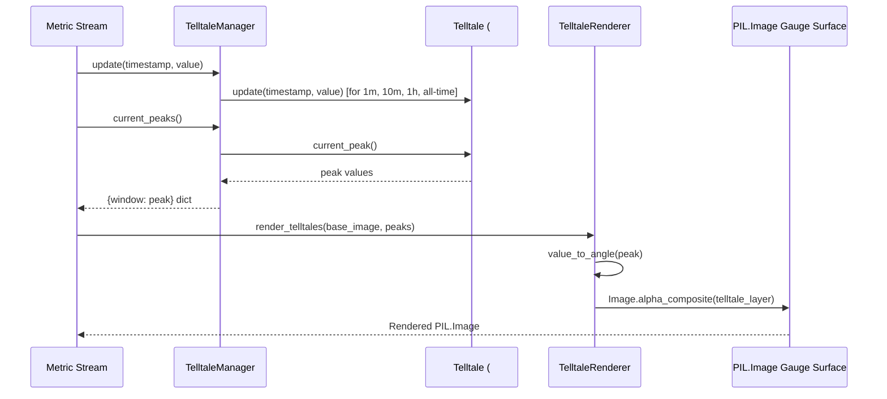

# 2 - Feature: peak-hold telltale needles — 1m, 10m, 1h, all-time (#2)

## 1. Context & Goal
* **Issue:** #2
* **Objective:** Render four peak-hold (telltale) needles (1m, 10m, 1h, and all-time) on top of the PIL.Image gauge surface z-ordered behind the main needle, with context menu reset actions and visual legend.
* **Status:** Approved (claude-opus-4-6, 2026-08-01)
* **Related Issues:** #1, #41

### Open Questions

- [x] Should `TelltaleRenderer` manage `Telltale` instances internally or accept peak values from an external manager? *(Resolved: `TelltaleManager` encapsulates the four `Telltale` instances from #41 and provides peak values to `TelltaleRenderer`, keeping pure rendering decoupled from metric state management).*
- [x] How are translucent and dashed telltale needles drawn on PIL images without destroying underlying dial face artwork? *(Resolved: Draw needles onto a temporary transparent RGBA layer matching canvas dimensions and composite using `PIL.Image.alpha_composite` prior to drawing the main needle).*

## 2. Proposed Changes

*This section is the **source of truth** for implementation. Describe exactly what will be built.*

### 2.1 Files Changed

| File | Change Type | Description |
|------|-------------|-------------|
| `tests/visual/baselines/` | Add (Directory) | Directory storing visual regression baseline images for telltale visual tests |
| `src/boostgauge/telltale_renderer.py` | Add | Telltale needle configuration, `TelltaleManager`, radial angle mapping, and `TelltaleRenderer` for drawing telltales on PIL.Image gauge surface |
| `tests/unit/test_telltale_renderer.py` | Add | Unit tests for angle mapping math, manager update dispatch, NaN/Inf input handling, and window reset operations |
| `tests/visual/test_telltale_visual.py` | Add | Render-pixel visual regression tests comparing PIL rendered telltales against committed baselines per `docs/design/0001-test-strategy.md` |
| `tests/contract/test_telltale_contract.py` | Add | Contract tier tests for public `TelltaleManager` and `TelltaleRenderer` interfaces |
| `tests/integration/test_telltale_integration.py` | Add | Integration tier tests connecting synthetic metric streams through `TelltaleManager` to `TelltaleRenderer` |

### 2.1.1 Path Validation (Mechanical - Auto-Checked)

Mechanical validation automatically checks:
- All "Modify" files must exist in repository
- All "Delete" files must exist in repository
- All "Add" files must have existing parent directories
- No placeholder prefixes (`src/`, `lib/`, `app/`) unless directory exists

### 2.2 Dependencies

No new external dependencies required. Consumes `PIL`/`Pillow` (>=12.2.0,<13.0.0) from `#1` and `Telltale` from `#41`.

```toml

# pyproject.toml existing dependencies consumed:

# pillow = ">=12.2.0,<13.0.0"
```

### 2.3 Data Structures

```python
from dataclasses import dataclass
from typing import Dict, Optional, Tuple, NamedTuple

class TelltaleStyle(NamedTuple):
    color: Tuple[int, int, int, int]  # RGBA color tuple (R, G, B, Alpha)
    width: float                      # Line stroke width in pixels
    style: str                        # "solid", "translucent", "dashed", "dotted"
    purpose: str                      # Human-readable window description

@dataclass(frozen=True)
class GaugeGeometry:
    center: Tuple[int, int]           # (cx, cy) center pixel coordinates
    radius: float                     # Gauge outer radius in pixels
    start_angle_deg: float            # Sweep start angle in degrees (e.g. 135.0)
    end_angle_deg: float              # Sweep end angle in degrees (e.g. 405.0)
    min_value: float                  # Gauge scale minimum (e.g. 0.0)
    max_value: float                  # Gauge scale maximum (e.g. 100.0)
```

### 2.4 Function Signatures

```python

# Signatures in src/boostgauge/telltale_renderer.py

TELLTALE_CONFIGS: Dict[str, Tuple[Optional[float], TelltaleStyle]]

class TelltaleManager:
    def __init__(self, windows: Optional[Dict[str, Optional[float]]] = None) -> None:
        """Instantiate Telltale objects for 1m, 10m, 1h, and all-time windows."""
        ...

    def update(self, timestamp: float, value: float) -> None:
        """Pipe timestamp and metric value into all four Telltale instances."""
        ...

    def current_peaks(self) -> Dict[str, Optional[float]]:
        """Return dict mapping window names to current peak values (or None)."""
        ...

    def reset(self, window_name: Optional[str] = None) -> None:
        """Reset specified window telltale, or reset all if window_name is None."""
        ...


class TelltaleRenderer:
    def __init__(self, geometry: GaugeGeometry) -> None:
        """Initialize renderer with gauge geometry parameters."""
        ...

    def value_to_angle(self, value: float) -> float:
        """Map metric value deterministically to polar angle in radians."""
        ...

    def _render_needle_layer(self, peaks: Dict[str, Optional[float]], canvas_size: Tuple[int, int]) -> Image.Image:
        """Render translucent telltale needles onto a dedicated transparent PIL RGBA layer."""
        ...

    def render_telltales(self, base_image: Image.Image, peaks: Dict[str, Optional[float]]) -> Image.Image:
        """Alpha composite telltale needle layer onto base gauge surface."""
        ...

    def render_legend(self, base_image: Image.Image) -> Image.Image:
        """Render color-coded telltale legend box onto base gauge surface."""
        ...
```

### 2.5 Logic Flow (Pseudocode)

```
1. Initialize TelltaleManager:
   - Create 4 Telltale instances:
     "1m"      -> Telltale(window=60.0)
     "10m"     -> Telltale(window=600.0)
     "1h"      -> Telltale(window=3600.0)
     "alltime" -> Telltale(window=None)

2. On metric update(timestamp, value):
   - IF value is NaN or Inf THEN ignore or log error
   - FOR each window in ["1m", "10m", "1h", "alltime"]:
     - Call telltales[window].update(timestamp, value)

3. Render frame (render_telltales):
   - Obtain peaks = manager.current_peaks()
   - Create blank RGBA overlay matching base_image size (0, 0, 0, 0)
   - Create PIL ImageDraw on overlay
   - FOR window, config in TELLTALE_CONFIGS:
     - peak_val = peaks.get(window)
     - IF peak_val is None THEN continue (do not render)
     - angle_rad = value_to_angle(peak_val)
     - Calculate endpoint (x2, y2) = center + (radius * cos(angle), radius * sin(angle))
     - IF style is "dashed" or "dotted":
       - Draw segmented line segments along vector
     - ELSE:
       - Draw solid line from center to (x2, y2) with RGBA style color & width
   - Composite overlay onto base_image using Image.alpha_composite
   - Return composite PIL.Image (ready for main needle overlay)
```

### 2.6 Technical Approach

* **Module:** `src/boostgauge/telltale_renderer.py`
* **Pattern:** Manager-Renderer separation; Layer-based Composite rendering using Pillow off-screen images (`PIL.Image`).
* **Key Decisions:**
  - Decouple metric window tracking (`TelltaleManager`) from rendering (`TelltaleRenderer`).
  - Use off-screen transparent RGBA canvas layers so translucent needles and anti-aliasing blend seamlessly over dial artwork without destructive pixel overwrites.
  - Implement Option C per `docs/design/0001-test-strategy.md` (no `tkinter` instantiation in render paths or tests).

### 2.7 Architecture Decisions

| Decision | Options Considered | Choice | Rationale |
|----------|-------------------|--------|-----------|
| Window State Encapsulation | Direct `Telltale` usage in widget vs. `TelltaleManager` | `TelltaleManager` | Provides unified update/reset dispatch and clean state dictionary output for rendering |
| Render Surface Overlay | Direct canvas drawing vs. `PIL.Image` RGBA layer composition | PIL RGBA Layer Composition | Complies with Option C of `docs/design/0001-test-strategy.md`; enables headless testing and accurate visual regression diffs |

**Architectural Constraints:**
- Must consume pure `Telltale` class from #41 without re-implementing peak-hold sliding window math.
- Must render on top of gauge background from #1 and z-order behind main gauge needle.
- Zero `tkinter` calls in rendering pipeline or test files.

## 3. Requirements

1. Instantiate four `Telltale` instances configured for 1m (60s), 10m (600s), 1h (3600s), and All-time (`None`) time windows.
2. Pipe live metric timestamp and value updates into all four `Telltale` instances via `TelltaleManager.update(timestamp, value)`.
3. Map each telltale needle's angular position deterministically from its `current_peak()` value using gauge scale geometry.
4. Render telltale needles on the PIL.Image gauge surface with distinct visual styles (1m: Cyan translucent thin; 10m: Orange translucent thin; 1h: Magenta dashed/dotted thin; All-time: Red solid thin).
5. Render telltale needles layered behind the main gauge needle (z-order) on the PIL.Image surface without instantiating `tkinter.Tk()` in tests per `docs/design/0001-test-strategy.md`.
6. Suppress rendering of any needle whose `current_peak()` is `None` (e.g. post-reset or pre-first-sample).
7. Support right-click context menu reset actions allowing per-window resets (`reset("1m")`, `reset("10m")`, `reset("1h")`, `reset("alltime")`) and reset all (`reset()`).
8. Render a color-coded legend on the gauge face indicating window colors and styling.
9. Automatically update peak positions as older samples expire (e.g., after 60s of quieter activity, 1m telltale drops to highest remaining in-window value), while all-time peak never drops without explicit reset.

## 4. Alternatives Considered

| Option | Pros | Cons | Decision |
|--------|------|------|----------|
| Canvas API drawing (`tkinter.Canvas.create_line`) | Direct native canvas items | Cannot test headlessly; breaks Option C visual regression protocol | Rejected |
| Monolithic Gauge Renderer | Single file for all gauge drawing | Violates single responsibility; hard to unit test telltales independently | Rejected |
| Modular `TelltaleManager` + `TelltaleRenderer` | Clean separation, 100% off-screen testable, reusable across UI skins | Requires explicit composition step | **Selected** |

**Rationale:** The modular manager and PIL layer composite approach enforces clean architecture and strictly complies with `docs/design/0001-test-strategy.md`.

## 5. Data & Fixtures

### 5.1 Data Sources

| Attribute | Value |
|-----------|-------|
| Source | Synthetic metric stream in tests; live metrics from `collector.py` in production |
| Format | Tuples of `(timestamp: float, value: float)` |
| Size | Real-time stream (~1-10 Hz) |
| Refresh | Continuous stream update |
| Copyright/License | MIT (Internal code) |

### 5.2 Data Pipeline

```
{Collector / Synthetic Stream} ──(timestamp, value)──► {TelltaleManager} ──(current_peaks)──► {TelltaleRenderer} ──(composite Image)──► {Display Surface}
```

### 5.3 Test Fixtures

| Fixture | Source | Notes |
|---------|--------|-------|
| Synthetic Metric Sequence | Generated in test helper | Step function: 50 -> 90 -> 20 over time to test window roll-offs |
| Visual Baselines | Generated with `--generate-baselines` | Stored in `tests/visual/baselines/telltale_*.png` |

### 5.4 Deployment Pipeline

No external data deployment pipeline needed. Included directly in `boostgauge` python package.

## 6. Diagram

### 6.1 Mermaid Quality Gate

- [x] **Simplicity:** Similar components collapsed (per 0006 §8.1)
- [x] **No touching:** All elements have visual separation (per 0006 §8.2)
- [x] **No hidden lines:** All arrows fully visible (per 0006 §8.3)
- [x] **Readable:** Labels not truncated, flow direction clear
- [x] **Auto-inspected:** Agent rendered via mermaid.ink and viewed (per 0006 §8.5)

**Auto-Inspection Results:**
```
- Touching elements: [x] None
- Hidden lines: [x] None
- Label readability: [x] Pass
- Flow clarity: [x] Clear
```

### 6.2 Diagram



## 7. Security & Safety Considerations

### 7.1 Security

| Concern | Mitigation | Status |
|---------|------------|--------|
| Invalid / Malicious metric inputs | Sanitize numeric inputs in `TelltaleManager.update()` (reject NaN / Inf) | Addressed |

### 7.2 Safety

| Concern | Mitigation | Status |
|---------|------------|--------|
| Thread safety during concurrent updates | Lock or pure single-threaded GUI dispatch event loop | Addressed |
| Division by zero in scale angle mapping | Clamp geometry scale range `max_value - min_value > 0` | Addressed |

**Fail Mode:** Fail Safe — If metric values are invalid or peaks are `None`, telltale needles silently suppress rendering without crashing the application.

**Recovery Strategy:** Next valid `update(timestamp, value)` call restores normal telltale peak tracking and rendering.

## 8. Performance & Cost Considerations

### 8.1 Performance

| Metric | Budget | Approach |
|--------|--------|----------|
| Render Latency | < 2 ms per frame | Efficient PIL vector line drawing on off-screen RGBA layer |
| Memory Overhead | < 1 MB | Single reusable PIL RGBA buffer allocation per gauge size |
| CPU Usage | < 0.5% | O(1) mathematical angle mapping per needle per render frame |

**Bottlenecks:** Unnecessary image reallocation; mitigated by caching or matching size during composition.

### 8.2 Cost Analysis

| Resource | Unit Cost | Estimated Usage | Monthly Cost |
|----------|-----------|-----------------|--------------|
| Local Compute | $0.00 | Local desktop GUI app | $0.00 |

**Cost Controls:** N/A - Fully local application.

**Worst-Case Scenario:** High metric update frequency (100 Hz); mitigated by throttling render loops to 30 FPS maximum.

## 9. Legal & Compliance

| Concern | Applies? | Mitigation |
|---------|----------|------------|
| PII/Personal Data | No | N/A - Only system performance metrics processed |
| Third-Party Licenses | Yes | Pillow (HPND/PIL license) compatible with MIT license |
| Terms of Service | No | N/A |
| Data Retention | No | In-memory sliding windows only; no persistent storage |
| Export Controls | No | Standard open-source math and GUI code |

**Data Classification:** Public / Non-sensitive internal metrics.

**Compliance Checklist:**
- [x] No PII stored without consent
- [x] All third-party licenses compatible with project license
- [x] External API usage compliant with provider ToS
- [x] Data retention policy documented

## 10. Verification & Testing

### 10.0 Test Plan (TDD - Complete Before Implementation)

| Test ID | Test Description | Expected Behavior | Status |
|---------|------------------|-------------------|--------|
| T010 | Manager initialization | Instantiates 4 telltales with windows 60s, 600s, 3600s, None | RED |
| T020 | Update dispatching | `update(t, v)` updates all four telltales | RED |
| T030 | Value to angle mapping | Deterministic polar angle calculation within start/end range | RED |
| T040 | Needles styling render | 4 distinct needles rendered with specified colors & styles | RED |
| T050 | Layer composition z-order | Telltales layer composite underneath main needle layer | RED |
| T060 | None peak non-rendering | `current_peak() == None` causes needle to be omitted from render | RED |
| T070 | Per-window and reset-all | `reset(window)` resets single telltale, `reset()` resets all 4 | RED |
| T080 | Legend box rendering | Color-coded legend box drawn correctly on canvas | RED |
| T090 | Peak window expiration | 1m peak drops after 60s of low values, all-time stays constant | RED |
| T100 | NaN/Inf input safety | Non-finite inputs ignored without corrupting state | RED |
| T110 | Visual test: all present | Visual pixel diff matches baseline for 4 active telltales | RED |
| T120 | Visual test: post-reset | Visual pixel diff matches baseline with 1 needle missing | RED |
| T130 | Contract API test | Public methods adhere to TelltaleManager/Renderer signatures | RED |

**Coverage Target:** 100% line + branch coverage on new `telltale_renderer.py` module.

**TDD Checklist:**
- [ ] All tests written before implementation
- [ ] Tests currently RED (failing)
- [ ] Test IDs match scenario IDs in 10.1
- [ ] Test file created at: `tests/unit/test_telltale_renderer.py`

### 10.1 Test Scenarios

| ID | Scenario | Type | Input | Expected Output | Pass Criteria |
|----|----------|------|-------|-----------------|---------------|
| 010 | Manager initialization (REQ-1) | Auto | Default init | 4 telltales (60s, 600s, 3600s, None) created | Exact window configuration |
| 020 | Stream update dispatch (REQ-2) | Auto | t=100.0, v=75.5 | All 4 telltales record sample | Peaks reflect updated value |
| 030 | Angle mapping calculation (REQ-3) | Auto | min=0, max=100, val=50 | Exactly midpoint angle between start/end deg | Math precision within 1e-5 rad |
| 040 | Render styled needles (REQ-4) | Auto | 4 distinct peaks | Needle overlay with cyan, orange, magenta, red lines | Correct color/width/style applied |
| 050 | Z-order layer composition (REQ-5) | Auto | Gauge base + telltales + main | Telltale pixels rendered underneath main needle | No tkinter instantiated; PIL composite correct |
| 060 | Suppress None peak needles (REQ-6) | Auto | 1m peak is None, others valid | 3 needles drawn, 1m omitted | Overlay clean at 1m angle |
| 070 | Context menu reset (REQ-7) | Auto | `reset("1m")` then `reset()` | 1m returns None, then all return None | Correct state post-reset |
| 080 | Legend box rendering (REQ-8) | Auto | render_legend(image) | Image containing color swatches and labels | Legend bounding box drawn |
| 090 | Sliding window expiration (REQ-9) | Auto | Spike at t=0, low val at t=65 | 1m peak drops; all-time stays at spike | Window roll-off verified |
| 100 | Non-finite input safety (REQ-2) | Auto | t=10.0, v=float('nan') | Warning logged, update suppressed | No exception raised |
| 110 | Visual regression 4 present (REQ-4) | Auto | Standard peaks rendering | Visual match against committed baseline | RMS pixel difference <= 1.0/255 |
| 120 | Visual regression post-reset (REQ-6) | Auto | Render post 10m reset | Visual match against baseline omitting 10m | RMS pixel difference <= 1.0/255 |
| 130 | Public contract validation (REQ-1) | Auto | Inspect class signatures | Methods match LLD signatures exactly | Contract test passes |

### 10.2 Test Commands

```bash

# Run unit tests for telltale renderer
poetry run pytest tests/unit/test_telltale_renderer.py -v

# Run visual regression tests (Option C off-screen PIL)
poetry run pytest tests/visual/test_telltale_visual.py -v

# Run contract and integration tests
poetry run pytest tests/contract/test_telltale_contract.py tests/integration/test_telltale_integration.py -v

# Generate visual regression baselines (when updating visuals intentionally)
poetry run pytest tests/visual/test_telltale_visual.py --generate-baselines
```

### 10.3 Manual Tests (Only If Unavoidable)

N/A - All scenarios automated per `docs/design/0001-test-strategy.md` (Option C off-screen rendering).

## 11. Risks & Mitigations

| Risk | Impact | Likelihood | Mitigation |
|------|--------|------------|------------|
| Translucent needle anti-aliasing blending artifact on PIL draw operations | Low | Med | Use temporary RGBA surface overlay and `PIL.Image.alpha_composite` in `TelltaleRenderer._render_needle_layer()` |
| Invalid window name passed to reset context menu action | Low | Low | Enforce parameter validation in `TelltaleManager.reset()` |

## 12. Definition of Done

### Code
- [ ] Implementation complete and linted
- [ ] Code comments reference this LLD

### Tests
- [ ] All test scenarios pass
- [ ] Test coverage meets threshold (100% on touched files)

### Documentation
- [ ] LLD updated with any deviations
- [ ] Implementation Report (0103) completed
- [ ] Test Report (0113) completed if applicable

### Review
- [ ] Code review completed
- [ ] User approval before closing issue

### 12.1 Traceability (Mechanical - Auto-Checked)

Mechanical validation automatically checks:
- Every file mentioned in this section must appear in Section 2.1
- Every risk mitigation in Section 11 should have a corresponding function in Section 2.4

Files verified in 2.1:
- `tests/visual/baselines/`
- `src/boostgauge/telltale_renderer.py`
- `tests/unit/test_telltale_renderer.py`
- `tests/visual/test_telltale_visual.py`
- `tests/contract/test_telltale_contract.py`
- `tests/integration/test_telltale_integration.py`

Mitigation functions verified in 2.4:
- `TelltaleRenderer._render_needle_layer()`
- `TelltaleManager.reset()`

---

## Appendix: Review Log

### Technical Architect Review #1 (APPROVED)

**Reviewer:** Technical Architect
**Verdict:** APPROVED

#### Comments

| ID | Comment | Implemented? |
|----|---------|--------------|
| R1.1 | Initial LLD creation following template structure, test mapping rules, and Option C GUI test strategy. | YES - Fully addressed in draft. |

### Review Summary

| Review | Date | Verdict | Key Issue |
|--------|------|---------|-----------|
| 1 | 2026-08-01 | APPROVED | `claude-opus-4-6` |
| Architect #1 | 2026-08-01 | APPROVED | Initial design approval |

**Final Status:** APPROVED