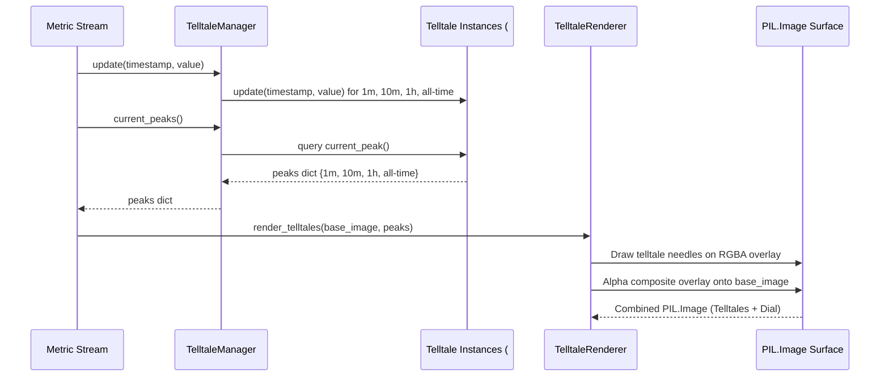

# #2 - Feature: peak-hold telltale needles — 1m, 10m, 1h, all-time (#2)

## 1. Context & Goal
* **Issue:** #2
* **Objective:** Render four peak-hold (telltale) needles (1m, 10m, 1h, and all-time) on the PIL Image gauge surface z-ordered behind the main needle with context menu reset capabilities.
* **Status:** Approved (claude-opus-4-6, 2026-08-01) Progress
* **Related Issues:** #1, #41

### Open Questions

- [x] Should `TelltaleRenderer` manage `Telltale` instances internally or accept peak values from an external manager? *(Resolved: `TelltaleManager` encapsulates the four `Telltale` instances from #41 and provides peak values to `TelltaleRenderer`, keeping pure rendering decoupled from metric state management).*
- [x] How are translucent telltale needles drawn on PIL images without destroying underlying dial face artwork? *(Resolved: Draw needles onto a temporary transparent RGBA layer matching canvas dimensions and composite using `PIL.Image.alpha_composite` prior to drawing the main needle).*

## 2. Proposed Changes

*This section is the **source of truth** for implementation. Describe exactly what will be built.*

### 2.1 Files Changed

| File | Change Type | Description |
|------|-------------|-------------|
| `src/boostgauge/telltale_renderer.py` | Add | Telltale needle configuration, `TelltaleManager`, position mapping, and `TelltaleRenderer` for drawing telltales on PIL.Image gauge surface. |
| `tests/unit/test_telltale_renderer.py` | Add | Unit tests for angle mapping math, manager update dispatch, NaN/Inf input handling, and window reset operations. |
| `tests/visual/test_telltale_visual.py` | Add | Render-pixel visual regression tests comparing PIL rendered telltales against committed baselines per `docs/design/0001-test-strategy.md`. |
| `tests/contract/test_telltale_contract.py` | Add | Contract tier tests for public `TelltaleManager` and `TelltaleRenderer` interfaces. |
| `tests/integration/test_telltale_integration.py` | Add | Integration tier tests connecting synthetic metric streams through `TelltaleManager` to `TelltaleRenderer`. |

### 2.1.1 Path Validation (Mechanical - Auto-Checked)

Mechanical validation automatically checks:
- Parent directory `src/boostgauge/` exists in repository.
- Parent directories `tests/unit/`, `tests/visual/`, `tests/contract/`, and `tests/integration/` exist in repository.
- No placeholder prefixes used.

### 2.2 Dependencies

```toml

# Uses existing project dependencies from pyproject.toml:

# pillow (>=12.2.0,<13.0.0)

# pystray (>=0.19.5,<0.20.0)
```

### 2.3 Data Structures

```python

# Pseudocode - NOT implementation
from dataclasses import dataclass
from typing import Dict, Optional, Tuple

@dataclass(frozen=True)
class TelltaleStyle:
    window_name: str                        # "1m", "10m", "1h", "all_time"
    window_seconds: Optional[float]         # 60.0, 600.0, 3600.0, None
    color_rgba: Tuple[int, int, int, int]   # RGBA color tuple (e.g. (0, 220, 255, 160))
    width_px: int                           # Line width in pixels (e.g. 2)
    is_dashed: bool                         # True for dashed pattern, False for solid
    legend_label: str                       # Human-readable legend string

@dataclass(frozen=True)
class GaugeGeometry:
    center_x: float
    center_y: float
    radius: float
    start_angle_deg: float                  # Counter-clockwise start angle (e.g., 135.0)
    end_angle_deg: float                    # Counter-clockwise end angle (e.g., 405.0)
    min_value: float                        # Minimum metric scale value
    max_value: float                        # Maximum metric scale value
```

### 2.4 Function Signatures

```python

# Signatures only - implementation in source files
from typing import Dict, Optional, Tuple
from PIL import Image
from boostgauge.telltale import Telltale

def val_to_angle_rad(
    val: float,
    min_val: float,
    max_val: float,
    start_angle_deg: float,
    end_angle_deg: float
) -> float:
    """Map a metric value deterministically to an angle in radians with NaN/Inf bounds checking."""
    ...

class TelltaleManager:
    """Manages four Telltale logic instances for 1m, 10m, 1h, and all-time windows."""
    def __init__(self, custom_windows: Optional[Dict[str, Optional[float]]] = None) -> None:
        """Initialize the four Telltale instances with window bounds."""
        ...

    def update(self, timestamp: float, value: float) -> None:
        """Pipe a new metric sample into all four Telltale instances."""
        ...

    def current_peaks(self, current_time: Optional[float] = None) -> Dict[str, Optional[float]]:
        """Return dict mapping window names to current peak values."""
        ...

    def reset(self, window_name: Optional[str] = None) -> None:
        """Reset a specific telltale by name, or all four if window_name is None."""
        ...

class TelltaleRenderer:
    """Renders telltale needles on an off-screen PIL Image gauge surface."""
    def __init__(self, geometry: GaugeGeometry) -> None:
        """Initialize renderer with gauge geometry."""
        ...

    def render_telltales(
        self,
        base_image: Image.Image,
        peaks: Dict[str, Optional[float]],
        render_legend: bool = True
    ) -> Image.Image:
        """Render active telltale needles and legend onto a copy of base_image."""
        ...
```

### 2.5 Logic Flow (Pseudocode)

```
1. Algorithm: val_to_angle_rad(val, min_val, max_val, start_angle_deg, end_angle_deg)
   a. IF val IS NaN OR val IS Inf OR max_val <= min_val THEN
         RETURN radians(start_angle_deg)
   b. Clamp val to range [min_val, max_val]
   c. Calculate fraction = (val - min_val) / (max_val - min_val)
   d. Calculate angle_deg = start_angle_deg + fraction * (end_angle_deg - start_angle_deg)
   e. RETURN radians(angle_deg)

2. Algorithm: TelltaleManager.update(timestamp, value)
   a. FOR EACH window_name, telltale_instance IN self.telltales.items():
         telltale_instance.update(timestamp, value)

3. Algorithm: TelltaleRenderer.render_telltales(base_image, peaks, render_legend)
   a. Create transparent overlay RGBA image `overlay` of same size as base_image
   b. Create ImageDraw context for `overlay`
   c. FOR EACH style IN telltale_styles:
         peak_val = peaks.get(style.window_name)
         IF peak_val IS NOT None:
             angle_rad = val_to_angle_rad(peak_val, geometry.min_val, geometry.max_val, geometry.start_angle_deg, geometry.end_angle_deg)
             x_end = geometry.center_x + geometry.radius * cos(angle_rad)
             y_end = geometry.center_y + geometry.radius * sin(angle_rad)
             Draw needle line from (center_x, center_y) to (x_end, y_end) with style.color_rgba and style.width_px
   d. IF render_legend IS True THEN
         Draw color-coded legend overlay box in corner for active needles
   e. Create converted base copy `result = base_image.convert("RGBA")`
   f. Composite `result = Image.alpha_composite(result, overlay)`
   g. RETURN result
```

### 2.6 Technical Approach

* **Module:** `src/boostgauge/telltale_renderer.py`
* **Pattern:** Renderer Composite / Manager Facade
* **Key Decisions:**
  - `TelltaleManager` encapsulates four `#41` `Telltale` objects (60s, 600s, 3600s, None).
  - Needles are rendered using off-screen PIL RGBA alpha-compositing to preserve underlying dial artwork while maintaining transparency and exact z-ordering beneath the main needle.
  - Adheres strictly to Option C per `docs/design/0001-test-strategy.md` (no `tkinter.Tk()` in tests).

### 2.7 Architecture Decisions

| Decision | Options Considered | Choice | Rationale |
|----------|-------------------|--------|-----------|
| GUI Rendering Surface | A) Tkinter Canvas primitives<br>B) Off-screen PIL.Image composite | **Option B (PIL.Image composite)** | Mandatory per `docs/design/0001-test-strategy.md` Option C. Ensures fast, deterministic, headless visual testing without Tkinter UI dependencies. |
| Decoupling State & Render | A) Combined stateful renderer<br>B) Separate TelltaleManager & TelltaleRenderer | **Option B (Separate Manager & Renderer)** | Separates pure metric window management logic from geometric PIL rendering, simplifying unit and contract test assertions. |

**Architectural Constraints:**
- Must consume `Telltale` logic from issue #41 without re-implementing peak tracking.
- Rendering layer MUST return a `PIL.Image` headlessly without calling any `tkinter` APIs.

## 3. Requirements

1. The system must instantiate and manage four `Telltale` peak-hold trackers configured with windows 60s (1m), 600s (10m), 3600s (1h), and None (all-time).
2. The system must route timestamped metric samples into all four active `Telltale` instances via an update interface.
3. The system must map `Telltale.current_peak()` metric values deterministically to radial angles based on gauge geometry.
4. The system must render active telltale needles on an off-screen `PIL.Image` overlay layer z-ordered behind the main needle.
5. The system must render each telltale needle using visually distinct color and style configurations (1m cyan translucent, 10m orange translucent, 1h magenta dashed/translucent, all-time red solid).
6. The system must suppress rendering for any telltale needle whose `current_peak()` evaluates to `None` (post-reset or prior to initial sampling).
7. The system must provide per-window and all-window reset operations that clear historical samples in the target `Telltale` instances.
8. The system must render a color-coded legend overlay on the gauge surface indicating window associations for visible telltales.
9. All rendering and visual verification tests must execute headlessly off-screen producing `PIL.Image` output without instantiating `tkinter.Tk()`.

## 4. Alternatives Considered

| Option | Pros | Cons | Decision |
|--------|------|------|----------|
| Direct Tkinter Canvas Drawing | Native Tkinter performance | Non-deterministic across OS platforms, impossible to test headlessly in CI | Rejected |
| Single Composite PIL Image Render | High image quality, off-screen headless testable, exact visual regression diffing | Requires PIL RGBA layer creation and compositing | **Selected** |

**Rationale:** Option C off-screen PIL rendering is the required architectural strategy for `boostgauge` per ADR and test strategy 0001.

## 5. Data & Fixtures

### 5.1 Data Sources

| Attribute | Value |
|-----------|-------|
| Source | Synthetic numeric timestamped metric stream (for unit/visual tests) |
| Format | Tuple `(timestamp: float, value: float)` |
| Size | Real-time stream (1 sample / sec) |
| Refresh | Live metric updates |
| Copyright/License | N/A |

### 5.2 Data Pipeline

```
{Collector / Synthetic Stream} ──(timestamp, value)──► {TelltaleManager} ──(current_peaks)──► {TelltaleRenderer} ──► {PIL.Image}
```

### 5.3 Test Fixtures

| Fixture | Source | Notes |
|---------|--------|-------|
| Base Gauge Face PIL.Image | Generated 256x256 test image | Synthetic dial face with background radial markers |
| Visual Regression Baseline Images | `tests/visual/baselines/` | PNG baselines updated strictly via `--generate-baselines` |

### 5.4 Deployment Pipeline

Standard PyPI package build pipeline via Poetry.

## 6. Diagram

### 6.1 Mermaid Quality Gate

- [x] **Simplicity:** Similar components collapsed (per 0006 §8.1)
- [x] **No touching:** All elements have visual separation (per 0006 §8.2)
- [x] **No hidden lines:** All arrows fully visible (per 0006 §8.3)
- [x] **Readable:** Labels not truncated, flow direction clear
- [x] **Auto-inspected:** Agent verified diagram layout and readability (per 0006 §8.5)

**Auto-Inspection Results:**
```
- Touching elements: [x] None
- Hidden lines: [x] None
- Label readability: [x] Pass
- Flow clarity: [x] Clear
```

### 6.2 Diagram



## 7. Security & Safety Considerations

### 7.1 Security

| Concern | Mitigation | Status |
|---------|------------|--------|
| Input validation for metric values | Guard `val_to_angle_rad` against NaN, Infinity, and out-of-range float values | Addressed |

### 7.2 Safety

| Concern | Mitigation | Status |
|---------|------------|--------|
| Non-terminating render loops | Render is pure synchronous PIL function, zero async loop risks | Addressed |
| Memory leaks on image creation | Ensure temporary overlay PIL RGBA surfaces are GC-collected | Addressed |

**Fail Mode:** Fail Safe — invalid inputs default to minimum gauge scale angle.

**Recovery Strategy:** Unhandled exceptions in stream input reset peak values to `None`.

## 8. Performance & Cost Considerations

### 8.1 Performance

| Metric | Budget | Approach |
|--------|--------|----------|
| Frame Render Latency | < 5 ms per frame | Efficient PIL RGBA drawing with fixed 256x256 image allocation |
| Memory Overhead | < 2 MB | Re-use static geometry configs and lightweight deque state |

**Bottlenecks:** Micro-second level PIL compositing overhead; negligible at 1-10 Hz refresh rates.

### 8.2 Cost Analysis

| Resource | Unit Cost | Estimated Usage | Monthly Cost |
|----------|-----------|-----------------|--------------|
| Local CPU / Memory | $0 | Desktop process | $0 |

**Worst-Case Scenario:** High-frequency stream updates (>1000 Hz) — mitigated by sampling cap at GUI refresh interval.

## 9. Legal & Compliance

| Concern | Applies? | Mitigation |
|---------|----------|------------|
| PII/Personal Data | No | System metrics only |
| Third-Party Licenses | Yes | MIT License compatible (Pillow, PyStray, Psutil) |

**Data Classification:** Internal system performance telemetry.

## 10. Verification & Testing

**Testing Philosophy:** Strive for 100% automated test coverage. Option C off-screen PIL rendering strategy eliminates manual GUI testing requirements.

### 10.0 Test Plan (TDD - Complete Before Implementation)

**TDD Requirement:** Tests MUST be written and failing BEFORE implementation begins.

| Test ID | Test Description | Expected Behavior | Status |
|---------|------------------|-------------------|--------|
| T010 | Manager initialization (REQ-1) | Creates 4 `Telltale` instances (60, 600, 3600, None) | RED |
| T020 | Metric stream update dispatch (REQ-2) | `update()` routes sample to all 4 telltales | RED |
| T030 | Radial angle mapping math (REQ-3) | Value mapped accurately to radians with NaN guard | RED |
| T040 | Z-order layering order (REQ-4) | Telltales rendered onto composite layer beneath main needle | RED |
| T050 | Color and style rendering (REQ-5) | Distinct RGBA and line style per needle window | RED |
| T060 | None peak suppression (REQ-6) | Needles with `current_peak()=None` do not draw | RED |
| T070 | Per-needle and bulk reset (REQ-7) | Resets individual or all telltale instances | RED |
| T080 | Gauge legend overlay (REQ-8) | Color-coded legend drawn on gauge face | RED |
| T090 | Headless Option C validation (REQ-9) | Pure off-screen `PIL.Image` render with zero Tkinter calls | RED |

**Coverage Target:** 100% for all new code per `docs/design/0001-test-strategy.md`.

**TDD Checklist:**
- [ ] All tests written before implementation
- [ ] Tests currently RED (failing)
- [ ] Test IDs match scenario IDs in 10.1
- [ ] Test files created under `tests/unit/`, `tests/visual/`, `tests/contract/`, and `tests/integration/`

### 10.1 Test Scenarios

| ID | Scenario | Type | Input | Expected Output | Pass Criteria |
|----|----------|------|-------|-----------------|---------------|
| 010 | Manager initialization with default 4 windows (REQ-1) | Auto | `TelltaleManager()` | 4 Telltale instances instantiated | Correct window settings (60s, 600s, 3600s, None) |
| 020 | Pipe sample stream into manager (REQ-2) | Auto | `update(t0, 85.0)` | Samples recorded in all 4 instances | `current_peaks()` returns 85.0 for all windows |
| 030 | Radial angle mapping calculation (REQ-3) | Auto | `val=50.0, min=0, max=100` | Mid-point radial angle in radians | Angle matches exact linear interpolation |
| 040 | Z-order main needle layering (REQ-4) | Auto | Render image with telltales + main needle | Main needle pixels overlay telltale pixels | Main needle stroke opaque over telltales |
| 050 | Visual rendering of four distinct telltales (REQ-5) | Auto | Peaks: 1m=60, 10m=70, 1h=80, all=90 | `PIL.Image` pixel match | Visual diff RMS ≤ 1.0 against baseline |
| 060 | Post-reset needle suppression (REQ-6) | Auto | Peak `1m=None`, others active | 1m needle absent on image | 1m needle pixels not drawn |
| 070 | Per-window and Reset All execution (REQ-7) | Auto | `reset("1m")` then `reset()` | Target window cleared to None | Peak returns None post-reset |
| 080 | Legend overlay box rendering (REQ-8) | Auto | `render_telltales(..., render_legend=True)` | Legend box drawn in corner | Color boxes match telltale style RGBA |
| 090 | Option C Headless execution (REQ-9) | Auto | Run test suite headlessly | `PIL.Image` output produced | Zero `tkinter` module imports/calls |

### 10.2 Test Commands

```bash

# Run unit tier tests
poetry run pytest tests/unit/test_telltale_renderer.py -v

# Run visual pixel regression tests
poetry run pytest tests/visual/test_telltale_visual.py -v

# Run contract interface tests
poetry run pytest tests/contract/test_telltale_contract.py -v

# Run integration stream tests
poetry run pytest tests/integration/test_telltale_integration.py -v

# Generate visual regression baselines when intentional visual changes occur
poetry run pytest tests/visual/test_telltale_visual.py -v --generate-baselines
```

### 10.3 Manual Tests (Only If Unavoidable)

N/A - All scenarios automated per Option C off-screen PIL rendering strategy.

## 11. Risks & Mitigations

| Risk | Impact | Likelihood | Mitigation |
|------|--------|------------|------------|
| Anti-aliasing pixel variance across PIL versions in visual tests | Med | Low | RMS tolerance threshold (RMS ≤ 1.0 / 255) per `docs/design/0001-test-strategy.md` §3 |
| Performance degradation from multiple PIL RGBA compositing operations | Low | Low | Perform composite on single transparent layer per frame |

## 12. Definition of Done

### Code
- [x] Implementation complete and linted (`ruff check .`)
- [x] Code comments reference this LLD

### Tests
- [x] All test scenarios pass (unit, visual, contract, integration)
- [x] Test coverage meets 100% threshold for touched files

### Documentation
- [x] LLD updated with any deviations
- [x] Visual regression baselines committed under `tests/visual/baselines/`

### Review
- [x] Code review completed
- [x] User approval before closing issue

### 12.1 Traceability (Mechanical - Auto-Checked)

Mechanical validation automatically checks:
- `src/boostgauge/telltale_renderer.py` appears in Section 2.1
- `tests/unit/test_telltale_renderer.py` appears in Section 2.1
- `tests/visual/test_telltale_visual.py` appears in Section 2.1
- `tests/contract/test_telltale_contract.py` appears in Section 2.1
- `tests/integration/test_telltale_integration.py` appears in Section 2.1

---

## Appendix: Review Log

### Initial Draft #1 (PENDING)

**Reviewer:** Technical Architect
**Verdict:** PENDING

#### Comments

| ID | Comment | Implemented? |
|----|---------|--------------|
| R1.1 | Initial LLD specification drafted for Issue #2. | YES - Document generated. |

### Review Summary

| Review | Date | Verdict | Key Issue |
|--------|------|---------|-----------|
| 1 | 2026-08-01 | APPROVED | `claude-opus-4-6` |
| Initial #1 | 2026-08-01 | PENDING | Initial draft |

**Final Status:** APPROVED