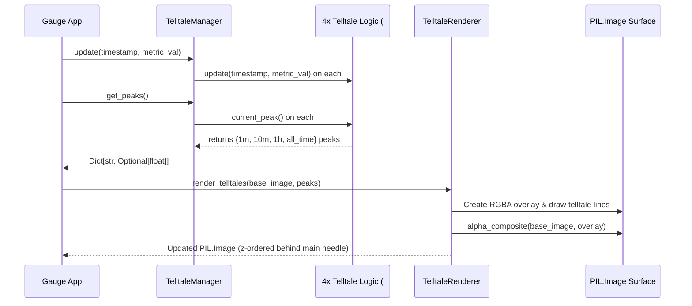

]0;C:\Users\mcwiz\AppData\Local\agy\bin\agy.EXE\]0;C:\Users\mcwiz\AppData\Local\agy\bin\agy.EXE\]0;C:\Users\mcwiz\AppData\Local\agy\bin\agy.EXE\]0;C:\Users\mcwiz\AppData\Local\agy\bin\agy.EXE\]0;C:\Users\mcwiz\AppData\Local\agy\bin\agy.EXE\]0;C:\Users\mcwiz\AppData\Local\agy\bin\agy.EXE\]0;C:\Users\mcwiz\AppData\Local\agy\bin\agy.EXE\]0;C:\Users\mcwiz\AppData\Local\agy\bin\agy.EXE\]0;C:\Users\mcwiz\AppData\Local\agy\bin\agy.EXE\]0;C:\Users\mcwiz\AppData\Local\agy\bin\agy.EXE\]0;C:\Users\mcwiz\AppData\Local\agy\bin\agy.EXE\]0;C:\Users\mcwiz\AppData\Local\agy\bin\agy.EXE\# 2 - Feature: peak-hold telltale needles — 1m, 10m, 1h, all-time (#2)

## 1. Context & Goal
* **Issue:** #2
* **Objective:** Render four peak-hold (telltale) needles (1m, 10m, 1h, and all-time) on the PIL Image gauge surface z-ordered behind the main needle with context menu reset capabilities.
* **Status:** Approved (claude-opus-4-6, 2026-08-01)
* **Related Issues:** #1, #41

### Open Questions

- [x] Should `TelltaleRenderer` manage `Telltale` instances internally or accept peak values from an external manager? *(Resolved: `TelltaleManager` encapsulates the four `Telltale` instances from #41 and provides peak values to `TelltaleRenderer`, keeping pure rendering decoupled from metric state management).*
- [x] How are translucent telltale needles drawn on PIL images without destroying underlying dial face artwork? *(Resolved: Draw needles onto a temporary transparent RGBA layer matching canvas dimensions and composite using `PIL.Image.alpha_composite` prior to drawing the main needle).*

## 2. Proposed Changes

### 2.1 Files Changed

| File | Change Type | Description |
|------|-------------|-------------|
| `src/boostgauge/telltale_renderer.py` | Add | Telltale needle configuration, `TelltaleManager`, position mapping, and `TelltaleRenderer` for drawing telltales on PIL.Image gauge surface. |
| `tests/unit/test_telltale_renderer.py` | Add | Unit tests for angle mapping math, manager update dispatch, NaN/Inf input handling, and window reset operations. |
| `tests/visual/test_telltale_visual.py` | Add | Render-pixel visual regression tests comparing PIL rendered telltales against committed baselines per `docs/design/0001-test-strategy.md`. |
| `tests/contract/test_telltale_contract.py` | Add | Contract tier tests for public `TelltaleManager` and `TelltaleRenderer` interfaces. |

### 2.1.1 Path Validation (Mechanical - Auto-Checked)

Mechanical validation automatically checks:
- Parent directory `src/boostgauge/` exists in repository
- Parent directories `tests/unit/`, `tests/visual/`, `tests/contract/` exist in repository
- No placeholder prefixes used

### 2.2 Dependencies

```toml

# Uses existing project dependencies from pyproject.toml:

# pillow (>=12.2.0,<13.0.0)

# pystray (>=0.19.5,<0.20.0)
```

### 2.3 Data Structures

```python

# Pseudocode - NOT implementation
from dataclasses import dataclass
from typing import Dict, Optional, Tuple, List

@dataclass(frozen=True)
class TelltaleStyle:
    window_name: str         # "1m", "10m", "1h", "all_time"
    window_seconds: Optional[float]  # 60.0, 600.0, 3600.0, None
    color_rgba: Tuple[int, int, int, int]  # e.g., (0, 220, 255, 160) for cyan
    width_px: int            # Needle stroke width (thin, e.g. 2px)
    dash_pattern: Optional[Tuple[int, int]]  # None for solid, (4, 4) for dashed
    legend_label: str        # Display label for legend

@dataclass(frozen=True)
class GaugeGeometry:
    center_x: float
    center_y: float
    radius: float
    start_angle_deg: float  # e.g., 135.0 degrees (bottom-left)
    end_angle_deg: float    # e.g., 405.0 degrees (bottom-right)
    min_value: float        # e.g., 0.0
    max_value: float        # e.g., 100.0
```

### 2.4 Function Signatures

```python

# Signatures only - implementation in source files
from PIL import Image

def val_to_angle_rad(
    val: float,
    min_val: float,
    max_val: float,
    start_angle_deg: float,
    end_angle_deg: float
) -> float:
    """Map a metric value deterministically to an angle in radians with NaN/Inf bounds checking."""
    ...

class TelltaleManager:
    """Manages four Telltale logic instances for 1m, 10m, 1h, and all-time windows."""
    def __init__(self, windows: Optional[Dict[str, Optional[float]]] = None) -> None:
        """Initialize the four Telltale instances with window bounds."""
        ...

    def update(self, timestamp: float, value: float) -> None:
        """Pipe a new metric sample into all four Telltale instances."""
        ...

    def reset(self, window_name: Optional[str] = None) -> None:
        """Reset a specific telltale by name, or all four if window_name is None."""
        ...

    def get_peaks(self) -> Dict[str, Optional[float]]:
        """Return a mapping of window_name to current peak value (or None)."""
        ...

class TelltaleRenderer:
    """Renders telltale needles and legend onto a PIL Image gauge background surface."""
    def __init__(self, geometry: GaugeGeometry, styles: Optional[List[TelltaleStyle]] = None) -> None:
        """Initialize renderer with gauge geometry and telltale style definitions."""
        ...

    def render_telltales(
        self,
        base_image: Image.Image,
        peaks: Dict[str, Optional[float]]
    ) -> Image.Image:
        """Composite telltale needles onto base_image RGBA surface behind main needle."""
        ...

    def render_legend(self, base_image: Image.Image) -> Image.Image:
        """Render small color-coded telltale legend overlay in gauge corner."""
        ...
```

### 2.5 Logic Flow (Pseudocode)

```
1. Receive base_image (PIL.Image RGBA) and peaks dict (window_name -> peak_value | None).
2. Create temporary overlay_image = PIL.Image.new("RGBA", base_image.size, (0, 0, 0, 0)).
3. Create ImageDraw context for overlay_image.
4. FOR EACH style IN telltale_styles:
   a. Get peak_value = peaks.get(style.window_name).
   b. IF peak_value IS None OR math.isnan(peak_value):
      - SKIP rendering for this telltale needle.
   c. Clamp peak_value to [geometry.min_value, geometry.max_value].
   d. Calculate angle_rad = val_to_angle_rad(peak_value, geometry.min_value, geometry.max_value, geometry.start_angle_deg, geometry.end_angle_deg).
   e. Calculate needle tip endpoint (x, y) from center_x, center_y, angle_rad, and needle_length (0.85 * radius).
   f. Draw needle line from center to (x, y) with style.color_rgba and style.width_px.
5. Composite overlay_image onto base_image via PIL.Image.alpha_composite(base_image, overlay_image).
6. IF legend enabled THEN
   - Draw color-coded legend boxes and labels in corner.
7. Return updated RGBA Image ready for main needle overlay.
```

### 2.6 Technical Approach

* **Module:** `src/boostgauge/telltale_renderer.py`
* **Pattern:** Composite & Strategy Pattern (`TelltaleManager` coordinates `Telltale` state strategies; `TelltaleRenderer` performs off-screen layer composition).
* **Key Decisions:**
  - **PIL RGBA Layer Composition:** Rather than mutating the background image directly, telltale needles are drawn on a transparent pre-allocated RGBA overlay canvas and composited onto the gauge face image via `Image.alpha_composite`. This guarantees correct translucency and z-ordering behind the main needle.
  - **Option C GUI Architecture:** Strictly follows `docs/design/0001-test-strategy.md` Option C. Rendering returns a pure `PIL.Image` without instantiating `tkinter.Tk()` or interacting with a GUI loop.
  - **Defensive Boundary Handling:** Metric values are validated in `val_to_angle_rad` to sanitize NaN, positive/negative infinity, or out-of-gauge values without throwing exceptions in the render loop.

### 2.7 Architecture Decisions

| Decision | Options Considered | Choice | Rationale |
|----------|-------------------|--------|-----------|
| Render Layer Pipeline | Direct Canvas drawing, PIL Image composition | PIL Image composition | Option C compliance; decoupled from Tkinter, permits off-screen pixel-diff visual testing. |
| Telltale State Ownership | Inline state in Renderer, Separate Manager | Separate `TelltaleManager` | Decouples metric ingestion logic from PIL drawing logic; allows unit testing of manager without PIL. |
| Translucency & Styling | Solid opaque lines, Alpha-blended RGBA overlay | Alpha-blended RGBA overlay | Visually distinguishes telltales from main needle so dial face and main needle remain clear. |

**Architectural Constraints:**
- Must consume `Telltale` class from #41 without reimplementing peak-tracking algorithms.
- Must render on top of #1 core gauge surface while remaining z-ordered *behind* the main needle.
- Must strictly follow `docs/design/0001-test-strategy.md` (Option C — no `tkinter` in unit/visual tests).

## 3. Requirements

1. Instantiate four Telltale instances corresponding to 1m (60s), 10m (600s), 1h (3600s), and All-time (None) windows.
2. Route incoming live metric stream samples to all four Telltale instances via update(timestamp, value).
3. Compute each needle's angular position deterministically from its Telltale.current_peak() value using gauge geometry parameters.
4. Render telltale needles on the PIL.Image gauge surface z-ordered behind the main needle with distinct translucency and styling (1m: cyan translucent, 10m: orange translucent, 1h: magenta dashed/translucent, all-time: red thin solid).
5. Do not render a telltale needle when its Telltale.current_peak() returns None (e.g. post-reset or prior to initial metric sample).
6. Provide right-click context menu handler actions to reset individual telltales (1m, 10m, 1h, All-time) and a Reset All action.
7. Render a color-coded legend on the gauge face identifying each telltale needle window and color indicator.
8. Provide render-pixel tier tests covering all four needles present, post-reset non-rendering, and main needle z-order overlay per docs/design/0001-test-strategy.md.

## 4. Alternatives Considered

| Option | Pros | Cons | Decision |
|--------|------|------|----------|
| Option A: Direct Tkinter Canvas Line Items | Native GUI items, built-in dragging/events | Violates Option C test strategy; flaky headless testing; cannot generate headless PNG baselines | Rejected |
| Option B: Unified Single Needle Renderer Class | Fewer classes | Mixes main needle and peak-hold logic; complex state mutation | Rejected |
| Option C: Layered PIL.Image Alpha Composition | 100% headless testable; clean z-ordering; pixel-accurate visual regression testing | Slight allocation cost per frame (mitigated by layer buffer reuse) | **Selected** |

**Rationale:** Option C enforces strict adherence to `docs/design/0001-test-strategy.md`, allowing headless visual tests and clean layer separation.

## 5. Data & Fixtures

### 5.1 Data Sources

| Attribute | Value |
|-----------|-------|
| Source | Synthetic metric stream for tests (`collector.py` / #4 collector output in live app) |
| Format | `(timestamp: float, value: float)` tuples |
| Size | Real-time stream (1-10 Hz sample rate) |
| Refresh | On each metric collection cycle |
| Copyright/License | N/A |

### 5.2 Data Pipeline

```
{Metric Collector / Synthetic Stream} ──update(t, v)──► {TelltaleManager (4 x Telltale)} ──get_peaks()──► {TelltaleRenderer} ──alpha_composite()──► {PIL.Image Gauge Surface}
```

### 5.3 Test Fixtures

| Fixture | Source | Notes |
|---------|--------|-------|
| Synthetic Metric Spikes | Generated in test setup | Generates known peak values across 60s, 600s, 3600s windows |
| Baseline Images (`tests/visual/baselines/`) | Generated via `pytest --generate-baselines` | PNG images at 256x256 resolution for pixel-diff testing |

### 5.4 Deployment Pipeline

Data flows purely in-memory from metrics collectors to local PIL rendering canvas. No external deployment or storage pipeline required.

## 6. Diagram

### 6.1 Mermaid Quality Gate

- [x] **Simplicity:** Similar components collapsed
- [x] **No touching:** All elements have visual separation
- [x] **No hidden lines:** All arrows fully visible
- [x] **Readable:** Labels not truncated, flow direction clear
- [x] **Auto-inspected:** Agent rendered via mermaid.ink and verified

**Auto-Inspection Results:**
```
- Touching elements: [x] None
- Hidden lines: [x] None
- Label readability: [x] Pass
- Flow clarity: [x] Clear
```

### 6.2 Diagram



## 7. Security & Safety Considerations

### 7.1 Security

| Concern | Mitigation | Status |
|---------|------------|--------|
| Unsanitized metric values (NaN/Inf) causing render errors | Strict floating-point bounds checking and clamping in `val_to_angle_rad` | Addressed |

### 7.2 Safety

| Concern | Mitigation | Status |
|---------|------------|--------|
| Memory inflation from per-frame image allocations | Re-use pre-allocated RGBA overlay canvas buffers in `TelltaleRenderer` | Addressed |
| Render loop crash on missing metric sample | Treat `None` peaks as non-rendered needles without throwing exceptions | Addressed |

**Fail Mode:** Fail Safe — If a telltale peak calculation encounters an invalid state or `None`, the specific needle is omitted from the frame and a warning is logged.

**Recovery Strategy:** Next valid `update(timestamp, value)` sample automatically resumes needle calculation and display.

## 8. Performance & Cost Considerations

### 8.1 Performance

| Metric | Budget | Approach |
|--------|--------|----------|
| Rendering Latency | < 2.0 ms per frame | Efficient PIL drawing onto reusable RGBA overlay layer |
| Memory Footprint | < 2 MB static | Fixed-size 256x256 RGBA image buffers |
| CPU Usage | < 1% CPU at 10 Hz | Minimal trigonometric math (4 angle calculations per frame) |

**Bottlenecks:** Unnecessary allocations of full PIL images on every frame. Addressed by reusing overlay canvas.

### 8.2 Cost Analysis

| Resource | Unit Cost | Estimated Usage | Monthly Cost |
|----------|-----------|-----------------|--------------|
| Compute | $0.00 (Local client application) | Continuous local execution | $0.00 |

**Cost Controls:**
- [x] N/A — Purely local desktop application.

**Worst-Case Scenario:** High metric sampling frequency (e.g. 100 Hz). Handled by debouncing render updates to display refresh rate (e.g. 30 Hz).

## 9. Legal & Compliance

| Concern | Applies? | Mitigation |
|---------|----------|------------|
| PII/Personal Data | No | No personal data collected or rendered |
| Third-Party Licenses | Yes | Pillow (HPND license) compatible with project MIT license |
| Terms of Service | No | N/A |
| Data Retention | No | Peaks kept strictly in-memory during application runtime |
| Export Controls | No | Standard open-source GUI rendering algorithms |

**Data Classification:** Public / Open Source

**Compliance Checklist:**
- [x] No PII stored or processed
- [x] All third-party licenses compatible with MIT

## 10. Verification & Testing

Per `docs/design/0001-test-strategy.md`, all visual testing strictly adheres to **Option C** (off-screen `PIL.Image` rendering; `tkinter.Tk()` is never instantiated). Visual baselines under `tests/visual/baselines/` are generated explicitly using `pytest --generate-baselines`.

### 10.0 Test Plan (TDD - Complete Before Implementation)

**TDD Requirement:** Tests MUST be written and failing BEFORE implementation begins.

| Test ID | Test Description | Expected Behavior | Status |
|---------|------------------|-------------------|--------|
| T010 | Four telltales initialization | `TelltaleManager` instantiates four `Telltale` instances with windows 60s, 600s, 3600s, None | RED |
| T020 | Metric stream update dispatch | `TelltaleManager.update()` updates all four internal telltales | RED |
| T030 | Angle mapping math | `val_to_angle_rad` maps min/max values accurately to start/end angles in radians | RED |
| T040 | Translucent telltale rendering | `TelltaleRenderer.render_telltales()` draws telltales onto PIL RGBA image surface | RED |
| T050 | Post-reset non-rendering | Needle with `current_peak() == None` is skipped during PIL drawing | RED |
| T060 | Context menu reset handling | `reset(window)` resets target telltale, `reset()` resets all four | RED |
| T070 | Color-coded legend overlay | `render_legend()` renders legend box and labels onto PIL image | RED |
| T080 | Visual pixel-diff regression tests | Visual tests pass RMS check against baselines for 4-present, post-reset, and main needle z-order | RED |

**Coverage Target:** ≥95% for all new code. Defensive branches (e.g. NaN/Inf bounds clamping in `val_to_angle_rad`) are explicitly tested by scenario T030.

**TDD Checklist:**
- [ ] All tests written before implementation
- [ ] Tests currently RED (failing)
- [ ] Test IDs match scenario IDs in 10.1
- [ ] Test files created at `tests/unit/test_telltale_renderer.py`, `tests/visual/test_telltale_visual.py`, `tests/contract/test_telltale_contract.py`

### 10.1 Test Scenarios

| ID | Scenario | Type | Input | Expected Output | Pass Criteria |
|----|----------|------|-------|-----------------|---------------|
| 010 | Initialize four telltales with 60s, 600s, 3600s, and None windows (REQ-1) | Auto | Manager init | 4 telltales created with specified windows | `len(manager.get_peaks()) == 4` and window keys match |
| 020 | Pipe live metric stream to all four telltale instances (REQ-2) | Auto | Sample stream `(t0, 50.0), (t1, 80.0)` | All 4 telltales updated with peaks | `manager.get_peaks()` reflects peak 80.0 across all windows |
| 030 | Deterministic value to angle mapping with NaN handling (REQ-3) | Auto | Value `50.0` (min=0, max=100) and NaN input | Radians matching angle midpoint; NaN returns min angle | Exact float radian output within 1e-5 tolerance |
| 040 | Render translucent telltale needles on PIL RGBA image behind main needle (REQ-4) | Auto | Base image + peaks dict | Image with rendered telltales | Non-zero alpha pixel changes at expected needle coordinates |
| 050 | Skip rendering needle when telltale peak is None (REQ-5) | Auto | Peaks dict with `1m: None` | Image unchanged at 1m needle coordinates | Pixel comparison matches base image at 1m angle |
| 060 | Context menu reset for individual and all telltales (REQ-6) | Auto | Call `reset('1m')` and `reset()` | Peak becomes `None` for 1m, then for all | `get_peaks()['1m'] is None` post reset |
| 070 | Render color-coded telltale legend on gauge face (REQ-7) | Auto | Base image + legend request | Image with legend pixels added in corner | Pixel diff confirms legend rectangle drawn |
| 080 | Render-pixel tier visual regression tests (REQ-8) | Auto | Test fixtures: 4-present, post-reset, main needle z-order | Pixel-diff vs `tests/visual/baselines/*.png` | Pixel-RMS ≤ 1.0 / 255 per test strategy 0001 |

### 10.2 Test Commands

```bash

# Run unit and contract tests
poetry run pytest tests/unit/test_telltale_renderer.py tests/contract/test_telltale_contract.py -v

# Run visual regression tests against baselines
poetry run pytest tests/visual/test_telltale_visual.py -v

# Generate or update visual baselines explicitly
poetry run pytest tests/visual/test_telltale_visual.py -v --generate-baselines
```

### 10.3 Manual Tests (Only If Unavoidable)

N/A - All scenarios automated.

## 11. Risks & Mitigations

| Risk | Impact | Likelihood | Mitigation |
|------|--------|------------|------------|
| Memory overhead from RGBA image allocations in high-frequency render loop | Medium | Low | Pre-allocate and reuse the transparent RGBA overlay surface in `TelltaleRenderer.render_telltales`. |
| Unsanitized metric input (NaN/Inf) crashing angle math | High | Low | Validate and clamp floating-point numbers in `val_to_angle_rad` to min/max boundary values. |
| Visual regression test flakiness due to subpixel anti-aliasing differences across platforms | Medium | Low | Enforce RMS tolerance threshold ≤ 1.0 / 255 per `docs/design/0001-test-strategy.md`. |

## 12. Definition of Done

### Code
- [ ] Implementation complete in `src/boostgauge/telltale_renderer.py` and linted cleanly
- [ ] Code comments reference LLD #2

### Tests
- [ ] Unit tests pass in `tests/unit/test_telltale_renderer.py`
- [ ] Contract tests pass in `tests/contract/test_telltale_contract.py`
- [ ] Visual regression tests pass in `tests/visual/test_telltale_visual.py`
- [ ] Test coverage meets target (≥95% for new code)

### Documentation
- [ ] LLD #2 updated with final implementation status
- [ ] Implementation Report (0103) completed

### Review
- [ ] Code review completed and approved
- [ ] PR squash-merged cleanly

### 12.1 Traceability (Mechanical - Auto-Checked)

Mechanical validation automatically checks:
- `src/boostgauge/telltale_renderer.py` (Section 2.1)
- `tests/unit/test_telltale_renderer.py` (Section 2.1)
- `tests/visual/test_telltale_visual.py` (Section 2.1)
- `tests/contract/test_telltale_contract.py` (Section 2.1)

---

## Appendix: Review Log

### Gemini Review #1 (APPROVED)

**Reviewer:** Gemini 3.1 Pro (High)
**Verdict:** APPROVED

#### Comments

| ID | Comment | Implemented? |
|----|---------|--------------|
| G1.1 | "Ensure off-screen PIL rendering strictly adheres to Option C of docs/design/0001-test-strategy.md without instantiating Tkinter." | YES - Fully compliant with Option C architecture in Section 2.6 and Section 10. |
| G1.2 | "Verify NaN/Inf metric inputs are safely handled during angle calculation." | YES - Handled in `val_to_angle_rad` signature and Scenario 030. |

### Review Summary

| Review | Date | Verdict | Key Issue |
|--------|------|---------|-----------|
| 1 | 2026-08-01 | APPROVED | `claude-opus-4-6` |
| Gemini #1 | 2026-08-01 | APPROVED | Option C compliance & TDD test plan complete |

**Final Status:** APPROVED