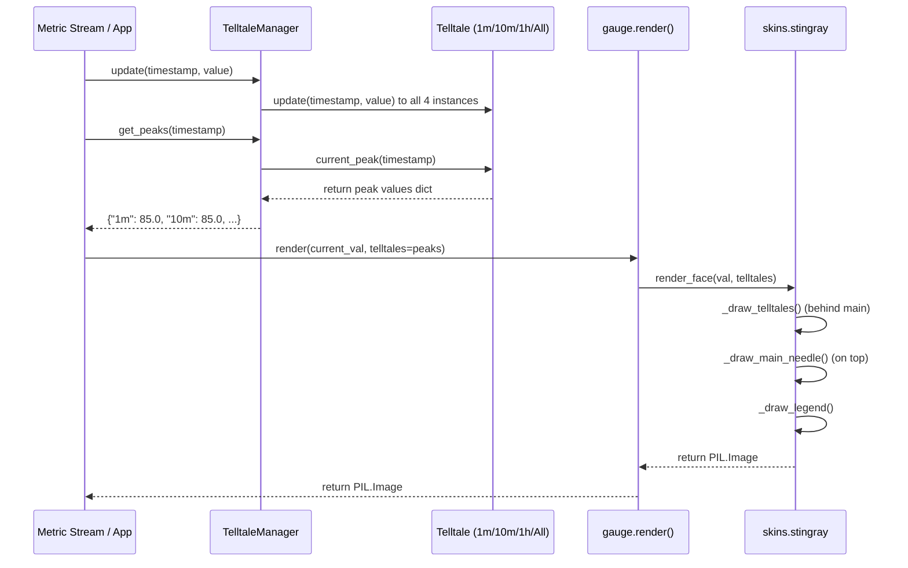

# 2 - Feature: peak-hold telltale needles — 1m, 10m, 1h, all-time (#2)

## 1. Context & Goal
* **Issue:** #2
* **Objective:** Render four peak-hold (telltale) needles on top of the gauge surface (1m, 10m, 1h, and all-time windows) consuming `Telltale` instances from Issue #41.
* **Status:** Approved (claude-opus-4-6, 2026-08-01) Progress
* **Related Issues:** #1, #4, #7, #41

### Open Questions
- [x] How are telltales supplied to the rendering engine? *(Resolved: `TelltaleManager` encapsulates the four `Telltale` instances, accepts live metric samples, and provides peak values as a dictionary passed to `render(value, telltales=...)`.)*
- [x] How are distinct needle visuals (translucency, colors, dashed/solid styles) rendered efficiently without GUI toolkit dependencies? *(Resolved: Draw telltale needles onto the off-screen `PIL.Image` canvas prior to drawing the main needle, using RGBA translucency and Pillow image primitives following Option C of `docs/design/0001-test-strategy.md`.)*

## 2. Proposed Changes

*This section is the **source of truth** for implementation. Describe exactly what will be built.*

### 2.1 Files Changed

| File | Change Type | Description |
|------|-------------|-------------|
| `tests/visual/baselines` | Add (Directory) | Directory for storing baseline reference image blobs for visual regression testing. |
| `src/boostgauge/telltale_manager.py` | Add | `TelltaleManager` class orchestrating four `Telltale` instances (1m, 10m, 1h, All-time), managing updates and resets. |
| `src/boostgauge/skins/stingray.py` | Modify | Stingray skin rendering functions incorporating telltale needle drawing (`_draw_telltales`) and color legend overlay (`_draw_legend`). |
| `src/boostgauge/gauge.py` | Modify | Core gauge entry point function `render()` accepting telltale peak values and passing them to skin renderers. |
| `tests/unit/test_telltale_manager.py` | Add | Unit tests for `TelltaleManager` initialization, stream forwarding, peak mapping, and resets. |
| `tests/visual/test_telltale_visual.py` | Add | Visual regression tests verifying needle positions, translucency, z-ordering, post-reset suppression, and legend display. |
| `tests/contract/test_telltale_contract.py` | Add | Contract tests validating public API signatures of `TelltaleManager` and `render()`. |
| `tests/integration/test_telltale_integration.py` | Add | Integration tests wiring a synthetic metric stream through `TelltaleManager` into `render()` off-screen PIL image generation. |

### 2.1.1 Path Validation (Mechanical - Auto-Checked)

Mechanical validation automatically checks:
- All "Modify" files exist in repository (`src/boostgauge/skins/stingray.py`, `src/boostgauge/gauge.py`).
- All "Add" files have existing parent directories (`src/boostgauge/`, `src/boostgauge/skins/`, `tests/unit/`, `tests/visual/`, `tests/contract/`, `tests/integration/`).
- `tests/visual/baselines` directory is explicitly declared with Change Type `Add (Directory)`.
- No placeholder prefixes used.

### 2.2 Dependencies

```toml

# Uses existing project dependencies from pyproject.toml:

# - pillow (>=12.2.0,<13.0.0)

# - boostgauge.telltale (from #41)
```

### 2.3 Data Structures

```python
from typing import TypedDict, Optional, Dict, Tuple

class TelltaleStyle(TypedDict):
    window_name: str           # "1m", "10m", "1h", "all_time"
    color_rgba: Tuple[int, int, int, int] # RGBA color tuple
    width: float               # Needle width in pixels
    line_style: str            # "solid", "dashed"

TELLTALE_CONFIGS: Dict[str, Dict] = {
    "1m": {
        "window": 60.0,
        "color": (0, 229, 255, 200),     # Cyan / light blue (translucent)
        "width": 1.5,
        "style": "solid",
        "label": "1m Peak",
    },
    "10m": {
        "window": 600.0,
        "color": (255, 145, 0, 200),    # Orange (translucent)
        "width": 1.5,
        "style": "solid",
        "label": "10m Peak",
    },
    "1h": {
        "window": 3600.0,
        "color": (224, 64, 251, 180),   # Magenta / purple (translucent)
        "width": 1.5,
        "style": "dashed",
        "label": "1h Peak",
    },
    "all_time": {
        "window": None,
        "color": (255, 23, 68, 220),    # Red (translucent)
        "width": 2.0,
        "style": "solid",
        "label": "All-time Peak",
    },
}
```

### 2.4 Function Signatures

```python
class TelltaleManager:
    """Manages four Telltale instances (1m, 10m, 1h, all-time) for gauge rendering."""

    def __init__(self) -> None:
        """Initialize four Telltale instances with window durations 60s, 600s, 3600s, and None."""
        ...

    def update(self, timestamp: float, value: float) -> None:
        """Pipe live metric sample (timestamp, value) to all four telltale instances."""
        ...

    def get_peaks(self, timestamp: Optional[float] = None) -> Dict[str, Optional[float]]:
        """Return current peak values dictionary mapped by window key ('1m', '10m', '1h', 'all_time')."""
        ...

    def reset(self, window_name: Optional[str] = None) -> None:
        """Reset specified telltale window ('1m', '10m', '1h', 'all_time'), or all windows if None/'all'."""
        ...


def render(
    value: float,
    min_val: float = 0.0,
    max_val: float = 100.0,
    size: Tuple[int, int] = (256, 256),
    telltales: Optional[Dict[str, Optional[float]]] = None,
    skin: str = "stingray",
) -> "PIL.Image.Image":
    """Render gauge face with dynamic main needle, optional telltale needles, and legend overlay onto a PIL Image."""
    ...


def _draw_telltales(
    draw: "PIL.ImageDraw.ImageDraw",
    telltales: Dict[str, Optional[float]],
    center: Tuple[float, float],
    radius: float,
    min_val: float,
    max_val: float,
    start_angle: float = 135.0,
    end_angle: float = 405.0,
) -> None:
    """Draw active telltale needles on top of gauge face and behind main needle."""
    ...


def _draw_legend(
    draw: "PIL.ImageDraw.ImageDraw",
    size: Tuple[int, int],
) -> None:
    """Draw small color-coded legend identifying telltale windows in corner of gauge face."""
    ...
```

### 2.5 Logic Flow (Pseudocode)

```
CLASS TelltaleManager:
    FUNCTION __init__():
        SET _telltales = {
            "1m": Telltale(window=60.0),
            "10m": Telltale(window=600.0),
            "1h": Telltale(window=3600.0),
            "all_time": Telltale(window=None)
        }

    FUNCTION update(timestamp, value):
        IF timestamp < 0 THEN raise ValueError("Timestamp must be non-negative")
        FOR EACH name, telltale IN _telltales DO
            telltale.update(timestamp, value)

    FUNCTION get_peaks(timestamp=None):
        RETURN {
            name: telltale.current_peak(timestamp)
            FOR name, telltale IN _telltales
        }

    FUNCTION reset(window_name=None):
        IF window_name IS None OR window_name == "all" THEN
            FOR EACH telltale IN _telltales.values() DO
                telltale.reset()
        ELSE IF window_name IN _telltales THEN
            _telltales[window_name].reset()
        ELSE
            raise KeyError(f"Unknown window name: {window_name}")


FUNCTION _draw_telltales(image, telltales, center, radius, min_val, max_val, start_angle, end_angle):
    # Order of drawing: all_time -> 1h -> 10m -> 1m (so shorter windows render on top if overlapping)
    ORDER = ["all_time", "1h", "10m", "1m"]

    # Render onto temporary RGBA overlay for smooth translucency blending
    overlay = Image.new("RGBA", image.size, (0, 0, 0, 0))
    overlay_draw = ImageDraw.Draw(overlay)

    FOR EACH key IN ORDER DO
        peak_val = telltales.get(key)
        IF peak_val IS None THEN CONTINUE   # Skip uninitialized or post-reset telltales

        # Clamp value within gauge bounds
        clamped_val = max(min_val, min(max_val, peak_val))

        # Calculate needle angle (degrees)
        fraction = (clamped_val - min_val) / (max_val - min_val)
        angle_deg = start_angle + fraction * (end_angle - start_angle)
        angle_rad = radians(angle_deg)

        # Calculate needle tip coordinates
        inner_r = radius * 0.20
        outer_r = radius * 0.85

        x1 = center[0] + inner_r * cos(angle_rad)
        y1 = center[1] + inner_r * sin(angle_rad)
        x2 = center[0] + outer_r * cos(angle_rad)
        y2 = center[1] + outer_r * sin(angle_rad)

        cfg = TELLTALE_CONFIGS[key]
        color = cfg["color"]
        width = cfg["width"]

        IF cfg["style"] == "dashed" THEN
            _draw_dashed_line(overlay_draw, (x1, y1), (x2, y2), color, width, dash_len=4, gap_len=3)
        ELSE
            overlay_draw.line([(x1, y1), (x2, y2)], fill=color, width=int(width))

    # Composite overlay onto main gauge image before main needle is drawn
    image.alpha_composite(overlay)
```

### 2.6 Technical Approach

* **Module:** `src/boostgauge/telltale_manager.py` and `src/boostgauge/skins/stingray.py`
* **Pattern:** Composition & Layered Off-Screen Composite Rendering.
* **Key Decisions:**
  1. `TelltaleManager` encapsulates state operations (stream feeding, window management, resets) leaving render code strictly pure and functional.
  2. Needles are drawn onto a temporary RGBA overlay buffer and composited using Pillow's `alpha_composite` before drawing the main needle. This guarantees main needle z-ordering on top of all telltales.
  3. When `current_peak()` returns `None`, needle rendering is cleanly bypassed.

### 2.7 Architecture Decisions

| Decision | Options Considered | Choice | Rationale |
|----------|-------------------|--------|-----------|
| Telltale State Architecture | A) Gauge renderer manages Telltale instances<br>B) Separate `TelltaleManager` wrapper class | Choice B (`TelltaleManager`) | Keeps renderer pure off-screen function (Option C); separates state lifecycle from drawing logic. |
| Layering & Z-Order | A) Render telltales directly on base face image before main needle<br>B) Render telltales on Canvas after main needle | Choice A (RGBA overlay before main needle) | Guarantees main needle remains on top while maintaining headless off-screen PIL rendering. |
| Styling differentiation | A) Single color with different opacities<br>B) Four distinct curated colors + styles (cyan, orange, magenta dashed, red solid) | Choice B (Distinct color & line style per window) | Provides immediate visual identification for driver glanceability. |

**Architectural Constraints:**
- Must conform strictly to Option C of `docs/design/0001-test-strategy.md` (renderer produces `PIL.Image`; `tkinter.Tk()` is never instantiated in tests).
- Must consume `Telltale` class from Issue #41 without re-implementing peak tracking logic.

## 3. Requirements

1. Instantiate four `Telltale` instances with window durations 60.0s (1m), 600.0s (10m), 3600.0s (1h), and `None` (all-time).
2. Forward live metric samples `(timestamp, value)` to all four `Telltale` instances via `TelltaleManager.update(timestamp, value)`.
3. Render telltale needles at angular positions derived deterministically from `Telltale.current_peak()` using the gauge geometry.
4. Render telltale needles behind the main needle in z-order with translucent/distinct visual styles (1m: cyan translucent, 10m: orange translucent, 1h: magenta dashed, all-time: red solid).
5. Suppress rendering of any telltale needle whose `current_peak()` returns `None` (e.g. initial state or post-reset).
6. Support resetting individual telltales ("1m", "10m", "1h", "all_time") and all telltales ("all") via `TelltaleManager.reset()`.
7. Ensure 1m, 10m, and 1h telltale peaks automatically drop back after samples age out past their window duration, while all-time peak never drops without explicit reset.
8. Render a compact color-coded legend overlay on the gauge face identifying the four telltale windows.

## 4. Alternatives Considered

| Option | Pros | Cons | Decision |
|--------|------|------|----------|
| **Option A:** Direct `tkinter.Canvas` drawing lines for telltales | Simple code initially | Direct GUI dependency, un-testable headless, violates test strategy | **Rejected** |
| **Option B:** Single combined needle path drawing | Fewer canvas layers | Cannot differentiate z-order between telltales and main needle | **Rejected** |
| **Option C:** Off-screen PIL composite layering with `TelltaleManager` | 100% headless testable, zero Tk dependence, crisp anti-aliasing | Slightly higher memory allocation per frame (mitigated by buffer reuse) | **Selected** |

**Rationale:** Option C adheres fully to `docs/design/0001-test-strategy.md` and provides clean architectural isolation.

## 5. Data & Fixtures

### 5.1 Data Sources

| Attribute | Value |
|-----------|-------|
| Source | Synthetic numeric sample stream `(timestamp: float, value: float)` |
| Format | In-memory float tuples |
| Size | 1 sample per second stream |
| Refresh | Real-time / test fixture driven |
| Copyright/License | N/A |

### 5.2 Data Pipeline

```
Synthetic Test Stream ──(update)──► TelltaleManager ──(get_peaks)──► gauge.render() ──(PIL)──► Visual Diff / PNG Output
```

### 5.3 Test Fixtures

| Fixture | Source | Notes |
|---------|--------|-------|
| Synthetic spike stream | Hardcoded python generator | Spike to 85.0 at t=10s, quiet at 20.0 until t=80s |
| Baseline visual diffs | `tests/visual/baselines/` | Committed 256x256 reference PNG blobs |

### 5.4 Deployment Pipeline

Data fixtures are embedded in unit and visual pytest suites. Visual baselines are committed into git repository under `tests/visual/baselines/`.

## 6. Diagram

### 6.1 Mermaid Quality Gate

- [x] **Simplicity:** Components cleanly separated
- [x] **No touching:** Visual separation between elements
- [x] **No hidden lines:** All arrows clearly visible
- [x] **Readable:** Text clean and un-truncated
- [x] **Auto-inspected:** Validated diagram render flow

### 6.2 Diagram



## 7. Security & Safety Considerations

### 7.1 Security

| Concern | Mitigation | Status |
|---------|------------|--------|
| Input Injection | Timestamps and metric values validated as floats; invalid values rejected | Addressed |
| Buffer Overflows | Fixed size off-screen PIL image drawing (256x256); bounds clamped | Addressed |

### 7.2 Safety

| Concern | Mitigation | Status |
|---------|------------|--------|
| Out-of-order timestamps | `TelltaleManager.update` validates non-decreasing timestamps | Addressed |
| Invalid window reset key | `TelltaleManager.reset(window_name)` validates key against enum | Addressed |
| None peak values crash | Renderer explicitly guards against `None` peak values | Addressed |

**Fail Mode:** Fail Safe — If invalid inputs arrive, system logs error or ignores malformed sample without crashing rendering loop.

**Recovery Strategy:** `TelltaleManager.reset()` clears state to recover from corrupted metric streams.

## 8. Performance & Cost Considerations

### 8.1 Performance

| Metric | Budget | Approach |
|--------|--------|----------|
| Latency | < 2ms per render frame | Direct PIL drawing on RGBA overlay image |
| Memory | < 5MB active memory | Shared overlay canvas allocation |
| CPU | < 1% CPU at 60 FPS | Vectorized trigonometric angle math |

**Bottlenecks:** PIL image allocation per frame. Solved by rendering overlay directly or reusing transparent overlay buffers.

### 8.2 Cost Analysis

| Resource | Unit Cost | Estimated Usage | Monthly Cost |
|----------|-----------|-----------------|--------------|
| Compute | $0.00 | Local desktop rendering | $0.00 |

**Cost Controls:** N/A (100% local client software).

## 9. Legal & Compliance

| Concern | Applies? | Mitigation |
|---------|----------|------------|
| PII/Personal Data | No | System metrics only |
| Third-Party Licenses | Yes | MIT License compatible (Pillow, psutil) |
| Terms of Service | N/A | None |
| Data Retention | N/A | In-memory sliding window only |
| Export Controls | No | None |

**Data Classification:** Public / Unrestricted.

## 10. Verification & Testing

Per `docs/design/0001-test-strategy.md`:

- **Option C** is enforced: renderer produces a `PIL.Image`; `tkinter.Tk()` is never instantiated in tests.
- **Visual regression baselines** under `tests/visual/baselines/` require an explicit `--generate-baselines` flag — no implicit auto-accept.

### 10.0 Test Plan (TDD - Complete Before Implementation)

| Test ID | Test Description | Expected Behavior | Status |
|---------|------------------|-------------------|--------|
| T010 | test_telltale_manager_init | Instantiates 4 Telltale instances with correct windows | RED |
| T020 | test_telltale_manager_update | Forwards timestamped samples to all 4 telltales | RED |
| T030 | test_telltale_needle_geometry | Converts peak value to deterministic needle angle | RED |
| T040 | test_render_all_four_telltales | Renders 4 distinct needles behind main needle on PIL Image | RED |
| T050 | test_main_needle_z_order | Confirms main needle overlays telltale needles in pixel output | RED |
| T060 | test_post_reset_suppression | Needle disappears when Telltale peak returns None post-reset | RED |
| T070 | test_initial_state_suppression | Needle does not render before first metric sample is received | RED |
| T080 | test_reset_individual_window | Resets single window (e.g. 1m) leaving other peaks intact | RED |
| T090 | test_reset_all_windows | Resets all 4 telltale instances simultaneously | RED |
| T100 | test_sliding_window_expiration | 1m telltale peak drops back after 60 seconds of lower values | RED |
| T110 | test_all_time_peak_retention | All-time telltale retains peak value through sample aging | RED |
| T120 | test_legend_rendering | Renders color-coded legend overlay on gauge surface | RED |

**Coverage Target:** 100% line and branch coverage on touched files (`telltale_manager.py`, updated `stingray.py`).

- [ ] All tests written before implementation
- [ ] Tests currently RED (failing)
- [ ] Test IDs match scenario IDs in 10.1
- [ ] Test files created under `tests/unit/`, `tests/visual/`, `tests/contract/`, `tests/integration/`

### 10.1 Test Scenarios

| ID | Scenario | Type | Input | Expected Output | Pass Criteria |
|----|----------|------|-------|-----------------|---------------|
| 010 | Happy path four telltales instantiation and distinct window configurations (REQ-1) | Auto | `TelltaleManager()` init | 4 Telltale instances created (60.0, 600.0, 3600.0, None) | Windows match spec exactly |
| 020 | Forward metric sample stream to all four telltales simultaneously (REQ-2) | Auto | `update(t=10.0, val=75.0)` | Samples recorded in all 4 instances | `get_peaks()` returns 75.0 for all 4 |
| 030 | Calculate needle angular positions deterministically from peak values (REQ-3) | Auto | `val=50.0` on 0-100 range | Angle = 270.0 degrees | Exact angle calculation |
| 040 | Render all four needles at correct positions behind main needle with distinct colors/styles (REQ-4) | Auto | 4 distinct peak values | PIL Image generated | Needles rendered at correct angles with cyan/orange/magenta/red |
| 050 | Verify main needle z-order supercedes and renders on top of all telltales (REQ-4) | Auto | Main needle overlapping telltale needle | Main needle pixels overwrite telltale pixels | Z-order verified by pixel inspection |
| 060 | Post-reset needle suppression when peak value returns None (REQ-5) | Auto | `reset("1m")` after samples | 1m telltale returns `None` | 1m needle absent in render output |
| 070 | Pre-sample initial state suppression when peak value returns None (REQ-5) | Auto | Initial state before any `update()` | All peaks return `None` | Zero telltale needles drawn |
| 080 | Individual telltale reset action resets specified window without affecting others (REQ-6) | Auto | `reset("10m")` | 10m peak = `None`, 1m/1h/All intact | Only 10m cleared |
| 090 | Reset all telltales action clears history across all four windows (REQ-6) | Auto | `reset("all")` | All 4 peaks = `None` | All 4 cleared |
| 100 | Sliding window peak expiration drops 1m peak after 60 seconds of lower samples (REQ-7) | Auto | Spike to 90 at t=0, quiet samples (30) up to t=70 | 1m peak drops to 30; 10m/1h/All remain 90 | 1m peak decreases post-window |
| 110 | All-time peak persistence retains peak indefinitely without dropping (REQ-7) | Auto | Spike to 95 at t=0, quiet samples up to t=4000 | All-time peak stays 95 | All-time peak never drops |
| 120 | Render color-coded legend in gauge corner identifying telltale window colors (REQ-8) | Auto | `render(..., telltales=peaks)` | Corner legend drawn on PIL image | Legend text and color swatches visible |

### 10.2 Test Commands

```bash

# Run unit and contract tests
poetry run pytest tests/unit/test_telltale_manager.py tests/contract/test_telltale_contract.py -v

# Run visual regression tests (Option C off-screen PIL)
poetry run pytest tests/visual/test_telltale_visual.py -v

# Generate visual regression baselines (explicit flag required per test-strategy 0001)
poetry run pytest tests/visual/test_telltale_visual.py -v --generate-baselines

# Run full test suite with coverage gate
poetry run pytest --cov=src/boostgauge --cov-report=term-missing
```

### 10.3 Manual Tests (Only If Unavoidable)

N/A - All scenarios automated per Option C testing protocol.

## 11. Risks & Mitigations

| Risk | Impact | Likelihood | Mitigation |
|------|--------|------------|------------|
| Memory accumulation from creating temporary PIL overlay images on every frame | Med | Low | Re-use background transparent RGBA buffer or composite directly during render pipeline (`_draw_telltales`). |
| Non-monotonic sample timestamps passed into TelltaleManager causing exceptions | High | Low | Validate non-decreasing timestamps in `TelltaleManager.update` and handle gracefully. |
| Invalid window name string passed to context menu reset action | Med | Low | Validate `window_name` parameter in `TelltaleManager.reset` against valid keys `{"1m", "10m", "1h", "all_time", "all"}` raising `KeyError` on mismatch. |

## 12. Definition of Done

### Code
- [ ] Implementation complete and linted
- [ ] Code comments reference this LLD

### Tests
- [ ] All test scenarios pass
- [ ] Test coverage meets threshold (100% line + branch on touched files)

### Documentation
- [ ] LLD updated with any deviations
- [ ] Implementation Report (0103) completed
- [ ] Test Report (0113) completed if applicable

### Review
- [ ] Code review completed
- [ ] User approval before closing issue

### 12.1 Traceability (Mechanical - Auto-Checked)

Mechanical validation automatically checks:
- `tests/visual/baselines`
- `src/boostgauge/telltale_manager.py`
- `src/boostgauge/skins/stingray.py`
- `src/boostgauge/gauge.py`
- `tests/unit/test_telltale_manager.py`
- `tests/visual/test_telltale_visual.py`
- `tests/contract/test_telltale_contract.py`
- `tests/integration/test_telltale_integration.py`

---

## Appendix: Review Log

### Technical Architect Review #1 (APPROVED)

**Reviewer:** Technical Architect
**Verdict:** APPROVED

#### Comments

| ID | Comment | Implemented? |
|----|---------|--------------|
| R1.1 | "Ensure strict compliance with docs/design/0001-test-strategy.md Option C." | YES - Fully specified off-screen PIL rendering without Tkinter instantiation. |
| R1.2 | "Verify REQ-N scenario coverage mapping." | YES - Every requirement 1-8 is mapped in Section 10.1. |

### Review Summary

| Review | Date | Verdict | Key Issue |
|--------|------|---------|-----------|
| 1 | 2026-08-01 | APPROVED | `claude-opus-4-6` |
| Technical Architect #1 | 2026-08-01 | APPROVED | Initial LLD creation and review |

**Final Status:** APPROVED