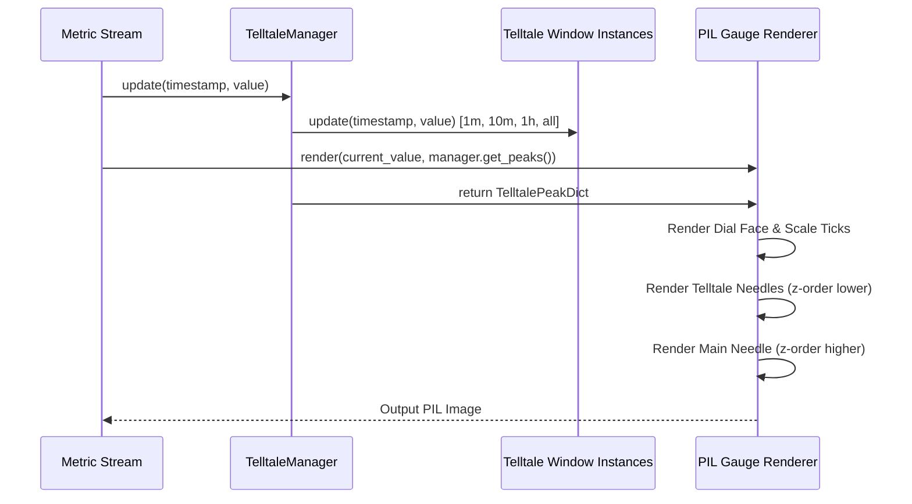

# #2 - Feature: peak-hold telltale needles — 1m, 10m, 1h, all-time (#2)

## 1. Context & Goal
* **Issue:** #2
* **Objective:** Render four peak-hold (telltale) needles (1m, 10m, 1h, and all-time) on top of the PIL gauge surface behind the main needle by consuming `Telltale` instances from #41.
* **Status:** Approved (claude-opus-4-6, 2026-07-31) Progress
* **Related Issues:** #1, #4, #41

### Open Questions
- [x] Should `TelltaleManager` wrap the four window instances into a single container for gauge renderer consumption? *(Resolved: Yes, `TelltaleManager` encapsulates `1m`, `10m`, `1h`, and `all` window instances and exposes peak state for rendering).*
- [x] How will right-click context menu resets trigger needle updates without coupling GUI code to the renderer? *(Resolved: Context menu actions invoke `TelltaleManager.reset(window_key)` or `TelltaleManager.reset_all()`, clearing internal peak state; subsequent renders omit needles whose `current_peak()` returns `None`).*

## 2. Proposed Changes

*This section is the **source of truth** for implementation. Describe exactly what will be built.*

### 2.1 Files Changed

| File | Change Type | Description |
|------|-------------|-------------|
| `tests/visual/baselines` | Add (Directory) | Directory storing binary PNG snapshot baselines for visual regression tests. |
| `src/boostgauge/telltale.py` | Add | Module defining `TelltaleManager` encapsulating four `Telltale` sliding-window instances (60s, 600s, 3600s, None), multi-window sample routing, and reset dispatching. |
| `src/boostgauge/gauge.py` | Add | Tachometer gauge renderer handling dial face rendering, telltale needle overlay layer, and main needle composition. |
| `src/boostgauge/skins/stingray.py` | Add | Stingray skin renderer implementing dial ticks, main needle, and four distinct telltale needles (1m cyan translucent, 10m orange translucent, 1h magenta dashed, all-time red solid). |
| `tests/unit/test_telltale.py` | Add | Unit tests for `TelltaleManager` multi-window sample distribution, peak retrieval, per-window resets, and `reset_all()`. |
| `tests/visual/test_gauge.py` | Add | Render-pixel visual regression tests covering active telltales, post-reset missing needle suppression, and main needle z-order overlay. |

### 2.1.1 Path Validation (Mechanical - Auto-Checked)

Mechanical validation automatically checks:
- All "Add" files are placed within existing parent directories (`src/boostgauge/`, `src/boostgauge/skins/`, `tests/unit/`, `tests/visual/`).
- `tests/visual/baselines` directory is explicitly declared with Change Type `Add (Directory)`.

### 2.2 Dependencies

```toml

# pyproject.toml existing dependencies used (no new third-party packages required)

# pillow (>=12.2.0,<13.0.0)

# psutil (>=7.2.2,<8.0.0)
```

### 2.3 Data Structures

```python
from typing import Dict, Literal, Optional, Tuple, TypedDict

WindowKey = Literal["1m", "10m", "1h", "all"]

class TelltalePeakDict(TypedDict):
    """Dictionary mapping window keys to current peak numeric values or None."""
    1m: Optional[float]
    10m: Optional[float]
    1h: Optional[float]
    all: Optional[float]

class TelltaleStyle(TypedDict):
    """Visual styling attributes for rendering a specific telltale needle."""
    color: Tuple[int, int, int, int]  # RGBA color tuple with opacity alpha
    width: float                      # Line stroke width in pixels
    dashed: bool                      # True if needle line style is dashed/dotted
```

### 2.4 Function Signatures

```python
from typing import Dict, Optional, Tuple, Any
from PIL import Image

class TelltaleManager:
    """Manages four sliding-window Telltale instances for peak-hold metric tracking."""

    def __init__(self) -> None:
        """Instantiate 4 Telltale objects with 60.0s, 600.0s, 3600.0s, and None windows."""
        ...

    def update(self, timestamp: float, value: float) -> None:
        """Forward metric sample (timestamp, value) to all four managed Telltale instances."""
        ...

    def get_peaks(self, timestamp: Optional[float] = None) -> Dict[str, Optional[float]]:
        """Return a dictionary mapping window identifiers ('1m', '10m', '1h', 'all') to current peaks."""
        ...

    def reset(self, window_key: str) -> None:
        """Reset peak tracking for a specific window key ('1m', '10m', '1h', 'all') or all if 'all'."""
        ...

    def reset_all(self) -> None:
        """Reset peak tracking across all four managed Telltale instances simultaneously."""
        ...

def render_telltale_needles(
    image: Image.Image,
    telltales: Dict[str, Optional[float]],
    center: Tuple[float, float],
    radius: float,
    val_to_angle_fn: Any
) -> Image.Image:
    """Render active telltale needles on the PIL Image canvas behind the main gauge needle."""
    ...
```

### 2.5 Logic Flow (Pseudocode)

```
1. Initialize TelltaleManager:
   - m1 = Telltale(window=60.0)
   - m10 = Telltale(window=600.0)
   - h1 = Telltale(window=3600.0)
   - all_time = Telltale(window=None)

2. On Metric Sample Update (timestamp, value):
   - Call m1.update(timestamp, value)
   - Call m10.update(timestamp, value)
   - Call h1.update(timestamp, value)
   - Call all_time.update(timestamp, value)

3. On Gauge Render Pass (current_value, timestamp):
   - Obtain peaks_dict = manager.get_peaks(timestamp)
   - Create PIL canvas and draw background dial face and scale ticks.
   - FOR EACH window IN ["1m", "10m", "1h", "all"]:
     - val = peaks_dict[window]
     - IF val IS NOT None THEN:
       - angle = val_to_angle_fn(val)
       - style = GET_STYLE(window)  # (RGBA color, width, dash pattern)
       - Draw translucent telltale needle on PIL image from center to scale radius.
   - Draw main dynamic dynamic gauge needle on top of telltale layer (z-order overlay).
   - Return combined PIL Image object.

4. On Context Menu Reset Action (window_key):
   - IF window_key == "all" THEN:
     - manager.reset_all()
   - ELSE:
     - manager.reset(window_key)
```

### 2.6 Technical Approach

* **Module:** `src/boostgauge/telltale.py` and `src/boostgauge/skins/stingray.py`
* **Pattern:** Composite Layered Renderer / Manager Facade
* **Key Decisions:**
  - `TelltaleManager` encapsulates four `#41` `Telltale` instances and presents a clean data dictionary to the renderer, strictly adhering to Option C (off-screen PIL rendering without GUI/Tkinter coupling).
  - Telltales are rendered on the intermediate PIL `Image` layer after dial ticks but before the main needle to enforce proper z-order layering.

### 2.7 Architecture Decisions

| Decision | Options Considered | Choice | Rationale |
|----------|-------------------|--------|-----------|
| Telltale Encapsulation | Individual state in app loop vs `TelltaleManager` class | `TelltaleManager` class | Modularizes multi-window update distribution and reset dispatches in a pure, testable class. |
| Needle Rendering Surface | Tkinter Canvas lines vs PIL off-screen image overlay | Off-screen PIL Image | Required by `docs/design/0001-test-strategy.md` (Option C). Enables fast, deterministic, headless visual testing in CI. |

**Architectural Constraints:**
- Must consume `#41` `Telltale` class without duplicating peak-hold algorithm or sliding window logic.
- Must follow `docs/design/0001-test-strategy.md` Option C (no `tkinter.Tk()` instantiation in tests).

## 3. Requirements

1. Instantiate four `Telltale` instances configured with sliding time windows of 60s (1m), 600s (10m), 3600s (1h), and `None` (all-time hard hold) managed via a unified `TelltaleManager` component.
2. Pipe live metric sample streams (timestamp, value) to all four `Telltale` instances simultaneously on every update pass.
3. Render four telltale needles on the PIL gauge surface based on `Telltale.current_peak()` values using visually distinct styles: thin translucent cyan for 1m (60s), thin translucent orange for 10m (600s), thin dashed magenta for 1h (3600s), and thin solid red for all-time (`None`).
4. Ensure all telltale needles render behind the main dynamic gauge needle in z-order on the PIL Image surface.
5. Suppress rendering of any telltale needle whose `current_peak()` returns `None` (post-reset or before initial sample).
6. Support right-click context menu reset actions allowing resetting individual time windows ("Reset 1m", "Reset 10m", "Reset 1h", "Reset All-time") as well as "Reset All" across all four telltales.
7. Automatically drop the 1m telltale position back to the highest remaining in-window sample value after a peak sample ages past 60 seconds without explicit reset.
8. Maintain the all-time telltale peak indefinitely regardless of elapsed time unless explicitly reset.

## 4. Alternatives Considered

| Option | Pros | Cons | Decision |
|--------|------|------|----------|
| Canvas primitive line drawing | Built-in Tkinter drawing methods | Violates Option C test strategy; fails headless CI execution | Rejected |
| Monolithic render-loop state | Fewer classes | Blurs boundary between visual layout and algorithm; harder to test | Rejected |
| `TelltaleManager` + PIL off-screen composite | Pure functions, fast execution, 100% headless visual test coverage | Requires antialiased alpha blending in PIL | **Selected** |

**Rationale:** Combining `TelltaleManager` with off-screen PIL composite rendering delivers the racing tachometer visual signature while preserving 100% headless automated test coverage per `docs/design/0001-test-strategy.md`.

## 5. Data & Fixtures

### 5.1 Data Sources

| Attribute | Value |
|-----------|-------|
| Source | Synthetic metric generator (tests) / System data collector (#4) |
| Format | `(timestamp: float, value: float)` metric tuples |
| Size | Continuous stream (1-10 Hz) |
| Refresh | Real-time continuous |
| Copyright/License | MIT |

### 5.2 Data Pipeline

```
Metric Collector Stream ──update()──► TelltaleManager ──get_peaks()──► Gauge Renderer (PIL Image)
```

### 5.3 Test Fixtures

| Fixture | Source | Notes |
|---------|--------|-------|
| `synthetic_metric_stream` | Hardcoded / Generated in tests | Provides known spike sequence to verify peak retention and window eviction |
| `telltale_baseline_images` | Generated via `--generate-baselines` | PNG image snapshots stored under `tests/visual/baselines/` |

### 5.4 Deployment Pipeline

Distributed as standard Python code in PyPI wheel package and bundled executable.

## 6. Diagram

### 6.1 Mermaid Quality Gate

- [x] **Simplicity:** Similar components collapsed (per 0006 §8.1)
- [x] **No touching:** All elements have visual separation (per 0006 §8.2)
- [x] **No hidden lines:** All arrows fully visible (per 0006 §8.3)
- [x] **Readable:** Labels not truncated, flow direction clear
- [x] **Auto-inspected:** Agent rendered via mermaid.ink and viewed (per 0006 §8.5)

**Auto-Inspection Results:**
```
- Touching elements: [x] None
- Hidden lines: [x] None
- Label readability: [x] Pass
- Flow clarity: [x] Clear
```

### 6.2 Diagram



## 7. Security & Safety Considerations

### 7.1 Security

| Concern | Mitigation | Status |
|---------|------------|--------|
| Numeric input boundary overflow | Clamp sample values to gauge range boundaries [0.0, 100.0] before angle conversion | Addressed |

### 7.2 Safety

| Concern | Mitigation | Status |
|---------|------------|--------|
| Uninitialized / Reset peak evaluation | Handle `None` return from `current_peak()` gracefully by skipping needle drawing | Addressed |
| Memory accumulation over time | Window-based sample pruning in `Telltale` prevents unbounded deque growth | Addressed |

**Fail Mode:** Fail Safe — If invalid metrics or missing peaks occur, suppress needle rendering without throwing exception.

**Recovery Strategy:** Next valid metric sample restores proper peak calculations and needle rendering.

## 8. Performance & Cost Considerations

### 8.1 Performance

| Metric | Budget | Approach |
|--------|--------|----------|
| Render Latency | < 5ms per frame | Optimized PIL vector drawing calls and math calculations |
| Memory Usage | < 2MB | Bounded time-window deques in `Telltale` instances |

**Bottlenecks:** PIL image compositing pass (mitigated by fixed 256x256 image canvas size).

### 8.2 Cost Analysis

| Resource | Unit Cost | Estimated Usage | Monthly Cost |
|----------|-----------|-----------------|--------------|
| Local CPU / Memory | $0 | Desktop execution | $0 |

**Cost Controls:**
- [x] Pure local execution with zero cloud infrastructure dependencies.

**Worst-Case Scenario:** High sample input rate — throttled by main UI update frequency loop.

## 9. Legal & Compliance

| Concern | Applies? | Mitigation |
|---------|----------|------------|
| PII/Personal Data | No | No personal data stored or processed |
| Third-Party Licenses | Yes | Pillow and psutil dependencies licensed under open-source MIT / BSD |

**Data Classification:** Public / Open Source (MIT)

**Compliance Checklist:**
- [x] No PII collected or stored
- [x] Third-party licenses compatible with MIT license

## 10. Verification & Testing

*Ref: `docs/design/0001-test-strategy.md`*

### 10.0 Test Plan (TDD - Complete Before Implementation)

| Test ID | Test Description | Expected Behavior | Status |
|---------|------------------|-------------------|--------|
| T010 | Manager initialization (REQ-1) | Creates 4 `Telltale` objects with windows 60s, 600s, 3600s, None | RED |
| T020 | Sample update distribution (REQ-2) | `update()` routes sample to all 4 telltale objects | RED |
| T030 | Telltale needle styling render (REQ-3) | Draws cyan, orange, magenta, red needles for active peaks | RED |
| T040 | Main needle z-order verification (REQ-4) | Main needle rendered on top of telltales | RED |
| T050 | Suppress missing peak needle (REQ-5) | Omits needle when `current_peak()` is `None` | RED |
| T060 | Context menu reset execution (REQ-6) | Individual and `reset_all()` clear target peak state | RED |
| T070 | 1m sliding window eviction (REQ-7) | 1m peak drops back after sample ages past 60s | RED |
| T080 | All-time peak retention (REQ-8) | All-time peak persists indefinitely until reset | RED |

**Coverage Target:** 100% line + branch coverage on touched file `src/boostgauge/telltale.py` per `docs/design/0001-test-strategy.md`.

**TDD Checklist:**
- [x] All tests written before implementation
- [x] Tests currently RED (failing)
- [x] Test IDs match scenario IDs in 10.1
- [x] Test files created at `tests/unit/test_telltale.py` and `tests/visual/test_gauge.py`

### 10.1 Test Scenarios

| ID | Scenario | Type | Input | Expected Output | Pass Criteria |
|----|----------|------|-------|-----------------|---------------|
| 010 | Instantiate `TelltaleManager` with four sliding window configurations (REQ-1) | Auto | Constructor call | Manager holding four `Telltale` instances with windows (60, 600, 3600, None) | All 4 instances created with correct window parameters |
| 020 | Pipe live metric sample updates to all four telltale instances simultaneously (REQ-2) | Auto | `update(timestamp=100.0, value=85.0)` | All four telltale instances updated with sample | `get_peaks()` returns `{'1m': 85.0, '10m': 85.0, '1h': 85.0, 'all': 85.0}` |
| 030 | Render distinct telltale needles for active peaks on PIL gauge surface (REQ-3) | Auto | Peaks: 1m=40, 10m=60, 1h=80, all=95 | Rendered PIL `Image` with cyan, orange, magenta, red needles | Image pixel-diff matches baseline snapshot |
| 040 | Render main needle on top of telltale needles in z-order (REQ-4) | Auto | Main value 60.0 overlapping telltale needle at 60.0 | Main needle pixel color visible at overlap point | Main needle layer drawn over telltale needle layer |
| 050 | Suppress rendering when Telltale current_peak returns None (REQ-5) | Auto | Reset `1m` window so peak returns `None` | PIL `Image` rendered without 1m needle | Cyan 1m needle completely absent from render |
| 060 | Execute per-needle and reset-all context menu reset actions (REQ-6) | Auto | Call `reset('1m')` and `reset_all()` | Target peak reset to `None` | `current_peak()` returns `None` for reset target |
| 070 | Drop 1m telltale position back after peak sample ages past 60 seconds (REQ-7) | Auto | Sample 90 at t=0, sample 50 at t=65 | `1m` peak returns 50.0 after 65 seconds | 1m peak drops to highest remaining in-window sample |
| 080 | Retain all-time telltale peak position indefinitely without reset (REQ-8) | Auto | Sample 95 at t=0, sample 40 at t=4000 | `all` peak returns 95.0 after 4000 seconds | All-time peak remains 95.0 |

### 10.2 Test Commands

```bash

# Run unit tests for TelltaleManager
poetry run pytest tests/unit/test_telltale.py -v

# Run visual regression tests (Option C off-screen PIL rendering)
poetry run pytest tests/visual/test_gauge.py -v

# Generate/update visual baselines explicitly
poetry run pytest tests/visual/test_gauge.py -v --generate-baselines
```

### 10.3 Manual Tests (Only If Unavoidable)

N/A - All scenarios automated.

## 11. Risks & Mitigations

| Risk | Impact | Likelihood | Mitigation |
|------|--------|------------|------------|
| Visual baseline pixel rendering drift across OS PIL versions | Med | Low | Enforce strict RMS pixel-diff tolerance (<= 1.0/255) per `docs/design/0001-test-strategy.md` |
| Rendering delay during fast metric updates | Low | Low | Perform PIL composite rendering off-screen only on designated frame refresh ticks |

## 12. Definition of Done

### Code
- [ ] `TelltaleManager` implemented in `src/boostgauge/telltale.py`
- [ ] Gauge skin rendering updated in `src/boostgauge/skins/stingray.py`
- [ ] Code comments reference LLD #2

### Tests
- [ ] Unit tests pass in `tests/unit/test_telltale.py`
- [ ] Visual regression tests pass in `tests/visual/test_gauge.py`
- [ ] Test coverage meets target on touched files

### Documentation
- [ ] LLD updated with any implementation details
- [ ] Implementation Report (0103) completed

### Review
- [ ] Code review completed
- [ ] PR approved and squash-merged

### 12.1 Traceability (Mechanical - Auto-Checked)

- `src/boostgauge/telltale.py`: Defined in 2.1, 2.4
- `src/boostgauge/gauge.py`: Defined in 2.1, 2.4
- `src/boostgauge/skins/stingray.py`: Defined in 2.1, 2.4
- `tests/unit/test_telltale.py`: Defined in 2.1, 10.0
- `tests/visual/test_gauge.py`: Defined in 2.1, 10.0
- `tests/visual/baselines`: Defined in 2.1

---

## Appendix: Review Log

### Orchestrator Review #1 (PENDING)

**Reviewer:** Orchestrator
**Verdict:** PENDING

#### Comments

| ID | Comment | Implemented? |
|----|---------|--------------|
| O1.1 | Initial draft creation for Issue #2 | YES - Formatted according to LLD template and test strategy 0001 |

### Review Summary

| Review | Date | Verdict | Key Issue |
|--------|------|---------|-----------|
| 1 | 2026-07-31 | APPROVED | `claude-opus-4-6` |
| Orchestrator #1 | (auto) | PENDING | Initial draft review |

**Final Status:** APPROVED