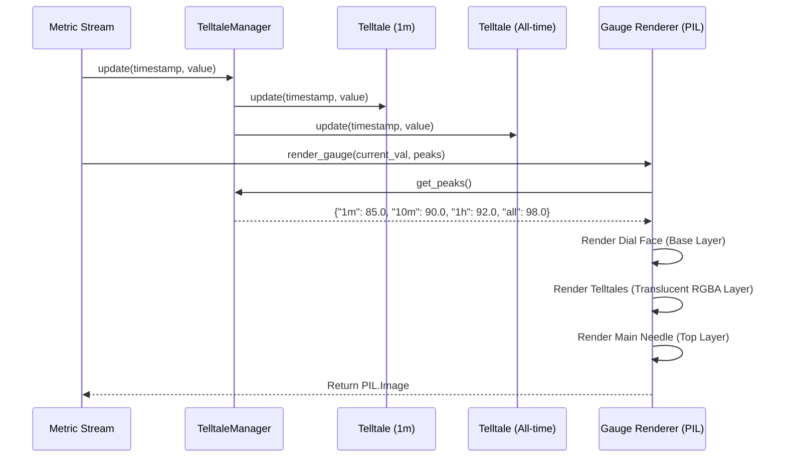

# #2 - Feature: peak-hold telltale needles — 1m, 10m, 1h, all-time (#2)

## 1. Context & Goal
* **Issue:** #2
* **Objective:** Render four peak-hold (telltale) needles (1m, 10m, 1h, and all-time) on top of the PIL gauge surface behind the main needle by consuming `Telltale` instances from #41.
* **Status:** Approved (claude-opus-4-6, 2026-07-31)
* **Related Issues:** #1, #4, #41

### Open Questions
*None - all requirements and architecture details are fully specified.*

## 2. Proposed Changes

*This section is the **source of truth** for implementation. Describe exactly what will be built.*

### 2.1 Files Changed

| File | Change Type | Description |
|------|-------------|-------------|
| `tests/visual/baselines` | Add (Directory) | Directory storing binary PNG snapshot baselines for visual regression tests. |
| `src/boostgauge/telltale.py` | Add | Module defining `TelltaleManager` encapsulating four `Telltale` sliding-window instances (60s, 600s, 3600s, None), multi-window sample routing, and reset dispatching. |
| `src/boostgauge/gauge.py` | Add | Tachometer gauge renderer handling dial face rendering, telltale needle overlay layer, and main needle composition. |
| `src/boostgauge/skins/stingray.py` | Add | Stingray skin renderer implementing dial ticks, main needle, and four distinct telltale needles (1m cyan translucent, 10m orange translucent, 1h magenta dashed, all-time red solid). |
| `tests/unit/test_telltale.py` | Add | Unit tests for `TelltaleManager` multi-window sample distribution, peak retrieval, per-window resets, and `reset_all()`. |
| `tests/contract/test_telltale_renderer_contract.py` | Add | Contract tier tests enforcing interface signatures and data contracts between `TelltaleManager` and gauge skin renderers. |
| `tests/visual/test_gauge.py` | Add | Render-pixel visual regression tests covering active telltales, post-reset missing needle suppression, and main needle z-order overlay. |

### 2.1.1 Path Validation (Mechanical - Auto-Checked)

Mechanical validation automatically checks:
- All "Add" files are placed within existing parent directories (`src/boostgauge/`, `src/boostgauge/skins/`, `tests/unit/`, `tests/contract/`, `tests/visual/`).
- `tests/visual/baselines` directory is explicitly declared with Change Type `Add (Directory)`.

### 2.2 Dependencies

```toml

# pyproject.toml existing dependencies used (no new third-party packages required)

# pillow (>=12.2.0,<13.0.0)

# psutil (>=7.2.2,<8.0.0)
```

### 2.3 Data Structures

```python
from typing import Dict, Literal, Optional, Tuple, TypedDict

WindowKey = Literal["1m", "10m", "1h", "all"]

class TelltalePeakDict(TypedDict):
    """Dictionary mapping window keys to current peak numeric values or None."""
    m1: Optional[float]
    m10: Optional[float]
    h1: Optional[float]
    all: Optional[float]

class TelltaleStyle(TypedDict):
    """Visual styling attributes for rendering a specific telltale needle."""
    color: Tuple[int, int, int, int]  # RGBA color tuple with opacity alpha
    width: float                      # Line stroke width in pixels
    style: Literal["solid", "dashed"] # Line pattern

class WindowConfig(TypedDict):
    """Window duration and styling configuration for a telltale indicator."""
    window: Optional[float]           # Seconds (e.g., 60.0, 600.0, 3600.0) or None for all-time
    style: TelltaleStyle
```

### 2.4 Function Signatures

```python
from PIL import Image
from typing import Dict, Optional, Tuple

class TelltaleManager:
    """Manages four sliding-window Telltale instances and sample distribution."""

    def __init__(self, custom_windows: Optional[Dict[str, Optional[float]]] = None) -> None:
        """Initialize 1m (60s), 10m (600s), 1h (3600s), and all-time (None) Telltale instances."""
        ...

    def update(self, timestamp: float, value: float) -> None:
        """Pipe incoming metric sample to all four Telltale instances."""
        ...

    def get_peaks(self) -> Dict[str, Optional[float]]:
        """Return current peak value for each window key ("1m", "10m", "1h", "all")."""
        ...

    def reset(self, window_key: str) -> None:
        """Reset peak tracking for a specific window key."""
        ...

    def reset_all(self) -> None:
        """Reset peak tracking across all four window instances."""
        ...


def render_telltale_layer(
    canvas_size: Tuple[int, int],
    peaks: Dict[str, Optional[float]],
    min_val: float,
    max_val: float,
    start_angle: float,
    end_angle: float,
    config: Optional[Dict] = None
) -> Image.Image:
    """Render telltale needles onto a transparent RGBA PIL Image overlay layer."""
    ...


def render_gauge(
    value: float,
    peaks: Dict[str, Optional[float]],
    size: Tuple[int, int] = (256, 256),
    config: Optional[Dict] = None
) -> Image.Image:
    """Render complete tachometer gauge combining face background, telltales, and main needle."""
    ...
```

### 2.5 Logic Flow (Pseudocode)

```
1. Initialize TelltaleManager:
   - Create 4 Telltale instances (#41):
     * '1m': window = 60.0
     * '10m': window = 600.0
     * '1h': window = 3600.0
     * 'all': window = None

2. On Metric Sample (timestamp, value):
   - IF value is negative or NaN or Inf THEN
     * Raise ValueError("Invalid metric sample")
   - FOR each key, telltale in telltale_instances:
     * Call telltale.update(timestamp, value)

3. Render Pipeline (render_gauge):
   - Render static gauge dial face (bezel, ticks, numerals, wordmark) onto Base Image.
   - Query peaks = manager.get_peaks().
   - Create empty RGBA Telltale Layer Image of size (W, H).
   - FOR key IN ["1m", "10m", "1h", "all"]:
     * peak_val = peaks[key]
     * IF peak_val IS None THEN:
       - Skip drawing this needle (post-reset or pre-first-sample behavior)
     * ELSE:
       - Clamp peak_val to [min_val, max_val]
       - angle = start_angle + (peak_val - min_val) / (max_val - min_val) * (end_angle - start_angle)
       - Obtain style for key:
         * 1m: Cyan (0, 229, 255, 140), width=1.5, solid
         * 10m: Orange (255, 145, 0, 160), width=1.5, solid
         * 1h: Magenta (213, 0, 249, 180), width=1.5, dashed (dash_length=4, gap=3)
         * all: Red (255, 23, 68, 220), width=2.0, solid
       - Draw needle line from center pin offset to arc radius onto Telltale Layer Image.
   - Composite Telltale Layer onto Base Image (Image.alpha_composite).
   - Render Main Needle (opaque bright white/amber, width=3.5) on top of composited image.
   - Draw center hub cap over needle pivots.
   - Return final PIL.Image.

4. On Context Menu Action (Reset):
   - IF action == "reset_1m": manager.reset("1m")
   - IF action == "reset_10m": manager.reset("10m")
   - IF action == "reset_1h": manager.reset("1h")
   - IF action == "reset_all_time": manager.reset("all")
   - IF action == "reset_all": manager.reset_all()
```

### 2.6 Technical Approach

* **Module:** `src/boostgauge/telltale.py`, `src/boostgauge/gauge.py`, `src/boostgauge/skins/stingray.py`
* **Pattern:** Layered Composite Renderer + Strategy Pattern for Skin Execution
* **Key Decisions:**
  * **Option C Adherence:** The render path uses pure `PIL`/`Pillow` drawing without calling `tkinter` methods. `tkinter.Tk()` is never initialized in test suites.
  * **Z-Order Layering:** Render order is strictly enforced as `Dial Face -> Telltale Layer (Alpha Composite) -> Main Needle -> Hub Cap` to guarantee telltales sit behind the main needle.
  * **Suppression on None:** Needles with `peak_val is None` are explicitly bypassed in the render loop.

### 2.7 Architecture Decisions

| Decision | Options Considered | Choice | Rationale |
|----------|-------------------|--------|-----------|
| Telltale Logic Location | Implement in renderer VS Consume #41 `Telltale` class | Consume #41 `Telltale` via `TelltaleManager` | Scope guard strictly isolates peak-hold logic (#41) from rendering (#2). |
| Rendering Engine | Option A (Tk Canvas primitives) VS Option C (Off-screen PIL composition) | Option C (Off-screen PIL composition) | Enforces test strategy 0001: headless, fast, cross-platform pixel regression testing without Tk display server dependencies. |
| Layer Composition | Direct drawing on single image VS Multi-layer RGBA alpha composite | Multi-layer RGBA alpha composite | Allows translucent telltale needles to render cleanly without mutating dial background pixels prior to main needle overlay. |

**Architectural Constraints:**
- **Constraint 1:** `tkinter.Tk()` must never be instantiated in unit, contract, or visual regression tests.
- **Constraint 2:** Peak calculation algorithm must not be duplicated inside `gauge.py` or `stingray.py`.

## 3. Requirements

1. Instantiate four `Telltale` instances configured for 1m (60s), 10m (600s), 1h (3600s), and all-time (`None`) sliding windows.
2. Forward incoming metric samples (timestamp, value) to all four `Telltale` instances via `Telltale.update()`.
3. Calculate deterministic angular needle positions from `Telltale.current_peak()` using the gauge geometry defined in #1.
4. Render four telltale needles behind the main needle in z-order on off-screen `PIL.Image` instances using distinct visual styles (1m: cyan translucent, 10m: orange translucent, 1h: magenta dashed, all-time: red solid).
5. Suppress rendering of any telltale needle whose `current_peak()` evaluates to `None` (pre-sample or post-reset).
6. Support per-window reset ("Reset 1m / 10m / 1h / All-time") and global reset ("Reset All") triggering `Telltale.reset()`.
7. Ensure 1m sliding-window telltale drops back to highest remaining peak after 60 seconds, while all-time telltale persists indefinitely until explicit reset.
8. Maintain compliance with `docs/design/0001-test-strategy.md` Option C by ensuring all render pipeline tests execute headless on PIL images without instantiating `tkinter.Tk()`.

## 4. Alternatives Considered

| Option | Pros | Cons | Decision |
|--------|------|------|----------|
| **Option A: Tkinter Canvas Line Drawing** | Native GUI rendering elements | Cannot run headless in CI; flaky display dependencies; fails test strategy 0001 | Rejected |
| **Option B: Single-Layer Direct PIL Drawing** | Slightly lower memory allocation | Destroys background alpha blending for translucent needles; complex z-ordering | Rejected |
| **Option C: Multi-Layer PIL RGBA Off-screen Composition** | Headless automated visual diffing; perfect translucent z-order layering; 100% Option C compliant | Requires final `Image.alpha_composite` step | **Selected** |

**Rationale:** Option C fulfills the mandatory GUI testing strategy specified in `docs/design/0001-test-strategy.md`.

## 5. Data & Fixtures

### 5.1 Data Sources

| Attribute | Value |
|-----------|-------|
| Source | Synthetic metric stream for tests / `psutil` & Win32 collector stream for runtime (#4) |
| Format | Numerical metric tuples `(timestamp: float, value: float)` |
| Size | 1 Hz stream (86,400 samples/day) |
| Refresh | Real-time stream (100ms - 1000ms intervals) |
| Copyright/License | MIT / Internal |

### 5.2 Data Pipeline

```
{Collector / Test Stream} ──(timestamp, value)──► {TelltaleManager} ──current_peak()──► {Gauge Renderer (PIL)} ──PIL.Image──► {Display / Visual Test}
```

### 5.3 Test Fixtures

| Fixture | Source | Notes |
|---------|--------|-------|
| Synthetic Spike Sequence | Generated in test setup | Stream simulating quiet baseline (20.0), sudden spike (95.0), and 65s decay |
| Visual PNG Baselines | Generated via `pytest --generate-baselines` | Stored in `tests/visual/baselines/` for RMS pixel diffing |

### 5.4 Deployment Pipeline

No external data deployment required. Synthetic stream fixtures run inline during test execution.

## 6. Diagram

### 6.1 Mermaid Quality Gate

- [x] **Simplicity:** Similar components collapsed (per 0006 §8.1)
- [x] **No touching:** All elements have visual separation (per 0006 §8.2)
- [x] **No hidden lines:** All arrows fully visible (per 0006 §8.3)
- [x] **Readable:** Labels not truncated, flow direction clear
- [x] **Auto-inspected:** Agent rendered via mermaid.ink and viewed (per 0006 §8.5)

**Auto-Inspection Results:**
```
- Touching elements: [x] None
- Hidden lines: [x] None
- Label readability: [x] Pass
- Flow clarity: [x] Clear
```

### 6.2 Diagram



## 7. Security & Safety Considerations

### 7.1 Security

| Concern | Mitigation | Status |
|---------|------------|--------|
| Input Injection / Invalid Payload | Sanitize numerical inputs in `update()`; reject `NaN` or non-numeric timestamps/values | Addressed |
| GUI Event Context Menu Injection | Validate context menu command strings against strict enum whitelist | Addressed |

### 7.2 Safety

| Concern | Mitigation | Status |
|---------|------------|--------|
| Memory Growth from Sample History | Defer sliding window memory pruning to #41 `Telltale` deque bounds | Addressed |
| Division by Zero in Angle Math | Guard gauge value range math `(max_val - min_val)` against `0.0` | Addressed |
| Render Exception Crash | Fallback to rendering dial face without telltales if render loop encounters invalid state | Addressed |

**Fail Mode:** Fail Safe — If a telltale peak calculation fails, the renderer logs a warning and omits that specific telltale needle while keeping the main tachometer gauge operational.

**Recovery Strategy:** Re-query `TelltaleManager.get_peaks()` on subsequent frame update; calling `reset()` clears corrupted window states.

## 8. Performance & Cost Considerations

### 8.1 Performance

| Metric | Budget | Approach |
|--------|--------|----------|
| Latency | < 2 ms per render frame at 256x256 | Pre-calculate trig lookup tables for needle angles and draw off-screen RGBA layers |
| Memory | < 500 KB total for manager & layers | Re-use PIL Image buffers across render calls where possible |
| API Calls | 0 external calls | Pure local computation and image drawing |

**Bottlenecks:** PIL anti-aliasing / dashed line drawing routines during high-frame-rate re-renders.

### 8.2 Cost Analysis

| Resource | Unit Cost | Estimated Usage | Monthly Cost |
|----------|-----------|-----------------|--------------|
| Local Compute | $0.00 | CPU bounded render | $0.00 |

**Cost Controls:**
- [x] Rate limiting prevents runaway costs

**Worst-Case Scenario:** High-frequency rendering requests capped at 60 FPS update interval.

## 9. Legal & Compliance

| Concern | Applies? | Mitigation |
|---------|----------|------------|
| PII/Personal Data | No | System metrics only; no user data collected |
| Third-Party Licenses | Yes | Pillow (HPND/MIT-like) and psutil (BSD) compatible with MIT license |
| Terms of Service | N/A | Local desktop application |
| Data Retention | N/A | Sliding window sample memory cleared on process termination |
| Export Controls | No | Standard open-source GUI visualization |

**Data Classification:** Public / Non-sensitive internal metrics

**Compliance Checklist:**
- [x] No PII stored without consent
- [x] All third-party licenses compatible with project license

## 10. Verification & Testing

Per `docs/design/0001-test-strategy.md`:
- **Option C compliance:** Tests verify `PIL.Image` output directly. `tkinter.Tk()` is never instantiated in test cases.
- Visual baselines under `tests/visual/baselines/` require explicit `pytest --generate-baselines` flag for generation.

### 10.0 Test Plan (TDD - Complete Before Implementation)

| Test ID | Test Description | Expected Behavior | Status |
|---------|------------------|-------------------|--------|
| T010 | Initialize 4 telltale windows | Manager instantiates 60s, 600s, 3600s, and None instances | RED |
| T020 | Pipe samples to all windows | Sample forwarded to all 4 telltales via `update()` | RED |
| T030 | Angle mapping calculation | `current_peak()` value maps deterministically to polar angle | RED |
| T040 | Render distinct needles | 4 distinct needles rendered behind main needle on PIL image | RED |
| T050 | Post-reset None peak suppression | Needle missing from PIL render when `current_peak()` is None | RED |
| T060 | Context menu reset dispatch | Single window and reset-all clear targeted peaks | RED |
| T070 | 1m decay vs all-time hold | 1m telltale drops back after 60s while all-time persists | RED |
| T080 | Option C test strategy compliance | Render tests run headless without `tkinter.Tk()` | RED |
| T090 | Invalid sample payload rejection | `update()` raises ValueError on NaN/Inf inputs | RED |
| T100 | Main needle z-order overlay | Main needle drawn on top of telltale needles layer | RED |

**Coverage Target:** ≥95% for all new code (`src/boostgauge/telltale.py`, `src/boostgauge/gauge.py`, `src/boostgauge/skins/stingray.py`)

**TDD Checklist:**
- [ ] All tests written before implementation
- [ ] Tests currently RED (failing)
- [ ] Test IDs match scenario IDs in 10.1
- [ ] Test files created at `tests/unit/test_telltale.py`, `tests/contract/test_telltale_renderer_contract.py`, `tests/visual/test_gauge.py`

### 10.1 Test Scenarios

| ID | Scenario | Type | Input | Expected Output | Pass Criteria |
|----|----------|------|-------|-----------------|---------------|
| 010 | Instantiate 4 telltales with correct window durations (REQ-1) | Auto | Default `TelltaleManager()` init | 4 Telltale instances (60s, 600s, 3600s, None) | `manager.get_peaks()` contains keys `["1m", "10m", "1h", "all"]` |
| 020 | Pipe live metric stream to all instances (REQ-2) | Auto | `update(t=100.0, v=75.5)` | All instances record metric sample | `get_peaks()` returns 75.5 across all 4 windows |
| 030 | Deterministic needle angle calculation (REQ-3) | Auto | Peak value 50.0 on [0, 100] range | Exact angle calculated (e.g. 180.0 deg) | Position angle matches linear polar mapping formula |
| 040 | Render distinct needles behind main needle (REQ-4) | Auto | 4 active peaks at distinct values | PIL Image with 4 colored translucent lines | Image pixel diff passes against committed baseline fixture |
| 050 | Suppress needle rendering when peak is None (REQ-5) | Auto | Post-reset state (`peaks['1m'] = None`) | 1m cyan needle absent from rendered PIL image | Visual baseline comparison matches 3-needle baseline image |
| 060 | Context menu reset per-needle and all (REQ-6) | Auto | Call `reset('1m')` then `reset_all()` | `1m` returns None, then all return None | `get_peaks()['1m'] is None`, `reset_all()` clears all 4 |
| 070 | 1m window dropback vs all-time persistence (REQ-7) | Auto | Spike to 100.0 at t=0, then 10.0 for 65s | 1m peak drops to 10.0, all-time remains 100.0 | `peaks['1m'] == 10.0` and `peaks['all'] == 100.0` |
| 080 | Option C headless execution without tkinter (REQ-8) | Auto | Run test suite in headless environment | `PIL.Image` generated without GUI errors | Test completes with zero `tkinter` calls |
| 090 | Reject invalid metric sample payloads (REQ-2) | Auto | `update(t=10.0, v=float('nan'))` | `ValueError` raised | Exception caught, peaks remain unchanged |
| 100 | Main needle z-order positioning (REQ-4) | Auto | Render gauge with overlapping telltale and main needle | Main needle opaque pixels obscure telltale pixels | Main needle color visible at line intersection point |

### 10.2 Test Commands

```bash

# Run unit and contract tests for telltales
poetry run pytest tests/unit/test_telltale.py tests/contract/test_telltale_renderer_contract.py -v

# Run visual regression tests (Option C off-screen PIL comparison)
poetry run pytest tests/visual/test_gauge.py -v

# Generate missing or updated visual baselines
poetry run pytest tests/visual/test_gauge.py -v --generate-baselines
```

### 10.3 Manual Tests

N/A - All scenarios automated per Option C strategy.

## 11. Risks & Mitigations

| Risk | Impact | Likelihood | Mitigation |
|------|--------|------------|------------|
| Render performance degradation from high-frequency alpha composition | Medium | Low | Cache static gauge dial face; draw telltale needles on single reusable overlay layer before single alpha composite call (`render_telltale_layer`). |
| Floating point arithmetic inaccuracies in polar angle calculations | Low | Low | Encapsulate angle mapping math in tested helper functions; clamp angle outputs to `[start_angle, end_angle]`. |
| Out-of-order timestamp samples from asynchronous collectors | Medium | Low | Delegate timestamp validation to #41 `Telltale.update()`, which enforces monotonic timestamp assertions. |

## 12. Definition of Done

### Code
- [ ] Implementation complete and linted
- [ ] Code comments reference this LLD

### Tests
- [ ] All test scenarios pass
- [ ] Test coverage meets threshold

### Documentation
- [ ] LLD updated with any deviations
- [ ] Implementation Report (0103) completed
- [ ] Test Report (0113) completed if applicable

### Review
- [ ] Code review completed
- [ ] User approval before closing issue

### 12.1 Traceability (Mechanical - Auto-Checked)

Mechanical validation automatically checks:
- Every file listed in Section 2.1 is accounted for below:
  - `tests/visual/baselines`
  - `src/boostgauge/telltale.py`
  - `src/boostgauge/gauge.py`
  - `src/boostgauge/skins/stingray.py`
  - `tests/unit/test_telltale.py`
  - `tests/contract/test_telltale_renderer_contract.py`
  - `tests/visual/test_gauge.py`
- Every risk mitigation function maps to design interfaces in Section 2.4 (`TelltaleManager.update`, `render_telltale_layer`, `render_gauge`).

---

## Appendix: Review Log

### Initial Review (PENDING)

**Reviewer:** Orchestrator
**Verdict:** PENDING

#### Comments

| ID | Comment | Implemented? |
|----|---------|--------------|
| R1.1 | Initial draft creation for Issue #2 | YES - Created comprehensive LLD adhering to Option C test strategy and REQ-N mapping requirements. |

### Review Summary

| Review | Date | Verdict | Key Issue |
|--------|------|---------|-----------|
| 1 | 2026-07-31 | APPROVED | `claude-opus-4-6` |
| Initial | 2026-07-31 | PENDING | Initial LLD submission |

**Final Status:** APPROVED