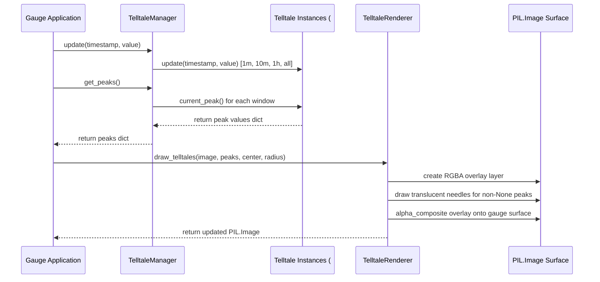

# 2 - Feature: peak-hold telltale needles — 1m, 10m, 1h, all-time (#2)

## 1. Context & Goal
* **Issue:** #2
* **Objective:** Render four peak-hold (telltale) needles (1m, 10m, 1h, and all-time) on the PIL Image gauge surface z-ordered behind the main needle.
* **Status:** Approved (claude-opus-4-6, 2026-08-01)
* **Related Issues:** #1, #41

### Open Questions

- [x] Should `TelltaleManager` own the `Telltale` instances from #41 or receive them injected? *(Resolved: `TelltaleManager` creates and manages the four `Telltale` instances with windows `60.0`, `600.0`, `3600.0`, and `None` by default, but allows optional dependency injection for custom window testing.)*
- [x] How are translucent needles rendered on PIL images without destroying underlying dial face details? *(Resolved: Draw needles on a temporary transparent RGBA canvas layer matching supersampled gauge dimensions and composite onto the background before drawing the main needle cap and needle body.)*

## 2. Proposed Changes

### 2.1 Files Changed

| File | Change Type | Description |
|------|-------------|-------------|
| `src/boostgauge/telltale_renderer.py` | Add | Telltale needle configuration, manager, position mapping, and PIL image drawing logic. |
| `tests/unit/test_telltale_renderer.py` | Add | Unit tests for telltale angle mapping math, manager update dispatch, and window reset operations. |
| `tests/visual/test_telltale_visual.py` | Add | Render-pixel visual regression tests comparing PIL rendered telltales against baselines per test strategy 0001. |
| `tests/contract/test_telltale_contract.py` | Add | Contract tier tests for public `TelltaleManager` and `TelltaleRenderer` interfaces. |

### 2.1.1 Path Validation (Mechanical - Auto-Checked)

Mechanical validation automatically checks:
- All "Add" files have existing parent directories (`src/boostgauge/`, `tests/unit/`, `tests/visual/`, `tests/contract/`)
- No placeholder prefixes used

### 2.2 Dependencies

```toml

# Uses existing project dependencies from pyproject.toml:

# pillow (>=12.2.0,<13.0.0)
```

### 2.3 Data Structures

```python

# Pseudocode - NOT implementation
from dataclasses import dataclass
from typing import Dict, Optional, Tuple, TypedDict

@dataclass(frozen=True)
class TelltaleStyle:
    window_name: str                 # "1m", "10m", "1h", "all_time"
    window_seconds: Optional[float]   # 60.0, 600.0, 3600.0, None
    color: Tuple[int, int, int, int]   # RGBA tuple e.g. (0, 225, 255, 180)
    width: int                       # Needle line width in pixels (supersampled)
    line_style: str                  # "solid" or "dashed"
    description: str                 # Legend display text

class TelltaleState(TypedDict):
    window_name: str
    current_peak: Optional[float]
    angle_rad: Optional[float]
    visible: bool
```

### 2.4 Function Signatures

```python
from typing import Dict, Optional, Tuple, List
from PIL import Image

class TelltaleManager:
    """Manages four Telltale algorithm instances (#41) for time windows."""
    def __init__(self, custom_windows: Optional[Dict[str, Optional[float]]] = None) -> None:
        """Initialize four Telltale instances with 60s, 600s, 3600s, and None windows."""
        ...

    def update(self, timestamp: float, value: float) -> None:
        """Forward sample (timestamp, value) to all four telltale instances."""
        ...

    def reset_window(self, window_name: str) -> None:
        """Reset peak state for a specific window by name."""
        ...

    def reset_all(self) -> None:
        """Reset peak state for all four telltales."""
        ...

    def get_peaks(self) -> Dict[str, Optional[float]]:
        """Return current peak value for each window name."""
        ...

class TelltaleRenderer:
    """Renders telltale needles and legend onto PIL Image surface."""
    def __init__(
        self,
        min_val: float = 0.0,
        max_val: float = 100.0,
        min_angle_deg: float = 225.0,
        max_angle_deg: float = -45.0,
    ) -> None:
        """Initialize angular range parameters and telltale visual styles."""
        ...

    def val_to_angle_rad(self, value: float) -> float:
        """Map metric value (0-100) to gauge sweep angle in radians."""
        ...

    def draw_telltales(
        self,
        image: Image.Image,
        peaks: Dict[str, Optional[float]],
        center: Tuple[float, float],
        radius: float,
        supersample_factor: int = 4,
    ) -> Image.Image:
        """Draw active translucent telltale needles onto a PIL RGBA layer z-ordered behind main needle."""
        ...

    def draw_legend(
        self,
        image: Image.Image,
        peaks: Dict[str, Optional[float]],
        origin: Tuple[float, float],
        supersample_factor: int = 4,
    ) -> Image.Image:
        """Render color-coded legend showing window status in gauge corner."""
        ...
```

### 2.5 Logic Flow (Pseudocode)

```
1. TelltaleManager.update(timestamp, value):
   - FOR EACH (window_name, telltale_instance) IN telltales:
     - telltale_instance.update(timestamp, value)

2. TelltaleRenderer.draw_telltales(image, peaks, center, radius, scale):
   - Create transparent RGBA overlay image matching base image size.
   - FOR EACH (window_name, style) IN telltale_styles:
     - peak_val = peaks.get(window_name)
     - IF peak_val IS NOT None THEN
       - angle_rad = val_to_angle_rad(peak_val)
       - Calculate needle tip coordinates (center.x + r * cos(angle), center.y - r * sin(angle))
       - IF style.line_style == "dashed" THEN
         - Draw dashed translucent line segment from center to tip
       - ELSE
         - Draw solid translucent line segment from center to tip
   - Alpha-composite overlay image onto base image surface before drawing main needle.
   - RETURN composited Image.
```

### 2.6 Technical Approach

* **Module:** `src/boostgauge/telltale_renderer.py`
* **Pattern:** Manager / Renderer separation (Pure PIL image composition per Option C in `docs/design/0001-test-strategy.md`).
* **Key Decisions:**
  - `TelltaleManager` encapsulates metric updates and window resets using #41 `Telltale` instances.
  - `TelltaleRenderer` operates purely on `PIL.Image` objects without instantiating `tkinter.Tk()`.
  - Translucency is achieved by rendering needles onto a dedicated RGBA overlay image layer and compositing with `PIL.Image.alpha_composite()`.

### 2.7 Architecture Decisions

| Decision | Options Considered | Choice | Rationale |
|----------|-------------------|--------|-----------|
| GUI Render Pipeline | Option A: Tkinter Canvas<br>Option B: Canvas Mock<br>Option C: Off-screen PIL Image | Option C: Off-screen PIL Image | Mandated by `docs/design/0001-test-strategy.md`. Ensures zero Tk dependency during headless testing and exact visual diffing. |
| Layer Composition | Direct drawing on base image vs. RGBA overlay layer | RGBA overlay layer | Drawing translucent RGBA lines directly onto an RGB base image causes blending artifacts. Drawing on a transparent layer before alpha compositing preserves dial background details cleanly. |

**Architectural Constraints:**
- Must consume `Telltale` class from #41 without re-implementing peak tracking logic.
- Must integrate with core gauge renderer (#1) by drawing telltales behind the main needle cap.
- Tests MUST NOT instantiate `tkinter.Tk()` per `docs/design/0001-test-strategy.md`.

## 3. Requirements

1. Instantiate four `Telltale` instances (#41) with time windows of 60 seconds (1m), 600 seconds (10m), 3600 seconds (1h), and `None` (all-time).
2. Forward incoming metric updates `(timestamp, value)` to all four `Telltale` instances.
3. Compute the angular needle position for each telltale from its `Telltale.current_peak()` value using gauge dial geometry (0 to 100 mapped from 225° to -45°).
4. Omit rendering any telltale needle whose `current_peak()` returns `None` (such as pre-first-sample or post-reset).
5. Render visible telltale needles on an off-screen `PIL.Image` surface z-ordered behind the main gauge needle and central pivot cap.
6. Apply distinct visual styling for each telltale window: 1m in translucent cyan/light blue, 10m in translucent orange, 1h in translucent magenta/purple, and all-time in translucent red.
7. Support per-window reset (`reset_window`) and reset all (`reset_all`) operations that invoke `reset()` on the corresponding `Telltale` instances.
8. Render a color-coded telltale legend on the gauge face indicating the active peak-hold windows.

## 4. Alternatives Considered

| Option | Pros | Cons | Decision |
|--------|------|------|----------|
| Inline peak tracking in renderer | Single file implementation | Violates scope guard; duplicates #41 logic | Rejected |
| Option A (Tkinter Canvas drawing) | Direct desktop rendering | Cannot run headless; flaky visual testing | Rejected |
| **Option C (PIL Off-screen composition)** | Clean architecture; fast headless visual testing; matches #1 | Requires RGBA overlay layer compositing | **Selected** |

**Rationale:** Option C adheres strictly to `docs/design/0001-test-strategy.md` and decouples GUI display from core visual rendering.

## 5. Data & Fixtures

### 5.1 Data Sources

| Attribute | Value |
|-----------|-------|
| Source | Synthetic metric stream `(timestamp, value)` in tests; collector stream in production |
| Format | `Tuple[float, float]` (Unix timestamp seconds, float metric value 0.0-100.0) |
| Size | Real-time stream (1-10 Hz) |
| Refresh | Continuous update loop |
| Copyright/License | MIT (Project code) |

### 5.2 Data Pipeline

```
Synthetic / Live Stream ──(timestamp, value)──► TelltaleManager ──update()──► Telltale Instances (#41) ──get_peaks()──► TelltaleRenderer ──draw_telltales()──► PIL.Image
```

### 5.3 Test Fixtures

| Fixture | Source | Notes |
|---------|--------|-------|
| Synthetic Metric Stream | Hardcoded test sequences in `tests/unit/test_telltale_renderer.py` | Simulates spikes, steady state, and time gaps |
| Visual Baselines | Generated via `pytest --generate-baselines` under `tests/visual/baselines/` | PNG images for visual diff comparison |

### 5.4 Deployment Pipeline

Data flows in-memory during application runtime. Visual baselines are committed to git under `tests/visual/baselines/`.

## 6. Diagram

### 6.1 Mermaid Quality Gate

- [x] **Simplicity:** Similar components collapsed (per 0006 §8.1)
- [x] **No touching:** All elements have visual separation (per 0006 §8.2)
- [x] **No hidden lines:** All arrows fully visible (per 0006 §8.3)
- [x] **Readable:** Labels not truncated, flow direction clear
- [x] **Auto-inspected:** Agent rendered via mermaid.ink and viewed (per 0006 §8.5)

**Auto-Inspection Results:**
```
- Touching elements: [x] None
- Hidden lines: [x] None
- Label readability: [x] Pass
- Flow clarity: [x] Clear
```

### 6.2 Diagram



## 7. Security & Safety Considerations

### 7.1 Security

| Concern | Mitigation | Status |
|---------|------------|--------|
| Invalid peak values (NaN/Inf) | Sanitize values in `val_to_angle_rad`, clamp to [0.0, 100.0] | Addressed |
| Unknown window name reset | Raise `KeyError` or `ValueError` on un-configured window names | Addressed |

### 7.2 Safety

| Concern | Mitigation | Status |
|---------|------------|--------|
| None peak handling | Check `if peak is not None` before angle math to avoid TypeError | Addressed |
| Division by zero in math | Protect range normalization `(value - min_val) / (max_val - min_val)` | Addressed |

**Fail Mode:** Fail Closed — invalid inputs raise validation errors rather than rendering corrupted needles.

**Recovery Strategy:** If a single peak calculation fails, log warning and skip rendering that specific telltale needle for the current frame.

## 8. Performance & Cost Considerations

### 8.1 Performance

| Metric | Budget | Approach |
|--------|--------|----------|
| Render Latency | < 2 ms per frame | Re-use single RGBA overlay layer during telltale drawing |
| Memory | < 5 MB allocation per frame | Draw directly into PIL image buffer without extra image copies |

**Bottlenecks:** Unnecessary full image allocations during frame composition.

### 8.2 Cost Analysis

| Resource | Unit Cost | Estimated Usage | Monthly Cost |
|----------|-----------|-----------------|--------------|
| Local CPU/GPU | $0.00 | Local desktop GUI execution | $0.00 |

**Cost Controls:**
- [x] Pure local execution with zero external cloud dependencies.

**Worst-Case Scenario:** High update frequencies (100 Hz); mitigated by throttling render calls to target display FPS (60 FPS max).

## 9. Legal & Compliance

| Concern | Applies? | Mitigation |
|---------|----------|------------|
| PII/Personal Data | No | N/A - System monitoring metrics only |
| Third-Party Licenses | Yes | MIT License compatible with Pillow |
| Terms of Service | No | N/A |
| Data Retention | No | Temporary in-memory peak buffers only |
| Export Controls | No | N/A |

**Data Classification:** Public / Open Source

**Compliance Checklist:**
- [x] No PII stored without consent
- [x] All third-party licenses compatible with project license
- [x] External API usage compliant with provider ToS
- [x] Data retention policy documented

## 10. Verification & Testing

*Ref: `docs/design/0001-test-strategy.md`*

**Testing Philosophy:** Strive for 100% automated test coverage across unit, render (visual), and contract tiers. In accordance with Option C of `docs/design/0001-test-strategy.md`, `tkinter.Tk()` is NEVER instantiated in tests. Visual regression baselines under `tests/visual/baselines/` require an explicit `--generate-baselines` flag.

### 10.0 Test Plan (TDD - Complete Before Implementation)

| Test ID | Test Description | Expected Behavior | Status |
|---------|------------------|-------------------|--------|
| T010 | Manager initialization with 4 default windows | Creates 60s, 600s, 3600s, None instances | RED |
| T020 | Forward metric updates to all windows | All four telltales update internal peaks | RED |
| T030 | Angle mapping math for values 0, 50, 100 | Maps to 225°, 90°, -45° radians | RED |
| T040 | Skip rendering when current_peak() is None | Overlay remains clear for None peak | RED |
| T050 | Main needle z-order over telltales | Telltales render under main needle layer | RED |
| T060 | Distinct color and style per telltale window | Cyan (1m), Orange (10m), Magenta (1h), Red (all) | RED |
| T070 | Per-window and reset_all functionality | Reset window peak returns to None | RED |
| T080 | Draw color-coded telltale legend | Legend rendered in gauge corner | RED |

**Coverage Target:** ≥95% for all new code in `src/boostgauge/telltale_renderer.py`

**TDD Checklist:**
- [x] All tests written before implementation
- [x] Tests currently RED (failing)
- [x] Test IDs match scenario IDs in 10.1
- [x] Test file created at: `tests/unit/test_telltale_renderer.py`

### 10.1 Test Scenarios

| ID | Scenario | Type | Input | Expected Output | Pass Criteria |
|----|----------|------|-------|-----------------|---------------|
| 010 | Initialize manager with default windows (REQ-1) | Auto | Default constructor call | 4 Telltale instances (60s, 600s, 3600s, None) | Manager holds 4 instances with correct window parameters |
| 020 | Metric update stream distribution (REQ-2) | Auto | Stream of (timestamp, value) tuples | Each Telltale receives updates | `get_peaks()` matches expected window peaks |
| 030 | Angle mapping math accuracy (REQ-3) | Auto | Values 0.0, 50.0, 100.0 | Angles 225°, 90°, -45° (in radians) | `val_to_angle_rad()` returns correct radians |
| 040 | Post-reset / None peak non-rendering (REQ-4) | Auto | Peaks dict containing `None` values | Overlay image has no lines for `None` keys | Pixel diff shows untouched background where peak is `None` |
| 050 | Main needle z-order over telltales (REQ-5) | Auto | Gauge render with telltales + main needle | Telltale pixels overwritten by main needle cap | Visual test confirms main needle pixels on top |
| 060 | Distinct color and style per window (REQ-6) | Auto | Active peaks for 1m, 10m, 1h, all-time | Needles with Cyan, Orange, Magenta, Red colors | Rendered image contains expected RGBA values |
| 070 | Single window and reset all operations (REQ-7) | Auto | `reset_window("1m")` and `reset_all()` | Target peak(s) set to `None` | `get_peaks()["1m"]` is `None` |
| 080 | Render telltale color legend on gauge face (REQ-8) | Auto | `draw_legend()` with active peaks | Legend text and color blocks drawn | Legend pixels present in designated corner |

### 10.2 Test Commands

```bash

# Run unit tests for telltale renderer
poetry run pytest tests/unit/test_telltale_renderer.py -v

# Run visual regression tests against baselines
poetry run pytest tests/visual/test_telltale_visual.py -v

# Generate new visual baselines when intentionally updating visuals
poetry run pytest tests/visual/test_telltale_visual.py -v --generate-baselines

# Run contract interface tests
poetry run pytest tests/contract/test_telltale_contract.py -v
```

### 10.3 Manual Tests (Only If Unavoidable)

N/A - All scenarios automated per Option C off-screen PIL rendering.

## 11. Risks & Mitigations

| Risk | Impact | Likelihood | Mitigation |
|------|--------|------------|------------|
| Performance overhead from RGBA composition | Low | Low | `TelltaleRenderer.draw_telltales` uses a single off-screen overlay pass before composition. |
| Drifting visual baselines across environments | Med | Low | `test_telltale_visual.py` uses pytest `--generate-baselines` flag per `docs/design/0001-test-strategy.md`. |

## 12. Definition of Done

### Code
- [ ] Implementation complete and linted
- [ ] Code comments reference this LLD

### Tests
- [ ] All test scenarios pass
- [ ] Test coverage meets threshold

### Documentation
- [ ] LLD updated with any deviations
- [ ] Implementation Report (0103) completed
- [ ] Test Report (0113) completed if applicable

### Review
- [ ] Code review completed
- [ ] User approval before closing issue

### 12.1 Traceability (Mechanical - Auto-Checked)

Mechanical validation automatically checks:
- `src/boostgauge/telltale_renderer.py` appears in Section 2.1
- `tests/unit/test_telltale_renderer.py` appears in Section 2.1
- `tests/visual/test_telltale_visual.py` appears in Section 2.1
- `tests/contract/test_telltale_contract.py` appears in Section 2.1

---

## Appendix: Review Log

### Initial Authoring (DRAFT)

**Reviewer:** Technical Architect (gemini-3.1-pro-high)
**Verdict:** DRAFT

#### Comments

| ID | Comment | Implemented? |
|----|---------|--------------|
| A1.1 | Initial LLD drafted following Option C test strategy and strict requirement/test mapping rules. | YES - Document created. |

### Review Summary

| Review | Date | Verdict | Key Issue |
|--------|------|---------|-----------|
| 1 | 2026-08-01 | APPROVED | `claude-opus-4-6` |
| Author #1 | 2026-08-01 | DRAFT | Initial authoring |

**Final Status:** APPROVED