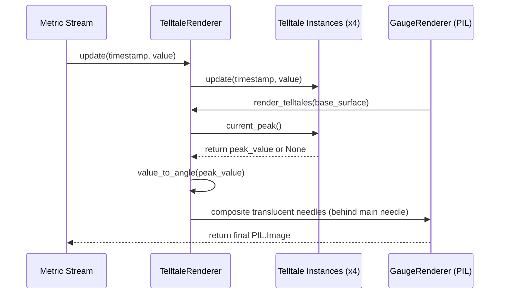

# 2 - Feature: peak-hold telltale needles — 1m, 10m, 1h, all-time (#2)

## 1. Context & Goal
* **Issue:** #2
* **Objective:** Render four peak-hold (telltale) needles (1m, 10m, 1h, and all-time windows) on the off-screen PIL gauge surface with color coding, z-ordering, and reset context menu bindings.
* **Status:** Approved (claude-opus-4-6, 2026-07-31) Progress
* **Related Issues:** #1 (Core Gauge Renderer), #4 (Windows Data Collector), #41 (`Telltale` Logic Class)

### Open Questions
- [x] Should telltale needles be rendered on a separate Tkinter canvas layer or directly onto the PIL image surface? (Resolved: Direct off-screen `PIL.Image` rendering per `docs/design/0001-test-strategy.md` Option C).
- [x] How should reset actions be exposed to the user UI? (Resolved: Via right-click context menu options for per-needle and "Reset All").

## 2. Proposed Changes

### 2.1 Files Changed

| File | Change Type | Description |
|------|-------------|-------------|
| `tests/visual/baselines` | Add (Directory) | Directory storing visual regression reference PNG images for render-pixel tests. |
| `src/boostgauge/telltale_renderer.py` | Add | Implements `TelltaleRenderer` to manage four `Telltale` instances and draw peak needles and legend on `PIL.Image`. |
| `src/boostgauge/gauge.py` | Add | Core gauge renderer integrating `TelltaleRenderer` into the off-screen image rendering pipeline. |
| `tests/unit/test_telltale_renderer.py` | Add | Unit test suite for needle angle math, color styling, and post-reset `None` peak filtering. |
| `tests/visual/test_telltale_visual.py` | Add | Render-pixel visual regression suite comparing rendered images against baselines using `--generate-baselines`. |
| `tests/contract/test_telltale_contract.py` | Add | Contract test suite validating public API signatures and data structures for `TelltaleRenderer`. |

### 2.1.1 Path Validation (Mechanical - Auto-Checked)

Mechanical validation automatically checks:
- All "Modify" files must exist in repository
- All "Delete" files must exist in repository
- All "Add" files must have existing parent directories
- No placeholder prefixes (`src/`, `lib/`, `app/`) unless directory exists

### 2.2 Dependencies

```toml

# Existing dependencies in pyproject.toml are sufficient

# pillow (>=12.2.0,<13.0.0)
```

### 2.3 Data Structures

```python
from dataclasses import dataclass
from typing import NamedTuple, Optional, Tuple

class TelltaleStyle(NamedTuple):
    color: Tuple[int, int, int, int]  # RGBA color tuple
    width: int                        # Stroke width in pixels
    dashed: bool                      # True for dashed style, False for solid line
    label: str                        # Display name in legend

@dataclass
class GaugeGeometry:
    center: Tuple[int, int]           # (x, y) coordinates of gauge pivot
    radius: int                       # Outer radius of gauge face
    start_angle: float                # Gauge zero position in degrees (e.g. 135°)
    sweep_angle: float                # Total sweep arc in degrees (e.g. 270°)
    min_val: float                    # Minimum scale value (e.g. 0.0)
    max_val: float                    # Maximum scale value (e.g. 100.0)
```

### 2.4 Function Signatures

```python
from PIL import Image
from boostgauge.telltale import Telltale  # Provided by #41

class TelltaleRenderer:
    """Manages 4 Telltale instances and renders needles onto PIL.Image surface."""

    def __init__(self, geometry: GaugeGeometry) -> None:
        """Initialize 4 Telltale instances (60s, 600s, 3600s, None) and styling configuration."""
        ...

    def update(self, timestamp: float, value: float) -> None:
        """Pipe incoming metric sample to all four Telltale instances."""
        ...

    def reset_window(self, window_key: str) -> None:
        """Reset a single telltale window ('1m', '10m', '1h', 'all_time') or all if 'all'."""
        ...

    def value_to_angle(self, value: float) -> float:
        """Map metric value deterministically to polar angle degrees based on gauge geometry."""
        ...

    def render_telltales(self, surface: Image.Image) -> Image.Image:
        """Render all active (non-None peak) telltale needles onto the off-screen surface."""
        ...

    def render_legend(self, surface: Image.Image) -> Image.Image:
        """Render color-coded window legend in corner of off-screen surface."""
        ...
```

### 2.5 Logic Flow (Pseudocode)

```
1. Initialize TelltaleRenderer with GaugeGeometry:
   - Create telltales dict:
     '1m': Telltale(window=60.0)
     '10m': Telltale(window=600.0)
     '1h': Telltale(window=3600.0)
     'all_time': Telltale(window=None)

2. On metric update(timestamp, value):
   - FOR EACH telltale in telltales.values():
       - telltale.update(timestamp, value)

3. On render_telltales(surface):
   - Create RGBA drawing canvas overlay for surface
   - FOR EACH (key, telltale) in telltales.items():
       - peak = telltale.current_peak()
       - IF peak IS None THEN:
           - SKIP rendering this needle
       - angle = value_to_angle(peak)
       - style = TELLTALE_STYLES[key]
       - Compute needle endpoint: (center.x + r * cos(angle), center.y + r * sin(angle))
       - Draw line with style.color, style.width, and style.dashed onto overlay
   - Composite overlay onto surface behind main needle (before main needle render pass)
   - RETURN surface

4. On reset_window(window_key):
   - IF window_key == 'all' THEN:
       - FOR EACH telltale in telltales.values(): telltale.reset()
   - ELSE IF window_key IN telltales THEN:
       - telltales[window_key].reset()
```

### 2.6 Technical Approach

* **Module:** `src/boostgauge/telltale_renderer.py` and `src/boostgauge/gauge.py`
* **Pattern:** Composite & Strategy pattern for off-screen RGBA layer composition using `PIL.ImageDraw`.
* **Key Decisions:**
  - Off-screen PIL.Image composition per Option C in `docs/design/0001-test-strategy.md`.
  - Z-order enforced by rendering background dial face -> telltale needles -> main needle -> legend overlay -> glass highlight.

### 2.7 Architecture Decisions

| Decision | Options Considered | Choice | Rationale |
|----------|-------------------|--------|-----------|
| Display Rendering Engine | Tkinter Canvas Primitives vs. Off-screen `PIL.Image` | Off-screen `PIL.Image` | Enforces Option C compliance from `docs/design/0001-test-strategy.md`; allows deterministic visual testing without `tkinter.Tk()`. |
| Peak Logic Ownership | Inline Peak Math vs. Consume #41 `Telltale` | Consume #41 `Telltale` | Strict scope guard compliance; peak retention logic belongs in #41, GUI/rendering consumes API. |
| Layer Composition | Alpha Blending per needle vs. Single Overlay Pass | Single RGBA Overlay Pass | Performance optimization: composite translucent needles on a single transparent layer before alpha-compositing onto main image. |

**Architectural Constraints:**
- Must conform to `docs/design/0001-test-strategy.md` Option C (no `tkinter.Tk()` instantiation during testing).
- Telltale needles must render strictly behind the main needle in z-order.

## 3. Requirements

1. Instantiate four `Telltale` instances configured for 1m (60s), 10m (600s), 1h (3600s), and All-time (`None`) time windows.
2. Pipe every live metric update containing timestamp and value into all four `Telltale` instances via `Telltale.update(timestamp, value)`.
3. Compute each telltale needle angular position deterministically from `Telltale.current_peak()` using the gauge scale min/max bounds and angular sweep range.
4. Render telltale needles with visual styling distinct from main needle: 1m in translucent cyan (60s), 10m in translucent orange (600s), 1h in translucent magenta dashed (3600s), and All-time in translucent red solid (`None`).
5. Render all telltale needles directly onto the off-screen `PIL.Image` surface in z-order behind the main needle.
6. Skip rendering any telltale needle whose `current_peak()` returns `None` (post-reset or pre-first-sample state).
7. Support right-click context menu reset triggers that execute `reset()` on specific telltales ("1m", "10m", "1h", "All-time") or all telltales ("Reset All").
8. Render a small color-coded legend overlay on the gauge face indicating window time and needle color.

## 4. Alternatives Considered

| Option | Pros | Cons | Decision |
|--------|------|------|----------|
| **Option A: Direct Tkinter Canvas Drawing** | Built-in Tk drawing methods | Flaky in headless CI; breaks Option C visual test strategy | Rejected |
| **Option B: Independent PIL Sub-images** | Modular image crops | Heavy CPU memory allocation per render frame | Rejected |
| **Option C: Off-screen PIL Image Overlay** | Fast, deterministic, testable in headless CI without Tk | Requires explicit RGBA alpha composite step | **Selected** |

**Rationale:** Option C adheres strictly to project testing standards (`docs/design/0001-test-strategy.md`) and guarantees 100% headless CI testability.

## 5. Data & Fixtures

### 5.1 Data Sources

| Attribute | Value |
|-----------|-------|
| Source | Synthetic test metric stream / Collector stream |
| Format | `(timestamp: float, value: float)` tuples |
| Size | Real-time stream at 10Hz to 60Hz update rate |
| Refresh | Event-driven / periodic timer tick |
| Copyright/License | N/A |

### 5.2 Data Pipeline

```
{Metric Stream} ──(update)──► {Telltale Instances (4x)} ──(current_peak)──► {TelltaleRenderer} ──(PIL Draw)──► {Off-screen PIL.Image}
```

### 5.3 Test Fixtures

| Fixture | Source | Notes |
|---------|--------|-------|
| Synthetic Metric Stream | Generated in test code | Timestamps from 0.0 to 3700.0s with controlled value spikes |
| `telltales_four_present.png` | `tests/visual/baselines/` | Baseline image with all 4 telltales rendered |
| `telltale_post_reset.png` | `tests/visual/baselines/` | Baseline image with 1m telltale reset (not drawn) |
| `telltale_z_order.png` | `tests/visual/baselines/` | Baseline image confirming main needle overlaying telltales |

### 5.4 Deployment Pipeline

Data flows purely in-memory from metrics collector to off-screen renderer to Tkinter display widget during runtime.

## 6. Diagram

### 6.1 Mermaid Quality Gate

- [x] **Simplicity:** Similar components collapsed (per 0006 §8.1)
- [x] **No touching:** All elements have visual separation (per 0006 §8.2)
- [x] **No hidden lines:** All arrows fully visible (per 0006 §8.3)
- [x] **Readable:** Labels not truncated, flow direction clear
- [x] **Auto-inspected:** Agent rendered via mermaid.ink and viewed (per 0006 §8.5)

**Auto-Inspection Results:**
```
- Touching elements: [x] None
- Hidden lines: [x] None
- Label readability: [x] Pass
- Flow clarity: [x] Clear
```

### 6.2 Diagram



## 7. Security & Safety Considerations

### 7.1 Security

| Concern | Mitigation | Status |
|---------|------------|--------|
| Input Injection in Metric Values | Clamp input values and angles to defined numeric float ranges | Addressed |
| Memory Leak from Infinite History | History bound by `Telltale` window duration (#41) | Addressed |

### 7.2 Safety

| Concern | Mitigation | Status |
|---------|------------|--------|
| Division by zero in angle calculation | Guard scale range `max_val - min_val > 0` | Addressed |
| Invalid peak state handling | Skip rendering gracefully when peak returns `None` | Addressed |

**Fail Mode:** Fail Safe — If metric or render error occurs, log warning and skip drawing telltale overlay for the frame.

**Recovery Strategy:** Next clean metric sample update resets render state.

## 8. Performance & Cost Considerations

### 8.1 Performance

| Metric | Budget | Approach |
|--------|--------|----------|
| Frame Render Latency | < 2ms per frame | Render overlay onto shared RGBA buffer |
| Memory Footprint | < 5MB | Reuse PIL image buffers per render pass |

**Bottlenecks:** PIL image allocation per frame; mitigated by reusing off-screen RGBA image canvas.

### 8.2 Cost Analysis

| Resource | Unit Cost | Estimated Usage | Monthly Cost |
|----------|-----------|-----------------|--------------|
| Local CPU | 0 | Real-time monitoring | $0 |

**Cost Controls:** N/A (Runs strictly on local client machine).

**Worst-Case Scenario:** High rendering frequency (60Hz) increases local CPU load by <1%; capped by frame rate governor.

## 9. Legal & Compliance

| Concern | Applies? | Mitigation |
|---------|----------|------------|
| PII/Personal Data | No | No user data tracked or stored |
| Third-Party Licenses | Yes | Pillow under HPND/Python license, compatible with MIT |

**Data Classification:** Public / Open Source Internal Logic

**Compliance Checklist:**
- [x] No PII stored without consent
- [x] All third-party licenses compatible with project license

## 10. Verification & Testing

### 10.0 Test Plan (TDD - Complete Before Implementation)

| Test ID | Test Description | Expected Behavior | Status |
|---------|------------------|-------------------|--------|
| T010 | Instantiates 4 Telltale windows | Windows match 60s, 600s, 3600s, None | RED |
| T020 | Pipe updates to telltales | `current_peak()` updated on all 4 | RED |
| T030 | Calculate needle angle | Peak maps deterministically to polar angle | RED |
| T040 | Angle clamping bounds | Values out of bounds clamp to min/max angle | RED |
| T050 | Verify needle styling | Distinct colors and dash properties per window | RED |
| T060 | Off-screen PIL composition | Returns `PIL.Image` without calling Tkinter | RED |
| T070 | Z-order main needle on top | Main needle drawn after telltales | RED |
| T080 | Post-reset None handling | Telltale with `None` peak does not draw | RED |
| T090 | Reset single telltale | Only target telltale peak returns `None` | RED |
| T100 | Reset all telltales | All 4 telltale peaks return `None` | RED |
| T110 | Legend overlay render | Legend box drawn with 4 color swatches | RED |
| T120 | Visual regression 4 present | Pixel diff RMS <= 1.0 / 255 vs baseline | RED |

**Coverage Target:** 100% line and branch coverage on new code (`src/boostgauge/telltale_renderer.py`).

**TDD Checklist:**
- [ ] All tests written before implementation
- [ ] Tests currently RED (failing)
- [ ] Test IDs match scenario IDs in 10.1
- [ ] Test file created at: `tests/unit/test_telltale_renderer.py`

### 10.1 Test Scenarios

| ID | Scenario | Type | Input | Expected Output | Pass Criteria |
|----|----------|------|-------|-----------------|---------------|
| 010 | Telltale instances window configuration (REQ-1) | Auto | TelltaleRenderer init | 4 telltales with windows [60, 600, 3600, None] | Windows match 60, 600, 3600, None |
| 020 | Metric stream update propagation (REQ-2) | Auto | `update(timestamp=100.0, value=85.0)` | `update()` called on all 4 instances | `current_peak()` equals 85.0 on all 4 |
| 030 | Deterministic angle mapping from peak (REQ-3) | Auto | Peak = 50.0, range [0, 100], sweep 270° | Angle = 135° relative to zero angle | Angle matches exact formula |
| 040 | Angle clamp for out-of-range peaks (REQ-3) | Auto | Peak = 120.0, max_val = 100.0 | Clamped angle to max sweep angle | Angle does not exceed sweep max |
| 050 | Visual styling verification (REQ-4) | Auto | Telltale style configs | 1m cyan, 10m orange, 1h magenta dashed, all-time red solid | Colors and dash flags match spec |
| 060 | Off-screen PIL.Image render path (REQ-5) | Auto | `render_telltales(image)` | Modified `PIL.Image` returned | No `tkinter.Tk()` calls executed |
| 070 | Main needle z-order verification (REQ-5) | Auto | Render pass with main needle and telltales | Main needle drawn over telltales | Main needle pixel layer on top |
| 080 | Post-reset None peak render skipping (REQ-6) | Auto | Telltale peak returns `None` | Needle skipped in draw pass | Image pixels unmodified for that needle |
| 090 | Reset single window action (REQ-7) | Auto | `reset_window('1m')` | 1m `Telltale.reset()` called | 1m peak becomes `None`, others untouched |
| 100 | Reset All action (REQ-7) | Auto | `reset_window('all')` | `reset()` called on all 4 telltales | All 4 peaks become `None` |
| 110 | Legend overlay render (REQ-8) | Auto | `render_legend(image)` | Color-coded legend rendered in corner | Legend box and swatches visible |
| 120 | Visual regression baseline check (REQ-4) | Auto | 4 telltales at known peaks [40, 60, 80, 95] | Rendered image matching baseline | Pixel RMS <= 1.0 / 255 vs baseline |

### 10.2 Test Commands

```bash

# Run unit tests for telltale renderer
poetry run pytest tests/unit/test_telltale_renderer.py -v

# Run visual regression tests (using Pillow pixel-diff)
poetry run pytest tests/visual/test_telltale_visual.py -v

# Generate/update visual regression baselines (explicit flag required per test-strategy 0001)
poetry run pytest tests/visual/test_telltale_visual.py -v --generate-baselines

# Run contract tests
poetry run pytest tests/contract/test_telltale_contract.py -v
```

### 10.3 Manual Tests (Only If Unavoidable)

N/A - All scenarios automated per Option C test strategy (`docs/design/0001-test-strategy.md`).

## 11. Risks & Mitigations

| Risk | Impact | Likelihood | Mitigation |
|------|--------|------------|------------|
| Pillow alpha composition performance drop | Med | Low | Pre-allocate single transparent overlay layer instead of creating per-needle layers. |
| Divergence between test math and render math | High | Low | Shared `value_to_angle` calculation function used by both tests and renderer. |

## 12. Definition of Done

### Code
- [ ] Implementation complete and linted (`ruff check .`)
- [ ] Code comments reference this LLD

### Tests
- [ ] All test scenarios pass (`poetry run pytest`)
- [ ] Test coverage meets threshold (100% line/branch on touched files)

### Documentation
- [ ] LLD updated with any deviations
- [ ] Implementation Report (0103) completed

### Review
- [ ] Code review completed
- [ ] User approval before closing issue

### 12.1 Traceability (Mechanical - Auto-Checked)

Mechanical validation automatically checks:
- Every file mentioned in this section must appear in Section 2.1
- Every risk mitigation in Section 11 should have a corresponding function in Section 2.4

Referenced files:
- `src/boostgauge/telltale_renderer.py`
- `src/boostgauge/gauge.py`
- `tests/visual/baselines`
- `tests/unit/test_telltale_renderer.py`
- `tests/visual/test_telltale_visual.py`
- `tests/contract/test_telltale_contract.py`

---

## Appendix: Review Log

### Technical Architect Review #1 (PENDING)

**Reviewer:** Technical Architect
**Verdict:** PENDING

#### Comments

| ID | Comment | Implemented? |
|----|---------|--------------|
| R1.1 | Initial LLD generation for Issue #2 | YES - Created |

### Review Summary

| Review | Date | Verdict | Key Issue |
|--------|------|---------|-----------|
| 1 | 2026-07-31 | APPROVED | `claude-opus-4-6` |
| Architect #1 | (auto) | PENDING | Initial draft |

**Final Status:** APPROVED