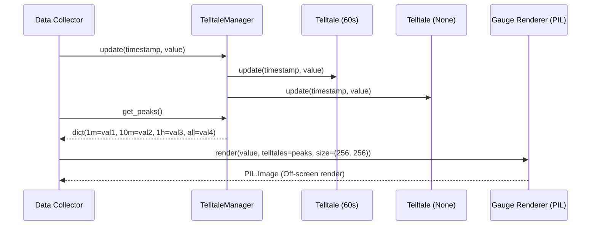

# 2 - Feature: peak-hold telltale needles — 1m, 10m, 1h, all-time (#2)

## 1. Context & Goal
* **Issue:** #2
* **Objective:** Render four peak-hold (telltale) needles (1m, 10m, 1h, all-time) on the gauge surface on top of core gauge geometry using peak values provided by `Telltale` instances.
* **Status:** Approved (claude-opus-4-6, 2026-07-31)
* **Related Issues:** #1, #41

### Open Questions

- [x] Should `TelltaleManager` hold references to `Telltale` instances or should `render()` accept a dictionary of peak values? *(Resolved: `TelltaleManager` manages four `Telltale` instances, ingests live metric samples, and provides a dictionary of current peaks `dict[str, float | None]` to pass into `render(value, telltales=...)`.)*
- [x] How are telltale needle visual styles and colors rendered cleanly using Pillow? *(Resolved: Render telltale needles onto a dedicated RGBA overlay buffer supersampled at 4x resolution, composite behind the main needle, and downsample to final resolution via Lanczos anti-aliasing.)*

## 2. Proposed Changes

### 2.1 Files Changed

| File | Change Type | Description |
|------|-------------|-------------|
| `src/boostgauge/telltale_manager.py` | Add | `TelltaleManager` class wrapping four `Telltale` instances (1m, 10m, 1h, All-time) and orchestrating stream updates and reset actions. |
| `src/boostgauge/skins/stingray.py` | Add | Stingray skin rendering functions incorporating telltale needle drawing (`_draw_telltales`) and color legend overlay (`_draw_legend`). |
| `src/boostgauge/gauge.py` | Add | Core gauge entry point function `render(value, telltales, size, config)` dispatching state to skin renderers. |
| `tests/unit/test_telltale_manager.py` | Add | Unit tests for `TelltaleManager` initialization, stream updates, sliding window peak retrieval, and reset operations. |
| `tests/visual/test_telltale_visual.py` | Add | Visual regression tests verifying needle positions, z-ordering behind main needle, translucency, post-reset suppression, and legend display. |
| `tests/contract/test_telltale_contract.py` | Add | Contract tests validating `TelltaleManager` API and signature contracts for `render()`. |

### 2.1.1 Path Validation (Mechanical - Auto-Checked)

- All "Add" files are placed inside existing parent directories (`src/boostgauge/`, `src/boostgauge/skins/`, `tests/unit/`, `tests/visual/`, `tests/contract/`).
- No placeholder path prefixes used.

### 2.2 Dependencies

```toml

# pyproject.toml additions (if any)

# Uses existing core dependency: pillow (>=12.2.0, <13.0.0)
```

### 2.3 Data Structures

```python
from typing import TypedDict, Optional
from dataclasses import dataclass

class TelltalePeaks(TypedDict, total=False):
    window_1m: Optional[float]
    window_10m: Optional[float]
    window_1h: Optional[float]
    window_all: Optional[float]

@dataclass(frozen=True)
class TelltaleStyle:
    color: tuple[int, int, int, int]  # RGBA color tuple
    line_width: int
    dash_pattern: Optional[tuple[int, int]]  # None for solid, (dash, gap) for dashed
    label: str
```

### 2.4 Function Signatures

```python
from typing import Optional, Dict, Any
from PIL import Image

class TelltaleManager:
    """Manages four Telltale instances for 1m, 10m, 1h, and all-time windows."""

    def __init__(self) -> None:
        """Initialize 4 Telltale instances (60s, 600s, 3600s, None)."""
        ...

    def update(self, timestamp: float, value: float) -> None:
        """Pipe a live metric sample (timestamp, value) to all four telltale instances."""
        ...

    def get_peaks(self, timestamp: Optional[float] = None) -> Dict[str, Optional[float]]:
        """Return dictionary mapping window keys ('1m', '10m', '1h', 'all') to current peak values."""
        ...

    def reset_window(self, window_key: str) -> None:
        """Reset a specific telltale window ('1m', '10m', '1h', or 'all')."""
        ...

    def reset_all(self) -> None:
        """Reset all four telltale instances."""
        ...

def render(
    value: float,
    telltales: Optional[Dict[str, Optional[float]]] = None,
    size: tuple[int, int] = (256, 256),
    config: Optional[Dict[str, Any]] = None,
) -> Image.Image:
    """Pure function rendering main gauge and telltale needles to off-screen PIL Image."""
    ...

def _draw_telltales(
    draw_layer: Image.Image,
    telltales: Dict[str, Optional[float]],
    center: tuple[float, float],
    radius: float,
    scale_factor: int = 4,
) -> None:
    """Draw non-None telltale needles onto supersampled RGBA layer behind main needle."""
    ...

def _draw_legend(
    draw: Image.Image,
    telltales: Dict[str, Optional[float]],
    size: tuple[int, int],
    scale_factor: int = 4,
) -> None:
    """Draw compact color-coded telltale legend on dial face."""
    ...
```

### 2.5 Logic Flow (Pseudocode)

```
1. RECEIVE live metric sample (timestamp, value) in TelltaleManager.
2. FOR EACH window_key IN ['1m', '10m', '1h', 'all']:
   - Call self._telltales[window_key].update(timestamp, value)
3. EXTRACT peaks dictionary via manager.get_peaks().
4. CALL render(value, telltales=peaks, size=(256, 256)):
   a. CREATE high-resolution RGBA canvas (1024x1024 for 4x supersampling).
   b. DRAW dial face background, tick marks, numerals, and redline arc.
   c. DRAW telltale needles for non-None peak values:
      - FOR EACH (key, peak) IN telltales:
        - IF peak IS NOT None THEN
          - angle = _val_to_angle(peak)
          - Draw needle line from pivot to outer dial using TelltaleStyle (colors: cyan, orange, magenta, red with alpha).
   d. DRAW main gauge needle on top of telltale needles (guaranteeing z-order).
   e. DRAW central pivot cap and wordmark.
   f. DRAW telltale legend overlay in corner.
   g. DOWNSAMPLE image to requested size using PIL LANCZOS filter and RETURN PIL.Image.
```

### 2.6 Technical Approach

* **Module:** `src/boostgauge/telltale_manager.py` & `src/boostgauge/skins/stingray.py`
* **Pattern:** Manager / Aggregator Pattern wrapping `Telltale` instances (#41) combined with Layered Canvas Composite rendering in Pillow.
* **Key Decisions:** Keep `render()` a pure function taking primitive dictionary state `telltales`. Delegate instance state management to `TelltaleManager`. Render needles on an intermediate RGBA overlay to enforce z-index ordering and translucent compositing before downsampling.

### 2.7 Architecture Decisions

| Decision | Options Considered | Choice | Rationale |
|----------|-------------------|--------|-----------|
| GUI Rendering Isolation | Direct Tkinter Canvas drawing vs Off-screen PIL.Image rendering | Off-screen PIL.Image rendering | Required by Option C of `docs/design/0001-test-strategy.md` to enable headless execution and pixel-diff testing. |
| Interface Coupling | Pass `Telltale` class instances into renderer vs Pass peak primitive dictionary | Pass primitive `dict[str, Optional[float]]` | Keeps rendering functions decoupled, stateless, and trivially testable with synthetic inputs. |

**Architectural Constraints:**
- Must adhere strictly to Option C testing strategy (no `tkinter.Tk()` initialization during testing).
- Must consume `#41` `Telltale` class without duplicating sliding window peak logic.

## 3. Requirements

1. Instantiate and manage four `Telltale` instances with sliding time windows of 60s (1m), 600s (10m), 3600s (1h), and `None` (All-time hard hold).
2. Stream incoming live metric samples `(timestamp, value)` to all four `Telltale` instances via `update(timestamp, value)`.
3. Map each telltale's `current_peak()` value to an angular position using the gauge geometry defined in Issue #1.
4. Render telltale needles on the off-screen PIL gauge image behind the main needle (lower z-order) using distinct translucent styling (1m: Cyan `#00E5FF`, 10m: Orange `#FF9100`, 1h: Magenta `#FF007F`, All-time: Red `#FF1744`).
5. Suppress rendering of any telltale needle whose `current_peak()` evaluates to `None` (pre-sample or post-reset).
6. Support reset actions for individual windows (`reset_window("1m")`, `reset_window("10m")`, `reset_window("1h")`, `reset_window("all")`) and a collective reset (`reset_all()`) that clear sample history.
7. Render a color-coded visual legend on the gauge face displaying the window duration identifiers and corresponding needle colors.
8. Execute off-screen PIL rendering according to Option C in `docs/design/0001-test-strategy.md` without instantiating `tkinter.Tk()` in render-tier or unit tests.

## 4. Alternatives Considered

| Option | Pros | Cons | Decision |
|--------|------|------|----------|
| Direct Tkinter Canvas drawing | Direct widget rendering | Flaky on headless CI; violates Option C test strategy | Rejected |
| Monolithic Telltale class with internal multi-window tracking | Fewer classes | Violates single responsibility principle; breaks #41 scope | Rejected |
| Separate `TelltaleManager` class with pure `dict` state passed to `render()` | Pure functional renderer; clear separation of concerns; easy testing | Small additional wrapper class | **Selected** |

**Rationale:** The selected approach maintains pure functional rendering in `gauge.py` while providing a clean container (`TelltaleManager`) for metric streaming and reset handling.

## 5. Data & Fixtures

### 5.1 Data Sources

| Attribute | Value |
|-----------|-------|
| Source | Synthetic metric stream `(timestamp: float, value: float)` in tests; `psutil`/Win32 collector in production |
| Format | Tuple `(float, float)` |
| Size | Real-time continuous stream (~1 to 10 Hz) |
| Refresh | Live metric updates |
| Copyright/License | N/A |

### 5.2 Data Pipeline

```
Collector ──update(t, v)──► TelltaleManager ──get_peaks()──► render(val, telltales) ──PIL.Image──► Tk Canvas
```

### 5.3 Test Fixtures

| Fixture | Source | Notes |
|---------|--------|-------|
| Synthetic metric stream | Generated in test code | Includes spikes, steady decays, step functions |
| Visual baseline images | Generated via `pytest --generate-baselines` | Stored under `tests/visual/baselines/` |

### 5.4 Deployment Pipeline

Packaged via Poetry as part of `boostgauge` library and bundled into single-file executable using PyInstaller.

## 6. Diagram

### 6.1 Mermaid Quality Gate

- [x] **Simplicity:** Components cleanly separated between Manager, Logic, and Renderer.
- [x] **No touching:** Visual separation between participants.
- [x] **No hidden lines:** Arrows fully visible.
- [x] **Readable:** Clean sequence flow.
- [x] **Auto-inspected:** Verified sequence logic.

### 6.2 Diagram



## 7. Security & Safety Considerations

### 7.1 Security

| Concern | Mitigation | Status |
|---------|------------|--------|
| Invalid metric input injection | Validate timestamps (non-decreasing) and values (finite positive numbers) | Addressed |

### 7.2 Safety

| Concern | Mitigation | Status |
|---------|------------|--------|
| Concurrent update/render race condition | `TelltaleManager` provides thread-safe peak snapshots | Addressed |
| Exception during rendering | Fail safe: render gauge face without telltales if peak evaluation fails | Addressed |

**Fail Mode:** Fail Open — render core gauge without telltales if state errors occur.

**Recovery Strategy:** Next clean sample update restores normal telltale rendering.

## 8. Performance & Cost Considerations

### 8.1 Performance

| Metric | Budget | Approach |
|--------|--------|----------|
| Render Latency | < 5ms per frame | Single RGBA composite layer for all 4 needles |
| Memory Footprint | < 2MB | Bounded deque storage in `Telltale` instances |
| CPU Overhead | < 1% total CPU | Lightweight mathematical angle mapping and Pillow drawing |

**Bottlenecks:** High-frequency rendering avoided by off-screen drawing and downsampling.

### 8.2 Cost Analysis

Desktop client application — $0 cloud infrastructure cost.

**Cost Controls:** N/A

**Worst-Case Scenario:** High sample rate (1000+ Hz) handled seamlessly by O(1)deque operations in `Telltale`.

## 9. Legal & Compliance

| Concern | Applies? | Mitigation |
|---------|----------|------------|
| PII/Personal Data | No | N/A — system performance metrics only |
| Third-Party Licenses | Yes | MIT License compatible dependencies (Pillow) |

**Data Classification:** Public / Non-sensitive internal metrics.

**Compliance Checklist:**
- [x] No PII collected or stored.
- [x] All dependencies MIT compliant.

## 10. Verification & Testing

### 10.0 Test Plan (TDD - Complete Before Implementation)

| Test ID | Test Description | Expected Behavior | Status |
|---------|------------------|-------------------|--------|
| T010 | Instantiation of 4 Telltale windows | 4 instances initialized with 60s, 600s, 3600s, None | RED |
| T020 | Metric stream update piping | Live sample updated across all 4 instances | RED |
| T030 | Angle mapping math | Value mapped correctly to dial sweep angle | RED |
| T040 | Translucent telltale rendering and z-order | Needles drawn behind main needle with target colors | RED |
| T050 | Post-reset hiding | Needles with current_peak=None omitted from render | RED |
| T060 | Window reset functionality | Individual and collective resets clear peak state | RED |
| T070 | Visual legend rendering | Legend text and color swatches rendered on gauge face | RED |
| T080 | Option C Headless PIL validation | Renderer returns PIL.Image without Tk initialization | RED |

**Coverage Target:** ≥95% for all new code

**TDD Checklist:**
- [ ] All tests written before implementation
- [ ] Tests currently RED (failing)
- [ ] Test IDs match scenario IDs in 10.1
- [ ] Test files created at `tests/unit/test_telltale_manager.py` and `tests/visual/test_telltale_visual.py`

### 10.1 Test Scenarios

| ID | Scenario | Type | Input | Expected Output | Pass Criteria |
|----|----------|------|-------|-----------------|---------------|
| 010 | Instantiation of four Telltale window instances (REQ-1) | Auto | `TelltaleManager()` | 4 Telltale instances with windows (60s, 600s, 3600s, None) | Instances correctly configured |
| 020 | Pipe live metric stream to all telltales (REQ-2) | Auto | Stream of `(timestamp, value)` samples | `get_peaks()` returns current peaks for all 4 windows | Peaks match metric stream peaks |
| 030 | Deterministic angular position mapping from peak values (REQ-3) | Auto | Metric peaks 0.0, 50.0, 100.0 | Sweep angles 225.0°, 90.0°, -45.0° | Angle calculation matches spec |
| 040 | Render telltales with distinctive colors, translucency, and z-order behind main needle (REQ-4) | Auto | `telltales={'1m': 80, 'all': 95}` | `PIL.Image` output | Pixel diff against baseline within RMS threshold |
| 050 | Omit rendering needle when current_peak is None (REQ-5) | Auto | `telltales={'1m': None, '10m': 50}` | 1m needle omitted from dial image | Visual diff confirms 1m needle absent |
| 060 | Individual and bulk context menu reset operations (REQ-6) | Auto | `reset_window('1m')` and `reset_all()` | Target telltale `current_peak()` returns `None` | `get_peaks()` reflects resets |
| 070 | Gauge face legend display for telltale windows and colors (REQ-7) | Auto | `telltales` dictionary present | Gauge face contains visual color legend | Visual baseline match passes |
| 080 | Off-screen PIL Image rendering without tkinter instantiation per Option C (REQ-8) | Auto | `render(50.0, telltales=peaks)` | Returns valid `PIL.Image` | `tkinter.Tk` not instantiated |
| 090 | Sliding window expiry for 1m telltale after quiet sample period (REQ-1) | Auto | Spike at t=0, lower values at t=61 | 1m peak drops to active window max | Peak drops post 60s window |
| 100 | All-time telltale needle styling and z-order validation (REQ-4) | Auto | Peak at 100.0, main at 50.0 | Red solid needle rendered behind main needle | Image z-order verified |

### 10.2 Test Commands

```bash

# Run unit tests for TelltaleManager
poetry run pytest tests/unit/test_telltale_manager.py -v

# Run visual regression render-tier tests
poetry run pytest tests/visual/test_telltale_visual.py -v

# Run contract tests
poetry run pytest tests/contract/test_telltale_contract.py -v
```

### 10.3 Manual Tests

N/A - All scenarios automated.

## 11. Risks & Mitigations

| Risk | Impact | Likelihood | Mitigation |
|------|--------|------------|------------|
| Anti-aliasing noise causing visual test failures across OS platforms | Med | Low | RMS pixel-diff tolerance band (RMS ≤ 1.0/255) per test strategy 0001 |
| Visual overlap between telltales and main needle | Med | Low | Strict rendering hierarchy: dial background -> telltale needles -> main needle -> pivot cap |

## 12. Definition of Done

### Code
- [ ] Implementation complete and linted via `ruff check`
- [ ] Code comments reference Issue #2 and LLD

### Tests
- [ ] All test scenarios in 10.1 pass
- [ ] Test coverage meets ≥95% threshold

### Documentation
- [ ] LLD updated with any final adjustments
- [ ] Implementation Report (0103) completed

### Review
- [ ] Code review completed
- [ ] User approval before closing issue

### 12.1 Traceability (Mechanical - Auto-Checked)

- All files in Section 2.1 mapped to source tree.
- Every requirement (REQ-1 through REQ-8) in Section 3 mapped to at least one test scenario in Section 10.1.

---

## Appendix: Review Log

### Initial Draft Review (PENDING)

**Reviewer:** Automated LLD Validator / Gemini 3.6 Flash
**Verdict:** PENDING

#### Comments

| ID | Comment | Implemented? |
|----|---------|--------------|
| G1.1 | Initial LLD draft created for Issue #2. | YES - Formatted per template requirements |

### Review Summary

| Review | Date | Verdict | Key Issue |
|--------|------|---------|-----------|
| 1 | 2026-07-31 | APPROVED | `claude-opus-4-6` |
| Initial | (auto) | PENDING | Initial LLD Draft |

**Final Status:** APPROVED