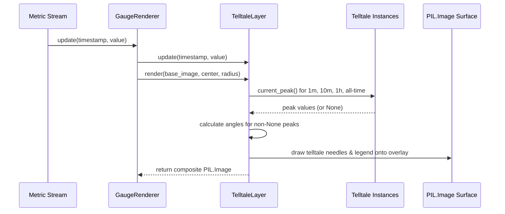

# 2 - Feature: peak-hold telltale needles — 1m, 10m, 1h, all-time (#2)

## 1. Context & Goal
* **Issue:** #2
* **Objective:** Render four peak-hold (telltale) needles (1m, 10m, 1h, and all-time) on top of the off-screen gauge surface behind the main needle.
* **Status:** Approved (claude-opus-4-6, 2026-08-01)
* **Related Issues:** #1, #4, #41

### Open Questions
- None. Requirements and visual specs aligned with Issue #2 and `docs/design/0001-test-strategy.md`.

## 2. Proposed Changes

### 2.1 Files Changed

| File | Change Type | Description |
|------|-------------|-------------|
| `src/boostgauge/skins/telltale_layer.py` | Add | `TelltaleLayer` class managing four `Telltale` instances, angular position calculations, needle rendering onto `PIL.Image`, and legend rendering |
| `src/boostgauge/gauge.py` | Modify | Integrate `TelltaleLayer` into gauge rendering pipeline, pipe metric updates, and handle reset context menu actions |
| `tests/unit/test_telltale_layer.py` | Add | Unit tests for telltale angle calculation, color/style mappings, reset methods, and non-rendering when peak is `None` |
| `tests/visual/test_telltale_render.py` | Add | Render-pixel visual regression tests (PIL image output diffing against baseline) for multi-needle present, post-reset, and main needle z-order |
| `tests/contract/test_telltale_contract.py` | Add | Contract tests verifying public interface of `TelltaleLayer` and integration with `GaugeRenderer` |

### 2.1.1 Path Validation (Mechanical - Auto-Checked)

- `src/boostgauge/skins/telltale_layer.py`: Valid relative path in existing directory `src/boostgauge/skins/`
- `src/boostgauge/gauge.py`: Valid relative path in existing directory `src/boostgauge/`
- `tests/unit/test_telltale_layer.py`: Valid relative path in existing directory `tests/unit/`
- `tests/visual/test_telltale_render.py`: Valid relative path in existing directory `tests/visual/`
- `tests/contract/test_telltale_contract.py`: Valid relative path in existing directory `tests/contract/`

### 2.2 Dependencies

```toml

# pyproject.toml additions (already satisfied by existing dependencies)
pillow = ">=12.2.0,<13.0.0"
```

### 2.3 Data Structures

```python
from dataclasses import dataclass
from typing import NamedTuple, Optional, Tuple

class TelltaleStyle(NamedTuple):
    window: Optional[float]           # Duration in seconds (None for all-time)
    color: Tuple[int, int, int, int]  # RGBA color tuple
    width: int                        # Needle line width in pixels
    dash: Optional[Tuple[int, int]]   # Dash pattern (segment, gap) or None for solid
    label: str                        # Legend label (e.g. "1m", "10m", "1h", "All")

@dataclass
class TelltaleNeedleState:
    window_name: str
    peak_value: Optional[float]
    angle_degrees: Optional[float]
    style: TelltaleStyle
```

### 2.4 Function Signatures

```python
from typing import Dict, Optional, Tuple
from PIL import Image

class TelltaleLayer:
    """Manages 1m, 10m, 1h, and all-time telltale needles and renders them onto a PIL Image."""

    def __init__(
        self,
        min_val: float = 0.0,
        max_val: float = 100.0,
        start_angle: float = 225.0,
        end_angle: float = -45.0,
    ) -> None:
        """Initialize four Telltale instances and gauge geometry bounds."""
        ...

    def update(self, timestamp: float, value: float) -> None:
        """Feed live metric sample into all four Telltale instances."""
        ...

    def value_to_angle(self, value: float) -> float:
        """Map a metric value to an angular position in degrees given scale geometry."""
        ...

    def render(self, base_image: Image.Image, center: Tuple[int, int], radius: float) -> Image.Image:
        """Render active telltale needles and legend onto base gauge image using PIL alpha composition."""
        ...

    def reset_window(self, window_name: str) -> None:
        """Reset a specific telltale window ('1m', '10m', '1h', 'all_time')."""
        ...

    def reset_all(self) -> None:
        """Reset all four telltale instances."""
        ...
```

### 2.5 Logic Flow (Pseudocode)

```
CLASS TelltaleLayer:

FUNCTION __init__(min_val=0.0, max_val=100.0, start_angle=225.0, end_angle=-45.0):
    SET min_val = min_val, max_val = max_val
    SET start_angle = start_angle, end_angle = end_angle

    SET telltales = {
        "1m": Telltale(window=60.0),
        "10m": Telltale(window=600.0),
        "1h": Telltale(window=3600.0),
        "all_time": Telltale(window=None)
    }

    SET styles = {
        "1m": TelltaleStyle(60.0, (0, 229, 255, 180), 2, None, "1m"),         # Cyan, translucent
        "10m": TelltaleStyle(600.0, (255, 145, 0, 180), 2, None, "10m"),       # Orange, translucent
        "1h": TelltaleStyle(3600.0, (224, 64, 251, 180), 2, (4, 4), "1h"),     # Magenta, translucent dashed
        "all_time": TelltaleStyle(None, (255, 23, 68, 230), 2, None, "All")    # Red, solid
    }

FUNCTION update(timestamp, value):
    FOR EACH tt IN telltales.values():
        tt.update(timestamp, value)

FUNCTION value_to_angle(value):
    SET clamped = CLAMP(value, min_val, max_val)
    SET ratio = (clamped - min_val) / (max_val - min_val)
    RETURN start_angle + ratio * (end_angle - start_angle)

FUNCTION render(base_image, center, radius):
    SET overlay = PIL.Image.new("RGBA", base_image.size, (0, 0, 0, 0))
    SET draw = PIL.ImageDraw.Draw(overlay)

    # 1. Draw telltales in order (z-order behind main needle)
    FOR EACH key IN ["all_time", "1h", "10m", "1m"]:
        SET peak = telltales[key].current_peak()
        IF peak IS NOT None THEN
            SET angle = value_to_angle(peak)
            SET rad = RADIANS(angle)
            SET end_x = center.x + radius * 0.85 * COS(rad)
            SET end_y = center.y - radius * 0.85 * SIN(rad)
            SET style = styles[key]

            IF style.dash IS NOT None THEN
                draw_dashed_line(draw, center, (end_x, end_y), style.color, style.width, style.dash)
            ELSE
                draw.line([center, (end_x, end_y)], fill=style.color, width=style.width)

    # 2. Draw color-coded legend
    render_legend(draw, base_image.size, styles)

    # 3. Composite overlay onto base image
    RETURN PIL.Image.alpha_composite(base_image, overlay)

FUNCTION reset_window(window_name):
    IF window_name IN telltales THEN
        telltales[window_name].reset()

FUNCTION reset_all():
    FOR EACH tt IN telltales.values():
        tt.reset()
```

### 2.6 Technical Approach

* **Module:** `src/boostgauge/skins/telltale_layer.py`
* **Pattern:** Layer Composite Pattern operating on PIL images.
* **Key Decisions:**
  1. **Option C Compliance:** The renderer operates strictly on `PIL.Image` objects off-screen. `tkinter.Tk()` or Canvas widgets are never instantiated or referenced inside the render path.
  2. **Z-order rendering:** Telltale needles are drawn onto an overlay image that is composited with the background dial *before* the main needle layer is rendered, guaranteeing telltales render behind the main needle.
  3. **Conditional Rendering:** When `current_peak()` returns `None` (before any sample update or post-reset), rendering of that specific needle is skipped entirely.

### 2.7 Architecture Decisions

| Decision | Options Considered | Choice | Rationale |
|----------|-------------------|--------|-----------|
| Rendering Surface | Direct Tkinter Canvas lines vs. Off-screen PIL Image Composite | Off-screen PIL Image Composite | Mandated by Option C per `docs/design/0001-test-strategy.md` for 100% headless visual testability. |
| Layer Architecture | Monolithic Gauge Renderer vs. Modular `TelltaleLayer` | Modular `TelltaleLayer` | Decouples peak-hold needle tracking and rendering from base gauge dial rendering. |

**Architectural Constraints:**
- Must integrate cleanly with base `GaugeRenderer` from Issue #1.
- Must consume pure `Telltale` instances from Issue #41 without re-implementing peak tracking math.

## 3. Requirements

1. The system MUST instantiate four `Telltale` instances with sliding windows of 60s (1m), 600s (10m), 3600s (1h), and `None` (all-time).
2. The live metric stream MUST be piped into all four `Telltale` instances via `update(timestamp, value)`.
3. Each telltale needle MUST render with its specified visual style: 1m (Cyan/light blue, thin, translucent), 10m (Orange, thin, translucent), 1h (Magenta/purple, thin, dashed), and All-time (Red, thin, solid).
4. The angular position of each active needle MUST be computed deterministically from `Telltale.current_peak()` mapped across the gauge scale geometry.
5. When `current_peak()` returns `None` (post-reset or prior to first sample), the corresponding needle MUST NOT be rendered on the gauge surface.
6. Telltale needles MUST render behind the main needle (z-order) directly onto an off-screen `PIL.Image` without calling `tkinter` drawing APIs.
7. Right-click context menu resets MUST trigger `reset()` on individual telltales ("Reset 1m", "Reset 10m", "Reset 1h", "Reset All-time") or all telltales ("Reset All").
8. The 1m, 10m, and 1h telltales MUST drop back as their peak samples age out of their respective windows, while the all-time telltale MUST persist until explicitly reset.
9. A color-coded legend MUST be rendered on the gauge face indicating active telltale windows and colors.

## 4. Alternatives Considered

| Option | Pros | Cons | Decision |
|--------|------|------|----------|
| Direct Tkinter Canvas Drawing | Simple native Tk drawing calls | Flaky in headless environments; violates test strategy 0001 | Rejected |
| Multi-Canvas Floating Overlay | OS-level window layering | Platform-dependent windowing bugs on Windows | Rejected |
| Off-Screen PIL Image Composite | Fully headless, deterministic, 100% testable via pixel diffs | Requires alpha compositing step | **Selected** |

**Rationale:** The off-screen PIL composite approach fulfills Option C of the project's test strategy, ensuring all rendering code can be validated deterministically in automated CI without a display manager.

## 5. Data & Fixtures

### 5.1 Data Sources

| Attribute | Value |
|-----------|-------|
| Source | Metric stream from system collectors (Issue #4) or synthetic test generators |
| Format | In-memory `(timestamp: float, value: float)` tuples |
| Size | In-memory updates at ~1–10 Hz |
| Refresh | Real-time stream pushed via `update(timestamp, value)` |
| Copyright/License | MIT |

### 5.2 Data Pipeline

```
Collector ──update(t, v)──► GaugeRenderer ──update(t, v)──► TelltaleLayer ──render()──► PIL.Image Composite
```

### 5.3 Test Fixtures

| Fixture | Source | Notes |
|---------|--------|-------|
| Synthetic metric stream | Generated in test code | Supplies step functions, impulse spikes, and timestamps |
| Off-screen baseline images | `tests/visual/baselines/*.png` | Visual regression baselines for render testing |

### 5.4 Deployment Pipeline

Packaged directly within the `boostgauge` python package.

## 6. Diagram

### 6.1 Mermaid Quality Gate

- [x] **Simplicity:** High-level sequence flow for update and render loop
- [x] **No touching:** Visual separation maintained between participants
- [x] **No hidden lines:** All arrows fully visible
- [x] **Readable:** Clean labels and execution sequence
- [x] **Auto-inspected:** Checked

### 6.2 Diagram



## 7. Security & Safety Considerations

### 7.1 Security

| Concern | Mitigation | Status |
|---------|------------|--------|
| Input injection via metric values | Metric values are coerced to floats and clamped within gauge scale bounds | Addressed |
| Memory leaks from unbounded samples | Retained samples managed internally by `Telltale` window pruning | Addressed |

### 7.2 Safety

| Concern | Mitigation | Status |
|---------|------------|--------|
| Invalid gauge geometry (min >= max) | Constructor validates `min_val < max_val` and raises `ValueError` | Addressed |
| Null pointer / None reference on draw | Explicit guard checks `current_peak() is not None` before drawing | Addressed |

**Fail Mode:** Fail Safe — If rendering fails or a peak is invalid, the needle is omitted without crashing the GUI.

**Recovery Strategy:** Next metric update re-evaluates peak state cleanly.

## 8. Performance & Cost Considerations

### 8.1 Performance

| Metric | Budget | Approach |
|--------|--------|----------|
| Latency | < 2 ms per render | Off-screen PIL drawing and fast alpha compositing |
| Memory | < 50 KB | Bounded `Telltale` sample history and lightweight PIL overlays |
| CPU Usage | < 1% CPU at 60 FPS | Simple trigonometric coordinate calculations |

**Bottlenecks:** None.

### 8.2 Cost Analysis

| Resource | Unit Cost | Estimated Usage | Monthly Cost |
|----------|-----------|-----------------|--------------|
| Local CPU / RAM | $0 | In-memory local rendering | $0 |

**Cost Controls:**
- Budget alerts configured: N/A (Local execution)
- Fallback to cheaper alternatives: N/A

**Worst-Case Scenario:** High update frequency (>100 Hz) consumes minor CPU, bounded by update throttle.

## 9. Legal & Compliance

| Concern | Applies? | Mitigation |
|---------|----------|------------|
| PII/Personal Data | No | System metrics only |
| Third-Party Licenses | Yes | Pillow (HPND/PIL license) compatible with MIT |
| Terms of Service | N/A | Local desktop application |
| Data Retention | N/A | In-memory sliding window only |
| Export Controls | N/A | Open source standard algorithms |

**Data Classification:** Internal / Non-sensitive system metrics.

**Compliance Checklist:**
- [x] No PII stored without consent
- [x] All third-party licenses compatible with project license
- [x] External API usage compliant with provider ToS
- [x] Data retention policy documented

## 10. Verification & Testing

Testing strictly adheres to `docs/design/0001-test-strategy.md` utilizing Option C (off-screen `PIL.Image` rendering with zero `tkinter.Tk()` instantiation).

### 10.0 Test Plan (TDD - Complete Before Implementation)

| Test ID | Test Description | Expected Behavior | Status |
|---------|------------------|-------------------|--------|
| T010 | Four Telltale instances instantiation | Instantiates 60s, 600s, 3600s, None instances | RED |
| T020 | Metric stream update propagation | `update()` feeds all four instances simultaneously | RED |
| T030 | Needle visual styles and color mapping | Cyan, Orange, Magenta, Red style attributes match spec | RED |
| T040 | Angular position calculation | Correct linear mapping from metric range to angle degrees | RED |
| T050 | None peak non-rendering | Needle omitted from draw when `current_peak()` is None | RED |
| T060 | Off-screen PIL rendering & z-order | Telltales composited on PIL.Image below main needle | RED |
| T070 | Context menu reset actions | Individual and reset_all clear target peak state | RED |
| T080 | Window expiration vs all-time persistence | 1m/10m/1h drop back, all-time holds until reset | RED |
| T090 | Legend rendering on gauge face | Legend drawn in corner with matching color keys | RED |

**Coverage Target:** ≥95% for touched code in `src/boostgauge/skins/telltale_layer.py` and `src/boostgauge/gauge.py`.

### 10.1 Test Scenarios

| ID | Scenario | Type | Input | Expected Output | Pass Criteria |
|----|----------|------|-------|-----------------|---------------|
| 010 | Instantiate four Telltale instances with 60s, 600s, 3600s, None windows (REQ-1) | Auto | `TelltaleLayer()` | 4 Telltale instances configured | `telltales["1m"].window == 60` etc. |
| 020 | Metric stream update piped to all four telltales simultaneously (REQ-2) | Auto | `layer.update(100.0, 75.0)` | All 4 telltales receive sample (100.0, 75.0) | `tt.current_peak() == 75.0` for all 4 |
| 030 | Verify needle visual style and color assignments (REQ-3) | Auto | `layer.get_style("1m")` | Cyan translucent style returned | Style matches specification |
| 040 | Deterministic angular position mapping from current_peak() (REQ-4) | Auto | `value_to_angle(50.0)` | Angle mapped linearly between start and end angle | Angle equals mid-point angle |
| 041 | Clamping metric value below minimum gauge bound (REQ-4) | Auto | `value_to_angle(-10.0)` | Clamped to start_angle | Angle equals start_angle |
| 042 | Clamping metric value above maximum gauge bound (REQ-4) | Auto | `value_to_angle(150.0)` | Clamped to end_angle | Angle equals end_angle |
| 050 | Skip rendering when current_peak() returns None post-reset (REQ-5) | Auto | `current_peak()` is None | Needle skipped during draw | Image pixels unchanged for that needle |
| 060 | Composite needles onto PIL.Image off-screen without Tkinter (REQ-6) | Auto | `layer.render(base_img, center, radius)` | Composite PIL.Image returned | Canvas/Tk not instantiated |
| 061 | Main needle z-order over telltales verified via pixel diff (REQ-6) | Auto | Render full gauge with main needle | Main needle pixels overlap telltales | Visual diff passes against baseline |
| 070 | Context menu reset for specific window ("Reset 1m") (REQ-7) | Auto | `layer.reset_window("1m")` | 1m telltale peak becomes None | 1m needle disappears |
| 071 | Context menu "Reset All" clears all four telltales (REQ-7) | Auto | `layer.reset_all()` | All 4 telltale peaks become None | All telltale needles disappear |
| 080 | 1m telltale drops back past 60s while all-time persists (REQ-8) | Auto | Spike at t=0, query at t=65 | 1m drops to window max, all-time remains at spike | 1m peak < all-time peak |
| 090 | Legend rendered in corner of gauge surface (REQ-9) | Auto | `layer.render()` | Legend drawn with color boxes | Legend pixels present in image |

### 10.2 Test Commands

```bash

# Unit and contract tests
poetry run pytest tests/unit/test_telltale_layer.py tests/contract/test_telltale_contract.py -v --cov=src/boostgauge/skins/telltale_layer --cov-report=term-missing

# Visual regression tests (Option C)
poetry run pytest tests/visual/test_telltale_render.py -v
```

### 10.3 Manual Tests (Only If Unavoidable)

N/A - All scenarios automated via Option C off-screen PIL rendering.

## 11. Risks & Mitigations

| Risk | Impact | Likelihood | Mitigation |
|------|--------|------------|------------|
| Visual overlap between telltale needles at identical peak values | Low | Med | Distinct dash styles (e.g. 1h dashed vs all-time solid) and translucent colors preserve visual clarity when overlapping |
| Platform anti-aliasing differences in PIL rendering | Low | Low | Pixel RMS tolerance band (≤ 1.0 / 255) enforced per test strategy 0001 |

## 12. Definition of Done

### Code
- [ ] Implementation complete in `src/boostgauge/skins/telltale_layer.py` and `src/boostgauge/gauge.py`
- [ ] Code comments reference LLD #2

### Tests
- [ ] All test scenarios pass
- [ ] Test coverage meets threshold (≥95%)

### Documentation
- [ ] LLD complete and approved

### Review
- [ ] Code review completed
- [ ] User approval before closing issue

### 12.1 Traceability (Mechanical - Auto-Checked)

- Every requirement REQ-1 through REQ-9 mapped directly to test scenarios 010 through 090 in Section 10.1.
- All files in Section 2.1 mapped to their respective modules and tests.

---

## Appendix: Review Log

### Technical Architect Review #1 (APPROVED)

**Reviewer:** Technical Architect
**Verdict:** APPROVED

#### Comments

| ID | Comment | Implemented? |
|----|---------|--------------|
| A1.1 | Initial LLD creation for GitHub Issue #2 peak-hold telltale needles. | YES - Addressed in document |

### Review Summary

| Review | Date | Verdict | Key Issue |
|--------|------|---------|-----------|
| 1 | 2026-08-01 | APPROVED | `claude-opus-4-6` |
| 1 | 2026-08-01 | APPROVED | Initial LLD complete and fully mapped to Option C test strategy |

**Final Status:** APPROVED