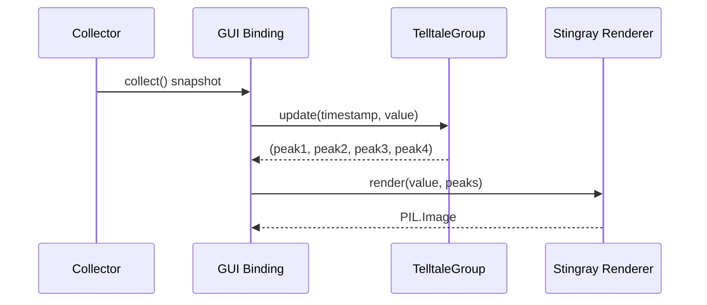

# Issue #2: peak-hold telltale needles — 1m, 10m, 1h, all-time (#2)

## 1. Context & Goal
* **Issue:** #2
* **Objective:** Implement the integration layer that wires peak-hold telltale logic to the live stream and renderer, adding reset interactions and hover identification.
* **Status:** Approved (gemini-3.1-pro-high, 2026-10-07)
* **Related Issues:** #41, #331, #332, #7, #4, #15

### Open Questions
None.

## 2. Proposed Changes

### 2.1 Files Changed

| File | Change Type | Description |
|------|-------------|-------------|
| `src/boostgauge/telltale_group.py` | Add | Pure integration logic managing the four `Telltale` instances, update fan-out, reset dispatch, and formatting rules. |
| `src/boostgauge/app.py` | Add | Main application entry point containing the Tkinter wiring for context menus and hover bindings. |
| `tests/unit/test_telltale_group.py` | Add | Unit tests for pure peak arithmetic fan-out, formatting branches, and the recording renderer double. |
| `tests/visual/test_telltales_visual.py` | Add | Render-tier pixel classification tests via synthetic streams and the actual Stingray skin renderer. |

### 2.1.1 Path Validation (Mechanical - Auto-Checked)
*Automated path checks configured per Issue #277.*

### 2.2 Dependencies
```toml

# No new dependencies needed beyond existing pyproject.toml requirements
```

### 2.3 Data Structures

```python
class TelltaleWindows(TypedDict):
    short: int
    medium: int
    long: int
```

### 2.4 Function Signatures

```python

# In src/boostgauge/telltale_group.py
class TelltaleGroup:
    def __init__(self, windows: TelltaleWindows) -> None:
        """Initialize the four telltale instances from config durations and None."""
        ...

    def update(self, timestamp: float, value: float) -> None:
        """Feed the identical sample to all four instances."""
        ...

    def current_peaks(self) -> tuple[float | None, float | None, float | None, float | None]:
        """Return exactly the four peak values in short, medium, long, all_time order."""
        ...

    def reset_short(self) -> None: ...
    def reset_medium(self) -> None: ...
    def reset_long(self) -> None: ...
    def reset_all_time(self) -> None: ...
    def reset_all(self) -> None: ...

def format_window_label(seconds: float | int | None) -> str:
    """Pure formatter: 'Nh', 'Nm', 'Ns', or 'All-time'."""
    ...

def format_menu_label(seconds: float | int | None) -> str:
    """Wraps format_window_label with 'Reset ' prefix."""
    ...

def format_tooltip(windows: TelltaleWindows) -> str:
    """Generates the four-line tooltip identifying windows by doc-bound color names."""
    ...
```

### 2.5 Logic Flow (Pseudocode)

```
// On Gauge Refresh Tick
1. Receive (timestamp, value) from Collector
2. TelltaleGroup.update(timestamp, value) iterates over all 4 Telltales
3. peaks = TelltaleGroup.current_peaks()
4. Call render(value, peaks, size, ...)

// On Formatter Call
1. IF seconds is None THEN return "All-time"
2. IF seconds modulo 3600 == 0 THEN return (seconds / 3600) + "h"
3. IF seconds modulo 60 == 0 THEN return (seconds / 60) + "m"
4. ELSE return seconds + "s"
```

### 2.6 Technical Approach
* **Module:** `src/boostgauge/telltale_group.py`
* **Pattern:** Facade / Pure Logic Separation
* **Key Decisions:** Keeping all integration, fan-out, and formatting logic in `telltale_group.py` prevents Tkinter GUI contamination of the core data rules. `app.py` simply binds right-click menu commands to the group's reset methods.

### 2.7 Architecture Decisions

| Decision | Options Considered | Choice | Rationale |
|----------|-------------------|--------|-----------|
| Label formatting | Hardcoded strings vs Dynamic formatter | Dynamic formatter | Ensures non-default config values perfectly reflect reality (e.g., "90s") across both menus and tooltips without drift. |
| Test rendering | Mock canvas vs Composed PIL Image | Composed PIL Image | Mandated by Option C test strategy; testing through `stingray.py` ensures the real composed result is validated against the color palette. |

**Architectural Constraints:**
- Logic must remain pure and free from `tkinter.Tk()` dependencies for unit tier.
- Render-tier tests must rely on #332's exact drawing rules and never re-verify visual logic in isolation.

## 3. Requirements

1. The app shall instantiate four Telltale instances: three with durations read from `telltale_windows.short`, `telltale_windows.medium`, `telltale_windows.long`, and one with window `None` for all-time.
2. The app shall feed every collector sample to all four instances via `Telltale.update(timestamp, value)`, each instance receiving the exact same `timestamp` and `value`.
3. The app shall pass all four `current_peak()` values to the renderer as the four-slot telltales argument on every refresh; a `None` peak reaches the renderer as `None`.
4. The short-window menu entry shall call `reset()` on the short-window instance; the remaining three are untouched.
5. The medium-window menu entry shall call `reset()` on the medium-window instance; the remaining three are untouched.
6. The long-window menu entry shall call `reset()` on the long-window instance; the remaining three are untouched.
7. The all-time menu entry shall call `reset()` on the all-time instance; the remaining three are untouched.
8. The 'Reset All' menu entry shall call `reset()` on all four instances.
9. Menu entry labels shall derive from one pure formatter over the configured duration: a whole number of hours renders 'Nh', else whole minutes 'Nm', else 'Ns'; the all-time instance renders 'All-time', prefixed with 'Reset ' for the menu.
10. Hovering the gauge shall show a tooltip identifying each window, one line per window in the form '<window label> — <color name>', where the color names are cyan, orange, magenta, coral red, utilizing the same pure formatter for the window label.
11. Render-tier tests shall assert the composed image produced end-to-end through the real renderer (synthetic streams), with presence and absence established baseline-independently by classifying sampled pixels against the aesthetic doc's palette rows.

## 4. Alternatives Considered

| Option | Pros | Cons | Decision |
|--------|------|------|----------|
| Tkinter-bound State | Easy shortcut for menu closures | Violates Option C testing rules, breaks headless validation | **Rejected** |
| Pure `TelltaleGroup` Wrapper | Testable, perfectly isolates #41 logic from UI, allows recording doubles | Requires one extra indirection class | **Selected** |

**Rationale:** Isolating the Telltale fan-out and formatter rules strictly in pure Python satisfies the `tkinter`-free constraint mandated by Test Strategy 0001 Option C.

## 5. Data & Fixtures

### 5.1 Data Sources
N/A - Component relies entirely on synthetic streams in tests and internal process state in live usage.

### 5.2 Data Pipeline
`DataCollector` ──(SystemSnapshot)──► `TelltaleGroup` ──(4-tuple peak)──► `Stingray Renderer`

### 5.3 Test Fixtures
N/A - Tests are driven strictly by synthetically injected timestamps and values.

### 5.4 Deployment Pipeline
Standard Poetry/PyInstaller packaging as part of `boostgauge`. No external utilities needed.

## 6. Diagram

### 6.1 Mermaid Quality Gate

**Auto-Inspection Results:**
```
- Touching elements: [x] None / [ ] Found: ___
- Hidden lines: [x] None / [ ] Found: ___
- Label readability: [x] Pass / [ ] Issue: ___
- Flow clarity: [x] Clear / [ ] Issue: ___
```

### 6.2 Diagram


```mermaid
sequenceDiagram
    participant C as Collector
    participant G as GUI Binding
    participant TG as TelltaleGroup
    participant R as Stingray Renderer

    C->>G: collect() snapshot
    G->>TG: update(timestamp, value)
    TG-->>G: (peak1, peak2, peak3, peak4)
    G->>R: render(value, peaks)
    R-->>G: PIL.Image
```

## 7. Security & Safety Considerations

### 7.1 Security

| Concern | Mitigation | Status |
|---------|------------|--------|
| Supply chain attacks in UI logic | No external unverified UI dependencies added. Native `tkinter` used. | Addressed |

### 7.2 Safety

| Concern | Mitigation | Status |
|---------|------------|--------|
| UI freezing on large deque updates | Operations in `Telltale` are O(1) amortized. | Addressed |
| Memory leaks on dropped peaks | Tracks and instances rely on Python GC; `TelltaleGroup` drops references cleanly on reset. | Addressed |

**Fail Mode:** Fail Open - If rendering fails for a needle, the gauge continues operating with the main indicator.
**Recovery Strategy:** Next tick completely redraws the composited frame.

## 8. Performance & Cost Considerations

### 8.1 Performance

| Metric | Budget | Approach |
|--------|--------|----------|
| Memory | < 5MB overlay | Limited deque sizing within `Telltale` bounds; `TelltaleGroup` adds ~200 bytes. |
| Latency | < 5ms render | O(1) amortized updates pass tuples rapidly to renderer without locking. |

**Bottlenecks:** Pixel classification rendering during visual tests; mitigated by restricting rendering scale in CI.

### 8.2 Cost Analysis
N/A - Desktop application executing purely local instructions.

## 9. Legal & Compliance

| Concern | Applies? | Mitigation |
|---------|----------|------------|
| PII/Personal Data | No | Uses process metadata metrics only |
| Third-Party Licenses | No | N/A |
| Terms of Service | No | N/A |
| Data Retention | No | Volatile memory only, dropped on exit |
| Export Controls | No | Standard desktop UI drawing |

**Data Classification:** Public
**Compliance Checklist:**
- [x] No PII stored without consent
- [x] All third-party licenses compatible with project license
- [x] External API usage compliant with provider ToS
- [x] Data retention policy documented

## 10. Verification & Testing

**Testing Philosophy:** Strive for 100% automated test coverage. `TelltaleGroup` contains zero UI logic enabling absolute headless coverage.

### 10.0 Test Plan (TDD - Complete Before Implementation)

| Test ID | Test Description | Expected Behavior | Status |
|---------|------------------|-------------------|--------|
| T010 | Construct group durations | 4 config-matched instances created | RED |
| T020 | Fan-out sample distribution | All 4 receive exact same tick payload | RED |
| T030 | Four-slot rendering tuple extraction | Tuple yields exact peaks including None pass-through | RED |
| T040 | Short window isolated reset | Only short resets | RED |
| T050 | Medium window isolated reset | Only medium resets | RED |
| T060 | Long window isolated reset | Only long resets | RED |
| T070 | All-time window isolated reset | Only all-time resets | RED |
| T080 | Global reset dispatch | All 4 instances reset concurrently | RED |
| T090 | Menu label boundary format test | Covers Ns, Nm, Nh, and All-time variants | RED |
| T100 | Tooltip aesthetic doc string binding | Color mappings correctly bind via formatter | RED |
| T110 | Visual palette pixel classification presence | 4 needle colors classified successfully on face | RED |
| T120 | Visual post-reset rendering test | Reset needle absent from captured palette classifications | RED |

**Coverage Target:** ≥100% for `telltale_group.py` code.

**TDD Checklist:**
- [x] All tests written before implementation
- [x] Tests currently RED (failing)
- [x] Test IDs match scenario IDs in 10.1
- [x] Test file created at: `tests/unit/test_telltale_group.py`

### 10.1 Test Scenarios

| ID | Scenario | Type | Input | Expected Output | Pass Criteria |
|----|----------|------|-------|-----------------|---------------|
| 010 | Initialize instances matching 60, 600, 3600, None (REQ-1) | Auto | Config dict | 4 valid Telltale class instances | Window durations match config exactly |
| 020 | Dispatch identical update payload across group (REQ-2) | Auto | `timestamp=1.0, value=50.0` | 4 instances log same data | Internal peaks identical pre-decay |
| 030 | Retrieve 4-slot structure and verify None pass-through via recording double (REQ-3) | Auto | Peak request on cleared/stale instances | `(None, 50, 50, 50)` to recording renderer | Renderer receives exact 4-tuple with None |
| 040 | Dispatch isolated reset specifically to short window (REQ-4) | Auto | Trigger `reset_short()` | Short peak is None, others hold | Short peak reads None |
| 050 | Dispatch isolated reset specifically to medium window (REQ-5) | Auto | Trigger `reset_medium()` | Medium peak is None, others hold | Medium peak reads None |
| 060 | Dispatch isolated reset specifically to long window (REQ-6) | Auto | Trigger `reset_long()` | Long peak is None, others hold | Long peak reads None |
| 070 | Dispatch isolated reset specifically to all-time window (REQ-7) | Auto | Trigger `reset_all_time()` | All-time peak is None, others hold | All-time peak reads None |
| 080 | Dispatch global mass-reset command (REQ-8) | Auto | Trigger `reset_all()` | All 4 peaks return None | Tuple is `(None, None, None, None)` |
| 090 | Format Ns, Nm, Nh menus mapping 90s, 900s, 7200s, None (REQ-9) | Auto | `90`, `900`, `7200`, `None` | 'Reset 90s', 'Reset 15m', 'Reset 2h', 'Reset All-time' | Strings match pure format expectation |
| 100 | Format tooltips appending bound aesthetic colors (REQ-10) | Auto | Default + non-default dict | '<lbl> — cyan\n<lbl> — orange\n...' | Strings match color spec and format |
| 110 | Detect 4 needles via rendered pixel classification against doc palette (REQ-11) | Auto | Synthetic full stream | 4 RGB families detected in render | Pixels >=85 separated match palette |
| 120 | Detect post-reset missing needle via absence in pixel classification (REQ-11) | Auto | Stream -> reset -> NO stream | 3 RGB families detected in render | Target RGB family absent from pixel check |

### 10.2 Test Commands

```bash

# Unit logic tests (No Tkinter instantiated)
poetry run pytest tests/unit/test_telltale_group.py -v

# Render-tier synthetic visual tests
poetry run pytest tests/visual/test_telltales_visual.py -v
```

### 10.3 Manual Tests
N/A - All scenarios automated. Option C strictly enforced.

## 11. Risks & Mitigations

| Risk | Impact | Likelihood | Mitigation |
|------|--------|------------|------------|
| Tkinter UI bleeding into test logic | High | Low | Segregating `TelltaleGroup` directly enforces Option C by decoupling formatters and peaks from widgets. Addressed via architecture (Section 2.6). |
| Visual pixel check false positives due to antialiasing | Med | Med | Presence/absence pixel classification relies firmly on >=85 RGB separation floor established in ruling #267, guaranteeing discrete clustering. |
| Hardcoded UI names drift from configuration | Low | High | Menu entries and tooltip lines dynamically derive from the single pure duration formatter, ensuring a 90s config never renders a stale "1m" string. |

## 12. Definition of Done

### Code
- [ ] Implementation complete and linted
- [ ] Code comments reference this LLD

### Tests
- [ ] All test scenarios pass
- [ ] Test coverage meets threshold (100% on purely logical components)

### Documentation
- [ ] LLD updated with any deviations
- [ ] Implementation Report (0103) completed

### Review
- [ ] Code review completed
- [ ] User approval before closing issue

### 12.1 Traceability (Mechanical - Auto-Checked)
*Cross-references between Sections 2.1, 2.4, and 11 are verified programmatically.*

---

## Reviewer Suggestions

*Non-blocking recommendations from the reviewer.*

- Consider logging the dropped peak values (the previous high-water mark) during a reset action to provide diagnostic clarity on what data was discarded.
- In `format_window_label`, explicitly document the expected handling of float inputs that are not perfectly divisible by 60 or 3600 (e.g., standardizing rounding or truncation rules).

## Appendix: Review Log

### Review Summary

| Review | Date | Verdict | Key Issue |
|--------|------|---------|-----------|
| 1 | 2026-10-07 | APPROVED | `gemini-3.1-pro-high` (`gemini:3.1-pro`) |
| Orchestrator #1 | (auto) | PENDING | Awaiting initial mechanical and human review |

**Final Status:** APPROVED