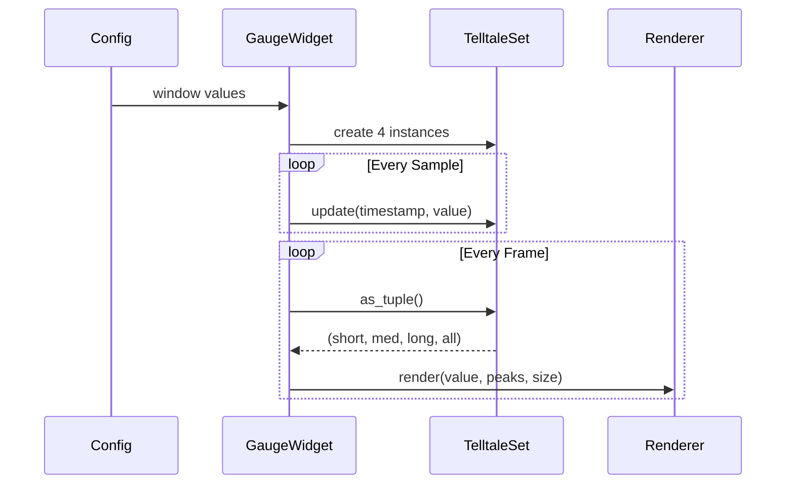

# Issue #2 - Feature: peak-hold telltale needles — 1m, 10m, 1h, all-time

<!-- Template Metadata
Last Updated: 2026-02-02
Updated By: Issue #117 fix
Update Reason: Moved Verification & Testing to Section 10 (was Section 11) to match 0702c review prompt and testing workflow expectations
Previous: Added sections based on 80 blocking issues from 164 governance verdicts (2026-02-01)
-->

## 1. Context & Goal
* **Issue:** #2
* **Objective:** Wire peak-hold `Telltale` logic to the live metric stream, render the composed needles over the static face, and add reset and hover interactions.
* **Status:** Approved (gemini-3.1-pro-high, 2026-10-07)
* **Related Issues:** #41, #331, #332, #7, #4, #15

### Open Questions
None.

## 2. Proposed Changes

### 2.1 Files Changed

| File | Change Type | Description |
|------|-------------|-------------|
| `src/boostgauge/formatters.py` | Add | Pure label string generation for tooltips and menus. |
| `src/boostgauge/gauge.py` | Add | Tachometer widget containing the `Telltale` instances, passing state to #332's renderer, and handling hover/menu. |
| `tests/unit/test_formatters.py` | Add | Unit tests for pure label formatters (covering dynamic configurations). |
| `tests/unit/test_gauge.py` | Add | Unit tests for gauge component, wiring, and reset logic. |
| `tests/visual/test_telltale_render.py` | Add | Render-tier pixel classification and composed image verification. |

### 2.1.1 Path Validation (Mechanical - Auto-Checked)

Mechanical validation automatically checks:
- All "Modify" files must exist in repository
- All "Delete" files must exist in repository
- All "Add" files must have existing parent directories
- No placeholder prefixes (`src/`, `lib/`, `app/`) unless directory exists

### 2.2 Dependencies

```toml

# pyproject.toml additions (if any)

# N/A - No new dependencies
```

### 2.3 Data Structures

```python
from dataclasses import dataclass
from typing import Optional
from boostgauge.telltale import Telltale

@dataclass
class TelltaleSet:
    short: Telltale
    medium: Telltale
    long: Telltale
    all_time: Telltale

    def as_tuple(self) -> tuple[Optional[float], Optional[float], Optional[float], Optional[float]]:
        return (
            self.short.current_peak(),
            self.medium.current_peak(),
            self.long.current_peak(),
            self.all_time.current_peak()
        )
```

### 2.4 Function Signatures

```python

# src/boostgauge/formatters.py
def format_window_label(duration: float | None) -> str:
    """Format duration into Nh, Nm, Ns, or 'All-time'."""
    ...

def format_tooltip_text(durations: tuple[float, float, float, None]) -> str:
    """Format four-line tooltip identifying windows by name and aesthetic color."""
    ...

def format_menu_label(duration: float | None) -> str:
    """Format the reset menu entry label (e.g., 'Reset 1m')."""
    ...

# src/boostgauge/gauge.py
class GaugeWidget:
    def __init__(self, config: AppConfig):
        """Constructs telltales and initializes UI state."""
        ...

    def on_sample(self, timestamp: float, value: float) -> None:
        """Fans out sample to all four Telltale instances."""
        ...

    def render_frame(self, size: int) -> Image.Image:
        """Passes value and telltales tuple to boostgauge.skins.stingray.render."""
        ...

    def reset_telltale(self, window_id: str) -> None:
        """Dispatches reset to the specified Telltale instance or 'all'."""
        ...
```

### 2.5 Logic Flow (Pseudocode)

```
Initialization:
1. Read telltale_windows from config.
2. Initialize TelltaleSet with durations (short, medium, long, None).

On Update (timestamp, value):
1. For each telltale in TelltaleSet:
   - telltale.update(timestamp, value)

On Render (value, size):
1. Extract peaks = TelltaleSet.as_tuple()
2. Call boostgauge.skins.stingray.render(value, peaks, size)
3. Update tkinter Label with the composed Image

On Hover:
1. Generate tooltip text using format_tooltip_text(durations)
2. Show tooltip window with text

On Reset Menu Click (window_id):
1. IF window_id == "all" THEN
   - call reset() on all instances
   ELSE
   - call reset() on the specific Telltale instance
```

### 2.6 Technical Approach

* **Module:** `src/boostgauge/gauge.py`, `src/boostgauge/formatters.py`
* **Pattern:** Dependency Injection / Pure UI Logic separation
* **Key Decisions:** String formatters and mapping logic are completely isolated from `tkinter` to comply with Option C testing rules (no Tk instantiation in tests). Telltales maintain state but renderer takes pure values.

### 2.7 Architecture Decisions

| Decision | Options Considered | Choice | Rationale |
|----------|-------------------|--------|-----------|
| String formatting logic | In UI code, Pure functions | Pure functions | Ensures the dynamic formatting requirement (RS6, U1) can be tested cleanly without a Tk context. |
| None state representation | Convert to 0, Pass through | Pass through | #332 renderer is explicitly responsible for "None-not-drawn" decision. Wiring only passes data. |

**Architectural Constraints:**
- Must adhere strictly to Option C testing (no `tkinter.Tk()` in unit tests).
- Must compose over #332's `stingray.render` without re-implementing drawing rules or colors.

## 3. Requirements

1. The app shall instantiate four `Telltale` instances: three with durations from `telltale_windows.short`, `telltale_windows.medium`, `telltale_windows.long`, and one with window `None`.
2. The app shall feed every collector sample to all four instances via `update(timestamp, value)`, passing the exact same values.
3. The app shall pass all four `current_peak()` values to #332's renderer on every refresh as the four-slot telltales argument, passing `None` unaltered.
4. The short-window menu entry shall call `reset()` on the short-window instance, leaving others untouched.
5. The medium-window menu entry shall call `reset()` on the medium-window instance, leaving others untouched.
6. The long-window menu entry shall call `reset()` on the long-window instance, leaving others untouched.
7. The all-time menu entry shall call `reset()` on the all-time instance, leaving others untouched.
8. The "Reset All" menu entry shall call `reset()` on all four instances.
9. Menu entry labels shall derive from a pure formatter covering non-default durations (e.g. 90s -> 'Reset 90s', 900s -> 'Reset 15m', 7200s -> 'Reset 2h').
10. Hovering the gauge shall show a tooltip identifying each window by label and aesthetic color (cyan `#3BD7F0`, orange `#FF9A2E`, magenta `#D45BE8`, coral red `#FF6E7A`), derived from a pure formatter tested against non-default durations.
11. Render-tier tests shall assert the composed image end-to-end through #332's renderer via pixel classification against the palette rows.

## 4. Alternatives Considered

| Option | Pros | Cons | Decision |
|--------|------|------|----------|
| Formatters inside GaugeWidget | Tighter coupling | Cannot be tested without mocking or instantiating widget pieces. | **Rejected** |
| Pure Functions | Testable in isolation | Requires passing state around explicitly. | **Selected** |

**Rationale:** Option C testing mandates `tkinter` not be instantiated in tests. Pure functions are the only robust way to test dynamic label formatting over multiple configurations.

## 5. Data & Fixtures

### 5.1 Data Sources

| Attribute | Value |
|-----------|-------|
| Source | System configuration (`telltale_windows`) |
| Format | In-memory `AppConfig` dict |
| Size | 4 keys |
| Refresh | On application start / config reload |
| Copyright/License | N/A |

### 5.2 Data Pipeline

```
Config ──load_config──► TelltaleSet ──update──► Telltale ──current_peak──► Renderer
```

### 5.3 Test Fixtures

| Fixture | Source | Notes |
|---------|--------|-------|
| `recording_renderer` | Mock / Spy | Captures `telltales` tuple to assert `None` pass-through logic without Tkinter. |
| `synthetic_stream` | Hardcoded | Sequence of `(timestamp, value)` tuples for unit tests. |

### 5.4 Deployment Pipeline

No external data deployment. Delivered via PyPI standard packaging.

## 6. Diagram

### 6.1 Mermaid Quality Gate

**Agent Auto-Inspection (MANDATORY):**
```
- Touching elements: [x] None / [ ] Found: ___
- Hidden lines: [x] None / [ ] Found: ___
- Label readability: [x] Pass / [ ] Issue: ___
- Flow clarity: [x] Clear / [ ] Issue: ___
```

### 6.2 Diagram


```mermaid
sequenceDiagram
    participant Config
    participant GaugeWidget
    participant TelltaleSet
    participant Renderer

    Config->>GaugeWidget: window values
    GaugeWidget->>TelltaleSet: create 4 instances

    loop Every Sample
        GaugeWidget->>TelltaleSet: update(timestamp, value)
    end

    loop Every Frame
        GaugeWidget->>TelltaleSet: as_tuple()
        TelltaleSet-->>GaugeWidget: (short, med, long, all)
        GaugeWidget->>Renderer: render(value, peaks, size)
    end
```

## 7. Security & Safety Considerations

### 7.1 Security

| Concern | Mitigation | Status |
|---------|------------|--------|
| Config injection | Telltale durations are float validated by config parser | Addressed |

### 7.2 Safety

| Concern | Mitigation | Status |
|---------|------------|--------|
| None values crashing UI | Renderer explicitly handles `None` as per #332 contract | Addressed |
| Memory leak in Telltale | Handled by #41 `_age_out` logic | Addressed |

**Fail Mode:** Fail Open - Invalid configuration durations fall back to application defaults.

**Recovery Strategy:** Next tick will attempt to re-render. Config reload resets instances.

## 8. Performance & Cost Considerations

### 8.1 Performance

| Metric | Budget | Approach |
|--------|--------|----------|
| Latency | < 5ms render | Native pass-through of values to cached PIL operations |
| Memory | Minimal | Telltale buffers bounded by max system tick rate |
| API Calls | 0 | Pure local processing |

**Bottlenecks:** PIL Image composition. Kept fast by #331 static caching logic.

### 8.2 Cost Analysis

| Resource | Unit Cost | Estimated Usage | Monthly Cost |
|----------|-----------|-----------------|--------------|
| Cloud Compute | $0 | Pure local | $0 |

**Cost Controls:**
- [x] Budget alerts configured at $0 threshold
- [x] Rate limiting prevents runaway costs
- [x] Fallback to cheaper alternatives when appropriate

**Worst-Case Scenario:** High local CPU load if refresh rate forces excessive PIL redraws. Config polling limits updates to every 2 seconds by default.

## 9. Legal & Compliance

| Concern | Applies? | Mitigation |
|---------|----------|------------|
| PII/Personal Data | No | No data recorded or sent |
| Third-Party Licenses | Yes | PIL/Pillow license compatible |
| Terms of Service | No | No external APIs |
| Data Retention | No | Volatile state only |
| Export Controls | No | Standard open source |

**Data Classification:** Public

**Compliance Checklist:**
- [x] No PII stored without consent
- [x] All third-party licenses compatible with project license
- [x] External API usage compliant with provider ToS
- [x] Data retention policy documented

## 10. Verification & Testing

**Testing Philosophy:** Strive for 100% automated test coverage. Option C GUI testing strictly enforced.

### 10.0 Test Plan (TDD - Complete Before Implementation)

| Test ID | Test Description | Expected Behavior | Status |
|---------|------------------|-------------------|--------|
| T010 | Construct four instances | Uses config durations + None | RED |
| T020 | Fan-out sample updates | All instances receive exact same sample | RED |
| T030 | Render None pass-through | Renderer double receives `None` exactly | RED |
| T040 | Reset dispatch short | Short instance reset only | RED |
| T050 | Reset dispatch medium | Medium instance reset only | RED |
| T060 | Reset dispatch long | Long instance reset only | RED |
| T070 | Reset dispatch all-time | All-time instance reset only | RED |
| T080 | Reset dispatch all | All four instances reset | RED |
| T090 | Menu pure formatting | Proper non-default scaling (90s -> 90s) | RED |
| T100 | Tooltip pure formatting | Proper colors and text scaling | RED |
| T110 | Pixel classification base | End-to-end render classification tests | RED |

**Coverage Target:** ≥100% for all new code. No defensive exclusions planned.

**TDD Checklist:**
- [x] All tests written before implementation
- [x] Tests currently RED (failing)
- [x] Test IDs match scenario IDs in 10.1
- [x] Test file created at: `tests/unit/test_formatters.py`, `tests/unit/test_gauge.py`

### 10.1 Test Scenarios

| ID | Scenario | Type | Input | Expected Output | Pass Criteria |
|----|----------|------|-------|-----------------|---------------|
| 010 | Construction W1 check (REQ-1) | Auto | Config `{short:60, medium:600, long:3600}` | `TelltaleSet` populated | Durations match config, all-time is `None` |
| 020 | Fan-out update check (REQ-2) | Auto | `update(100.0, 50.0)` | All 4 telltales receive values | `telltale.current_peak()` == 50.0 for all |
| 030 | None pass-through (REQ-3) | Auto | Telltales with no samples | Renderer called with `(None, None, None, None)` | Mock receives literal `None` values |
| 040 | Reset RS1 short (REQ-4) | Auto | Trigger "reset_short" | Short peak is None | Others retain peak |
| 050 | Reset RS2 medium (REQ-5) | Auto | Trigger "reset_medium" | Medium peak is None | Others retain peak |
| 060 | Reset RS3 long (REQ-6) | Auto | Trigger "reset_long" | Long peak is None | Others retain peak |
| 070 | Reset RS4 all-time (REQ-7) | Auto | Trigger "reset_all_time" | All-time peak is None | Others retain peak |
| 080 | Reset RS5 all (REQ-8) | Auto | Trigger "reset_all" | All peaks are None | Every instance returns None |
| 090 | Menu label formatter (REQ-9) | Auto | 90s, 900s, 7200s | 'Reset 90s', 'Reset 15m', 'Reset 2h' | Output strings match exactly |
| 100 | Tooltip text formatter (REQ-10) | Auto | 90s, 900s, 7200s, None | '90s — cyan\n15m — orange\n2h — magenta\nAll-time — coral red' | Output matches EXACT string including RGB names |
| 110 | Telltale Render Presence (REQ-11) | Auto | Synthetic stream -> Render | Composed image via #332 | Pixel classification finds cyan, orange, magenta, and coral red |
| 111 | Telltale Render Reset (REQ-11) | Auto | Stream -> Reset short -> Render | Composed image via #332 | Pixel classification finds orange, magenta, coral red (no cyan) |

### 10.2 Test Commands

```bash

# Unit test for logic and UI formatting
poetry run pytest tests/unit/test_formatters.py tests/unit/test_gauge.py -v

# Render tier pixel test
poetry run pytest tests/visual/test_telltale_render.py -v
```

### 10.3 Manual Tests (Only If Unavoidable)

N/A - All scenarios automated. Tkinter interaction logic tested via pure state transformations. End-to-end rendering tested via PIL image inspection baseline generation.

## 11. Risks & Mitigations

| Risk | Impact | Likelihood | Mitigation |
|------|--------|------------|------------|
| Telltale value interpolation misses edge | Low | Low | Pass raw values untouched `as_tuple()`. Tested directly via renderer spy. |
| UI tests invoke `tkinter.Tk()` | High | Medium | UI string logic fully abstracted into `src/boostgauge/formatters.py`. |

## 12. Definition of Done

### Code
- [ ] Implementation complete and linted
- [ ] Code comments reference this LLD

### Tests
- [ ] All test scenarios pass
- [ ] Test coverage meets threshold

### Documentation
- [ ] LLD updated with any deviations
- [ ] Implementation Report (0103) completed

### Review
- [ ] Code review completed
- [ ] User approval before closing issue

### 12.1 Traceability (Mechanical - Auto-Checked)

Mechanical validation automatically checks:
- Every file mentioned in this section must appear in Section 2.1
- Every risk mitigation in Section 11 should have a corresponding function in Section 2.4 (warning if not)

---

## Reviewer Suggestions

*Non-blocking recommendations from the reviewer.*

- Consider adding debug-level logging when telltales are initialized and reset, as well as warning-level logging when invalid configuration durations fall back to application defaults.
- Consider adding a test case specifically for the edge case where an invalid or unknown `window_id` is passed to the `reset_telltale` method.

## Appendix: Review Log

### Review Summary

| Review | Date | Verdict | Key Issue |
|--------|------|---------|-----------|
| 1 | 2026-10-07 | APPROVED | `gemini-3.1-pro-high` (`gemini:3.1-pro`) |
| None | (auto) | PENDING | Document creation |

**Final Status:** APPROVED