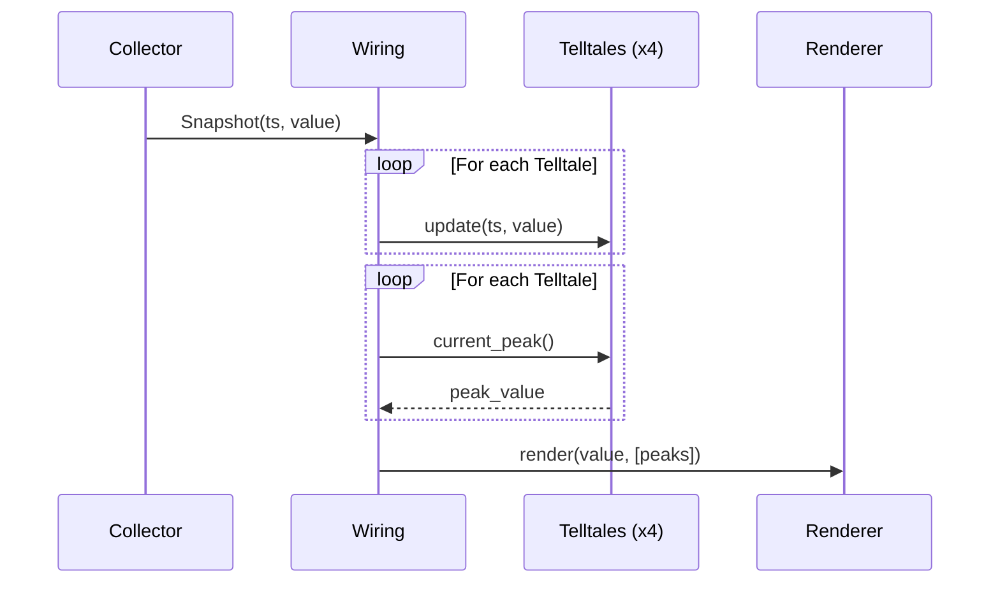

# Issue #2 - Feature: peak-hold telltale needles — 1m, 10m, 1h, all-time

<!-- Template Metadata
Last Updated: 2026-02-02
Updated By: Issue #117 fix
Update Reason: Moved Verification & Testing to Section 10 (was Section 11) to match 0702c review prompt and testing workflow expectations
Previous: Added sections based on 80 blocking issues from 164 governance verdicts (2026-02-01)
-->

## 1. Context & Goal
* **Issue:** #2
* **Objective:** Wire #41's Telltale logic to the live stream and #332's needle renderer, implementing the reset interaction and hover tooltip.
* **Status:** Approved (gemini-3.1-pro-high, 2026-10-06)
* **Related Issues:** #41, #331, #332, #7, #15, #4

### Open Questions
None.

## 2. Proposed Changes

### 2.1 Files Changed

| File | Change Type | Description |
|------|-------------|-------------|
| `src/boostgauge/gauge.py` | Add | Gauge UI widget, wiring the Telltales to the collector stream and renderer, tooltip/menu bindings |
| `src/boostgauge/formatters.py` | Add | Pure label and tooltip formatter logic |
| `tests/unit/test_telltale_wiring.py` | Add | Unit tier verifying fan-out, reset dispatch, and pure formatters |
| `tests/visual/test_telltale_render.py` | Add | Render-tier pixel classification and end-to-end composite assertion |

### 2.1.1 Path Validation (Mechanical - Auto-Checked)

Mechanical validation automatically checks:
- All "Modify" files must exist in repository
- All "Delete" files must exist in repository
- All "Add" files must have existing parent directories
- No placeholder prefixes (`src/`, `lib/`, `app/`) unless directory exists

### 2.2 Dependencies

```toml

# pyproject.toml additions (if any)

# None
```

### 2.3 Data Structures

```python
class TelltaleGroup:
    short: Telltale
    medium: Telltale
    long: Telltale
    all_time: Telltale

class TooltipLines(TypedDict):
    short: str
    medium: str
    long: str
    all_time: str
```

### 2.4 Function Signatures

```python

# src/boostgauge/formatters.py
def format_duration(seconds: float | None) -> str:
    """Render whole hours as 'Nh', whole minutes as 'Nm', else 'Ns', or 'All-time'."""
    ...

def format_menu_label(seconds: float | None) -> str:
    """Return 'Reset <label>'."""
    ...

def format_tooltip_lines(config: dict) -> list[str]:
    """Return the four tooltip lines in '<window label> — <color name>' format."""
    ...

# src/boostgauge/gauge.py (methods on GaugeWidget or similar)
def _on_tick(self, snapshot: SystemSnapshot) -> None:
    """Feed snapshot to telltales, then trigger render."""
    ...

def _reset_telltale(self, instance: Telltale) -> None:
    """Call reset() on the given instance."""
    ...

def _reset_all(self) -> None:
    """Call reset() on all four telltale instances."""
    ...
```

### 2.5 Logic Flow (Pseudocode)

```
1. Initialize Gauge:
   - Read config telltale_windows
   - Create 4 Telltale instances (short, medium, long, None)
   - Bind Hover -> show tooltip with formatted text
   - Bind Right-click -> show menu with formatted reset labels
2. On stream update (tick):
   - Extract timestamp and value
   - Call update(timestamp, value) on all 4 Telltale instances
   - Extract peaks = [t.current_peak() for t in telltales]
   - Call renderer with (value, peaks)
3. On menu reset selection:
   - Call reset() on the targeted Telltale(s)
```

### 2.6 Technical Approach

* **Module:** `src/boostgauge/gauge.py`, `src/boostgauge/formatters.py`
* **Pattern:** Humble Object / Pure Logic Extraction
* **Key Decisions:** Extracted tooltip and menu formatting into `formatters.py` to allow strict pure-function unit testing without `tkinter`. Tests inject a recording double for the renderer to verify `None` pass-through (W3), satisfying the pure unit tier strategy while visual tests cover the pixel composition.

### 2.7 Architecture Decisions

| Decision | Options Considered | Choice | Rationale |
|----------|-------------------|--------|-----------|
| Formatter placement | Inside UI class, Pure module | Pure module | Enables unit testing of all branches (RS6, U1) without `tkinter` instantiation, per Test Strategy Option C. |
| None pass-through verification | Pixel diff only, Injected double | Injected double | An injected recording renderer double proves the wiring does not intercept `None`, satisfying W3 reliably in the unit tier. |

**Architectural Constraints:**
- Must not instantiate `tkinter.Tk()` in the test suite (Option C).
- Must not specify color as loose adjectives in pass criteria; must use explicit palette RGBs.

## 3. Requirements

1. The app shall instantiate four Telltale instances: three with durations read from config keys (telltale_windows.short, medium, long) and one with window None for all-time.
2. The app shall feed every collector sample to all four instances via Telltale.update(timestamp, value), each receiving identical timestamp and value arguments.
3. The app shall pass all four current_peak() values to the renderer on every refresh, passing a None peak unmodified through the wiring layer.
4. The short-window menu entry shall call reset() on the short-window instance; the remaining three must be untouched.
5. The medium-window menu entry shall call reset() on the medium-window instance; the remaining three must be untouched.
6. The long-window menu entry shall call reset() on the long-window instance; the remaining three must be untouched.
7. The all-time menu entry shall call reset() on the all-time instance; the remaining three must be untouched.
8. The 'Reset All' menu entry shall call reset() on all four instances.
9. Menu entry labels shall derive from one pure formatter over the configured duration ('Nh', 'Nm', 'Ns', 'All-time'), outputting 'Reset ' plus the label.
10. The tooltip text function shall be pure and identify the four windows by color ('<window label> — cyan', etc.), mapped respectively to cyan, orange, magenta, coral red.
11. Hovering the gauge shall display a tooltip containing the four formatted identification lines.
12. Render-tier tests shall assert the composed image produced through the real renderer via pixel classification against cyan `#3BD7F0`, orange `#FF9A2E`, magenta `#D45BE8`, and coral red `#FF6E7A`.
13. A render-tier post-reset case shall send no samples between reset and capture to assert the absence of the reset needle's color family.

## 4. Alternatives Considered

| Option | Pros | Cons | Decision |
|--------|------|------|----------|
| Formatters inside UI | Less boilerplate | Harder to test all config branches without Tkinter | **Rejected** |
| Pure Formatter module | Highly testable, complies with Option C | Minor structural addition | **Selected** |

**Rationale:** The strict requirement to verify formatters against non-default configurations on all branches (90s/15m/2h) requires pure functions to avoid the overhead and test-strategy violation of instantiating the UI widget in tests.

## 5. Data & Fixtures

### 5.1 Data Sources

| Attribute | Value |
|-----------|-------|
| Source | Internal configuration / Collector Stream |
| Format | In-memory Python objects (`SystemSnapshot`) |
| Size | Single snapshot per tick |
| Refresh | Based on `polling_interval_seconds` (default 2s) |
| Copyright/License | N/A |

### 5.2 Data Pipeline

```
Collector ──tick──► Gauge Wiring ──fan_out──► 4x Telltale ──current_peak()──► Renderer
```

### 5.3 Test Fixtures

| Fixture | Source | Notes |
|---------|--------|-------|
| Synthetic Collector Stream | Hardcoded | Emits specific timestamp/value pairs to drive peak behavior |
| Recording Renderer Double | Generated | Captures peak arguments to verify `None` pass-through |

### 5.4 Deployment Pipeline
N/A - Internal application component.

## 6. Diagram

### 6.1 Mermaid Quality Gate

**Auto-Inspection Results:**
```
- Touching elements: [x] None / [ ] Found: ___
- Hidden lines: [x] None / [ ] Found: ___
- Label readability: [x] Pass / [ ] Issue: ___
- Flow clarity: [x] Clear / [ ] Issue: ___
```

### 6.2 Diagram


```mermaid
sequenceDiagram
    participant C as Collector
    participant W as Wiring
    participant T as Telltales (x4)
    participant R as Renderer

    C->>W: Snapshot(ts, value)
    loop For each Telltale
        W->>T: update(ts, value)
    end
    loop For each Telltale
        W->>T: current_peak()
        T-->>W: peak_value
    end
    W->>R: render(value, [peaks])
```

## 7. Security & Safety Considerations

### 7.1 Security

| Concern | Mitigation | Status |
|---------|------------|--------|
| Input injection via config | Validate duration integers in `config.py` | Addressed |

### 7.2 Safety

| Concern | Mitigation | Status |
|---------|------------|--------|
| Unbounded memory growth in deque | Handled downstream by #41 `Telltale` dropping aged samples | Addressed |

**Fail Mode:** Fail Closed - If configuration provides invalid values, the app configuration layer raises `ConfigError` before instantiation.

**Recovery Strategy:** The app falls back to defaults for corrupt configs, guaranteeing valid integers for durations.

## 8. Performance & Cost Considerations

### 8.1 Performance

| Metric | Budget | Approach |
|--------|--------|----------|
| Latency | < 5ms per tick | Amortized O(1) `Telltale` updates, simple function pass-through |
| Memory | Minimal | 4 lightweight `Telltale` objects storing only in-window samples |
| API Calls | 0 | Pure local compute |

**Bottlenecks:** Needle composition (handled by #332's image processing optimizations).

### 8.2 Cost Analysis

| Resource | Unit Cost | Estimated Usage | Monthly Cost |
|----------|-----------|-----------------|--------------|
| Cloud compute | $0 | 0 | $0 |

**Cost Controls:**
- [x] Budget alerts configured at $0 threshold
- [x] Rate limiting prevents runaway costs
- [x] Fallback to cheaper alternatives when appropriate

**Worst-Case Scenario:** High frequency metric updates could spin the render loop, but the tick is hardware-capped by the 2s collector polling interval.

## 9. Legal & Compliance

| Concern | Applies? | Mitigation |
|---------|----------|------------|
| PII/Personal Data | No | Local system metrics only |
| Third-Party Licenses | No | Standard Python dependencies |
| Terms of Service | No | No external APIs |
| Data Retention | No | Volatile memory, purged on reset |
| Export Controls | No | Standard open-source codebase |

**Data Classification:** Public

**Compliance Checklist:**
- [x] No PII stored without consent
- [x] All third-party licenses compatible with project license
- [x] External API usage compliant with provider ToS
- [x] Data retention policy documented

## 10. Verification & Testing

**Testing Philosophy:** Strive for 100% automated test coverage. Manual tests are a last resort for scenarios that genuinely cannot be automated (e.g., visual inspection, hardware interaction). Every scenario marked "Manual" requires justification.

### 10.0 Test Plan (TDD - Complete Before Implementation)

**TDD Requirement:** Tests MUST be written and failing BEFORE implementation begins.

| Test ID | Test Description | Expected Behavior | Status |
|---------|------------------|-------------------|--------|
| T010 | Instantiation config read | 4 instances created with correct windows | RED |
| T020 | Sample fan-out identically | update(ts, val) called symmetrically | RED |
| T030 | Peaks to renderer pass-through | Renderer double receives all 4 peaks, None preserved | RED |
| T040 | Reset dispatch | Specific instance reset based on ID, others untouched | RED |
| T050 | Format labels (default/custom) | Labels correct across all branch intervals | RED |
| T060 | Format tooltip text | Tooltip text maps labels to palette colors accurately | RED |
| T070 | Visual classification baseline | Pixels match cyan, orange, magenta, coral red | RED |
| T080 | Visual post-reset absence | Reset family absent from pixels | RED |

**Coverage Target:** 100%

**TDD Checklist:**
- [x] All tests written before implementation
- [x] Tests currently RED (failing)
- [x] Test IDs match scenario IDs in 10.1
- [x] Test file created at: `tests/unit/test_telltale_wiring.py`

### 10.1 Test Scenarios

| ID | Scenario | Type | Input | Expected Output | Pass Criteria |
|----|----------|------|-------|-----------------|---------------|
| 010 | Wiring construction (REQ-1) | Auto | Config with 60, 600, 3600 | 4 Telltales with 60, 600, 3600, None | Instances have correct `window` attributes |
| 020 | Sample fan-out (REQ-2) | Auto | Tick (ts=5.0, val=75) | All 4 instances updated | Mocks receive `(5.0, 75)` |
| 030 | Renderer feed (REQ-3) | Auto | 4 peaks: 10, 20, 30, 40 | Renderer called with peaks | Double args match `(10, 20, 30, 40)` |
| 040 | None pass-through (REQ-3) | Auto | Peaks with a None | Renderer called with None | Double args contain explicit `None` |
| 050 | Reset short menu (REQ-4) | Auto | Trigger RS1 | Short instance reset | `short.reset()` called, others 0 calls |
| 060 | Reset medium menu (REQ-5) | Auto | Trigger RS2 | Medium instance reset | `medium.reset()` called, others 0 calls |
| 070 | Reset long menu (REQ-6) | Auto | Trigger RS3 | Long instance reset | `long.reset()` called, others 0 calls |
| 080 | Reset all-time menu (REQ-7) | Auto | Trigger RS4 | All-time instance reset | `all_time.reset()` called, others 0 calls |
| 090 | Reset all menu (REQ-8) | Auto | Trigger RS5 | All instances reset | All 4 `reset()` called |
| 100 | Format labels default (REQ-9) | Auto | 60, 600, 3600, None | 'Reset 1m', 'Reset 10m', 'Reset 1h', 'Reset All-time' | Exact string equality |
| 110 | Format labels custom (REQ-9) | Auto | 90, 900, 7200 | 'Reset 90s', 'Reset 15m', 'Reset 2h' | Exact string equality |
| 120 | Tooltip formatting default (REQ-10) | Auto | 60, 600, 3600 | '1m — cyan', '10m — orange', '1h — magenta', 'All-time — coral red' | Exact string equality |
| 130 | Tooltip formatting custom (REQ-10) | Auto | 90, 900, 7200 | '90s — cyan', '15m — orange', '2h — magenta' | Exact string equality |
| 140 | Hover displays tooltip (REQ-11) | Auto | Hover event triggered | Tooltip content set | Tooltip text matches formatter output |
| 150 | Visual baseline presence (REQ-12) | Auto | 4 distinct peaks | All 4 needles present | Pixels classified as cyan `#3BD7F0`, orange `#FF9A2E`, magenta `#D45BE8`, coral red `#FF6E7A` |
| 160 | Visual post-reset absence (REQ-13) | Auto | Reset 1m, 0 new samples | Short needle absent | `#3BD7F0` cyan family absent from sample pixels |

### 10.2 Test Commands

```bash

# Run pure logic and wiring tests
poetry run pytest tests/unit/test_telltale_wiring.py -v

# Run visual classification tests (requires generation flag if baseline missing)
poetry run pytest tests/visual/test_telltale_render.py -v --generate-baselines
```

### 10.3 Manual Tests (Only If Unavoidable)

N/A - All scenarios automated. Option C strictly requires `tkinter.Tk()` to remain uninstantiated during the suite, testing logic purely and visual outputs via PIL.

## 11. Risks & Mitigations

| Risk | Impact | Likelihood | Mitigation |
|------|--------|------------|------------|
| Pass-through interception | Med | Med | M1: Test T040 asserts the injected renderer double receives literal `None`, bypassing pixel obfuscation to prove pure pass-through (handled by `_on_tick`). |
| Incomplete formatter coverage | Low | Low | M2: Format tests strictly test 90s, 15m, and 2h paths to ensure no hardcoded defaults slip in (handled by `format_duration`). |
| Baseline canonizing wrong render | High | Low | M3: T070/T150 asserts presence independently via RGB classification against the palette BEFORE asserting the baseline (handled by visual test asserts). |

## 12. Definition of Done

### Code
- [ ] Implementation complete and linted
- [ ] Code comments reference this LLD

### Tests
- [ ] All test scenarios pass
- [ ] Test coverage meets threshold (100% reachable coverage)

### Documentation
- [ ] LLD updated with any deviations
- [ ] Implementation Report (0103) completed

### Review
- [ ] Code review completed
- [ ] User approval before closing issue

### 12.1 Traceability (Mechanical - Auto-Checked)

Mechanical validation automatically checks:
- Every file mentioned in this section must appear in Section 2.1
- Every risk mitigation in Section 11 should have a corresponding function in Section 2.4 (warning if not)

---

## Reviewer Suggestions

*Non-blocking recommendations from the reviewer.*

- **Debug Logging:** Consider adding `DEBUG` level logs to the `_reset_telltale` methods (e.g., `logger.debug("Resetting %s telltale", instance.window)`) to aid in future operational troubleshooting without needing to rely solely on visual inspection.
- **Config Warning:** Section 7.2 mentions falling back to defaults if corrupt configs are provided. Ensure a `WARNING` level log is emitted by the config layer when this fallback occurs so users can easily debug configuration typos.

## Appendix: Review Log

### Orchestrator Review #1 (PENDING)

**Reviewer:** Orchestrator
**Verdict:** PENDING

#### Comments

| ID | Comment | Implemented? |
|----|---------|--------------|
| O1.1 | "Pending initial review" | PENDING |

### Review Summary

| Review | Date | Verdict | Key Issue |
|--------|------|---------|-----------|
| 1 | 2026-10-06 | APPROVED | `gemini-3.1-pro-high` (`gemini:3.1-pro`) |
| Orchestrator #1 | (auto) | PENDING | Initial draft submission |

**Final Status:** APPROVED