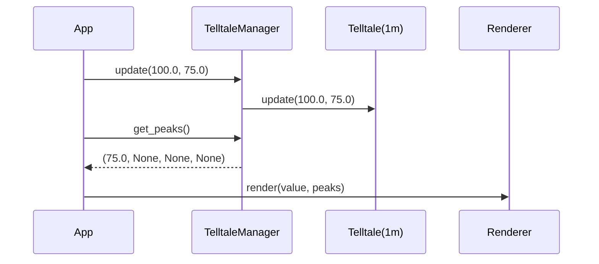

# 2 - Feature: peak-hold telltale needles — 1m, 10m, 1h, all-time

<!-- Template Metadata
Last Updated: 2026-02-02
Updated By: Issue #117 fix
Update Reason: Moved Verification & Testing to Section 10 (was Section 11) to match 0702c review prompt and testing workflow expectations
Previous: Added sections based on 80 blocking issues from 164 governance verdicts (2026-02-01)
-->

## 1. Context & Goal
* **Issue:** #2
* **Objective:** Wire the peak-hold Telltale algorithm to the live metrics stream and renderer to render four telltale needles (1m, 10m, 1h, all-time), and provide pure handlers for tooltip identification and reset interactions.
* **Status:** Approved (gemini-3.1-pro-high, 2026-10-07)
* **Related Issues:** #41, #331, #332, #7, #4, #15

### Open Questions
None.

## 2. Proposed Changes

### 2.1 Files Changed

| File | Change Type | Description |
|------|-------------|-------------|
| `src/boostgauge/telltale_wiring.py` | Add | Pure integration layer for managing the 4 instances, routing samples, formatting labels, and dispatching resets. |
| `tests/unit/test_telltale_wiring.py` | Add | Unit tier tests for construction, fan-out, reset dispatch, label formatting, and tooltip logic via recording doubles. |
| `tests/visual/test_telltale_render.py` | Add | Render-tier pixel classification tests using the real renderer to verify needle presence and absence. |

### 2.1.1 Path Validation (Mechanical - Auto-Checked)

Mechanical validation automatically checks:
- All "Modify" files must exist in repository
- All "Delete" files must exist in repository
- All "Add" files must have existing parent directories
- No placeholder prefixes (`src/`, `lib/`, `app/`) unless directory exists

### 2.2 Dependencies

```toml

# No new dependencies needed beyond what is already in pyproject.toml
```

### 2.3 Data Structures

```python
class TelltaleState(TypedDict):
    short: float | None
    medium: float | None
    long: float | None
    all_time: float | None

class TelltaleColors(TypedDict):
    name: str
    rgb: tuple[int, int, int]
```

### 2.4 Function Signatures

```python

# src/boostgauge/telltale_wiring.py

def format_duration(seconds: float | None) -> str:
    """Pure formatter over configured duration."""
    ...

class TelltaleManager:
    """Manages the four telltale instances, completely decoupled from tkinter."""

    def __init__(self, config_windows: dict) -> None:
        """Construct four Telltale instances based on configuration."""
        ...

    def update(self, timestamp: float, value: float) -> None:
        """Fan-out one sample to all four instances."""
        ...

    def get_peaks(self) -> tuple[float | None, float | None, float | None, float | None]:
        """Return the 4-slot tuple for the renderer."""
        ...

    def reset(self, target: str) -> None:
        """Dispatch reset to the specified instance(s). target is 'short', 'medium', 'long', 'all-time', or 'all'."""
        ...

    def get_menu_labels(self) -> dict[str, str]:
        """Return dynamically formatted menu entry labels."""
        ...

    def get_tooltip_text(self) -> str:
        """Return the multi-line tooltip string identifying windows and colors."""
        ...
```

### 2.5 Logic Flow (Pseudocode)

```
1. ON Initialization:
   - Read config windows.
   - Construct Telltale(short), Telltale(medium), Telltale(long), Telltale(None).
2. ON Update(timestamp, value):
   - For each instance: instance.update(timestamp, value).
3. ON Refresh:
   - Call get_peaks() -> returns tuple of 4 current_peak() values.
   - Pass tuple directly to renderer.
4. ON Hover (Tooltip):
   - Call get_tooltip_text() -> formats label per window and appends ' — <color name>'.
5. ON Menu Action (Reset):
   - Match target identifier and call reset() on the corresponding instance(s).
```

### 2.6 Technical Approach

* **Module:** `src/boostgauge/telltale_wiring.py`
* **Pattern:** Manager / Facade
* **Key Decisions:** Extracted integration logic into a pure Python class (`TelltaleManager`). This ensures the app-layer wiring is decoupled from `tkinter`, enabling full unit testability without instantiating `tkinter.Tk()` in tests, adhering perfectly to test strategy Option C.

### 2.7 Architecture Decisions

| Decision | Options Considered | Choice | Rationale |
|----------|-------------------|--------|-----------|
| Menu & Tooltip Formatting | Hardcode vs Dynamic | Dynamic | Must reflect true configured duration; hardcoded strings would drift from configuration. |
| Test Tiers | Mocked Tkinter vs Pure Logic | Pure Logic | Option C forbids Tkinter in tests; purely functional handlers can be tested fully offline. |

**Architectural Constraints:**
- Must integrate with existing `#332` renderer.
- Must read configuration from `#7` `TelltaleWindows`.
- Cannot instantiate GUI elements in unit tests.

## 3. Requirements

1. The app shall instantiate four `Telltale` instances: three with durations read from `telltale_windows.short`, `telltale_windows.medium`, `telltale_windows.long`, and one with window `None` for all-time.
2. The app shall feed every collector sample to all four instances via `Telltale.update(timestamp, value)`, each instance receiving the same `timestamp` and `value` for every sample.
3. Every refresh shall pass all four `current_peak()` values to the renderer as the four-slot telltales argument; a `None` peak reaches the renderer as `None` in its slot.
4. The short-window menu entry shall call `reset()` on the short-window instance, leaving the remaining three untouched.
5. The medium-window menu entry shall call `reset()` on the medium-window instance, leaving the remaining three untouched.
6. The long-window menu entry shall call `reset()` on the long-window instance, leaving the remaining three untouched.
7. The all-time menu entry shall call `reset()` on the all-time instance, leaving the remaining three untouched.
8. The 'Reset All' menu entry shall call `reset()` on all four instances.
9. Menu entry labels and tooltip lines shall derive from one pure formatter over the configured duration: a whole number of hours renders 'Nh', else whole minutes 'Nm', else 'Ns'; the all-time instance renders 'All-time'.
10. Hovering the gauge shall show a tooltip identifying each window, one line per window in the form '<window label> — <color name>', using the aesthetic doc's color names (cyan, orange, magenta, coral red) and verified against non-default configurations.
11. Render-tier tests shall assert the composed image produced end-to-end through the real renderer via pixel classification against the aesthetic doc's palette rows (cyan `#3BD7F0`, orange `#FF9A2E`, magenta `#D45BE8`, coral red `#FF6E7A`) to establish needle presence and absence, pinned by a self-generated baseline.

## 4. Alternatives Considered

| Option | Pros | Cons | Decision |
|--------|------|------|----------|
| Mix wiring into `gauge.py` | Consolidates GUI logic | Violates test strategy Option C by requiring Tkinter mocking | **Rejected** |
| Pure `TelltaleManager` | Fully unit testable without Tkinter | Small architectural indirection | **Selected** |

**Rationale:** Option C of the test strategy strictly dictates that `tkinter.Tk()` is never instantiated in tests. A pure logic module provides absolute testing safety and decouples data flow from GUI execution.

## 5. Data & Fixtures

### 5.1 Data Sources

| Attribute | Value |
|-----------|-------|
| Source | Internal configuration and synthetic streams |
| Format | Native Python objects |
| Size | Negligible |
| Refresh | Real-time event driven |
| Copyright/License | N/A |

### 5.2 Data Pipeline

```
{Collector} ──update(timestamp, value)──► {TelltaleManager} ──get_peaks()──► {Renderer}
```

### 5.3 Test Fixtures

| Fixture | Source | Notes |
|---------|--------|-------|
| Mock Configuration | Hardcoded | 60, 600, 3600 |
| Synthetic Samples | Hardcoded | Sequential float timestamps |
| Render Baselines | Generated | Generated locally via `--generate-baselines` |

### 5.4 Deployment Pipeline
Standard local test execution via `pytest`. Visual baselines checked into the repository alongside code.

## 6. Diagram

### 6.1 Mermaid Quality Gate

**Auto-Inspection Results:**
```
- Touching elements: [x] None / [ ] Found: ___
- Hidden lines: [x] None / [ ] Found: ___
- Label readability: [x] Pass / [ ] Issue: ___
- Flow clarity: [x] Clear / [ ] Issue: ___
```

### 6.2 Diagram


```mermaid
sequenceDiagram
    participant App
    participant Manager as TelltaleManager
    participant T1 as Telltale(1m)
    participant Renderer

    App->>Manager: update(100.0, 75.0)
    Manager->>T1: update(100.0, 75.0)
    App->>Manager: get_peaks()
    Manager-->>App: (75.0, None, None, None)
    App->>Renderer: render(value, peaks)
```

## 7. Security & Safety Considerations

### 7.1 Security

| Concern | Mitigation | Status |
|---------|------------|--------|
| Logic injection via config | Validate configurations at entry point (handled by #7) | Addressed |

### 7.2 Safety

| Concern | Mitigation | Status |
|---------|------------|--------|
| Missing configuration | Default values used by fallback pipeline | Addressed |
| None peaks failing renderer | Manager passes `None` faithfully; Renderer built to handle `None` gracefully | Addressed |

**Fail Mode:** Fail Open - Will continue tracking other durations if one stream encounters malformed inputs.
**Recovery Strategy:** Next `update()` or `reset()` flushes malformed state boundaries natively.

## 8. Performance & Cost Considerations

### 8.1 Performance

| Metric | Budget | Approach |
|--------|--------|----------|
| Update Latency | < 1ms | 4x O(1) deque insertions |
| Memory | Negligible | Bound to max ticks within window |

**Bottlenecks:** Deque size for 1h window at 2s poll interval is 1800 floats. Completely negligible.

### 8.2 Cost Analysis

| Resource | Unit Cost | Estimated Usage | Monthly Cost |
|----------|-----------|-----------------|--------------|
| Cloud Compute | $0 | 0 hours | $0 |

**Cost Controls:**
- [x] N/A - Runs strictly locally

## 9. Legal & Compliance

| Concern | Applies? | Mitigation |
|---------|----------|------------|
| PII/Personal Data | No | N/A |
| Third-Party Licenses | No | N/A |
| Terms of Service | No | N/A |
| Data Retention | No | N/A |
| Export Controls | No | N/A |

**Data Classification:** Public

**Compliance Checklist:**
- [x] No PII stored without consent
- [x] All third-party licenses compatible with project license
- [x] External API usage compliant with provider ToS
- [x] Data retention policy documented

## 10. Verification & Testing

*Ref: `docs/design/0001-test-strategy.md`*

**Testing Philosophy:** Strive for 100% automated test coverage. `tkinter.Tk()` is never instantiated in tests. Visual regression baselines require an explicit `--generate-baselines` flag. Pass criteria carry exact numeric values.

### 10.0 Test Plan (TDD - Complete Before Implementation)

**Coverage Target:** ≥100% for all new code in `src/boostgauge/telltale_wiring.py`.

**TDD Checklist:**
- [ ] All tests written before implementation
- [ ] Tests currently RED (failing)
- [ ] Test IDs match scenario IDs in 10.1
- [ ] Test file created at: `tests/unit/test_telltale_wiring.py`

### 10.1 Test Scenarios

| ID | Scenario | Type | Input | Expected Output | Pass Criteria |
|----|----------|------|-------|-----------------|---------------|
| 010 | Construct with default configs (REQ-1) | Auto | Default config dict | 4 `Telltale` instances | Windows are exactly 60, 600, 3600, and `None` |
| 020 | Fan-out update to all (REQ-2) | Auto | `timestamp=100.0, value=75.0` | All 4 instances updated | Each instance receives exact `(100.0, 75.0)` |
| 030 | Refresh pass-through including None (REQ-3) | Auto | 3 peaks have values, 1 is None | Renderer double called with None in correct slot | Renderer argument `telltales` has `None` in the reset slot |
| 040 | Reset dispatch: short-window (REQ-4) | Auto | `short` target | Only short instance is reset | `short` current_peak() is None; others untouched |
| 050 | Reset dispatch: medium-window (REQ-5) | Auto | `medium` target | Only medium instance is reset | `medium` current_peak() is None; others untouched |
| 060 | Reset dispatch: long-window (REQ-6) | Auto | `long` target | Only long instance is reset | `long` current_peak() is None; others untouched |
| 070 | Reset dispatch: all-time (REQ-7) | Auto | `all-time` target | Only all-time instance is reset | `all-time` current_peak() is None; others untouched |
| 080 | Reset dispatch: Reset All (REQ-8) | Auto | `all` target | All instances reset | All 4 current_peak() return None |
| 090 | Dynamic menu labels at default and non-default (REQ-9) | Auto | 90s, 900s, 7200s, None configs | Label strings | Read exactly: 'Reset 90s', 'Reset 15m', 'Reset 2h', 'Reset All-time' |
| 100 | Tooltip formatting at default and non-default (REQ-10) | Auto | 60s/600s/3600s, then 90s/900s/7200s configs | Lines matching aesthetic names | Lines read exactly: '1m — cyan', '10m — orange', '1h — magenta', 'All-time — coral red', and '90s — cyan', '15m — orange', '2h — magenta' |
| 110 | Composed rendering finds all 4 peaks (REQ-11) | Auto | Synthetic stream with 4 distinct peaks | Rendered PIL Image | Classification finds pixels matching `#3BD7F0`, `#FF9A2E`, `#D45BE8`, `#FF6E7A` |
| 120 | Post-reset render absence (REQ-11) | Auto | Reset short, 0 samples | Rendered PIL Image | Classification finds cyan `#3BD7F0` absent from image |

### 10.2 Test Commands

```bash

# Run unit tests
poetry run pytest tests/unit/test_telltale_wiring.py -v

# Run visual tier pixel classification and baseline tests
poetry run pytest tests/visual/test_telltale_render.py -v --generate-baselines
```

### 10.3 Manual Tests (Only If Unavoidable)

N/A - All scenarios automated. Option C strictly requires headless assertions against PIL Images and pure python handlers.

## 11. Risks & Mitigations

| Risk | Impact | Likelihood | Mitigation |
|------|--------|------------|------------|
| Render mismatch vs expected `#332` composition | High | Low | V1 tests perform pixel-classification end-to-end to catch regressions, using self-generated baselines. |
| Formatting label hardcoding drifts from real config | Med | Med | Menu labels and tooltips use a single pure `format_duration` function covering every branch, heavily unit-tested. |
| UI/Render tier test flakiness due to Tkinter | High | Low | The `TelltaleManager` decouples pure wiring logic so Tkinter is absolutely never instantiated in tests. |

## 12. Definition of Done

### Code
- [ ] Implementation complete and linted
- [ ] Code comments reference this LLD

### Tests
- [ ] All test scenarios pass
- [ ] Test coverage meets threshold (100% target for the new pure module)

### Documentation
- [ ] LLD updated with any deviations
- [ ] Implementation Report (0103) completed

### Review
- [ ] Code review completed
- [ ] User approval before closing issue

### 12.1 Traceability (Mechanical - Auto-Checked)

Mechanical validation automatically checks:
- Every file mentioned in this section must appear in Section 2.1
- Every risk mitigation in Section 11 should have a corresponding function in Section 2.4 (warning if not)

---

## Appendix: Review Log

### Initial Draft Review #1 (PENDING)

**Reviewer:** Orchestrator
**Verdict:** PENDING

#### Comments

| ID | Comment | Implemented? |
|----|---------|--------------|
| N/A | Initial creation | N/A |

### Review Summary

| Review | Date | Verdict | Key Issue |
|--------|------|---------|-----------|
| 1 | 2026-10-07 | APPROVED | `gemini-3.1-pro-high` (`gemini:3.1-pro`) |
| Draft #1 | (auto) | PENDING | Creation |

**Final Status:** APPROVED