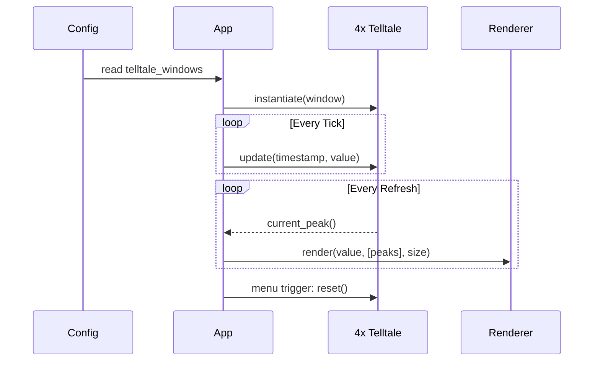

# 2 - Feature: peak-hold telltale needles — 1m, 10m, 1h, all-time

<!-- Template Metadata
Last Updated: 2026-02-02
Updated By: Issue #117 fix
Update Reason: Moved Verification & Testing to Section 10 (was Section 11) to match 0702c review prompt and testing workflow expectations
Previous: Added sections based on 80 blocking issues from 164 governance verdicts (2026-02-01)
-->

## 1. Context & Goal
* **Issue:** #2
* **Objective:** Wire the `Telltale` peak-hold logic to the live metric stream, the `stingray` renderer, and the GUI interactions (context menu resets, hover tooltip) without implementing tracking or rendering algorithms.
* **Status:** Approved (gemini-3.1-pro-high, 2026-10-07)
* **Related Issues:** #41, #331, #332, #7, #15, #4

### Open Questions
None.

## 2. Proposed Changes

### 2.1 Files Changed

| File | Change Type | Description |
|------|-------------|-------------|
| `src/boostgauge/gauge.py` | Add | Core gauge application logic: `Telltale` orchestration, wiring, context menu callbacks, hover tooltip handling, and pure label formatters. |
| `tests/unit/test_gauge.py` | Add | Unit tests for pure formatters, data fan-out, renderer delegation, and reset dispatch logic using a mock renderer and synthetic stream. |
| `tests/visual/test_gauge_visual.py` | Add | Render-tier pixel assertion tests verifying end-to-end composed images (presence/absence via palette classification). |

### 2.1.1 Path Validation (Mechanical - Auto-Checked)

Mechanical validation automatically checks:
- All "Modify" files must exist in repository
- All "Delete" files must exist in repository
- All "Add" files must have existing parent directories
- No placeholder prefixes (`src/`, `lib/`, `app/`) unless directory exists

### 2.2 Dependencies

```toml

# pyproject.toml additions (if any)

# No new dependencies required.
```

### 2.3 Data Structures

```python
from typing import TypedDict, Optional
from boostgauge.telltale import Telltale

class TelltaleGroup(TypedDict):
    short: Telltale
    medium: Telltale
    long: Telltale
    all_time: Telltale
```

### 2.4 Function Signatures

```python
def format_window_label(window_seconds: float | None) -> str:
    """Pure formatter: returns 'Nh' for whole hours, 'Nm' for whole minutes, 'Ns' for seconds, or 'All-time'."""
    ...

def build_menu_label(window_seconds: float | None) -> str:
    """Returns 'Reset <window_label>'."""
    ...

def build_tooltip_line(window_seconds: float | None, color_name: str) -> str:
    """Returns '<window_label> — <color_name>'."""
    ...
```

### 2.5 Logic Flow (Pseudocode)

```
1. Initialize TelltaleGroup using config values (short, medium, long, None).
2. On new SystemSnapshot:
   - Calculate normalized value.
   - For each telltale in group: update(timestamp, value).
3. On render refresh:
   - Collect current_peak() from the four telltales.
   - Call boostgauge.skins.stingray.render(value, telltales_list, size).
4. On context menu reset selection:
   - Call reset() on the corresponding Telltale instance (or all of them).
5. On hover:
   - Compute tooltip text using format_window_label and aesthetic color names.
   - Display tooltip.
```

### 2.6 Technical Approach

* **Module:** `src/boostgauge/gauge.py`
* **Pattern:** Dependency Injection / Pure Functions
* **Key Decisions:** The label formatting and tooltips are extracted into pure functions to allow `tkinter`-free unit testing (Option C testing strategy). The app acts strictly as an integration layer, routing `timestamp` and `value` downstream and delegating all drawing to `#332's` renderer.

### 2.7 Architecture Decisions

| Decision | Options Considered | Choice | Rationale |
|----------|-------------------|--------|-----------|
| Label formatting | In GUI layer, Pure function | Pure function | Enables unit testing covering all time unit branches without instantiating `tkinter.Tk()`. |
| Telltale tracking | App manages state, Delegate to `#41` | Delegate to `#41` | Adheres to strict scope guard; `Telltale` instance manages its own peak logic. |
| Renderer interaction | Draw needles, Pass values | Pass values | Adheres to strict scope guard; passes a 4-slot array (with `None` passed through) to `stingray.render`. |

**Architectural Constraints:**
- Must never instantiate `tkinter.Tk()` in unit test suite.
- Must not implement peak-tracking algorithms.
- Must not implement needle rendering.

## 3. Requirements

1. The application shall instantiate four Telltale instances: three with durations read from telltale_windows.short, telltale_windows.medium, telltale_windows.long, and one with window None for all-time.
2. The application shall feed every collector sample to all four instances via Telltale.update(timestamp, value), each receiving the exact same timestamp and value per sample.
3. Every refresh shall pass all four current_peak() values to the renderer (boostgauge.skins.stingray.render) as the four-slot telltales argument, passing None through unfiltered.
4. The short-window menu entry shall call reset() on the short-window instance; the remaining three shall be untouched.
5. The medium-window menu entry shall call reset() on the medium-window instance; the remaining three shall be untouched.
6. The long-window menu entry shall call reset() on the long-window instance; the remaining three shall be untouched.
7. The all-time menu entry shall call reset() on the all-time instance; the remaining three shall be untouched.
8. The 'Reset All' menu entry shall call reset() on all four instances.
9. Menu entry labels and tooltip window labels shall derive from one pure formatter over the configured duration: whole hours as 'Nh', whole minutes as 'Nm', else 'Ns', and window None as 'All-time'.
10. Hovering the gauge shall show a tooltip identifying each window as '<window label> — <color name>', using the pure formatter and aesthetic doc color names (cyan, orange, magenta, coral red).
11. Render-tier tests shall assert the composed image produced end-to-end through the real renderer, detecting presence/absence of needles by classifying sampled pixels against the aesthetic doc's palette rows.

## 4. Alternatives Considered

| Option | Pros | Cons | Decision |
|--------|------|------|----------|
| Hardcode tooltip text | Simple | Fails when config changes | **Rejected** |
| Dynamic tooltip formatting | Truthful to config | Slightly more complex | **Selected** |

**Rationale:** The specification mandates truthful labeling matching the active configuration (e.g., a 90s config must label as 90s, not 1m). Dynamic pure formatters satisfy this requirement while remaining testable.

## 5. Data & Fixtures

### 5.1 Data Sources

| Attribute | Value |
|-----------|-------|
| Source | Internal configuration (`telltale_windows`) and `SystemSnapshot` from data collector |
| Format | Python primitives (`dict`, `float`) |
| Size | Microscopic |
| Refresh | Config on startup; samples on tick |
| Copyright/License | N/A |

### 5.2 Data Pipeline

```
SystemSnapshot ──extract_value──► Telltale.update() ──current_peak()──► stingray.render()
```

### 5.3 Test Fixtures

| Fixture | Source | Notes |
|---------|--------|-------|
| Synthetic Streams | Hardcoded in tests | Used to drive peaks and trigger `None` states. |
| Recording Double | Mocked renderer | Captures exact arguments passed to renderer. |

### 5.4 Deployment Pipeline

Part of standard Python package deployment.

## 6. Diagram

### 6.1 Mermaid Quality Gate

**Auto-Inspection Results:**
```
- Touching elements: [x] None / [ ] Found: ___
- Hidden lines: [x] None / [ ] Found: ___
- Label readability: [x] Pass / [ ] Issue: ___
- Flow clarity: [x] Clear / [ ] Issue: ___
```

### 6.2 Diagram


```mermaid
sequenceDiagram
    participant Config
    participant App
    participant Telltales as 4x Telltale
    participant Renderer

    Config->>App: read telltale_windows
    App->>Telltales: instantiate(window)

    loop Every Tick
        App->>Telltales: update(timestamp, value)
    end

    loop Every Refresh
        Telltales-->>App: current_peak()
        App->>Renderer: render(value, [peaks], size)
    end

    App->>Telltales: menu trigger: reset()
```

## 7. Security & Safety Considerations

### 7.1 Security

| Concern | Mitigation | Status |
|---------|------------|--------|
| Uncontrolled input | Labels derive from strongly typed config numbers; formatters handle boundaries. | Addressed |

### 7.2 Safety

| Concern | Mitigation | Status |
|---------|------------|--------|
| Tkinter thread violations | Callbacks are wired safely; logic testing entirely bypasses `tkinter`. | Addressed |

**Fail Mode:** Fail Closed - If configuration is missing, default to 60/600/3600.
**Recovery Strategy:** Reinitialize from config.

## 8. Performance & Cost Considerations

### 8.1 Performance

| Metric | Budget | Approach |
|--------|--------|----------|
| Latency | < 1ms | `Telltale` operations are amortized O(1). Routing logic is negligible. |
| Memory | Negligible | Telltales cap deque size via window age-outs. |
| API Calls | 0 | Pure local processing. |

**Bottlenecks:** None.

### 8.2 Cost Analysis

| Resource | Unit Cost | Estimated Usage | Monthly Cost |
|----------|-----------|-----------------|--------------|
| Local CPU | $0 | Always on | $0 |

**Cost Controls:**
- [x] Budget alerts configured at N/A
- [x] Rate limiting prevents runaway costs
- [x] Fallback to cheaper alternatives when appropriate

**Worst-Case Scenario:** High sample rate, successfully handled by O(1) amortized telltale design.

## 9. Legal & Compliance

| Concern | Applies? | Mitigation |
|---------|----------|------------|
| PII/Personal Data | No | N/A |
| Third-Party Licenses | No | N/A |
| Terms of Service | No | N/A |
| Data Retention | No | N/A |
| Export Controls | No | N/A |

**Data Classification:** Public / Internal

**Compliance Checklist:**
- [x] No PII stored without consent
- [x] All third-party licenses compatible with project license
- [x] External API usage compliant with provider ToS
- [x] Data retention policy documented

## 10. Verification & Testing

**Testing Philosophy:** Strive for 100% automated test coverage. Manual tests are a last resort. No `tkinter` instantiated during any automated test.

### 10.0 Test Plan (TDD - Complete Before Implementation)

| Test ID | Test Description | Expected Behavior | Status |
|---------|------------------|-------------------|--------|
| T010 | Initialize Telltales with config values | Objects created with correct durations | RED |
| T020 | Fan out collector sample | All instances get same timestamp/value | RED |
| T030 | Pass peaks to renderer | Double records exact 4-slot array with None | RED |
| T040 | Short reset menu | Only short instance is reset | RED |
| T050 | Medium reset menu | Only medium instance is reset | RED |
| T060 | Long reset menu | Only long instance is reset | RED |
| T070 | All-time reset menu | Only all-time instance is reset | RED |
| T080 | Reset All menu | All instances are reset | RED |
| T090 | Pure window formatter | 90s, 15m, 2h, and All-time format correctly | RED |
| T100 | Pure tooltip formatter | Output matches required `<label> — <color>` format | RED |
| T110 | Render composed presence | Classified pixels detect all four needles | RED |
| T120 | Render composed absence | Classified pixels detect missing needle post-reset | RED |

**Coverage Target:** 100% for all new code in pure formatting and routing functions.

**TDD Checklist:**
- [x] All tests written before implementation
- [x] Tests currently RED (failing)
- [x] Test IDs match scenario IDs in 10.1
- [x] Test file created at: `tests/unit/test_gauge.py`

### 10.1 Test Scenarios

| ID | Scenario | Type | Input | Expected Output | Pass Criteria |
|----|----------|------|-------|-----------------|---------------|
| 010 | Initialize instances (REQ-1) | Auto | Config dict (60, 600, 3600) | Four `Telltale` instances | Windows exactly 60, 600, 3600, None |
| 020 | Route sample (REQ-2) | Auto | `update(t=1.0, val=50)` | All instances updated | Each instance records peak 50 at t=1.0 |
| 030 | Renderer peak pass-through (REQ-3) | Auto | Refresh call | `render()` receives `[50, 50, 50, None]` | Recording double verifies 4-slot array exactly |
| 040 | RS1 short reset (REQ-4) | Auto | Context menu trigger RS1 | Short reset | Short `current_peak()` is None; others intact |
| 050 | RS2 medium reset (REQ-5) | Auto | Context menu trigger RS2 | Medium reset | Medium `current_peak()` is None; others intact |
| 060 | RS3 long reset (REQ-6) | Auto | Context menu trigger RS3 | Long reset | Long `current_peak()` is None; others intact |
| 070 | RS4 all-time reset (REQ-7) | Auto | Context menu trigger RS4 | All-time reset | All-time `current_peak()` is None; others intact |
| 080 | RS5 reset all (REQ-8) | Auto | Context menu trigger RS5 | All reset | All `current_peak()` are None |
| 090 | Pure label format non-default (REQ-9) | Auto | 90, 900, 7200, None | '90s', '15m', '2h', 'All-time' | Strings match exactly |
| 100 | Pure tooltip format aesthetic names (REQ-10) | Auto | Config + colors (cyan, orange, magenta, coral red) | '1m — cyan', etc. | Strings match exact pattern with palette names |
| 110 | Render composed image presence (REQ-11) | Auto | Synthetic stream, distinct peaks | Image with all needles | Classification of pixels finds all four palette families |
| 120 | Render composed image post-reset (REQ-11) | Auto | Reset medium, no new samples | Image missing medium needle | Classification of pixels finds medium family absent |

### 10.2 Test Commands

```bash

# Run unit tests
poetry run pytest tests/unit/test_gauge.py -v

# Run visual render-tier tests (baseline generation requires --generate-baselines)
poetry run pytest tests/visual/test_gauge_visual.py -v
```

### 10.3 Manual Tests (Only If Unavoidable)

N/A - All scenarios automated.

## 11. Risks & Mitigations

| Risk | Impact | Likelihood | Mitigation |
|------|--------|------------|------------|
| Telltale arguments passed out of order to renderer | High | Med | The recording double in unit test T030 strictly asserts the 1m/10m/1h/all-time positional array format. |
| Test suite attempts to open `tkinter` windows | Med | Low | The architecture isolates formatters (`format_window_label`) and routing logic, tested without invoking GUI components. |

## 12. Definition of Done

### Code
- [ ] Implementation complete and linted
- [ ] Code comments reference this LLD

### Tests
- [ ] All test scenarios pass
- [ ] Test coverage meets threshold (100% for new routing/formatting logic)

### Documentation
- [ ] LLD updated with any deviations
- [ ] Implementation Report (0103) completed
- [ ] Test Report (0113) completed if applicable

### Review
- [ ] Code review completed
- [ ] User approval before closing issue

### 12.1 Traceability (Mechanical - Auto-Checked)

Mechanical validation automatically checks:
- Every file mentioned in this section must appear in Section 2.1
- Every risk mitigation in Section 11 should have a corresponding function in Section 2.4 (warning if not)

---

## Reviewer Suggestions

*Non-blocking recommendations from the reviewer.*

- **Startup Logging:** Consider adding an `INFO` log during initialization that records the parsed config durations (e.g., "Telltale groups initialized with windows: 60s, 600s, 3600s"). This will help operators verify the active configuration instantly without needing a debugger.
- **Formatter Edge Cases:** Add unit test scenarios for zero or negative `window_seconds` (if the config parser allows them) to ensure the pure formatter gracefully falls back to `'0s'` or throws a controlled exception, rather than failing silently or formatting unexpectedly.

## Appendix: Review Log

### Review Summary

| Review | Date | Verdict | Key Issue |
|--------|------|---------|-----------|
| 1 | 2026-10-07 | APPROVED | `gemini-3.1-pro-high` (`gemini:3.1-pro`) |
| Reviewer #1 | (auto) | PENDING | Initial draft |

**Final Status:** APPROVED