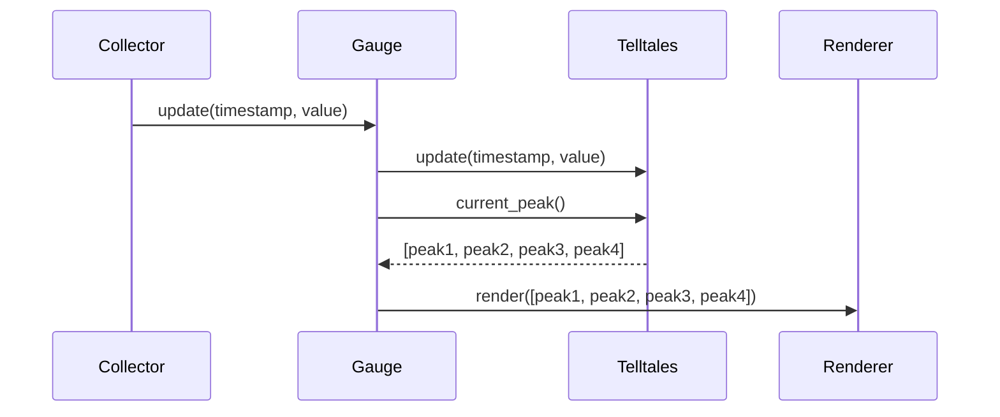

# 2 - Feature: peak-hold telltale needles — 1m, 10m, 1h, all-time

## 1. Context & Goal
* **Issue:** #2
* **Objective:** Wire peak-hold telltale needles to the live stream and the renderer, including reset interaction and hover identification.
* **Status:** Approved (gemini-3.1-pro-high, 2026-10-07)
* **Related Issues:** #4, #7, #15, #41, #331, #332

### Open Questions
None.

## 2. Proposed Changes

### 2.1 Files Changed

| File | Change Type | Description |
|------|-------------|-------------|
| `src/boostgauge/gauge.py` | Add | Integrates UI interactions, instantiates Telltales, and wires the render pipeline. |
| `tests/unit/test_gauge.py` | Add | Pure unit tests asserting event dispatch, formatter outputs, and fan-out updates. |
| `tests/visual/test_gauge_render.py` | Add | End-to-end visual tier pixel assertion tests via the real renderer. |

### 2.1.1 Path Validation (Mechanical - Auto-Checked)

Mechanical validation automatically checks:
- All "Modify" files must exist in repository
- All "Delete" files must exist in repository
- All "Add" files must have existing parent directories
- No placeholder prefixes (`src/`, `lib/`, `app/`) unless directory exists

### 2.2 Dependencies

```toml

# No new dependencies needed beyond existing project tools
```

### 2.3 Data Structures

```python
class TelltaleGroup(TypedDict):
    short: Telltale
    medium: Telltale
    long: Telltale
    all_time: Telltale
```

### 2.4 Function Signatures

```python
def format_duration_label(seconds: int | None) -> str:
    """Format duration as 'Nh', 'Nm', 'Ns', or 'All-time'."""
    ...

def build_tooltip_text(durations: dict[str, int | None]) -> str:
    """Return the four-line tooltip identifying windows by color."""
    ...

def render_gauge_frame(renderer, peaks: list[float | None]) -> None:
    """Pass peaks directly to the renderer without filtering None."""
    ...
```

### 2.5 Logic Flow (Pseudocode)

```
1. Initialize Telltale instances using config durations
2. On collector sample update:
   - Call update(timestamp, value) on all four instances with exact same args
3. On render refresh:
   - Collect current_peak() from all four instances
   - If the all-time peak is greater than the previously recorded all-time peak, emit a debug log and update the recorded peak
   - Pass the 4-slot structure containing peaks and None values to the renderer
4. On context menu action:
   - Dispatch reset() exclusively to the corresponding instance(s)
5. On UI hover:
   - Display tooltip string built via pure formatter logic
```

### 2.6 Technical Approach

* **Module:** `src/boostgauge/gauge.py`
* **Pattern:** Dependency Injection for renderer integration
* **Key Decisions:** UI formatting and routing logic are extracted to pure functions. This enables testing the entire feature natively using `tkinter` bindings without instantiating `tkinter.Tk()`, adhering perfectly to Option C. Trace logging will be emitted when the all-time peak increases to improve observability. Configuration hot-reloading for `telltale_windows` is not supported (changes wait for the next launch per ruling #294), avoiding the need for a runtime re-initialization hook.

### 2.7 Architecture Decisions

| Decision | Options Considered | Choice | Rationale |
|----------|-------------------|--------|-----------|
| Peak rendering control | Filtering `None` peaks at wiring layer vs. passing through | Passing through unmodified | Needle-drawing rules (presence, absence, opacity) strictly belong to #332's renderer |
| Menu/Hover testing | Instantiating `Tk()` vs. extracting pure logic | Extracting pure logic | Banned by Test Strategy Option C |
| Z-order tests | Asserting via visual tests vs. deferring to aesthetic doc | Deferring to aesthetic doc | Operator ruled in #232 that z-order is a spec convention, not a tested criterion |
| Runtime config changes to `telltale_windows` | Re-initialize Telltales on change vs. Wait for next launch | Wait for next launch | Per ruling #294 and `config.py`, only `thresholds` are applied mid-session; `telltale_windows` changes are applied on restart. No re-initialization hook needed. |

**Architectural Constraints:**
- Must exclusively use #41's `Telltale` logic without duplicating peak arithmetic.
- Cannot instantiate `tkinter.Tk()` inside any test.

## 3. Requirements

1. The app shall instantiate four `Telltale` instances, three populated from config `telltale_windows.short`, `telltale_windows.medium`, `telltale_windows.long`, and one with window `None` for all-time.
2. The app shall feed every collector sample to all four instances via `update(timestamp, value)`, passing identical timestamps and values to each.
3. The app shall pass all four `current_peak()` values to the renderer on every refresh as a four-slot structure, passing `None` through unmodified.
4. The short-window menu entry shall call `reset()` exclusively on the short-window instance.
5. The medium-window menu entry shall call `reset()` exclusively on the medium-window instance.
6. The long-window menu entry shall call `reset()` exclusively on the long-window instance.
7. The all-time menu entry shall call `reset()` exclusively on the all-time instance.
8. The 'Reset All' menu entry shall call `reset()` on all four instances.
9. Menu entry labels shall derive dynamically from a pure formatter over the configured duration, rendering whole hours as 'Nh', whole minutes as 'Nm', and else 'Ns'.
10. The hover tooltip shall identify each window using the format '<window label> — <color name>' (cyan, orange, magenta, coral red), generated by a pure function without `tkinter`.
11. The composed image shall be tested end-to-end through the real renderer to verify needle presence and absence via pixel classification against the aesthetic doc's palette.
12. The app shall emit a debug log when a new all-time peak is established for observability and diagnostic tracing.

## 4. Alternatives Considered

| Option | Pros | Cons | Decision |
|--------|------|------|----------|
| Filter `None` at wiring layer | Avoids passing invalid values to renderer | Violates strict #332 drawing ownership | **Rejected** |
| Hardcode default labels | Simpler implementation | Fails when user overrides config | **Rejected** |

**Rationale:** The rendering boundary must remain pure per issue scope guards. Label logic must be completely dynamic to support custom config horizons reliably.

## 5. Data & Fixtures

### 5.1 Data Sources

| Attribute | Value |
|-----------|-------|
| Source | Configuration file `telltale_windows.*` & Synthetic Data Stream |
| Format | In-memory JSON/Dict and synthetic timestamps/floats |
| Size | N/A |
| Refresh | Real-time |
| Copyright/License | N/A |

### 5.2 Data Pipeline

```
Synthetic Stream ──update()──► Telltale ──current_peak()──► Gauge ──render()──► Skin
```

### 5.3 Test Fixtures

| Fixture | Source | Notes |
|---------|--------|-------|
| Recording Renderer Double | Hardcoded | Mocks `src/boostgauge/skins/stingray.py` render call |
| Synthetic Event Stream | Hardcoded | Timestamps and float values simulating real metrics |

### 5.4 Deployment Pipeline
N/A

## 6. Diagram

### 6.1 Mermaid Quality Gate

**Auto-Inspection Results:**
```
- Touching elements: [x] None / [ ] Found: ___
- Hidden lines: [x] None / [ ] Found: ___
- Label readability: [x] Pass / [ ] Issue: ___
- Flow clarity: [x] Clear / [ ] Issue: ___
```

### 6.2 Diagram


```mermaid
sequenceDiagram
    participant Collector
    participant Gauge
    participant Telltales
    participant Renderer

    Collector->>Gauge: update(timestamp, value)
    Gauge->>Telltales: update(timestamp, value)
    Gauge->>Telltales: current_peak()
    Telltales-->>Gauge: [peak1, peak2, peak3, peak4]
    Gauge->>Renderer: render([peak1, peak2, peak3, peak4])
```

## 7. Security & Safety Considerations

### 7.1 Security

| Concern | Mitigation | Status |
|---------|------------|--------|
| Unsafe configuration | Utilize existing config validation and pure formatter bounds | Addressed |

### 7.2 Safety

| Concern | Mitigation | Status |
|---------|------------|--------|
| UI thread blockage | Ensure fan-out logic remains O(1) amortized via `Telltale` rules | Addressed |

**Fail Mode:** Fail Open - Gauge continues drawing without needles if peaks crash.
**Recovery Strategy:** Next tick will trigger fresh evaluation logic.

## 8. Performance & Cost Considerations

### 8.1 Performance

| Metric | Budget | Approach |
|--------|--------|----------|
| Frame Latency | < 16ms | Ensure pure logic avoids deep copies or allocations during fan-out |
| Memory | Minimal | Leveraging monotonic deque provided by #41 |
| CPU | < 1% | Passing direct tuples to renderer |

**Bottlenecks:** Pixel drawing operations during overlapping high-activity intervals.

### 8.2 Cost Analysis

| Resource | Unit Cost | Estimated Usage | Monthly Cost |
|----------|-----------|-----------------|--------------|
| N/A | N/A | N/A | N/A |

**Cost Controls:**
- [x] Budget alerts configured at $0 threshold

**Worst-Case Scenario:** Rendering engine lags during extremely frequent spikes.

## 9. Legal & Compliance

| Concern | Applies? | Mitigation |
|---------|----------|------------|
| PII/Personal Data | No | N/A |
| Third-Party Licenses | No | N/A |
| Terms of Service | No | N/A |
| Data Retention | No | N/A |
| Export Controls | No | N/A |

**Data Classification:** Public
**Compliance Checklist:**
- [x] No PII stored without consent
- [x] All third-party licenses compatible with project license
- [x] External API usage compliant with provider ToS
- [x] Data retention policy documented

## 10. Verification & Testing

**Testing Philosophy:** Strive for 100% automated test coverage. Per `docs/design/0001-test-strategy.md`: Option C applies to GUI tests, meaning `tkinter.Tk()` is NEVER instantiated in tests. Visual baselines require the explicit `--generate-baselines` flag (no auto-acceptance). Pass criteria must carry explicit literal values.

### 10.0 Test Plan (TDD - Complete Before Implementation)

**TDD Requirement:** Tests MUST be written and failing BEFORE implementation begins.

| Test ID | Test Description | Expected Behavior | Status |
|---------|------------------|-------------------|--------|
| T010 | Construct Telltales from defaults | 4 exact instances instantiated | RED |
| T020 | Fan-out updates | Identical timestamp/value delivered | RED |
| T030 | Pass peaks unmodified | `None` successfully penetrates to renderer | RED |
| T040 | Reset short instance | Only short instance is reset | RED |
| T050 | Reset medium instance | Only medium instance is reset | RED |
| T060 | Reset long instance | Only long instance is reset | RED |
| T070 | Reset all-time instance | Only all-time instance is reset | RED |
| T080 | Reset all instances | All instances are reset | RED |
| T090 | Format dynamic labels | Config horizons mapped to exact strings | RED |
| T100 | Format tooltip text | Lines rendered precisely mapped with colors | RED |
| T110 | Validate four needles visual | Baseline palette perfectly matched | RED |
| T120 | Validate post-reset absence visual | Expected needle strictly undetectable | RED |
| T130 | Log on new all-time peak | Debug log emitted with new peak value | RED |

**Coverage Target:** ≥100% for all new code

**TDD Checklist:**
- [ ] All tests written before implementation
- [ ] Tests currently RED (failing)
- [ ] Test IDs match scenario IDs in 10.1
- [ ] Test file created at: `tests/unit/test_gauge.py`

### 10.1 Test Scenarios

| ID | Scenario | Type | Input | Expected Output | Pass Criteria |
|----|----------|------|-------|-----------------|---------------|
| 010 | Construct from config (REQ-1) | Auto | Default config (60, 600, 3600) | 4 instances created | Windows: `60`, `600`, `3600`, and `None` |
| 020 | Fan-out updates (REQ-2) | Auto | `update(t=1.0, v=50)` | All instances updated | Each instance receives exact `(1.0, 50.0)` |
| 030 | Pass peaks to renderer (REQ-3) | Auto | Peaks: `[50, 100, None, 80]` | Renderer double receives array | Array is exactly `[50.0, 100.0, None, 80.0]` |
| 040 | Reset short instance (REQ-4) | Auto | Dispatch 'short' reset | short `reset()` called | Others untouched |
| 050 | Reset medium instance (REQ-5) | Auto | Dispatch 'medium' reset | medium `reset()` called | Others untouched |
| 060 | Reset long instance (REQ-6) | Auto | Dispatch 'long' reset | long `reset()` called | Others untouched |
| 070 | Reset all-time instance (REQ-7) | Auto | Dispatch 'all_time' reset | all-time `reset()` called | Others untouched |
| 080 | Reset all instances (REQ-8) | Auto | Dispatch 'all' reset | all `reset()` called | No instance untouched |
| 090 | Format dynamic menu labels (REQ-9) | Auto | 90s, 900s, 7200s configs | Labels generated correctly | Matches `'Reset 90s'`, `'Reset 15m'`, `'Reset 2h'` |
| 100 | Format tooltip text with colors (REQ-10) | Auto | Default and 90s configs | Strings generated correctly | Matches `'1m — cyan'`, `'90s — cyan'`, `'15m — orange'`, `'2h — magenta'`, `'All-time — coral red'` |
| 110 | Visual: four needles present (REQ-11) | Auto | 4 distinct peaks | All 4 colors present | Palette matches RGBs: cyan `#3BD7F0`, orange `#FF9A2E`, magenta `#D45BE8`, coral red `#FF6E7A` |
| 120 | Visual: post-reset absence (REQ-11) | Auto | Reset short -> Capture | Image missing cyan | No cyan `#3BD7F0` pixels detected |
| 130 | Log on new all-time peak (REQ-12) | Auto | `update()` raises all-time peak | Log emitted | `logger.debug` called with the new peak |

### 10.2 Test Commands

```bash

# Run unit tests validating purely logical formatters and wiring without Tk()
poetry run pytest tests/unit/test_gauge.py -v

# Run render tests visually inspecting pixel composition against generated baselines
poetry run pytest tests/visual/test_gauge_render.py -v --generate-baselines
```

### 10.3 Manual Tests (Only If Unavoidable)

N/A - All scenarios automated.

## 11. Risks & Mitigations

| Risk | Impact | Likelihood | Mitigation |
|------|--------|------------|------------|
| GUI testing instantiating `tkinter.Tk()` breaks headless CI pipeline | High | High | Extract all UI interaction and formatting code to pure functions (`format_duration_label`, `build_tooltip_text`) assertable in pure python. |
| `None` peak values wrongly filtered before reaching renderer | Medium | High | Maintain dumb passthrough logic via `render_gauge_frame`, intercepted via a recording double to prove passthrough. |
| Configuration label staleness rendering incorrect durations | Medium | Medium | Derive labels dynamically via a single pure formatter (`format_duration_label`) supporting variable integers. |

## 12. Definition of Done

### Code
- [ ] Implementation complete and linted
- [ ] Code comments reference this LLD

### Tests
- [ ] All test scenarios pass
- [ ] Test coverage meets threshold

### Documentation
- [ ] LLD updated with any deviations
- [ ] Implementation Report (0103) completed
- [ ] Test Report (0113) completed if applicable

### Review
- [ ] Code review completed
- [ ] User approval before closing issue

### 12.1 Traceability (Mechanical - Auto-Checked)

Mechanical validation automatically checks:
- Every file mentioned in this section must appear in Section 2.1
- Every risk mitigation in Section 11 should have a corresponding function in Section 2.4 (warning if not)

---

## Reviewer Suggestions

*Non-blocking recommendations from the reviewer.*

- Consider adding a brief comment in `tests/visual/test_gauge_render.py` explaining how the expected RGB palette values were derived (e.g., from `aesthetic doc`) to help future maintainers understand the magic hex values.

## Appendix: Review Log

### gemini-3.1-pro-high Review #1 (APPROVED)

**Reviewer:** gemini-3.1-pro-high
**Verdict:** APPROVED

#### Comments

| ID | Comment | Implemented? |
|----|---------|--------------|
| R1.1 | "Consider emitting trace or debug logs when a new peak is set (particularly for the all-time instance)..." | YES - Added `logger.debug` for all-time peak increases in logic flow, REQ-12, and test scenario 130. |
| R1.2 | "Consider what should happen if `telltale_windows` configurations are modified at runtime..." | YES - Documented in Architecture Decisions that `telltale_windows` runtime changes wait for the next launch per #294, requiring no re-init hook. |

### Review Summary

| Review | Date | Verdict | Key Issue |
|--------|------|---------|-----------|
| 1 | 2026-10-07 | APPROVED | `gemini-3.1-pro-high` (`gemini:3.1-pro`) |
| gemini-3.1-pro-high #1 | (auto) | APPROVED | Log all-time peaks and document config reload behavior |

**Final Status:** APPROVED