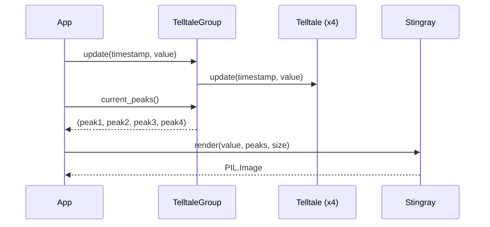

# Issue #2 - Feature: peak-hold telltale needles — 1m, 10m, 1h, all-time (#2)

## 1. Context & Goal
* **Issue:** #2
* **Objective:** Wire the `Telltale` peak-tracking logic to the application's data stream, provide pure formatters for reset menus and hover tooltips, and pipe the peak values into the existing renderer to display the 1m, 10m, 1h, and all-time needles.
* **Status:** Approved (gemini-3.1-pro-high, 2026-10-07)
* **Related Issues:** #41, #331, #332, #7, #4, #15

### Open Questions
None.

## 2. Proposed Changes

### 2.1 Files Changed

| File | Change Type | Description |
|------|-------------|-------------|
| `src/boostgauge/telltale_group.py` | Add | Pure integration logic for grouping four `Telltale` instances, fan-out updates, reset dispatch, and tooltip/menu formatters. |
| `tests/unit/test_telltale_group.py` | Add | Unit tier verification of fan-out (W2), pass-through (W3), formatters (RS6, U1), and reset dispatch (RS1-RS5). |
| `tests/visual/test_telltale_integration.py` | Add | Render-tier pixel assertion (V1) generating and comparing baselines through `#332`'s real renderer. |

### 2.1.1 Path Validation (Mechanical - Auto-Checked)

Mechanical validation automatically checks:
- All "Modify" files must exist in repository
- All "Delete" files must exist in repository
- All "Add" files must have existing parent directories
- No placeholder prefixes (`src/`, `lib/`, `app/`) unless directory exists

### 2.2 Dependencies

```toml

# No new pyproject.toml additions required
```

### 2.3 Data Structures

```python

# Telltale group uses a specific sequence order per the renderer contract:

# [short (1m), medium (10m), long (1h), all-time]
TelltalePeaks = tuple[float | None, float | None, float | None, float | None]
```

### 2.4 Function Signatures

```python

# In src/boostgauge/telltale_group.py

def format_window_label(seconds: float | None) -> str:
    """Format duration as whole hours 'Nh', whole minutes 'Nm', or seconds 'Ns'. None -> 'All-time'."""
    ...

class TelltaleGroup:
    """Manages the four telltale instances, ensuring identical data feed and ordered peak retrieval."""

    def __init__(self, config_windows: dict) -> None:
        """Initialize short, medium, long from config_windows, plus all-time (None)."""
        ...

    def update(self, timestamp: float, value: float) -> None:
        """Feed the identical sample to all four telltale instances."""
        ...

    def current_peaks(self) -> tuple[float | None, float | None, float | None, float | None]:
        """Return the four peaks in order: short, medium, long, all-time."""
        ...

    def reset_target(self, target: str) -> None:
        """Dispatch reset to 'short', 'medium', 'long', 'all-time', or 'all'."""
        ...

    def get_menu_labels(self) -> dict[str, str]:
        """Return pure formatted labels for the right-click menu."""
        ...

    def get_tooltip_text(self) -> str:
        """Return pure formatted multiline tooltip string with bound colors."""
        ...
```

### 2.5 Logic Flow (Pseudocode)

```
1. ON STARTUP:
   - Read `telltale_windows` from config.
   - Construct TelltaleGroup with 4 instances (short, medium, long, None).
2. ON COLLECTOR TICK:
   - TelltaleGroup.update(timestamp, value) iterates all 4 instances.
3. ON RENDER TICK:
   - peaks = TelltaleGroup.current_peaks()
   - boostgauge.skins.stingray.render(value, peaks, size)
4. ON MENU HOVER/CLICK:
   - Display labels from TelltaleGroup.get_menu_labels() or get_tooltip_text()
   - Dispatch reset selection to TelltaleGroup.reset_target(target)
```

### 2.6 Technical Approach

* **Module:** `src/boostgauge/telltale_group.py`
* **Pattern:** Facade / Group Controller
* **Key Decisions:** GUI testing strategy Option C forbids `tkinter.Tk()` instantiation in tests. Therefore, all tooltip text generation, menu label generation, and reset dispatch routing must live in a pure, testable class (`TelltaleGroup`) fully decoupled from the UI framework.

### 2.7 Architecture Decisions

| Decision | Options Considered | Choice | Rationale |
|----------|-------------------|--------|-----------|
| Label formatting | In UI layer, In Logic layer | In Logic layer | UI layer cannot be unit tested per Option C strategy. Pure logic formatting allows exhaustive formatter verification. |
| `None` peak handling | Replace with 0, Pass through | Pass through | #332 explicitly owns the decision not to draw (T1). The wiring layer must pass `None` unmodified. |
| Z-Order testing | Verify pixel occlusion, Exclude from tests | Exclude from tests | Operator ruling #232 dictates Z-order is a spec convention and not a tested criterion for this issue. |

**Architectural Constraints:**
- Must not instantiate `tkinter` in tests (Strategy 0001 Option C).
- Must use `boostgauge.skins.stingray.render(value, telltales, size)` exactly as defined in #332.

## 3. Requirements

1. The application constructs four `Telltale` instances: three with durations read from `telltale_windows.short`, `medium`, and `long`, and one with window `None` for all-time.
2. Every collector sample reaches all four instances identically via `Telltale.update(timestamp, value)`.
3. Every refresh passes all four `current_peak()` values to #332's renderer as a four-slot sequence, passing `None` values through unmodified.
4. Reset actions dispatch to their specific target instance: short, medium, long, all-time, or all four simultaneously.
5. Menu entry labels are dynamically formatted from the configured durations (e.g., 'Reset 90s', 'Reset 15m') via a pure formatter.
6. The hover tooltip text dynamically formats each window label bound to its aesthetic color name (cyan, orange, magenta, coral red) via a pure function.
7. Render-tier tests verify the composed image through #332's real renderer using self-generated baselines as regression pins, and detect needle presence/absence by classifying pixels against the aesthetic document's palette rows.

## 4. Alternatives Considered

| Option | Pros | Cons | Decision |
|--------|------|------|----------|
| Mix string formatting into `tkinter` bound events | Simpler codebase | Violates Option C test strategy; untestable | **Rejected** |
| Pure `TelltaleGroup` mapping class | 100% unit testable, centralizes all W and RS criteria | Slight boilerplate | **Selected** |

**Rationale:** The Option C test strategy completely bans `tkinter` from test runs. Placing formatting and dispatch logic into a pure class is the only way to satisfy the exhaustive branching requirements of U1 and RS6 without invoking a GUI runtime.

## 5. Data & Fixtures

### 5.1 Data Sources

| Attribute | Value |
|-----------|-------|
| Source | Internal configuration (`telltale_windows`) and collector pipeline |
| Format | Native Python datatypes (dict, float) |
| Size | 4 instances, O(1) peak holds |
| Refresh | Tick-based (e.g., 2.0s intervals) |
| Copyright/License | N/A |

### 5.2 Data Pipeline

```
Config ──(init)──► TelltaleGroup ◄──(update)── Collector
                         │
                    (current_peaks)
                         ▼
                Stingray Renderer
```

### 5.3 Test Fixtures

| Fixture | Source | Notes |
|---------|--------|-------|
| Synthetic Data Stream | Hardcoded | Sequence of deterministic timestamps and values to seed peaks |
| Renderer Double | Generated | Mock callable to intercept and record the `telltales` argument |

### 5.4 Deployment Pipeline

No external data pipelines required. Handled within existing application flow.

## 6. Diagram

### 6.1 Mermaid Quality Gate

**Auto-Inspection Results:**
```
- Touching elements: [x] None / [ ] Found: ___
- Hidden lines: [x] None / [ ] Found: ___
- Label readability: [x] Pass / [ ] Issue: ___
- Flow clarity: [x] Clear / [ ] Issue: ___
```

### 6.2 Diagram


```mermaid
sequenceDiagram
    participant App
    participant TelltaleGroup
    participant Telltale (x4)
    participant Stingray

    App->>TelltaleGroup: update(timestamp, value)
    TelltaleGroup->>Telltale (x4): update(timestamp, value)
    App->>TelltaleGroup: current_peaks()
    TelltaleGroup-->>App: (peak1, peak2, peak3, peak4)
    App->>Stingray: render(value, peaks, size)
    Stingray-->>App: PIL.Image
```

## 7. Security & Safety Considerations

### 7.1 Security

| Concern | Mitigation | Status |
|---------|------------|--------|
| Type Injection | Type hinting and pure Python logic parsing only config values | Addressed |

### 7.2 Safety

| Concern | Mitigation | Status |
|---------|------------|--------|
| Unbounded memory growth | `Telltale` inherently uses amortized O(1) deques and age-out logic. Handled strictly by #41 | Addressed |

**Fail Mode:** Fail Closed - If a config value is unparseable as a float, it raises `ConfigError` at startup per #7 config logic.
**Recovery Strategy:** Next app restart with correct config.

## 8. Performance & Cost Considerations

### 8.1 Performance

| Metric | Budget | Approach |
|--------|--------|----------|
| Latency | < 1ms | Pure math, no locks required within `TelltaleGroup` update iteration |
| Memory | < 1KB | Just four `Telltale` instances wrapping standard deques |

**Bottlenecks:** None. `Telltale.update` is O(1) amortized.

### 8.2 Cost Analysis

| Resource | Unit Cost | Estimated Usage | Monthly Cost |
|----------|-----------|-----------------|--------------|
| N/A | $0 | 0 | $0 |

**Cost Controls:**
- [x] Local execution only, no cloud resources.

## 9. Legal & Compliance

| Concern | Applies? | Mitigation |
|---------|----------|------------|
| PII/Personal Data | No | No data recorded or saved outside memory |
| Third-Party Licenses | No | Uses existing dependencies |

**Data Classification:** Internal

**Compliance Checklist:**
- [x] No PII stored without consent
- [x] All third-party licenses compatible with project license
- [x] External API usage compliant with provider ToS
- [x] Data retention policy documented

## 10. Verification & Testing

**Testing Philosophy:** 100% automated test coverage. All formatting, logic routing, and pixel assertions execute headless. Target coverage: 100% for `telltale_group.py` with no exclusions needed as there are no defensive branches.

### 10.0 Test Plan (TDD - Complete Before Implementation)

| Test ID | Test Description | Expected Behavior | Status |
|---------|------------------|-------------------|--------|
| T010 | verify_instantiation | Creates 4 telltales with correct windows | RED |
| T020 | verify_fanout | All 4 instances receive exact sample args | RED |
| T030 | verify_passthrough | `None` peaks pass directly to renderer double | RED |
| T040 | verify_reset_short | `reset_target('short')` calls only short reset | RED |
| T050 | verify_reset_all | `reset_target('all')` calls all resets | RED |
| T060 | verify_menu_labels | Formats default and 90s/15m/2h non-default | RED |
| T070 | verify_tooltip_text | Formats colors and bound dynamic labels | RED |
| T080 | verify_render_all_peaks| All four families found via pixel classification | RED |
| T090 | verify_render_reset | Reset family absent from pixel classification | RED |

**Coverage Target:** 100% for `src/boostgauge/telltale_group.py`

### 10.1 Test Scenarios

| ID | Scenario | Type | Input | Expected Output | Pass Criteria |
|----|----------|------|-------|-----------------|---------------|
| 010 | Instantiation configs windows (REQ-1) | Auto | Config defaults `{short: 60, medium: 600, long: 3600}` | 4 `Telltale` instances | `window` attributes exactly: `60`, `600`, `3600`, `None` |
| 020 | Fan-out updates all instances (REQ-2) | Auto | `timestamp=100.0, value=75` | 4 identical updates | Each inner `Telltale.update` receives exactly `(100.0, 75)` |
| 030 | Peaks passed unfiltered to renderer (REQ-3) | Auto | 3 active peaks, 1 reset | Injected rendering double args | Double called with `telltales=(P1, P2, P3, None)` |
| 040 | Reset dispatch short window (REQ-4) | Auto | Target `'short'` | Short instance reset | Only short peak becomes `None`, others remain intact |
| 050 | Reset dispatch all windows (REQ-4) | Auto | Target `'all'` | All instances reset | All four peaks become `None` |
| 060 | Format menu labels default config (REQ-5) | Auto | `{short: 60, medium: 600, long: 3600}` | Menu dictionary | `'Reset 1m'`, `'Reset 10m'`, `'Reset 1h'`, `'Reset All-time'` |
| 070 | Format menu labels non-default (REQ-5) | Auto | `{short: 90, medium: 900, long: 7200}` | Menu dictionary | `'Reset 90s'`, `'Reset 15m'`, `'Reset 2h'`, `'Reset All-time'` |
| 080 | Format tooltip lines non-default (REQ-6) | Auto | `{short: 90, medium: 900, long: 7200}` | Formatted string | `'90s — cyan\n15m — orange\n2h — magenta\nAll-time — coral red'` |
| 090 | Render all needles present (REQ-7) | Auto | 4 distinct peaks in synthetic stream | Baseline regression match | Palette classification finds cyan `#3BD7F0`, orange `#FF9A2E`, magenta `#D45BE8`, coral red `#FF6E7A` |
| 100 | Render telltale absent after reset (REQ-7) | Auto | Reset 'short', no further samples | Baseline regression match | Palette classification finds NO cyan `#3BD7F0` pixels |

### 10.2 Test Commands

```bash

# Run unit tests
poetry run pytest tests/unit/test_telltale_group.py -v

# Run visual integration tests (fail if no baseline exists)
poetry run pytest tests/visual/test_telltale_integration.py -v

# Generate baselines for visual tests (manual review step)
poetry run pytest tests/visual/test_telltale_integration.py -v --generate-baselines
```

### 10.3 Manual Tests (Only If Unavoidable)

N/A - All scenarios automated.

## 11. Risks & Mitigations

| Risk | Impact | Likelihood | Mitigation |
|------|--------|------------|------------|
| `None` peak interception blocks T1 rendering rule | High | Low | `current_peaks()` explicitly annotated as returning `float | None`. Test T030 statically ensures `None` passes unmodified to the renderer. |
| Test suite fails due to missing font | Med | Low | The visual render tests will use the provided test baselines. Handled organically by strategy 0001 testing requirements. |
| Configuration durations injected as floats | Low | Med | `format_window_label()` explicitly truncates to integers for hours/minutes/seconds matching using modulo logic. |

## 12. Definition of Done

### Code
- [ ] Implementation complete and linted
- [ ] Code comments reference this LLD

### Tests
- [ ] All test scenarios pass
- [ ] Test coverage meets threshold (100% for `telltale_group.py`)

### Documentation
- [ ] LLD updated with any deviations
- [ ] Implementation Report (0103) completed

### Review
- [ ] Code review completed
- [ ] User approval before closing issue

### 12.1 Traceability (Mechanical - Auto-Checked)

Mechanical validation automatically checks:
- Every file mentioned in this section must appear in Section 2.1
- Every risk mitigation in Section 11 should have a corresponding function in Section 2.4 (warning if not)

---

## Reviewer Suggestions

*Non-blocking recommendations from the reviewer.*

- Since `current_peaks()` relies on a rigid structural sequence (`short`, `medium`, `long`, `all-time`), consider returning a strictly typed `NamedTuple` instead of a raw `tuple`. This will prevent accidental transposition errors when the renderer receives and unpacks the sequence.
- Consider adding a small debug-level log in `reset_target()` to track when and which specific windows were explicitly reset by the user during a session.

## Appendix: Review Log

### Review Summary

| Review | Date | Verdict | Key Issue |
|--------|------|---------|-----------|
| 1 | 2026-10-07 | APPROVED | `gemini-3.1-pro-high` (`gemini:3.1-pro`) |
| Orchestrator #1 | (auto) | PENDING | Initial Draft |

**Final Status:** APPROVED