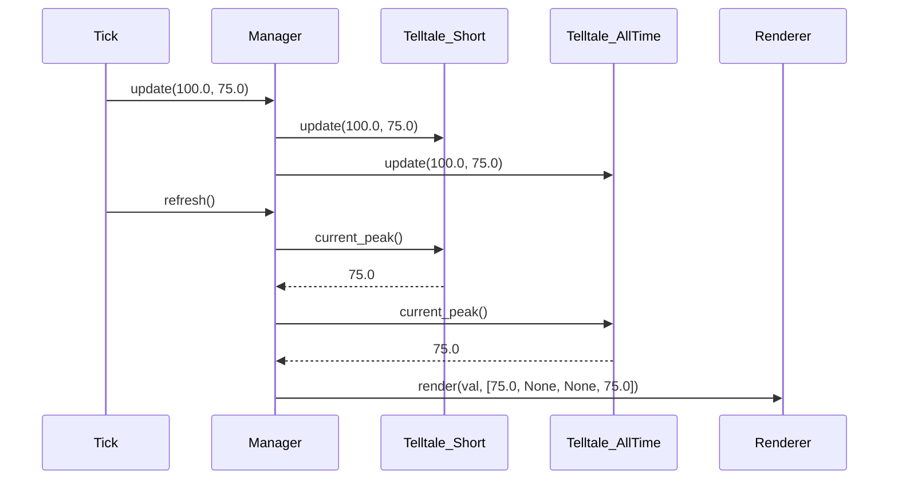

# 2 - Feature: peak-hold telltale needles — 1m, 10m, 1h, all-time

## 1. Context & Goal
* **Issue:** #2
* **Objective:** Wire the peak-hold telltale logic to the live metric stream and renderer, and provide pure formatters for reset context-menus and hover tooltips.
* **Status:** Approved (gemini-3.1-pro-high, 2026-10-07)
* **Related Issues:** #41, #331, #332, #7, #4, #15

### Open Questions
None.

## 2. Proposed Changes

### 2.1 Files Changed

| File | Change Type | Description |
|------|-------------|-------------|
| `src/boostgauge/labels.py` | Add | Pure label formatters for menu entries and tooltip text. |
| `src/boostgauge/telltale_group.py` | Add | Wiring layer: instantiates the four Telltales, handles fan-out, and reset dispatch. |
| `tests/unit/test_labels.py` | Add | Unit tier tests for label and tooltip formatting. |
| `tests/unit/test_telltale_group.py` | Add | Unit tier tests for initialization, fan-out, renderer pass-through, and resets. |
| `tests/visual/test_telltales_render.py` | Add | Render-pixel tier test for presence/absence via pixel classification and baselines. |

### 2.1.1 Path Validation (Mechanical - Auto-Checked)

Mechanical validation automatically checks:
- All "Modify" files must exist in repository
- All "Delete" files must exist in repository
- All "Add" files must have existing parent directories
- No placeholder prefixes (`src/`, `lib/`, `app/`) unless directory exists

### 2.2 Dependencies

```toml

# pyproject.toml additions (if any)

# No new dependencies required.
```

### 2.3 Data Structures

```python
from typing import Optional, Callable
from dataclasses import dataclass
from boostgauge.telltale import Telltale

@dataclass
class TelltaleGroup:
    short: Telltale
    medium: Telltale
    long: Telltale
    all_time: Telltale
```

### 2.4 Function Signatures

```python

# src/boostgauge/labels.py
def format_duration(seconds: float) -> str:
    """Format duration to 'Nh', 'Nm', or 'Ns'."""
    ...

def get_menu_label(window_name: str, duration: Optional[float]) -> str:
    """Return the reset menu label, e.g., 'Reset 1m' or 'Reset All-time'."""
    ...

def get_tooltip_text(short_dur: float, med_dur: float, long_dur: float) -> str:
    """Return the multiline tooltip text with bound color names."""
    ...

# src/boostgauge/telltale_group.py
class TelltaleManager:
    def __init__(self, short_dur: float, med_dur: float, long_dur: float) -> None:
        """Initialize the four Telltale instances."""
        ...

    def update(self, timestamp: float, value: float) -> None:
        """Feed the sample to all four instances."""
        ...

    def current_peaks(self) -> tuple[Optional[float], Optional[float], Optional[float], Optional[float]]:
        """Return the four peaks in short, medium, long, all-time order."""
        ...

    def reset_short(self) -> None: ...
    def reset_medium(self) -> None: ...
    def reset_long(self) -> None: ...
    def reset_all_time(self) -> None: ...
    def reset_all(self) -> None: ...
```

### 2.5 Logic Flow (Pseudocode)

```
1. ON init:
   - Create 3 Telltales with durations from config, 1 Telltale with None (all-time)
2. ON update(timestamp, value):
   - For each Telltale: call update(timestamp, value)
3. ON refresh:
   - Call current_peak() on all 4 instances
   - Pass tuple (p1, p2, p3, p4) to renderer, passing None unmodified
4. ON menu action (e.g. Reset 1m):
   - Call reset() on the corresponding Telltale instance
5. ON tooltip hover:
   - Call get_tooltip_text(config.short, config.medium, config.long)
   - Display returned string without altering it
```

### 2.6 Technical Approach

* **Module:** `src/boostgauge/telltale_group.py` and `src/boostgauge/labels.py`
* **Pattern:** Facade / Pure Formatters
* **Key Decisions:** Separating the formatting logic into `labels.py` keeps it pure and fully unit-testable without any `tkinter` instantiation (Option C per `docs/design/0001-test-strategy.md`). The `TelltaleManager` isolates the state and fan-out of the four instances, enabling testing of the wiring and None-pass-through using a recording double.

### 2.7 Architecture Decisions

| Decision | Options Considered | Choice | Rationale |
|----------|-------------------|--------|-----------|
| Tkinter Testing | Full GUI test, Mock Tkinter, Pure Logic | Pure Logic | Option C is mandated by test strategy 0001; no `tkinter.Tk()` in tests. |
| Render pass-through verification | Pixel diff, Mock | Mock | Rendering logic is #332 territory. W3 requires a recording double to assert `None` passes through the wiring layer unfiltered, avoiding interception bugs invisible to pixel observation. |

**Architectural Constraints:**
- Must integrate with existing `Telltale` (#41) and `render` (#332) logic.
- Cannot instantiate `tkinter.Tk()` in test suites.

## 3. Requirements

1. The application shall instantiate four Telltale instances: three with durations read from the configuration (`telltale_windows.short`, `telltale_windows.medium`, `telltale_windows.long`), and one with window `None` for all-time.
2. The application shall feed every collector sample to all four instances via `update(timestamp, value)`, passing the identical timestamp and value to each.
3. The application shall pass all four `current_peak()` values to the renderer as a four-slot argument on every refresh, passing `None` values through unfiltered.
4. The application shall provide a short-window reset action that calls `reset()` on the short-window instance and leaves the remaining three untouched.
5. The application shall provide a medium-window reset action that calls `reset()` on the medium-window instance and leaves the remaining three untouched.
6. The application shall provide a long-window reset action that calls `reset()` on the long-window instance and leaves the remaining three untouched.
7. The application shall provide an all-time window reset action that calls `reset()` on the all-time instance and leaves the remaining three untouched.
8. The application shall provide a 'Reset All' action that calls `reset()` on all four instances.
9. Menu entry labels shall derive from a pure formatter over the configured duration: short at 90s reads 'Reset 90s', medium at 900s reads 'Reset 15m', long at 7200s reads 'Reset 2h'. The all-time label is constant at 'Reset All-time'.
10. Hovering the gauge shall present a tooltip identifying each window, formatted as one line per window: '<window label> — <color name>', binding the exact names 'cyan', 'orange', 'magenta', and 'coral red'.
11. Tooltip window labels shall derive from the pure formatter covering all branches (e.g. 90s reads '90s — cyan', 900s reads '15m — orange', 7200s reads '2h — magenta').
12. Render-tier tests shall assert the composed image produced end-to-end through the real renderer with baseline-independent presence/absence detected by classifying sampled pixels against the aesthetic doc's palette rows (`cyan #3BD7F0`, `orange #FF9A2E`, `magenta #D45BE8`, `coral red #FF6E7A`), pinned by a self-generated baseline.

## 4. Alternatives Considered

| Option | Pros | Cons | Decision |
|--------|------|------|----------|
| Inline formatting inside Tkinter callbacks | Minimal file count | Violates Option C test strategy; untestable without `tkinter.Tk()` | **Rejected** |
| Pure formatting modules | 100% testable without GUI layer | Requires separate module | **Selected** |

**Rationale:** `docs/design/0001-test-strategy.md` mandates zero `tkinter` instantiation in tests. Pure formatters guarantee comprehensive testability.

## 5. Data & Fixtures

### 5.1 Data Sources

| Attribute | Value |
|-----------|-------|
| Source | Synthetic streams (Unit tests) / Config definitions |
| Format | Timestamps (float) and metric values (float) |
| Size | Single snapshot per tick |
| Refresh | N/A |
| Copyright/License | N/A |

### 5.2 Data Pipeline

```
Synthetic Data ──update()──► TelltaleManager ──current_peaks()──► Recording Double / Renderer
```

### 5.3 Test Fixtures

| Fixture | Source | Notes |
|---------|--------|-------|
| `recording_renderer` | Generated | Captures passed arguments to assert `None` pass-through |
| Synthetic metrics | Hardcoded | Controlled `timestamp` and `value` pairs to push known peaks |

### 5.4 Deployment Pipeline

No external data sources; local application component.

## 6. Diagram

### 6.1 Mermaid Quality Gate

**Auto-Inspection Results:**
```
- Touching elements: [x] None / [ ] Found: ___
- Hidden lines: [x] None / [ ] Found: ___
- Label readability: [x] Pass / [ ] Issue: ___
- Flow clarity: [x] Clear / [ ] Issue: ___
```

### 6.2 Diagram


```mermaid
sequenceDiagram
    participant Tick
    participant Manager
    participant Telltale_Short
    participant Telltale_AllTime
    participant Renderer

    Tick->>Manager: update(100.0, 75.0)
    Manager->>Telltale_Short: update(100.0, 75.0)
    Manager->>Telltale_AllTime: update(100.0, 75.0)

    Tick->>Manager: refresh()
    Manager->>Telltale_Short: current_peak()
    Telltale_Short-->>Manager: 75.0
    Manager->>Telltale_AllTime: current_peak()
    Telltale_AllTime-->>Manager: 75.0

    Manager->>Renderer: render(val, [75.0, None, None, 75.0])
```

## 7. Security & Safety Considerations

### 7.1 Security

| Concern | Mitigation | Status |
|---------|------------|--------|
| Input injection | N/A - internal float processing | Addressed |

### 7.2 Safety

| Concern | Mitigation | Status |
|---------|------------|--------|
| Logic errors in drawing | Rely entirely on #332's renderer without re-implementing rules | Addressed |

**Fail Mode:** Fail Open - the gauge continues rendering even if peak calculation raises an error in a frame, logging the exception.
**Recovery Strategy:** Catching exceptions at the app event loop layer to prevent crashing the collector thread.

## 8. Performance & Cost Considerations

### 8.1 Performance

| Metric | Budget | Approach |
|--------|--------|----------|
| Latency | < 1ms per update | `Telltale` amortized O(1) ops, pure Python dict updates |
| Memory | Negligible | Queues are small, aged-out entries dropped aggressively |

**Bottlenecks:** None.

### 8.2 Cost Analysis

Local application execution. Cost: $0.

## 9. Legal & Compliance

| Concern | Applies? | Mitigation |
|---------|----------|------------|
| PII/Personal Data | No | Operating on system process numbers |
| Third-Party Licenses | No | |

## 10. Verification & Testing

*Ref: `docs/design/0001-test-strategy.md`*

**Testing Philosophy:** `tkinter.Tk()` is never instantiated in tests. Visual regression baselines require explicit `--generate-baselines` flags.

### 10.0 Test Plan (TDD - Complete Before Implementation)

| Test ID | Test Description | Expected Behavior | Status |
|---------|------------------|-------------------|--------|
| T010 | Initialize 4 Telltales | Instantiates short, med, long with config floats; all-time with None | RED |
| T020 | Fan-out updates | Same value/timestamp reach all 4 instances | RED |
| T030 | Pass-through to Renderer | `[None, 50.0, None, None]` correctly passed to double | RED |
| T040 | Reset Short | Only short Telltale loses its peaks | RED |
| T050 | Reset Medium | Only medium Telltale loses its peaks | RED |
| T060 | Reset Long | Only long Telltale loses its peaks | RED |
| T070 | Reset All-Time | Only all-time Telltale loses its peaks | RED |
| T080 | Reset All | All 4 Telltales lose their peaks | RED |
| T090 | Format Menu non-defaults | Formats `Reset 90s`, `Reset 15m`, `Reset 2h` dynamically | RED |
| T100 | Format Tooltip default | Returns `1m — cyan\n10m — orange\n1h — magenta\nAll-time — coral red` | RED |
| T110 | Format Tooltip non-default | Returns `90s — cyan\n15m — orange\n2h — magenta\nAll-time — coral red` | RED |
| T120 | Visual Classify Baseline | Render layer pixels match `cyan #3BD7F0` presence | RED |

**Coverage Target:** 100% for all new code.

### 10.1 Test Scenarios

| ID | Scenario | Type | Input | Expected Output | Pass Criteria |
|----|----------|------|-------|-----------------|---------------|
| 010 | Initialization configuration (REQ-1) | Auto | Config `{short: 60, med: 600, long: 3600}` | 4 `Telltale` instances created | Instantiated with correct floats, all-time is `None` |
| 020 | Fan-out sample updates (REQ-2) | Auto | `timestamp=10.0, value=50.0` | 4 instance `.update` calls | All 4 instances updated identically |
| 030 | Renderer recording double (REQ-3) | Auto | `current_peaks()` state with `None`s | `[None, None, 50.0, None]` | Double observes exact array, `None` pass-through confirmed |
| 040 | Short window reset (REQ-4) | Auto | `.reset_short()` | Short is empty, others retain | Short peak is `None`, others untouched |
| 050 | Medium window reset (REQ-5) | Auto | `.reset_medium()` | Medium is empty, others retain | Medium peak is `None`, others untouched |
| 060 | Long window reset (REQ-6) | Auto | `.reset_long()` | Long is empty, others retain | Long peak is `None`, others untouched |
| 070 | All-time window reset (REQ-7) | Auto | `.reset_all_time()` | All-time is empty, others retain | All-time peak is `None`, others untouched |
| 080 | Reset all windows (REQ-8) | Auto | `.reset_all()` | All 4 are empty | All peaks are `None` |
| 090 | Dynamic menu formatting (REQ-9) | Auto | `90`, `900`, `7200` | Strings `Reset 90s`, `Reset 15m`, `Reset 2h` | Exact string match |
| 100 | Default tooltip text (REQ-10) | Auto | Default config (60, 600, 3600) | `1m — cyan\n10m — orange\n1h — magenta\nAll-time — coral red` | Exact string match |
| 110 | Non-default tooltip text (REQ-11) | Auto | Non-default (90, 900, 7200) | `90s — cyan\n15m — orange\n2h — magenta\nAll-time — coral red` | Exact string match |
| 120 | End-to-end visual baseline (REQ-12) | Auto | Synthetic peaks into `render` | Output Image | Pixels matching `cyan #3BD7F0` present, matches `--generate-baselines` baseline |

### 10.2 Test Commands

```bash

# Run unit tests
poetry run pytest tests/unit/test_telltale_group.py tests/unit/test_labels.py -v

# Run visual regression tests
poetry run pytest tests/visual/test_telltales_render.py -v
```

### 10.3 Manual Tests (Only If Unavoidable)

N/A - All scenarios automated.

## 11. Risks & Mitigations

| Risk | Impact | Likelihood | Mitigation |
|------|--------|------------|------------|
| Render Interception | High | Low | Testing via recording double to assert `None` passes through the wiring layer, bypassing visual diff limits (`T030`). |
| Inflexible Labels | Low | Medium | Strict testing of the non-default label paths ensuring pure formatters handle 90s, 15m, and 2h respectively (`T090`, `T110`). |
| Test suite opens GUI | High | Low | Enforce Option C; pure formatters are completely decoupled from `tkinter.Tk()` (`T100`). |

## 12. Definition of Done

### Code
- [ ] Implementation complete and linted
- [ ] Code comments reference this LLD

### Tests
- [ ] All test scenarios pass
- [ ] Test coverage meets threshold

### Documentation
- [ ] LLD updated with any deviations
- [ ] Implementation Report (0103) completed

### Review
- [ ] Code review completed
- [ ] User approval before closing issue

### 12.1 Traceability (Mechanical - Auto-Checked)

Mechanical validation automatically checks:
- Every file mentioned in this section must appear in Section 2.1
- Every risk mitigation in Section 11 should have a corresponding function in Section 2.4 (warning if not)

---

## Reviewer Suggestions

*Non-blocking recommendations from the reviewer.*

- **Diagram consistency**: In section 6.2 (Diagram), the Manager passes a list `[75.0, None, None, 75.0]` to the Renderer, but section 2.4 defines `current_peaks()` as returning a `tuple` and section 2.5 mentions passing a `tuple (p1, p2, p3, p4)`. Ensure the implementation correctly uses tuples if required by the renderer's interface.
- **Explicit Logging**: While Section 7.2 mentions logging exceptions at the app event loop layer, consider adding explicit debug/info logging within `TelltaleManager` when a manual reset action is triggered (`reset_short`, etc.) to aid in runtime observability.

## Appendix: Review Log

### Review Summary

| Review | Date | Verdict | Key Issue |
|--------|------|---------|-----------|
| 1 | 2026-10-07 | APPROVED | `gemini-3.1-pro-high` (`gemini:3.1-pro`) |
| G1 | (auto) | PENDING | Awaiting initial review |

**Final Status:** APPROVED