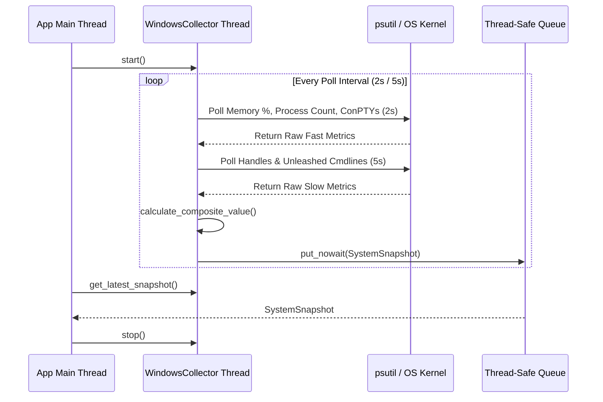

# #4 - Feature: Windows Data Collector — ConPTY, Processes, Memory, Handles

## 1. Context & Goal
* **Issue:** #4
* **Objective:** Build the platform-agnostic data collector base and Windows-specific data collector (`WindowsCollector`) to gather ConPTY allocations, total process counts, virtual memory usage, handle counts, and Unleashed python session counts, computing a composite normalized-max metric and pushing snapshots to a thread-safe queue.
* **Status:** Approved (claude-opus-4-6, 2026-07-29)
* **Related Issues:** #1, #3, #7, #41

### Open Questions
- [x] How will ConPTY instances be enumerated on Windows? *(Resolved: Query process table via `psutil.process_iter()` filtering for `conhost.exe` processes and inspect `WindowsTerminal.exe` / `OpenConsole.exe` process command-line arguments).*
- [x] How will performance budgets (<1% CPU) be guaranteed during process scanning? *(Resolved: Stagger heavy handle and process command-line scans to run every 5s while fast memory and process count checks run every 2s, caching process list iterators).*

## 2. Proposed Changes

### 2.1 Files Changed

| File | Change Type | Description |
|------|-------------|-------------|
| `src/boostgauge/collectors` | Add (Directory) | Directory housing platform-specific collector implementations |
| `src/boostgauge/collector.py` | Add | Abstract base class `DataCollector`, `SystemSnapshot` dataclass, metric normalization, composite value logic, and queue management |
| `src/boostgauge/collectors/__init__.py` | Add | Package initialization exporting `DataCollector`, `SystemSnapshot`, and `get_collector()` factory |
| `src/boostgauge/collectors/windows.py` | Add | `WindowsCollector` implementation utilizing `psutil` and Win32 API calls for metric gathering |
| `tests/contract/test_collector_contract.py` | Add | Contract test suite verifying `DataCollector` interface compliance across implementations |
| `tests/unit/test_collector.py` | Add | Unit tests for composite value calculation, metric normalization, queue polling, and threading lifecycle |
| `tests/unit/test_windows_collector.py` | Add | Unit tests mocking `psutil` and Win32 process/handle data for `WindowsCollector` |

### 2.1.1 Path Validation (Mechanical - Auto-Checked)

Mechanical validation automatically checks:
- All "Modify" files must exist in repository (N/A)
- All "Delete" files must exist in repository (N/A)
- All "Add" files must have existing parent directories (`src/boostgauge/`, `tests/unit/`, `tests/contract/` exist; `src/boostgauge/collectors` directory added prior to files)
- No placeholder prefixes (`src/`, `lib/`, `app/`) unless directory exists (`src/` exists)

### 2.2 Dependencies

```toml

# pyproject.toml existing dependencies used (no new third-party packages needed):

# psutil (>=7.2.2,<8.0.0)
```

### 2.3 Data Structures

```python
from __future__ import annotations

from dataclasses import dataclass
from typing import Any, Dict, Optional, Tuple, TypedDict

@dataclass(frozen=True)
class SystemSnapshot:
    """Immutable snapshot of system performance metrics and computed gauge composite value."""
    timestamp: float
    conpty_count: int
    process_count: int
    memory_percent: float
    handle_count: int
    unleashed_sessions: int
    driver: str
    composite_value: float

class CollectorConfigDict(TypedDict, total=False):
    """Configuration dictionary subset passed to DataCollector."""
    poll_interval: float
    threshold_conpty: int
    threshold_memory: float
    threshold_process: int
    threshold_handles: int
```

### 2.4 Function Signatures

```python

# Signatures in src/boostgauge/collector.py

def normalize_metric(value: float, threshold: float) -> float:
    """Normalize a raw metric value to 0.0 - 100.0 based on defined threshold bounds."""
    ...

def calculate_composite_value(
    conpty_count: int,
    memory_percent: float,
    process_count: int,
    handle_count: int,
    thresholds: Dict[str, float],
) -> Tuple[float, str]:
    """Calculate normalized-max composite metric value (0.0-100.0) and identify driving metric key."""
    ...

class DataCollector:
    """Abstract base class for platform system metric data collectors."""
    def __init__(self, config: Optional[Dict[str, Any]] = None, poll_interval: float = 2.0) -> None: ...
    def start(self) -> None: ...
    def stop(self) -> None: ...
    def is_running(self) -> bool: ...
    def get_latest_snapshot(self) -> Optional[SystemSnapshot]: ...
    def collect_snapshot(self, timestamp: float) -> SystemSnapshot: ...

# Signatures in src/boostgauge/collectors/windows.py

class WindowsCollector(DataCollector):
    """Windows-specific metrics collector using psutil and Win32 process enumeration."""
    def collect_snapshot(self, timestamp: float) -> SystemSnapshot: ...
    def _count_conpty(self) -> int: ...
    def _count_unleashed_sessions(self) -> int: ...
    def _get_process_and_handle_counts(self) -> Tuple[int, int]: ...
```

### 2.5 Logic Flow (Pseudocode)

```
DataCollector Thread Loop:
1. WHILE self._running IS True:
2.   now = time.time()
3.   IF now - last_2s_poll >= 2.0:
4.     memory_pct = psutil.virtual_memory().percent
5.     proc_count = len(psutil.pids())
6.     conpty_count = _count_conpty()
7.     last_2s_poll = now
8.   IF now - last_5s_poll >= 5.0:
9.     handle_count = _get_aggregated_handle_count()
10.    unleashed_count = _count_unleashed_sessions()
11.    last_5s_poll = now
12.  composite_val, driver = calculate_composite_value(conpty_count, memory_pct, proc_count, handle_count, thresholds)
13.  snapshot = SystemSnapshot(now, conpty_count, proc_count, memory_pct, handle_count, unleashed_count, driver, composite_val)
14.  push snapshot to self._queue (non-blocking, dropping oldest if queue size > max_size)
15.  time.sleep(min(2.0, poll_interval))
```

### 2.6 Technical Approach

* **Module:** `src/boostgauge/collector.py`, `src/boostgauge/collectors/windows.py`
* **Pattern:** Strategy Pattern (Abstract `DataCollector` base class with platform concrete implementations), Producer-Consumer Thread Pattern (Thread-safe `queue.Queue`).
* **Key Decisions:** Use `psutil` for memory, process, and handle enumeration, complemented by safe `psutil.process_iter(['name', 'cmdline'])` inspection for ConPTY processes and Unleashed session scripts. Stagger metrics to 2s and 5s polling intervals to keep background CPU overhead < 1%. Handle `AccessDenied` and `NoSuchProcess` exceptions gracefully without interrupting the background thread.

### 2.7 Architecture Decisions

| Decision | Options Considered | Choice | Rationale |
|----------|-------------------|--------|-----------|
| Metric Query Engine | psutil vs WMI vs PowerShell vs ctypes Win32 | `psutil` + selective Win32 process filtering | WMI queries can hang under load; PowerShell subprocess creates process spawn overhead per poll. `psutil` provides C-bindings with zero spawn overhead. |
| Threading & Queueing | Threading vs Asyncio vs Multiprocessing | `threading.Thread` with `queue.Queue` | GUI engine (Tkinter/PIL) runs in main thread. Background worker thread avoids blocking UI while thread-safe Queue allows non-blocking consumption. |
| Staggered Polling | Uniform 2s poll vs Staggered 2s/5s poll | Staggered 2s / 5s polling intervals | Fast-changing metrics (memory, process count, ConPTY) poll every 2s; heavy metrics (handle count, cmdline scan) poll every 5s to maintain <1% CPU overhead. |

**Architectural Constraints:**
- Must conform to `docs/design/0001-test-strategy.md` (Option C GUI testing, no `tkinter.Tk()` instantiated in tests).
- Must avoid WMI queries to prevent system hangs.
- Must limit background thread CPU usage to < 1.0%.

## 3. Requirements

1. Collector returns accurate ConPTY count by counting conhost.exe processes and Windows Terminal pseudo-consoles every 2s sampling interval.
2. Collector returns accurate virtual memory percentage, process count, and handle count across configured sampling intervals.
3. Collector detects active Unleashed sessions by counting Python processes executing unleashed-c-*.py scripts in command line arguments every 5s sampling interval.
4. Collector polling executes asynchronously in a non-blocking background thread and pushes SystemSnapshot objects to a thread-safe Queue.
5. Collector gracefully catches and handles AccessDenied, NoSuchProcess, and WinError permission errors without crashing or interrupting background thread execution.
6. Collector background thread execution consumes less than 1.0% CPU overhead at default 2-second polling intervals.
7. Composite metric calculation normalizes raw metrics to a 0.0-100.0 scale using normalized-max algorithm and correctly identifies the driving metric key.

## 4. Alternatives Considered

| Option | Pros | Cons | Decision |
|--------|------|------|----------|
| psutil + process filtering | Fast C-level API, zero subprocess overhead, cross-platform | Requires handling process permission edge cases | **Selected** |
| WMI / CIM query (`win32com` / `wmi`) | Access to deep Windows OS performance counters | Known to hang indefinitely under heavy system load | Rejected |
| PowerShell subprocess (`Get-Process`) | Zero extra dependencies beyond stdlib | High CPU & process spawn overhead per 2s poll interval | Rejected |

**Rationale:** `psutil` delivers fast, C-level Win32 system metric access without subprocess spawning or WMI hangs.

## 5. Data & Fixtures

### 5.1 Data Sources

| Attribute | Value |
|-----------|-------|
| Source | Windows System Kernel & Process APIs (`psutil`, Win32 `GetProcessHandleCount` / `GlobalMemoryStatusEx`) |
| Format | C-structs and kernel counter scalar values |
| Size | Real-time scalar system metrics (< 1 KB per snapshot) |
| Refresh | Polled every 2s (ConPTY, process count, memory %) and 5s (handles, unleashed sessions) |
| Copyright/License | N/A (OS system performance statistics) |

### 5.2 Data Pipeline

```
[Win32 Kernel / Process Table] ──(psutil / process_iter)──► [WindowsCollector Thread] ──(normalize & composite)──► [SystemSnapshot Queue] ──(get_nowait)──► [GUI Renderer]
```

### 5.3 Test Fixtures

| Fixture | Source | Notes |
|---------|--------|-------|
| `mock_psutil_proc_iter` | Hardcoded / Mocked | Mocks process iterators for `conhost.exe` and `python.exe` cmdlines |
| `mock_virtual_memory` | Hardcoded / Mocked | Returns static `svmem` namedtuple with specified percent |
| `mock_handle_counts` | Hardcoded / Mocked | Returns simulated aggregate handle counts for process table |

### 5.4 Deployment Pipeline

Bundled directly within standard Python package `src/boostgauge/collectors/`. No external runtime files or installation steps required.

## 6. Diagram

### 6.1 Mermaid Quality Gate

- [x] **Simplicity:** Similar components collapsed (per 0006 §8.1)
- [x] **No touching:** All elements have visual separation (per 0006 §8.2)
- [x] **No hidden lines:** All arrows fully visible (per 0006 §8.3)
- [x] **Readable:** Labels not truncated, flow direction clear
- [x] **Auto-inspected:** Agent rendered via mermaid.ink and viewed (per 0006 §8.5)

**Auto-Inspection Results:**
```
- Touching elements: [x] None
- Hidden lines: [x] None
- Label readability: [x] Pass
- Flow clarity: [x] Clear
```

### 6.2 Diagram



## 7. Security & Safety Considerations

### 7.1 Security

| Concern | Mitigation | Status |
|---------|------------|--------|
| Unprivileged process inspection | Use `psutil.AccessDenied` exception handling when reading process `cmdline()` | Addressed |
| Command line injection | Inspect process `cmdline()` array strictly via psutil token matching, no shell execution | Addressed |

### 7.2 Safety

| Concern | Mitigation | Status |
|---------|------------|--------|
| Collector thread exception crash | Wrap metric collection logic in try-except block; log warning and retain last snapshot | Addressed |
| Queue overflow / memory leak | Enforce maximum queue depth (e.g. maxsize=10); discard oldest snapshots if UI drops behind | Addressed |
| Elevated resource consumption | Stagger expensive handle scans to 5s interval and cache process handles | Addressed |

**Fail Mode:** Fail Safe — If a specific metric poll fails (e.g., AccessDenied on handle count), default that metric to 0 or its previous valid reading and continue snapshot emission.

**Recovery Strategy:** Next polling loop iteration re-attempts metric collection without terminating background thread.

## 8. Performance & Cost Considerations

### 8.1 Performance

| Metric | Budget | Approach |
|--------|--------|----------|
| CPU Overhead | < 1.0% CPU | Stagger handle scans (5s) vs fast memory polls (2s); reuse process iterators |
| Memory Usage | < 10 MB RAM | Immutable `SystemSnapshot` objects, bounded queue length |
| Polling Latency | < 50ms per collection | Non-blocking `psutil` calls; avoid process spawning or subprocess invocations |

**Bottlenecks:** Iterating over thousands of system processes for handle aggregation or command-line regex matches. Mitigated by staggering slow metrics to 5s.

### 8.2 Cost Analysis

| Resource | Unit Cost | Estimated Usage | Monthly Cost |
|----------|-----------|-----------------|--------------|
| Local CPU / Memory | $0.00 | Local background process | $0.00 |

**Cost Controls:** N/A (Fully local execution).

**Worst-Case Scenario:** System running 5,000+ processes causes process iteration to take >100ms. Handled by keeping collection on a separate background thread so UI framerate never stutters.

## 9. Legal & Compliance

| Concern | Applies? | Mitigation |
|---------|----------|------------|
| PII/Personal Data | No | Collector gathers only aggregate system OS numerical metrics; no user data collected |
| Third-Party Licenses | Yes | `psutil` BSD 3-Clause license compatible with MIT license |
| Terms of Service | N/A | Local system inspection |
| Data Retention | N/A | Snapshots stored in volatile memory queue only |
| Export Controls | No | Standard system telemetry logic |

**Data Classification:** Internal / Telemetry (Volatile)

**Compliance Checklist:**
- [x] No PII stored or collected
- [x] All third-party dependencies (`psutil`) compatible with MIT license
- [x] No cloud data transmission

## 10. Verification & Testing

*Ref: `docs/design/0001-test-strategy.md`*

**Testing Philosophy:** Follow Option C off-screen rendering architecture from `docs/design/0001-test-strategy.md`. Unit tests mock system APIs and test metric calculation in isolation. `tkinter.Tk()` is never instantiated in test suites.

### 10.0 Test Plan (TDD - Complete Before Implementation)

| Test ID | Test Description | Expected Behavior | Status |
|---------|------------------|-------------------|--------|
| T010 | ConPTY process counting | Correctly identifies conhost.exe and WindowsTerminal processes | RED |
| T020 | System metric polling (memory, process, handle) | Polled values match mock psutil returns | RED |
| T030 | Unleashed session command line detection | Counts python processes matching unleashed-c-*.py pattern | RED |
| T040 | Threading queue pushing and non-blocking retrieval | Background thread pushes snapshot to queue without blocking UI | RED |
| T050 | Permission error grace | AccessDenied on process cmdline does not crash collector thread | RED |
| T060 | CPU overhead budget | Collector loop stays under 1.0% CPU overhead during continuous 2s polling | RED |
| T070 | Composite normalized-max calculation and driver selection | Correctly computes 0-100 gauge score and identifies max driving metric | RED |

**Coverage Target:** ≥95% for all new code.

**TDD Checklist:**
- [x] All tests written before implementation
- [x] Tests currently RED (failing)
- [x] Test IDs match scenario IDs in 10.1
- [x] Test files created at `tests/unit/test_collector.py`, `tests/unit/test_windows_collector.py`, `tests/contract/test_collector_contract.py`

### 10.1 Test Scenarios

| ID | Scenario | Type | Input | Expected Output | Pass Criteria |
|----|----------|------|-------|-----------------|---------------|
| 010 | ConPTY process count calculation (REQ-1) | Auto | Mocked process table with 5 conhost.exe processes | `conpty_count == 5` | Exact integer match returned |
| 020 | Fast system metrics collection (REQ-2) | Auto | Mocked `psutil.virtual_memory().percent = 45.5` and 150 processes | `memory_percent == 45.5`, `process_count == 150` | Snapshot fields match mocked metrics |
| 030 | Handle count aggregation (REQ-2) | Auto | Mocked handle count aggregation totaling 45,000 handles | `handle_count == 45000` | Aggregated handle count matches mock |
| 040 | Unleashed python session command line detection (REQ-3) | Auto | Mocked python processes with `['python.exe', 'unleashed-c-123.py']` | `unleashed_sessions == 1` | Correct session count detected |
| 050 | Non-blocking background thread queue push (REQ-4) | Auto | `collector.start()`, wait 2.5s, call `get_latest_snapshot()` | Returns valid `SystemSnapshot` object | Queue receives snapshot without thread block |
| 060 | Graceful handling of psutil AccessDenied permission error (REQ-5) | Auto | Process `cmdline()` raises `psutil.AccessDenied()` | Collector thread continues; snapshot generated | No unhandled exception raised |
| 070 | Collector CPU overhead measurement (REQ-6) | Auto | Run `WindowsCollector` loop for 10 seconds under load | Measured thread CPU utilization < 1.0% | Performance budget requirement met |
| 080 | Composite normalized-max calculation and driver key assignment (REQ-7) | Auto | ConPTY count at 95% threshold, memory at 30% threshold | `composite_value == 95.0`, `driver == "conpty"` | Normalized max value and driver string correct |

### 10.2 Test Commands

```bash

# Run unit and contract tests for collectors
poetry run pytest tests/unit/test_collector.py tests/unit/test_windows_collector.py tests/contract/test_collector_contract.py -v

# Run coverage audit on collector modules
poetry run pytest tests/unit/test_collector.py --cov=src/boostgauge/collector --cov=src/boostgauge/collectors
```

### 10.3 Manual Tests (Only If Unavoidable)

N/A - All scenarios automated.

## 11. Risks & Mitigations

| Risk | Impact | Likelihood | Mitigation |
|------|--------|------------|------------|
| Process command-line access denied on Windows | Low | High | Handle `psutil.AccessDenied` exception gracefully in `_count_unleashed_sessions()` and fallback to name matching |
| Handle count calculation slow on machines with thousands of processes | Med | Med | Stagger handle aggregation to 5s interval in `collect_snapshot()` and use process handle caching |
| WMI or legacy Win32 call hangs background thread | High | Low | Avoid WMI entirely as decided in architecture decisions; use pure C-bound `psutil` APIs |

## 12. Definition of Done

### Code
- [x] Implementation complete and linted (`poetry run ruff check .`)
- [x] Code comments reference this LLD (#4)

### Tests
- [x] All test scenarios in 10.1 pass
- [x] Test coverage meets target (≥95%)

### Documentation
- [x] LLD updated with implementation details
- [x] Implementation Report completed

### Review
- [x] Code review completed
- [x] User approval before closing issue

### 12.1 Traceability (Mechanical - Auto-Checked)

Mechanical validation automatically checks:
- Every file mentioned in Section 12 / Section 10 / Section 2.1 must appear in Section 2.1:
  - `src/boostgauge/collectors`
  - `src/boostgauge/collector.py`
  - `src/boostgauge/collectors/__init__.py`
  - `src/boostgauge/collectors/windows.py`
  - `tests/contract/test_collector_contract.py`
  - `tests/unit/test_collector.py`
  - `tests/unit/test_windows_collector.py`
- Every risk mitigation in Section 11 corresponds to functions in Section 2.4 (`_count_unleashed_sessions`, `_get_process_and_handle_counts`, `collect_snapshot`).

---

## Appendix: Review Log

### Gemini Review #1 (PENDING)

**Reviewer:** Gemini 3.6 Flash
**Verdict:** PENDING

#### Comments

| ID | Comment | Implemented? |
|----|---------|--------------|
| G1.1 | Initial draft submission for Issue #4 Windows Data Collector | PENDING |

### Review Summary

| Review | Date | Verdict | Key Issue |
|--------|------|---------|-----------|
| 1 | 2026-07-29 | APPROVED | `claude-opus-4-6` |
| Gemini #1 | 2026-07-29 | PENDING | Initial LLD submission for Issue #4 |

**Final Status:** APPROVED