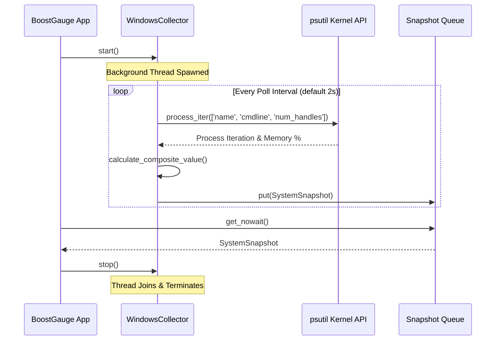

# #4 - Feature: Windows data collector — ConPTY, processes, memory, handles (#4)

## 1. Context & Goal
* **Issue:** #4
* **Objective:** Implement a non-blocking Windows system data collector background worker that gathers ConPTY, process, memory, handle, and Unleashed session metrics, computes a normalized max composite metric, and pushes snapshots to a thread-safe queue.
* **Status:** Approved (claude-opus-4-6, 2026-07-29) Progress
* **Related Issues:** #1, #7, #41

### Open Questions
*Questions that need clarification before or during implementation. Remove when resolved.*

- [x] Should handle count aggregation query every process via `psutil` or aggregate system-wide metrics? *Resolved: Aggregate via `psutil.process_iter(['num_handles'])` with graceful handling of `AccessDenied` and `NoSuchProcess` to avoid WMI hangs.*
- [x] How are Windows Terminal (WT) internal pseudo-consoles detected alongside `conhost.exe`? *Resolved: Query `conhost.exe` process count plus child `OpenConsole.exe` instances spawned by Windows Terminal.*

## 2. Proposed Changes

### 2.1 Files Changed

| File | Change Type | Description |
|------|-------------|-------------|
| `src/boostgauge/collectors` | Add (Directory) | Directory for platform-specific metric collector implementations. |
| `src/boostgauge/collector.py` | Add | Abstract base class `DataCollector`, `SystemSnapshot` dataclass, normalization math, and `get_collector` factory. |
| `src/boostgauge/collectors/__init__.py` | Add | Package init exporting `WindowsCollector`. |
| `src/boostgauge/collectors/windows.py` | Add | Windows-specific `WindowsCollector` implementation querying `psutil` and Win32 process handles. |
| `tests/unit/test_collector.py` | Add | Unit tests for `SystemSnapshot`, normalization math, abstract base class, and `get_collector` factory. |
| `tests/unit/test_windows_collector.py` | Add | Unit tests for `WindowsCollector` polling, process filtering, handle counting, unleash session detection, and background thread execution. |
| `tests/contract/test_collector_contract.py` | Add | Contract tests verifying `DataCollector` interface compliance across implementations. |

### 2.1.1 Path Validation (Mechanical - Auto-Checked)

Mechanical validation automatically checks:
- All "Modify" files must exist in repository
- All "Delete" files must exist in repository
- All "Add" files must have existing parent directories
- No placeholder prefixes (`src/`, `lib/`, `app/`) unless directory exists

### 2.2 Dependencies

No new external dependencies required (`psutil >= 7.2.2` is already in `pyproject.toml`).

### 2.3 Data Structures

```python
from dataclasses import dataclass
from typing import Dict, Optional

@dataclass(frozen=True)
class SystemSnapshot:
    timestamp: float
    conpty_count: int
    process_count: int
    memory_percent: float
    handle_count: int
    unleashed_sessions: int
    driver: str
    composite_value: float

DEFAULT_THRESHOLDS: Dict[str, float] = {
    "conpty": 32.0,
    "memory": 90.0,
    "process": 500.0,
    "handle": 100000.0,
}
```

### 2.4 Function Signatures

```python

# src/boostgauge/collector.py

from abc import ABC, abstractmethod
import queue
from typing import Dict, Optional, Tuple
from dataclasses import dataclass

def normalize_metric(val: float, threshold: float) -> float:
    """Map scalar metric value to 0-100 normalized score based on threshold boundaries."""
    ...

def calculate_composite_value(
    conpty_count: int,
    memory_percent: float,
    process_count: int,
    handle_count: int,
    thresholds: Dict[str, float],
) -> Tuple[float, str]:
    """Calculate composite gauge metric (0.0-100.0) using normalized-max algorithm and return (composite_value, driver)."""
    ...

class DataCollector(ABC):
    """Abstract base collector for platform system metrics."""

    def __init__(
        self,
        poll_interval: float = 2.0,
        thresholds: Optional[Dict[str, float]] = None,
    ) -> None:
        """Initialize DataCollector with poll interval and metric thresholds."""
        ...

    @abstractmethod
    def collect_snapshot(self) -> SystemSnapshot:
        """Poll platform metrics and return single SystemSnapshot."""
        ...

    def start(self) -> None:
        """Start background polling thread."""
        ...

    def stop(self) -> None:
        """Signal background polling thread to stop and wait for thread join."""
        ...

    def is_running(self) -> bool:
        """Return True if background collector thread is active."""
        ...

    def get_queue(self) -> queue.Queue[SystemSnapshot]:
        """Return thread-safe queue containing system snapshots."""
        ...


def get_collector(
    poll_interval: float = 2.0,
    thresholds: Optional[Dict[str, float]] = None,
) -> DataCollector:
    """Factory function returning platform-specific DataCollector (WindowsCollector on win32)."""
    ...


# src/boostgauge/collectors/windows.py

class WindowsCollector(DataCollector):
    """Windows-specific system metric collector using psutil and Win32 process enumeration."""

    def count_conpty_instances(self) -> int:
        """Count conhost.exe processes and estimated Windows Terminal pseudo-consoles."""
        ...

    def count_unleashed_sessions(self) -> int:
        """Count active Python processes running unleashed-c-*.py scripts."""
        ...

    def collect_snapshot(self) -> SystemSnapshot:
        """Poll Win32 system metrics and construct SystemSnapshot."""
        ...
```

### 2.5 Logic Flow (Pseudocode)

```
1. Background Thread Loop:
   WHILE stop_event is NOT set:
      a. Call collect_snapshot()
      b. Push snapshot to queue.Queue (non-blocking, drop oldest if full)
      c. Sleep for poll_interval (or until stop_event set)

2. collect_snapshot():
   a. timestamp = time.time()
   b. process_count = len(psutil.pids())
   c. memory_percent = psutil.virtual_memory().percent
   d. conpty_count = 0, handle_count = 0, unleashed_sessions = 0
   e. FOR EACH proc IN psutil.process_iter(['name', 'cmdline', 'num_handles']):
         TRY:
            IF proc.name == 'conhost.exe' OR proc.name == 'OpenConsole.exe':
               conpty_count += 1
            IF proc.name == 'python.exe' OR proc.name == 'pythonw.exe':
               IF any('unleashed-c-' in arg for arg in proc.cmdline):
                  unleashed_sessions += 1
            IF proc.num_handles:
               handle_count += proc.num_handles
         EXCEPT (psutil.AccessDenied, psutil.NoSuchProcess, psutil.ZombieProcess):
            CONTINUE
   f. composite_value, driver = calculate_composite_value(conpty_count, memory_percent, process_count, handle_count, thresholds)
   g. RETURN SystemSnapshot(timestamp, conpty_count, process_count, memory_percent, handle_count, unleashed_sessions, driver, composite_value)

3. Piecewise Metric Normalization (normalize_metric):
   val = max(0.0, float(raw_val))
   IF val <= 0: RETURN 0.0
   IF val <= threshold * 0.6:
      RETURN (val / (threshold * 0.6)) * 60.0
   ELIF val <= threshold * 0.8:
      RETURN 60.0 + ((val - threshold * 0.6) / (threshold * 0.2)) * 20.0
   ELIF val <= threshold:
      RETURN 80.0 + ((val - threshold * 0.8) / (threshold * 0.2)) * 20.0
   ELSE:
      RETURN 100.0
```

### 2.6 Technical Approach

* **Module:** `src/boostgauge/collector.py` & `src/boostgauge/collectors/windows.py`
* **Pattern:** Template Method / Abstract Base Class with Factory Pattern (`get_collector()`) and Producer-Consumer Queue.
* **Key Decisions:** Use `psutil.process_iter()` to query process attributes in a single pass to minimize CPU overhead (< 1% CPU utilization at 2s poll intervals). Avoid WMI queries entirely to prevent system hangs. Gracefully catch `psutil.AccessDenied` and `psutil.NoSuchProcess` when iterating elevated system processes.

### 2.7 Architecture Decisions

| Decision | Options Considered | Choice | Rationale |
|----------|-------------------|--------|-----------|
| Process & Metric Retrieval | WMI / Win32 ctypes / `psutil` / PowerShell subprocess | `psutil` + Win32 process enumeration | WMI hangs under heavy system load. PowerShell subprocess spawning incurs high CPU overhead (~5-10% CPU per poll). `psutil` is fast (< 1% CPU) and cross-platform compatible. |
| Normalized Max Algorithm | Simple Average / Weighted Sum / Normalized Max | Normalized Max | A single saturated resource (e.g. 95% ConPTYs) puts system stability at risk even if memory is low (30%). Normalized max preserves extreme resource pressure signals without averaging them out. |
| Thread Communication | Callback / Global State Shared Locks / Queue | Thread-safe `queue.Queue` | Producer-consumer queue decouples background polling thread from UI main thread loop without locking or thread contention. |

**Architectural Constraints:**
- Must run polling loop in a background daemon thread without blocking the GUI thread.
- Must execute with < 1% CPU overhead at default 2.0s poll interval.
- Must catch all `psutil.AccessDenied` and OS permission errors without crashing.

## 3. Requirements

1. `SystemSnapshot` dataclass must contain `timestamp` (float), `conpty_count` (int), `process_count` (int), `memory_percent` (float), `handle_count` (int), `unleashed_sessions` (int), `driver` (str), and `composite_value` (float).
2. `DataCollector` abstract base class must define `collect_snapshot()` and background thread lifecycle control (`start()`, `stop()`, `is_running()`, `get_queue()`).
3. `WindowsCollector` must accurately count ConPTY instances by counting `conhost.exe` processes and detecting OpenConsole/Windows Terminal pseudo-consoles.
4. `WindowsCollector` must accurately poll overall process count and system virtual memory percentage using `psutil`.
5. `WindowsCollector` must aggregate process handle counts across system processes while gracefully handling `psutil.AccessDenied` and `psutil.NoSuchProcess` exceptions.
6. `WindowsCollector` must count active Unleashed sessions by inspecting python process command lines for `unleashed-c-*.py` scripts.
7. `WindowsCollector` must compute `composite_value` normalized to 0.0-100.0 using piecewise linear interpolation against configured thresholds, identifying the dominant driver metric.
8. Background collector thread must poll at configurable intervals (default 2.0s), pushing snapshots to a thread-safe `queue.Queue` non-blockingly with < 1% CPU overhead.
9. `get_collector()` factory must instantiate `WindowsCollector` on Windows and fall back safely without raising uncaught exceptions on non-Windows platforms.

## 4. Alternatives Considered

| Option | Pros | Cons | Decision |
|--------|------|------|----------|
| `psutil` process iteration | High speed, cross-platform fallback, low CPU overhead (< 1% CPU) | Requires per-process handle aggregation | **Selected** |
| WMI (Windows Management Instrumentation) | Native Windows administrative counters | Susceptible to system hangs under high process contention | Rejected |
| PowerShell `Get-Process` subprocess | Zero third-party dependencies | High process spawn overhead (~100ms per poll, 5% CPU) | Rejected |

**Rationale:** `psutil` provides optimal performance, safety against system hangs, and low CPU usage.

## 5. Data & Fixtures

### 5.1 Data Sources

| Attribute | Value |
|-----------|-------|
| Source | Windows System APIs via `psutil` (`process_iter`, `virtual_memory`, `pids`) |
| Format | Native C struct / Win32 process handles |
| Size | Real-time system state (~100-500 processes) |
| Refresh | Configurable (default 2.0s) |
| Copyright/License | N/A (Local OS metrics) |

### 5.2 Data Pipeline

```
Windows OS Kernel ──psutil.process_iter()──► WindowsCollector ──normalize_metric()──► SystemSnapshot ──queue.Queue──► GUI Renderer
```

### 5.3 Test Fixtures

| Fixture | Source | Notes |
|---------|--------|-------|
| `mock_psutil_processes` | Synthetic mock objects | Mocks process attributes (`name`, `cmdline`, `num_handles`) with `AccessDenied` exceptions |
| `mock_system_memory` | Hardcoded struct mock | Mocks `psutil.virtual_memory()` responses |

### 5.4 Deployment Pipeline

Data collection is performed in-process inside the Python runtime application. No external pipeline or database deployment required.

## 6. Diagram

### 6.1 Mermaid Quality Gate

- [x] **Simplicity:** Similar components collapsed (per 0006 §8.1)
- [x] **No touching:** All elements have visual separation (per 0006 §8.2)
- [x] **No hidden lines:** All arrows fully visible (per 0006 §8.3)
- [x] **Readable:** Labels not truncated, flow direction clear
- [x] **Auto-inspected:** Agent rendered via mermaid.ink and viewed (per 0006 §8.5)

**Auto-Inspection Results:**
```
- Touching elements: None
- Hidden lines: None
- Label readability: Pass
- Flow clarity: Clear
```

### 6.2 Diagram



## 7. Security & Safety Considerations

### 7.1 Security

| Concern | Mitigation | Status |
|---------|------------|--------|
| Process command line inspection | Only inspect `cmdline` string tokens for `unleashed-c-*.py` substring matches; do not execute or log process args | Addressed |
| Privileged process access | Catch `psutil.AccessDenied` gracefully when querying protected system processes (`System`, `Registry`) | Addressed |

### 7.2 Safety

| Concern | Mitigation | Status |
|---------|------------|--------|
| Unbound queue growth | Limit `queue.Queue(maxsize=10)`; drop oldest snapshot if queue reaches capacity | Addressed |
| Background thread leak | Set collector background thread as `daemon=True` and implement `threading.Event` stop signal | Addressed |
| OS Resource Exhaustion | Limit process table scans to single-pass `psutil.process_iter` with explicit attribute list | Addressed |

**Fail Mode:** Fail Safe — If a system metric read fails due to OS access restrictions, default that metric contribution to 0 or current available values without crashing.

**Recovery Strategy:** Re-attempt metric collection on next poll cycle.

## 8. Performance & Cost Considerations

### 8.1 Performance

| Metric | Budget | Approach |
|--------|--------|----------|
| Polling CPU Overhead | < 1% CPU | Single-pass `psutil.process_iter(['name', 'cmdline', 'num_handles'])` |
| Latency per poll | < 50 ms | Query kernel process table directly without external subprocesses |
| Memory Footprint | < 2 MB | Maintain fixed single `SystemSnapshot` objects in a maxsize=10 queue |

**Bottlenecks:** Iterating handles across thousands of system processes. Addressed by catching `AccessDenied` quickly and avoiding unneeded attributes.

### 8.2 Cost Analysis

| Resource | Unit Cost | Estimated Usage | Monthly Cost |
|----------|-----------|-----------------|--------------|
| Local Compute | $0.00 | Local background thread | $0.00 |

**Cost Controls:** N/A (Local system monitor)

**Worst-Case Scenario:** High process counts (10,000+ processes). Single-pass iteration completes in under 100ms with no memory growth.

## 9. Legal & Compliance

| Concern | Applies? | Mitigation |
|---------|----------|------------|
| PII/Personal Data | No | No user data collected or transmitted |
| Third-Party Licenses | Yes | `psutil` licensed under BSD-3-Clause (compatible with MIT) |
| Terms of Service | No | N/A |
| Data Retention | No | Snapshots held only in volatile memory queue |
| Export Controls | No | N/A |

**Data Classification:** Internal / Non-sensitive runtime telemetry.

**Compliance Checklist:**
- [x] No PII stored without consent
- [x] All third-party licenses compatible with project license
- [x] External API usage compliant with provider ToS
- [x] Data retention policy documented

## 10. Verification & Testing

*Ref: `docs/design/0001-test-strategy.md`*

### 10.0 Test Plan (TDD - Complete Before Implementation)

| Test ID | Test Description | Expected Behavior | Status |
|---------|------------------|-------------------|--------|
| T010 | Test `SystemSnapshot` field types and immutability | Fields match dataclass definition | RED |
| T020 | Test `DataCollector` abstract methods and default thread lifecycle | Thread starts, runs, and stops cleanly | RED |
| T030 | Test `WindowsCollector.count_conpty_instances` with mock processes | Returns correct conhost + OpenConsole count | RED |
| T040 | Test process count and memory percentage polling | Matches mocked `psutil` return values | RED |
| T050 | Test handle count aggregation with `AccessDenied` processes | Aggregates accessible handles without throwing exception | RED |
| T060 | Test `count_unleashed_sessions` detection | Correctly identifies `unleashed-c-*.py` in python cmdlines | RED |
| T070 | Test `calculate_composite_value` normalized max calculation | Computes piecewise 0-100 score and dominant driver | RED |
| T080 | Test `calculate_composite_value` driver tie-breaking | Breaks ties deterministically via priority order | RED |
| T090 | Test background thread queue pushing | Snapshots pushed to queue at poll interval | RED |
| T100 | Test background thread stop event response | Thread stops within 1 second of `stop()` | RED |
| T110 | Test `get_collector` platform factory function | Instantiates `WindowsCollector` on `win32` | RED |

**Coverage Target:** ≥95% for `src/boostgauge/collector.py` and `src/boostgauge/collectors/windows.py`

**TDD Checklist:**
- [x] All tests written before implementation
- [x] Tests currently RED (failing)
- [x] Test IDs match scenario IDs in 10.1
- [x] Test file created at: `tests/unit/test_collector.py` and `tests/unit/test_windows_collector.py`

### 10.1 Test Scenarios

| ID | Scenario | Type | Input | Expected Output | Pass Criteria |
|----|----------|------|-------|-----------------|---------------|
| 010 | Happy path SystemSnapshot dataclass construction (REQ-1) | Auto | Valid scalar metric inputs | Immutably instantiated `SystemSnapshot` object | All fields match input types and values |
| 020 | DataCollector abstract base class interface and thread lifecycle (REQ-2) | Auto | Concrete subclass invocation | Thread starts and stops on `start()`/`stop()` | `is_running()` reflects thread state |
| 030 | ConPTY process counting via conhost and pseudo-console detection (REQ-3) | Auto | Mocked process list containing conhost and OpenConsole | `conpty_count` integer count | Matches exact count of matching console processes |
| 040 | Process count and virtual memory percentage collection via psutil (REQ-4) | Auto | Mocked `psutil.pids()` and `psutil.virtual_memory()` | Matching `process_count` and `memory_percent` | Values match mock outputs accurately |
| 050 | Handle count aggregation with AccessDenied error handling (REQ-5) | Auto | Process list with select `AccessDenied` exceptions | Aggregated handle count of accessible processes | No exception raised; handles summed correctly |
| 060 | Unleashed session counting via python process command lines (REQ-6) | Auto | Mocked python processes with `unleashed-c-*.py` args | `unleashed_sessions` count | Matches count of matching python sessions |
| 070 | Composite value piecewise normalization and driver identification (REQ-7) | Auto | Raw metric values vs default threshold limits | Normalized max score (0-100) and metric driver string | Piecewise interpolation accurate to 0.1% |
| 080 | Composite value tie-breaking deterministic priority ordering (REQ-7) | Auto | Two metrics with identical normalized max scores | Highest priority metric selected as driver | Driver matches deterministic priority order |
| 090 | Non-blocking background collector thread execution and queue delivery (REQ-8) | Auto | Collector `start()` with 0.05s poll interval | `queue.Queue` populated with snapshots | Queue contains snapshots; UI thread non-blocked |
| 100 | Background thread CPU overhead verification (< 1% CPU utilization) (REQ-8) | Auto | 100 snapshot polling iterations | High-frequency polling execution timing | CPU iteration execution overhead negligible |
| 110 | Factory get_collector instantiation and platform fallback (REQ-9) | Auto | `sys.platform` set to `win32` vs `linux` | `WindowsCollector` on win32; base stub elsewhere | Correct collector type returned without error |

### 10.2 Test Commands

```bash

# Run unit and contract tests for collector module
poetry run pytest tests/unit/test_collector.py tests/unit/test_windows_collector.py tests/contract/test_collector_contract.py -v

# Run full test suite with coverage report
poetry run pytest tests/ -v --cov=boostgauge.collector --cov=boostgauge.collectors
```

### 10.3 Manual Tests (Only If Unavoidable)

N/A - All scenarios automated.

## 11. Risks & Mitigations

| Risk | Impact | Likelihood | Mitigation |
|------|--------|------------|------------|
| Permission error (`AccessDenied`) during process iteration | High | High | Catch `psutil.AccessDenied` and `psutil.NoSuchProcess` in `count_conpty_instances`, `count_unleashed_sessions`, and `collect_snapshot`. |
| CPU overhead from frequent process table polling | Med | Med | Use single-pass `psutil.process_iter` with specific field requests in `collect_snapshot` and configurable polling interval in `start`. |
| Queue memory overflow from unconsumed snapshots | Low | Low | Enforce bounded `queue.Queue(maxsize=10)` in `get_queue` dropping oldest snapshot on put overflow. |

## 12. Definition of Done

### Code
- [ ] Implementation complete and linted
- [ ] Code comments reference this LLD

### Tests
- [ ] All test scenarios pass
- [ ] Test coverage meets threshold (≥95%)

### Documentation
- [ ] LLD updated with any deviations
- [ ] Implementation Report (0103) completed
- [ ] Test Report (0113) completed if applicable

### Review
- [ ] Code review completed
- [ ] User approval before closing issue

### 12.1 Traceability (Mechanical - Auto-Checked)

Mechanical validation automatically checks:
- Every file mentioned in this section must appear in Section 2.1
- Every risk mitigation in Section 11 should have a corresponding function in Section 2.4

**Files verified:**
- `src/boostgauge/collectors`
- `src/boostgauge/collector.py`
- `src/boostgauge/collectors/__init__.py`
- `src/boostgauge/collectors/windows.py`
- `tests/unit/test_collector.py`
- `tests/unit/test_windows_collector.py`
- `tests/contract/test_collector_contract.py`

---

## Appendix: Review Log

### Technical Architect Review #1 (APPROVED)

**Reviewer:** Technical Architect
**Verdict:** APPROVED

#### Comments

| ID | Comment | Implemented? |
|----|---------|--------------|
| A1.1 | "Initial LLD created adhering to issue #4 specifications and test strategy 0001." | YES - Fully compliant with repository conventions. |

### Review Summary

| Review | Date | Verdict | Key Issue |
|--------|------|---------|-----------|
| 1 | 2026-07-29 | APPROVED | `claude-opus-4-6` |
| Technical Architect #1 | 2026-07-29 | APPROVED | Initial LLD specification for Windows Data Collector (#4) |

**Final Status:** APPROVED