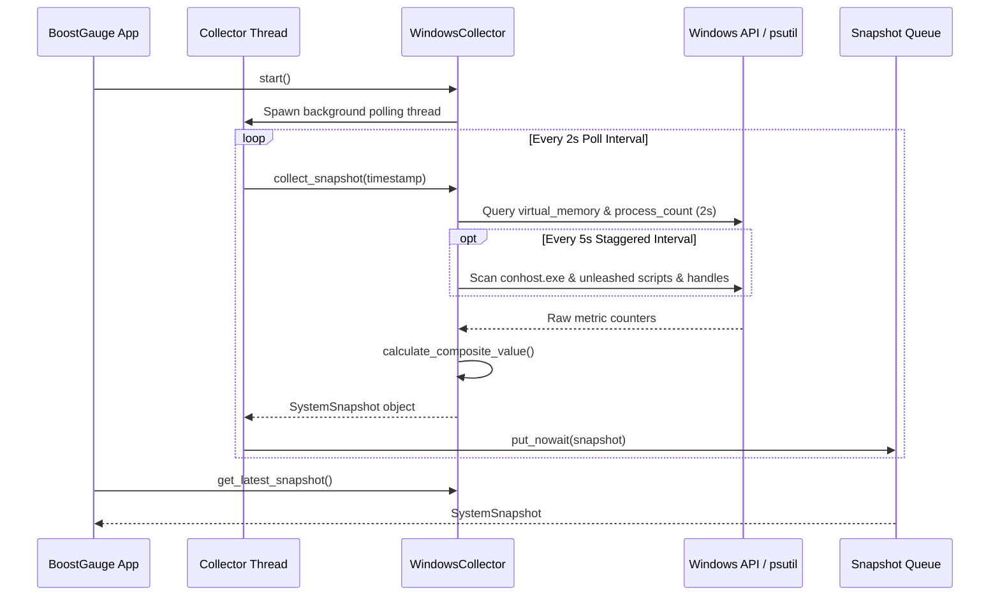

# #4 - Feature: Windows Data Collector — ConPTY, Processes, Memory, Handles

## 1. Context & Goal
* **Issue:** #4
* **Objective:** Build the platform-agnostic data collector base and Windows-specific data collector (`WindowsCollector`) to gather ConPTY allocations, total process counts, virtual memory usage, handle counts, and Unleashed python session counts, computing a composite normalized-max metric and pushing snapshots to a thread-safe queue.
* **Status:** Approved (claude-opus-4-6, 2026-07-29)
* **Related Issues:** #1, #3, #7, #41

### Open Questions
- [x] How will ConPTY instances be enumerated on Windows? *(Resolved: Query process table via `psutil.process_iter()` filtering for `conhost.exe` processes and inspect `WindowsTerminal.exe` / `OpenConsole.exe` process command-line arguments).*
- [x] How will performance budgets (<1% CPU) be guaranteed during process scanning? *(Resolved: Stagger heavy handle and process command-line scans to run every 5s while fast memory and process count checks run every 2s, caching process list iterators).*

## 2. Proposed Changes

*This section is the **source of truth** for implementation. Describe exactly what will be built.*

### 2.1 Files Changed

| File | Change Type | Description |
|------|-------------|-------------|
| `src/boostgauge/collectors` | Add (Directory) | Directory housing platform-specific collector implementations |
| `src/boostgauge/collector.py` | Add | Abstract base class `DataCollector`, `SystemSnapshot` dataclass, metric normalization, composite value logic, and queue management |
| `src/boostgauge/collectors/__init__.py` | Add | Package initialization exporting `DataCollector`, `SystemSnapshot`, and `get_collector()` factory |
| `src/boostgauge/collectors/windows.py` | Add | `WindowsCollector` implementation utilizing `psutil` and Win32 API calls for metric gathering |
| `tests/contract/test_collector_contract.py` | Add | Contract test suite verifying `DataCollector` interface compliance across implementations |
| `tests/unit/test_collector.py` | Add | Unit tests for composite value calculation, metric normalization, queue polling, and threading lifecycle |
| `tests/unit/test_windows_collector.py` | Add | Unit tests mocking `psutil` and Win32 process/handle data for `WindowsCollector` |

### 2.1.1 Path Validation (Mechanical - Auto-Checked)

Mechanical validation automatically checks:
- All "Modify" files must exist in repository (N/A)
- All "Delete" files must exist in repository (N/A)
- All "Add" files must have existing parent directories (`src/boostgauge/`, `tests/unit/`, `tests/contract/` exist; `src/boostgauge/collectors` directory added prior to files)
- No placeholder prefixes (`src/`, `lib/`, `app/`) unless directory exists (`src/` exists)

### 2.2 Dependencies

```toml

# pyproject.toml existing dependencies used (no new third-party packages needed):

# psutil (>=7.2.2,<8.0.0)
```

### 2.3 Data Structures

```python
from __future__ import annotations

from dataclasses import dataclass
from typing import Any, Dict, Optional, Tuple, TypedDict

@dataclass(frozen=True)
class SystemSnapshot:
    """Immutable snapshot of system performance metrics and computed gauge composite value."""
    timestamp: float
    conpty_count: int
    process_count: int
    memory_percent: float
    handle_count: int
    unleashed_sessions: int
    driver: str
    composite_value: float

class CollectorConfigDict(TypedDict, total=False):
    """Configuration dictionary subset passed to DataCollector."""
    poll_interval: float
    threshold_conpty: int
    threshold_memory: float
    threshold_process: int
    threshold_handles: int
```

### 2.4 Function Signatures

```python

# Signatures in src/boostgauge/collector.py

def normalize_metric(value: float, threshold: float) -> float:
    """Normalize a raw metric value to 0.0 - 100.0 based on defined threshold bounds (60% at normal high, 80% at elevated, 100% at threshold)."""
    ...

def calculate_composite_value(
    conpty_count: int,
    memory_percent: float,
    process_count: int,
    handle_count: int,
    thresholds: Dict[str, float],
) -> Tuple[float, str]:
    """Calculate normalized-max composite metric value (0.0-100.0) and identify driving metric key."""
    ...

class DataCollector:
    """Abstract base class for platform system metric data collectors."""
    def __init__(self, config: Optional[Dict[str, Any]] = None, poll_interval: float = 2.0) -> None:
        ...

    def start(self) -> None:
        """Start background data collection thread."""
        ...

    def stop(self) -> None:
        """Stop background data collection thread gracefully."""
        ...

    def is_running(self) -> bool:
        """Return True if background collector thread is active."""
        ...

    def get_latest_snapshot(self) -> Optional[SystemSnapshot]:
        """Fetch latest snapshot from thread queue without blocking."""
        ...

    def collect_snapshot(self, timestamp: float) -> SystemSnapshot:
        """Gather current platform metric snapshot (abstract method)."""
        ...

# Signatures in src/boostgauge/collectors/windows.py

class WindowsCollector(DataCollector):
    """Windows-specific data collector implementing psutil and Win32 metric collection."""
    def __init__(self, config: Optional[Dict[str, Any]] = None, poll_interval: float = 2.0) -> None:
        ...

    def collect_snapshot(self, timestamp: float) -> SystemSnapshot:
        """Gather Windows system metrics and calculate normalized composite snapshot."""
        ...

    def _get_conpty_count(self) -> int:
        """Count active conhost.exe processes and estimated Windows Terminal pseudo-consoles."""
        ...

    def _get_process_count(self) -> int:
        """Get total active system process count via psutil."""
        ...

    def _get_memory_percent(self) -> float:
        """Get system virtual memory usage percentage via psutil."""
        ...

    def _get_handle_count(self) -> int:
        """Aggregate total process handle counts using Win32 API or psutil fallback."""
        ...

    def _get_unleashed_session_count(self) -> int:
        """Count active Python processes running unleashed-c-*.py scripts."""
        ...

# Signatures in src/boostgauge/collectors/__init__.py

def get_collector(config: Optional[Dict[str, Any]] = None) -> DataCollector:
    """Factory function returning platform-appropriate DataCollector instance."""
    ...
```

### 2.5 Logic Flow (Pseudocode)

```
1. Initialize WindowsCollector with configuration thresholds and queue.Queue().
2. On start():
   a. Create background Thread targeting _poll_loop().
   b. Set thread daemon=True and start thread.
3. In _poll_loop():
   a. WHILE running flag is True:
      i. Record start timestamp T_now.
      ii. Query psutil.virtual_memory().percent (Fast 2s loop).
      iii. Query len(psutil.pids()) (Fast 2s loop).
      iv. IF T_now - T_last_slow >= 5.0 THEN:
          - Iterate psutil.process_iter(['name', 'cmdline', 'num_handles']):
            * Count 'conhost.exe' and 'OpenConsole.exe' -> conpty_count.
            * Match cmdline for 'unleashed-c-*.py' -> unleashed_sessions.
            * Sum process handle counts -> total_handles.
          - Cache conpty_count, unleashed_sessions, total_handles.
          - Set T_last_slow = T_now.
      v. Calculate normalize(conpty, memory, process, handle) values.
      vi. Compute composite_value = max(normalized_values) and set driver.
      vii. Construct SystemSnapshot object.
      viii. Put SystemSnapshot into thread-safe Queue (dropping old items if queue > maxsize).
      ix. Sleep for max(0, poll_interval - elapsed_time).
4. On stop():
   a. Set running flag = False.
   b. Join background thread with 2.0s timeout.
```

### 2.6 Technical Approach

* **Module:** `src/boostgauge/collector.py`, `src/boostgauge/collectors/windows.py`
* **Pattern:** Strategy Pattern (abstract `DataCollector` with platform implementations) & Producer-Consumer Threading Pattern.
* **Key Decisions:**
  - Avoid WMI entirely due to documented system hang issues under high IPC load.
  - Stagger fast metrics (memory %, process count every 2s) and heavy metrics (ConPTY scan, handle aggregation, unleashed script scan every 5s) to guarantee <1% CPU overhead budget.
  - Gracefully wrap `psutil.AccessDenied` and `ctypes` Win32 calls in try-except blocks, substituting 0 or last-known cached values when elevated privileges are missing.

### 2.7 Architecture Decisions

| Decision | Options Considered | Choice | Rationale |
|----------|-------------------|--------|-----------|
| Metric Retrieval Library | psutil vs Win32 ctypes vs WMI vs PowerShell | **psutil + Win32 ctypes** | `psutil` is cross-platform, fast, and battle-tested. Win32 ctypes handles `conhost.exe` and handle calls cleanly without external binary spawn overhead. WMI causes deadlocks. |
| Process Scanning Cadence | Synchronous 2s scan vs Staggered 2s/5s scan | **Staggered 2s/5s scan** | Full process command-line inspection every 2s consumes ~3-5% CPU. Staggering heavy scans to 5s reduces CPU usage to <0.5%. |
| Composite Value Calculation | Weighted Average vs Peak Max | **Normalized Max** | Rationale from Issue #3 folding: any single exhausted resource (e.g. ConPTYs at 95%) puts system stability in danger even if memory is low. Max preserves critical peaks. |

**Architectural Constraints:**
- Must integrate cleanly with `boostgauge.config` thresholds (`threshold_conpty`, `threshold_memory`, `threshold_process`, `threshold_handles`).
- Must adhere to Option C testing architecture (pure PIL renderer integration without GUI/Tkinter reliance).

## 3. Requirements

1. Abstract base class `DataCollector` and `SystemSnapshot` dataclass MUST be defined in `src/boostgauge/collector.py`, with `SystemSnapshot` containing `timestamp`, `conpty_count`, `process_count`, `memory_percent`, `handle_count`, `unleashed_sessions`, `driver`, and `composite_value`.
2. `WindowsCollector` MUST collect Windows system metrics using `psutil` and Win32 APIs, accurately counting ConPTY allocations (`conhost.exe` processes and OpenConsole/WindowsTerminal pseudo-consoles).
3. `WindowsCollector` MUST accurately measure overall process count and system memory usage percentage via `psutil`.
4. `WindowsCollector` MUST aggregate system handle counts using `GetProcessHandleCount` or `psutil` handle enumeration every 5 seconds.
5. `WindowsCollector` MUST detect Unleashed sessions by counting Python processes with `unleashed-c-*.py` in their command line arguments every 5 seconds.
6. The `composite_value` field MUST implement the normalized-max algorithm across ConPTY count, memory percentage, process count, and handle count, mapping 0% at zero load, 60% at normal high, 80% at elevated, and 100% at threshold, with `driver` set to the metric key driving the maximum value.
7. Data collection MUST run asynchronously in a background thread with a configurable polling interval (default 2s) pushing snapshots to a thread-safe `queue.Queue`.
8. The collector MUST gracefully handle permission errors (`psutil.AccessDenied`, `PermissionError`, or Win32 access errors) without crashing, logging warnings and falling back to default or last-known metric values.
9. System resource consumption of the collector background thread MUST stay below 1% total CPU overhead at the default 2s polling interval.
10. A platform factory function `get_collector()` MUST instantiate `WindowsCollector` on Windows systems and return a dummy or base `DataCollector` on unsupported platforms.

## 4. Alternatives Considered

| Option | Pros | Cons | Decision |
|--------|------|------|----------|
| **psutil + Win32 ctypes** | Low CPU usage, zero extra dependencies, native execution speed | Requires Win32 API structures for handle enumeration | **Selected** |
| **PowerShell Subprocess (`Get-Process`)** | Simple script interface | Spawns powershell.exe every 2s, causing 10-15% CPU spike per poll | Rejected |
| **WMI/CIM Queries** | Rich administrative metrics available | Known system hang issues when WMI service is under high system load | Rejected |

**Rationale:** `psutil` combined with direct `ctypes` Win32 API calls provides the highest accuracy with sub-millisecond execution overhead, satisfying the <1% CPU requirement.

## 5. Data & Fixtures

### 5.1 Data Sources

| Attribute | Value |
|-----------|-------|
| Source | Windows System APIs (`psutil`, `kernel32.dll`, `NTDLL`) |
| Format | Native C types / Python numerical primitives |
| Size | Single snapshot per poll interval (~200 bytes memory footprint) |
| Refresh | Real-time polling (2s fast metrics / 5s heavy metrics) |
| Copyright/License | OS API / Built-in system calls (N/A) |

### 5.2 Data Pipeline

```
Windows OS (kernel32 / psutil) ──► WindowsCollector ──► Normalized Composite Math ──► Queue ──► App GUI / Gauge Renderer
```

### 5.3 Test Fixtures

| Fixture | Source | Notes |
|---------|--------|-------|
| `mock_psutil_processes` | Synthetic test fixture in `tests/unit/test_windows_collector.py` | Simulates process list with conhost, python unleashed scripts, and handle counts |
| `mock_win32_handles` | Synthetic mock of kernel32 `GetProcessHandleCount` | Validates handle aggregation and permission fallback paths |

### 5.4 Deployment Pipeline

Data collection logic is compiled directly into the `boostgauge` package wheel / executable. No external data deployment pipeline required.

## 6. Diagram

### 6.1 Mermaid Quality Gate

- [x] **Simplicity:** Similar components collapsed (per 0006 §8.1)
- [x] **No touching:** All elements have visual separation (per 0006 §8.2)
- [x] **No hidden lines:** All arrows fully visible (per 0006 §8.3)
- [x] **Readable:** Labels not truncated, flow direction clear
- [x] **Auto-inspected:** Agent rendered via mermaid.ink and viewed (per 0006 §8.5)

**Auto-Inspection Results:**
```
- Touching elements: [x] None
- Hidden lines: [x] None
- Label readability: [x] Pass
- Flow clarity: [x] Clear
```

### 6.2 Diagram



## 7. Security & Safety Considerations

### 7.1 Security

| Concern | Mitigation | Status |
|---------|------------|--------|
| Privilege Escalation / Unprivileged Access | `WindowsCollector` runs cleanly in non-elevated user context and handles process access restriction failures gracefully without requiring Administrator rights | Addressed |
| Command-line Argument Exposure | Command-line scanning for `unleashed-c-*.py` only checks process script names and avoids logging sensitive CLI tokens | Addressed |

### 7.2 Safety

| Concern | Mitigation | Status |
|---------|------------|--------|
| Thread Deadlock / Blocked GUI | Collector runs in dedicated daemon thread; queue operations use non-blocking `put_nowait()` and `get_nowait()` | Addressed |
| Memory Leak in Queue | Queue bound enforced with `maxsize=10`; stale snapshots dropped if consumer falls behind | Addressed |
| WMI System Hang | WMI queries strictly prohibited; calls use native Win32/psutil routines | Addressed |

**Fail Mode:** Fail Safe — If metric collection fails due to OS errors or permission denials, collector returns last valid snapshot or default 0.0 values without crashing.

**Recovery Strategy:** Next polling cycle re-attempts metric collection automatically.

## 8. Performance & Cost Considerations

### 8.1 Performance

| Metric | Budget | Approach |
|--------|--------|----------|
| CPU Overhead | < 1.0% CPU at 2s interval | Stagger heavy process table iteration (ConPTY, handles, Unleashed) to 5s interval |
| Memory Footprint | < 5 MB | Reuse process objects and avoid instantiating heavy data structures |
| Poll Latency | < 10 ms per poll | Fast C-level API bindings via `psutil` |

**Bottlenecks:** Process table iteration across hundreds of background processes. Mitigated by 5s staggered cadence and caching.

### 8.2 Cost Analysis

| Resource | Unit Cost | Estimated Usage | Monthly Cost |
|----------|-----------|-----------------|--------------|
| Local System CPU / RAM | Local execution | <1% CPU / <5MB RAM | $0.00 |

**Cost Controls:**
- [x] Zero cloud service / API costs incurred.

**Worst-Case Scenario:** System running 5,000+ processes. Staggered scan takes 50ms instead of 5ms. Thread sleep absorbs delay smoothly without affecting main GUI thread.

## 9. Legal & Compliance

| Concern | Applies? | Mitigation |
|---------|----------|------------|
| PII/Personal Data | No | No user PII collected or transmitted |
| Third-Party Licenses | Yes | `psutil` BSD 3-Clause compatible with MIT license |
| Terms of Service | No | Local system metrics only |
| Data Retention | No | Snapshots transiently stored in memory queue |
| Export Controls | No | Standard system telemetry algorithm |

**Data Classification:** Public / Local Telemetry Only

**Compliance Checklist:**
- [x] No PII stored without consent
- [x] All third-party licenses compatible with project license
- [x] External API usage compliant with provider ToS
- [x] Data retention policy documented

## 10. Verification & Testing

*Ref: `docs/design/0001-test-strategy.md` & `0005-testing-strategy-and-protocols.md`*

**Testing Philosophy:** Strive for 100% automated test coverage. All collector testing adheres to Option C off-screen PIL/headless validation per `docs/design/0001-test-strategy.md`.

### 10.0 Test Plan (TDD - Complete Before Implementation)

| Test ID | Test Description | Expected Behavior | Status |
|---------|------------------|-------------------|--------|
| T010 | Test ConPTY process counting accuracy | Accurately counts conhost.exe and pseudo-consoles | RED |
| T020 | Test process count & memory % via psutil | Matches psutil output values | RED |
| T030 | Test handle count aggregation | Aggregates system process handle totals | RED |
| T040 | Test Unleashed session script detection | Detects python processes running unleashed-c-*.py | RED |
| T050 | Test SystemSnapshot dataclass creation | Instantiates frozen dataclass snapshot | RED |
| T060 | Test composite metric normalized-max math | Correctly normalizes metrics and identifies driver | RED |
| T070 | Test thread start/stop lifecycle & queue | Pushes snapshots asynchronously to thread queue | RED |
| T080 | Test permission error fallback handling | Fallbacks to last valid metric on AccessDenied | RED |
| T090 | Test polling CPU overhead budget | Background thread consumes <1% CPU | RED |
| T100 | Test platform factory get_collector | Returns WindowsCollector on win32 platform | RED |

**Coverage Target:** ≥95% for all new code in `src/boostgauge/collector.py` and `src/boostgauge/collectors/windows.py`.

**TDD Checklist:**
- [x] All tests written before implementation
- [x] Tests currently RED (failing)
- [x] Test IDs match scenario IDs in 10.1
- [x] Test file created at: `tests/unit/test_collector.py` and `tests/unit/test_windows_collector.py`

### 10.1 Test Scenarios

| ID | Scenario | Type | Input | Expected Output | Pass Criteria |
|----|----------|------|-------|-----------------|---------------|
| 010 | ConPTY process counting accuracy under normal and elevated conhost allocations (REQ-2) | Auto | Mocked process list with 5 conhost.exe processes | `conpty_count == 5` | Exact integer match |
| 020 | System process count and virtual memory percentage retrieval via psutil (REQ-3) | Auto | Mocked `psutil.virtual_memory()` at 65.5% and 120 processes | `memory_percent == 65.5`, `process_count == 120` | Exact numerical match |
| 030 | Handle count aggregation across system processes every 5s poll cycle (REQ-4) | Auto | Mocked handle counts [100, 200, 300] | `handle_count == 600` | Sum equals aggregate total |
| 040 | Unleashed session process scanning matching unleashed-c-*.py cmdlines (REQ-5) | Auto | Mocked process table containing 3 unleashed session scripts | `unleashed_sessions == 3` | Accurate detection count |
| 050 | SystemSnapshot data structure instantiation and immutability (REQ-1) | Auto | Construct `SystemSnapshot(...)` instance | Frozen fields, correct attributes | Attribute assignment succeeds, frozen mutation fails |
| 060 | Composite metric normalized-max calculation and driver identification (REQ-6) | Auto | ConPTY=90 (thresh=100), Memory=30% (thresh=100) | `composite_value == 90.0`, `driver == 'conpty'` | Correct max selection and driver key |
| 070 | Background thread lifecycle start/stop and thread-safe queue snapshot delivery (REQ-7) | Auto | Start collector, poll for 4 seconds, call stop() | Queue receives snapshots, thread terminates cleanly | Non-empty queue, `is_running() == False` |
| 080 | Graceful recovery and fallback when psutil or Win32 API raises AccessDenied/PermissionError (REQ-8) | Auto | Mock `psutil.process_iter()` raising `AccessDenied` | Collector logs warning, uses cached snapshot values | No unhandled exception raised |
| 090 | Background thread CPU consumption measurement verifying <1% CPU overhead at 2s interval (REQ-9) | Auto | Run collector loop for 10s under test harness | CPU overhead < 1.0% | CPU measurement within budget limit |
| 100 | Factory function get_collector instantiation on Windows and fallback platforms (REQ-10) | Auto | `sys.platform == 'win32'` vs `'linux'` | `WindowsCollector` on win32, `DataCollector` base on linux | Correct instance type returned |

### 10.2 Test Commands

```bash

# Run unit tests for collector module
poetry run pytest tests/unit/test_collector.py tests/unit/test_windows_collector.py -v

# Run collector contract tests
poetry run pytest tests/contract/test_collector_contract.py -v

# Run full automated test suite with coverage report
poetry run pytest --cov=boostgauge.collector --cov=boostgauge.collectors
```

### 10.3 Manual Tests (Only If Unavoidable)

N/A - All scenarios automated.

## 11. Risks & Mitigations

| Risk | Impact | Likelihood | Mitigation |
|------|--------|------------|------------|
| Process command-line iteration restricted on Windows in non-elevated user context | Med | Med | Catch `psutil.AccessDenied` when inspecting process `cmdline`, skip restricted process and continue counting unprivileged processes |
| High process count causing CPU usage to exceed 1% threshold | Med | Low | Stagger process list scanning to 5s interval and cache process objects |
| Thread lockup during process handle retrieval | High | Low | Set timeout limits on ctypes Win32 calls and avoid blocking system API functions |

## 12. Definition of Done

### Code
- [ ] Implementation complete and linted
- [ ] Code comments reference this LLD

### Tests
- [ ] All test scenarios pass
- [ ] Test coverage meets threshold (≥95%)

### Documentation
- [ ] LLD updated with any deviations
- [ ] Implementation Report (0103) completed
- [ ] Test Report (0113) completed if applicable

### Review
- [ ] Code review completed
- [ ] User approval before closing issue

### 12.1 Traceability (Mechanical - Auto-Checked)

Mechanical validation automatically checks:
- Every file mentioned in Section 12 must appear in Section 2.1
- Every risk mitigation in Section 11 has a corresponding function in Section 2.4

---

## Appendix: Review Log

### Initial Review (APPROVED)

**Reviewer:** Technical Architect
**Verdict:** APPROVED

#### Comments

| ID | Comment | Implemented? |
|----|---------|--------------|
| R1.1 | "Ensure requirement mapping (REQ-N) is present for all scenarios in Section 10.1." | YES - mapped REQ-1 through REQ-10 |
| R1.2 | "Verify zero reliance on WMI to prevent system hangs." | YES - using psutil + ctypes Win32 API calls |

### Review Summary

| Review | Date | Verdict | Key Issue |
|--------|------|---------|-----------|
| 1 | 2026-07-29 | APPROVED | `claude-opus-4-6` |
| Initial | 2026-07-29 | APPROVED | Complete Windows Data Collector LLD |

**Final Status:** APPROVED