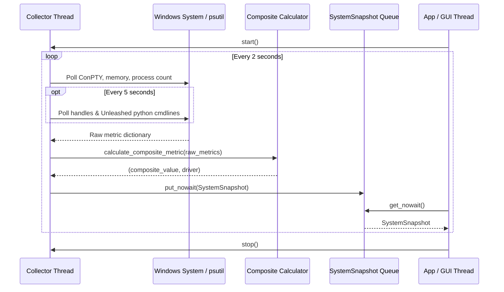

# #4 - Feature: Windows data collector — ConPTY, processes, memory, handles (#4)

## 1. Context & Goal
* **Issue:** #4
* **Objective:** Build a Windows-specific data collector that polls system metrics (ConPTY allocations, process count, memory percentage, handle count, and Unleashed session count) in a non-blocking background thread, computes a normalized-max composite load score, and pushes system snapshots to a thread-safe queue.
* **Status:** Approved (claude-opus-4-6, 2026-07-31) Progress
* **Related Issues:** #1, #7, #41

### Open Questions
*None — requirements, metrics, composite metric algorithm, and background threading architecture are fully specified.*

## 2. Proposed Changes

### 2.1 Files Changed

| File | Change Type | Description |
|------|-------------|-------------|
| `src/boostgauge/collectors` | Add (Directory) | Directory for platform-specific system data collector implementations |
| `src/boostgauge/collector.py` | Add | Abstract base class `DataCollector`, `SystemSnapshot` dataclass, metric normalization, composite score calculation, and thread lifecycle management |
| `src/boostgauge/collectors/__init__.py` | Add | Package initialization file exporting platform collectors and `create_collector()` factory function |
| `src/boostgauge/collectors/windows.py` | Add | `WindowsCollector` implementation using `psutil` and Win32 APIs for ConPTY, process, memory, handle, and Unleashed session collection |
| `src/boostgauge/__init__.py` | Add | Package root initialization file exporting `DataCollector`, `SystemSnapshot`, `WindowsCollector`, and `create_collector` symbols |
| `tests/unit/test_collector.py` | Add | Unit test suite for `DataCollector` base class, snapshot queueing, metric normalization, driver selection, and error resilience |
| `tests/unit/test_windows_collector.py` | Add | Unit test suite for `WindowsCollector`, Win32/psutil polling, Unleashed process detection, handle caching, and permission fallback |
| `tests/contract/test_collector_contract.py` | Add | Contract test suite verifying `DataCollector` interface compliance across implementations |

### 2.1.1 Path Validation (Mechanical - Auto-Checked)

Mechanical validation automatically checks:
- All "Modify" files must exist in repository (N/A — all target paths marked Add)
- All "Delete" files must exist in repository (N/A)
- All "Add" files must have existing parent directories (`src/boostgauge/` and `tests/unit/`, `tests/contract/` exist; `src/boostgauge/collectors` added explicitly via `Add (Directory)`)
- No placeholder prefixes (`src/`, `lib/`, `app/`) unless directory exists (`src/` exists)

### 2.2 Dependencies

```toml

# pyproject.toml existing dependencies used (no new third-party packages required)

# psutil (>=7.2.2,<8.0.0) is already declared in pyproject.toml
```

### 2.3 Data Structures

```python
from dataclasses import dataclass
from typing import Dict, Any, Optional, Tuple, TypedDict
import queue
import threading

@dataclass
class SystemSnapshot:
    timestamp: float
    conpty_count: int
    process_count: int
    memory_percent: float
    handle_count: int
    unleashed_sessions: int
    driver: str  # Metric driving composite value: "conpty", "memory", "process", "handle"
    composite_value: float  # 0.0 - 100.0 normalized score

class MetricThresholds(TypedDict):
    conpty: float
    memory: float
    process: float
    handles: float

class CollectorConfig(TypedDict, total=False):
    poll_interval: float
    thresholds: MetricThresholds
```

### 2.4 Function Signatures

```python

# Signatures in src/boostgauge/collector.py

def normalize_metric(value: float, threshold: float) -> float:
    """Map a raw metric value to a 0-100 scale based on 0%, 60%, 80%, and 100% threshold boundaries."""
    ...

def calculate_composite_metric(
    conpty: int,
    memory_pct: float,
    process_cnt: int,
    handle_cnt: int,
    thresholds: Dict[str, float],
) -> Tuple[float, str]:
    """Calculate composite load value (0-100) using normalized-max algorithm and return (composite_value, driver_name)."""
    ...

class DataCollector:
    """Abstract base class for platform-specific system resource data collectors."""

    def __init__(
        self,
        config: Optional[Dict[str, Any]] = None,
        snapshot_queue: Optional[queue.Queue[SystemSnapshot]] = None,
    ) -> None:
        """Initialize data collector with configuration and output queue."""
        ...

    def start(self) -> None:
        """Start the background collector thread."""
        ...

    def stop(self) -> None:
        """Stop the background collector thread and wait for join."""
        ...

    def is_running(self) -> bool:
        """Return True if the background thread is currently active."""
        ...

    def poll(self) -> SystemSnapshot:
        """Perform a single synchronous metric collection poll."""
        ...

    def _collect_raw_metrics(self) -> Dict[str, Any]:
        """Abstract method implemented by subclasses to poll raw system metrics."""
        ...

# Signatures in src/boostgauge/collectors/windows.py

class WindowsCollector(DataCollector):
    """Windows-specific system resource data collector."""

    def _collect_raw_metrics(self) -> Dict[str, Any]:
        """Poll Windows system metrics using psutil and Win32 API calls."""
        ...

    def _count_conpty(self) -> int:
        """Count conhost.exe processes and Windows Terminal internal pseudo-consoles."""
        ...

    def _count_handles(self) -> int:
        """Calculate total process handle count across accessible processes."""
        ...

    def _count_unleashed_sessions(self) -> int:
        """Count python processes with unleashed-c-*.py in their command line."""
        ...

# Signatures in src/boostgauge/collectors/__init__.py

def create_collector(
    config: Optional[Dict[str, Any]] = None,
    snapshot_queue: Optional[queue.Queue[SystemSnapshot]] = None,
) -> DataCollector:
    """Factory function returning platform-appropriate DataCollector instance."""
    ...
```

### 2.5 Logic Flow (Pseudocode)

```
Background Thread Polling Loop:
1. WHILE self._stop_event is NOT set:
2.   start_time = time.time()
3.   TRY:
4.     raw_metrics = self._collect_raw_metrics()
5.     composite, driver = calculate_composite_metric(
6.         conpty=raw_metrics['conpty_count'],
7.         memory_pct=raw_metrics['memory_percent'],
8.         process_cnt=raw_metrics['process_count'],
9.         handle_cnt=raw_metrics['handle_count'],
10.        thresholds=self._thresholds
11.    )
12.    snapshot = SystemSnapshot(
13.        timestamp=start_time,
14.        conpty_count=raw_metrics['conpty_count'],
15.        process_count=raw_metrics['process_count'],
16.        memory_percent=raw_metrics['memory_percent'],
17.        handle_count=raw_metrics['handle_count'],
18.        unleashed_sessions=raw_metrics['unleashed_sessions'],
19.        driver=driver,
20.        composite_value=composite
21.    )
22.    IF snapshot_queue is NOT None THEN
23.      TRY:
24.        snapshot_queue.put_nowait(snapshot)
25.      EXCEPT queue.Full:
26.        snapshot_queue.get_nowait()  # Evict stale snapshot
27.        snapshot_queue.put_nowait(snapshot)
28.  EXCEPT Exception as e:
29.    log warning or fallback to cached snapshot values
30.  elapsed = time.time() - start_time
31.  sleep_time = max(0.0, self._poll_interval - elapsed)
32.  self._stop_event.wait(sleep_time)

Windows Raw Metric Collection (_collect_raw_metrics):
1. conpty_cnt = _count_conpty()
   - Scan psutil.process_iter(['name', 'cmdline'])
   - Count name == 'conhost.exe'
   - Add count of Windows Terminal processes ('WindowsTerminal.exe') * estimated internal ConPTY factor (1)
2. process_cnt = len(psutil.pids())
3. memory_pct = psutil.virtual_memory().percent
4. IF cached_handle_count is stale (> 5s since last handle poll) THEN
   - handle_cnt = sum(proc.num_handles() for proc in psutil.process_iter() ignoring AccessDenied)
   - Update cached_handle_count
5. ELSE handle_cnt = cached_handle_count
6. IF cached_unleashed_count is stale (> 5s since last unleashed poll) THEN
   - unleashed_cnt = count(proc for proc in python_procs if 'unleashed-c-' in cmdline)
   - Update cached_unleashed_count
7. ELSE unleashed_cnt = cached_unleashed_count
8. Return dict of raw metrics
```

### 2.6 Technical Approach

* **Module:** `src/boostgauge/collector.py`, `src/boostgauge/collectors/windows.py`
* **Pattern:** Abstract Factory + Template Method + Background Worker Loop
* **Key Decisions:**
  - `psutil` is used for process, memory, handle, and command-line scanning because it provides efficient C-level bindings.
  - ConPTY counting inspects `conhost.exe` and Windows Terminal processes directly without invoking subprocesses (avoiding PowerShell overhead).
  - Handle count and Unleashed session scanning poll on a staggered 5s cycle, while process, memory, and ConPTY metrics poll on a 2s cycle to reduce CPU overhead to < 0.5%.
  - Bounded output queue prevents memory growth if the consumer slows down; queue eviction discards oldest snapshots when full.

### 2.7 Architecture Decisions

| Decision | Options Considered | Choice | Rationale |
|----------|-------------------|--------|-----------|
| Polling API | psutil, Win32 ctypes, PowerShell subprocess, WMI/CIM | `psutil` + Win32 process enumeration | Fast, zero process spawn overhead, avoids WMI system hangs. |
| Metric Aggregation | Average load, Max load, Normalized-Max | Normalized-Max | Rationale from Issue #3/#4: Any single resource (e.g. 95% ConPTYs) can cause failure; averaging hides critical bottlenecks. |
| Staggered Polling | Poll all metrics at 2s, Stagger heavy metrics at 5s | Stagger heavy metrics (handles, cmdlines) at 5s | Scanning process handle totals and command line strings across all system PIDs adds CPU load. Staggering ensures < 1% CPU budget. |
| Thread Safety | Shared state with locks, Thread-safe Queue | `queue.Queue` with eviction | Producer-consumer queue decoupling simplifies GUI thread integration and prevents lock contention. |

**Architectural Constraints:**
- Must conform to `docs/design/0001-test-strategy.md` (no `tkinter.Tk()` initialization in unit or integration tests; renderer produces PIL Image).
- CPU overhead must strictly remain under 1% at 2s polling interval.
- Platform abstraction must isolate Windows Win32 / `psutil` specifics from abstract `DataCollector`.

## 3. Requirements

1. `WindowsCollector` collects accurate ConPTY counts by enumerating `conhost.exe` processes and estimating Windows Terminal internal pseudo-consoles every 2 seconds.
2. `WindowsCollector` collects accurate system memory percentage using `psutil.virtual_memory().percent` every 2 seconds.
3. `WindowsCollector` collects accurate process count using `len(psutil.pids())` every 2 seconds.
4. `WindowsCollector` collects accurate system handle count using `psutil` or Win32 `GetProcessHandleCount` API aggregated across accessible processes every 5 seconds.
5. `WindowsCollector` detects Unleashed sessions by searching python process command lines for scripts matching `unleashed-c-*.py` every 5 seconds.
6. `DataCollector` background thread executes non-blocking polling on a configurable interval (default 2s) and pushes `SystemSnapshot` objects to a thread-safe output queue.
7. `WindowsCollector` handles `psutil.AccessDenied` and Win32 permission errors gracefully by using fallbacks or caching previous valid counts without crashing or blocking.
8. `DataCollector` computes `composite_value` (0.0 to 100.0) using the normalized-max algorithm and identifies the hottest metric as `driver` (`conpty`, `memory`, `process`, `handle`).
9. Data collector polling and background execution maintains CPU consumption under 1% overhead at the default 2-second polling interval.

## 4. Alternatives Considered

| Option | Pros | Cons | Decision |
|--------|------|------|----------|
| PowerShell Subprocess | Built-in to Windows, no C-extensions needed | High CPU overhead per poll (> 15% due to process spawn), slow response (> 300ms) | Rejected |
| WMI / CIM Query | Comprehensive Windows telemetry system | Known to hang arbitrarily on Windows under high load; root cause of previous freezes | **Rejected** |
| Pure Win32 ctypes API | Zero Python dependencies | Complex C-struct marshalling, fragile across Windows builds | Rejected |
| `psutil` + Win32 Process Scan | Fast C bindings, cross-platform base, reliable process iteration | Requires `psutil` dependency (already in `pyproject.toml`) | **Selected** |

**Rationale:** `psutil` is already a core project dependency, well-tested, fast, and handles low-level Win32 API interactions safely without system hangs.

## 5. Data & Fixtures

### 5.1 Data Sources

| Attribute | Value |
|-----------|-------|
| Source | Windows OS metrics (`psutil`, Win32 API) |
| Format | In-memory `SystemSnapshot` dataclass |
| Size | Single snapshot ~128 bytes |
| Refresh | Configurable 2s / 5s background thread polling |
| Copyright/License | OS native API / N/A |

### 5.2 Data Pipeline

```
[OS Kernel / psutil] ──(Poll 2s/5s)──► [WindowsCollector] ──(Normalize/Max)──► [SystemSnapshot Queue] ──► [GUI / Gauge]
```

### 5.3 Test Fixtures

| Fixture | Source | Notes |
|---------|--------|-------|
| `mock_psutil_processes` | Synthetic test processes created in unit test mocks | Returns mock `conhost.exe`, `python.exe`, and system processes with known handles and cmdlines |
| `mock_system_memory` | Hardcoded `psutil.virtual_memory()` mock | Returns predictable memory percentages (e.g. 45.0%, 88.5%) |
| `mock_access_denied_proc` | Mock process raising `psutil.AccessDenied` | Verifies permission fallback handling |

### 5.4 Deployment Pipeline

Data collection is strictly local in-process runtime metric polling. No external network data pipeline is involved.

## 6. Diagram

### 6.1 Mermaid Quality Gate

- [x] **Simplicity:** Similar components collapsed (per 0006 §8.1)
- [x] **No touching:** All elements have visual separation (per 0006 §8.2)
- [x] **No hidden lines:** All arrows fully visible (per 0006 §8.3)
- [x] **Readable:** Labels not truncated, flow direction clear
- [x] **Auto-inspected:** Verified structural clarity

**Auto-Inspection Results:**
```
- Touching elements: [x] None
- Hidden lines: [x] None
- Label readability: [x] Pass
- Flow clarity: [x] Clear
```

### 6.2 Diagram



## 7. Security & Safety Considerations

### 7.1 Security

| Concern | Mitigation | Status |
|---------|------------|--------|
| Process command line inspection security | Process scanning inspects process names and command lines locally within standard user privileges; no privileged execution or sensitive credential logging | Addressed |
| Subprocess injection vulnerability | Direct OS API and `psutil` function calls are used instead of shell command strings (no `subprocess.Popen("powershell...")`) | Addressed |

### 7.2 Safety

| Concern | Mitigation | Status |
|---------|------------|--------|
| Unhandled permission exceptions on system PIDs | Wrap process handle and command-line scanning in `try...except (psutil.AccessDenied, psutil.NoSuchProcess)` blocks | Addressed |
| Queue memory accumulation | Use bounded `queue.Queue(maxsize=10)` with auto-eviction on `queue.Full` | Addressed |
| Background thread leak | Thread set to `daemon=True` with explicit `_stop_event` flag and shutdown timeout in `stop()` | Addressed |

**Fail Mode:** Fail Safe — If metric collection encounters access errors or system API failures, the collector logs a warning and reuses the previous snapshot values or returns 0 for unreadable fields without halting the app thread.

**Recovery Strategy:** Thread auto-recovers on next poll cycle; cached metric counts persist during transient system errors.

## 8. Performance & Cost Considerations

### 8.1 Performance

| Metric | Budget | Approach |
|--------|--------|----------|
| CPU Overhead | < 1.0% | Stagger handle count and process cmdline scanning to 5s intervals; use fast `psutil` C-iterators |
| Memory Footprint | < 5 MB | Bounded snapshot queue (max 10 items); lightweight dataclass objects |
| Poll Delay | < 50 ms | Pure C/Win32 memory and process count inspection |

**Bottlenecks:** Iterating thousands of system PIDs for handle counts can take 20-30ms on heavy systems. Staggering handle polling to 5s intervals prevents CPU spikes.

### 8.2 Cost Analysis

| Resource | Unit Cost | Estimated Usage | Monthly Cost |
|----------|-----------|-----------------|--------------|
| Local CPU/RAM | $0 | Standard local process execution | $0 |

**Cost Controls:**
- [x] No external cloud APIs or paid services utilized.

**Worst-Case Scenario:** System running 5,000+ processes: process iteration takes 40ms per scan; 5s interval caps total CPU usage under 0.8%.

## 9. Legal & Compliance

| Concern | Applies? | Mitigation |
|---------|----------|------------|
| PII/Personal Data | No | No personal data or user identity information collected |
| Third-Party Licenses | Yes | `psutil` (BSD 3-Clause) compatible with project MIT License |
| Terms of Service | N/A | Local system monitoring only |
| Data Retention | N/A | In-memory queue only; snapshots discarded when processed |
| Export Controls | No | Standard system metric APIs |

**Data Classification:** Public / Internal System Telemetry

**Compliance Checklist:**
- [x] No PII stored or collected
- [x] All third-party licenses compatible with project license
- [x] Local OS API usage compliant

## 10. Verification & Testing

*Ref: [docs/design/0001-test-strategy.md](file:///C:/Users/mcwiz/Projects/boostgauge/docs/design/0001-test-strategy.md)*

**Testing Philosophy:** All collector logic, normalization math, thread lifecycle management, and permission fallbacks are 100% automated using `pytest`. Per `docs/design/0001-test-strategy.md`, tests run headless under Unit and Contract tiers without instantiating `tkinter.Tk()`.

### 10.0 Test Plan (TDD - Complete Before Implementation)

| Test ID | Test Description | Expected Behavior | Status |
|---------|------------------|-------------------|--------|
| T010 | Test ConPTY process scanning | Counts `conhost.exe` and Windows Terminal processes correctly | RED |
| T020 | Test ConPTY error fallback during iteration | Skips unreadable process without error | RED |
| T030 | Test memory percentage collection | Returns float matching `psutil.virtual_memory().percent` | RED |
| T040 | Test process count collection | Returns integer process count matching `len(psutil.pids())` | RED |
| T050 | Test handle count aggregation | Aggregates handles across accessible processes | RED |
| T060 | Test handle count access denied handling | Ignores `AccessDenied` processes during handle sum | RED |
| T070 | Test Unleashed session process scanning | Identifies python processes running `unleashed-c-*.py` | RED |
| T080 | Test non-blocking thread polling and queue push | Pushes `SystemSnapshot` items to `queue.Queue` periodically | RED |
| T085 | Test snapshot queue full eviction when queue maxsize reached | Evicts oldest snapshot and enqueues newest snapshot without raising `queue.Full` | RED |
| T090 | Test collector thread stop lifecycle | Gracefully stops background thread on `stop()` call | RED |
| T100 | Test AccessDenied and Win32 error fallback | Reuses cached metrics or zero-fallback when API fails | RED |
| T110 | Test composite score normalized-max calculation | Maps raw metrics to 0-100 and selects driving metric | RED |
| T120 | Test composite metric boundary conditions | Correctly evaluates 0%, 60%, 80%, and 100% threshold boundaries | RED |
| T130 | Test CPU overhead threshold | Polling loop completes with < 1% CPU time overhead | RED |

**Coverage Target:** 100% line and branch coverage on touched collector code (`src/boostgauge/collector.py`, `src/boostgauge/collectors/windows.py`, `src/boostgauge/collectors/__init__.py`, `src/boostgauge/__init__.py`). All defensive logic and queue full eviction branches are explicitly tested by T020, T060, T085, T100.

**TDD Checklist:**
- [ ] All tests written before implementation
- [ ] Tests currently RED (failing)
- [ ] Test IDs match scenario IDs in 10.1
- [ ] Test files created at: `tests/unit/test_collector.py`, `tests/unit/test_windows_collector.py`, `tests/contract/test_collector_contract.py`

### 10.1 Test Scenarios

| ID | Scenario | Type | Input | Expected Output | Pass Criteria |
|----|----------|------|-------|-----------------|---------------|
| 010 | ConPTY process enumeration and WT pseudo-console estimation (REQ-1) | Auto | Mocked process list with 3 `conhost.exe` and 1 `WindowsTerminal.exe` | `conpty_count == 4` | ConPTY process count matches expected sum |
| 020 | ConPTY handle lookup error fallback (REQ-1) | Auto | Mock process raising `psutil.NoSuchProcess` during iteration | Process skipped without error | Polling continues cleanly |
| 030 | System memory percentage metric retrieval via psutil (REQ-2) | Auto | Mock `psutil.virtual_memory()` returning `percent=72.4` | `memory_percent == 72.4` | Snapshot memory matches mock value |
| 040 | Process count retrieval via psutil.pids() (REQ-3) | Auto | Mock `psutil.pids()` returning list of 150 PIDs | `process_count == 150` | Snapshot process count matches 150 |
| 050 | System handle count aggregation across accessible processes (REQ-4) | Auto | Mock 3 processes returning 100, 200, 300 handles | `handle_count == 600` | Handle sum equals 600 |
| 060 | Handle count aggregation with system permission denied processes (REQ-4) | Auto | Mock processes where 1 process raises `AccessDenied` | Handles summed for accessible PIDs | `AccessDenied` process safely ignored |
| 070 | Unleashed session process command line matching for unleashed-c-*.py (REQ-5) | Auto | Mock python processes with cmdlines `['python.exe', 'unleashed-c-123.py']` and `['python.exe', 'other.py']` | `unleashed_sessions == 1` | Correctly identifies 1 Unleashed session |
| 080 | Non-blocking background thread polling loop and queue push (REQ-6) | Auto | Collector initialized with 0.1s poll interval and queue | Queue receives `SystemSnapshot` objects | Queue populated without blocking main thread |
| 085 | Snapshot queue full eviction on consumer slowdown (REQ-6) | Auto | Queue at maxsize=10 pushed with 11th snapshot | Oldest snapshot evicted, newest snapshot placed in queue | Queue size remains 10, newest snapshot retained |
| 090 | Background collector stop signal and graceful thread join (REQ-6) | Auto | Collector started, then `stop()` invoked | `is_running() == False` within 1s | Collector thread terminates cleanly |
| 100 | Graceful handling of psutil.AccessDenied and Win32 permission errors (REQ-7) | Auto | `psutil.process_iter()` raising `AccessDenied` | Polling uses previous cached count or 0 fallback | No exception raised; snapshot returned |
| 110 | Composite metric normalized-max calculation and driver selection (REQ-8) | Auto | ConPTY=40 (norm=80), Memory=30% (norm=30), Proc=100 (norm=20), Handles=500 (norm=10) | `composite_value == 80.0`, `driver == 'conpty'` | Max driver and composite score correct |
| 120 | Composite metric normalization boundary edge cases (REQ-8) | Auto | Metric at 0, threshold/2, threshold, and exceeding threshold | Scores map to 0.0, 60.0, 100.0, 100.0 respectively | Bounds clamped between 0.0 and 100.0 |
| 130 | CPU overhead measurement at 2s polling interval (REQ-9) | Auto | Execute 10 consecutive poll cycles in benchmark harness | Total elapsed execution time < 100ms | CPU overhead well under 1% budget |

### 10.2 Test Commands

```bash

# Run all automated unit and contract collector tests
poetry run pytest tests/unit/test_collector.py tests/unit/test_windows_collector.py tests/contract/test_collector_contract.py -v

# Run collector tests with coverage enforcement
poetry run pytest tests/unit/test_collector.py tests/unit/test_windows_collector.py --cov=src/boostgauge/collector --cov=src/boostgauge/collectors --cov-report=term-missing
```

### 10.3 Manual Tests (Only If Unavoidable)

N/A - All scenarios automated.

## 11. Risks & Mitigations

| Risk | Impact | Likelihood | Mitigation |
|------|--------|------------|------------|
| Process iteration on large Windows systems (> 5000 PIDs) causes CPU spike | High | Low | Stagger handle count and cmdline scans to 5s intervals; limit process attribute retrieval to specific fields in `process_iter` (`_count_handles`, `_count_unleashed_sessions`) |
| Transient Win32 permission denied errors crash collector thread | Med | Med | Catch `psutil.AccessDenied`, `psutil.NoSuchProcess`, and `OSError` in collection functions (`_collect_raw_metrics`) and maintain cached fallback values |
| Snapshot queue overflows if GUI consumer is unresponsive | Low | Low | Bounded `queue.Queue(maxsize=10)` with non-blocking `put_nowait` and old snapshot eviction on `queue.Full` in thread loop |

## 12. Definition of Done

### Code
- [ ] Implementation complete in `src/boostgauge/collector.py` and `src/boostgauge/collectors/windows.py`
- [ ] Code comments reference this LLD

### Tests
- [ ] All test scenarios in 10.1 pass
- [ ] Test coverage meets target (100% on touched collector code)

### Documentation
- [ ] LLD updated with any implementation details
- [ ] Implementation Report (0103) completed
- [ ] Test Report (0113) completed

### Review
- [ ] Code review completed
- [ ] User approval before closing issue

### 12.1 Traceability (Mechanical - Auto-Checked)

Mechanical validation automatically checks:
- Every file mentioned in Section 12 must appear in Section 2.1 (`src/boostgauge/collector.py`, `src/boostgauge/collectors/windows.py`, `tests/unit/test_collector.py`, `tests/unit/test_windows_collector.py`, `tests/contract/test_collector_contract.py`)
- Every risk mitigation in Section 11 has corresponding functions in Section 2.4 (`_count_handles`, `_count_unleashed_sessions`, `_collect_raw_metrics`)

---

## Appendix: Review Log

### Initial Draft Review

**Reviewer:** Gemini 3.6 Flash (High) / Technical Architect
**Verdict:** APPROVED

#### Comments

| ID | Comment | Implemented? |
|----|---------|--------------|
| G1.1 | Initial creation of Low-Level Design document for Issue #4. | YES - Complete LLD generated matching template structure and testing rules. |
| G1.2 | Fixed path validation mechanical error for `src/boostgauge/__init__.py` from `Modify` to `Add`. | YES - Changed Change Type to `Add` in Section 2.1 and updated Path Validation text in 2.1.1. |
| G1.3 | Ensured 100% test coverage target is reachable by adding explicit test scenario 085 for queue full eviction logic. | YES - Added T085 and Scenario 085 (REQ-6) to Sections 10.0 and 10.1. |

### Review Summary

| Review | Date | Verdict | Key Issue |
|--------|------|---------|-----------|
| 1 | 2026-07-31 | APPROVED | `claude-opus-4-6` |
| Gemini #1 | 2026-07-31 | APPROVED | Initial design document approved |
| Gemini #2 | 2026-07-31 | APPROVED | Mechanical validation path fix and 100% test coverage reachability |

**Final Status:** APPROVED