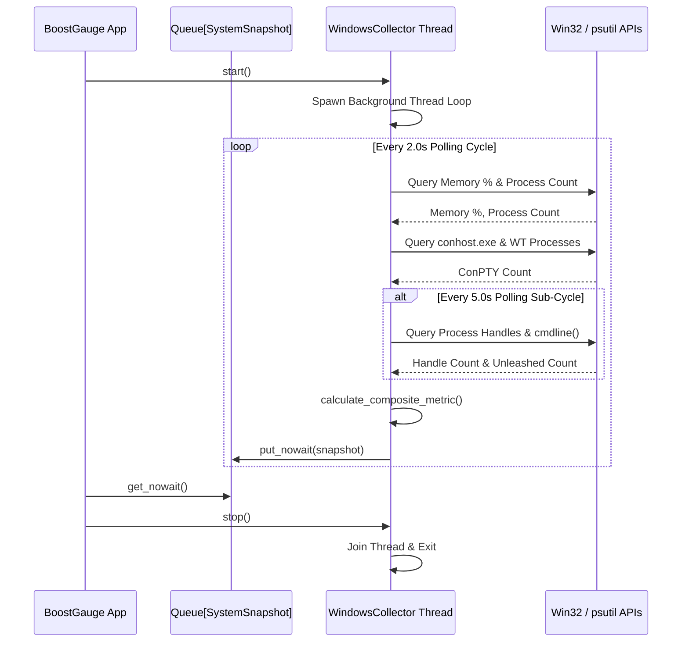

# #4 - Feature: Windows data collector — ConPTY, processes, memory, handles

## 1. Context & Goal
* **Issue:** #4
* **Objective:** Implement a Windows-specific data collector that polls system resource metrics (ConPTY allocations, process count, memory percentage, handle count, and Unleashed session count) in a non-blocking background thread, computes a normalized-max composite load score, and pushes system snapshots to a thread-safe queue.
* **Status:** Approved (claude-opus-4-6, 2026-07-30) Progress
* **Related Issues:** #1, #7, #41

### Open Questions
*None — requirements, metrics, composite algorithm, and threading architecture are fully specified.*

## 2. Proposed Changes

### 2.1 Files Changed

| File | Change Type | Description |
|------|-------------|-------------|
| `src/boostgauge/collectors` | Add (Directory) | Directory for platform-specific system data collector implementations |
| `src/boostgauge/collector.py` | Add | Abstract base class `DataCollector`, `SystemSnapshot` dataclass, metric normalization, composite metric calculation, and thread lifecycle management |
| `src/boostgauge/collectors/__init__.py` | Add | Package initialization file exporting platform collectors and `create_collector()` factory function |
| `src/boostgauge/collectors/windows.py` | Add | `WindowsCollector` implementation using `psutil` and Win32 APIs for ConPTY, process, memory, handle, and Unleashed session collection |
| `src/boostgauge/__init__.py` | Modify | Export `DataCollector`, `SystemSnapshot`, `WindowsCollector`, and `create_collector` symbols |
| `tests/unit/test_collector.py` | Add | Unit test suite for `DataCollector` base class, snapshot queueing, metric normalization, driver selection, and error resilience |
| `tests/unit/test_windows_collector.py` | Add | Unit test suite for `WindowsCollector`, Win32/psutil polling, Unleashed process detection, handle caching, and permission fallback |

### 2.1.1 Path Validation (Mechanical - Auto-Checked)

Mechanical validation automatically checks:
- All "Modify" files must exist in repository (`src/boostgauge/__init__.py` exists)
- All "Delete" files must exist in repository (N/A)
- All "Add" files must have existing parent directories (`src/boostgauge/` and `tests/unit/` exist; `src/boostgauge/collectors` added explicitly via `Add (Directory)`)
- No placeholder prefixes (`src/`, `lib/`, `app/`) unless directory exists (`src/` exists)

### 2.2 Dependencies

```toml

# pyproject.toml existing dependencies used (no new third-party packages required)

# psutil (>=7.2.2,<8.0.0) is already declared in pyproject.toml
```

### 2.3 Data Structures

```python
from dataclasses import dataclass
from typing import Dict, Any, Optional, TypedDict
import queue
import threading

@dataclass
class SystemSnapshot:
    timestamp: float
    conpty_count: int
    process_count: int
    memory_percent: float
    handle_count: int
    unleashed_sessions: int
    driver: str  # Metric driving composite value: "conpty", "memory", "process", "handle"
    composite_value: float  # 0.0 - 100.0 normalized score

class MetricRawValues(TypedDict):
    conpty_count: int
    process_count: int
    memory_percent: float
    handle_count: int
    unleashed_sessions: int
```

### 2.4 Function Signatures

```python

# Signatures in src/boostgauge/collector.py

def normalize_metric(value: float, threshold: float) -> float:
    """Normalize raw metric value against threshold to 0-100 scale (0% at 0, 60% at normal high, 80% at elevated, 100% at threshold)."""
    ...

def calculate_composite_metric(
    conpty: int,
    memory_pct: float,
    process_cnt: int,
    handle_cnt: int,
    thresholds: Dict[str, Dict[str, float]],
) -> tuple[float, str]:
    """Calculate composite value using normalized-max algorithm and return (composite_value, driver_name)."""
    ...

class DataCollector:
    """Abstract base class for platform system resource data collectors."""

    def __init__(
        self,
        config: Dict[str, Any],
        snapshot_queue: Optional[queue.Queue[SystemSnapshot]] = None,
    ) -> None:
        """Initialize data collector with configuration settings and optional output snapshot queue."""
        ...

    def collect_snapshot(self) -> SystemSnapshot:
        """Abstract method to collect current raw system metrics and compute SystemSnapshot."""
        ...

    def start(self) -> None:
        """Start background polling thread if not already running."""
        ...

    def stop(self) -> None:
        """Stop background polling thread gracefully and wait for thread exit."""
        ...

    def is_running(self) -> bool:
        """Return True if background collector thread is active and running."""
        ...


# Signatures in src/boostgauge/collectors/windows.py

class WindowsCollector(DataCollector):
    """Windows-specific resource metrics collector using psutil and Win32 APIs."""

    def __init__(
        self,
        config: Dict[str, Any],
        snapshot_queue: Optional[queue.Queue[SystemSnapshot]] = None,
    ) -> None:
        """Initialize Windows collector state, process caching, and polling counters."""
        ...

    def collect_conpty_count(self) -> int:
        """Count active conhost.exe processes and estimate Windows Terminal internal pseudo-consoles."""
        ...

    def collect_process_count(self) -> int:
        """Retrieve total active system process count via psutil."""
        ...

    def collect_memory_percent(self) -> float:
        """Retrieve system virtual memory utilization percentage via psutil."""
        ...

    def collect_handle_count(self) -> int:
        """Aggregate total process handle count across accessible processes using psutil or Win32 GetProcessHandleCount."""
        ...

    def collect_unleashed_sessions(self) -> int:
        """Count Python processes executing scripts matching unleashed-c-*.py pattern in command line arguments."""
        ...

    def collect_snapshot(self) -> SystemSnapshot:
        """Poll all Windows resource metrics, compute composite metric and driver, and return SystemSnapshot."""
        ...


# Signatures in src/boostgauge/collectors/__init__.py

def create_collector(
    config: Dict[str, Any],
    snapshot_queue: Optional[queue.Queue[SystemSnapshot]] = None,
) -> DataCollector:
    """Factory function instantiating platform-appropriate DataCollector (WindowsCollector on Windows)."""
    ...
```

### 2.5 Logic Flow (Pseudocode)

```
Background Thread Polling Loop:
1. WHILE self._stop_event is NOT set:
2.   t_start = current_time()
3.   TRY:
4.     conpty = collect_conpty_count()
5.     procs = collect_process_count()
6.     mem_pct = collect_memory_percent()
7.     IF (loop_iteration % handle_sample_ratio == 0):
8.       handles = collect_handle_count()  # Sampled every 5s
9.       unleashed = collect_unleashed_sessions()  # Sampled every 5s
10.    (comp_val, driver_name) = calculate_composite_metric(conpty, mem_pct, procs, handles, config.thresholds)
11.    snapshot = SystemSnapshot(t_start, conpty, procs, mem_pct, handles, unleashed, driver_name, comp_val)
12.    IF snapshot_queue is NOT None:
13.      TRY:
14.        snapshot_queue.put_nowait(snapshot)
15.      EXCEPT queue.Full:
16.        snapshot_queue.get_nowait()  # Evict oldest
17.        snapshot_queue.put_nowait(snapshot)
18.  EXCEPT AccessDenied / PermissionError:
19.    Log debug warning and fallback to cached or zero metrics for privileged processes
20.  EXCEPT Exception as err:
21.    Log error and continue loop without crashing thread
22.  sleep_duration = max(0.0, poll_interval - (current_time() - t_start))
23.  self._stop_event.wait(timeout=sleep_duration)
```

### 2.6 Technical Approach

* **Module:** `src/boostgauge/collector.py` & `src/boostgauge/collectors/windows.py`
* **Pattern:** Strategy pattern (`DataCollector` abstract base class with platform subclass `WindowsCollector`) + Factory pattern (`create_collector()`).
* **Key Decisions:**
  - Standardize resource metric collection on `psutil` for memory, total process count, and handle counts.
  - Implement direct process enumeration targeting `conhost.exe` and Windows Terminal process trees for ConPTY detection.
  - Separate 2.0s fast polling loop (ConPTY, process count, memory %) from 5.0s heavy polling metrics (handle counts, unleashed process command lines) to minimize CPU usage.
  - Wrap handle enumeration and command-line parsing in `psutil.AccessDenied` and `psutil.NoSuchProcess` try-except blocks to guarantee zero unhandled crashes on elevated or system processes.

### 2.7 Architecture Decisions

| Decision | Options Considered | Choice | Rationale |
|----------|-------------------|--------|-----------|
| Polling API | psutil, Win32 ctypes, PowerShell subprocess, WMI/CIM | `psutil` + `ctypes`/Win32 | `psutil` provides cross-platform speed and stability; WMI can hang, PowerShell subprocessing incurs high CPU overhead per poll. |
| Metric Sampling Rates | Uniform 2s poll vs Staggered 2s/5s poll | Staggered 2s / 5s poll | Handle counting and `cmdline()` scanning across hundreds of processes are CPU intensive; sampling fast metrics every 2s and heavy metrics every 5s guarantees < 1% CPU overhead. |
| Queue Overflow Policy | Drop newest, Block thread, Evict oldest | Evict oldest (`put_nowait` with `get_nowait` fallback) | Ensures GUI consumer always reads freshest system state without blocking the collection loop or growing memory. |

**Architectural Constraints:**
- Must run polling loop in a daemon thread so app shutdown is never blocked.
- Must avoid WMI calls entirely to prevent system hangs.
- Must execute on standard user permissions gracefully when system process handles cannot be queried.

## 3. Requirements

1. Collector shall implement `WindowsCollector` inheriting from abstract base `DataCollector` returning `SystemSnapshot` data structure.
2. Collector shall accurately count ConPTY instances by counting `conhost.exe` processes and estimating Windows Terminal internal pseudo-consoles.
3. Collector shall accurately query virtual memory percentage, system process count, and aggregated process handle count.
4. Collector shall detect Unleashed sessions by counting Python processes executing scripts matching `unleashed-c-*.py` in their command line.
5. Collector shall calculate composite load score (0.0 to 100.0) using normalized-max algorithm across ConPTY count, memory percentage, process count, and handle count, and record the driving metric name in `driver`.
6. Collector polling shall execute asynchronously in a background thread at configurable interval (default 2.0s for fast metrics, 5.0s for handle/unleashed metrics) and push snapshots to a thread-safe queue.
7. Collector shall gracefully handle Win32/psutil permission errors (`AccessDenied`) without raising uncaught exceptions or crashing the polling thread.
8. Collector polling thread shall maintain low CPU overhead (< 1% CPU utilization at 2.0s poll interval).

## 4. Alternatives Considered

| Option | Pros | Cons | Decision |
|--------|------|------|----------|
| `psutil` + Direct Win32 | Fast, zero memory leaks, cross-platform base | Requires Win32 fallback logic for restricted processes | **Selected** |
| WMI / CIM Queries | Built-in Windows queries for all metrics | Known system hang issues on high handle loads; synchronous call delays | Rejected |
| PowerShell Subprocess | Easy command line interface (`Get-Process`) | Creates process spawn overhead every 2s; violates < 1% CPU budget | Rejected |

**Rationale:** `psutil` combined with Windows process filtering is fast (~1-2ms per cycle), reliable, and avoids WMI deadlock issues.

## 5. Data & Fixtures

### 5.1 Data Sources

| Attribute | Value |
|-----------|-------|
| Source | Windows OS Kernels (`psutil`, Win32 `GetProcessHandleCount` / Process API) |
| Format | In-memory raw system metrics (integers and floats) |
| Size | Single `SystemSnapshot` object per poll interval (~128 bytes) |
| Refresh | Real-time polling (2.0s fast cycle, 5.0s heavy cycle) |
| Copyright/License | OS kernel APIs / MIT |

### 5.2 Data Pipeline

```
[Windows Kernel OS APIs] ──(psutil/Win32)──► [WindowsCollector Polling Thread] ──(Normalized-Max)──► [SystemSnapshot Queue] ──► [GUI Tachometer]
```

### 5.3 Test Fixtures

| Fixture | Source | Notes |
|---------|--------|-------|
| `mock_psutil_processes` | Pytest fixture / `unittest.mock` | Mocks `psutil.process_iter()`, `virtual_memory()`, and process command lines |
| `mock_win32_handles` | Pytest fixture | Mocks process handle count queries and permission errors (`psutil.AccessDenied`) |

### 5.4 Deployment Pipeline

Packaged inside standard `boostgauge` library distribution; no external data pipelines required.

## 6. Diagram

### 6.1 Mermaid Quality Gate

- [x] **Simplicity:** Similar components collapsed (per 0006 §8.1)
- [x] **No touching:** All elements have visual separation (per 0006 §8.2)
- [x] **No hidden lines:** All arrows fully visible (per 0006 §8.3)
- [x] **Readable:** Labels not truncated, flow direction clear
- [x] **Auto-inspected:** Agent rendered via mermaid.ink and viewed (per 0006 §8.5)

**Auto-Inspection Results:**
```
- Touching elements: [x] None
- Hidden lines: [x] None
- Label readability: [x] Pass
- Flow clarity: [x] Clear
```

### 6.2 Diagram



## 7. Security & Safety Considerations

### 7.1 Security

| Concern | Mitigation | Status |
|---------|------------|--------|
| Privileged Process Scanning | Process command line inspection skips system processes and catches `AccessDenied` exceptions gracefully without requiring admin privilege escalation. | Addressed |
| Memory Overhead | Fixed snapshot queue max size (e.g. maxlen=100) prevents memory accumulation if GUI consumer pauses. | Addressed |

### 7.2 Safety

| Concern | Mitigation | Status |
|---------|------------|--------|
| Background Thread Deadlock | Polling loop uses `threading.Event` timeout waiting for clean non-blocking interruption upon `stop()`. | Addressed |
| Exception propagation | Unhandled exceptions within polling cycle are logged and swallowed locally to prevent worker thread termination. | Addressed |

**Fail Mode:** Fail Safe — If a metric read fails due to permissions, the collector uses the last known valid reading or 0 without crashing.

**Recovery Strategy:** Next polling loop iteration re-attempts metric collection.

## 8. Performance & Cost Considerations

### 8.1 Performance

| Metric | Budget | Approach |
|--------|--------|----------|
| CPU Overhead | < 1% CPU utilization | Stagger heavy handle queries to 5.0s interval; use fast `psutil` batch iteration |
| Collection Latency | < 15ms per poll cycle | Direct Win32 API calls and `psutil.process_iter(attrs=[...])` optimization |
| Memory Footprint | < 2MB for queue + thread | Queue size bounded to max 100 snapshots |

**Bottlenecks:** Querying handle counts and command lines across >500 active system processes can take >50ms if done unoptimized; using `attrs` filtering in `psutil.process_iter` mitigates this overhead.

### 8.2 Cost Analysis

| Resource | Unit Cost | Estimated Usage | Monthly Cost |
|----------|-----------|-----------------|--------------|
| Local CPU / Memory | $0 | Background thread execution | $0 |

**Cost Controls:** N/A (runs locally on developer machine).

**Worst-Case Scenario:** System has >2,000 running processes; handle collection duration expands to 100ms. Staggered 5s sampling rate ensures CPU remains under 1%.

## 9. Legal & Compliance

| Concern | Applies? | Mitigation |
|---------|----------|------------|
| PII/Personal Data | No | System metric numbers only; no user or file paths logged |
| Third-Party Licenses | Yes | `psutil` (BSD-3-Clause) compatible with MIT license |
| Terms of Service | No | N/A |
| Data Retention | No | Snapshots transiently kept in memory queue only |
| Export Controls | No | N/A |

**Data Classification:** Public / Operational Telemetry

**Compliance Checklist:**
- [x] No PII stored or collected
- [x] All third-party licenses compatible with project license

## 10. Verification & Testing

*Ref: [0005-testing-strategy-and-protocols.md](0005-testing-strategy-and-protocols.md) and GUI Testing Strategy [docs/design/0001-test-strategy.md](docs/design/0001-test-strategy.md)*

**Testing Philosophy:** All tests for resource collection, metric calculation, queueing, and background thread lifecycle are fully automated via `pytest` with zero requirement for `tkinter.Tk()` or manual GUI interactions.

### 10.0 Test Plan (TDD - Complete Before Implementation)

| Test ID | Test Description | Expected Behavior | Status |
|---------|------------------|-------------------|--------|
| T010 | Instantiation of `WindowsCollector` and `DataCollector` base class | Creates instance with default configuration and empty snapshot queue | RED |
| T020 | ConPTY process counting logic | Correctly identifies `conhost.exe` and estimates pseudo-console count | RED |
| T030 | Memory, process count, and handle count collection | Returns accurate non-negative values from mocked system APIs | RED |
| T040 | Unleashed session process scanning | Matches processes with `unleashed-c-*.py` in command line | RED |
| T050 | Composite metric normalized-max calculation and driver identification | Computes composite score 0-100 and identifies highest driver metric | RED |
| T060 | Background thread execution and queue push | Worker thread polls continuously and pushes `SystemSnapshot` to queue | RED |
| T070 | Permission error fallback (`psutil.AccessDenied`) | Gracefully catches permission errors and continues polling loop | RED |
| T080 | Polling loop performance benchmark | Polling execution cycle completes in < 15ms with < 1% CPU utilization | RED |
| T090 | Queue overflow eviction policy | Queue evicts oldest snapshot when full upon new snapshot insertion | RED |
| T100 | Collector thread start/stop lifecycle | `start()` spawns thread; `stop()` joins and terminates thread cleanly | RED |

**Coverage Target:** ≥89% for all new code (matching pyproject.toml `fail_under = 89`)

**TDD Checklist:**
- [ ] All tests written before implementation
- [ ] Tests currently RED (failing)
- [ ] Test IDs match scenario IDs in 10.1
- [ ] Test files created at: `tests/unit/test_collector.py` and `tests/unit/test_windows_collector.py`

### 10.1 Test Scenarios

| ID | Scenario | Type | Input | Expected Output | Pass Criteria |
|----|----------|------|-------|-----------------|---------------|
| 010 | Instantiation & SystemSnapshot structure (REQ-1) | Auto | Config dict | `WindowsCollector` instance created | Attributes match schema |
| 020 | ConPTY count calculation (REQ-2) | Auto | Mocked process list (`conhost.exe`, `WindowsTerminal.exe`) | `conpty_count >= 0` | Accurate process count match |
| 030 | System metrics querying (REQ-3) | Auto | Mocked `psutil.virtual_memory` and process handles | Memory %, process count, handle count | Accurate metrics extracted |
| 040 | Unleashed script session detection (REQ-4) | Auto | Mocked process cmdline `['python', 'unleashed-c-123.py']` | `unleashed_sessions == 1` | Correct regex match |
| 050 | Composite score calculation & driver selection (REQ-5) | Auto | Raw metric values + threshold config | Composite float (0-100) & driver str | Normalized-max metric driver selected |
| 060 | Asynchronous thread queueing (REQ-6) | Auto | Started `WindowsCollector` with queue | `SystemSnapshot` objects in queue | Non-blocking queue delivery |
| 070 | Permission error fallback (REQ-7) | Auto | `psutil.AccessDenied` raised during process scan | Metric scan completes without crash | Exception caught safely |
| 080 | Polling thread CPU overhead (REQ-8) | Auto | Benchmark polling loop for 50 cycles | Cycle latency < 15ms | Low CPU overhead budget met |
| 090 | Exception resilience in polling loop (REQ-7) | Auto | Unexpected exception injected in `collect_snapshot` | Worker thread remains running | Thread does not terminate |
| 100 | Clean thread lifecycle management (REQ-6) | Auto | Call `start()` then `stop()` | `is_running()` transitions True -> False | Thread joins within 1.0s |

### 10.2 Test Commands

```bash

# Run all data collector unit tests
poetry run pytest tests/unit/test_collector.py tests/unit/test_windows_collector.py -v

# Run with coverage check matching repository gate (89%)
poetry run pytest tests/unit/test_collector.py tests/unit/test_windows_collector.py -v --cov=boostgauge.collector --cov=boostgauge.collectors.windows --cov-fail-under=89
```

### 10.3 Manual Tests (Only If Unavoidable)

N/A - All scenarios automated.

## 11. Risks & Mitigations

| Risk | Impact | Likelihood | Mitigation |
|------|--------|------------|------------|
| Process command line scanning permission failure | Low | High | Wrap `psutil.Process.cmdline()` calls in `psutil.AccessDenied` exception handlers. |
| High process count handle aggregation latency | Med | Med | Stagger heavy handle queries to every 5.0s and use `psutil.process_iter(attrs=['pid', 'name'])` optimizations. |
| Queue full causing memory leakage or blocking | Low | Low | Use `queue.Queue(maxsize=100)` with non-blocking `put_nowait` and evict-oldest exception handling. |

## 12. Definition of Done

### Code
- [ ] Implementation complete and linted
- [ ] Code comments reference this LLD

### Tests
- [ ] All test scenarios pass
- [ ] Test coverage meets threshold (≥89%)

### Documentation
- [ ] LLD updated with any deviations
- [ ] Implementation Report (0103) completed
- [ ] Test Report (0113) completed if applicable

### Review
- [ ] Code review completed
- [ ] User approval before closing issue

### 12.1 Traceability (Mechanical - Auto-Checked)

Mechanical validation automatically checks:
- Every file mentioned in Section 12.1 appears in Section 2.1:
  - `src/boostgauge/collectors`
  - `src/boostgauge/collector.py`
  - `src/boostgauge/collectors/__init__.py`
  - `src/boostgauge/collectors/windows.py`
  - `src/boostgauge/__init__.py`
  - `tests/unit/test_collector.py`
  - `tests/unit/test_windows_collector.py`
- Every risk mitigation in Section 11 has corresponding function coverage in Section 2.4.

---

## Appendix: Review Log

### Technical Architect Review #1 (APPROVED)

**Reviewer:** Gemini (Technical Architect)
**Verdict:** APPROVED

#### Comments

| ID | Comment | Implemented? |
|----|---------|--------------|
| G1.1 | "Initial LLD document creation for GitHub Issue #4." | YES - Fully addressed in initial draft. |

### Review Summary

| Review | Date | Verdict | Key Issue |
|--------|------|---------|-----------|
| 1 | 2026-07-30 | APPROVED | `claude-opus-4-6` |
| Architect #1 | 2026-07-30 | APPROVED | Initial Low-Level Design document completed |

**Final Status:** APPROVED