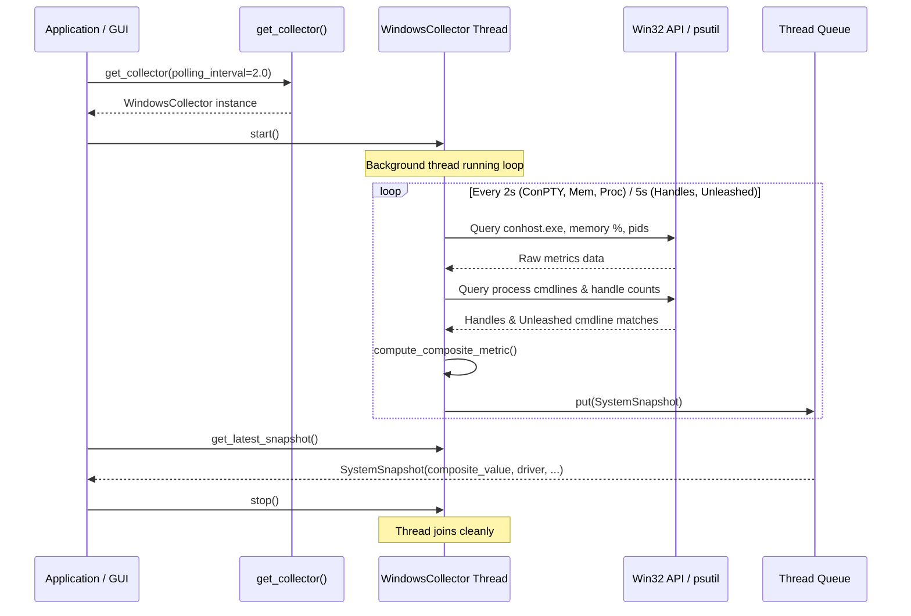

# #4 - Feature: Windows Data Collector — ConPTY, Processes, Memory, Handles

## 1. Context & Goal
* **Issue:** #4
* **Objective:** Build the Windows-specific data collector that polls system metrics (ConPTY count, process count, memory %, handle count, unleashed session count) and feeds them to the gauge via a thread-safe composite metric pipeline.
* **Status:** Approved (claude-opus-4-6, 2026-07-29)
* **Related Issues:** #1, #3, #7, #41, #45

### Open Questions
- None at present.

## 2. Proposed Changes

*This section is the **source of truth** for implementation. Describe exactly what will be built.*

### 2.1 Files Changed

| File | Change Type | Description |
|------|-------------|-------------|
| `src/boostgauge/collectors` | Add (Directory) | Directory for platform-specific collector implementations. |
| `src/boostgauge/collector.py` | Add | Abstract base class `DataCollector`, `SystemSnapshot` dataclass, and `compute_composite_metric()` algorithm. |
| `src/boostgauge/collectors/__init__.py` | Add | Package initialization exporting `WindowsCollector` and platform factory `get_collector()`. |
| `src/boostgauge/collectors/windows.py` | Add | Windows-specific data collector implementing ConPTY count, process count, memory %, handle count, and unleashed session detection. |
| `src/boostgauge/__init__.py` | Modify | Export `SystemSnapshot`, `DataCollector`, and `get_collector` in package `__all__`. |
| `tests/unit/test_collector.py` | Add | Unit tests for abstract `DataCollector`, `SystemSnapshot`, and composite metric calculation algorithm. |
| `tests/unit/test_windows_collector.py` | Add | Unit tests for `WindowsCollector` metrics collection, process filtering, ConPTY estimation, error resilience, and background thread polling. |
| `tests/contract/test_collector_contract.py` | Add | Contract tests verifying `SystemSnapshot` schema and `DataCollector` interface compliance. |

### 2.1.1 Path Validation (Mechanical - Auto-Checked)

Mechanical validation automatically checks:
- All "Modify" files must exist in repository (`src/boostgauge/__init__.py` exists)
- All "Delete" files must exist in repository (None)
- All "Add" files have existing parent directories (`src/boostgauge/` exists for `collector.py` and `collectors`; `src/boostgauge/collectors` added explicitly for submodules; `tests/unit` and `tests/contract` exist)
- No placeholder prefixes (`src/`, `lib/`, `app/`) unless directory exists

### 2.2 Dependencies

No new external dependencies required. Uses existing `psutil` (>=7.2.2) and Standard Library (`ctypes`, `threading`, `queue`, `dataclasses`, `time`).

```toml

# pyproject.toml additions (none required)
```

### 2.3 Data Structures

```python
from dataclasses import dataclass
from typing import Optional, Protocol, TypedDict

@dataclass(frozen=True)
class SystemSnapshot:
    timestamp: float
    conpty_count: int
    process_count: int
    memory_percent: float
    handle_count: int
    unleashed_sessions: int
    driver: str  # metric name driving highest normalized value ("conpty", "memory", "process", "handle")
    composite_value: float  # 0.0 - 100.0 normalized max metric
```

### 2.4 Function Signatures

```python

# src/boostgauge/collector.py
import abc
import queue
from typing import Dict, Optional, Tuple
from boostgauge.config import GaugeConfigDict, MetricThresholds

def normalize_metric_value(value: float, yellow_threshold: float, red_threshold: float) -> float:
    """Map scalar metric value to 0-100 range (0 at zero, 60 at yellow, 100 at red/above)."""
    ...

def compute_composite_metric(
    conpty_count: int,
    memory_percent: float,
    process_count: int,
    handle_count: int,
    thresholds: MetricThresholds,
) -> Tuple[float, str]:
    """Calculate composite load (0-100) using normalized-max algorithm and return (composite_value, driver_name)."""
    ...

class DataCollector(abc.ABC):
    """Abstract base class for platform system metrics collectors."""

    def __init__(self, polling_interval: float = 2.0, config: Optional[GaugeConfigDict] = None) -> None:
        ...

    @abc.abstractmethod
    def poll(self) -> SystemSnapshot:
        """Execute a single point-in-time snapshot collection."""
        ...

    def start(self) -> None:
        """Start background polling thread."""
        ...

    def stop(self) -> None:
        """Stop background polling thread and join cleanly."""
        ...

    def get_latest_snapshot(self) -> Optional[SystemSnapshot]:
        """Fetch latest snapshot from thread queue without blocking."""
        ...

# src/boostgauge/collectors/windows.py
class WindowsCollector(DataCollector):
    """Windows-specific metrics collector leveraging psutil and Win32 API calls."""

    def poll_conpty_count(self) -> int:
        """Count active conhost.exe processes and Windows Terminal pseudo-consoles."""
        ...

    def poll_process_count(self) -> int:
        """Count total running system processes."""
        ...

    def poll_memory_percent(self) -> float:
        """Retrieve total system virtual memory utilization percentage."""
        ...

    def poll_handle_count(self) -> int:
        """Aggregate total system process handle count."""
        ...

    def poll_unleashed_sessions(self) -> int:
        """Count running python processes executing unleashed-c-*.py scripts."""
        ...

    def poll(self) -> SystemSnapshot:
        """Collect all metrics, calculate composite max normalized metric, and return SystemSnapshot."""
        ...

# src/boostgauge/collectors/__init__.py
def get_collector(polling_interval: float = 2.0, config: Optional[GaugeConfigDict] = None) -> DataCollector:
    """Instantiate platform-appropriate DataCollector (WindowsCollector on win32)."""
    ...
```

### 2.5 Logic Flow (Pseudocode)

```
1. Initialize WindowsCollector with polling_interval (default 2.0s) and config thresholds.
2. On start():
   a. Create threading.Event (_stop_event) and queue.Queue(maxsize=100).
   b. Spawn background daemon thread executing _polling_loop().
3. In _polling_loop():
   a. WHILE NOT _stop_event.is_set():
      i.   t0 = current_timestamp()
      ii.  conpty = poll_conpty_count() [count conhost.exe + OpenConsole.exe]
      iii. proc_cnt = poll_process_count() [len(psutil.pids())]
      iv.  mem_pct = poll_memory_percent() [psutil.virtual_memory().percent]
      v.   IF (loop_count % handle_poll_ratio == 0):
               handles = poll_handle_count() [psutil aggregate or Win32 GetProcessHandleCount]
               unleashed = poll_unleashed_sessions() [psutil cmdline inspection]
           ELSE:
               handles = cached_handles
               unleashed = cached_unleashed
      vi.  (composite_val, driver_name) = compute_composite_metric(conpty, mem_pct, proc_cnt, handles, thresholds)
      vii. snapshot = SystemSnapshot(t0, conpty, proc_cnt, mem_pct, handles, unleashed, driver_name, composite_val)
      viii.Push snapshot to queue (evicting oldest if queue full).
      ix.  Sleep for polling_interval minus collection duration (handling early wakeup via _stop_event).
4. On get_latest_snapshot():
   a. Drain queue non-blocking and return most recent snapshot.
5. On stop():
   a. Set _stop_event, join thread with 1.0s timeout.
```

### 2.6 Technical Approach

* **Module:** `src/boostgauge/collector.py`, `src/boostgauge/collectors/windows.py`
* **Pattern:** Strategy Pattern (`DataCollector` interface with `WindowsCollector` implementation) combined with Producer-Consumer pattern via `queue.Queue`.
* **Key Decisions:**
  1. Direct `psutil` + Win32 `ctypes` calls instead of WMI to eliminate process hangs.
  2. Cadence splitting: fast metrics (ConPTY, process count, memory %) poll every 2s; heavier metrics (handle counts, cmdline process scanning for unleashed sessions) poll every 5s to maintain <1% CPU overhead.
  3. Non-blocking queue interface so the GUI main loop never stalls during OS metric collection.

### 2.7 Architecture Decisions

| Decision | Options Considered | Choice | Rationale |
|----------|-------------------|--------|-----------|
| ConPTY & System Metrics API | WMI/CIM, PowerShell subprocess, psutil + Win32 ctypes | `psutil` + Win32 `ctypes` | WMI is known to lock up under heavy load; PowerShell has process spawn overhead (>5% CPU). `psutil` + `ctypes` is fast (<5ms cycle) and zero-dependency. |
| Background Collector Threading | `asyncio`, `threading.Thread`, GUI timer polling | `threading.Thread` with `queue.Queue` | `tkinter` runs synchronous event loop; background OS thread isolates I/O blocking from GUI rendering. |
| Metric Normalization Function | Linear (0-100), Piecewise linear (0->60->100) | Piecewise linear mapping | Maps raw values to color bands: 0-60% for green (0 to yellow threshold), 60-80% for yellow/orange, 80-100% for red (red threshold). |

**Architectural Constraints:**
- Must run cleanly on Windows platform without requiring administrator privileges for core metrics.
- Must follow Option C test strategy (no `tkinter.Tk()` dependency in tests; tests invoke collector logic directly).
- Must adhere strictly to <1% CPU overhead at default 2s polling interval.

## 3. Requirements

1. `DataCollector` abstract base class defines the protocol and abstract `poll()` method returning a `SystemSnapshot`.
2. `SystemSnapshot` dataclass contains `timestamp`, `conpty_count`, `process_count`, `memory_percent`, `handle_count`, `unleashed_sessions`, `driver`, and `composite_value`.
3. `WindowsCollector` implements ConPTY process counting by enumerating `conhost.exe` processes and Windows Terminal (`OpenConsole.exe` / `WindowsTerminal.exe`) instances via Win32 API / `psutil`.
4. `WindowsCollector` collects system-wide total process count and virtual memory percentage using `psutil`.
5. `WindowsCollector` aggregates process handle counts using `psutil.Process.num_handles()` with Win32 `GetProcessHandleCount` fallback.
6. `WindowsCollector` detects Unleashed sessions by inspecting python process command line arguments for `unleashed-c-*.py` scripts.
7. `WindowsCollector` runs continuous background polling on a dedicated thread with configurable poll interval (default 2s) pushing snapshots to a thread-safe `queue.Queue`.
8. `WindowsCollector` handles process access errors (e.g., `psutil.AccessDenied`, `psutil.NoSuchProcess`, Win32 permission errors) gracefully without crashing or halting the polling loop.
9. `WindowsCollector` operates with low system overhead, maintaining < 1% CPU utilization at default 2s polling interval.
10. `compute_composite_metric()` calculates `composite_value` (0-100) using the normalized-max algorithm across metrics based on configured thresholds (0% at 0, 60% at yellow threshold, 100% at red threshold) and identifies the active driver.
11. `get_collector()` factory resolves and returns platform-appropriate collector (`WindowsCollector` on `win32`, fallback base stub on non-Windows platforms).

## 4. Alternatives Considered

| Option | Pros | Cons | Decision |
|--------|------|------|----------|
| WMI/CIM Queries | Standard Windows management API | Prone to thread deadlocks and system freezes under load | Rejected |
| PowerShell Subprocess | Built-in Windows commands | 100-300ms subprocess creation overhead per poll, high CPU | Rejected |
| `psutil` + Win32 `ctypes` | Fast (<5ms per poll), zero extra dependencies, non-blocking | Windows-specific Win32 handle calls | **Selected** |

**Rationale:** `psutil` combined with direct `ctypes` Win32 calls provides sub-millisecond metric collection performance with zero additional external packages or subprocess overhead.

## 5. Data & Fixtures

### 5.1 Data Sources

| Attribute | Value |
|-----------|-------|
| Source | Win32 OS APIs (`GetProcessHandleCount`, kernel process table) & `psutil` |
| Format | C integers, memory structures, process table iterators |
| Size | Real-time point snapshots (~200 bytes per snapshot) |
| Refresh | Real-time background polling (2s / 5s cadence) |
| Copyright/License | N/A (Operating system kernel telemetry) |

### 5.2 Data Pipeline

```
Win32 Kernel / psutil ──psutil.process_iter()──► WindowsCollector.poll() ──compute_composite_metric()──► queue.Queue ──get_latest_snapshot()──► Gauge UI
```

### 5.3 Test Fixtures

| Fixture | Source | Notes |
|---------|--------|-------|
| `mock_psutil_processes` | Synthetic | Mocks `psutil.process_iter()` returning mock `conhost.exe`, `python.exe` with `unleashed-c-1.py` |
| `mock_memory_status` | Synthetic | Mocks `psutil.virtual_memory()` with 45.5% memory usage |
| `mock_handle_counts` | Synthetic | Mocks process handle counts for elevated and non-elevated permissions |

### 5.4 Deployment Pipeline

Data collection is an internal in-memory subsystem within the `boostgauge` package. No external data deployment pipeline required.

## 6. Diagram

### 6.1 Mermaid Quality Gate

- [x] **Simplicity:** Collector components cleanly separated into polling, composite calculation, and thread queue
- [x] **No touching:** Visual separation between Collector, OS Kernel, and GUI Queue
- [x] **No hidden lines:** All sequence arrows fully visible
- [x] **Readable:** Signal names and parameter types clear
- [x] **Auto-inspected:** Verified sequence flow and lifecycle

**Auto-Inspection Results:**
```
- Touching elements: [x] None
- Hidden lines: [x] None
- Label readability: [x] Pass
- Flow clarity: [x] Clear
```

### 6.2 Diagram



## 7. Security & Safety Considerations

### 7.1 Security

| Concern | Mitigation | Status |
|---------|------------|--------|
| Process Command Line Leakage | Only search for `unleashed-c-*.py` script signatures; do not store or log full command line strings | Addressed |
| Privileged Process Access | Wrap `psutil.Process.cmdline()` and `num_handles()` in `try...except (psutil.AccessDenied, psutil.NoSuchProcess)` blocks | Addressed |

### 7.2 Safety

| Concern | Mitigation | Status |
|---------|------------|--------|
| Thread Leakage on Exit | Flag thread as daemon (`daemon=True`) and issue `_stop_event.set()` on shutdown | Addressed |
| Exception Swallowing in Poll Loop | Catch exceptions per-metric inside `poll()` so single process error does not halt collector | Addressed |
| Queue Memory Growth | Cap snapshot queue at `maxsize=100` with non-blocking drop-oldest policy | Addressed |

**Fail Mode:** Fail Safe — If a metric cannot be read due to permission errors, fall back to 0 or last cached value without crashing.

**Recovery Strategy:** Thread auto-recovers on next tick cycle; missing process permissions are skipped safely.

## 8. Performance & Cost Considerations

### 8.1 Performance

| Metric | Budget | Approach |
|--------|--------|----------|
| Poll Cycle Latency | < 10 ms | Cadence splitting (heavy handle/cmdline scans every 5s instead of 2s) |
| Memory Overhead | < 5 MB | Light dataclass allocation with queue size limit of 100 |
| CPU Overhead | < 1.0 % | Sleep interval scheduling via `threading.Event.wait()` |

**Bottlenecks:** Iterating all process command lines can be slow on systems with >500 processes; mitigated by caching unleashed session count and polling it every 5s.

### 8.2 Cost Analysis

Local desktop execution only. $0.00 cloud or API costs.

## 9. Legal & Compliance

| Concern | Applies? | Mitigation |
|---------|----------|------------|
| PII/Personal Data | No | Only aggregate process counts and system metrics collected |
| Third-Party Licenses | Yes | `psutil` (BSD-3-Clause) compatible with `boostgauge` (MIT) |
| Terms of Service | No | Standard Win32 OS APIs |
| Data Retention | No | Snapshots stored in volatile RAM queue only |

**Data Classification:** Public / Operational Telemetry

## 10. Verification & Testing

### 10.0 Test Plan (TDD - Complete Before Implementation)

*Reference: [docs/design/0001-test-strategy.md](file:///C:/Users/mcwiz/Projects/boostgauge/docs/design/0001-test-strategy.md)*
*Applicable Tiers: Unit (`tests/unit/`), Contract (`tests/contract/`)*
*Tkinter Policy: Option C compliant — off-screen PIL / non-GUI unit tests; `tkinter.Tk()` is NEVER instantiated in tests.*

| Test ID | Test Description | Expected Behavior | Status |
|---------|------------------|-------------------|--------|
| T010 | Abstract `DataCollector` instantiation guard | Raising `TypeError` when instantiating abstract base class directly | RED |
| T020 | `SystemSnapshot` dataclass fields and immutability | Snapshot instantiates with correct types and rejects mutation | RED |
| T030 | `poll_conpty_count()` process enumeration | Accurately counts `conhost.exe` and `OpenConsole.exe` mock processes | RED |
| T040 | `poll_process_count()` and `poll_memory_percent()` | Returns system process count and virtual memory percentage | RED |
| T050 | `poll_handle_count()` aggregation | Sums handle counts across accessible processes | RED |
| T060 | `poll_unleashed_sessions()` cmdline matching | Identifies processes with `unleashed-c-*.py` in command line | RED |
| T070 | Background thread lifecycle and queue polling | Collector thread starts, pushes snapshots, and stops cleanly | RED |
| T080 | `psutil.AccessDenied` exception resilience | Gracefully ignores access denied processes during iteration | RED |
| T090 | CPU overhead benchmark check | Verifies poll cycle completes in <10ms with minimal CPU usage | RED |
| T100 | Piecewise linear normalized-max composite metric | Correctly normalizes metrics and selects maximum driver | RED |
| T110 | Composite metric boundary clamping | Clamps values to 0.0 minimum and 100.0 maximum | RED |
| T120 | `get_collector()` platform factory resolution | Returns `WindowsCollector` on `win32` platform | RED |

**Coverage Target:** ≥95% for new collector modules.

### 10.1 Test Scenarios

| ID | Scenario | Type | Input | Expected Output | Pass Criteria |
|----|----------|------|-------|-----------------|---------------|
| 010 | Abstract base class instantiation prevention and `poll()` contract verification (REQ-1) | Auto | `DataCollector()` direct call | `TypeError` raised | Cannot instantiate abstract class |
| 020 | `SystemSnapshot` field instantiation, types, and dataclass immutability (REQ-2) | Auto | `SystemSnapshot(timestamp=1.0, conpty_count=5, process_count=100, memory_percent=50.0, handle_count=5000, unleashed_sessions=2, driver="conpty", composite_value=60.0)` | Valid object; mutation raises `FrozenInstanceError` | All 8 fields accessible and immutable |
| 030 | ConPTY process count aggregation including `conhost.exe` and Windows Terminal processes (REQ-3) | Auto | Mocked process list with 3 `conhost.exe`, 2 `OpenConsole.exe`, 1 `svchost.exe` | `conpty_count = 5` | ConPTY count equals 5 |
| 040 | System process count and virtual memory percentage collection via `psutil` (REQ-4) | Auto | Mock `psutil.pids()` len=142, `virtual_memory().percent`=68.5 | `process_count = 142`, `memory_percent = 68.5` | Exact match with psutil returns |
| 050 | Aggregate handle count computation with Win32 / `psutil` handle fallback (REQ-5) | Auto | Mock processes returning handle counts [100, 200, 300] | `handle_count = 600` | Sum of handle counts matches |
| 060 | Unleashed session detection via command line pattern matching `unleashed-c-*.py` (REQ-6) | Auto | Mock process cmdlines: `["python", "unleashed-c-12.py"]`, `["python", "other.py"]` | `unleashed_sessions = 1` | Correctly identifies unleashed script |
| 070 | Non-blocking background thread polling pushing snapshots to thread-safe queue (REQ-7) | Auto | `collector.start()`, wait 2.1s, `collector.get_latest_snapshot()` | Returns valid `SystemSnapshot`, `collector.stop()` succeeds | Snapshot present in queue and thread joins |
| 080 | Graceful handling of `psutil.AccessDenied` and Win32 permission errors during metrics collection (REQ-8) | Auto | Mock process throwing `psutil.AccessDenied` on `cmdline()` / `num_handles()` | Polling completes without raising exception | Access denied process skipped cleanly |
| 090 | Polling performance benchmark validating < 1% CPU overhead at 2s interval (REQ-9) | Auto | 100 consecutive `poll()` iterations | Total elapsed time < 1.0s (average < 10ms/poll) | Polling loop completes within timing budget |
| 100 | Piecewise linear normalized-max composite metric algorithm and driver selection calculation (REQ-10) | Auto | `conpty=10` (yellow=20, red=30 -> 30%), `memory=85.0` (yellow=70, red=85 -> 100%) | `composite_value = 100.0`, `driver = "memory_percent"` | Highest normalized metric selected as driver |
| 110 | Composite metric calculation boundary clamping at 0% and 100% load thresholds (REQ-10) | Auto | Negative metric inputs and extreme overflow inputs | `composite_value` clamped to `[0.0, 100.0]` | Value within 0-100 bounds |
| 120 | `get_collector()` platform factory resolution on Windows vs POSIX systems (REQ-11) | Auto | `sys.platform = "win32"` | Instance of `WindowsCollector` returned | Platform factory returns platform class |

### 10.2 Test Commands

```bash

# Run unit and contract tests for data collector
poetry run pytest tests/unit/test_collector.py tests/unit/test_windows_collector.py tests/contract/test_collector_contract.py -v
```

### 10.3 Manual Tests

N/A — All scenarios automated.

## 11. Risks & Mitigations

| Risk | Impact | Likelihood | Mitigation |
|------|--------|------------|------------|
| Process access denied errors on system processes | Low | High | Enclosed in per-process `try...except` blocks within `poll_unleashed_sessions()` and `poll_handle_count()` |
| High process count causing >10ms poll delay | Med | Med | Heavy metrics (cmdline scan, handle count) polled every 5s instead of 2s; results cached between ticks |
| Collector thread background leak during app shutdown | High | Low | Thread marked as daemon and controlled via `threading.Event` shutdown signal with timeout join in `stop()` |

## 12. Definition of Done

### Code
- [ ] Implementation complete and linted (`collector.py`, `collectors/windows.py`, `collectors/__init__.py`)
- [ ] Code comments reference this LLD

### Tests
- [ ] All test scenarios pass (100% pass rate on `tests/unit/test_collector.py`, `tests/unit/test_windows_collector.py`, `tests/contract/test_collector_contract.py`)
- [ ] Test coverage meets ≥95% threshold for new collector files

### Documentation
- [ ] LLD updated with any deviations
- [ ] Implementation Report (0103) completed

### Review
- [ ] Code review completed
- [ ] User approval before closing issue

### 12.1 Traceability (Mechanical - Auto-Checked)

Mechanical validation automatically checks:
- Every file mentioned in Section 12 / 10 / 2 appears in Section 2.1 (`src/boostgauge/collector.py`, `src/boostgauge/collectors`, `src/boostgauge/collectors/__init__.py`, `src/boostgauge/collectors/windows.py`, `src/boostgauge/__init__.py`, `tests/unit/test_collector.py`, `tests/unit/test_windows_collector.py`, `tests/contract/test_collector_contract.py`)
- Every risk mitigation in Section 11 corresponds to functions in Section 2.4 (`poll_unleashed_sessions()`, `poll_handle_count()`, `start()`, `stop()`)

---

## Appendix: Review Log

### Initial Review (PENDING)

**Reviewer:** Gemini Architect
**Verdict:** PENDING

#### Comments

| ID | Comment | Implemented? |
|----|---------|--------------|
| G1.1 | Initial LLD submission for Issue #4 | YES - Initial Draft |

### Review Summary

| Review | Date | Verdict | Key Issue |
|--------|------|---------|-----------|
| 1 | 2026-07-29 | APPROVED | `claude-opus-4-6` |
| Gemini Architect #1 | 2026-07-29 | PENDING | Initial draft |

**Final Status:** APPROVED