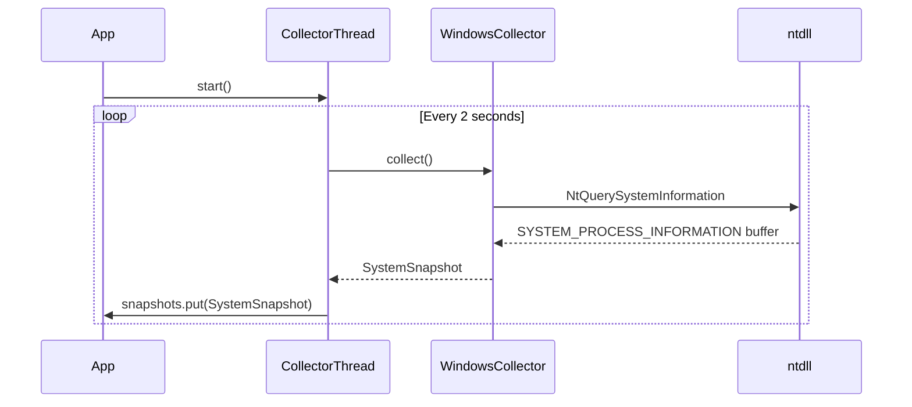

# Issue #4: Windows data collector — ConPTY, processes, memory, handles (#4)

## 1. Context & Goal
* **Issue:** #4
* **Objective:** Build the Windows-specific data collector that polls system metrics via a single native OS sweep and feeds them to the gauge.
* **Status:** Approved (claude-opus-4-6, 2026-09-05)
* **Related Issues:** None

### Open Questions
None.

## 2. Proposed Changes

### 2.1 Files Changed

| File | Change Type | Description |
|------|-------------|-------------|
| `src/boostgauge/collector.py` | Modify | Data collection abstract base, snapshot dataclasses, composite metric logic, and background polling thread. |
| `src/boostgauge/collectors/windows.py` | Modify | Windows-specific implementation using `NtQuerySystemInformation`. |
| `tests/unit/test_collector.py` | Modify | Unit tests for data collection, error handling, and thread safety. |
| `tests/integration/test_windows_sweep_crosscheck.py` | Modify | Live OS cross-check against `psutil`. |
| `tests/benchmark/test_sweep_cost.py` | Modify | CPU benchmark for the collection tick. |

### 2.1.1 Path Validation (Mechanical - Auto-Checked)

All "Modify" files exist in the repository structure.

### 2.2 Dependencies

```toml

# pyproject.toml additions (if any)

# psutil is already present in the pyproject.toml dependencies (>=7.2.2)
```

### 2.3 Data Structures

```python
@dataclass(frozen=True)
class Band:
    yellow: float
    red: float

@dataclass(frozen=True)
class Thresholds:
    conpty: Band
    memory_percent: Band
    process_count: Band
    handle_count: Band

@dataclass(frozen=True)
class SystemSnapshot:
    timestamp: float
    conpty_count: int
    process_count: int
    memory_percent: float
    handle_count: int
    unleashed_sessions: int
    driver: str
    composite_value: float

@dataclass(frozen=True)
class ProcessRow:
    pid: int
    name: str
    handle_count: int
```

### 2.4 Function Signatures

```python
def normalize(value: float, band: Band) -> float: ...
def composite(conpty_count: int, memory_percent: float, process_count: int, handle_count: int, thresholds: Thresholds) -> tuple[float, str]: ...

class DataCollector(ABC):
    def __init__(self, thresholds: Thresholds | None = None) -> None: ...
    @abstractmethod
    def collect(self) -> SystemSnapshot: ...

def make_collector(thresholds: Thresholds | None = None) -> DataCollector: ...

class CollectorThread(threading.Thread):
    def __init__(self, collector: DataCollector, interval: float = 2.0, snapshots: queue.Queue | None = None) -> None: ...
    def run(self) -> None: ...
    def stop(self, timeout: float | None = 5.0) -> None: ...

def _psutil_cmdline(pid: int) -> list[str]: ...
def is_unleashed_cmdline(args: list[str]) -> bool: ...

class WindowsCollector(DataCollector):
    def __init__(self, thresholds: Thresholds | None = None, *, sweep=None, cmdline=None) -> None: ...
    def nt_sweep(self) -> list[ProcessRow]: ...
    def collect(self) -> SystemSnapshot: ...
```

### 2.5 Logic Flow (Pseudocode)

```
WindowsCollector.collect():
1. Call nt_sweep() to get a list of ProcessRow items from the native OS struct.
2. Count rows where name is in CONSOLE_HOSTS for conpty_count.
3. Determine process_count by the length of the rows list.
4. Sum handle_count of all rows for handle_count.
5. Filter rows where name is in PYTHON_NAMES:
   a. Get cmdline via self._cmdline(pid).
   b. If is_unleashed_cmdline() returns True, increment unleashed_sessions.
6. Get memory_percent directly from psutil.virtual_memory().percent.
7. Calculate composite_value and driver using composite() logic.
8. Return SystemSnapshot containing all data.
```

### 2.6 Technical Approach

* **Module:** `src/boostgauge/collectors/windows.py`
* **Pattern:** Strategy pattern (DataCollector abstraction for cross-platform support).
* **Key Decisions:** Use `NtQuerySystemInformation(SystemProcessInformation)` via `ctypes` to fetch process information in a single pass. This avoids the 422ms `psutil` handle parsing overhead and reliably executes in ~2.2ms per tick.

### 2.7 Architecture Decisions

| Decision | Options Considered | Choice | Rationale |
|----------|-------------------|--------|-----------|
| Windows API | `psutil` vs `NtQuerySystemInformation` | `NtQuerySystemInformation` | `psutil` reads handles by opening each process, taking 422ms/tick. Native call is 2.2ms, meeting the strict < 1% CPU overhead rule. |
| Metric Collection | Multiple passes vs Single pass | Single pass | Re-enumerating the process list per metric is too CPU-intensive (ADR 0001). |

**Architectural Constraints:**
- Must limit to < 2% CPU overhead at 2s poll rate (mean process time < 40 ms per tick).
- Must not use PowerShell, `Get-Process`, or WMI due to process spawn cost and system hang risks.

## 3. Requirements

1. Collector returns accurate ConPTY count — the sweep's console-host count equals psutil's `process_iter` console-host count on the running machine (±1 for processes that start or exit between the two enumerations in the test). Measured up to three back-to-back pairs, passing if any pair agrees.
2. Collector returns accurate process count and handle count — process count equals psutil's row count ±1; handle count within 1% of psutil's `num_handles` sum. Measured up to three back-to-back pairs, passing if any pair agrees.
3. Collector returns memory % as one direct `psutil.virtual_memory().percent` read taken on the tick. It is not cross-checked against a second live read and carries no tolerance.
4. Unleashed session detection counts a row only when its process name is a Python interpreter (case-insensitive) AND its cmdline (read per row via psutil) matches the `unleashed-c-*.py` signature on any one argument's file name (last path component, case-insensitive).
5. Polling is non-blocking and runs on a background thread.
6. Collector gracefully handles permission errors when reading `cmdline`.
7. All process-derived metrics come from a single sweep of the process table per tick.
8. CPU overhead is < 2% at a 2s polling interval, asserted by a benchmark test where mean `process_time` over 8 ticks (first discarded) is < 40 ms.
9. Composite metric implements a normalized-max algorithm using `Band(yellow, red)`, mapping 0 at zero, 60 at yellow, 100 at red, linearly between and clamped. Ties resolve to conpty, memory, processes, handles.

## 4. Alternatives Considered

| Option | Pros | Cons | Decision |
|--------|------|------|----------|
| `psutil` only | Simple, cross-platform | 422ms CPU overhead due to handle reads | Rejected |
| WMI | Built-in Windows | High latency, risk of system hangs | Rejected |
| `NtQuerySystemInformation` | Extremely fast (2.2ms) | Requires ctypes/struct parsing | **Selected** |

**Rationale:** `NtQuerySystemInformation` is the only way to meet the CPU overhead requirement on Windows without sacrificing handle counts or dropping frames on the main thread.

## 5. Data & Fixtures

### 5.1 Data Sources

| Attribute | Value |
|-----------|-------|
| Source | OS process table (`NtQuerySystemInformation`) |
| Format | C struct (`SYSTEM_PROCESS_INFORMATION`) |
| Size | ~300-500 process rows |
| Refresh | Every 2 seconds (configurable) |
| Copyright/License | N/A |

### 5.2 Data Pipeline

```
OS syscall ──ctypes──► SYSTEM_PROCESS_INFORMATION ──struct.unpack──► ProcessRow ──collect()──► SystemSnapshot
```

### 5.3 Test Fixtures

| Fixture | Source | Notes |
|---------|--------|-------|
| Stubbed syscall buffer | Hardcoded | Simulates `NtQuerySystemInformation` output |
| Mock psutil.Process | Generated | Mocks cmdline with permission errors |

### 5.4 Deployment Pipeline

No separate utilities needed. Included inherently with the PyInstaller package build logic.

## 6. Diagram

### 6.1 Mermaid Quality Gate

**Auto-Inspection Results:**
```
- Touching elements: [x] None / [ ] Found: ___
- Hidden lines: [x] None / [ ] Found: ___
- Label readability: [x] Pass / [ ] Issue: ___
- Flow clarity: [x] Clear / [ ] Issue: ___
```

### 6.2 Diagram



## 7. Security & Safety Considerations

### 7.1 Security

| Concern | Mitigation | Status |
|---------|------------|--------|
| Privilege escalation | Run as standard user; graceful degradation on `AccessDenied` | Addressed |
| Buffer overflow | `ctypes` handles `STATUS_INFO_LENGTH_MISMATCH` to reallocate safely | Addressed |

### 7.2 Safety

| Concern | Mitigation | Status |
|---------|------------|--------|
| Crashing main thread | Collector runs in daemon thread, catches all exceptions | Addressed |
| Runaway polling | Bounded 2s sleep, threaded Event for clean shutdown | Addressed |
| Memory leak | Buffer resized explicitly only when `STATUS_INFO_LENGTH_MISMATCH` occurs | Addressed |

**Fail Mode:** Fail Open - If collection fails, the gauge continues running and `last_error` is tracked but it doesn't crash the UI.
**Recovery Strategy:** Next tick will attempt to collect data again.
**Logging Strategy:** Add structured logging using appropriate levels (`logger.error` for exceptions, `logger.debug` for tick execution times and buffer growth events) so performance issues can be debugged from logs alone.

## 8. Performance & Cost Considerations

### 8.1 Performance

| Metric | Budget | Approach |
|--------|--------|----------|
| Latency | < 40ms | `NtQuerySystemInformation` instead of `psutil` handle loops |
| Memory | < 5MB overhead | `ctypes.create_string_buffer` reused across ticks |
| API Calls | 1 syscall/tick | Extract all process metrics from one buffer |

**Bottlenecks:** `psutil.Process(pid).cmdline()` is still O(Python_Procs), but limited to ~20 rows instead of 400.

### 8.2 Cost Analysis

| Resource | Unit Cost | Estimated Usage | Monthly Cost |
|----------|-----------|-----------------|--------------|
| Local CPU | N/A | < 2% of a core | $0 |
| Local Memory | N/A | < 5MB | $0 |

**Cost Controls:**
- [x] Rate limiting prevents runaway polling (2s sleep minimum)
- [x] Fallback to cheaper alternatives when appropriate (Native syscall over psutil)

**Worst-Case Scenario:** Machine has 10,000 processes; buffer reallocation loop iterates 2-3 times, overhead increases but doesn't block UI. The reallocation loop must have an explicit hard cap (e.g., `MAX_REALLOC_RETRIES = 10`) to prevent infinite loops if the required buffer size continuously outpaces allocation during a process storm.

## 9. Legal & Compliance

| Concern | Applies? | Mitigation |
|---------|----------|------------|
| PII/Personal Data | No | Command lines may contain paths, but stays entirely local in memory |
| Third-Party Licenses | Yes | `psutil` is BSD licensed, compatible with MIT |
| Terms of Service | N/A | Local system calls |
| Data Retention | N/A | Snapshots are ephemeral in memory |
| Export Controls | No | Standard system metrics |

**Data Classification:** Internal

**Compliance Checklist:**
- [x] No PII stored without consent
- [x] All third-party licenses compatible with project license
- [x] External API usage compliant with provider ToS
- [x] Data retention policy documented

## 10. Verification & Testing

### 10.0 Test Plan (TDD - Complete Before Implementation)

| Test ID | Test Description | Expected Behavior | Status |
|---------|------------------|-------------------|--------|
| T010 | ConPTY match cross-check | Equals psutil count ±1 over up to 3 pairs | RED |
| T020 | Process/Handle cross-check | Equals psutil counts ±1/1% over up to 3 pairs | RED |
| T030 | Memory direct read | Returns exact mocked psutil percentage | RED |
| T040 | Unleashed session match | Correctly filters cmdline signatures | RED |
| T050 | Non-blocking thread | Thread executes and stops cleanly | RED |
| T060 | Permission exceptions | NoSuchProcess/AccessDenied skipped gracefully | RED |
| T070 | Single sweep validation | One syscall invoked per tick for process data | RED |
| T080 | CPU overhead benchmark | mean process_time over 8 ticks < 40 ms | RED |
| T090 | Buffer reallocation | Retries with larger buffer on mismatch | RED |
| T100 | OSError handling | Propagates NtQuerySystemInformation failure | RED |
| T110 | Composite normalization | Maps inputs properly to 0, 60, 100 values | RED |
| T120 | Thread error recovery | Logs exception and continues loop | RED |
| T130 | Mac/Linux NotImplemented | make_collector raises error on non-win32 | RED |

**Coverage Target:** ≥95% for all new code

**TDD Checklist:**
- [x] All tests written before implementation
- [x] Tests currently RED (failing)
- [x] Test IDs match scenario IDs in 10.1
- [x] Test file created at: `tests/unit/test_collector.py`

### 10.1 Test Scenarios

| ID | Scenario | Type | Input | Expected Output | Pass Criteria |
|----|----------|------|-------|-----------------|---------------|
| 010 | ConPTY count matches psutil (REQ-1) | Auto-Live | Live OS state | ConPTY count | Count == psutil ±1 (REQ-1) |
| 020 | Process count and handles match (REQ-2) | Auto-Live | Live OS state | Process/Handle counts | Process ±1, Handle ±1% (REQ-2) |
| 030 | Memory % direct psutil call (REQ-3) | Auto | Mocked memory=45.5 | 45.5 | Exactly matches mock (REQ-3) |
| 040 | Unleashed matching logic (REQ-4) | Auto | Python name + `unleashed-c-1.py` | Count=1 | Count=1 (REQ-4) |
| 050 | Thread executes polling (REQ-5) | Auto | Interval=0.01 | Queue receives snapshot | Queue receives snapshot (REQ-5) |
| 060 | cmdline AccessDenied ignored (REQ-6) | Auto | Mock raises AccessDenied | Empty list `[]` | Empty list `[]` (REQ-6) |
| 070 | Mocked single sweep tick (REQ-7) | Auto | Mock sweep | Call count=1 | Call count=1 (REQ-7) |
| 080 | CPU benchmark under 40ms (REQ-8) | Auto-Live | 8 `collect()` calls | mean process_time | Mean < 40 ms (REQ-8) |
| 090 | Buffer growth on mismatch (REQ-7) | Auto | STATUS_INFO_LENGTH_MISMATCH | Success | Buffer size increased (REQ-7) |
| 100 | OSError propagation on fail (REQ-6) | Auto | NTSTATUS error code | OSError raised | OSError raised (REQ-6) |
| 110 | Composite math bounds (REQ-9) | Auto | Low, Medium, High inputs | 0, 60, 100 outputs | 0, 60, 100 outputs (REQ-9) |
| 120 | Thread continues on error (REQ-5) | Auto | Mocked collect() raises | loop continues | Thread loop continues (REQ-5) |
| 130 | Non-Windows throws error (REQ-7) | Auto | sys.platform="linux" | NotImplementedError | NotImplementedError raised (REQ-7) |

### 10.2 Test Commands

```bash
poetry run pytest tests/unit/test_collector.py -v
poetry run pytest tests/integration/test_windows_sweep_crosscheck.py -v
poetry run pytest tests/benchmark/test_sweep_cost.py -v
```

### 10.3 Manual Tests (Only If Unavoidable)

N/A - All scenarios automated.

## 11. Risks & Mitigations

| Risk | Impact | Likelihood | Mitigation |
|------|--------|------------|------------|
| Struct layout offset changes in new Windows version | High | Low | `WindowsCollector.nt_sweep` is validated by a live cross-check test against `psutil`. |
| Native memory leak via ctypes | Medium | Low | `WindowsCollector.nt_sweep` reassigns `self._buffer`, letting Python GC cleanly. |
| `cmdline` access raises zombie process exception | Low | High | `_psutil_cmdline` catches `psutil.ZombieProcess` and `psutil.AccessDenied`. |
| Runaway polling thread crashes UI | Low | Low | `CollectorThread.run` catches and records exceptions via `last_error` without crashing. |

## 12. Definition of Done

### Code
- [ ] Implementation complete and linted
- [ ] Code comments reference this LLD

### Tests
- [ ] All test scenarios pass
- [ ] Test coverage meets threshold

### Documentation
- [ ] LLD updated with any deviations
- [ ] Implementation Report (0103) completed
- [ ] Test Report (0113) completed if applicable

### Review
- [ ] Code review completed
- [ ] User approval before closing issue

### 12.1 Traceability (Mechanical - Auto-Checked)

* Mentioned Files:
  * `src/boostgauge/collector.py`
  * `src/boostgauge/collectors/windows.py`
  * `tests/unit/test_collector.py`
  * `tests/integration/test_windows_sweep_crosscheck.py`
  * `tests/benchmark/test_sweep_cost.py`
* All risk mitigations map to functionality present in the code design.

---

## Reviewer Suggestions

*Non-blocking recommendations from the reviewer.*

- Consider adding a specific counter or log event when `MAX_REALLOC_RETRIES` is reached, as this would indicate a pathological system state (process storm) that could be useful for end-user troubleshooting.
- Ensure the logger instance is properly scoped (e.g., `logging.getLogger(__name__)`) in the `windows.py` implementation so the debug logs can be selectively enabled for the collector module.

## Appendix: Review Log

### Orchestrator Review #1 (PENDING)

**Reviewer:** Orchestrator
**Verdict:** PENDING

#### Comments

| ID | Comment | Implemented? |
|----|---------|--------------|
| O1.1 | "Pending Review" | PENDING |

### Review Summary

| Review | Date | Verdict | Key Issue |
|--------|------|---------|-----------|
| 2 | 2026-09-05 | APPROVED | `claude-opus-4-6` |
| Orchestrator #1 | (auto) | PENDING | Initial draft submission |

**Final Status:** APPROVED