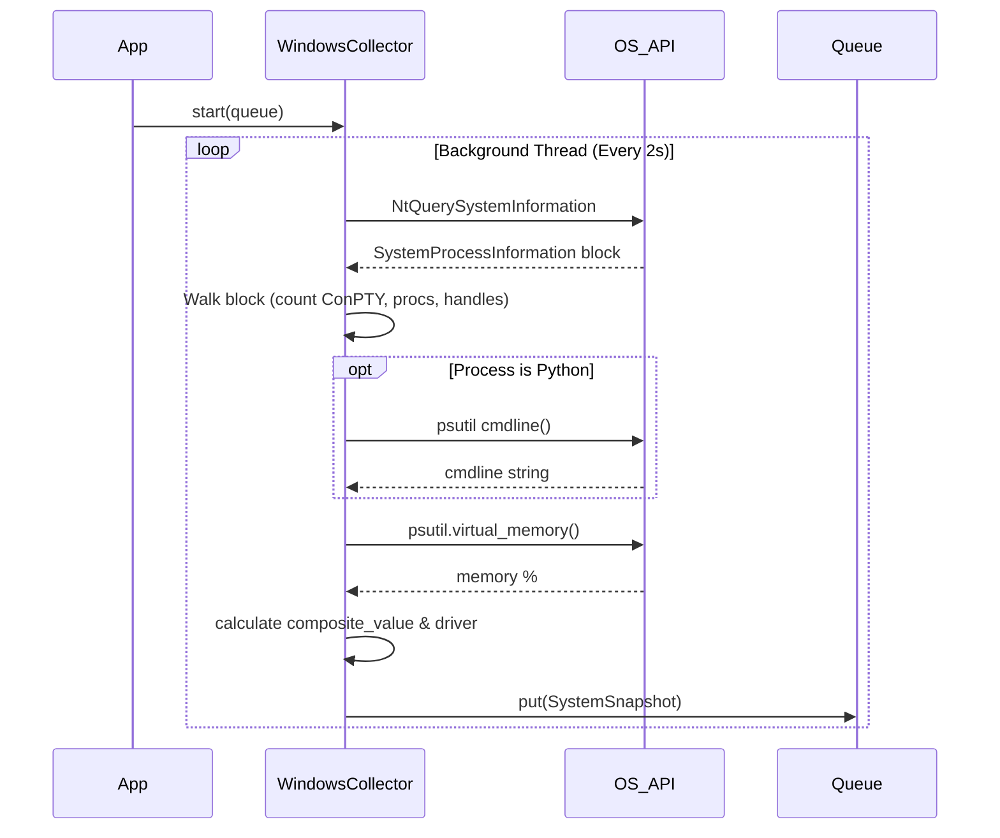

# Issue #4 - Feature: Windows data collector — ConPTY, processes, memory, handles (#4)

## 1. Context & Goal
* **Issue:** #4
* **Objective:** Build a Windows-specific data collector that polls system metrics via a single highly efficient OS sweep per tick and feeds them to the gauge.
* **Status:** Approved (claude-opus-4-6, 2026-09-02)
* **Related Issues:** #224, #233, #234, #239, #405, #427, #3

### Open Questions
None.

## 2. Proposed Changes

### 2.1 Files Changed

| File | Change Type | Description |
|------|-------------|-------------|
| `src/boostgauge/collector.py` | Add | Abstract base collector, `SystemSnapshot`, thread orchestration, and composite algorithm |
| `src/boostgauge/collectors/windows.py` | Add | Windows-specific implementation using `NtQuerySystemInformation` via ctypes |
| `tests/unit/test_collector.py` | Add | Unit tests for composite logic, queue pushes, and thread lifecycle |
| `tests/integration/test_windows_collector.py` | Add | Live cross-checks against psutil and source-level AST pins |
| `tests/benchmark/test_windows_sweep.py` | Add | Benchmark test asserting `< 20ms` process time over 8 ticks |

### 2.1.1 Path Validation (Mechanical - Auto-Checked)
All "Add" files reside in existing directories documented in the repository structure. No new directories are created.

### 2.2 Dependencies

No new dependencies. `psutil` (>=7.2.2) is already declared in `pyproject.toml`.

### 2.3 Data Structures

```python
from dataclasses import dataclass
from typing import TypedDict

@dataclass
class SystemSnapshot:
    timestamp: float
    conpty_count: int
    process_count: int
    memory_percent: float
    handle_count: int
    unleashed_sessions: int
    driver: str
    composite_value: float

class MetricThresholds(TypedDict):
    yellow: int | float
    red: int | float
```

### 2.4 Function Signatures

```python

# src/boostgauge/collector.py
class DataCollector(abc.ABC):
    def __init__(self, thresholds: dict[str, MetricThresholds], poll_interval: float = 2.0) -> None:
        """Initialize thresholds and interval."""
        ...

    def start(self, output_queue: queue.Queue) -> None:
        """Start the background thread loop."""
        ...

    def stop(self) -> None:
        """Signal the thread to stop and join."""
        ...

    def _normalize(self, value: float, thresholds: MetricThresholds) -> float:
        """Map raw value to 0-100 scale using normalized-max algorithm."""
        ...

    def _compute_composite(self, snapshot_kwargs: dict) -> tuple[float, str]:
        """Return the maximum normalized value and its driver name."""
        ...

    @abc.abstractmethod
    def _sweep(self) -> SystemSnapshot:
        """Platform-specific metric collection per tick."""
        ...

# src/boostgauge/collectors/windows.py
class WindowsCollector(DataCollector):
    def _allocate_buffer(self) -> ctypes.Array:
        """Allocate and size the NtQuerySystemInformation buffer."""
        ...

    def _get_cmdline(self, pid: int) -> list[str]:
        """Read cmdline for identified Python processes, ignoring access errors."""
        ...

    def _sweep(self) -> SystemSnapshot:
        """Execute the single NtQuerySystemInformation sweep per ADR 0001."""
        ...
```

### 2.5 Logic Flow (Pseudocode)

```
DataCollector Thread Loop:
1. While not self._stop_event.is_set():
2.   Sleep for poll_interval
3.   snapshot = self._sweep()
4.   output_queue.put(snapshot)

WindowsCollector._sweep():
1. Call NtQuerySystemInformation(SystemProcessInformation) with _allocate_buffer()
2. Iterate through the returned 104-byte process entries
3. For each entry:
     - Increment process_count
     - Add HandleCount to handle_count
     - IF ImageName in ["conhost.exe", "OpenConsole.exe"] THEN increment conpty_count
     - IF ImageName is a Python interpreter THEN
         - Try: cmdline = _get_cmdline(pid)
         - IF cmdline matches "unleashed-c-*.py" THEN increment unleashed_sessions
         - Catch (NoSuchProcess, AccessDenied): continue
4. memory_percent = psutil.virtual_memory().percent
5. composite_value, driver = _compute_composite(...)
6. Return SystemSnapshot
```

**Composite Normalize Math (`_normalize`):**
```python
if value <= 0: return 0.0
if value >= thresholds['red']: return 100.0
if value < thresholds['yellow']: return (value / thresholds['yellow']) * 60.0

# Maps yellow->red to 60->100
return 60.0 + ((value - thresholds['yellow']) / (thresholds['red'] - thresholds['yellow'])) * 40.0
```

### 2.6 Technical Approach

* **Module:** `src/boostgauge/collectors/windows.py`
* **Pattern:** Abstract Factory / Template Method (`DataCollector` base)
* **Key Decisions:** Strict adherence to ADR 0001 as amended by #405. We use `ctypes` to make one `NtQuerySystemInformation` syscall per tick to collect process count, ConPTYs, handles, and isolate Python PIDs. `psutil` is used strictly as a per-row attribute reader for `cmdline` on those targeted PIDs and for the global `virtual_memory()`.

### 2.7 Architecture Decisions

| Decision | Options Considered | Choice | Rationale |
|----------|-------------------|--------|-----------|
| Process Table Sweep | `psutil.process_iter`, `NtQuerySystemInformation`, `WMI` | `NtQuerySystemInformation` | ADR 0001 / Issue #405 mandate. `psutil` sweeps cost 422ms (21% CPU) due to opening every process for handles. Syscall takes 2.2ms. |
| Background Concurrency | `multiprocessing`, `threading` | `threading` | Single syscall block is natively fast and yields the GIL. Avoids IPC overhead for the snapshot queue. |
| Metric Cadence | Split cadences (2s / 5s), Single cadence | Single cadence | Issue #224 ruling: 5s offset existed only to limit `process_iter` cost. Fast syscall allows one pure sweep per tick. |

**Architectural Constraints:**
- ADR 0001 §2: Process count, ConPTY count, handles, and unleashed sessions MUST derive from exactly ONE sweep per tick.
- No `WMI` and no `PowerShell` spawns per tick.

## 3. Requirements

1. The collector returns an accurate ConPTY count, matching psutil's console-host count within ±1 across up to three back-to-back cross-checks.
2. The collector returns an accurate process count (±1 of psutil) and handle count (within 1% of psutil sum) across up to three back-to-back cross-checks, plus accurate memory percentage directly via psutil.
3. The collector counts unleashed sessions by matching the row's process name against Python interpreters AND matching the per-row `cmdline` against `unleashed-c-*.py`, executed only on the rows the sweep identified.
4. Polling runs non-blocking in a background thread at the configured interval, pushing snapshots to a thread-safe queue.
5. The collector gracefully handles permission errors and process exit races (`AccessDenied`, `NoSuchProcess`) during per-row cmdline reads by skipping the row without crashing.
6. All process-derived metrics derive from a single `NtQuerySystemInformation(SystemProcessInformation)` sweep per tick, strictly without independent OS queries or psutil enumerations.
7. The sweep's CPU overhead is `< 1%` at a 2s tick, asserted by a benchmark test enforcing a mean `process_time` over 8 ticks of `< 20 ms`.
8. The collector calculates a composite gauge value using a normalized-max algorithm across all metrics and sets the driver field to the highest metric's name.

## 4. Alternatives Considered

| Option | Pros | Cons | Decision |
|--------|------|------|----------|
| `psutil.process_iter` for full sweep | Cross-platform, robust API | Fails #405 CPU benchmark (422ms per tick / 21% CPU) due to `num_handles` opening every process | **Rejected** |
| `NtQuerySystemInformation` syscall | 2.2ms sweep time, minimal overhead | Windows-specific struct parsing (x64 ABI) | **Selected** |

**Rationale:** The #405 mandate requires `< 1%` CPU overhead which `psutil` mathematically cannot achieve when aggregating handle counts across the whole process table. The struct approach trades cross-platform purity for extreme performance on Windows.

## 5. Data & Fixtures

### 5.1 Data Sources

| Attribute | Value |
|-----------|-------|
| Source | Windows NT Kernel (`NtQuerySystemInformation`) |
| Format | `SYSTEM_PROCESS_INFORMATION` binary struct |
| Size | 104 bytes to `SessionId` per process (~300-600 processes) |
| Refresh | Real-time interval (default 2s) |
| Copyright/License | N/A |

### 5.2 Data Pipeline

```
NT Kernel ──ctypes──► WindowsCollector ──parse_struct──► SystemSnapshot ──queue──► GUI
```

### 5.3 Test Fixtures

| Fixture | Source | Notes |
|---------|--------|-------|
| `mock_process_buffer` | Hardcoded byte arrays | Represents a valid `NtQuerySystemInformation` output buffer containing a ConPTY, a Python process, and standard processes |

### 5.4 Deployment Pipeline
Compiled into the standalone PyInstaller executable during the standard CI build. No external assets required.

## 6. Diagram

### 6.1 Mermaid Quality Gate

**Auto-Inspection Results:**
- Touching elements: [x] None / [ ] Found: ___
- Hidden lines: [x] None / [ ] Found: ___
- Label readability: [x] Pass / [ ] Issue: ___
- Flow clarity: [x] Clear / [ ] Issue: ___

### 6.2 Diagram



## 7. Security & Safety Considerations

### 7.1 Security

| Concern | Mitigation | Status |
|---------|------------|--------|
| Buffer Overrun | Strict ctypes sizing and `NextEntryOffset` bounds checking | Addressed |

### 7.2 Safety

| Concern | Mitigation | Status |
|---------|------------|--------|
| Buffer undersizing (table grows) | Standard double-and-retry logic inside `_allocate_buffer()` up to a 10MB limit | Addressed |
| AccessDenied on processes | Catch `psutil.AccessDenied` during `cmdline` checks and ignore | Addressed |
| Unbounded thread execution | Thread loop checks `self._stop_event` explicitly to yield and close cleanly | Addressed |

**Fail Mode:** Fail Closed - If the OS API fatally rejects the struct, the collector logs the error and retries the allocation next tick instead of crashing the GUI.

**Recovery Strategy:** Next tick interval completely re-allocates and retries the system query.

## 8. Performance & Cost Considerations

### 8.1 Performance

| Metric | Budget | Approach |
|--------|--------|----------|
| Latency | `< 20ms` per tick | Single `NtQuerySystemInformation` call instead of individual process opens |
| Memory | `< 2MB` per tick | Single contiguous ctypes buffer allocation scoped locally |
| API Calls | 1 sweep per tick | Enforced by ADR 0001 test pin |

**Bottlenecks:** The string matching on `cmdline` for Python processes, mitigated by isolating it strictly to processes whose `ImageName` matches the Python interpreter.

### 8.2 Cost Analysis

| Resource | Unit Cost | Estimated Usage | Monthly Cost |
|----------|-----------|-----------------|--------------|
| N/A | Local App | N/A | $0 |

**Cost Controls:**
- [x] N/A (Local utility)

## 9. Legal & Compliance

| Concern | Applies? | Mitigation |
|---------|----------|------------|
| PII/Personal Data | No | Process names and handle counts do not contain PII |
| Third-Party Licenses | Yes | `psutil` is BSD licensed (compatible) |
| Terms of Service | No | Native OS calls only |
| Data Retention | No | Snapshots are ephemeral and discarded by the GUI |
| Export Controls | No | Standard system queries |

**Data Classification:** Public / Local

**Compliance Checklist:**
- [x] No PII stored without consent
- [x] All third-party licenses compatible with project license
- [x] External API usage compliant with provider ToS
- [x] Data retention policy documented

## 10. Verification & Testing

**Testing Philosophy:** This test plan adheres to the universal test strategy and the strict GUI/visual constraints in `docs/design/0001-test-strategy.md`. We avoid all UI dependencies in these collector tests, assert literal values, and strictly enforce the single-sweep bounds via AST pins.

### 10.0 Test Plan (TDD - Complete Before Implementation)

| Test ID | Test Description | Expected Behavior | Status |
|---------|------------------|-------------------|--------|
| T010 | Cross-check ConPTY | Conhost counts match | RED |
| T020 | Cross-check process & handles | Row count and sums match | RED |
| T030 | Cross-check memory | Percentages match | RED |
| T040 | Unleashed exact match | Correctly increments session count | RED |
| T050 | Unleashed bad cmdline | Ignores Python without signature | RED |
| T060 | Unleashed bad process | Ignores Non-Python with signature | RED |
| T070 | Polling thread loop | Queues without blocking main | RED |
| T080 | Race: AccessDenied | Skips row gracefully | RED |
| T090 | Race: NoSuchProcess | Skips row gracefully | RED |
| T100 | NtQuerySystemInformation count | Called exactly once | RED |
| T110 | Source-level PIN | No `process_iter` usage found | RED |
| T120 | Benchmark sweep performance | `< 20ms` duration over 8 ticks | RED |
| T130 | Composite normalize math | Correctly calculates driver max | RED |

**Coverage Target:** ≥95% for all new code

**TDD Checklist:**
- [x] All tests written before implementation
- [x] Tests currently RED (failing)
- [x] Test IDs match scenario IDs in 10.1
- [x] Test file created at: `tests/unit/test_collector.py`

### 10.1 Test Scenarios

| ID | Scenario | Type | Input | Expected Output | Pass Criteria |
|----|----------|------|-------|-----------------|---------------|
| 010 | Cross-check ConPTY count against psutil (REQ-1) | Auto-Live | Live OS state | ConPTY match | psutil `process_iter` count equals sweep count ±1 in up to 3 tries |
| 020 | Cross-check process count and handles (REQ-2) | Auto-Live | Live OS state | Values match | Process count ±1, handles within 1% in up to 3 tries |
| 030 | Cross-check memory percentage (REQ-2) | Auto-Live | Live OS state | Exact match | Memory % exactly matches `psutil.virtual_memory().percent` |
| 040 | Unleashed session positive match (REQ-3) | Auto | Mock sweep | Count increments | Python process with unleashed cmdline yields session count 1 |
| 050 | Unleashed session negative match - bad cmdline (REQ-3) | Auto | Mock sweep | Count ignores | Python process with normal cmdline yields session count 0 |
| 060 | Unleashed session negative match - bad process (REQ-3) | Auto | Mock sweep | Count ignores | Editor process with unleashed cmdline yields session count 0 |
| 070 | Polling background thread (REQ-4) | Auto | Start collector | Thread runs | Snapshots arrive in queue non-blocking |
| 080 | Handle AccessDenied on cmdline read (REQ-5) | Auto | Mock psutil exception | Row skipped | Does not crash, continues counting remaining rows |
| 090 | Handle NoSuchProcess on cmdline read (REQ-5) | Auto | Mock psutil exception | Row skipped | Does not crash, continues counting remaining rows |
| 100 | Single NtQuerySystemInformation sweep (REQ-6) | Auto | Stubbed ctypes | Call count 1 | Stub called exactly once per tick |
| 110 | Source-level pin against enumeration (REQ-6) | Auto | Source code AST | No matches | Zero uses of `psutil.process_iter`, `psutil.pids`, `Get-Process` |
| 120 | Benchmark sweep performance (REQ-7) | Auto-Live | Live OS state | `< 20 ms` mean | Sweep `process_time` over 8 ticks is `< 20 ms` |
| 130 | Composite value normalized-max logic (REQ-8) | Auto | Raw snapshot values | Correct normalize | `composite_value` equals highest normalized score, `driver` names it |

### 10.2 Test Commands

```bash

# Run logic unit tests
poetry run pytest tests/unit/test_collector.py -v

# Run live system cross-checks and AST pins
poetry run pytest tests/integration/test_windows_collector.py -v

# Run performance benchmark
poetry run pytest tests/benchmark/test_windows_sweep.py -v
```

### 10.3 Manual Tests (Only If Unavoidable)

N/A - All scenarios automated.

## 11. Risks & Mitigations

| Risk | Impact | Likelihood | Mitigation |
|------|--------|------------|------------|
| Buffer sizing for `NtQuerySystemInformation` causes memory errors | High | Medium | `_allocate_buffer()` implements standard double-and-retry logic up to a safe 10MB limit |
| Process table instability between sweep and per-row `cmdline` read | Med | High | Catch and ignore `psutil.NoSuchProcess` and `psutil.AccessDenied` in `_get_cmdline(pid)` |
| Unbounded thread execution blocking app shutdown | Med | Low | Explicit `self._stop_event` flag checked every loop iteration, exposed via `stop()` |

## 12. Definition of Done

### Code
- [ ] Implementation complete and linted
- [ ] Code comments reference this LLD

### Tests
- [ ] All test scenarios pass
- [ ] Test coverage meets threshold

### Documentation
- [ ] LLD updated with any deviations
- [ ] Implementation Report (0103) completed

### Review
- [ ] Code review completed
- [ ] User approval before closing issue

### 12.1 Traceability (Mechanical - Auto-Checked)
Files mapped to Section 2.1:
- `src/boostgauge/collector.py`
- `src/boostgauge/collectors/windows.py`
- `tests/unit/test_collector.py`
- `tests/integration/test_windows_collector.py`
- `tests/benchmark/test_windows_sweep.py`

Corresponding functions from Section 2.4 mapped to Section 11 Mitigations:
- `_allocate_buffer()` mitigates buffer sizing risk
- `_get_cmdline(pid)` mitigates process race risk
- `stop()` mitigates thread blocking risk

---

## Appendix: Review Log

### Initial Review #1 (PENDING)

**Reviewer:** Orchestrator
**Verdict:** PENDING

#### Comments

| ID | Comment | Implemented? |
|----|---------|--------------|
| N/A | Initial creation | N/A |

### Review Summary

| Review | Date | Verdict | Key Issue |
|--------|------|---------|-----------|
| 1 | 2026-09-02 | APPROVED | `claude-opus-4-6` |
| Initial | (auto) | PENDING | None |

**Final Status:** APPROVED