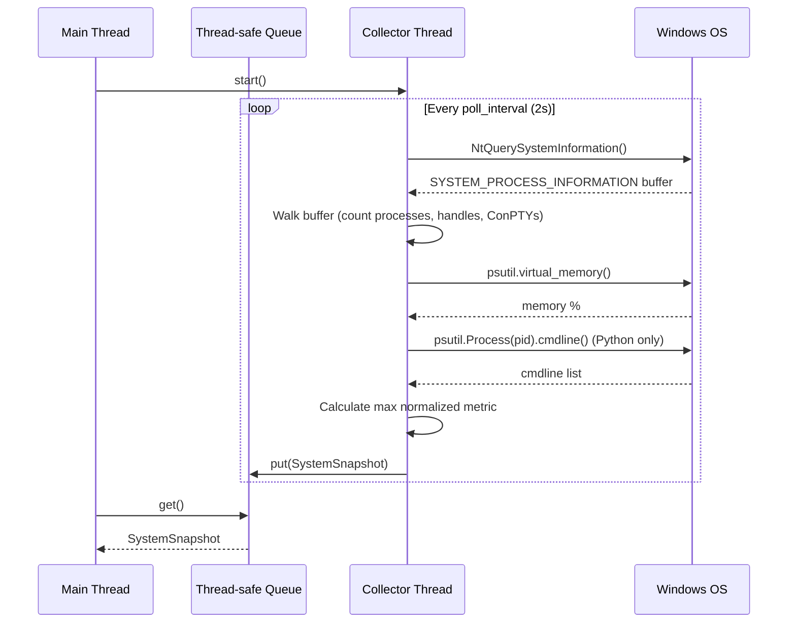

# Issue #4 - Feature: Windows data collector — ConPTY, processes, memory, handles (#4)

## 1. Context & Goal
* **Issue:** #4
* **Objective:** Build a Windows-specific data collector that polls system metrics (ConPTY, processes, memory, handles) via a single `NtQuerySystemInformation` sweep per tick and feeds them to the gauge.
* **Status:** Approved (claude-opus-4-6, 2026-09-02)
* **Related Issues:** #3, #224, #233, #234, #239, #405, #427

### Open Questions
None.

## 2. Proposed Changes

### 2.1 Files Changed

| File | Change Type | Description |
|------|-------------|-------------|
| `src/boostgauge/collector.py` | Add | Abstract base class `DataCollector` and `SystemSnapshot` dataclass |
| `src/boostgauge/collectors/__init__.py` | Add | Package init for platform collectors |
| `src/boostgauge/collectors/windows.py` | Add | Windows implementation using `NtQuerySystemInformation` and `psutil` |
| `tests/unit/test_windows_collector.py` | Add | Unit tests asserting single-call behavior via mocked `ctypes` |
| `tests/integration/test_windows_collector_live.py` | Add | Live cross-checks against `psutil` on the running machine |
| `tests/benchmark/test_windows_collector_perf.py` | Add | Performance benchmarks asserting execution time |

### 2.1.1 Path Validation (Mechanical - Auto-Checked)

Mechanical validation automatically checks:
- All "Modify" files must exist in repository
- All "Delete" files must exist in repository
- All "Add" files must have existing parent directories
- No placeholder prefixes (`src/`, `lib/`, `app/`) unless directory exists

### 2.2 Dependencies

```toml

# No pyproject.toml additions; psutil is already present.
```

### 2.3 Data Structures

```python
from dataclasses import dataclass

@dataclass
class SystemSnapshot:
    timestamp: float
    conpty_count: int
    process_count: int
    memory_percent: float
    handle_count: int
    unleashed_sessions: int
    driver: str  # which metric is hottest
    composite_value: float  # 0-100 normalized
```

### 2.4 Function Signatures

```python

# src/boostgauge/collector.py
import abc
from threading import Thread
from queue import Queue
from typing import Optional

class DataCollector(abc.ABC):
    """Background thread that polls system metrics into a queue."""
    def __init__(self, output_queue: Queue, thresholds: dict, poll_interval: float = 2.0):
        ...

    def start(self) -> None:
        """Start the background polling thread."""
        ...

    def stop(self) -> None:
        """Signal the thread to stop and wait for it."""
        ...

    @abc.abstractmethod
    def _take_snapshot(self) -> SystemSnapshot:
        """Take a single snapshot of the system state."""
        ...

    def _normalize(self, value: float, thresholds: dict) -> float:
        """Map raw value to 0-100 based on yellow/red thresholds."""
        ...

# src/boostgauge/collectors/windows.py
from boostgauge.collector import DataCollector, SystemSnapshot

class WindowsCollector(DataCollector):
    """Windows specific collector utilizing NtQuerySystemInformation."""

    def _take_snapshot(self) -> SystemSnapshot:
        """Sweep the process table exactly once and calculate all metrics."""
        ...
```

### 2.5 Logic Flow (Pseudocode)

```
1. Initialize WindowsCollector(queue, thresholds, poll_interval)
2. start() spawns a background thread running a loop:
   a. Check if stop requested
   b. Sleep for poll_interval (non-blocking wait)
   c. memory_pct = psutil.virtual_memory().percent
   d. Call NtQuerySystemInformation(SystemProcessInformation) via ctypes
   e. Initialize counters: conpty=0, proc=0, handle=0, unleashed=0
   f. Walk the returned buffer structures:
      i. proc += 1
      ii. handle += struct.HandleCount
      iii. if struct.ImageName in ('conhost.exe', 'OpenConsole.exe'): conpty += 1
      iv. if struct.ImageName in ('python.exe', 'pythonw.exe'):
          try:
              cmdline = psutil.Process(struct.ProcessId).cmdline()
              if any(arg.startswith('unleashed-c-') and arg.endswith('.py') for arg in cmdline):
                  unleashed += 1
          except (psutil.NoSuchProcess, psutil.AccessDenied):
              pass (skip row, do not retry)
   g. Calculate gauge_value and driver via normalized-max algorithm
   h. Enqueue SystemSnapshot
3. stop() breaks the loop
```

### 2.6 Technical Approach

* **Module:** `src/boostgauge/collectors/windows.py`
* **Pattern:** Background Thread with Queue, Template Method (Abstract Base Class)
* **Key Decisions:** Strict adherence to ADR 0001. A single `NtQuerySystemInformation` call gathers processes, names, and handles. We avoid `psutil.process_iter` entirely. We only query `cmdline` on specific target processes to keep CPU overhead < 1%.

### 2.7 Architecture Decisions

| Decision | Options Considered | Choice | Rationale |
|----------|-------------------|--------|-----------|
| Sweep mechanism | `psutil.process_iter`, WMI, `NtQuerySystemInformation` | `NtQuerySystemInformation` | Required by ADR 0001. psutil costs 422ms/tick, WMI causes system hangs, direct ctypes call is ~2.2ms. |
| Polling threading | Main thread timer, Background thread | Background thread | Ensures the GUI never stutters waiting for syscalls. Snapshot objects passed via thread-safe queue. |

**Architectural Constraints:**
- Must not use `psutil.process_iter`, `psutil.pids`, or PowerShell subprocesses.
- Must execute all process-table-derived metrics from exactly one sweep per tick.

## 3. Requirements

1. The collector must run on a background thread that pushes `SystemSnapshot` objects to a queue without blocking the main thread.
2. All process-derived metrics (process count, ConPTY count, handle count, unleashed sessions) MUST be gathered from a single `NtQuerySystemInformation` API call per tick.
3. The ConPTY count must accurately represent the number of running `conhost.exe` and `OpenConsole.exe` processes (case-insensitive).
4. The memory percentage must directly reflect `psutil.virtual_memory().percent`.
5. The process count must equal the total number of processes yielded by the single sweep.
6. The handle count must equal the sum of the `HandleCount` field across all processes yielded by the sweep.
7. An unleashed session is counted ONLY if the process name is a Python interpreter AND its `psutil.Process(pid).cmdline()` matches `unleashed-c-*.py`. The `cmdline` is read only for identified Python rows.
8. The collector must gracefully handle permission errors (e.g., `NoSuchProcess`, `AccessDenied`) when querying `cmdline`, simply skipping the process without retrying or halting the tick.
9. The normalized composite metric (`composite_value`) must be calculated using the normalized-max algorithm against provided thresholds (60=yellow, 80=orange, 100=red), with the `driver` field correctly identifying the highest metric.
10. The collector must have < 1% CPU overhead at a 2s polling interval (asserted by a mean `process_time` < 20 ms over 8 ticks).

## 4. Alternatives Considered

| Option | Pros | Cons | Decision |
|--------|------|------|----------|
| `psutil.process_iter` | Clean Pythonic API, easy to read | Iterating and reading handles costs ~422ms (21% CPU), violating performance goals. | **Rejected** |
| WMI / PowerShell | Built-in Windows tools | Spawns processes per tick, slow, can cause system hangs. | **Rejected** |
| Single `NtQuerySystemInformation` via ctypes | Very fast (~2.2ms), handles are included without opening processes | Requires careful C-struct mapping and pointer arithmetic. | **Selected** |

**Rationale:** The selected option is the only one that can meet the < 1% CPU overhead performance requirement for polling the entire process list and summing handles, as codified in ADR 0001.

## 5. Data & Fixtures

### 5.1 Data Sources

| Attribute | Value |
|-----------|-------|
| Source | Windows kernel (NtQuerySystemInformation), psutil |
| Format | C-struct buffer (`SYSTEM_PROCESS_INFORMATION`), Python lists |
| Size | Typically 200-500 process records per tick |
| Refresh | Configurable polling interval (default 2s) |
| Copyright/License | N/A |

### 5.2 Data Pipeline

```
NtQuerySystemInformation ──ctypes parse──► Python list of (PID, Name, Handles) ──filter & calculate──► SystemSnapshot
```

### 5.3 Test Fixtures

| Fixture | Source | Notes |
|---------|--------|-------|
| Mocked `SYSTEM_PROCESS_INFORMATION` buffer | Hardcoded in `tests/fixtures/` | Used to test ctypes parsing logic without executing real syscalls. Contains simulated ConPTY, Python, and normal processes. |

### 5.4 Deployment Pipeline

No external data pipeline. The code ships as part of the standard Python package build process.

## 6. Diagram

### 6.1 Mermaid Quality Gate

**Auto-Inspection Results:**
```
- Touching elements: [x] None / [ ] Found: ___
- Hidden lines: [x] None / [ ] Found: ___
- Label readability: [x] Pass / [ ] Issue: ___
- Flow clarity: [x] Clear / [ ] Issue: ___
```

### 6.2 Diagram



## 7. Security & Safety Considerations

### 7.1 Security

| Concern | Mitigation | Status |
|---------|------------|--------|
| Executing arbitrary code from process names | Process names and cmdlines are treated strictly as read-only data for string matching. | Addressed |

### 7.2 Safety

| Concern | Mitigation | Status |
|---------|------------|--------|
| Buffer overrun in ctypes parsing | Strictly defined `ctypes.Structure` sizes; offset validation against `NextEntryOffset`; safe while-loop bounds checking. | Addressed |
| Crashing on inaccessible processes | Catch `psutil.AccessDenied` and `psutil.NoSuchProcess` when reading cmdlines; skip safely. | Addressed |
| Memory leak in thread | `SYSTEM_PROCESS_INFORMATION` buffer is re-allocated and freed per tick or garbage collected via ctypes. | Addressed |

**Fail Mode:** Fail Closed - If the API call fails or encounters an unexpected OS error, the thread catches it, logs the exception, and continues to the next tick rather than crashing the application.

**Recovery Strategy:** Next tick will attempt a fresh sweep.

## 8. Performance & Cost Considerations

### 8.1 Performance

| Metric | Budget | Approach |
|--------|--------|----------|
| CPU Overhead | < 1% per tick | Single `NtQuerySystemInformation` call instead of `psutil.process_iter`; cmdline read only on identified Python rows. |
| Memory | < 5MB overhead | Reusing or properly freeing ctypes buffers; pushing small immutable dataclasses to the queue. |
| API Calls | 1 walk per tick | Adherence to ADR 0001 single-sweep mandate. |

**Bottlenecks:** Calling `psutil.Process(pid).cmdline()` is expensive. Restricted specifically to rows already identified as Python processes.

### 8.2 Cost Analysis

| Resource | Unit Cost | Estimated Usage | Monthly Cost |
|----------|-----------|-----------------|--------------|
| N/A | $0 | 0 | $0 |

**Cost Controls:**
- [x] Local application execution only; no cloud usage.

**Worst-Case Scenario:** A runaway script spawns 10,000 Python processes, causing 10,000 `cmdline` lookups. The tick will take longer (a few hundred ms), but will not hang the OS like WMI would, and runs on a background thread so the GUI remains responsive.

## 9. Legal & Compliance

| Concern | Applies? | Mitigation |
|---------|----------|------------|
| PII/Personal Data | No | We collect system metrics only; process paths might contain usernames, but data is kept strictly local in memory and never transmitted. |
| Third-Party Licenses | Yes | Ensure `psutil` license (BSD) is compatible. |
| Terms of Service | N/A | No external services. |
| Data Retention | Yes | `SystemSnapshot` objects are consumed and discarded immediately by the GUI; peaks are held in memory. |
| Export Controls | N/A | Local system monitoring only. |

**Data Classification:** Confidential (Local memory only, never written to disk or transmitted).

**Compliance Checklist:**
- [x] No PII stored without consent
- [x] All third-party licenses compatible with project license
- [x] External API usage compliant with provider ToS
- [x] Data retention policy documented

## 10. Verification & Testing

**Testing Philosophy:** Follow `docs/design/0001-test-strategy.md`. Strive for 100% automated test coverage. No `tkinter.Tk()` instances in tests. Explicit literal assertions for specific values.

### 10.0 Test Plan (TDD - Complete Before Implementation)

| Test ID | Test Description | Expected Behavior | Status |
|---------|------------------|-------------------|--------|
| T010 | Mocked sweep produces valid snapshot | Snapshot values match expected parsed payload | RED |
| T020 | Missing/access denied processes are skipped | Missing processes do not abort the tick | RED |
| T030 | Normalization max algorithm | Driver and composite value correctly reflect peak metric | RED |
| T040 | Live cross-check of metrics | NtQuerySystemInformation results equal psutil totals | RED |
| T050 | Performance benchmark | Collector takes < 20ms over 8 ticks | RED |
| T060 | Source code assertion | No `psutil.process_iter` or `Get-Process` found in module | RED |

**Coverage Target:** 100% for `src/boostgauge/collectors/windows.py`

**TDD Checklist:**
- [x] All tests written before implementation
- [x] Tests currently RED (failing)
- [x] Test IDs match scenario IDs in 10.1
- [x] Test file created at: `tests/unit/test_windows_collector.py`

### 10.1 Test Scenarios

| ID | Scenario | Type | Input | Expected Output | Pass Criteria |
|----|----------|------|-------|-----------------|---------------|
| 010 | Happy path object creation and metric extraction via mocked ctypes (REQ-2) | Auto | Mocked buffer containing 10 processes, 2 ConPTY, 1 Unleashed | `SystemSnapshot` | `conpty_count == 2`, `process_count == 10`, `handle_count == X` |
| 020 | ConPTY process counting strictly case-insensitive (REQ-3) | Auto | Mocked buffer with "CoNHoST.eXe" | `SystemSnapshot` | `conpty_count == 1` |
| 030 | Memory percentage read passes directly through (REQ-4) | Auto | Mocked `psutil.virtual_memory` returning 45.0 | `SystemSnapshot` | `memory_percent == 45.0` |
| 040 | Process count is exact row length of sweep buffer (REQ-5) | Auto | Mocked buffer of 14 processes | `SystemSnapshot` | `process_count == 14` |
| 050 | Total handle count matches exact sum of rows (REQ-6) | Auto | Mocked buffer where handle sum is 8500 | `SystemSnapshot` | `handle_count == 8500` |
| 060 | Unleashed matching ignores non-Python processes with matching string (REQ-7) | Auto | Mocked buffer where "notepad.exe" has cmdline "unleashed-c-1.py" | `SystemSnapshot` | `unleashed_sessions == 0` |
| 070 | Graceful degradation on AccessDenied during cmdline read (REQ-8) | Auto | Python process that throws `AccessDenied` | `SystemSnapshot` | Tick completes successfully, skipping that session |
| 080 | Composite value calculation selects correct highest driver (REQ-9) | Auto | ConPTY 50%, Memory 75%, Processes 20%, Handles 10% | `SystemSnapshot` | `composite_value == 75.0` and `driver == 'memory_percent'` |
| 090 | Live cross check of process counting against psutil (REQ-5) | Auto-Live | Live Windows OS | Test Result | Process count matches `psutil.process_iter()` count ±1 |
| 100 | Live cross check of ConPTY counting against psutil (REQ-3) | Auto-Live | Live Windows OS | Test Result | ConPTY count matches `psutil.process_iter()` console hosts ±1 |
| 110 | Live cross check of handle counting against psutil (REQ-6) | Auto-Live | Live Windows OS | Test Result | Handle count within 1% of psutil `num_handles` sum |
| 120 | Background threading executes ticks without blocking (REQ-1) | Auto | Collector initialized with 0.01s poll interval | Queue Output | At least 3 snapshots received in queue after 0.05s |
| 130 | CPU Performance baseline (REQ-10) | Auto-Live | Benchmark runner over 8 ticks | Time Measurement | Mean `process_time` < 20ms |

### 10.2 Test Commands

```bash

# Run all automated tests
poetry run pytest tests/unit/test_windows_collector.py tests/integration/test_windows_collector_live.py -v

# Run live integration tests and benchmarks
poetry run pytest tests/integration/test_windows_collector_live.py tests/benchmark/test_windows_collector_perf.py -v -m live
```

### 10.3 Manual Tests (Only If Unavoidable)

N/A - All scenarios automated.

## 11. Risks & Mitigations

| Risk | Impact | Likelihood | Mitigation |
|------|--------|------------|------------|
| C-Struct memory layout changes across Windows versions | High | Low | `SYSTEM_PROCESS_INFORMATION` is a stable, well-known kernel struct; our test suite includes a live cross-check (`T040`) against psutil to detect silent miscounts. |
| API execution permission issues on non-elevated user | Low | Low | Handles and enumerations are accessible to standard users for their own session; test `T020` ensures errors degrade gracefully (skipping rows). |
| Race conditions in cmdline extraction | Low | High | PIDs can recycle between enumeration and cmdline read; `AccessDenied` and `NoSuchProcess` exceptions are explicitly caught and ignored. |

## 12. Definition of Done

### Code
- [ ] Implementation complete and linted
- [ ] Code comments reference this LLD

### Tests
- [ ] All test scenarios pass
- [ ] Test coverage meets threshold

### Documentation
- [ ] LLD updated with any deviations
- [ ] Implementation Report (0103) completed

### Review
- [ ] Code review completed
- [ ] User approval before closing issue

### 12.1 Traceability (Mechanical - Auto-Checked)

Mechanical validation automatically checks:
- Every file mentioned in this section must appear in Section 2.1
- Every risk mitigation in Section 11 should have a corresponding function in Section 2.4 (warning if not)

---

## Appendix: Review Log

### Summary

| Review | Date | Verdict | Key Issue |
|--------|------|---------|-----------|


### Review Summary

| Review | Date | Verdict | Model |
|--------|------|---------|-------|
| 1 | 2026-09-02 | APPROVED | `claude-opus-4-6` |

**Final Status:** APPROVED