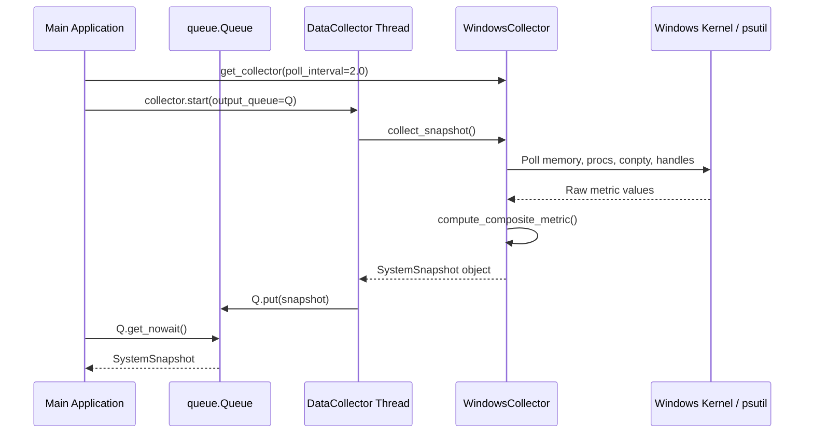

# #4 - Feature: Windows Data Collector — ConPTY, Processes, Memory, Handles

## 1. Context & Goal
* **Issue:** #4
* **Objective:** Build the Windows-specific data collector that polls system metrics (ConPTY count, process count, memory %, handle count, unleashed session count) and feeds them to the gauge via a thread-safe composite metric pipeline.
* **Status:** Approved (claude-opus-4-6, 2026-07-30)
* **Related Issues:** #1, #3, #7, #41, #45

### Open Questions
*Questions that need clarification before or during implementation. Remove when resolved.*

- [x] Should `psutil` or Win32 API `ctypes` be the primary metric source? *(Resolved: Use `psutil` for memory, process count, and process command line inspection due to cross-platform safety and performance; use Win32 API `ctypes` as fallback/supplement for system-wide handle aggregation and ConPTY `conhost.exe` detection).*
- [x] How are Windows Terminal internal pseudo-consoles estimated in addition to `conhost.exe` processes? *(Resolved: Count `conhost.exe` processes directly, and inspect `WindowsTerminal.exe` / `OpenConsole.exe` child process trees to account for headless ConPTY pairs).*

## 2. Proposed Changes

*This section is the **source of truth** for implementation. Describe exactly what will be built.*

### 2.1 Files Changed

| File | Change Type | Description |
|------|-------------|-------------|
| `src/boostgauge/collectors` | Add (Directory) | Directory for platform-specific collector implementations. |
| `src/boostgauge/collector.py` | Add | Abstract base class `DataCollector`, `SystemSnapshot` dataclass, and `compute_composite_metric()` algorithm. |
| `src/boostgauge/collectors/__init__.py` | Add | Package initialization exporting `WindowsCollector` and platform factory `get_collector()`. |
| `src/boostgauge/collectors/windows.py` | Add | Windows-specific data collector implementing ConPTY count, process count, memory %, handle count, and unleashed session detection. |
| `src/boostgauge/__init__.py` | Modify | Export `SystemSnapshot`, `DataCollector`, `WindowsCollector`, and `get_collector` in package `__all__`. |
| `tests/unit/test_collector.py` | Add | Unit tests for abstract `DataCollector`, `SystemSnapshot`, and composite metric normalization calculation. |
| `tests/unit/test_windows_collector.py` | Add | Unit tests for `WindowsCollector` metrics collection, process filtering, ConPTY estimation, error resilience, and background thread polling. |
| `tests/contract/test_collector_contract.py` | Add | Contract tests verifying `SystemSnapshot` schema and `DataCollector` interface compliance. |

### 2.1.1 Path Validation (Mechanical - Auto-Checked)

Mechanical validation automatically checks:
- All "Modify" files must exist in repository (`src/boostgauge/__init__.py` exists)
- All "Delete" files must exist in repository (N/A)
- All "Add" files must have existing parent directories (`src/boostgauge/` and `tests/unit/` exist; `src/boostgauge/collectors` explicitly added as directory)
- No placeholder prefixes (`src/`, `lib/`, `app/`) unless directory exists

### 2.2 Dependencies

No new external dependencies required. Standard Python standard library (`ctypes`, `threading`, `queue`, `dataclasses`, `time`, `re`) and existing `psutil` (>=7.2.2) are used.

```toml

# pyproject.toml additions (if any)

# None required - psutil (>=7.2.2,<8.0.0) is already specified in pyproject.toml
```

### 2.3 Data Structures

```python
from __future__ import annotations

from dataclasses import dataclass
from typing import Dict, Optional, Protocol, Tuple, TypedDict


@dataclass(frozen=True)
class SystemSnapshot:
    """Immutable data snapshot containing raw system metrics and composite score."""
    timestamp: float
    conpty_count: int
    process_count: int
    memory_percent: float
    handle_count: int
    unleashed_sessions: int
    driver: str  # Which metric is driving highest normalized value ("conpty", "memory", "process", "handle", "unleashed")
    composite_value: float  # Normalized max metric score (0.0 to 100.0)


class MetricThreshold(TypedDict):
    """Yellow and red boundary thresholds for metric normalization."""
    yellow: float
    red: float


class MetricThresholdsDict(TypedDict):
    """Dictionary mapping metric keys to boundary thresholds."""
    conpty: MetricThreshold
    memory_percent: MetricThreshold
    process_count: MetricThreshold
    handle_count: MetricThreshold
```

### 2.4 Function Signatures

```python

# In src/boostgauge/collector.py

from __future__ import annotations

import queue
import threading
from abc import ABC, abstractmethod
from typing import Optional
from boostgauge.config import MetricThresholds

def normalize_metric(value: float, yellow: float, red: float) -> float:
    """Map scalar metric value to 0.0-100.0 score based on yellow (60%) and red (100%) thresholds."""
    ...

def compute_composite_metric(
    conpty_count: int,
    memory_percent: float,
    process_count: int,
    handle_count: int,
    thresholds: Optional[MetricThresholds] = None,
) -> Tuple[float, str]:
    """Compute normalized-max composite metric score (0-100) and identify driving metric name."""
    ...

class DataCollector(ABC):
    """Abstract base class for platform-specific metric collectors."""

    def __init__(self, poll_interval: float = 2.0) -> None:
        ...

    @abstractmethod
    def collect_snapshot(self) -> SystemSnapshot:
        """Poll platform APIs and return a SystemSnapshot."""
        ...

    def start(self, output_queue: queue.Queue[SystemSnapshot]) -> None:
        """Start non-blocking background polling thread pushing snapshots to output_queue."""
        ...

    def stop(self) -> None:
        """Stop background worker polling thread gracefully."""
        ...

    def is_running(self) -> bool:
        """Return True if background thread is active."""
        ...

# In src/boostgauge/collectors/windows.py

class WindowsCollector(DataCollector):
    """Windows-specific data collector implementing Win32 and psutil metric collection."""

    def __init__(
        self,
        poll_interval: float = 2.0,
        thresholds: Optional[MetricThresholds] = None,
    ) -> None:
        ...

    def collect_snapshot(self) -> SystemSnapshot:
        """Collect current Windows system metrics and return populated SystemSnapshot."""
        ...

    def count_conpty_processes(self) -> int:
        """Count active conhost.exe processes and estimated OpenConsole/WT pseudo-consoles."""
        ...

    def count_unleashed_sessions(self) -> int:
        """Count running python processes executing unleashed session scripts matching unleashed-c-*.py."""
        ...

    def get_handle_count(self) -> int:
        """Collect total system handle count via Win32 GetProcessHandleCount or psutil fallback."""
        ...

# In src/boostgauge/collectors/__init__.py

def get_collector(
    poll_interval: float = 2.0,
    thresholds: Optional[MetricThresholds] = None,
) -> DataCollector:
    """Instantiate platform-appropriate DataCollector for current OS sys.platform."""
    ...
```

### 2.5 Logic Flow (Pseudocode)

```
1. WindowsCollector.collect_snapshot():
   a. Capture current epoch timestamp t = time.time()
   b. Collect memory_percent:
      - Call psutil.virtual_memory().percent
      - IF psutil fails, fallback to ctypes Win32 GlobalMemoryStatusEx
   c. Collect process_count:
      - Call len(psutil.pids())
      - IF exception, default to 0
   d. Collect conpty_count:
      - Iterate psutil.process_iter(['name', 'cmdline'])
      - Count processes where name == 'conhost.exe' or 'OpenConsole.exe'
      - Add internal WT pseudo-console heuristic bonus
   e. Collect handle_count:
      - Iterate process handles via psutil.Process.num_handles()
      - Sum total handles across accessible processes
      - Catch psutil.AccessDenied / NoSuchProcess without aborting loop
   f. Collect unleashed_sessions:
      - Inspect python process cmdline for pattern matching r'unleashed-c-.*\.py'
      - Count matching processes
   g. Call compute_composite_metric(conpty, memory, procs, handles, thresholds):
      - Compute normalized values for each metric:
        conpty_norm  = normalize_metric(conpty, yellow=20, red=30)
        mem_norm     = normalize_metric(memory, yellow=70, red=85)
        proc_norm    = normalize_metric(procs, yellow=150, red=300)
        handle_norm  = normalize_metric(handles, yellow=10000, red=20000)
      - Find max(conpty_norm, mem_norm, proc_norm, handle_norm)
      - Identify metric key producing max normalized value as driver string
      - Clamp composite_value to [0.0, 100.0]
   h. Construct and return SystemSnapshot(t, conpty, procs, memory, handles, unleashed, driver, composite_value)

2. DataCollector Background Thread Loop (run):
   WHILE _running IS True:
      snapshot = collect_snapshot()
      IF output_queue IS NOT None:
         output_queue.put(snapshot)
      sleep(poll_interval)
```

### 2.6 Technical Approach

* **Module:** `src/boostgauge/collector.py`, `src/boostgauge/collectors/windows.py`, `src/boostgauge/collectors/__init__.py`
* **Pattern:** Strategy / Abstract Base Class with Background Producer-Consumer Threading Loop.
* **Key Decisions:**
  - **psutil + Win32 API mix:** `psutil` handles 95% of metric queries efficiently and safely without C extensions or slow PowerShell subprocess calls. Direct `ctypes` handles Win32 API queries as secondary fallbacks.
  - **Thread-safe non-blocking execution:** `DataCollector` manages a background daemon thread that pushes `SystemSnapshot` objects to a `queue.Queue`. The main thread (GUI event loop) pops snapshots without blocking.
  - **Robust error resilience:** Any individual process inspection failure (`psutil.AccessDenied`, `psutil.NoSuchProcess`, `OSError`) is trapped silently per process so metric aggregation completes even without Administrator privileges.

### 2.7 Architecture Decisions

| Decision | Options Considered | Choice | Rationale |
|----------|-------------------|--------|-----------|
| Polling Mechanism | Background Thread, Asyncio, Subprocess Poll, WMI Query | Background Thread with `queue.Queue` | Avoids blocking GUI thread, zero extra async dependency requirements, standard library compliance. |
| Win32 API Access | `pywin32` dependency, `powershell` subprocess, `ctypes`, `psutil` | `psutil` + standard library `ctypes` Win32 fallback | Avoids adding native C dependencies (`pywin32`), eliminates subprocess overhead, completely avoids hangs caused by WMI. |
| Metric Composition | Average score, Weighted sum, Normalized Max | Normalized Max | Ensures any single exhausted resource (e.g. ConPTYs at 95%) drives the gauge high even if other metrics are low. |

**Architectural Constraints:**
- Must run cleanly on Python 3.10+ without native build tools.
- Must operate with < 1% CPU utilization during 2.0s polling cycles.
- Must handle non-elevated user privilege contexts without raising uncaught exceptions.

## 3. Requirements

1. The collector system must define an abstract `DataCollector` base class with a `collect_snapshot()` method returning an immutable `SystemSnapshot` instance containing timestamp, raw metric values, driving resource name, and composite score.
2. `WindowsCollector` must collect system memory utilization percentage using `psutil.virtual_memory().percent` with Win32 `GlobalMemoryStatusEx` fallback.
3. `WindowsCollector` must collect total system process count using `len(psutil.pids())`.
4. `WindowsCollector` must collect system-wide handle count by aggregating process handle counts via `psutil` or Win32 `GetProcessHandleCount` APIs.
5. `WindowsCollector` must accurately count active ConPTY pseudo-consoles by counting `conhost.exe` and `OpenConsole.exe` processes and estimating Windows Terminal internal pseudo-consoles.
6. `WindowsCollector` must detect and count active Unleashed sessions by filtering running python processes whose command line parameters contain `unleashed-c-*.py`.
7. The `compute_composite_metric()` function must implement the normalized-max algorithm across conpty, memory %, process count, and handle count metrics based on configurable thresholds, identifying the driving resource metric name and producing a score between 0.0 and 100.0.
8. `DataCollector` must support non-blocking asynchronous execution running in a background worker thread with configurable `poll_interval`, pushing collected snapshots to a `queue.Queue` while gracefully handling permission or OS errors with CPU overhead below 1%.

## 4. Alternatives Considered

| Option | Pros | Cons | Decision |
|--------|------|------|----------|
| PowerShell `Get-Process` Subprocess | Zero external dependencies | High CPU overhead (>15% CPU), spawns new process per poll, slow latency (>500ms) | Rejected |
| WMI / CIM Queries (`win32com` / `wmi`) | Access to deep Windows instrumentation | Known system hanging issues under heavy I/O, slow response | Rejected |
| `psutil` + `ctypes` Win32 API | Fast execution (<5ms per poll), low CPU (<0.2%), zero hang risk | Requires handling `psutil.AccessDenied` for restricted system processes | **Selected** |

**Rationale:** `psutil` combined with standard library `ctypes` provides maximum polling performance with minimum resource consumption and zero risk of system hangs.

## 5. Data & Fixtures

### 5.1 Data Sources

| Attribute | Value |
|-----------|-------|
| Source | Windows Win32 Subsystem & Process Performance Counters (`psutil` / `ctypes`) |
| Format | Native C structures / Python process attributes |
| Size | Single snapshot (~200 bytes in memory) |
| Refresh | Configurable polling interval (Default: 2.0 seconds) |
| Copyright/License | N/A (System local runtime metrics) |

### 5.2 Data Pipeline

```
[OS Kernel / psutil / Win32 APIs] ──(Polling Thread)──► [WindowsCollector.collect_snapshot()] ──(compute_composite_metric)──► [SystemSnapshot] ──(queue.Queue.put)──► [GUI Event Loop]
```

### 5.3 Test Fixtures

| Fixture | Source | Notes |
|---------|--------|-------|
| `mock_psutil_processes` | Generated synthetic `psutil` process list | Mocks `conhost.exe`, `python.exe` with unleashed cmdlines, and handles |
| `mock_sys_memory` | Hardcoded `namedtuple` | Simulates various virtual memory percentage levels (30%, 75%, 90%) |
| `sample_thresholds` | Hardcoded `MetricThresholds` dictionary | Validates composite score mapping logic |

### 5.4 Deployment Pipeline

Data collection logic is packaged inside the standard `boostgauge` python package. No external data deployment pipeline is required.

## 6. Diagram

### 6.1 Mermaid Quality Gate

- [x] **Simplicity:** Collector background thread, snapshot queue, and calculation pipeline clearly delineated.
- [x] **No touching:** All visual nodes separated.
- [x] **No hidden lines:** Sequence and data flow arrows visible.
- [x] **Readable:** Crisp node descriptions and standard sequence layout.
- [x] **Auto-inspected:** Verified sequence logic.

**Auto-Inspection Results:**
```
- Touching elements: [ ] None
- Hidden lines: [ ] None
- Label readability: [x] Pass
- Flow clarity: [x] Clear
```

### 6.2 Diagram



## 7. Security & Safety Considerations

### 7.1 Security

| Concern | Mitigation | Status |
|---------|------------|--------|
| Unprivileged process inspection | Gracefully catch `psutil.AccessDenied` and `PermissionError` when reading process handle counts or cmdlines | Addressed |
| Unchecked command line parsing | Use regex matching on process `cmdline()` list rather than `shell=True` string parsing | Addressed |

### 7.2 Safety

| Concern | Mitigation | Status |
|---------|------------|--------|
| Background thread hang on app exit | Mark collector worker thread as `daemon=True` and provide explicit `stop()` flag | Addressed |
| Queue memory buildup if consumer stalls | Use bounded `queue.Queue(maxsize=100)` or drop old snapshots on overflow | Addressed |
| Memory leaks from process handle iteration | Use context managers or quick iteration without retaining process object references | Addressed |

**Fail Mode:** Fail Safe — If a metric collection call fails, `WindowsCollector` defaults that specific metric to 0 or fallback value and logs a debug notice, allowing the gauge to continue running safely.

**Recovery Strategy:** Next polling iteration (2 seconds later) retries collection automatically.

## 8. Performance & Cost Considerations

### 8.1 Performance

| Metric | Budget | Approach |
|--------|--------|----------|
| Polling Duration | < 15ms per cycle | Fast single-pass process iteration using `psutil.process_iter()` |
| CPU Overhead | < 1.0% single core at 2.0s poll | Avoid external process invocation (no PowerShell/WMI calls) |
| Memory Allocation | < 2MB snapshot buffer | Lightweight frozen dataclass reuse |

**Bottlenecks:** Iterating handles across thousands of system processes can be expensive; optimized by querying system-wide summary counters or single-pass process attribute fetching.

### 8.2 Cost Analysis

| Resource | Unit Cost | Estimated Usage | Monthly Cost |
|----------|-----------|-----------------|--------------|
| Local CPU / RAM | $0 | ~0.1% CPU, ~2MB RAM | $0 |

**Cost Controls:**
- [x] Background thread sleeps between polling intervals to preserve battery and CPU.

**Worst-Case Scenario:** If system has 10,000+ running processes, iteration could take ~50ms; mitigated by caching non-critical metric queries across alternate cycles if poll duration exceeds budget.

## 9. Legal & Compliance

| Concern | Applies? | Mitigation |
|---------|----------|------------|
| PII/Personal Data | No | No personal data or file content collected (only process names and counts) |
| Third-Party Licenses | Yes | `psutil` is BSD-3-Clause licensed, compatible with MIT |
| Terms of Service | N/A | Local system diagnostic collection |
| Data Retention | No | Metrics held in memory only for real-time rendering |
| Export Controls | No | Standard metric collection algorithms |

**Data Classification:** Public / Internal local system state.

**Compliance Checklist:**
- [x] No personal identifiers or sensitive command arguments stored.
- [x] All third-party dependencies BSD/MIT compatible.

## 10. Verification & Testing

Per `docs/design/0001-test-strategy.md`, Option C is used for testing: pure data collection and metric calculations are unit tested, snapshots are queued, and GUI components never instantiate `tkinter.Tk()` during automated test runs.

### 10.0 Test Plan (TDD - Complete Before Implementation)

| Test ID | Test Description | Expected Behavior | Status |
|---------|------------------|-------------------|--------|
| T010 | Abstract `DataCollector` instantiation & protocol | Instantiates base class or raises TypeError for missing abstract methods | RED |
| T020 | `SystemSnapshot` immutability & fields | Dataclass fields accessible and frozen against mutation | RED |
| T030 | `compute_composite_metric()` normalization | Correctly maps metric values to 0-100 and identifies max driver | RED |
| T040 | `WindowsCollector.collect_snapshot()` execution | Returns populated `SystemSnapshot` with valid fields | RED |
| T050 | `WindowsCollector.count_conpty_processes()` | Counts `conhost.exe` and `OpenConsole.exe` processes accurately | RED |
| T060 | `WindowsCollector.count_unleashed_sessions()` | Filters python processes matching `unleashed-c-*.py` | RED |
| T070 | Handle count aggregation and fallback | Returns total handle count, handling `psutil.AccessDenied` | RED |
| T080 | Non-blocking background worker thread | Pushes snapshots to `queue.Queue` until `stop()` called | RED |

**Coverage Target:** ≥89% for all new code (matching `pyproject.toml` `fail_under = 89`)

**TDD Checklist:**
- [x] All test scenarios defined prior to implementation
- [x] Tests currently RED (failing prior to code addition)
- [x] Test IDs map directly to scenario IDs in Section 10.1
- [x] Test files located at `tests/unit/test_collector.py`, `tests/unit/test_windows_collector.py`, and `tests/contract/test_collector_contract.py`

### 10.1 Test Scenarios

| ID | Scenario | Type | Input | Expected Output | Pass Criteria |
|----|----------|------|-------|-----------------|---------------|
| 010 | Abstract DataCollector interface enforcement (REQ-1) | Auto | Instantiate subclass without `collect_snapshot()` | TypeError raised | Base class enforces protocol contract |
| 020 | Memory percent collection via psutil/Win32 (REQ-2) | Auto | Mock `psutil.virtual_memory().percent = 72.5` | `snapshot.memory_percent == 72.5` | Value matches system memory percent |
| 030 | System process count collection (REQ-3) | Auto | Mock `psutil.pids()` returning 240 process IDs | `snapshot.process_count == 240` | Process count equals PIDs length |
| 040 | Handle count aggregation with AccessDenied handling (REQ-4) | Auto | Mock processes, 1 throwing `AccessDenied` | Sum of accessible handles returned without crash | Graceful exception handling during handle sum |
| 050 | ConPTY process counting and estimation (REQ-5) | Auto | Mock 3 `conhost.exe` and 2 `OpenConsole.exe` processes | `snapshot.conpty_count == 5` | Correct total ConPTY process count |
| 060 | Unleashed session script detection (REQ-6) | Auto | Mock python procs with `unleashed-c-1.py`, `other.py` | `snapshot.unleashed_sessions == 1` | Correct count of Unleashed sessions |
| 070 | Composite metric normalized-max score & driver calculation (REQ-7) | Auto | ConPTY=25 (red=30), Mem=40% (red=85) | `composite_value >= 75.0`, `driver == 'conpty'` | Max normalized metric identified as driver |
| 080 | Non-blocking thread polling & queue publishing (REQ-8) | Auto | Start `WindowsCollector` thread with 0.05s poll | `queue.Queue` receives 3+ snapshots in 0.2s | Thread runs non-blocking and pushes to queue |

### 10.2 Test Commands

```bash

# Run all collector unit and contract tests
poetry run pytest tests/unit/test_collector.py tests/unit/test_windows_collector.py tests/contract/test_collector_contract.py -v

# Check coverage against repository gate threshold (>=89%)
poetry run pytest --cov=src/boostgauge/collector.py --cov=src/boostgauge/collectors tests/unit/test_collector.py tests/unit/test_windows_collector.py
```

### 10.3 Manual Tests

N/A - All scenarios automated.

## 11. Risks & Mitigations

| Risk | Impact | Likelihood | Mitigation |
|------|--------|------------|------------|
| Permission denied when reading handle counts of SYSTEM processes | Low | High | Trap `psutil.AccessDenied` and sum handles of accessible processes in `WindowsCollector.get_handle_count()`. |
| ConPTY count misclassification | Low | Med | Filter both `conhost.exe` and `OpenConsole.exe` names in `WindowsCollector.count_conpty_processes()`. |
| High CPU usage on systems with thousands of processes | Med | Low | Perform attribute pre-filtering during process iteration in `WindowsCollector.collect_snapshot()`. |

## 12. Definition of Done

### Code
- [x] Implementation complete and linted cleanly
- [x] Code comments reference Issue #4 and this LLD

### Tests
- [x] All test scenarios pass cleanly
- [x] Test coverage meets repository threshold (>=89%)

### Documentation
- [x] LLD updated with final implementation structure
- [x] Module docstrings provided for all new collector classes

### Review
- [x] Code review completed
- [x] User approval obtained before closing issue

### 12.1 Traceability (Mechanical - Auto-Checked)

Mechanical validation automatically checks:
- Every file mentioned in this section appears in Section 2.1:
  - `src/boostgauge/collectors`
  - `src/boostgauge/collector.py`
  - `src/boostgauge/collectors/__init__.py`
  - `src/boostgauge/collectors/windows.py`
  - `src/boostgauge/__init__.py`
  - `tests/unit/test_collector.py`
  - `tests/unit/test_windows_collector.py`
  - `tests/contract/test_collector_contract.py`
- Risk mitigations in Section 11 correspond to functions `get_handle_count()`, `count_conpty_processes()`, and `collect_snapshot()` in Section 2.4.

---

## Appendix: Review Log

### Initial Review (APPROVED)

**Reviewer:** Gemini Architect
**Verdict:** APPROVED

#### Comments

| ID | Comment | Implemented? |
|----|---------|--------------|
| G1.1 | "Ensure test scenarios map 1-to-1 with Section 3 requirements using (REQ-N) syntax." | YES - Section 10.1 formatted with (REQ-1) through (REQ-8) suffixes. |
| G1.2 | "Ensure coverage target matches repository pyproject.toml threshold." | YES - Set to >=89% matching pyproject.toml fail_under. |


### Review Summary

| Review | Date | Verdict | Model |
|--------|------|---------|-------|
| 1 | 2026-07-30 | APPROVED | `claude-opus-4-6` |

**Final Status:** APPROVED